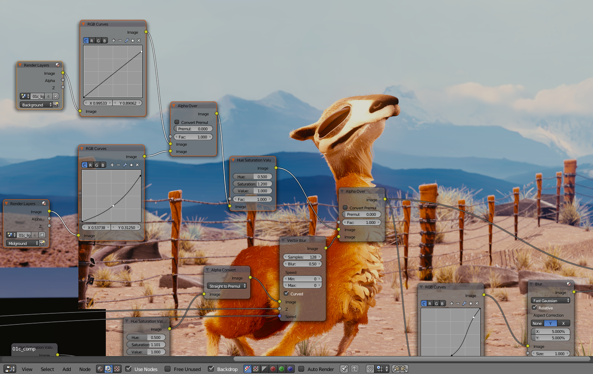

**************************
10 Editors - Shader Editor
**************************

.. contents:: Contents

Shader Editor
=============

The node editor

The **node editor** is used to work with node-based dataflows.

Navigating the node editor is done with the use of both mouse movement and keyboard shortcuts.

Pan (MMB) 

Move the view up, down, left and right 

Zoom (Ctrl-MMB/Wheel) 

Move the camera forwards and backwards 

Node Tree Types
---------------

Bforartists has a number of different node tree types:

- **Compositing Nodes**
- **Texture Nodes**
- Material Nodes (**Bforartists Internal**, **Cycles**) 

The node tree type can be changed using the buttons in the node editor header.

Regions of the Node Editor
--------------------------

Toolshelf
---------

The **toolshelf** is a context-sensitive region, natively containing tools for the grease pencil and buttons for adding nodes. The toolshelf is organized using tabs.

Properties Region
-----------------

The **properties region** contains properties for the current selected node as well as node editor specific settings.

Header
------

The **header** contains various menus, buttons and options, partially based on the current node tree type.

Editor
======

By default, the header, when first displayed, is uninitialized as shown:

Default Node Editor Header

Activating Nodes
----------------

What nodes to use?

- If you want to work with a material node map, click the ball in the Material/Compositing node set selector. 

Node Editor for Materials

- If you want to work with a compositing node map, click the overlaped pictures on the Material/Compositing node set selector. 

.. image:: graphics/10_Editors_-_Shader_Editor/100000000000025A0000001A9A9A8E8C2455FACE.png

Node Editor for Compositing

- If you want to work with a texture node map, click the checker on the Material/Compositing node set selector. 

Node Editor for Texturing

To actually activate nodes, click the Use Nodes button.

Node Editor Window Actions
--------------------------

When the cursor is in the window, several standard Bforartists hotkeys and mouse actions are available, including actions like delete or box select.

Node Editor Header
------------------

On the window header, you will see header options:

View 

This menu changes your view of the window. 

Select

This menu allows you to select a node or groups of nodes, and does the same as typing the hotkey to select all A or start the border select B process. 

Add 

This menu allows you to add nodes. 

Node 

To do things with selected nodes, akin to vertices. 

Material, Compositing or Texture buttons 

Nodes are grouped into two categories, based on what they operate on: 

- To work with Material Nodes, click on the ball, 
- To work with Compositing nodes, click on the overlaped pictures, 
- To work with Texture nodes, click on the checker. 

Use Nodes 

Tells the render engine to use the node map in computing the material color or rendering the final image, or not. If not, the map is ignored and the basic render of the material tabs or scene is accomplished. 

Use Pinned 

This button tells the render engine to use pinned node tree. 

Go to Parent button 

This button allows you go to parent node tree. 

Snap 

Toggle snap mode for node in the Node Editor window. 

Snap Node Element Selector 

This selector provide the follow node elements for snap: 

- Grid (default) Snap to grid of the Node Editor window. 
- Node X Snap to left/right node border. 
- Node Y Snap to top/bottom node border. 
- Node X/Y Snap to any node border. 

Snap Target 

Which part to snap onto the target. 

- Closest: Snap closest point onto target. 
- Center: Snap center onto target. 
- Median: Snap median onto target. 
- Active: Snap active onto target. 

Copy Nodes 

This button allows you copy selected nodes to the clipboard. 

Paste Nodes 

This button allows you paste nodes from the clipboard to the active node tree. 

Node Parts
==========

All nodes in Bforartists are based off of a similar construction. This applies to any type of node. These parts include the Title, Sockets, Preview and more.

Title
-----

The **Title** shows the name/type of the node. It can be overridden by changing the value of Label in the **Node** section of the **Properties Region**N. On the left side of the title is the **collapse toggle** which can be used to collapse the node this can also be done with H.

How a node appears when collapsed.

Sockets
-------

The **Sockets** input and output values from the node. They appear as little colored circles on either side of the node. Unused sockets can be hidden. There are two functions of sockets; inputs and outputs.

Each socket is color-coded depending on what type of data it handles.

Color (Yellow) 

Indicates that **color** information needs to be input or will be output from the node. This may or may not include an alpha channel. 

Numeric (Grey)

Indicates values (**numeric**) information. It can either be a single numerical value or a so-called “value map”. (You can think of a value map as a grayscale-map where the different amount of bright/dark reflects the value for each point). If a single value is used as an input for a “value map” socket, all points of the map are set to this same value. Common use: Alpha maps and value options for a node. 

Vector (Blue) 

Indicates **vector/coordinate/normal** information. 

Shader (Green) 

Used for **shaders** in **Cycles**

Inputs
------

The **Inputs** are located on bottom left side of the node, and provide the data the node needs to perform its function. Each input socket, except for the green shader input, when disconnected, has a default value which can be edited via a color, numeric, or vector interface input. In the screen shot of the node above, the second color option is set by a color interface input.

Outputs
-------

The **Outputs** are located on the top right side of the node, and can be connected to the input of nodes further down the node tree.

Preview
-------

On some nodes this shows a preview image of how the output data for a certain channel will appear. Usually it shows color data.

The preview can be toggled using the icon on the very top right hand corner of the node, next to the title.

How a node appears without the preview.

Settings
--------

Many nodes have settings which can affect the way they interact with inputs and outputs. Node settings are located below the outputs and above any inputs.

An example of the controls on the chroma key node.

Using Nodes
===========

Adding Nodes
------------

Nodes are added in two ways to the node editor:

- By using the toolshelf which has buttons for adding nodes, organized with tabs, or 
- By using the Add menu

Arranging Nodes
---------------

In general, try to arrange your nodes within the window such that the image flows from left to right, top to bottom. Move a node by clicking on a benign area and drag it around. A node can be clicked almost anywhere to start dragging.

Auto-offset
-----------

**Auto-offset** is a feature that helps organizing node layouts interactively without interrupting the user workflow. When you drop a node with at least one input and one output socket onto an existing connection between two nodes, auto-offset will, depending on the direction setting, automatically move the left or right node away to make room for the new node.

Auto-offset is enabled by default, but it can be disabled from the node editor header.

You can toggle the offset direction while you are moving the node by pressing T.

The offset margin can be changed using the **Auto-offset Margin** setting in the editing section of the User Preferences.

Connecting nodes
----------------

LMB-click on a socket and drag. You will see a line coming out of it: This is called a **link** or **noodle**.

Keep dragging and connect the link to an input socket of another node, then release the LMB.

While multiple links can route out of an output socket, only a single link can be attached to an input socket.

To reposition the outgoing links of a node, rather than adding a new one, hold Ctrl while dragging from an output socket. This works for single as well as for multiple outgoing links.

Disconnecting nodes
-------------------

To break a link between sockets Ctrl-LMB-click in an empty area, near the link you want to disconnect, and drag: You will see a little cutter icon appearing at your mouse pointer. Move it over the link itself, and release the LMB.

Duplicating a node
------------------

Click LMB or RMB on the desidered node, press Duplicate and move the mouse away to see the duplicate of the selected node appeaing under the mouse pointer.

.. Note:: When you duplicate a node, the new node will be positioned ``exactly`` on top of the node that was duplicated. If you leave it there (and it’s quite easy to do so), you can ``not`` easily tell that there are ``two`` nodes there! When in doubt, grab a node and move it slightly to see if something’s lurking underneath.

Node Groups
===========

Both material and composite nodes can be grouped. Grouping nodes can simplify the node network layout in the node editor, making your material or composite ‘noodle’ (node network) easier to work with. Grouping nodes also creates what are called NodeGroups (inside a .blend file) or NodeTrees (when appending).

Conceptually, “grouping” allows you to specify a **set** of nodes that you can treat as though it were “just one node”. You can then re-use it one or more times in this or some other .blend file(s).

As an example: If you have created a material using nodes that you would like to use in another .blend file, you **could** simply append the material from one .blend file to another. However, what if you would like to create a new material, and use a branch from an existing material node network? You could re-create the branch. Or you could append the material to the new .blend file, then cut and paste the branch that you want into the new material. Both of these options work, but are not very efficient when working across different .blend files. A better method of re-use, for either material node branches or composite node networks, would be to create groups of nodes.

Once a group has been defined, it becomes an opaque object; a reusable software component. You can (if you choose) ignore exactly how it is **defined,** and simply use it as many times as you like.

Grouping Nodes
--------------

To create a node group, in the node editor, select the nodes you want to include, then choose Make Group. A node group will have a green title bar. All of the selected nodes will now be contained within the group node. Default naming for the node group is **NodeGroup,****NodeGroup.001** etc. There is a name field in the node group you can click into to change the name of the group. Change the name of the node group to something meaningful. When appending node groups from one .blend file to another, Bforartists does not make a distinction between material node groups or composite node groups, so it’s recommended some naming convention that will allow you to easily distinguish between the two types.

.. Note:: ``What not to include in your groups (all types of Node editors)``

Editing Node Groups
-------------------

With a group node selected, Tab expands the node to a window frame, and the individual nodes within it are shown. You can move them around, play with their individual controls, re-thread them internally, etc. just like you can if they were a normal part of your editor window. You will not be able, though, to thread them to a node outside the group; you have to use the external sockets on the side of the group node. To add or remove nodes from the group, you need to ungroup them.

Ungrouping Nodes
----------------

The Ungroup command removes the group and places the individual nodes into your editor workspace. No internal connections are lost, and now you can thread internal nodes to other nodes in your workspace.

Appending Node Groups
---------------------

Once you have appended a NodeTree to your .blend file, you can make use of it in the node editor by pressing Add > Group, then select the appended group. The “control panel” of the Group is the individual controls for the grouped nodes. You can change them by working with the Group node like any other node.

