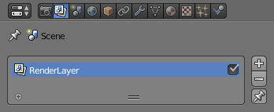
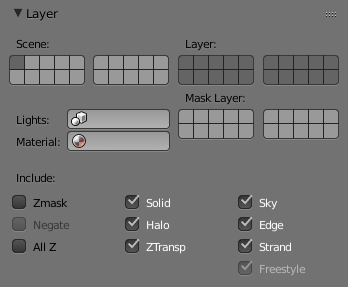
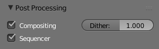
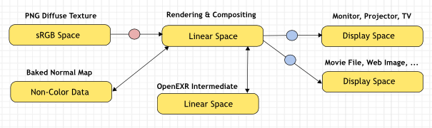
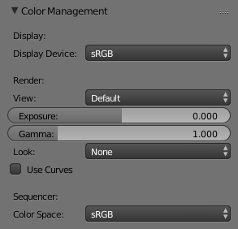
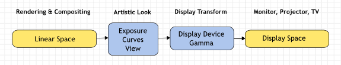

*********************************
11.1 Render - Post Processing.odt
*********************************

.. contents:: Contents

Render Layers
=============

Render layers allow you to render your scene in separate layers, usually with the intension of compositing them back together afterwards.

This can be useful for several purposes, such as color correcting certain elements differently, blurring the foreground as a fast manual method of creating DoF, or reducing the render quality for unimportant objects.

Using Render Layers can also save you from having to re-render your entire image each time you change something, allowing you to instead re-render only the layer(s) that you need.

Layer List
----------

Reference
=========

Layer list.

This is a list of all the Render Layers in the current scene.

Only layers which are enabled (checkbox on right is ticked) will be rendered. If the **Pin** icon at the bottom right of the list is enabled, only the active (highlighted) layer will be rendered.

Render Layers can be added and removed using the + and - buttons on the right, and existing layers can be renamed by double clicking on their name.

Layer Panel
-----------

Reference
=========

Layer panel.

The Layer Panel shows the settings of the active Render Layer from the list above.

You can select multiple layers using Shift-LMB.

Scene 

The Scene Layers, showing which are currently visible and will be rendered. 

Layer 

The Scene Layers which are associated with the active Render Layer. Objects in those Scene Layers will be rendered in that Render Layer. When an object is in the Scene Layers but not the Render Layer, it will still cast shadows and be visible in reflections, so it is still indirectly visible. 

Mask Layer 

Objects on these will mask out other objects appearing behind them. This can be used for compositing objects into footage, to take into account objects in front of the virtual objects blocking the view from the camera. 

Material Override 

	Overrides all material settings to use the Material chosen here.

Examples of where this might be used:

- To check lighting by using a plain diffuse material on all objects 
- Render a wireframe of the scene 
- Create a custom render pass such as an anti-aliased matte or global coordinates. 

See also

Additional options shown in this panel are different for each render engine. See these options for:

- Blender Render 
- Cycles 

Usage
-----

Each Render Layer has an associated set of Scene Layers. Objects which are on one of the associated Scene Layers are shown in that Render Layer, as long as that Scene Layer is also visible.

.. list-table::

	* - Warning

	* - Only the objects in visible Scene Layers will be rendered. So, if only Scene Layer 1 is visible and your Render Layer set specifies to render only Layers 2 and 3, nothing will be rendered.

Post Processing Panel
=====================

Reference
=========

The Post Processing panel is used to control different options used to process your image after rendering.

Post Processing Panel.

Sequencer 

Renders the output of the sequence editor, instead of the view from the 3D scene’s active camera. If the sequence contains scene strips, these will also be rendered as part of the pipeline. If **Compositing** is also enabled, the Scene strip will be the output of the Compositor. 

Compositing 

Renders the output from the compositing node setup, and then pumps all images through the Composite node map, displaying the image fed to the Composite Output node. 

Dithering
---------

Dithering is a technique for blurring pixels to prevent banding that is seen in areas of gradients, where stair-stepping appears between colors. Banding artifacts are more noticeable when gradients are longer, or less steep. Dithering was developed for graphics with low bit depths, meaning they had a limited range of possible colors.

Dithering works by taking pixel values and comparing them with a threshold and neighboring pixels then does calculations to generate the appropriate color. Dithering creates the perceived effect of a larger color palette by creating a sort of visual color mixing. For example, if you take a grid and distribute red and yellow pixels evenly across it, the image would appear to be orange.

The **Dither** value ranges from 0 to 2.

.. Note:: When using ``Blender Internal`` Render you get a few more options and these are discussed here.

Color Management
================

Color management is one of the most important tools that an artist can use. It allows an artist to make sure that an image stays the same from rendering, to saving, to post processing. Color management also allows an artist to tweak things like exposure, gamma, or the overall color grade.

Different views and exposures of the same render.

To achieve color management in Blender, the OpenColorIO (OCIO) library has been integrated into Blender. This library offers fine control over different LUT along with integrating your own set of color profiles to keep your work linearized with other software.

Scene Linear Color Space
------------------------

For correct results, different color spaces are needed for rendering display and storage of images. Rendering and compositing is best done in scene **linear** color space, which corresponds more closely to nature, and makes computations more physically accurate.

An example of a linear workflow.

If the colors are linear, it means that if in reality, we double the number of photons, the color values are also doubled. Put another way, if we have two photos/renders each with one of two lights on, and add those images together, the result would be the same as a render/photo with both lights on. It follows that such a radiometrically linear space is best for photo-realistic rendering and compositing.

However, these values do not directly correspond to human perception or the way display devices work and image files are often stored in different color spaces, so we have to take care to do the right conversion into and out of this linear color space.

Settings
--------

Reference
=========

Scene settings for color management.

Display
-------

Correct display of renders requires a conversion to the display device color space, which can be configured here. A computer monitor works differently from a digital cinema projector HDTV. The scene properties have these settings:

Display Device 

	The device that the image is being viewed on.

Most computer monitors are configured for the sRGB color space, and so when working on a computer usually this option should just be left to the default. It would typically be changed when viewing the image on another display device connected to the computer, or when writing out image files intended to be displayed on another device.

Rec709 is commonly used for HDTVs, while XYZ and DCI-P3 are common for digital projectors.

	Color management can be disabled by setting the device to None.

Conversion from linear to display device space.

Render
------

There is also an artistic choice to be made for renders. Partially that is because display devices cannot display the full spectrum of colors and only have limited brightness, so we can squeeze the colors to fit in the gamut of the device. Besides that, it can also be useful to give the renders a particular look, e.g. as if they have been printed on real film.

Another common use case is when you want to inspect renders, to see details in dark shadows or bright highlights, or identify render errors. Such settings would be only used temporarily and not get used for final renders.

View 

	These are different ways to view the image on the same display device.

	Default 

	Does no extra conversion besides the conversion for the display device. 

	RRT 

	Uses the ACES Reference Rendering Transform, to simulate a film-like look. 

	Film 

	Uses a technique known as film emulation to give renders a look similar to what might be expected from a film based camera. This is usually done by crushing the blacks and decreasing the contrast of the image. 

	Raw 

	Intended for inspecting the image but not for final export. Raw gives the image without any color space conversion. 

	Log 

	Intended for inspecting the image but not for final export. Log works similar to Raw but gives a more “flat” view of the image without very dark or light areas. 

Exposure 

Used to control the image brightness (in stops) applied before color space conversion. 2(stops)×value

Gamma 

Extra gamma correction applied after color space conversion. Note that the default sRGB or Rec709 color space conversions already include a gamma correction of approximately 2.2 (except the **Raw** and **Log** views), so this would be applied in addition to that. 

Look 

Choose an artistic effect from a set of measured film response data which roughly emulates the look of certain film types. Applied before color space conversion. 

Use Curves 

Adjust RGB Curves to control image colors before color space conversion. Read more about using the Curve Widget. 

Sequencer
---------

Color Space 

The color space that the sequencer operates in. By default, the sequencer operates in sRGB space, but it can also be set to work in Linear space like the Compositing nodes, or another color space. Different color spaces will give different results for color correction, crossfades, and other operations. 

Image Files
-----------

When loading and saving media formats it is important to have color management in mind. File formats such as PNG or JPEG will typically store colors in a color space ready for display, not in a linear space. When they are, for example, used as textures in renders, they need to be converted to linear first, and when saving renders for display on the web, they also need to be converted to a display space. Other file formats like OpenEXR store linear color spaces and as such are useful as intermediate files in production.

When working with image files, the default color space is usually the right one. If this is not the case, the color space of the image file can be configured in the image settings. A common situation where manual changes are needed is when working with or baking normal maps or displacement maps, for example. Such maps do not actually store colors, just data encoded as colors. In such cases, they should be marked as **Non-Color Data**.

Image data-blocks will always store float buffers in memory in the scene linear color space, while a byte buffer in memory and files in a drive are stored in the color space specified with this setting:

Color Space 

The color space of the image file on a drive. This depends on the file format, for example, PNG or JPEG images are often stored in sRGB, while OpenEXR images are stored in a linear color space. Some images such as normal, bump or stencil maps do not strictly contain ‘colors’, and on such values, no color space conversion should ever be applied. For such images, the color space should be set to **None**. 

.. image:: graphics/11.1_Render_-_Post_Processing/10000000000001130000007CF131335DE5D87959.jpg

Image settings for color management.

By default only renders are displayed and saved with the render view transformations applied. These are the Render Result and Viewer image data-blocks, and the files saved directly to a drive with the Render Animation operator. However, when loading a render saved to an intermediate OpenEXR file, Blender cannot detect automatically that this is a render (it could be e.g. an image texture or displacement map). We need to specify that this is a render and that we want the transformations applied, with these two settings:

View as Render 

Display the image data-block (not only renders) with view transform, exposure, gamma, RGB curves applied. Useful for viewing rendered frames in linear OpenEXR files the same as when rendering them directly. 

Save as Render 

Option in the image save operator to apply the view transform, exposure, gamma, RGB curves. This is useful for saving linear OpenEXR to e.g. PNG or JPEG files in display space. 

OpenColorIO Configuration
-------------------------

Blender comes with a standard OpenColorIO configuration that contains a number of useful display devices and view transforms. The reference linear color space used is the linear color space with Rec. 709 chromaticities and D65 white point.

However, OpenColorIO was also designed to give a consistent user experience across multiple applications, and for this, a single shared configuration file can be used. Blender will use the standard OCIO environment variable to read an OpenColorIO configuration other than the default Blender one. More information about how to set up such a workflow can be found on the OpenColorIO website.

We currently use the following color space rules:

scene_linear 

Color space used for rendering, compositing, and storing all float precision images in memory. 

default_sequencer 

Default color space for sequencer, **scene_linear** if not specified 

default_byte 

Default color space for byte precision images and files, **texture_paint** if not specified. 

default_float 

Default color space for float precision images and files, **scene_linear** if not specified. 

The standard Blender configuration also includes some support for ACES (code and documentation), even though we have a different linear color space. It is possible to load and save EXR files with the Linear ACES color space, and the RRT view transform can be used to view images with their standard display transform. However, the ACES gamut is larger than the Rec. 709 gamut, so for best results, an ACES specific configuration file should be used. OpenColorIO provides an ACES configuration file, though it may need a few more tweaks to be usable in production.

