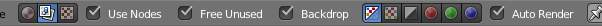
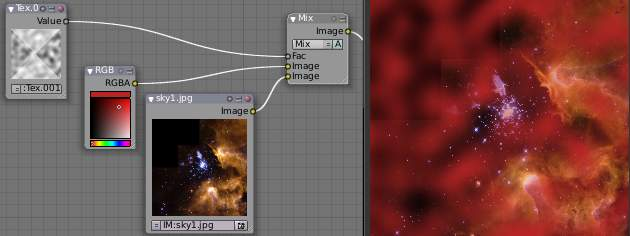
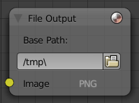
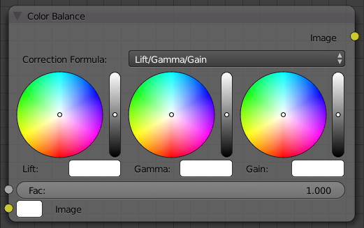

***********************
11 Editors - Compositor
***********************

.. contents:: Contents

Compositing
===========

Compositing Nodes allow you to assemble and enhance an image (or movie). Using composition nodes, you can glue two pieces of footage together and colorize the whole sequence all at once. You can enhance the colors of a single image or an entire movie clip in a static manner or in a dynamic way that changes over time (as the clip progresses). In this way, you use composition nodes to both assemble video clips together, and enhance them.

.. Note:: Term: Image

Default Composition Noodle

To process your image, you use nodes to import the image into Bforartists, change it, optionally merge it with other images, and finally save it.

The example to the right shows the simplest node setup; an input node links the camera view to an output node so it can be saved.

Getting Started
---------------

Access the **Node Editor** and enable **Composite Nodes** by clicking on the **Image** icon.

Node Editor Header with Composite Nodes enabled

To activate nodes for compositing, click the **Use Nodes** checkbox. Bforartists creates a default node setup, consisting out of two nodes linked together.

.. Note:: After clicking ``Use Nodes`` the Compositor is enabled however, it can also be disabled in the ``Post Processing Panel``.

You now have your first node setup, a RenderLayer input node linked to a Composite output node. From here, you can add and connect many **types of compositing nodes**, in a sort of map layout, to your heart’s content (or physical memory constraints, whichever comes first).

.. Note:: Nodes and node concepts are explained in more detail in the ``Node Editor``

Options
-------

Free Unused Button 

This button frees up memory space when you have a very complex node map. 

Backdrop
--------

Use the active viewer node output as a backdrop. When enabled, additional settings appear in the Header and the Properties Panel:

Backdrop Channels.

Backdrop Channels 

Set the image to be displayed with **Color**, **Color and Alpha**, or just **Alpha**. 

Zoom 

Sets how big the backdrop image is. 

Offset 

Change the screen space position of the backdrop, or click the **Move** button, or shortcut Alt-MMB to manually move it. 

Auto Render 

Re-render and composite changed layer when edits to the 3d scene are made. 

Performance Settings
--------------------

Render 

Set quality when rendering in Node Editor. 

Edit 

Set quality when editing in Node Editor 

Chunk Size 

Max size of a title (smaller values give better distribution of multiple threads, but more overhead). 

OpenCL 

Enable GPU calculations when working in Node Editor. 

Buffer Groups 

Enable buffering of group nodes. 

Two Pass 

Use two pass execution during editing: first calculate fast nodes, second pass calculate all nodes. 

Viewer Border 

Use boundaries for viewer nodes and composite backdrop. 

Highlight 

Highlight nodes that are being calculated. 

Examples
--------

You can do just about anything with images using nodes.

Raw footage from a foreground actor in front of a blue screen, or a rendered object doing something, can be layered on top of a background. Composite both together, and you have composited footage.

You can change the mood of an image:

- To make an image ‘feel’ colder, a blue tinge is added. 
- To convey a flashback or memory, the image may be softened. 
- To convey hatred and frustration, add a red tinge or enhance the red. The film ‘Sin City’ is the most extreme example of this I have ever seen. 
- A startling event may be sharpened and contrast-enhanced. 
- A happy feeling - you guessed it - add yellow (equal parts red and green, no blue) for bright and sunny. 
- Dust and airborne dirt is often added as a cloud texture over the image to give a little more realism. 

Types of Nodes
==============

This section is organized by type of nodes, which are grouped based on similar functions:

- Input Nodes 
- Output Nodes 
- Color Nodes 
- Converter Nodes 
- Filter Nodes 
- Vector Nodes 
- Matte Nodes 
- Distort Nodes 
- Layout Nodes 

Input Nodes
===========

Input nodes produce information from some source. For instance, an input could be:

- Taken directly from the active camera in a selected scene, 
- from a JPG, PNG, etc. file as a static picture, 
- a movie clip (such as an image sequence or video), or 
- just a color or value. 

These nodes generate the information that feed other nodes. As such, they have no input-connectors; only outputs.

- Render Layers Node 
- Image Node 
- Movie Clip 
- Mask 
- RGB Node 
- Value Node 
- Texture Node 
- Bokeh Image 
- Time Node 
- Track Position 

Render Layers Node
==================

Render Layers Node

This node is the starting place to getting a picture of your scene into the compositing node map.

This node inputs an image from a scene within your blend file. Select the scene and the active render layer from the yellow selection list at the bottom of the node. Bforartists uses the active camera for that scene to create an image of the objects specified in the **RenderLayer**.

The **Image** is input into the map, along with the following data:

- **Alpha** (transparency) mask 

Depending on the Renderlayer passes that are enabled, other sockets are available. By default the Z is enabled:

- **Z** depth map (how far away each pixel is from the camera) 

The example shows that two other passes are enabled:

- **Normal** vector set (how light bounces off the surface) 
- **Speed** vector set (how fast an object is moving from one frame to the next) 

Use the re-render button (Small landscape icon - to the right of the Renderlayer name) to re-render the scene and refresh the image and map.

You may recall that a .blend file may contain many scenes. The Renderlayer node can pick up the scene info from any available scene by selecting the scene from the left-hand selector. If that **other** scene also uses the compositor and/or sequencer, you should note that the scene information taken is the raw information (pre-compositing and pre-sequencing). If you wish to use composited information from another scene, you will have to render that scene to a multilayer OpenEXR frameset as an intermediate file store, and then use the Image input node instead.

Using the Alpha Socket
----------------------

Using the **Alpha** output socket is crucial in overlaying images on top of one another and letting a background image “show through” the image in front of it.

In a Bforartists scene, your objects are floating out there in virtual space. While some objects are in front of one another (Z depth), there is no ultimate background. Your world settings can give you the illusion of a horizon, but it’s just that: an illusion. Further, some objects are semi-transparent; this is called having an Alpha value. A semi-transparent object allows light (and any background image) to pass through it to the camera. When you render an image, Bforartists puts out, in addition to a pretty image, a map of what solid objects actually are there, and where infinity is, and a map of the alpha values for semi-transparent objects. You can see this map by mapping it to a blue screen:

Viewing the Alpha values

In the little node map above, we have connected the Alpha output socket of the RenderLayer node to a Map Value node (explained later, but basically this node takes a set of values and maps them to something we can use). The Color Ramp node (also explained later in detail) takes each value and maps it to a color that we can see with our eyes. Finally, the output of the Color Ramp is output to a Composite viewer to show you, our dear reader, a picture of the Alpha values. Notice that we have set up the map so that things that are perfectly solid (opaque) are white, and things that are perfectly transparent (or where there is nothing) are blue.

Optional Sockets
----------------

For any of the optional sockets to appear on the node, you MUST have the corresponding pass enabled. In order for the output socket on the RenderLayer node to show, that pass must be enabled in the RenderLayer panel in the Buttons window. For example, in order to be able to have the Shadow socket show up on the RenderLayer input node, you must have the “Shad” button enabled in the Buttons window, Scene Render buttons, Renderlayer panel. See the RenderLayer tab (Buttons window, Output frame, Render Layers tab, Passes selector buttons) for Bforartists to put out the values corresponding to the socket.

For a simple scene, a monkey and her bouncy ball, the following picture expertly provides a great example of what each pass looks like:

The available sockets are:

- Z: distance away from the camera, in Bforartists Units 
- Normal (Nor): How the color is affected by light coming from the side 
- UV: how the image is distorted by the UV mapping 
- Speed (Vec): How fast the object is moving, and in what direction 
- Color (Col): the RGB values that color the image that you see 
- Diffuse: the softening of colors as they diffuse through the materials 
- Specular: the degree of shininess added to colors as they shine in the light 
- Shadow: shadows cast by objects onto other objects 
- AO: how the colors are affected by Ambient Occlusion in the world 
- Reflect (Ref): for mirror type objects, the colors they reflect and are thus not part of their basic material 
- Refract: how colors are bent by passing through transparent objects 
- Radio (Radiosity): colors that are emitted by other objects and cast onto the scene 
- IndexOB: a numeric ordinal (index) of each object in the scene, as seen by the camera. 

Using the Z value Socket
------------------------

Using the **Z** output socket is crucial in producing realistic images, since items farther away are blurrier (but more on that later).

Imagine a camera hovering over an X-Y plane. When looking through the camera at the plane, Y is up/down and X is left/right, just like when you are looking at a graph. The camera is up in the air though, so it has a Z value from the X-Y plane, and, from the perspective of the camera, the plane, in fact all the objects that the camera can see, have a Z value as a distance that they are away from it. In addition to the pretty colors of an image, a RenderLayer input node also generates a Z value map. This map is a whole bunch of numbers that specify how far away each pixel in the image is away from the camera. You can see this map by translating it into colors, or shades of gray:

Viewing the Z values

In the little node map above, we have connected the Z output socket of the RenderLayer node to a Map Value node (explained later). This node takes a set of values and maps them to something we can use. The Color Ramp node (also explained later in detail) takes each value and maps it to a shade of gray that we can see with our eyes. Finally, the output of the colorramp is output to a Composite viewer to show you, our dear reader, a picture of the Z values. Notice that we have set up the Map Value node so that things closer to the camera appear blacker (think: black is 0, less Z means a smaller number) and pixels/items farther away have an increasing Z distance and therefore get whiter. We chose a Size value of 0.05 to see Z values ranging from 0 to 20 (20 is 1/0.05).

Using the Speed Socket
----------------------

Even though things may be animated in our scene, a single image or frame from the animation does not portray any motion; the image from the frame is simply where things are at that particular time. However, from the **Render Layers** node, Bforartists puts out a vector set that says how particular pixels are moving, or will move, to the next frame. You use this socket to create a **blurring effect.**.

Image Node
==========

Image Node

The **Image** node injects any image **format that is supported by Bforartists**. Besides inputting the actual image, this node can also input **Alpha** and depth (**Z**) values if the image has them. If the image is a MultiLayer format, all saved render passes are input. Use this node to input:

- A single image from a file (such as a JPG picture) 
- Part or all of an animation sequence (such as the 30th to 60th frame) 
- Part or all of a movie clip (such as an AVI file) 
- the image that is currently in the UV/Image Editor (and possibly being painted) 
- an image that was loaded in the UV/Image Editor 

Animated image sequences or video files can also be used. See Animations below.

To select an image file or generated image from the UV/Image Editor, click on the small arrow selector button to the left of the name and pick an existing image (e.g. loaded in the UV editor or elsewhere) or click on **LOAD NEW** to select a file from your hard disk via a file-browser. These images can be e.g. previously rendered images, matte paintings, a picture of your cat, whatever. Bforartists really doesn’t care.

If the image is part of a sequence, manually click the Image Type selector to the right of the name, and select **Sequence**. Additional controls will allow you to define how much of the sequence to pull in (see Animations below). If the file is a video file, these controls will automatically appear.

Image Channels
--------------

When the image is loaded, the available channels will be shown as sockets on the node. As a minimum, the Image, Alpha, and Z channels are made available. The picture may or may not have an alpha (transparency) and/or Z (depth) channel, depending on the format. If the image format does not support A and/or Z, default values are supplied (1.0 for A, 0.0 for Z).

Alpha/Transparency Channel 

- If a transparency channel is detected, the **Alpha** output socket will supply it. 
- If it does not have an Alpha channel (e.g. JPG images), Bforartists will supply one, setting the whole image to completely opaque (an Alpha of 1.00, which will show in a **Viewer** node as white - if connected to the **Image** input socket). 

Z/depth Channel 

- If a Z (depth) channel is detected, the **Z** output socket will supply it. 
- If it does not have a Z channel (e.g. JPG or PNG images), Bforartists will supply one, setting the whole image to be at the camera (a depth of 0.00). To view the Z-depth channel, use the Map Value to ColorRamp noodle given above in the Render Layer input node (see Using the Z value Socket ). 

.. Note:: Formats

Saving/Retrieving Render Passes
-------------------------------

Bforartists can save the individual Render Layers and specific passes in a MultiLayer file format, which is an extension of the OpenEXR format. In this example, we are reading in frames 50 to 100 of a RenderLayer that were generated some time ago. The passes that were saved were the Image, Alpha, Z, Specular and AO passes.

To create a MultiLayer image set when initially rendering, simply disable Do Composite, set your Format to MultiLayer, enable the Render Layer passes you wish to save over the desired frame range, and Animate. Then, in Bforartists, enable Compositing Nodes and Do Composite, and use the Image input node to read in the EXR file. When you do, you will see each of the saved passes available as sockets for you to use in your compositing noodle.

Image Size
----------

Size matters - Pay attention to image resolution and color depth when mixing and matching images. Aliasing (rough edges), color **flatness**, or distorted images can all be traced to mixing inappropriate resolutions and color depths.

The compositor can mix images with any size, and will only perform operations on pixels where images have an overlap. When nodes receive inputs with differently sized Images, these rules apply:

- The first/top Image input socket defines the output size. 
- The composite is centered by default, unless a translation has been assigned to a buffer using a **Translate** node. 

So each node in a composite can operate on different sized images, as defined by its inputs. Only the **Composite**output node has a fixed size, as defined by the **Scene buttons** (Format Panel). The **Viewer** node always shows the size from its input, but when not linked (or linked to a value) it shows a small 320x256 pixel image.

Animations
----------

To use image sequences or movies within your composition, press the face or little film strip button located to the right of the selector. As you click, a pop-up will offer you four choices:

- Generated - a image generated from the **UV Editor**
- Sequence - a sequence of frames, each frame in a separate file. 
- Movie - a sequence of frames packed into a single .avi or .mov file 
- Image - a single frame or still image in a file 

A Movie or Image can be named anything, but a Sequence must have a digit sequence somewhere in its filename, for example fire0001set.jpg, fire0002set.jpg, fire0003set.jpg and so on. The number indicates the frame.

If a Sequence or Movie is selected, an additional set of controls will appear that allows you to select part or all of the sequence. Use these controls to specify which frames, out of the original sequence, that you want to introduce into the animation you are about to render. You can start at the beginning and only use the beginning, or even pick out a set of frames from the middle of an existing animation.

The **Frs** number button is the number of frames in the sequence that you want to show. For example, if you want to show 2 seconds of the animation, and are running 30 fps, you would put 60 here.

The **SFra** number button sets the start frame of the animation; namely, at what point in the animation that you **are going to render** do you want this sequence to start playing. For example, if you want to introduce this clip ten seconds into the composite output, you would put 300 here (at 30 fps).

The **First** number button sets the first number in the animated sequence name. For example, if your images were called “credits-0001.png”, “credits-0002.png” through “credits-0300.png” and you wanted to start picking up with frame 20, you’d put 20 here.

To have the movie/sequence start over and repeat when it is done, press the **Cycl** ic button. For example, if you were compositing a fan into a room, and the fan animation lasted 30 frames, the animation would start over at frame 31, 61, 91, and so on, continuously looping. As you scrub from frame to frame, to see the actual video frame used for the current frame of animation, press the auto button to the right of the **Cycl** ic button.

Generated Images
----------------

Using the Nodes to modify a painting in progress in the UV/Image window Bforartists features Texture Paint which works in the UV/Image Editor, that allows you to paint on the fly, and the image is kept in memory or saved. If sync lock is enabled (the lock icon in the header), changes are broadcast throughout Bforartists as soon as you lift the mouse button. One of the places that the image can go is to the Image Input node. The example shows a painting session going on in the right-hand UV/Image Editor window for the painting “Untitled”. Create this image via Image?New in the UV/Image Editor. Refer to the texture paint section of the user maual for more info on using Texture Paint.

In the left-hand window, the Image input node was used to select that “Untitled” image. Notice that the Image type icon is blank, indicating that it is pulling in a Generated image. That image is colorized by the noodle, with the result used as a backdrop in the Node Editor Window.

Using this setup and the Generated Image type is like painting and post-processing as you continue painting. Changes to either the painting or the post-pro noodle are dynamic and real-time.

Movie Clip
==========

Mask Node

TODO - see: https://developer.Bforartists.org/T43469

Mask
====

Mask Node

TODO - see: https://developer.Bforartists.org/T43469

RGB Node
========

RGB Node

The RGB node has no inputs. It just outputs the Color currently selected in its controls section; a sample of it is shown in the top box. In the example to the right, a gray color with a tinge of red is slected.

To change the brightness and saturation of the color, LMB click anywhere within the square gradient. The current saturation is shown as a little circle within the gradient. To change the color itself, click anywhere along the rainbow Color Ramp.

Example
-------

In this example, our corporate color is teal, but the bozo who made the presentation forgot. So, we multiply his lame black and white image with our corporate color to save him from embarrassment in front of the boss when he gives his boring presentation.

Value Node
==========

Value Node

The Value node has no inputs; it just outputs a numerical value (floating point spanning 0.00 to 1.00) currently entered in the NumButton displayed in its controls selection.

Use this node to supply a constant, fixed value to other nodes’ value or factor input sockets.

Texture Node
============

Texture Node

The **Texture** node makes 3D textures available to the compositor.

The Texture node makes 3D textures available to the compositor. A texture, from the list of textures available in the current blend file, is selected and introduced through the value and/or color socket.

.. Note:: Please read up on the Bforartists Library system for help on importing and linking to textures in other Bforartists files.

.. Note:: ``You cannot edit the textures themselves in the node window``. To use this node, create and edit the texture in the normal texture buttons, then select the texture from the menu button on the node.

You can change the **Offset** and a **Scale** (which is called Offs XYZ and Size XYZ in the Materials Texture Map Input panel) for the texture by clicking on the label and setting the sliders, thus affecting how the texture is applied to the image. For animation, note that this is a vector input socket, because the XYZ values are needed.

Texture nodes can output a straight black-and-white **Value** image (don’t mistake this for alpha) and an image (**Color**).

Example
-------

In the example above, we want to simulate some red plasma gas out there in space. So, we fog up an image taken from the Hubble telecscope of Orion and take the ever-so-useful Cloud texture and use it to mix in red with the image.

Bokeh Image
===========

Bokeh Image Node

Bokeh Image generates a special input image for use with the **Bokeh Blur** filter node.

Bokeh Image is designed to create a reference image which simulates optical parameters such as aperture shape and lens distortions which have important impacts on bokeh in real cameras.

The first three settings simulate the aperture of the camera. Flaps sets an integer number of blades for the cameras iris diaphragm. Angle gives these blades an angular offset relative to the image plane and Rounding sets the curvature of the blades with a 0 being straight and 1 bringing them to a perfect circle.

Catadioptric provides a type of distortion found in mirror lenses and some telescopes. This can be useful to produce a ‘busy’ bokeh.

Lens Shift introduces chromatic aberration into the blur such as would be caused by a tilt-shift lens.

Example of a bokeh image with 5 flaps.

Time Node
=========

Time Node

The Time node generates a **fac** tor value (from 0.00 to 1.00) (that changes according to the curve drawn) as time progresses through your movie (frames).

The **Start** and **End** NumButtons specify the range of time the values should be output along, and this range becomes the X-axis of the graph. The curve defines the Y-value and hence the factor that is output. In the example to the right, since the timespan is 250 frames and the line is straight from corner to corner, 0.50 would be output at frame 125, and 0.75 will be output at frame 187.

.. Note:: Note on output values

You can reverse time (unfortunately, only in Bforartists and not in the real world) by specifying a Start frame greater than the End frame. The net effect of doing so is to flip the curve around. Warning: doing so is easily overlooked in your node map and can be very confusing (like meeting your mother when she was/is your age in “Back to the Future”).

.. Note:: Time is Relative

Time Node Examples
------------------

In the picture below, over the course of a second of time (30 frames), the following time controls are made:

See:

- No Effect 
- Slow Down 
- Freeze 
- Accelerate 
- Reverse 

Common uses for this include a **“fade to black”**, wherein the accelerate time curve (typically exponentially-shaped) feeds a mix value that mixes a constant black color in, so that the blackness accelerates and eventually darkens the image to total black. Other good uses include an increasing soften (blur-out or -in) effect, or **fade-in** a background or foreground, instead of just jumping things into or out of the scene.

You can even imagine hooking up one blur to a background renderlayer, another inverted blur to a foreground renderlayer, and time-feeding both. This node group would simulate someone focusing the camera lens.

Usage
-----

As your imagination runs wild, consider a few ideas that came to me just now on my couch: mixing a clouds texture with a time input to fog up a piece of glass or show spray paint building up on a wall. Consider mixing red and the soften with time (decreasing output) to show what someone sees when waking up from a hard hit on the head. Mix HSV input with a starfield image with time (decreasing output) to show what we might see someday as we accelerate our starship and experience red-shift.

Track Position Node
===================

Track Position Node.

The **Track Position node** is used to return information about a tracking marker to the compositor.

Inputs
------

This node as no inputs.

Properties
----------

Movie Clip 

	Used to select a Movie Clip data-block to use, for controls see Data-Block Menu.

	Tracking Object 

	Camera object to get track information from. 

	Track Name 

	The name of the track to get track information from. 

Position 

	Which marker position to use for output.

	Absolute 

	Outputs a absolute position of a marker. 

	Relative Start 

	Outputs the positions of a marker relative to the first marker of a track. 

	Relative Frame 

	Outputs the positions of a marker relative to the markers of the given **Frame**. 

	Absolute Frame 

	Outputs the absolute positions of a marker at the given **Frame**. 

Outputs
-------

X/Y 

The markers X and Y location. 

Speed 

The velocity of the marker, measured in pixels per frame. This could be used to fake effects like motion blur by connecting it to the Vector Blur Node. 

Examples
--------

TODO.

Output Nodes
============

These nodes are used to output the composited result in some way.

- Composite Node 
- Viewer Node 
- Split Viewer Node 
- File Output Node 
- Levels Node 

Composite Node
==============

Composite Node

The Composite node is where the actual output from the compositor is connected to the renderer. Connecting a node to the **Composite** node will output the result of that node’s full tree to the Renderer; leaving this node unconnected will result in a blank image. This node is updated after each render, but also if you change things in your node-tree (provided at least one finished input node is connected).

You can connect three channels: the actual RGBA image, the Alpha image, and the Z (depth) image. You should only have one Composite node in your map so that only one final image is rendered when the **Compositing** button is pressed on the Render Options Post-Processing panel. Otherwise, unpredictable results may occur.

.. Note:: If multiple Composite nodes are added, only the active one (last selected, indicated with a slightly darker header) will be used.

Saving your Composite Image
---------------------------

The RENDER button renders a single frame or image. Save your image using F3 or the **File→Save Image** menu. The image will be saved using the image format settings on the Render panel.

To save a sequence of images, for example, if you input a movie clip or used a Time node with each frame in its own file, use the **ANIM** button and its settings. If you might want to later overlay them, be sure to use an image format that supports an Alpha channel (such as PNG). If you might want to later arrange them front to back or create a depth of field effect, use a format that supports a Z-depth channel (such as EXR).

To save a composition as a movie clip (all frames in a single file), use an AVI or Quicktime format, and use the **ANIM** button and its settings.

Viewer Node
===========

Viewer Node

The **Viewer** node is a temporary, in-process viewer. Plug it in wherever you would like to see an image or value-map in your node-tree.

LMB click on the image to update it, if it wasn’t done automatically. You can use as many of these as you would like. It is possible to automatically plug a Viewer node to any other node by pressing Shift-Ctrl-LMB on it.

.. Note:: It is possible to add multiple Viewer nodes, though only the active one (last selected, indicated with a slightly darker header) will be shown on the backdrop or in the UV/Image editor.

Border Compositing
------------------

A border for the viewer node can be defined using Ctrl-B and selecting a rectangular area.

This border is used to define the area of interest of the viewer node which restricts compositing to this area. Used for faster previews by skipping compositing outside of the defined area of interest. This is only a preview option, final compositing during a render ignores this border.

Use Ctrl-Alt-B to discard the defined border and see a full preview.

Tile order
----------

The tile order can be defined for the backdrop image, using the **Tile order** field in the properties of the viewer node (**Properties** panel in **Properties** sidebar, with the viewer node selected):

Rule of thirds 

Calculates tiles around each of the 9 zones defined by the **rule of thirds** (see Rule of Thirds for more information). 

Bottom up 

Tiles are calculated from the bottom up. 

Random 

Calculates tiles in a non-specific order. 

Center 

Calculates the tiles around a specific center, defined by **X** and **Y** fields. 

Using the UV/Image Editor Window
--------------------------------

The viewer node allows results to be displayed in the UV/Image Editor. The image is facilitated by selecting **Viewer Node** on the window’s header linked image selector. The UV/Image Editor will display the image from the currently selected viewer node.

To save the image being viewed, use Image > Save As Image (F3) to save the image in a file.

The UV/Image Editor also has three additional options in its header to view Images with or without Alpha, or to view the Alpha or Z itself. Holding LMB in the Image display allows you to sample the values.

Split Viewer Node
=================

Split Viewer Node

The **SplitViewer** node takes two images and displays one half of each on each side (top socket on the right half, bottom socket input on the left). Use this node for making side-by-side comparisons of two renderings/images, perhaps from different renderlayers or from different scenes. When transitioning between scenes, you want to be sure the stop action is seamless; use this node to compare the end of one scene with the beginning of another to ensure they align.

File Output Node
================

File Output Node

This node puts out an RGBA image, in the format selected, for each frame range specified, to the filename entered, as part of a frameset sequence. This means that the name of the file will be the name you enter plus a numeric frame number, plus the filename extension (based on format). Based on the format you choose, various quality/compression options may be shown.

To support subsequent arrangement and layering of images, the node can supply a Z-depth map. However, please note that only the OpenEXR image formats save the Z information.

The image is saved whenever Bforartists feels like it. Just kidding; whenever you press the Render button, the current frame image is saved. When you press the Anim button, the frameset sequence (specified in the Start and End frame) is saved.

This node saves you from doing (or forgetting to do) the Save Image after a render; the image is saved automagically for you. In addition, since this node can be hooked in anywhere in the noodle, you can save intermediate images automatically. Neat, huh?

.. Note:: Filespecs

Levels Node
===========

Levels Node

The Levels Node takes an image as an input, and can output a 1D value based on the levels of an image. It can read the input’s **Combined RGB**, **Red**, **Green**, **Blue**, or **Luminance** channels.

It can output a **Mean** value, or average of values, or a **Standard deviation**, which measures the diversity of values.

Color Nodes
===========

These nodes adjust the image’s colors, for example increasing the contrast, making it warmer, overlaying another image, etc.

- Mix Node 
- Alpha Over Node 
- Invert Node 
- RGB Curves Node 
- Hue Saturation Node 
- Color Balance 
- Hue Correct Node 
- Bright/Contrast Node 
- Gamma Node 
- Color Correction Node 
- Tone Map Node 
- Z-Combine Node 

Mix Node
========

Mix Node

This node mixes a base image (threaded to the top socket) together with a second image (bottom socket) by working on the individual and corresponding pixels in the two images or surfaces. The way the output image is produced is selected in the drop-down menu. The size (output resolution) of the image produced by the mix node is the size of the base image. The alpha and Z channels are mixed as well.

.. See also:: Color Blend Modes for details on each blending mode.

.. Note:: Color Channels

Alpha 

Click the **Alpha** button to make the mix node use the Alpha (transparency) values of the second (bottom) node. If enabled, the resulting image will have an Alpha channel that reflects both images’ channels. Otherwise, (when not enabled, light green) the output image will mix the colors by considering what effect the Alpha channel has of the base (top input socket) image. The Alpha channel of the output image is not affected. 

Fac 

The amount of mixing of the bottom socket is selected by the Factor input field (**Fac:**). A factor of zero does not use the bottom socket, whereas a value of 1.0 makes full use. In Mix mode, 0.5 is an even mix between the two, but in Add mode, 0.5 means that only half of the second socket’s influence will be applied. 

Examples
--------

Below are samples of common mix modes and uses, mixing a color or checker with a mask.

Some explanation of the mixing methods above might help you use the Mix node effectively:

- **Add** - adding blue to blue keeps it blue, but adding blue to red makes purple. White already has a full amount of blue, so it stays white. Use this to shift a color of an image. Adding a blue tinge makes the image feel colder. 
- **Subtract** : Taking Blue away from white leaves Red and Green, which combined make Yellow (and you never thought you’d need a color wheel again, eh?). Taking Blue away from Purple leaves Red. Use this to de-saturate an image. Taking away yellow makes an image bluer and more depressing. 
- **Multiply** : Black (0.00) times anything leaves black. Anything times White (1.00) is itself. Use this to mask out garbage, or to colorize a black-and-white image. 
- **Hue** : Shows you how much of a color is in an image, ignoring all colors except what is selected: makes a monochrome picture (style ‘Black & Hue’). 
- **Mix** : Combines the two images, averaging the two. 
- **Lighten** : Like bleach, makes your whites whiter. Use with a mask to lighten up a little. 
- **Difference** : Kinda cute in that it takes out a color. The color needed to turn Yellow into White is Blue. Use this to compare two verrry similar images to see what had been done to one to make it the other; sorta like a change log for images. You can use this to see a watermark (see Using Mix to Watermark images) you have placed in an image for theft detection. 
- **Darken**, with the colors set here, is like looking at the world through rose-colored glasses (sorry, I just couldn’t resist). 

Contrast Enhancement using Mix
------------------------------

Here is a small map showing the effects of two other common uses for the RGB Curve: **Darken** and **Contrast Enhancement**. You can see the effect each curve has independently, and the combined effect when they are **mixed** equally.

Example node setup showing “Darken”, “Enhance Contrast” and “Mix” nodes for composition.

As you can hopefully see, our original magic monkey was overexposed by too much light. To cure an overexposure, you must both darken the image and enhance the contrast. Other paint programs usually provide a slider type of control, but Bforartists, ah the fantastic Bforartists, provides a user-definable curve to provide precise control.

In the top RGB curve, **Darken**, only the right side of the curve was lowered; thus, any X input along the bottom results in a geometrically less Y output. The **Enhance Contrast** RGB ‘S’ curve scales the output such that middle values of X change dramatically; namely, the middle brightness scale is expanded, and thus whiter whites and blacker blacks are output. To make this curve, simply click on the curve and a new control point is added. Drag the point around to bend the curve as you wish. The Mix node combines these two effects equally, and Suzanne feels much better. And NOBODY wants a cranky monkey on their hands.

Using Mix to Watermark images
-----------------------------

In the old days, a pattern was pressed into the paper mush as it dried, creating a mark that identified who made the paper and where it came from. The mark was barely perceptible except in just the right light. Probably the first form of subliminal advertising. Nowadays, people watermark their images to identify them as personal intellectual property, for subliminal advertising of the author or hosting service, or simply to track their image’s proliferation throughout the web. Bforartists provides a complete set of tools for you to both encode your watermark and to tell if an image has your watermark.

Encoding Your Watermark in an Image
-----------------------------------

First, construct your own personal watermark. You can use your name, a word, or a shape or image not easily replicated. While neutral gray works best using the encoding method suggested, you are free to use other colors or patterns. It can be a single pixel or a whole gradient; it’s up to you. In the example below, we are encoding the watermark in a specific location in the image using the Translate node; this helps later because we only have to look in a specific location for the mark. We then use the RGB to BW node to convert the image to numbers that the Map Value node can use to make the image subliminal. In this case, it reduces the mark to one-tenth of its original intensity. The Add node adds the corresponding pixels, make the ones containing the mark ever-so-slightly brighter.

Embedding your mark in an Image using a Mark and Specific Position

Of course, if you **want** people to notice your mark, don’t scale it so much, or make it a contrasting color. There are also many other ways, using other mix settings and fancier rigs. Feel free to experiment!

Note

Additional uses

You can also use this technique, using settings that result in visible effects, in title sequences to make the words appear to be cast on the water’s surface, or as a special effect to make words appear on the possessed girl’s forearm. yuk.

Decoding an Image for your Watermark
------------------------------------

When you see an image that you think might be yours, use the node map below to compare it to your stock image (pre-watermarked original). In this map, the Mix node is set to Difference, and the Map Value node amplifies any difference. The result is routed to a viewer, and you can see how the original mark stands out, clear as a bell:

Checking an image for your watermark

Various image compression algorithms lose some of the original; the difference shows as noise. Experiment with different compression settings and marks to see which works best for you by having the encoding map in one scene, and the decoding map in another. Use them while changing Bforartists’s image format settings, reloading the watermarked image after saving, to get an acceptable result. In the example above, the mark was clearly visible all the way up to JPEG compression of 50%.

Using Dodge and Burn (History Lesson)
-------------------------------------

Use the dodge and burn mix methods in combination with a mask to affect only certain areas of the image. In the old darkroom days, when, yes, I actually spent hours in a small stinky room bathed in soft red light, I used a circle cutout taped to a straw to dodge areas of the photo as the exposure was made, casting a shadow on the plate and thus limiting the light to a certain area.

To do the opposite, I would burn in an image by holding a mask over the image. The mask had a hole in it, letting light through and thus ‘burning’ in the image onto the paper. The same equivalent can be used here by mixing an alpha mask image with your image using a dodge mixer to lighten an area of your photo. Remember that black is zero (no) effect, and white is one (full) effect. And by the way, ya grew to like the smell of the fixer, and with a little soft music in the background and the sound of the running water, it was very relaxing. I kinda miss those dayz.

Alpha Over Node
===============

Alpha Over Node

Use this node to layer images on top of one another. This node takes two images as input, combines them by a factor, and outputs the image. Connect the Background image to the top input, and the foreground image to the lower input. Where the foreground image pixels have an alpha greater than 0 (namely, have some visibility), the background image will be overlaid.

Use the **Factor** slider to ‘merge’ the two pictures. A factor less than 1.00 will make the foreground more transparent, allowing the background to bleed through.

Examples
--------

Assembling a composite Image using AlphaOver

In this example, an image of a Toucan is superimposed over a wooden background. Use the PreMultiply button when the foreground image and background images have a combined Alpha that is greater than 1.00; otherwise you will see an unwanted halo effect. The resulting image is a composite of the two source images.

Animated See-Through/Sheer SFX using AlphaOver - Frame 11

In this example, we use the Factor control to make a sheer cloth or onion-skin effect. You can animate this effect, allowing the observer to ‘see-through’ walls (or any foreground object) by hooking up a Time node to feed the Factor socket as shown below. In this example, over the course of 30 frames, the Time node makes the AlphaOver node produce a picture that starts with the background wood image, and slowly bleeds through the Toucan. This example shows frame 11 just as the Toucan starts to be revealed.

AlphaOver does not work on the colors of an image, and will not output any image when one of the sockets is unconnnected.

Strange Halos or Outlines
-------------------------

To clarify the premultiplied-alpha button: An alpha channel has a value of between 0 and 1. When you make an image transparent (to composite it over another one), you are really multiplying the RGB pixel values by the alpha values (making the image transparent (0) where the alpha is black (0), and opaque (1) where it is white (1)).

So, to composite image A over image B, you get the alpha of image A and multiply it by image A, thus making the image part of A opaque and the rest transparent. You then inverse the alphas of A and multiply image B by it, thus making image B transparent where A is opaque and vice versa. You then add the resultant images and get the final composite.

A pre-multiplied alpha is when the image (RGB) pixels are already multiplied by the alpha channel, therefore the above compositing op doesn’t work too well, and you have to hit ‘convert pre-mult’. This is only an issue in semi transparent area, and edges usually. The issue normally occurs in Nodes when you have combined, with alpha, two images, and then wish to combine that image with yet another image. The previously combined image was previously multiplied (pre-mult) and needs to be converted as such (hence, **Convert PreMul**).

If you don’t pay attention and multiply twice, you will get a white or clear halo around your image where they meet, since your alpha value is being squared or cubed. It also depends on whether or not you have rendered your image as a pre-mult, or straight RGBA image.

Layering Images using AlphaOver Premul

Invert Node
===========

Invert Node

This handy node inverts the colors in the input image, producing a negative.

Options
-------

Factor 

Controls the amount of influence the node exerts on the output image 

Color 

The input image. In this case, a red sphere on a black transparent background 

RGB

Invert the colors from white. In this example, red inverted is cyan (teal). 

A 

Invert the alpha (transparency) channel as well. Handy for masking. 

RGB Curves Node
===============

RGB Curves Node

For each color component channel (RGB) or the composite (C), this node allows you to define a bezier curve that varies the input (x-axis) to produce an output value (y-axis). Clicking on one of the **C R G B** components displays the curve for that channel.

.. Tip:: See also

Here are some common curves you can use to achieve desired effects:

Identifiers: A) Lighten B) Negative C) Decrease Contrast D) Posterize

Options
-------

Fac 

How much the node should factor in its settings and affect the output. 

Black Level 

Defines the input color that is mapped to black. Default is black, which does not change the image. 

White Level 

Defines the input color that is mapped to white. Default is white, which does not change the image. 

The levels work exactly like the ones in the image viewer. Input colors are scaled linearly to match black/white levels.

To define the levels, either use LMB on the color patch to bring up the color selection widget or connect some RGBA input to the sockets.

To only affect the value/contrast (not hue) of the output, set the levels to shades of gray. This is equivalent to setting a linear curve for C.

If you set any level to a color with a saturation greater than 0, the output colors will change accordingly, allowing for basic color correction or effects. This is equivalent to setting linear curves for R, G and B.

Examples
--------

Color correction using Curves
-----------------------------

Color correction with curves

In this example, the image has way too much red in it, so we run it through an RGB node and reduce the Red channel by about half.

We added a middle dot so we could make the line into a sideways exponential curve. This kind of curve evens out the amount of a color in an image as it reaches saturation. Also, read on for examples of the Darken and Contrast Enhancement curves.

Color correction using Black/White Levels
-----------------------------------------

Color correction with Black/White Levels

Manually adjusting the RGB curves for color correction can be difficult. Another option for color correction is to use the Black and White Levels instead, which really might be their main purpose.

In this example, the White Level is set to the color of a bright spot of the sand in the background, and the Black Level to the color in the center of the fish’s eye. To do this efficiently it’s best to bring up an image viewer window showing the original input image. You can then use the levels’ color picker to easily choose the appropriate colors from the input image, zooming in to pixel level if necessary. The result can be fine-tuned with the R,G, and B curves like in the previous example.

The curve for C is used to compensate for the increased contrast that is a side-effect of setting Black and White Levels.

Effects
-------

Changing colors

Curves and Black/White Levels can also be used to completely change the colors of an image.

Note that e.g. setting Black Level to red and White Level to blue does not simply substitute black with red and white with blue as the example image might suggest. Levels do color scaling, not substitution, but depending on the settings they can result in the described color substitution.

(What really happens when setting Black Level to pure red and White Level to pure blue is that the red channel gets inverted, green gets reduced to zero and blue remains unchanged.)

Because of this the results of setting arbitrary Black/White Levels or RGB curves is hard to predict, but can be fun to play with.

Hue Saturation Node
===================

Hue Saturation Node

As an alternative to RGB editing, color can be thought of as a mix of Hues, namely a normalized value along the visible spectrum from infra-red to ultraviolet (the rainbow, remember “Roy G. Biv”). The amount of the color added depends on the saturation of that color; the higher the saturation, the more of that pigment is added. Use the saturation slider of this node to “bring out” the colors of a washed-out image.

This node takes an input image and runs the color of the image (and the light it reflects and radiates) ‘up’ through a factor (0.0-1.0) and applies a saturation of color effect of a hue to the image:

Hue: 

The **Hue** slider specifies how much to shift the hue of the image. Hue 0.5 (in the middle) does not shift the hue or affect the color of the image. As Hue shifts left, the colors shift as more cyan is added; a blue image goes bluer, then greener, then yellow. A red image goes violet, then purple, blue, and finally teal. Shifting right (increasing Hue from 0.5 to 1.0) introduces reds and greens. A blue image goes purple, plum, red, orange, and then yellow. A red image goes golden, olive, green, and cyan. 

Sat: 

**Saturation** affect the amount of pigment in the image. A saturation of 0 actually **removes** hues from the color, resulting in a black-and-white grayscale image. A saturation of 1.0 blends in the hue, and 2.0 doubles the amount of pigment and brings out the colors. 

Val: 

**Value** affects the overall amount of the color in the image. Increasing values make an image lighter; decreaing values shift an image darker. 

Fac: 

**Factor** determines how much this node affects the image. A factor of 0 means that the input image is not affected by the Hue and Saturation settings. A factor of 1 means they rule, with .5 being a mix. 

Hue/Saturation tips
-------------------

Some things to keep in mind that might help you use this node better:

Hues are vice versa. 

A blue image, with a Hue setting at either end of the spectrum (0 or 1), is output as yellow (recall that white, minus blue, equals yellow). A yellow image, with a Hue setting at 0 or 1, is blue. 

Hue and Saturation work together. 

So, a Hue of .5 keeps the blues the same shade of blue, but the saturation slider can deepen or lighten the intensity of that color. 

Gray & White are neutral hues.

A gray image, where the RGB values are equal, has no hue. Therefore, this node can only affect it with the **Val** slider. This applies for all shades of gray, from black to white; wherever the values are equal. 

Changing the effect over time. 

The Hue and Saturation values are set in the node by the slider, but you can feed a Time input into the Factor to bring up (or down) the effect change over time. 

.. Note:: Tinge

HSV Example
-----------

Here, the image taken by a cheap digital camera in poor lighting at night using a flash (can we do it any worse, eh?) is adjusted by decreasing the Hue (decreasing reds and revealing more blues and greens), decreasing Saturation (common in digital cameras, and evens out contrast) and increasing Value (making it all lighter).

Color Balance
=============

The Color Balance node can adjust the color and values of an image using two different correction formulas.

Bright/Contrast Node

The **Lift, Gammma, Gain** formula uses **Lift**, **Gamma**, and **Gain** calculations to adjust an image. **Lift** increases the value of dark colors, **Gamma** will adjust midtones, and **Gain** adjusts highlights.

The **Offset, Power, Slope** formula uses **Offset**, **Power**, and **Slope**: out = (i \* s + o) ^ p

where:

out

The color graded pixel code value. 

i

The input pixel code value (0=black, 1=white). 

s

Slope (any number 0 or greater, nominal value is 1.0). 

o

Offset (any number, nominal value is 0). 

p

Power (any number greater than 0, nominal value is 1.0). 

Factor 

Controls the amount of influence the node exerts on the output image 

Hue Correct Node
================

The Hue Correct node is able to adjust the Hue, Saturation, and Value of an image, with an input curve.

Color Balance Node

By default, the curve is a straight line, meaning there is no change. The spectrum allows you to raise or lower HSV levels for each range of pixel colors. To change a H, S, or V level, move the curve points up or down. Pixels with hue values each point in the horizontal position of the graph will be changed depending on the shape of the curve.

Bright/Contrast Node
====================

Bright/Contrast Node

Bright 

A multiplier-type factor by which to increase the overall brightness of the image. Use a negative number to darken an image. 

Contrast 

A scaling type factor by which to make brighter pixels brighter but keeping the darker pixels dark. Higher values make details stand out. Use a negative number to decrease the overall contrast in the image. 

Notes
-----

It is possible that this node will put out a value set that has values beyond normal range, i. e. values > 1 or < 0. If you will be using the output to mix with other images in the normal range, you should clamp the values using the Map Value node (with the Min and Max enabled), or put through a ColorRamp node (with all normal defaults).

Either of these nodes will scale the values back to normal range. In the example image, we want to amp up the specular pass. The bottom thread shows what happens if we do not clamp the values; the specular pass has valued much less than 1 in the dark areas; when added to the medium gray, it makes black. Passing the brightened image through either the Map Value or the ColorRamp produces the desired effect.

A basic example

Gamma Node
==========

Gamma Node

A reason for applying gamma correction to the final render is to correct lighting issues. Lighting issues that can be corrected by a gamma correction node are light attenuation with distance, light falloff at terminators, and light and shadow superpositions. Simply think about the renderer as a virtual camera. By applying a gamma correction to your render, you are just replicating what digital camera do with photos. Digital cameras gamma correct their photos, so you do the same thing. The gamma correction is, indeed, 0.45, not 2.2.

But reverse gamma correction on textures and colors have another very important consequence when you are using rendering techniques such as radiosity or GI. When doing the GI calculations, all textures and colors are taken to mean reflectance. If you do not reverse gamma correct your textures and colors, then the GI render will look way too bright because the reflected colors are all way too high and thus a lot more light is bouncing around than it should.

Gamma correction in Bforartists enters in a few places. The first is in this section with the nodes, both this node and the Tonemap node, and the second is in calculating Radiosity. In the noodle to the left, the split viewer shows the before and after effect of applying a gamma correction.

Color Correction Node
=====================

Color Balance Node

TODO - see: https://developer.Bforartists.org/T43469

Tone Map Node
=============

Tone Map Node

Tone mapping is a technique used in image processing and computer graphics to map one set of colors to another in order to approximate the appearance of high dynamic range images in a medium that has a more limited dynamic range.

Essentially, tone mapping addresses the problem of strong contrast reduction from the scene values (radiance) to the displayable range while preserving the image details and color appearance important to appreciate the original scene content.

The Tone Map node has two methods of calculation:

Rh Simple 

	Key 

	The value the average luminance is mapped to. 

	Offset 

	Normally always 1, but can be used as an extra control to alter the brightness curve 

	Gamma 

	If not used, set to 1 

R/D Photoreceptor 

	Intensity 

	If less than zero, darkens image; otherwise, makes it brighter 

	Contrast 

	Set to 0 to use estimate from input image 

	Adaptation 

	If 0, global; if 1, based on pixel intensity 

	Color Correction 

	If 0, same for all channels; if 1, each independent 

Z-Combine Node
==============

.. image:: graphics/11_Editors_-_Compositor/10000201000000C70000010C483AEF45975ECBB6.png

Z Combine Node

The Z-Combine node takes two images and two Z-value sets as input. It overlays the images using the provided Z values to detect which parts of one image are in front of the other. If both Z values are equal, it uses the top image. It puts out the combined image, with the combined Z-depth map, allowing you to thread multiple Z-combines together.

Z-Combine chooses whichever Z-value is less when deciding which image pixel to use. Normally, objects are in front of the camera and have a positive Z value. If one Z-value is negative, and the other positive, Z-Combine will use the image corresponding to the negative value. You can think of a negative Z value as being behind the camera. When choosing between two negative Z-values, Z-Combine will use whichever is more negative.

Alpha values carry over from the input images. Not only is the image pixel chosen, but also its alpha channel value. So, if a pixel is partially or totally transparent, the result of the Z-Combine will also be partially transparent; in which case the background image will show through the foreground (chosen) pixel. Where there are sharp edges or contrast, the alpha map will automatically be anti-aliased to smooth out any artifacts.

However, you can obtain this by making an AlphaOver of two Z-Combine, one normal, the other having inverted (reversed?) Z-values as inputs, obtained using for each of them a **MapValue** node with a **Size** field set to -1.0:

Alpha and Z-Combine node.

Examples
--------

Choosing closest pixels

In the example to the right, render output from two scenes are mixed using the Z-Offset node, one from a sphere of size 1.30, and the other a cube of size 1.00. The sphere and square are located at the same place. The cube is tipped forward, so the corner in the center is closer to the camera than the sphere surface; so Z-Offset chooses to use the cube’s pixels. But the sphere is slightly larger (a size of 1.30 versus 1.00), so it does not fit totally ‘inside’ the cube. At some point, as the cube’s sides recede back away from the camera, the sphere’s sides are closer. When this happens, Z-offset uses the sphere’s pixels to form the resulting picture.

This node can be used to combine a foreground with a background matte painting. Walt Disney pioneered the use of multi-plane mattes, where three or four partial mattes were painted on glass and placed on the left and right at different Z positions; mininal camera moves to the right created the illusion of depth as Bambi moved through the forest.

.. Note:: Valid Input

Mix and Match Images

You can use Z-Combine to merge two images as well, using the Z-values put out by two renderlayers. Using the Z-values from the sphere and cube scenes above, but threading different images, yields the example to the right.

Z-Combine in action

In this noodle (you may click the little expand-o-matic icon in the bottom right to view it to full size), we mix a render scene with a flat image. In the side view of the scene, the purple cube is 10 units away from camera, and the gray ball is 20. The 3D cursor is about 15 units away from camera. We Z-in the image at a location of 15, thus inserting it in-between the cube and the ball. The resulting image appears to have the cube on the table.

.. Note:: Invisible Man Effect

Converter Nodes
===============

As the name implies, these nodes convert the colors or other properties of various data (e.g. transparency) in some way.

They also split out or re-combine the different color channels that make up an image, allowing you to work on each channel independently. Various color channel arrangements are supported, including traditional RGB, HSV and High Definition Media Interface (HDMI) formats.

- Math Node 
- ColorRamp Node 
- Set Alpha Node 
- Alpha Convert Node 
- ID Mask Node 
- RGB to BW Node 
- Combine/Separate Nodes 
- Switch View Node 

Math Node
=========

Math Node

This node performs the selected math operation on an image or buffer. All common math functions are supported. If only an image is fed to one Value socket, the math function will apply the other Value consistently to every pixel in producing the output Value. Select the math function by clicking the up-down selector where the “Add” selection is shown.

The trig functions of Sine, Cosine, Tangent use only the top socket and accept values in radians between 0 and 2\*pi for one complete cycle.

Examples
--------

Manual Z-Mask
-------------

Example

This example has one scene input by the top RenderLayer node, which has a cube that is about 10 BU from the camera. The bottom RenderLayer node inputs a scene (FlyCam) with a plane that covers the left half of the view and is 7 BU from the camera. Both are fed through their respective Map Value nodes to divide the Z buffer by 20 (multiply by .05, as shown in the Size field) and clamped to be a Min/Max of 0.0/1.0 respectively.

For the Minimum function, the node selects those Z values where the corresponding pixel is closer to the camera; so it chooses the Z values for the plane and part of the cube. The background has an infinite Z value, so it is clamped to 1.0 (shown as white). In the maximum example, the Z values of the cube are greater than the plane, so they are chosen for the left side, but the plane (FlyCam) Renderlayer’s Z are infinite (mapped to 1.0) for the right side, so they are chosen.

Using Sine Function to Pulsate
------------------------------

This example has a Time node putting out a linear sequence from 0 to 1 over the course of 101 frames. The green vertical line in the curve widget shows that frame 25 is being put out, or a value of .25. That value is multiplied by 2\*pi and converted to 1.0 by the Sine function, since we all know that Sine(2\*pi/4)=Sine(pi/2)=+1.0.

Since the Sine function can put out values between -1.0 and 1.0, the Map Value node scales that to 0.0 to 1.0 by taking the input (-1 to 1), adding 1 (making 0 to 2), and multiplying the result by one half (thus scaling the output between 0 and 1). The default ColorRamp converts those values to a grayscale. Thus, medium gray corresponds to a 0.0 output by the sine, black to -1.0, and white to 1.0. As you can see, Sine(pi/2)=1.0. Like having your own visual color calculator! Animating this noodle provides a smooth cyclic sequence through the range of grays.

Use this function to vary, for example, the alpha channel of an image to produce a fading in/out effect. Alter the Z channel to move an scene in/out of focus. Alter a color channel value to make a color “pulse”.

Brightening/Scaling a Channel
-----------------------------

This example has a Multiply node increasing the luminance channel (Y) of the image to make it brighter. Note that you should use a Map Value node with Min() and Max () enabled to clamp the output to valid values. With this approach you could use a logarithmic function to make a high-dynamic range image. For this particular example, there is also a Brighten/Contrast node that might give simpler control over brightness.

Quantize/Restrict Color Selection
---------------------------------

In this example, we want to restrict the color output to only 256 possible values. Possible use of this is to see what the image will look like on an 8-bit cell phone display. To do this, we want to restrict the R, G and B values of any pixel to be one of a certain value, such that when they are combined, will not result in more than 256 possible values. The number of possible values of an output is the number of channel values multiplied by each other, or Q = R \* G \* B.

Since there are 3 channels and 256 values, we have some flexibility how to quantize each channel, since there are a lot of combinations of R\*G\*B that would equal 256. For example, if {R,G,B} = {4,4,16}, then 4 \* 4 \* 16 = 256. Also, {6,6,7} would give 252 possible values. The difference in appearance between {4,4,16} and {6,6,7} is that the first set (4,4, 16} would have fewer shades of red and green, but lots of shades of blue. The set {6,6, 7} would have a more even distribution of colors. To get better image quality with fewer color values, give more possible values to the predominant colors in the image.

Theory
------

Two Approaches to Quantizing to 6 values

To accomplish this quantization of an image to 256 possible values, lets use the set {6,6,7}. To split up a continuous range of values between 0 and 1 (the full Red spectrum) into 6 values, we need to construct an algorithm or function that takes any input value but only puts out 6 possible values, as illustrated by the image to the right. We want to include 0 as true black, with five other colors in between. The approach shown produces {0,.2,.4,.6,.8,1}. Dividing 1.0 by 5 equals .2, which tells us how far apart each quantified value is from the other.

So, to get good even shading, we want to take values that are 0.16 or less and map them to 0.0; values between 0.16 and 0.33 get fixed to 0.2; colorband values between 0.33 and 0.5 get quantized to 0.4, and so on up to values between 0.83 and 1.0 get mapped to 1.0.

.. Note:: Function f(x)

Spreadsheet showing a function

The theory behind this function is scaled truncation. Let us suppose we want a math function that takes in a range of values between 0 and 1, such as .552, but only outputs a value of 0.0, 0.2, 0.4, etc. We can imagine then that we need to get that range 0 to 1 powered up to something 0 to 6 so that we can chop off and make it a whole number. So, with six divisions, how can we do that? The answer is we multiply the range by 6. The output of that first math multiply node is a range of values between 0 and 6. To get even divisions, because we are using the rounding function (see documentation above), we want any number plus or minus around a whole number will get rounded to that number. So, we subtract a half, which shifts everything over. The Round() function then makes that range 0 to 5. We then divide by 5 to get back a range of numbers between 0 and 1 which can then be combined back with the other color channels. Thus, you get the function

f(x,n)=round[ x\*n-1/2 ] /(n-1)

where n is the number of possible output values, and x is the input pixel color and f(x,n) is the output value. There’s only one slight problem, and that is for the value exactly equal to 1, the formula result is 1.2, which is an invalid value. This is because the round function is actually a roundup function, and exactly 5.5 is rounded up to 6. So, by subtracting .501, we compensate and thus 5. 499 is rounded to 5. At the other end of the spectrum, pure black, or 0, when .501 subtracted, rounds up to 0 since the Round() function does not return a negative number.

Sometimes using a spreadsheet can help you figure out how to put these nodes together to get the result that you want. Stepping you through the formula for n=6 and x=0.70, locate the line on the spreadsheet that has the 8-bit value 179 and R value 0.7. Multiplying by 6 gives 4.2. Subtracting 1/2 gives 3.7, which rounds up to 4. 4 divided by 5 = .8. Thus, f(0.7, 6) = 0.8 or an 8-bit value of 204. You can see that this same 8-bit value is output for a range of input values. Yeah! Geeks Rule! This is how you program Bforartists to do compositing based on Algebra. Thank a Teacher if you understand this.

Reality
-------

To implement this function in Bforartists, consider the noodle above. First, feed the image to the Separate RGB node. For the Red channel, we string the math nodes into a function that takes each red color, multiplies (scales) it up by the desired number of divisions (6), offsets it by 0.5, rounds the value to the nearest whole number, and then divides the image pixel color by 5. So, the transformation is {0..1} becomes {0..6}, subtracting centers the medians to {-0.5...5.5} and the rounding to the nearest whole number produces {0,1,2,3,4, 5} since the function rounds down, and then dividing by five results in six values {0.0,0.2,0.4,0.6,0.8,1.0}.

The result is that the output value can only be one of a certain set of values, stair-stepped because of the rounding function of the math node noodle. Copying this one channel to operate on Green and Blue gives the noodle below. To get the 6:6:7, we set the three multiply nodes to {6,6,7} and the divide nodes to {5,5,6}.

If you make this into a node group, you can easily re-use this setup from project to project. When you do, consider using a math node to drive the different values that you would have to otherwise set manually, just to error-proof your work.

Summary
-------

Normally, an output render consists of 32- or 24-bit color depth, and each pixel can be one of millions of possible colors. This noodle example takes each of the Red, Green and Blue channels and normalizes them to one of a few values. When all three channels are combined back together, each color can only be one of 256 possible values.

While this example uses the Separate/Combine RGB to create distinct colors, other Separate/Combine nodes can be used as well. If using the YUV values, remember that U and V vary between -0.5 and +0.5, so you will have to first add on a half to bring the range between 0 and 1, and then after dividing, subtract a half to bring in back into standard range.

The JPG or PNG image format will store each of the colors according to their image standard for color depth (e.g. JPG is 24-bit), but the image will be very very small, since reducing color depth and quantizing colors is essentially what the JPEG compression algorithm accomplishes.

You do not have to reduce the color depth of each channel evenly. For example, if blue was the dominant color in an image, to preserve image quality, you could reduce Red to 2 values, Green to 4, and let the blue take on 256/(2\*4) or 32 values. If using the HSV, you could reduce the Saturation and Value to 2 values (0 or 1.0) by Multiply by 2 and Divide by 2, and restrict the Hue to 64 possible values.

You can use this noodle to quantize any channel; alpha, speed (vector), z-values, and so forth.

ColorRamp Node
==============

The ColorRamp Node is used for mapping values to colors with the use of a gradient. It works exactly the same way as a **Colorband for textures and materials**, using the Factor value as a slider or index to the color ramp shown, and outputting a color value and an alpha value from the output sockets.

.. image:: graphics/11_Editors_-_Compositor/100002010000013F00000113FAC9E78AA6D6C7E2.png

Color Ramp Node

By default, the ColorRamp is added to the node map with two colors at opposite ends of the spectrum. A completely black black is on the left (Black as shown in the swatch with an Alpha value of 1.00) and a whitewash white is on the right.

See Color Ramp Widget for editing info.

Using ColorRamp to create an Alpha Mask
---------------------------------------

A powerful but often overlooked feature of the ColorRamp is to create an Alpha Mask, or a mask that is overlaid on top of another image, and, like a mask, allows some of the background to show through. The example map below shows how to use the Color Ramp node to do this:

.. image:: graphics/11_Editors_-_Compositor/1000000000000244000000F19EBC7AEC139A5D76.jpg

Using the ColorRamp node to create an alpha mask

In the map above, a black and white swirl image, which is lacking an alpha channel, is fed into the ColorRamp node as a **Fac** tor. (Technically, we should have converted the image to a value using the RGB-to-BW node, buy hey, this works just as well since we are using a BW image as input.)

We have set the ColorRamp node to a purely transparent color on the left end of the spectrum, and a fully Red color on the right. As seen in the viewer, the ColorRamp node puts out a mask that is fully transparent where the image is black. Black is zero, so ColorRamp uses the ‘color’ at the left end of the spectrum, which we have set to transparent. The ColorRamp image is fully red and opaque where the image is white (1.00).

We verify that the output image mask is indeed transparent by overlaying it on top of a pumpkin image. For fun, we made that AlphaOver output image 0.66 transparent so that we can, in the future, overlay the image on a flashing white background to simulate a scary scene with lighting flashes.

Using ColorRamp to Colorize an Image
------------------------------------

The real power of ColorRamp is that multiple colors can be added to the color spectrum. This example compositing map takes a boring BW image and makes it a flaming swirl!

In this example, we have mapped the shades of gray in the input image to three colors, blue, yellow, and red, all fully opaque (Alpha of 1.00). Where the image is black, ColorRamp substitutes blue, the currently selected color. Where it is some shade of gray, ColorRamp chooses a corresponding color from the spectrum (bluish, yellow, to reddish). Where the image is fully white, ColorRamp chooses red.

Set Alpha Node
==============

Set Alpha Node

This node adds an alpha channel to a picture. Some image formats, such as JPEG, do not support an alpha channel. In order to overlay a JPEG image on top of a background, you must add an alpha channel to it using this node.

The **Image** input socket is optional. If an input image is not supplied, the base color shown in the swatch will be used. To change the color, LMB click the swatch and use the color-picker control to choose or specify a color you want.

The amount of **Alpha** (1.00 being totally opaque and 0.00 being totally transparent) can be set for the whole picture using the input field. Additionally, the Alpha factor can be set by feeding its socket.

.. Note:: This is not, and is not intended to be, a general-purpose solution to the problem of compositing an image that doesn’t contain Alpha information. You might wish to use “Chroma Keying” or “Difference Keying” (as discussed elsewhere) if you can. This node is most often used (with a suitable input being provided by means of the socket) in those troublesome cases when you ``can’t,`` for some reason, use those techniques directly.

Using SetAlpha to Fade to Black
-------------------------------

To transition the audience from one scene or shot to another, a common technique is to “fade to black”. As its name implies, the scene fades to a black screen. You can also “fade to white’ or whatever color you wish, but black is a good neutral color that is easy on the eyes and intellectually “resets” the viewer’s mind. The node map below shows how to do this using the Set Alpha node.

Fade To Black

In the example above, the alpha channel of the swirl image is ignored. Instead, a **time node** introduces a factor from 0.00 to 1.00 over 60 frames, or about 2 seconds, to the Set Alpha node. Note that the time curve is exponentially-shaped, so that the overall blackness will fade in slowly and then accelerate toward the end. The Set Alpha node does not need an input image; instead the flat (shadeless) black color is used. The Set Alpha Node uses the input factor and color to create a black image that has an alpha set which goes from 0.00 to 1.00 over 60 frames, or completely transparent to completely opaque. Think of alpha as a multiplier for how vivid you can see that pixel. These two images are combined by our trusty AlphaOver node completely (a **Fac** tor of 1.00) to produce the composite image. The SetAlpha node will thus, depending on the frame being rendered, produce a black image that has some degree of transparency. Set up and Animate, and you have an image sequence that fades to black over a 2-second period.

.. Note:: No Scene information used

Using SetAlpha to Fade In a Title
---------------------------------

To introduce your animation, you will want to present the title of your animation over a background. You can have the title fly in, or fade it in. To fade it in, use the SetAlpha node with the Time node as shown below.

Using Set Alpha to Fade in a Title

In the above example, a Time curve provides the Alpha value to the input socket. The current RenderLayer, which has the title in view, provides the image. As before, the trusty AlphaOver node mixes (using the alpha values) the background swirl and the alphaed title to produce the composite image. Notice the **ConvertPre** -Multiply button is NOT enabled; this produces a composite where the title lets the background image show through where even the background image is transparent, allowing you to layer images on top of one another.

Using SetAlpha to Colorize a BW Image
-------------------------------------

Using Set Alpha to Colorize an Image

In the example above, notice how the blue tinge of the render input colors the swirl. You can use the Set Alpha node’s color swatch with this kind of node map to add a consistent color to a BW image.

In the example map to the right, use the **Alpha** value of the SetAlpha node to give a desired degree of colorization. Thread the input image and the Set Alpha node into an AlphaOver node to colorize any black and white image in this manner. Note the **ConvertPre** -Multiply button is enabled, which tells the AlphaOver node not to multiply the alpha values of the two images together.

Alpha Convert Node
==================

Alpha Convert Node

This node converts the alpha channel interpretation of an image from pre-multiplied to straight or the reverse.

For details on the difference between both kinds of alpha channels see Alpha Channel.

ID Mask Node
============

ID Mask Node

This node will use the Object Index pass (see RenderLayers) to produce an anti-aliased alpha mask for the object index specified. The mask is opaque where the object is, and transparent where the object isn’t. If the object is partially transparent, the alpha mask matches the object’s transparency. This post-process function fills in the jaggies with interpolated values.

.. Note:: Object Index

Setting an Object Index

You can specify, for any of the objects in your scene, an Object Index as shown the right (the currently select object has an index of 2). When rendered, if Object Index passes are enabled, its index will be 2, and setting the ID Mask node to 2 will show where that object is in the scene.

This node is extremely well suited to removing the aliases shown as output from the Defocus node or DOF noodles caused by some objects being close to camera against objects far away.

Example
-------

Example

In this example, the left rear red cube is assigned PassIndex 1, and the right cube PassIndex 2. Where the two cubes intersect, there is going to be noticeable pixelation (jaggies) because they come together at a sharp angle and are different colors. Using the mask from object 1, which is smoothed (anti-aliased) at the edges, we use a Mix node set on Multiply to multiply the smoothed edges against the image, thus removing those nasty (Mick) Jaggies. Thus, being smoothed out, the Rolling Stones gather no moss. (I really hope you get that obscure reference :)

Note that the mask returns white where the object is fully visible to the camera (not behind anything else) and black for the part of the object that is partially or totally obscured by a fully or partially opaque object in front of it. If something else is in front of it, even if that thing is partially transparent and you can see the object in a render, the mask will not reflect that partially obscured part.

RGB to BW Node
==============

RGB to BW Node

This node converts an RGB input and outputs a greyscale image.

Combine/Separate Nodes
======================

All of these node do essentially the same thing: they split out an image into (or recombine an image from) its composite color channels. Each format supports the Alpha (transparency) channel. The standard way of representing color in an image is called a **color space**. There are several color spaces supported:

RGB 

Red-Green-Blue traditional primary colors, also broadcast directly to most computer monitors 

HSV

	Three values, often considered as more intuitive than the RGB system (nearly only used on computers):

	Hue 

	the **Hue** of the color (in some way, choose a ‘color’ of the rainbow); 

	Saturation 

	the **quantity** of hue in the color (from desaturate - shade of gray - to saturate - brighter colors) 

	Value: the **luminosity** of the color 

	(from ‘no light’ - black - to ‘full light’ - ‘full’ color, or white if Saturation is 0.0). 

YUV 

Luminance-Chrominance standard used in broadcasting analog PAL (European) video. 

YCbCr 

Luminance-ChannelBlue-ChannelRed Component video for digital broadcast use, whose standards have been updated for HDTV and commonly referred to as the HDMI format for component video. 

See also color space.

Separate/Combine RGBA Node
--------------------------

Separate RGBA Node

This node separates an image into its red, green, blue and alpha channels. There’s a socket for each channel on the right.

Combine RGBA Node

This node combines separate input images as each color and alpha channel, producing a composite image. You use this node combine the channels after working on each color channel separately.

Examples
--------

In this first example, we take the Alpha channel and blur it, and then combine it back with the colors. When placed in a scene, the edges of it will blend in, instead of having a hard edge. This is almost like anti-aliasing, but in a three-dimensional sense. Use this noodle when adding CG elements to live action to remove any hard edges. Animating this effect over a broader scale will make the object appear to “phase” in and out, as a “out-of-phase” time-traveling sync effect.

In this fun little noodle we make all the reds become green, and all the green both Red and Blue, and remove Blue from the image completely. Very cute. Very fun.

Separate/Combine HSVA Nodes
---------------------------

Separate HSVA Node

This node separates an image into image maps for the hue, saturation, value and alpha channels.

Use and manipulate the separated channels for different purposes; i.e. to achieve some compositing/color adjustment result. For example, you could expand the Value channel (by using the multiply node) to make all the colors brighter. You could make an image more relaxed by diminishing (via the divide or map value node) the Saturation channel. You could isolate a specific range of colors (by clipping the Hue channel via the Colorramp node) and change their color (by the Add/Subtract mix node).

Separate HSVA Node

Separate/Combine YUVA Node
--------------------------

Separate YUVA Node

This node converts an RGBA image to YUVA color space, then splits each channel out to its own output so that they can be manipulated independently. Note that U and V values range from -0.5 to +0.5.

Combine YUVA Node

Combines the channels back into a composite image. If you do not connect any input socket, you can set a default value for the whole image for that channel using the numeric controls shown.

Separate/Combine YCbCrA Node
----------------------------

Separate YCbCrA Node

This node converts an RGBA image to YCbCrA color space, then splits each channel out to its own output so that they can be manipulated independently:

- Y: Luminance, 0=black, 1=white 
- Cb: Chrominance Blue, 0=Blue, 1=Yellow 
- Cr: Chrominance Red, 0=Red, 1=Yellow 

.. Note:: If running these channels through a ColorRamp to adjust value, use the Cardinal scale for accurate representation. Using the Exponential scale on the luminance channel gives high-contrast effect.

Combine YCbCrA Node

So, I kinda think you get the idea, and I was trying to think of some other creative way to write down the same thing, but I can’t. So, you’ll have to figure this node out on your own.

Switch View Node
================

Switch View Node

TODO - see: https://developer.Bforartists.org/T43469

Filter Nodes
============

Filters process the pixels of an image to highlight additional details or perform some sort of post-processing effect on the image.

- Blur Node 
- Bilateral Blur Node 
- Dilate/Erode Node 
- Despeckle Node 
- Filter Node 
- Bokeh Blur 
- Vector (Motion) Blur Node 
- Defocus Node 
- Glare Node 
- Inpaint Node 
- Directional Blur Node 
- Pixelate Node 
- Sun Beams 

Blur Node
=========

Blur Node

The Blur node blurs an image, using one of seven blur modes (set using the upper-left pop-up button), and a radius defined by the X and Y number buttons. By default these are set to zero, so to enable the node you must set one or both to a value greater than 0. You can optionally connect a value image to the Size input node, to control the blur radius with a mask. The values must be mapped between 0-1 for best effect, as they will be multiplied with the X and Y number button values.

Options
-------

The X and Y values are the number of pixels over which to spread the blur effect.

The Bokeh button (only visible as Bok or Bo on some screen setups) will force the blur node to use a circular blur filter. This gives higher quality results, but is slower then using a normal filter. The Gam button (for “gamma”) makes the Blur node gamma-correct the image before blurring it.

Blur node blur modes using 20% of image size as XY, no Bokeh/Gamma

The difference between them is how they handle sharp edges and smooth gradients and preserve the highs and the lows. In particular (and you may have to closely examine the full-resolution picture to see this):

Flat 

Simply blurs everything uniformly 

Tent 

Preserves the high and the lows better making a linear falloff 

Quadratic

CatRom keeps sharp-contrast edges crisp. 

Cubic, Mitch 

Preserve the highs but give almost a out-of-focus blur while smoothing sharp edges 

Example
-------

An example blend file, in fact the one used to create the image above, is available here. The .blend file takes one image from the RenderLayer “Blurs” and blurs it while offsetting it (Translate) and then combining it (AlphaOver) to build up the progressive sequence of blurs. Play with the Value and Multiply nodes to change the amount of blurring that each algorithm does.

Bilateral Blur Node
===================

Bilateral Blur Node

The Bilateral Blur node performs a high quality adaptive blur on the source image. It can be used for various purposes like: smoothing results from Bforartistss raytraced ambient occlusion smoothing results from various unbiased renderers, to fake some performance-heavy processes, like blurry refractions/reflections, soft shadows, to make non-photorealistic compositing effects.

Inputs
------

Bilateral blur has two inputs: 

**Image**, for the image to be blurred. **Determinator**, which is non-obligatory, and is used only if connected. 

if only 1st input is connected, the node blurs the image depending on the edges present in the source image. If the Determinator is connected, it serves as the source for defining edges/borders for the blur in the image. This has great advantage in case the source image is too noisy, but normals in combination with zbuffer can still define exact borders/edges of objects.

Options
-------

Iterations 

Defines how many times the filter should perform the operation on the image. It practically defines the radius of blur. 

Color Sigma 

Defines the threshold for which color differences in the image should be taken as edges. 

Space Sigma 

A fine-tuning variable for blur radius. 

Examples
--------

Bilateral smoothed buffered shadow

Bilateral smoothed AO

Bilateral faked blurry refraction+smoothed raytraced soft shadow

Dilate/Erode Node
=================

Dilate/Erode Node

This node blurs individual color channels. The color channel (or a black and white image) is connected to the **Mask** input socket, and the **Distance** is set manually (by clicking on the arrows or the value) or automatically from a value node or a time-and-map-value noodle. A positive value of **Distance** expands the influence of a pixel on its surrounding pixels, thus blurring that color outward. A negative value erodes its influence, thus increases the constrast of that pixel relative to its surrounding pixels, thus sharpening it relative to surrounding pixels of the same color.

Example
-------

In this example image, we wanted to take the rather boring array of ball bearings and spruce it up; make it hot, baby. So, we dilated the red and eroded the green, leaving the blue alone. If we had dilated both red and green...(hint: red and green make yellow). The amount of influence is increased by increasing the **Distance** values. Blend file available here.

Despeckle Node
==============

Despeckle Node.

The **Despeckle node** is used to smooth areas of an image in which noise is noticeable, while leaving complex areas untouched.

This works by the standard deviation of each pixel and its neighbors is calculated to determine if the area is one of high complexity or low complexity. If the complexity is lower than the threshold then the area is smoothed using a simple mean filter.

Inputs
------

Factor 

Controls the amount the filter effects the image. 

Image 

Standard image input. 

Properties
----------

Threshold 

The threshold to control high/low complexity. 

Neighbor 

The threshold to control the number of pixels that must match. 

Outputs
-------

Image 

Standard image output. 

Filter Node
===========

Filter Node

The Filter node implements various common image enhancement filters. The supported filters are, if not obvious, named after the mathematical genius who came up with them:

Soften 

Slightly blurs the image. 

Sharpen 

Increases the contrast, especially at edges 

Laplace

Softens around edges 

Sobel 

Creates a negative image that highlights edges 

Prewitt 

Tries to do Sobel one better. 

Kirsch 

Improves on the work done by those other two flunkies, giving a better blending as you approach an edge. 

Shadow 

Performs a relief emboss/bumpmap effect, darkening outside edges. 

The Filter node has seven modes, shown here.

The **Soften**, **Laplace**, **Sobel**, **Prewitt** and **Kirsch** all perform edge-detection (in slightly different ways) based on vector calculus and set theory equations that would fill six blackboards with gobbledy gook. Recommended reading for insomniacs.

Bokeh Blur
==========

Bokeh Blur Node

The Bokeh Blur node generates a bokeh type blur similar to Defocus. Unlike defocus an in-focus region is defined in the compositor. There is also more flexibility in the type of blur applied through the **Bokeh Image** node.

Several performance optimizations are also available such as OpenCL support, calculation area restriction and masking.

Sockets
-------

Max blur 

Max blur is intended to act as an optimization tool by limiting the number of pixels across which the blur is calculated. 

Bokeh 

This is an input for the **Bokeh Image** node. 

Size 

Size controls the amount of blur. Size can either be a single value across the entire image or a variable value controlled by an input image. In order to use the latter the Variable Size option must be selected. See the examples section below for more on how to use this. 

Bounding Box 

This can be used with a **Box Mask** matte node or with a **Mask** input node to restrict the area of the image the blur is applied to. This could be helpful, for example, when developing a node system by allowing only a small area of the image to be filtered thus saving composite time each time adjustments are made. 

Examples
--------

Three examples of how the size input may be used follow.

An **ID masked** alpha image can be used so that a background is blurred while foreground objects remain in focus. To prevent strange edges the **Dilate Node** should be used.

The Z pass can be visualized using a **Map Value** node and **ColorRamp** node as described in **Render Layers**. A **multiply****Math** node can be used following the color-ramp so that a blur value greater than 1 is used for objects outside the focal range.

A manually created greyscale image can be used to define the sharp and blurry areas of a pre existing image. Again, a **multiply** node can be used so that a blur value greater than 1 is used.

Vector (Motion) Blur Node
=========================

Vector Blur Node

Motion blur is the effect of objects moving so fast they blur. Because CG animations work by rendering individual frames, they have no real knowledge of what was where in the last frame, and where it is now.

In Bforartists, there are two ways to produce motion blur. The first method (which produces the most correct results) works by rendering a single frame up to 16 times with slight time offsets, then accumulating these images together; this is called Motion Blur and is activated on the Render panel. The second (and much faster) method is the Compositor node Vector Blur.

To use, connect the appropriate passes from a Render Result node.

.. Note:: Make sure to enable the Speed (called Vec) pass in the Render Layers panel for the render layer you wish to perform motion blur on.

Make sure to enable the Speed (called Vec) pass in the Render Layers panel for the render layer you wish to perform motion blur on.

Maximum Speed: Because of the way vector blur works, it can produce streaks, lines and other artifacts. These mostly come from pixels moving too fast; to combat these problems, the filter has minimum and maximum speed settings, which can be used to limit which pixels get blurred (e.g. if a pixel is moving really, really fast but you have maximum speed set to a moderate amount, it won’t get blurred).

Minimum Speed: Especially when the camera itself moves, the mask created by the vectorblur node can become the entire image. A very simple solution is to introduce a small threshold for moving pixels, which can efficiently separate the hardly-moving pixels from the moving ones, and thus create nice looking masks. You can find this new option as ‘min speed’. This minimum speed is in pixel units. A value of just 3 will already clearly separate the background from foreground.

.. Hint:: You can make vector blur results a little smoother by passing the Speed pass through a blur node (but note that this can make strange results, so it’s only really appropriate for still images with lots of motion blur).

Examples
--------

An in-depth look at how to use the Vector Blur node **can be found here**.

As far as we know, this node represents a new approach to calculating motion blur. Use vector blur in compositing with confidence instead of motion blur. In face, when compositing images, it is necessary to use vector blur since there isn’t “real” motion. In this example blend file, you will find a rigged hand reaching down to pick up a ball. Based on how the hand is moving (those vectors), the image is blurred in that direction. The fingers closest to the camera (the least Z value) are blurred more, and those farther away (the forearm) is blurred the least.

.. Note:: Does not work when reading from a multilayer OpenEXR sequence set

Defocus Node
============

Defocus Node

This single node can be used to emulate depth of field using a postprocessing method. It can also be used to blur the image in other ways, not necessarily based on ‘depth’ by connecting something other than a Zbuffer. In essence, this node blurs areas of an image based on the input zbuffer map/mask.

Camera Settings
---------------

DofDist setting for the camera.

The **Defocus** node uses the actual camera data in your scene if supplied by a **RenderLayer** node.

To set the point of focus, the camera now has a **Distance** parameter, which is shorthand for Depth of Field Distance. Use this camera parameter to set the focal plane of the camera (objects Depth of Field Distance away from the camera are in focus). Set **Distance** in the main **Camera** edit panel; the button is right below the **Depth of Field**.

To make the focal point visible, enable the camera **Limits** option, the focal point is then visible as a yellow cross along the view direction of the camera.

Node Inputs
-----------

The node requires two inputs, an image and a zbuffer, the latter does not need to be an actual zbuffer, but can also be another (grayscale) image used as mask, or a single value input, for instance from a time node, to vary the effect over time.

Node Setting
------------

The settings for this node are:

Bokeh Type menu 

Here you set the number of iris blades of the virtual camera’s diaphragm. It can be set to emulate a perfect circle (**Disk**) or it can be set to have 3 (**Triangle**), 4 (**Square**), 5 (**Pentagon**), 6 (**Hexagon**), 7 (**Heptagon**) or 8 blades (**Octagon**). The reason it does not go any higher than 8 is that from that point on the result tends to be indistinguishable from a **Disk** shape anyway. 

Rotate 

This button is not visible if the **Bokeh Type** is set to **Disk**. It can be used to add an additional rotation offset to the Bokeh shape. The value is the angle in degrees. 

Gamma Correct 

Exactly the same as the **Gamma** option in Bforartists’s general **Blur** node (see **Blur Node**). It can be useful to further brighten out of focus parts in the image, accentuating the Bokeh effect. 

f-Stop 

This is the most important parameter to control the amount of focal blur: it simulates the aperture **f** of a real lens(‘ iris) - without modifying the luminosity of the picture, however! As in a real camera, the **smaller** this number is, the more-open the lens iris is, and the **shallower** the depth-of-field will be. The default value 128 is assumed to be infinity: everything is in perfect focus. Half the value will double the amount of blur. This button is not available if **No zbuffer** is enabled. 

Maxblur 

Use this to limit the amount of blur of the most out of focus parts of the image. The value is the maximum blur radius allowed. This can be useful since the actual blur process can sometimes be very slow. (The more blur, the slower it gets.) So, setting this value can help bring down processing times, like for instance when the world background is visible, which in general tends to be the point of maximum blur (not always true, objects very close to the lens might be blurred even more). The default value of 0 means there is no limit to the maximum blur amount. 

BThreshold 

The defocus node is not perfect: some artifacts may occur. One such example is in-focus objects against a blurred background, which have a tendency to bleed into the edges of the sharp object. The worst-case scenario is an object in-focus against the very distant world background: the differences in distance are very large and the result can look quite bad. The node tries to prevent this from occurring by testing that the blur difference between pixels is not too large, the value set here controls how large that blur difference may be to consider it ‘safe.’ This is all probably quite confusing, and fortunately, in general, there is no need to change the default setting of 1. Only try changing it if you experience problems around any in-focus object. 

Preview 

As already mentioned, processing can take a long time. So to help make editing parameters somewhat ‘interactive’, there is a preview mode which you can enable with this button. Preview mode will render the result using a limited amount of (quasi)random samples, which is a **lot** faster than the ‘perfect’ mode used otherwise. The sampling mode also tends to produce grainy, noisy pictures (though the more samples you use, the less noisy the result). This option is on by default. Play around with the other parameters until you are happy with the results, and only then disable the preview mode for the final render. 

Samples

Only visible when **Preview** is set. Sets the amount of samples to use to sample the image. The higher, the smoother the image, but also the longer the processing time. For preview, the default of 16 samples should be sufficient and is also the fastest. 

No zbuffer 

Sometimes you might want to have more control to blur the image. For instance, you may want to only blur one object while leaving everything else alone (or the other way around), or you want to blur the whole image uniformly all at once. The node therefore allows you to use something other than an actual zbuffer as the **Z** input. For instance, you could connect an image node and use a grayscale image where the color designates how much to blur the image at that point, where white is maximum blur and black is no blur. Or, you could use a Time node to uniformly blur the image, where the time value controls the maximum blur for that frame. It may also be used to obtain a possibly slightly-better DoF blur, by using a fake depth shaded image instead of a zbuffer. (A typical method to create the fake depth shaded image is by using a linear blend texture for all objects in the scene or by using the ‘fog/mist’ fake depth shading method.) This also has the advantage that the fake depth image can have anti-aliasing, which is not possible with a real zbuffer. **No zbuffer** will be enabled automatically whenever you connect a node that is not image based (e.g. time node/value node/etc). 

Zscale 

Only visible when **No zbuffer** enabled. When **No zbuffer** is used, the input is used directly to control the blur radius. And since usually the value of a texture is only in the numeric range 0.0 to 1.0, its range is too narrow to control the blur properly. This parameter can be used to expand the range of the input (or for that matter, narrow it as well, by setting it to a value less than one). So for **No zbuffer**, this parameter therefore then becomes the main blur control (similar to **f-Stop** when you **do** use a zbuffer). 

Examples
--------

In this blend file example, the ball array image is blurred as if it was taken by a camera with a f-stop of 2.8 resulting in a farily narrow depth of field centered on 7.5 Bforartists units from the camera. As the balls recede into the distance, they get blurrier.

Hints
-----

Preview 

In general, use preview mode, change parameters to your liking, only then disable preview mode for the final render. This node is compute intensive, so watch your console window, and it will give you status as it computes each render scan line. 

Edge Artifacts 

For minimum artifacts, try to setup your scene such that differences in distances between two objects that may visibly overlap at some point are not too large. 

“Focus Pull” 

	Keep in mind that this is not ‘real’ DoF, only a post-processing simulation. Some things cannot be done which would be no problem for real DoF at all. A typical example is a scene with some object very close to the camera, and the camera focusing on some point far behind it. In the real world, using shallow depth of field, it is not impossible for nearby objects to become completely invisible, in effect allowing the camera to see ‘behind’ it. Hollywood cinematographers use this visual characteristic to good effect to achieve the popular “focus pull” effect, where the focus shifts from a nearby to a distant object, such that the “other” object all but disappears. Well, this is simply not possible to do with the current post-processing method in a single pass. If you really want to achieve this effect, quite satisfactorily, here’s how:

- Split up your scene into “nearby” and “far” objects, and render them in two passes. 
- Now, combine the two the two results, each with their own “defocus” nodes driven by the same Time node, but with one of them inverted. (e.g. using a “Map Value” node with a Size of -1.) As the defocus of one increases, the defocus on the other decreases at the same rate, creating a smooth transition. 

Aliasing at Low f-Stop Values 

	At very low values, less than 5, the node will start to remove any oversampling and bring the objects at DoFDist very sharply into focus. If the object is against a constrasting background, this may lead to visible stairstepping (aliasing) which OSA is designed to avoid. If you run into this problem:

- Do your own OSA by rendering at twice the intended size and then scaling down, so that adjacent pixels are blurred togther 
- Use the blur node with a setting of 2 for x and y 
- Set DoFDist off by a little, so that the object in focus is blurred by the tiniest bit. 
- Use a higher f-Stop, which will start the blur, and then use the Z socket to a Map Value to a Blur node to enhance the blur effect. 
- Rearrange the objects in your scene to use a lower-contrast background 

No ZBuffer 

A final word of warning, since there is no way to detect if an actual zbuffer is connected to the node, be VERY careful with the **No ZBuffer** switch. If the **Zscale** value happens to be large, and you forget to set it back to some low value, the values may suddenly be interpreted as huge blur-radius values that will cause processing times to explode. 

Glare Node
==========

Glare Node

Glare Node.

The **Glare node** is used add lens flares, fog, glows around exposed parts of an image an much more.

Inputs
------

Image 

Standard image input. 

Properties
----------

Glare Type
----------

Ghosts 

Creates a haze over the image. 

Streaks 

	Creates bright streaks used to simulate lens flares.

	Streaks 

	Total number of streaks. 

	Angle Offset 

	The rotation offset factor of the streaks. 

	Fade 

	Fade out factor for the streaks. 

Fog Glow 

	Looks similar to **Ghost** however, it is much smaller in size and gives more of a atmospheric haze or “glow” around the image.

	Size 

	Scale of the glow relative to the size of the original bright pixels. 

Simple Star 

	Works similar to **Streaks** but gives a simpler shape looking like a star.

	Fade 

	Fade out factor for the streaks. 

	Rotate 45 

	Rotate the streaks by 45°. 

Common Options
--------------

Quality 

If not set to something other the **High**, then the glare effect will only be applied to a low resolution copy of the image. This can be helpful to save render times while only doing preview renders. 

Iterations 

The number of times to run through the filter algorithm. Higher values will give more accurate results but will take longer to compute. Note, that this is not available for **Fog Glow** as it does not use an iterative based algorithm. 

Color Modulation 

	Used for **Streaks** and **Ghosts** to create a special dispersion effect.

	Johannes Itten describes this effect, Color Modulation, as subtle variations in tones and chroma.

Mix 

Value to control how much of the effect is added on to the image. A value of -1 would give just the original image, 0 gives a 50/50 mix, and 1 gives just the effect. 

Threshold 

Pixels brighter than this value will be affected by the glare filter. 

Outputs
-------

Image 

Standard image output. 

Example
-------

TODO.

Inpaint Node
============

Inpaint Node.

The **Inpaint node** is used to extend borders of an image into transparent or masked regions. This can be useful to solve problems like “wire removal” and holes created during chroma-keying.

Inputs
------

Image 

Standard image input. 

Properties
----------

Distance 

The number of times to extend the image. 

Outputs
-------

Image 

Standard image output. 

Examples
--------

In the left image shows the “wire” in place and after chroma-key has been applied you will see you’re left with a blank space – it’s shown as a black line here but it will be alpha in your Blender output.

Inpaint Node Example.

Inpainting fills in a couple of pixels using the surrounding image and voila... your wire is removed.

.. list-table::

	* - Note

	* - The wider your “hole” is, the more noticeable this effect is! If you use more than a few pixels of infill, the effect is almost as irritating as the wire and your viewers won’t be impressed.

Inpainting can also cover up a multitude of other minor sins such as control points for motion capture: use it sparingly and it will amaze.

Directional Blur Node
=====================

Dilate/Erode Node

Blurs an image in a specified direction and magnitude. Can be used to fake motion blur.

Options
-------

Iterations 

Controls how may times the image is duplicated to create the blur effect. Higher values give smoother results. 

Wrap 

Wraps the image on the X and Y axis to fill in areas that become transparent from the blur effect. 

Center

Sets the position where the blur center is. This makes a difference if the angle, spin, and/or zoom are used. 

Distance 

How large the blur effect is. 

Angle 

Image is blurred at this angle from the center 

Spin 

Rotates the image each iteration to create a spin effect, from the center point. 

Zoom 

Scales the image each iteration, creating the effect of a zoom. 

Pixelate Node
=============

Pixelate Node

Add this node in front of a **scale** node to get a pixelated (non smoothed) image from the resultant up scaled image.

Example
-------

In the node editor, set the node tree to compositing in the menu bar and check the ‘Use Nodes’ checkbox. Add an input Image node and an output Viewer node. Connect the Input node to the viewer node and check the ‘Backdrop’ checkbox in the menu bar. Open an image you would like to pixelate using the open button on the image node. This image should now appear in the backdrop. Now add two scale nodes between the input and output (Add>Distort>Scale). Change the values of X and Y to 0.2 in the first scale box and to 5 in the second. The background image will be unchanged.

Now add a Pixelate node between the two scale nodes.

(note: you can use alt-v and v to zoom the backdrop in and out respectively if needed)

Sun Beams
=========

Sun Beams Node

Sun Beams is a 2D effect for simulating the effect of bright light getting scattered in a medium (Crepuscular Rays). This phenomenon can be created by renderers, but full volumetric lighting is a rather arduous approach and takes a lot of render time. Also when working with 2D images only the volumetric data may not be available. In these cases the “Sun Beams” node provides a computationally cheap way of creating a convincing effect based on image brightness alone.

Usage
-----

Usually the first step is to define the area from which rays are cast. Any diffuse reflected light from surfaces is not going to contribute to such scattering in the real world, so should be excluded from the input data. Possible ways to achieve this are

- entirely separate image as a light source 
- brightness/contrast tweaking to leave only the brightest areas 
- muting shadow and midtone colors, which is a bit more flexible 
- masking for ultimate control 

After generating the sun beams from such a light source image they can then be overlayed on the original image. Usually a simple “Add” mix node is sufficient, and physically correct because the scattered light adds to the final result.

Vector Nodes
============

These nodes can be used to manipulate various types of vectors, such as surface normals and speed vectors.

- Normal Node 
- Map Value Node 
- Map Range Node 
- Normalize 
- Vector Curves Node 

Normal Node
===========

Normal Node

The Normal node generates a normal vector and a dot product. Click and Drag on the sphere to set the direction of the normal.

This node can be used to input a new normal vector into the mix. For example, use this node as an input to a Color Mix node. Use an Image input as the other input to the Mixer. The resulting colorized output can be easily varied by moving the light source (click and dragging the sphere).

Map Value Node
==============

Map Value Node

Map Value node is used to scale, offset and clamp values (value refers to each vector in the set). The formula for how this node works is:

Offs 

will add a number to the input value 

Size 

will scale (multiply) that value by a number 

Min/Max 

	you can set the minimum and maximum numbers to clamp (cut off) the value too. **Min** and **Max** must be individually enabled by LMB clicking on the label for them to clamp. Shift-LMB on the value to change it.

- If **Min** is enabled and the value is less than **Min**, set the output value to **Min**. 
- If **Max** is enabled and the input value is greater than **Max**, set the output value to **Max**. 

This is particularly useful in achieving a depth-of-field effect, where you can use the Map Value node to map a Z value (which can be 20 or 30 or even 500 depending on the scene) to to range between 0-1, suitable for connecting to a Blur node.

Using Map Value to Multiply values
----------------------------------

You can also use the map value node to multiply values to achieve an output number that you desire. In the mini-map to the right, the Time node outputs a value between 0.0 and 1. 00 evenly scaled over 30 frames. The **first** Map Value node multiplies the input by 2, resulting in an output value that scales from 0.0 to 2.0 over 30 frames. The **second** Map Value node subtracts 1 from the input, giving working values between -1.00 and 1.0, and multiplies that by 150, resulting in an output value between -150 and 150 over a 30-frame sequence.

Using Map Value to multiply

Map Range Node
==============

Map Range Node

TODO - see: https://developer.Bforartists.org/T43469

Normalize
=========

Normalize Node

Normalizing a vector scales its magnitude, or length, to a value of 1, but keeps its direction intact.

Vector Curves Node
==================

Vector Curves Node

The Vector Curves node maps an input vector image’s x, y, and z components to a diagonal curve. The three channels are accessed via the X, Y, and Z buttons at the top of the node. Add points to the curve by clicking on it.

Note that dragging a point across another will switch the order of the two points (e.g. if point A is dragged across point B, then point B will become point A and point A will become point B).

Use this curve to slow things down or speed them up from the original scene.

Matte Nodes
===========

These nodes give you the essential tools for working with blue-screen or green-screen footage, where live action is shot in front of a blue or green backdrop for replacement by a matte painting or virtual background.

In general, hook up these nodes to a viewer, set your UV/Image Editor to show the viewer node, and play with the sliders in real-time using a sample image from the footage, to get the settings right. In some cases, small adjustments can eliminate artifacts or foreground image degredation. For example, taking out too much green can result in foreground actors looking ‘flat’ or blueish/purplish.

You can and should chain these nodes together, refining your color correction in successive refinements, using each node’s strengths to operate on the previous node’s output. There is no “one stop shopping” or one “does-it-all” node; they work best in combination.

Usually, green screen is shot in a stage with consistent lighting from shot to shot, so the same settings will work across multiple shots of raw footage. Footage shot outside under varying lighting conditions (and wind blowing the background) will complicate matters and mandate lower falloff values.

.. Note:: Garbage Matte

- Keying Node 
- Keying Screen Node 
- Channel Key Node 
- Color Spill Node 
- Box Mask Node 
- Ellipse Mask Node 
- Luminance Key Node 
- Difference Key Node 
- Distance Key Node 
- Chroma Key Node 
- Color Key Node 
- Double Edge Mask Node 

Keying Node
===========

Keying Node.

The **Keying** node is an one-stop-shop for “green screen” / “blue screen” removal. It performs both chroma keying to remove the backdrop and despill to correct color cast from the backdrop. Additionally, you can perform common operations used to tweak the resulting matte.

Inputs
------

Image 

Standard image input. 

Key Color 

The color of content to be removed. This may be a single color using the, or a reference image such as generated by the Keying Screen Node. 

Garbage Matte 

An optional mask of area(s) to always **exclude** from the output. This is removed from the chroma key generated matte. 

Core Matte 

An optional mask of area(s) to always **include** in the output. This is merged with the chroma key generated matte. 

Properties
----------

Pre Blur 

Reduce the effects of color noise in the image by blurring only color by the given amount, leaving luminocity intact. This will affect matte calculation only, not the result image. 

Screen Balance 

	This is the balance between color channels compared with the key color. 0.5 will average the other channels (red and blue in the case of a green screen).

	This may be tweaked in tandem with **Clip Black** and **Clip White** while checking the **Matte** output to create a mask with optimal separation.

Despill Factor 

Controls how much color bleed from the key color is removed from the input image: 0 means no despilling, 1 means all possible spilling will be removed. The underlying implementation is the same as adjusting the **Unspill** amount of the Color Spill Node. 

Despill Balance 

This controls how the color chanels are compared when computing spill, affecting the hue and shade of the corrected colors. It is similar to setting the **Limiting Channel** in the Color Spill Node. 

Edge Kernel Radius 

Defines the radius in pixel used to detect an edge. 

Edge Kernel Tolerance 

Defines threshold used to check if pixels in radius are the same as current pixel: If the difference between pixel colors is higher than this threshold then the point will be considered an edge. 

Clip Black 

	This sets the threshold for what becomes fully transparent in the output (black in the matte). It should be set as low as possible. Uneven backdrops will require this value to be increased. Use of the Keying Screen Node can help keep this value low. You may also use a **Garbage Matte** to exclude problematic areas.

	This value does not impact areas detected as edges to ensure edge detail is preserved.

Clip White 

	This sets the threshold for what becomes fully opaque in the output (white in the matte). It should be set as high as possible. Colors close to green in the foreground may require lowing this and/or adjusting the **Screen Balance**. Particularly problematic parts can fixed with a **Core Matte** instead of a low **Clip White**.

	This value does not impact areas detected as edges to ensure edge detail is preserved.

Dilate/Erode 

	Enlarge (positive numbers) or shrink (negative numbers) the matte by the specified number of pixels. This is similar to using the Dilate/Erode Node on the matte.

	This a simple way to include more or less along the edges of the matte, particularly combined with **Post Blur**.

Feather Falloff 

The rate of fall off at the edges of the matte when feathering, to manage edge detail. 

Feather Distance 

Controls how much the matte is feathered inwards (negative number) or outwards (positive number). 

Post Blur 

Make the matte less sharp, for smoother transitions to the background and noise reduction. 

Outputs
-------

Image 

Processed image with the **Matte** applied to the images’s alpha channel. 

Matte 

Output matte to use for checking the quality of the key, or to manually apply using a Set Alpha Node or Mix Node. 

Edges 

Shows what edges were detected on the matte. Useful for adjusting the **Edge Kernel Radius** and **Edge Kernel Tolerance**. 

.. Tip:: If there are problems with the edges of the matte, it may help to start with adjusting the ``Edge Kernel`` parameters before adjusting feathering. Detected edges are not subject to ``Clip Black`` / ``Clip White`` thresholds to preserve fine edge detail. You can check edge detection by connecting a Viewer Node to the ``Edges`` output.

Keying Screen Node
==================

Keying Screen Node.

The **Keying Screen** node creates plates for use as a color reference for keying nodes. It generates gradients from sampled colors on motion tracking points on movie clips.

Example
-------

Consider a node setup for green screen removal, using a Color Key:

Often, lighting is uneven across the backdrop.

Example from the Mango Open Movie, Tears of Steel.

That can result in a bad matte.

Exanple of a poor mask: Some of the backdrop is opaque, and some parts of the gun in the foreground are transparent.

If you increase the tolerances on the keying node, it will accept mores shades of green to mask out. But it may also incorrectly mask out more of the foreground.

Instead of increasing the range of accepted shades to be masked out, the **Keying Screen** node lets you change what shade of green (or other color) to use for different parts of the image.

Start in the Movie Clip Editor. Open the Properties Region and Tool Shelf to show tracking configuration. Tracks used for gradients are not useful for camera solving, because they do not track well. So create a new object track in the **Objects** selector. Place tracking markers on the clip to sample different parts of the backdrop.

These tracks may be tracked or moved manually, so gradients can be updated over time. If the marker is not enabled for a frame, it will not be used creating the gradient. (Such as the red-colored marker on the arm in the screen shot above)

Once the tracks are created, add the node to your compositing setup, and select the tracking object used for the backdrop.

Node configuration with **Keying Screen**‘s generated gradient plate connected to the Color input of the Keying node.

Gradient plate generated by **Keying Screen**.

The resulting image now has a better matte.

Channel Key Node
================

Channel Key Node

The **Channel Key** node determines background objects from foreground objects by the difference in the selected channel’s levels. For example in YUV color space, this is useful when compositing stock footage of explosions (very bright) which are normally shot against a solid, dark background.

There is one input to this node, the **Image** that is to be keyed.

Control this node using:

Color Space 

buttons selects what color space the channels will represent. 

Channel 

buttons selects the channel to use to determine the matte. 

High

value selector determines the lowest values that are considered foreground. (which is supposed to be - relatively - height values: from this value to 1.0). 

Low 

value selector determines the highest values that are considered to be background objects. (which is supposed to be - relatively - low values: from 0.0 to this value). 

It is possible to have a separation between the two values to allow for a gradient of transparency between foreground and background objects.

The outputs of this node are the **Image** with an alpha channel adjusted for the keyed selection and a black and white **Matte** (i.e the alpha mask).

Color Spill Node
================

Color Spill Node

The **Color Spill** node reduces one of the RGB channels so that it is not greater than any of the others. This is common when compositing images that were shot in front of a green or blue screen. In some cases, if the foreground object is reflective, it will show the green or blue color; that color has “spilled” onto the foreground object. If there is light from the side or back, and the foreground actor is wearing white, it is possible to get “spill” green (or blue) light from the background onto the foreground objects, coloring them with a tinge of green or blue. To remove the green (or blue) light, you use this fancy node.

There is one input to this node, the **Image** to be processed.

The **Enhance** slider allows you to reduce the selected channel’s input to the image greater than the color spill algorithm normally allows. This is useful for exceptionally high amounts of color spill.

The outputs of this node are the image with the corrected channels.

Box Mask Node
=============

Box Mask Node

TODO - see: https://developer.Bforartists.org/T43469

Ellipse Mask Node
=================

Ellipse Mask Node

TODO - see: https://developer.Bforartists.org/T43469

Luminance Key Node
==================

Luminance Key Node

The **Luminance Key** node determines background objects from foreground objects by the difference in the luminance (brightness) levels. For example, this is useful when compositing stock footage of explosions (very bright) which are normally shot against a solid, dark background.

There is one input to this node, the **Image** that is to be keyed.

Control this node using:

- The **High** value selector determines the lowest values that are considered foreground. (which is supposed to be - relatively - light: from this value to 1.0). 
- The **Low** value selector determines the hightes values that are considered to be background objects. (which is supposed to be - relatively - dark: from 0.0 to this value). 

It is possible to have a separation between the two values to allow for a gradient of transparency between foreground and background objects.

The outputs of this node are the **Image** with an alpha channel adjusted for the keyed selection and a black and white **Matte** (i.e the alpha mask).

Example
-------

Using Luma Key...with a twist

For this example, let’s throw you a ringer. Here, the model was shot against a **white** background. Using the Luminance Key node, we get a matte out where the background is white, and the model is black; the opposite of what we want. If we wanted to use the matte, we have to switch the white and the black. How to do this? ColorRamp to the rescue - we set the left color White Alpha 1.0, and the right color to be Black Alpha 0.0. Thus, when the Colorramp gets in black, it spits out white, and vice versa. The reversed mask is shown; her white outline is useable as an alpha mask now.

Now to mix, we don’t really need the AlphaOver node; we can just use the mask as our Factor input. In this kinda weird case, we can use the matte directly; we just switch the input nodes. As you can see, since the matte is white (1.0) where we don’t want to use the model picture, we feed the background photo to the bottom socket (recall the mix node uses the top socket where the factor is 0.0, and the bottom socket where the factor is 1.0). Feeding our original photo into the top socket means it will be used where the Luminance Key node has spit out Black. Voila, our model is teleported from Atlanta to aboard a cruise ship docked in Miami.

Difference Key Node
===================

Difference Key Node

This node produces a matte that isolates foreground content by comparing it with a reference background image.

There are two inputs:

Image 1

contains foreground content against the background that is to be removed 

Image 2 

is the reference background image 

Where pixels match the reference background to within the specified **Tolerance**, the matte is made transparent.

Increase **Falloff** to make nearby pixels partially transparent producing a smoother blend along the edges.

Outputs are:

Image 

with its alpha channel adjusted for the keyed selection 

Matte 

a monochrome representation of the mask 

Distance Key Node
=================

Distance Key Node

TODO - see: https://developer.Bforartists.org/T43469

Chroma Key Node
===============

Chroma Key Node

The **Chroma Key** node determines if a pixel is foreground or background (and thereby should be transparent) based on its chroma values. Use this, for example, to composite images that have been shot in front of a green or blue screen.

Inputs:

Image 

that is to be keyed. 

Key Color 

the background color usually selected using the color picker and the original image. 

Control this node using:

Acceptance 

An angle on the color wheel that represents how tolerant the keying color is. Larger angles allow for larger variation in the keying color to be considered background pixels. 

Cutoff 

controls the level that is considered pure background. Higher cutoff levels means more pixels will be 100% transparent if they are within the angle tolerance. 

Falloff 

Increase to make nearby pixels partially transparent producing a smoother blend along the edges. 

Outputs are:

Image 

with its alpha channel adjusted for the keyed selection 

Matte 

a monochrome representation of the mask 

Color Key Node
==============

Color Key Node

The color key node creates a matte based on a specified color of the input image. The sliders represent threshold values for **Hue**, **Saturation**, and **Value**. Higher values in this node’s context mean a wider range of colors from the specified will be added to the matte.

Double Edge Mask Node
=====================

Double Edge Mask Node

TODO - see: https://developer.Bforartists.org/T43469

Distort Nodes
=============

These nodes distort the image in some fashion, operating either uniformly on the image, or by using a mask to vary the effect over the image.

- Scale Node 
- Lens Distortion Node 
- Movie Distortion Node 
- Translate Node 
- Rotate Node 
- Flip Node 
- Crop Node 
- Displace Node 
- Map UV Node 
- Transform Node 
- Stabilize 2D 
- Plane Track Deform Node 
- Corner Pin Node 

Scale Node
==========

Scale Node

This node scales the size of an image. Scaling can be either absolute or relative. If Absolute toggle is on, you can define the size of an image by using real pixel values. In relative mode percents are used.

For instance X: 0.5 and Y: 0.5 would produce image which width and height would be half of what they used to be. When expanding an image greatly, you might want to blur it somewhat to remove the square corners that might result. Unless of course you want that effect; in which case, ignore what I just said.

Use this node to match image sizes. Most nodes produce an image that is the same size as the image input into their top image socket. So, if you want to uniformly combine two images of different size, you must scale the second to match the resolution of the first.

Lens Distortion Node
====================

Lens Distortion Node

Use this node to simulate distortions that real camera lenses produce.

Distort 

This creates a bulging or pinching effect from the center of the image. 

Dispersion 

This simulates chromatic aberration, where different wavelengths of light refract slightly differently, creating a rainbow colored fringe. 

Projector 

Enable or disable slider projection mode. When on, distortion is only applied horizontally. Disables **Jitter** and **Fit**. 

Jitter 

Adds jitter to the distortion. Faster, but noisier. 

Fit 

Scales image so black areas are not visible. Only works for positive distortion. 

Movie Distortion Node
=====================

Movie Distortion Node

TODO - see: https://developer.Bforartists.org/T43469

Translate Node
==============

Transform Node

The translate node translates (moves) an image by the specified amounts in the X and Y directions. X and Y are in pixels, and can be positive or negative. To shift an image up and to the left, for example, you would specify a negative X offset and a positive Y.

Usage
-----

This node can be used for:

- Movie credits. 
- Moving a matte. 
- Camera shake. 

Rotate Node
===========

Rotate Node

This node rotates an image. Positive values rotate clockwise and negative ones counterclockwise.

Flip Node
=========

Flip Node

This node flips an image at defined axis that can be either X or Y. Also flipping can be done on both X and Y axis’ simultaneously.

You can use this node to just flip or use it as a part of mirror setting. Mix half of the image to be mirrored with its flipped version to produce mirrored image.

Crop Node
=========

Crop Node

The Crop Node takes an input image and crops it to a selected region.

Crop Image Size 

When enabled, the image size is cropped to the specified region. When disabled, image remains the same size, and uncropped areas become transparent pixels. 

Relative 

When enabled, crop dimensions are a percentage of the image’s width and height. When disabled, the range of the sliders are the width and height of the image in pixels. 

Crop Region Values 

These sliders define the lower, upper, left, and right borders if the crop region. 

Displace Node
=============

Displace Node

Ever look down the road on a hot summer day? See how the image is distorted by the hot air? That’s because the light is being bent by the air; the air itself is acting like a lens. This fancy little node does the same thing; it moves an input image’s pixels based on an input vector mask (the vector mask mimics the effect of the hot air).

This can be useful for a lot of things, like hot air distortion, quick-and-dirty refraction, compositing live footage behind refracting objects like looking through bent glass or glass blocks, and more! Remember what HAL saw in 2001:Space Odyssey; that distorted wide-angle lens? Yup, this node can take a flat image and apply a mask to produce that image.

The amount of displacement in the X and Y directions is determined by

- The value of the mask’s channels: 
- The scaling of the mask’s channels 

The (red) channel 1’s value determines displacement along the positive or negative X axis. The (green) channel 2’s value determines displacement along the positive or negative Y axis.

If both the channels’ values are equal (i.e. a greyscale image), the input image will be displaced equally in both X and Y directions, and also according to the X scale and Y scale buttons. These scale button act as multipliers to increase or decrease the strength of the displacement along their respective axes. They need to be set to non-zero values for the node to have any effect.

Because of this, you can use the displace node in two ways, with a greyscale mask (easy to paint, or take from a procedural texture), or with a vector channel or RGB image, such as a normal pass, which will displace the pixels based on the normal direction.

Example
-------

In this example, she’s singing about dreams of the future. So, to represent this, we use a moving clouds texture (shot just by rendering the cloud texture on a moving plane) as the displacement map. Now, the colors in a black and white image go from zero (black) to one (white), which, if fed directly without scaling would only shift the pixels one position. So, we scale their effect in the X and Y direction.

Upon reviewing it, sometimes stretching in both the X and Y direction made her face look fat, and we all can guess her reaction to looking fat on camera. SO, we scale it only half as much in the X so her face looks longer and thinner. Now, a single image does not do justice to the animation effect as the cloud moves, and this simple noodle does not reflect using blur and overlays to enhance (and complicate) the effect, but this is the core.

Photos courtesy of Becca, no rights reserved. See also some movies of this node in action, made by the wizard programmer himself, by following this external link

Music Video Distortion Example Using Displace

Map UV Node
===========

Map UV Node

So, I think we all agree that the problem is...we just don’t know what we want. The same is true for directors. Despite our best job texturing our models, in post-production, inevitably the director changes their mind. “Man, I really wish he looked more ragged. Who did makeup, anyway?” comes the remark. While you can do quite a bit of coloring in post-production, there are limits. Well, now this little node comes along and you have the power to **re-texture your objects****after****they have been rendered**. Yes, you read that right; it’s not a typo and I’m not crazy. At least, not today.

Using this node (and having saved the UV map in a multilayer OpenEXR format image sequence), you can apply new flat image textures to all objects (or individual objects if you used the very cool **ID Mask Node** to enumerate your objects) in the scene.

Thread the new UV Texture to the Image socket, and the UV Map from the rendered scene to the UV input socket. The resulting image is the input image texture distorted to match the UV coordinates. That image can then be overlay mixed with the original image to paint the texture on top of the original. Adjust alpha and the mix factor to control how much the new texture overlays the old.

Of course, when painting the new texture, it helps to have the UV maps for the original objects in the scene, so keep those UV texture outlines around even after all shooting is done.

Examples
--------

In the example below, we have overlaid a grid pattern on top of the two Emo heads after they have been rendered. During rendering, we enabled the UV layer in the RenderLayer tab (Buttons window, Render Context, RenderLayer tab). Using a mix node, we mix that new UV Texture over the original face. We can use this grid texture to help in any motion tracking that we need to do.

Adding a Grid UV Textures for Motion Tracking

In the next example, we overlay a flag on top of a cubie-type thing, and we ensure that we Enable the Alpha pre-multiply button on the Mix node. The flag is used as additional UV Texture on top of the grid. Other examples include the possibility that we used an unauthorized product box during our initial animation, and we need to substitute in a different product sponsor after rendering.

Of course, this node does NOT give directors the power to rush pre-production rendering under the guise of “we’ll fix it later”, so maybe you don’t want to tell them about this node. Let’s keep it to ourselves for now.

Adding UV Textures in Post-Production

Transform Node
==============

Transform Node

This node combines the functionality of three other nodes: **Scale**, **translate**, and **rotate** nodes.

X, Y 

Used to move the input image horizontally and vertically. 

Angle 

Used to rotate an image around its center. Positive values rotate counter-clockwise and negative ones clockwise. 

Scale 

Used to resize the image. The scaling is relative, meaning a value of 0.5 gives half the size and a value of 2.0 gives twice the size of the original image. 

Stabilize 2D
============

Scale Node

TODO - see: https://developer.Bforartists.org/T43469

Plane Track Deform Node
=======================

Plane Track Deform Node

TODO - see: https://developer.Bforartists.org/T43469

Corner Pin Node
===============

Corner Pin Node

Corner Pin Node.

The Corner Pin node uses explicit corner values for a plane warp transformation. It works like the Plane Track Deform node, but without using “plane track” data from the Movie Clip Editor.

Inputs
------

Image 

Standard image input. 

Corners 

Four vector inputs to define the plane warping. (Z-component of vector inputs is ignored.) 

Properties
----------

This node has no properties.

Outputs
-------

Image 

Standard image output. (The image after distorting.) 

Plane 

A black and white alpha mask of the plane. 

Example
-------

An example of the Conner Pin node.

In the example above, the image of the bird is distorted by the vectors specified by the Corner Pin node.

Layout Nodes
============

These are nodes which help you control the layout and connectivity of nodes within the Compositor.

- Frame Node 
- Reroute Node 
- Switch Node 

Frame Node
==========

The Frame node is a useful tool for organizing nodes by collecting related nodes together in a common area. Frames are useful when a node setup becomes large and confusing yet the re-usability of a Node Group is not required.

Adding and Removing Nodes
-------------------------

Once a Frame node is placed in the editor, nodes can be added by simply dropping them onto the frame or by selecting the node(s) then the frame and using Ctrl-P.

To remove them select the node(s) and use the Alt-P shortcut. This uses the same default keyboard bindings as Parenting and can be thought of as a similar concept.

Resizing Frame
--------------

When the Frame node is first placed in the node editor workspace it may be resized by dragging one of the edges.

Once a node is placed in the Frame, the Frame shrinks around it so as to remove wasted space. At this point it is no longer possible to grab the edge of the Frame to resize it, instead resizing occurs automatically when nodes within the Frame are rearranged.

This behavior can be changed by disabling the **Shrink** option in the Properties tab of the Properties region (N).

Label and Color
---------------

Frame Nodes can be given a title by modifying the Label field in the properties panel. Label size can be changed as well so that, for example, subordinate Frames have smaller titles.

Frame Node colors can be applied from the properties panel which can be used to provide a powerful visual cue.

Once a satisfactory color is found it may be saved as a preset for re-use in other Frame nodes. To do this press the **+** button next to the Color Presets drop down in the properties panel and add a name for the preset. To delete a preset first choose that preset for the active Frame and press the **-** button in the properties panel.

Reroute Node
============

A node used primarily for organization. Reroute looks and behaves much like a socket on other nodes in that it supports one input connection while allowing multiple output connections.

To quickly add a Reroute node into an existing connection, hold Shift and LMB while sweeping across the link to ‘cut’ in a new node.

Switch Node
===========

Switch Node

Switch between two images using a checkbox. When the checkbox is checked, the ‘On’ input is output. When it is unchecked the ‘Off’ input is output instead. Switch state may be animated by adding a **keyframe** This makes the Switch node useful for bypassing nodes which are not wanted during part of a sequence.

