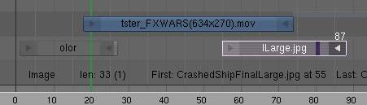

**********************************
13 Editors - Video Sequence Editor
**********************************

.. contents:: Contents

Video Sequence Editor
=====================

This manual part is grabbed 1: 1 from Blender.

Note that the Video Sequence Editor is not officially supported in Bforartists. It is still there. It is fully functional. You can work with it, the layout exists. It's the same VSE than in Blender. But Bforartists does not support it officially. We recommend to use something more useful. Everything is better than the Video Sequence Editor in Bforartists. Kdenlive is opensource and multiplatform. Hitfilm has a free version. Or do yourself a favour and spend the few bucks for one of the commercial solutions. It is well spent money.

NOTE ALSO THAT THE BFORARTISTS KEYMAP DOES NOT HAVE THE HOTKEYS THAT ARE MENTIONED IN THIS MANUAL PART. THEY ARE REMOVED. YOU WOULD HAVE TO USE THE BLENDER KEYMAP TO USE THE VSE.

This manual part is just up because it doesn't hurt to have it online since the functionality is there.

Introduction
============

In addition to modeling and animation, Bforartists has a fully functional Video Sequence Editor (VSE) as well as an advanced node-based editor that also manipulates a video stream. **Compositing Nodes** operate equally well on images or video streams, and can apply detailed image manipulation on the stream.

The VSE within Bforartists is a complete video editing system that allows you to combine multiple video channels and add effects to them. You can use these effects to create powerful video edits (especially when you combine it with the animation power of Bforartists!) Furthermore, it is extensible via a plugin system to perform an unlimited number of image manipulations.

Using the VSE, you load multiple video clips and lay them end-to-end (or in some cases, overlay them), inserting fades and transitions to link the end of one clip to the beginning of another. Finally, add an audio track so you can synchronize the timing of the video sequence to match it. The result of using the VSE is your finished movie.

Default Video Editing screen layout.

The Video Sequence Editor has a header (where the menu and view modes are shown) and a workspace, and works in one of several view modes. The Marker menu allows you to add markers in the VSE. Markers are shared across animation editors. See **Markers**

The sequencer workspace is horizontally striped into channels and each video strip will go in a horizontal channel. Each channel is numbered on the left-hand side, starting from 0 and going up.

.. Reference:: The first channel ``0`` is unusable as a place to put strips. This is because it is used by the ``Sequencer Display`` to show a composite of all strips above channel ``0``.

Stripes toward the bottom are more dominant, which we’ll get to in a minute. In the x direction, seconds of animation or frames of animation (Ctrl-T to choose) are used as the measure of time (seconds 1 through 7 are shown). You can scale the time using the zoom keys or mouse actions (see the Reference for more info).

Video Sequence Editor in Sequence display mode

.. Reference:: By default the Sequencer is enabled however, it can be disabled in the ``Post Processing Panel``.

Editing and Manipulating
========================

Adjusting the View
------------------

Use these shortcuts to adjust the sequence area of the VSE: Pan MMB Zoom Wheel Vertical Scroll use Shift-Wheel, or drag on the left scroll bar. Horizontal Scroll use Ctrl-Wheel, or drag on the lower scroll bar. Scale View Vertically, drag on the circles on the vertical scroll bar. Scale View Horizontally, drag on the circles on the horizontal scroll bar.

As usual, the View Menu controls what and how you view in the workspace.

Properties Panel 

The Properties Panel contains options for the way the preview is displayed. 

View all Sequences Home

Zooms (out) the display to show all strips. 

Fit preview in Window Home

Resizes preview so that it fits in the window. 

Show Preview 1:1Numpad1

Resizes preview to a 1:1 scale (actual size). 

View Selected NumpadPeriod

Zooms in the display to fit only the selected strips 

Use this when working arranging a lot of strips and you want to use all of your screen to work.

Reference
=========

Draw Frames

Displays the frame number instead of the time, in the Frame Number Indicator. 

Show Frame Number Indicator 

Toggles the units of measure across the bottom of the workspace between seconds or frames. 

Safe Margin 

Displays an overlay on the preview, marking where title safe region is. 

Separate Colors 

When using Luma Waveform view, this separates R,G, and B into separate graphs. 

Transform Markers 

Transform Markers as well as Strips. 

Scrubbing
---------

To move back and forth through your movie, use the Timeline window. LMB click and drag left/right in the timeline window, moving the vertical bar which indicates the current frame. As you do, the image for that frame is displayed in the VSE window.

When you LMB directly on a sequence strip, this will show the strip **solo**, (temporarily disregarding effects and other strips, showing only this strips output).

Real-time scrubbing and image display is possible on reasonable computers when viewing an image sequence or movie (avi/mov) file.

Scene strips can use OpenGL previews or proxies for realtime playback, otherwise displaying rendered frame is supported, but typically too slow for real-time playback.

View Modes
----------

The icons in the header allow to change the view of the VSE. By default, only the sequencer is displayed. The second button displays only the Preview window, and the third button displays both the Sequencer and the Preview.

When the preview is enabled, you have several options to change what type pf preview to display. They are explained in the **Display Modes Page**.

Scene Preview
-------------

When using a Scene Strip in the sequencer, these settings in the Properties Panel determine how they are shown in the preview window.

Open GL Preview 

If you have Open GL, enable this setting to use Open GL for the scene preview renders. The drop down menu allows you to change how the Scene is displayed (Bounding Box, Wireframe, Solid, Textured). 

View Settings
-------------

The View Settings section in the properties panel contains addition display options.

Show Overexposed 

Increasing this number to 1 or greater displays a striped overlay to the preview image, showing where it is overexposed. A higher number gives a higher threshold for marking overexposure. 

Safe Margin 

Displays an overlay on the preview, marking where title safe region is. 

Proxy Render Size 

Draws preview using full resolution or different proxy resolutions. Render resolution is determined in the render settings panel. Using a smaller preview size will increase speed. 

Refresh View
------------

Certain operations, like moving an object in 3D View, may not force the Sequencer to call for a refresh of the rendered image (since the movement may not affect the rendered image). If an image or video, used as a strip, is changed by some application outside of Bforartists, Bforartists has no real way of being notified from your operating system. To force Bforartists to re-read in files, and to force a re-render of the 3D View, click the Refresh button to force Bforartists to update and synchronize all cached images and compute the current frame.

Selecting Strips
----------------

The Select Menu helps you select strips in different ways.

Strips to the Left 

Select all strips to the left of the currently selected strip. 

Strips to the Right 

Select all strips to the right of the currently selected strip. 

Select Surrounding Handles Alt-Ctrl-RMB

Select both handles of the strip, plus the neighboring handles on the immediately adjoining strips. Select with this method to move a strip that is between to others without affecting the selected strip’s length. 

Left Handle Alt-RMB

Select the left handle of the currently selected strip. 

Right Handle Ctrl-RMB

Select the right handle of the currently selected strip. 

Linked 

Select all strips linked to the currently selected strip 

Select All A

Selects all the strips loaded. 

Select Inverse 

Inverts the current selection. 

Border Select B

Begins the **Box** mode select process. Click and drag a rectangular lasso around a region of strips in your Sequence workspace. When you release the mouse button, the additional strips will be selected. 

Moving and Modifying Strips
---------------------------

G Moves the selected strip(s) in time or in channels. Move your mouse horizontally (left/right) to change the strip’s position in time. Move vertically (up/down) to change channels.

- To snap while dragging hold Ctrl
- To ‘ripple edit’ (Make room for strips you drag) hold Alt when placing a strip. 

If you have added a strip by mistake or no longer want it, delete it by pressing **X** or using this menu option.

**Duplicate** a strip to make an unlinked copy; drag it to a time and channel, and drop it by LMB click.

The Strip Menu contains additional tools for working with strips:

- **Grab/Move**
- **Grab/Extend from Frame**
- **Cut (hard) at frame**
- **Cut (soft) at frame**
- **Separate Images**
- **Deinterlace Movies**
- **Duplicate Strips**
- **Erase Strips**
- **Set Render Size**
- **Make Meta Strip**
- **UnMeta Strip**
- **Reload Strips**
- **Reassign Inputs**
- **Swap Inputs**
- **Lock Strips**
- **UnLock Strips**
- **Mute Strips**
- **Un-Mute Strips**
- **Mute Deselected Strips**
- **Snap Strips**
- **Swap Strips**

Snap to Frame
-------------

Shift-S Position your cursor (vertical green line) to the time you want. Snap to current frame to start a strip exactly at the beginning of the frame. If your Time display is in seconds, you can get to fractional parts of a second by zooming the display; you can get all the way down to an individual frame.

Separate Images to Strips
-------------------------

Y Converts the strip into multiple strips, one strip for each frame. Very useful for slide shows and other cases where you want to bring in a set on non-continuous images.

Editing Strips
--------------

- RMB in the middle of the strip selects the **entire** strip; holding it down (or pressing G rab) and then moving the mouse drags a strip around. 
- RMB on the left arrow of the strip selects the **start** frame offset for that strip; holding it down (or pressing G rab and then moving the mouse left/right changes the start frame within the strip by the number of frames you move it:
- RMB on the right arrow of the strip selects the **end** frame of the strip; holding it down (or pressing G rab) and then moving the mouse changes the ending frame within the strip:

- - If you have a 20-image sequence strip, and drag the left arrow to the right by 10 frames, the strip will start at image 11 (images 1 to 10 will be skipped). Use this to clip off a rollup or useless lead-in. 
- - Dragging the left arrow left will create a lead-in (copies) of the first frame for as many frames as you drag it. Use this when you want some frames for transitions to the this clip. 

- - Dragging the right arrow to the left shortens the clip; any original images at the tail are ignored. Use this to quickly clip off a rolldown. 
- - Dragging the right arrow right extends the clip. For movies and images sequences, more of the animation is used until exhausted. Extending a clip beyond its end results in Bforartists making a copy of the last image. Use this for transitions out of this clip. 

.. Note:: Multiple selection

- STRIP EXTEND. With a number of Image strips selected, pressing E enters EXTEND mode. All selected strip handles to the “mouse side” of the current frame indicator will transform together, allowing you to essentially extend the strips that fall exactly on the current frame marker and having all others adjust to compensate. 

While splicing two strips happens just by placing them finish-to-start, cut a strip by pressing K to cut. At the selected frame for the selected strips, K cuts them in two. Use Cut to trim off roll-ups or lead-ins, or roll-downs or extra film shot.

.. Reference:: Note on the ‘cut’

.. Note:: Action Stops

Change the length of an effect strip by changing the start/end frame of the origin strips.

Copy and Paste
--------------

You can copy a clip and paste it using the two header buttons.

Strip Properties
================

The properties for the strip are examined and set in the properties panel, shortcut kbd`N`.

- Edit Strip - change properties of the strip 
- Strip Input - where to pull images from 
- Effect - Settings for effects strips 
- Filter - Image pre-processing 
- Proxy - Use representatives of the real image, for low-powered PCs 
- Scene - Settings for when a scene strip is selected 
- Sound - Settings for a sound clip 

The panels for each of these sets of options and controls are shown to the right

- Edit Strip Panel 
- Strip Input Panel 
- Filter Panel 
- Proxy / Timecode Panel
- Modifiers Panel 

- - Proxy 
- - Timecode 

Edit Strip Panel
================

Name

You can name or rename your strips here. 

Type

Displays the type of strip selected. 

Blend Mode 

By default, a strip Replaces the output image of any lower-level strips. However, many other blending modes are available based on the strip type. For example, Alpha-Over automatically overlays the image on top of a lower level strip. Autoblending modes remove the need for separate effect strips. Blend percent controls how much of an effect the strip exerts, even over time. 

Opacity

Set the opacity of the strip. 

Mute

Hides the strip so that it does not participate in the final image computation 

Lock

Prevents the strip from being moved. 

Channel

Changes the channel number, or row, of the strip. 

Start Frame

Changes the starting frame number of the strip, which is the same as grabbing and moving the strip. Tip when you add a strip, I like to just drop it and then use this field to place it at the frame I want, rather that trying to drag and drop in exactly the right place. 

Length 

Specify the number of frames to use for the strip. 

Use the Convert to Premul button if a strip has an Alpha (transparency) channel. Use FilterY if the strip is from broadcast video and has even or odd interlacing fields. Enhance the color saturation through the Mul tiply field. Play a strip backwards by enabling Reverse Frames. Tell Bforartists to display every nth frame by entering a Strobe value. Finally, when using MPEG video (VCD, DVD, XVid, DivX, ...), an image is built up over the course of a few frames; use the Preseek field to tell Bforartists to look backward and compose the image based on the n previous frames (e.g. 15 for Mpeg2 DVD).

Strip Input Panel
=================

Controls the source of the strip. Fields include file path, file name, image offset, crop settings.

This is here you can editupdate the path of the file used by a strip. Very useful when you moved it one way or the other - this avoid you deleting and re-creating the strip!

You have two text fields for path, the first being the path of the parent directory (Path), and the second the file name itself.

Filter Panel
============

Enables you to quickly set common image pre-processing options.

Strobe 

To display only a defined number of images. For example, if you set this to 10, the strip will only display frames 1,11,21,31,41... of the source. 

Flip 

X flips (reverses) the image left-to-right, Y reverses top-to-bottom. 

Backwards 

Reverses strip image sequence 

De-Interlace 

Removes fields in a video file. 

Saturation 

Increase or decrease the saturation of an image. 

Multiply 

Multiplies the colors by this value. 

Convert Float 

Converts input to float data. 

Proxy / Timecode Panel
======================

Once you’ve chosen the Proxy/Timecode parameters, you need to use Strip > Rebuild Proxy and Timecode indices to generate the proxy clip and it will be available after Bforartists makes it.

Proxy
-----

.. image:: graphics/13_Editors_-_Video_Sequencer/10000201000000C80000012594EB7E8C808AC149.png

A proxy is a smaller image (faster to load) that stands in for the main image. When you Rebuild proxy Bforartists computes small images (like thumbnails) for the big images and may take some time. After computing them, though, editing functions like scrubbing and scrolling and compositing functions like cross using these proxies is much faster but gives a low-res result. Disable proxies before final rendering.

In order to actually use the proxies, the proper Proxy Render Size dropdown value must be selected in the Properties panel of the Sequencer View (where the edit plays back).

Proxy Storage 

	Defines whether the proxies are for individual strips or the entire sequence.

	Per Strip 

	Proxies are stored in the directory of the input.

	Proxy Custom Directory 

	By default, all generated proxy images are storing to the <path of original footage> /BL_proxy/<clip name> folder, but this location can be set by hand using this option. 

	Proxy Custom File 

	Allows you to use pre-existing proxies 

	Project 

	All proxies are stored in one directory

	Proxy Directory 

	The location to to store the proxies for the project. 

Proxy Size 

Buttons to control how big the proxies are. The available options are 25,``50``, 75, 100 percent of original strip size. 

Overwrite

Saves over any existing proxies in the proxy storage directory. 

Quality 

Defines the quality of the JPEG’s used for proxies. 

Timecode

See Timecode. 

Set Selected Strip Proxies 

Same as choosing the **Proxy Size** and **Overwrite**

Rebuild Proxy and Timecode Indices

Generates Proxies and Timecodes, same as doing Strip > Rebuild Proxy and Timecode indices 

Timecode
--------

When you’re working with footage directly copied from a camera without pre-processing it, there might be bunch of artifacts, mostly due to seeking a given frame in sequence. This happens because such footage usually doesn’t have correct frame rate values in their headers. So, for Bforartists to calculate the position of a needed frame in the stream works inaccurately and can give errant result. There are two possible ways to avoid this:

- Preprocess your video with, say, mencoder to repair file header and insert correct keyframes. 
- Use Proxy/Timecode option in Bforartists. 

Options
-------

Timecode 

Timecode to use on the selected movie strip. 

The following timecodes are supported:

- No TC in use- do not use any timecode 
- Record Run 
- Free Run 
- Free Run (rec date) 
- Record Run No Gaps 

.. Note:: Record Run is the timecode which usually is best to use, but if the clip’s file is totally damaged, ‘Record Run No Gaps’ will be the only chance of getting acceptable result.

Modifiers Panel
===============

Modifiers are used to make adjustments on the image, like contrast, brightness, saturation, color balance and applying masks.

You can add these modifiers directly to the selected strip, or you can use it within an “Adjustment Layer” effect strip, which allows you to apply these modifiers onto several strips the same time.

Use Linear Modifiers 

Calculate modifiers in linear space instead of sequencer space. 

Each modifiers have several buttons at their top:

- The “eye” is to disable the modifier. Very useful to compare the image, with / without modifications. 
- The next two buttons (up and down arrows) are used to change the modifier’s position in the stack. 
- The cross is to delete the modifier from the stack. 
- Strip Use this to apply the modification on the whole image, or to use another strip’s image (with alpha channel) for masking the modifier (and only this modifier), by choosing it in the “Mask” drop-down list. 
- Mask This one allows you to choose a Mask created in the Mask editor which will limit the modification to the masked image’s zones. 

Currently, the following modifiers are supported:

Color Balance 

	Color balance adjustments, through Lift, Gamma, and Gain.

.. Note:: This modifier works the same as the ``Color Balance Node``

Curves 

	C/RGB curves.

.. Note:: This modifier works the same as the ``Curves Node``

Hue Correct 

	HSV multi points curves.

.. Note:: This modifier works the same as the ``Curves Node``

Bright/Contrast 

Adjusts the brightness and contrast of the modifier input. 

Mask 

	Use it for masking the other modifiers in the stack which are below.

	For example, to correct the brightness only on a certain zone of the image, you can filter the Bright/Contrast modifier by placing a Mask modifier, just before it in the stack. You can choose to use a Mask created in the Mask editor, or to use another strip as a mask (the image of this strip must have an alpha channel). This mask will be applied on all the others modifiers below it in the stack.

White Balance 

Use it to adjust the white balance by choosing the color that should be white. 

Tone Map

	Used to map one set of colors to another in order to approximate the appearance of high dynamic range images in a medium that has a more limited dynamic range.

.. Note:: This modifier works the same as the ``Tone Map Node``

Strip Types
===========

- Introduction 
- Scene Strip 
- Image and Movie Strips 
- Effect Strips
- Sound Strips
- Meta Strips 

- - Introduction 
- - Add Effect 
- - Adjustment Layer 
- - Alpha Over, Under, and Over Drop 
- - Gaussian Blur 
- - Color 
- - Cross 
- - Gamma Cross 
- - Glow 
- - Multicam Selector 
- - Multiply 
- - Speed Control 
- - Subtract Effect 
- - Text Effect 
- - Transform 
- - Wipe 

- - Options 
- - Working with Audio Tracks 
- - Animating Audio Track Properties 
- - Output 
- - Known Limitations 

Introduction
============

The Add Menu

The Add menu is the main menu you will be using to add content to the VSE. In general, you load up your strips, create strips of special transition effects, and then animate out your sequence by selecting “Do Sequence” and clicking the Anim button. You can use the Add menu in the header, or hover your mouse cursor over the Sequence workspace and press Shift-A.

.. Note:: Clips can be Huge

First, let’s add a clip:

- A movie clip in the Audio-Video Interleaved format (\*.avi file) 
- A movie clip in the Apple QuickTime format (\*.mov) 
- A single still image to be repeated for a number of frames (\*.jpg, \*.png, etc.) 
- A numbered sequence of images (\*-0001.jpg, \*-0002.jpg, \*-0003.jpg, etc, of any image format) 
- One or more images from a directory 
- A Scene in your .blend file. 

Bforartists does not care which of these you use; you can freely mix and match any of them. They all become a color-coded strip in the VSE:

- Blue is used for Avi/mov codec strips 
- Grey is a single image that is repeated/copied 
- Purple is an image sequences or group of images played one after the other 
- Green is an Audio track 

When you choose to add one of these, the VSE window will switch to a file browser for you to select what you want to add. Supported files have a little rectangle next to their name (blue for images, green for clips) as a visual cue that you can pick them successfully:

Scene Strip
===========

You can add the virtual image output of a Scene in your current .blend file as well. Select the scene from the pop-up list, and a strip will be added and rubberbanded to your mouse just like a movie or image. The strip length will be determined based on the animation settings in that scene (not the current scene, unless the VSE is operating in the same scene).

When adding a Scene strip, please note that, in order to show you the strip in the VSE Image preview mode, Bforartists must render the scene. This may take awhile if the scene is complex, so there may be a delay between the time you select the scene and the time the strip appears. To reduce the delay, simplify the scene rendering by selecting fewer layers to render.

If the extra overhead of rendering the scene becomes burdensome (for either preview or for multiple test renders) and you have enough disk space consider rendering the scene to a sequence of PNGs and using an Image Sequence strip instead of a scene. This is very popular for static graphic overlays like title cards which are often little more than a static image with animated opacity.

Sequencer 

Process the render (and composited) result through the video sequence editor pipeline, if sequencer strips exist. This is the same function as in the render settings. 

Camera Override 

Change the camera that will be used. 

Image and Movie Strips
======================

When adding a Movie or Movie+Audio LMB to put the name of the file into the text box at the top; this selects a **single** file (like a movie)

In the case of (numbered) image **sequences**, you have a choice:

Directory 

RMB right-click on a directory name, and all files in that directory will be brought in as part of the image, in sort order, one image per frame 

Range

Navigate into the directory and right-click and drag over a range of names to highlight multiple files. You can page down and continue right-click-dragging to add more to the selection 

Batch

Shift-right-click selected non-related stills for batch processing; each image will be one frame, in sort order, and can be a mix of file types (jpg, png, exr, etc.) 

All 

Press A to select/deselect All files in the directory. 

When you click the **Select <whatever>** button, the window pane will switch back to VSE, and the strip will be rubber-banded to your mouse. You cannot load multiple movies at the same time by right-clicking them; no movies load if you right click them. Right-clicking only works for images.

In order to add items to the VSE, left-click for movies, left-click for single images, or right-click and drag for image sequences. Move your mouse to the frame/time and stripe you want, and click to break the rubberband and drop the strip in place (in a channel and starting at a frame).

When you add an image, Bforartists makes it into a 50-frame strip, which means that image will be in your video for two seconds (at 25 fps - PAL). Aside from re-positioning it, you will want to scale it by RMB -clicking on either the start or end arrow, and dragging left or right. As you move, the frame number updates to say where the arrow is. Click LMB to validate, or RMB to cancel the modification.

.. Tip:: Dealing with Different Sizes

If you scroll up the workspace, you will see an information channel (at vertical location channel 0) that gives you some helpful hints about the active strip. The example above shows a color strip from frames 1 to 25, then a mov file, and then an image strip. The info channel shows handy information about the image strip, whose name has been scrunched in the strip display, but is clearly spelled out in the information strip.

Effect Strips
=============

- Introduction 
- Add Effect 
- Adjustment Layer 
- Alpha Over, Under, and Over Drop 
- Gaussian Blur
- Color 
- Cross 
- Gamma Cross 
- Glow 
- Multicam Selector 
- Multiply 
- Speed Control
- Subtract Effect 
- Text Effect
- Transform
- Wipe

- - Options 

- - Creating a Slow-Motion Effect 
- - Keyframing the Speed Control 
- - Changing Video Frame Rates 

- - Options 
- - Export Subtitles 

- - Options 

- - Options 

Introduction
============

Available Effects.

Bforartists offers a set of effects that can be added to your sequence. Theses effects are listed to the right. Each effect is explained in the next pages individually, but they all are added and controlled in the same way. To add an effect strip, select one base strip (image, movie, or scene) by RMB clicking on it. For some effects, like the Cross transition effect, you will need to Shift-RMB a second overlapping strip (it depends on the effect you want). Then select Add > Effect and pick the effect you want from the pop-up menu. When you do, the Effect strip will be shown above the source strips. If it is an independent effect, like the **Color Generator**, it will be rubberbanded to your mouse; click to drop the strip.

.. Note:: Since most Effects strips depend on one or two source strips, their frame location and duration depends on their source strips. Thus, you may not be able to move it; you have to move the source strips in order to affect the effect strip.

To use an effect that combines or makes a transition between (or composites) two strips, you must Box select (B) or shift-right-click two of them. When you add the effect strip, it will be placed in a channel above the two in Grab mode (click to drop it on a channel). Its duration will be the overlap between the two strips as a maximum.

With some effects, like the **Alpha Over**, the order in which you select the strips is important. You can also use one effect strip as the input or source strip with another strip, thus layering effects on top of one another.

.. Note:: The only exception is the ``Color Generator`` effect. It does not depend on a base strip; you can add and position it independent of any other strip. Change the length as you would any strip.

If you picked the wrong effect from the menu, you can always change it by selecting the strip (RMB) and using the Strip > Change Effect selection. Or, you can press C to switch effects on a selected Effects strip.

Add Effect
==========

Can you hear the thunder?

The Add effect adds two colors together. Red and Cyan (Green and Blue) make White. Red and Blue make “Magenta” (i.e. Purple!). Red and Green make Yellow.

The Add Effect adds the colors of two strips together, Use this effect with a base image strip, and a modifier strip. The modifier strip is either a solid color or a black-and-whte mask, or another image entirely. The example to the right shows what happens when you add gray to an image, and animate the effect over time. The image gets bright because we are adding gray (R:.5, G:.5, B:.5) to say, a blue color (R.1, G:.1, B:.5) resulting in (R:.6, G:.6, B:1.0) which retains the original hue (relationship between the colors) but is much brighter (has a higher value). When applied to the whole image like this, the whole image seems to flash.

You can use this effect to increase the brightness of an image, or if you use a BW mask, selectively increase the brightness of certain areas of the image. The Mix node, in Add mode, does exactly the same thing as the Add sfx strip here, and is controlled the same way by feeding the Factor input.

Adjustment Layer
================

The Adjustment Layer strip works like a regular input file strip except for the fact, that it considers all strips below it as it’s input.

Real world use cases: you want to add some last finishing color correction on top of parts of your final sequencer timeline without messing with metastrips around. Just add an adjustment layer on top and activate the color balance.

Or: you can stack a primary color correction and several secondary color correction on top of each other (probably using the new mask input for area selection).

Alpha Over, Under, and Over Drop
================================

AlphaOver Effect

Using the alpha (transparency channel), this effect composites a result based on transparent areas of the dominant image. If you use a Scene strip, the areas of the image where there isn’t anything solid are transparent; they have an alpha value of 0. If you use a movie strip, that movie has an alpha value of 1 (completely opaque).

So, you can use the **Alpha Over** / **Alpha Under** effect to composite the CGI Scene on top of your movie. The result is your model doing whatever as if it was part of the movie. The Factor curve controls how much the foreground is mixed over the background, fading in the foreground on top of the background. The colors of transparent foreground image areas is ignored and does not change the color of the background.

Select two strips (Shift-RMB):

- With **Alpha Over**, the strips are layered up in the order selected; the first strip selected is the background, and the second one goes **over** the first one selected. The **Fac** tor controls **the transparency of the foreground**, i.e. a **Fac** of **0.0** will only show the background, and a **Fac** of **1.0** will completely override the background with the foreground (except in the transparent areas of this one, of course!) 
- With **Alpha Under**, this is the contrary: the first strip selected is the foreground, and the second one, the background. Moreover, the **Fac** tor controls **the transparency of the background**, i.e. a **Fac** of **0.0** will only show the foreground (the background is completely transparent), and a **Fac** of **1.0** will give the same results as with **Alpha Over**. 
- **Alpha Over Drop** is between the two others: as with **Alpha Under**, the first strip selected will be the foreground, but as with **Alpha Over**, the **Fac** tor controls the transparency of this foreground. 

The example shows layering of AlphaOver effects. The very bottom channel is red, and an arrow is on top of that. Those two are AlphaOver to Channel 3. My favorite toucan is Channel 4, and Channel 5 alphaovers the toucan on top of the composited red arrow. The last effect added is tied to Channel 0 which will be rendered.

By clicking the PreMult Alpha button in the properties panel of the foreground strip, the Alpha values of the two strips are not multiplied or added together. Use this effect when adding a foreground strip that has a variable alpha channel (some opaque areas, some transparent, some in between) over a strip that has a flat opaque (Alpha=1.0 or greater) channel. If you notice a glow around your foreground objects, or strange transparent areas of your foreground object when using AlphaOver, enable PreMultiply. The AlphaOver Drop effect is much like the Cross, but puts preference to the top or second image, giving more of a gradual overlay effect than a blend like the Cross does. Of course, all of the Alpha effects respect the alpha (transparency) channel, whereas Cross does not.

The degree of Alpha applied, and thus color mixing, can be controlled by an F-curve. Creating a Sine wave could have the effect of the foreground fading in and out.

Gaussian Blur
=============

The Guassian Blur strip is used to blur the input strip in the defined direction. This can be used to blur a background or to blur though a transition (see image).

Example of Bluring a Transition.

Options
-------

Size X

Distance of the blur effect on the X axis. 

Size Y 

Distance of the blur effect on the X axis. 

Color
=====

This effect works by itself to create a color strip. By default, when it is created, it is 50 frames long, but you can extend it by grabbing and moving one of the ends. Click on the color swatch in the Effect panel under Sequencer buttons, which is under the Scene tab, to pick a different color (by default, it is gray). Use this strip crossed with your main movie to provide a fade-in or fade-out.

Cross
=====

This effect fades from one strip to another, based on how many frames the two strips overlap. This is a very useful strip that blends the whole image from one to the other.

Gamma Cross
===========

This effect fades from one strip to another, based on how many frames the two strips overlap. This is a very useful strip that blends the whole image from one to the other.

Gamma Cross uses color correction in doing the fade, resulting in a smooth transition that is easier on the eye.

Glow
====

Example of a Glow effect applied to a picture. Top left: base picture (Lofoten Islands, Norway - source: wikipedia.fr); Top right: result of the effect; Bottom left: effect settings; Bottom right: result with the Only boost button activated.

This effect makes parts of an image glow brighter by working on the luminance channel of an image. The **Glow** is the superposition of the base image and a modified version, where some areas (brighter than the **Threshold:**) are blurred. With the **Glow** strip properties, you control this **Threshold:**, the maximum luminosity that can be added (**Clamp:**), a **Boost factor:** for it, the size of the blur (**Blur distance:**), and its **Quality:**. The **Only boost** button allows you to only show/use the ‘modified’ version of the image, without the base one. To “animate” the glow effect, mix it with the base image using the Gamma Cross effect, crossing from the base image to the glowing one.

Multicam Selector
=================

The Multicam Selector stip is used for multi camera editing. Multicam editing is for when you have multiple cameras recording the same scene from different angles. To edit these in the VSE can be easy if you do it right.

- First your going to want to add in each of your video strips. 
- Next make sure to sync them to each other using there audio waveform see the **Audio Docs** or by the movement of objects. 
- If you are using any effects on you strips it may helpful to use Meta Strips 
- Add a viewer window for every input channel and put it into 25% proxy display mode 
- Add a multicam selector effect strip **above** all the channel tracks 

After Completing these steps you should get something similar to the image below:

.. image:: graphics/13_Editors_-_Video_Sequencer/10000000000006400000036DDF25EBEB5C642EE1.png

- Now select the multicam strip, if you take a look at the strip options (N-key), you will notice, that multicam is a rather simple effect strip: it just takes a selected channel as it’s input. That’s all. The magic comes with the convenient keyboard layout. 
- When you select the multicam strip, the keys 1-9 are mapped to a python handler, that does a cut on the multicam and changes it’s input. 
- So: you select the multicam strip, you start playback and press the keys for the correct input while watching your show. 
- You’ll end up with a small multicam selector strip for every cut. 

In reality, it boils down to: watch a few seconds to see, what’s coming, watch it again and do a rough cut using the number keys, do some fine tuning by selecting the outer handles of two neighboring multicam for A/B rolling.

Multiply
========

Multiply Effect.

The **Multiply** effect multiplies two colors. Bforartists uses values between **0.0** and **1.0** for the colors, he doesn’t have to normalise this operation, the multiplication of two terms between **0.0** and **1.0** always gives a result between **0.0** and **1.0** (with the ‘traditional’ representation with three bytes - like RGB(**124**, **255**, **56**) -, the multiplications give far too high results - like RGB(**7316**, **46410**, **1848**) -, that have to be ‘brought back’, normalised - just by dividing them by **256** ! - to ‘go back’ to range of **0** to **255** ...). **256** ! - to ‘go back’ to range of **0** to **255** ...).

This effect has two main usages:

With a mask 

A mask is a B&W picture witch, after multiplication with a ‘normal’ image, only show this one in the white areas of the mask (everything else is black). The opening title sequence to James Bond movies, where the camera is looking down the barrel of a gun at James, is a good example of this effect. 

With uniform colors 

Multiplying a color with a ‘normal’ image allows you to soften some hues of this one (and so - symmetrically - to enhance the others). For example, if you have a brown pixel RGB(**0.50**, **0.29**, **0.05**), and you multiply it with a cyan filter (uniform color RGB(**0.0**, **1.0**, **1.0**), you’ll get a color RGB(**0.0**, **0.29**, **0.5**). Visually, the result is to kill the reds and bring up (by ‘symmetry’ - the real values remain unchanged!) the blues an greens. Physically, it is the same effect as shining a cyan light onto a chocolate bar. Emotionally, vegetation becomes more lush, water becomes more Caribbean and inviting, skies become friendlier. 

.. Note:: This effect reduces the global luminosity of the picture (the result will always be smaller than the smallest operand). If one of the image is all white, the result is the other picture; if one of the image is all black, the result is all black!

Speed Control
=============

Speed Control time-warps the strip, making it play faster or slower than it normally would. A Global Speed less than 1.0 makes the strip play slower; greater than 1. 0 makes it play faster. Playing faster means that some frames are skipped, and the strip will run out of frames before the end frame. When the strip runs out of frames to display, it will just keep repeating the last one; action will appear to freeze. To avoid this, position the next strip under the original at a point where you want motion to continue.

Creating a Slow-Motion Effect
-----------------------------

50% Slow motion using Speed Control

Suppose you want to slow your strip down. You need to affect the speed of the video clip without affecting the overall frame rate. Select the clip and Add–>Effect–>Speed Control effect strip. Click to drop it and press N to get the Properties. Uncheck the **Stretch to input strip length** option in the Effect Strip section. Set the Speed factor to be the factor by which you want to adjust the speed. To cut the displayed speed by 50%, enter 0.5. Now, a 275-frame clip will play at half speed, and thus display only the first 137 frames.

If you want the remaining frames to show in slo-mo after the first set is displayed, double the Length of the source strip (since effects strip bounds are controlled by their source strips). If you’re using a speed factor other than 0.5 then use the formula

new_length = real_length / speed_factor

That’s it! Set your render to animate (in this example) all 550 frames.

Keyframing the Speed Control
----------------------------

keyframing the Frame number

To get even finer control over your clip timing, you can use curves! While it is possible to keyframe the Speed factor, usually you want to keyframe the Frame number directly.

Uncheck **Stretch to input strip length** and uncheck **Use as speed**. You now have a Frame number field which you can keyframe. If you want the strip to animate **at all** you will have to insert some keyframes, otherwise it will look like a still. In most cases you will want to use the Graph editor view to set the curve interpolation to Linear since the default Bezier will rarely be what you want.

If you do choose to keyframe the Speed factor instead, remember to click the Refresh Sequencer button in the header of the Video Sequence Editor’s strip view or your changes will not take effect.

Changing Video Frame Rates
--------------------------

You can use the speed control to change the frames per second (fps), or framerate, of a video. If you are rendering your video to a sequence set, you can effectively increase or decrease the number of individual image files created, by using a Global Speed value less than or greater than one, respectively. For example, if you captured a five-minute video at 30 fps and wanted to transfer that to film, which runs at 24 fps, you would enter a Global Speed of 30/24, or 1.25 (and Enable Frame Blending to give that film blur feel). Instead of producing 5\*60\*30=9000 frames, Bforartists would produce 9000/1.25=7200=5\*60\*24 frames. In this case, you set a start=1 and end=7200, set your Format output to Jpeg, 30fps, and image files 0001.jpg through 7200.jpg would be rendered out, but those images ‘cover’ the entire 9000 frames. The image file 7200.jpg is the same a frame 9000. When you read those images back into your film .blend at 24 fps, the strip will last exactly 5 minutes.

Subtract Effect
===============

.. image:: graphics/13_Editors_-_Video_Sequencer/10000000000001BD00000172DA110B7B20416EA4.png

Subtract Effect

This effect takes away one strip’s color from the second. Make a negative of an image using this effect, or switch the order of the strips and just darken the strip. Subtracting a hue of blue from a white image will make it yellow, since red and green make yellow.

Text Effect
===========

The text effect strip allows you to directly displaying text in the sequence editor. The strip will display the text inserted in its text field on the final sequence.

Text Effect

Options
-------

Text 

The actual text displayed. 

Size 

Size of the text. 

Shadow 

Creates a shadow under the text. 

Auto Center 

Centers the text on the x axis. 

X Position 

Positions the text on the x axis. Only appears if auto center is off. 

Y Position 

Positions the text on the y axis. 

Export Subtitles
----------------

Exporting subtitles in .srt format is also supported. The exported subtitles contain all text strips in the sequence editing.

Transform
=========

Transform is a swiss-army knife of image manipulation. It scales, shifts, and rotates the images within a strip.

Options
-------

Interpolation 

Todo. 

Translation Unit 

Control whether the input values are in **Percent** or **Pixels**

Uniform Scale

Scale the input evenly along the X and Y axis. 

Scale 

Scale the image on the X and Y axis 

Rotation

Rotates the input 2 dimensionally along the Z axis. 

Wipe
====

Wipe Effect Settings

The wipe effect is a type of transition strip. It can be used to transition from one strip to the next. The wipe will have no effect if created from a single strip instead of two strips. The duration of the wipe is the intersection of the two source strips and can not be adjusted. To adjust the start and end of the wipe you must adjust the temporal bounds of the source strips in a way that alters their intersection.

Options
-------

Transition 

	The type of transition used.

	Clock 

	Like the hands of an analog clock, it sweeps clockwise or (if Wipe In is enabled) counterclockwise from the 9:00 position. As it sweeps, it reveals the next strip. 

	Iris 

	Like the iris of a camera or eye, it reveals the next strip through an expanding (or contracting) circle. You can blur the transition, so it looks like ink bleeding through a paper. 

	Double 

	Similar to **Single** but uses two lines either starting from the middle of the image or the outside. Unlike the other transitions you can control the angle of the line using the angle controls. 

	Single 

	Reveals the next strip by uncovering it in a strait line moving across the image. This transition also allows you to control the angle of the transition. 

Direction 

Control whether to fade **In** or **Out**. 

Blur Width 

The width of the blur used to blur the transition. 

Sound Strips
============

As well as images and movies the VSE can also edit audio tracks. You can add WAV, Mp3 and other audio formates files from your hard disk as a file, or as encoded within a movie, and mix them using an F-Curve as a volume control.

Example of Sound Editing

Options
-------

Pack 

This allows you to save the audio file into the .blend file. 

Caching 

Caching loads a file into ram and plays it from there, apposed to reading it for the hard drive. 

Draw Waveform 

Draws a waveform over top of the sequence strip. This can be useful for syncing two or more audio strips. 

Volume 

Changes the loudness of the audio. 

Pitch 

Changes the frequency of the audio. 

Pan 

Used to pan the audio from left an right channels -2 being hard left, 2 being hard right. 

Working with Audio Tracks
-------------------------

An audio track (strip) is just like any other strip in the VSE. You can grab and move it, adjust its starting offset using RMB over the arrow end handles, and K cut it into pieces. A useful example is cutting out the “um’s” and dead voice time.

You can have as many Audio strips as you wish and the result will be the mixing of all of them. You can give each strip its own name and volume via the N menu.

Overlapping strips are automatically mixed down during ANIM processing. For example, you can have the announcer on channel 5, background music on channel 6, and Foley sound effects on channel 7.

Animating Audio Track Properties
--------------------------------

To animate audio strips simply hit I over any of its values. Examples of animating an audio strip are to fade in/out background music or to adjust volume levels. Layered/crossed audio strips are added together; the lower channel does not override and cut out higher channels (unlike image and video strips). This makes Bforartists an audio mixer. By adding audio tracks and using the curves to adjust each tracks’ sound level, you have an automated dynamic multi-track audio mixer!

Output
------

There are two ways to render out your audio. You can either have it encoded with a video file or in its own audio file. To render your audio in an video file make sure to use a video format as the output with an audio codec and hit the render **ANIMATION** button in the properties editor. Read more on how to do this **here**. To render as a audio file simple use the **AUDIO** button. Read more on how to do this **here**.

Known Limitations
-----------------

Hiss, Crackle and Pop
---------------------

In some cases when **Caching** is disabled, playback noise/hiss is introduced.

If you hear pops and crackles, usually that is a sign that your hardware cannot keep up in real-time playback. They will not be present in your final rendered animation output.

Also, static hiss can occur whenever two or more audio strips are overlapping in the timeline.

Meta Strips
===========

Meta-Strips are a kind of organization tool. For example, if you are using a lot of strips and they are complicated the the interface you can group them together using Meta-Strips. A Meta-Strip spans from the beginning of the first strip to the end of the last one, and condenses all channels into a single strip. Separating (ungrouping) them restores them to their relative positions and channels. To create a Meta-Strip select all the strips you want to group, and Ctrl-G to group them. If you choose to delete a Meta-Strip and want to keep the strips inside, use Alt-G.

Example of Meta-Strip.

After creating a Meta-Strip it is also possible to edit the contents inside a Meta-Strip. To do this select the desired Meta-strip and press Tab. Once you are done editing the contents inside a Meta-Strip press Tab again to exit the Meta-Strip. Meta-Strips can also be nested, which make editing them a little confusing. To exit out one level of Meta-Strip make sure you do not have a Meta-Strip selected when you press Tab.

.. Note:: The default blend mode for a Meta strip is Replace. There are many cases where this alters the results of the animation so be sure to check the results and adjust the blend mode if necessary.

One convenient use for Meta-Strips is when you want to apply the same effect to multiple strips. For example: if you have a video that was recorded in different files and want to add an effect strip. It is much more convenient to apply a single set of effects to one Meta-Strip then applying it to each individual strip.

.. See also:: It is also possible to do the similar task described above with a ``Adustment Layer`` effect strip.

Sequence Display Modes
======================

By default, the VSE only displays the sequencer. Several options in the header bar allow you change the editor to display the sequence in real time, and in various ways.

Sequencer Display Header

The second button will change the editor to display only the preview, and the third button displays both the sequencer and the preview.

The VSE workspace can show you different aspects of the composite result, for the current frame:

- Image/Sequence: Colors (what you see) 
- Chroma: Color hue and saturation 
- Luma: Brightness/contrast 
- Histogram: Levels of red, green, and blue 

In the Chroma, Luma, and Image modes, a channel selector appears; channel 0 is the result of compositing the strips with their special effects strips. Channel 1 is what the current frame’s image from the strip in channel 1 looks like (channel 1 is at the bottom of the heap). The display of these modes is either the composite (channel 0) or the frame from the strip (channels 1 through n).

Previews
--------

Image Preview
-------------

In the upper window pane of the Sequence screen layout is another VSE window, this one set to Image Preview mode. It shows you what the resulting video will look like when saved. This is the main working mode for adding strips and moving them around, cutting, grouping (making meta) and splicing them through special effects.

Luma Waveform
-------------

For the selected channel, brightness, or luminosity, is mapped with this display.

A luma waveform allows you to judge the quality of the luminance distribution across your video signal, you can view a luma-waveform instead of the usual output display on every control monitor.

The display plots for every scanline the luminance value. The lines are all drawn on top of each other. The points get brighter if the lines cross (which is very likely with several hundred scanlines). You will understand the picture most easily if you plug an oscilloscope to the Luma-video-output of your television set. It will basically look the same.

In this mode, the vertical axis represents the luminosity: 0 at the bottom, 1 at the top; the horizontal axis is a mapping from the horizontal axis of the frame. There are as many curves as scanlines in the frame: each one of this curves represents the luminosity of the pixels of one line. Moreover, the color of a pixel in this mode represents the number of pixels from the matching column of the frame sharing the same luminosity - i.e. the number of curves that cross at this point (black/transparent, for no pixel, white/opaque for at least 3 pixels).

This mode is good for:

- If the waveform does not fill the whole picture you might want to play with the “setup” and “gain” master-sliders in the “gamma”-plugin until it fills the whole picture (contrast autostretch). 
- With the more advanced gamma-plugin you can decide where you have to desaturated (especially in dark regions). 
- You can judge if you want to dump the whole thing since it is completely distorted and clips at the top or the bottom. 

.. list-table::

	* - 	  - 
.. Note:: Note that the pictures (first green frame, at the top) are only 50px high, to limit the number of curves displayed in the ``Luma waveform``

Use this display to check for appropriate contrast and luminosity across all frames in the channel. When spots in the film that should have even illumination don’t, it looks like a flashbulb went off or an extra light was suddenly turned on. This can happen if two strips were rendered or shot under different lighting conditions but are supposed to be contiguous.

Chroma Vectorscope
------------------

Example of Chroma Vectorscope Preview.

Use this mode judge the quality of the color-distribution and saturation, you can also view a U/V scatter-plot.

The picture is converted to YUV-format. The U- and V-values represent the angle of the color. For pixel of the picture, one point is plotted in the display at the U and V-value-position. If several pixels happen to have the same U/V-value the pixel in the plot gets brighter.

To help you understand what color is meant, a hexagram marking the extreme positions (red, magenta, blue, cyan, green, yellow) is drawn and a red cross to mark the origin.

In other words, for the selected channel, this display shows the color space of the image inside a hexagon. Each point of the hexagon is a primary color: red, magenta, blue, cyan, green, and yellow. Black is at the center, and overall saturation is scaled as dots closer to the outside. The example to the right shows that the image has a lot of red (50% saturation) and small amount of blue, with no green.

Always: remember to activate an additional control monitor of the end result. Color calibration is a matter of taste and depends on what you want.

Use this display to check for too much color saturation. While over-saturated images look great for op-art and computer displays, they stink when shown on the big screen TV. Use Alt-A to scrub the video; this display will update with a new/revised map for each frame. Just like watching the Image preview to see what it looks like, watch the Chroma Vectorscope to watch for color use.

This mode is good for:

- If you picture looks very moody or desaturated you might want to take a look at the U/V-plot. You will most likely see all pixels building a crowd at the origin. If you add saturation using the “gamma”-plugin you can see in the U/V-plot if you distort the color. 
- If you do color-matching on a by hand basis you can match the angle you see of different channels monitors. 

Histogram
---------

Example of Histogram Preview.

This mode displays a graph showing the distribution of color information in the pixels of the currently displayed image. The X-axis represents values of pixel, from 0 to 1 (or 0 to 255), while the Y-axis represents the number of pixels in that tonal range. A predominantly dark image would have most of its information toward the left side of the graph.

Use this mode to balance out the tonal range in an image. A well balanced image should a nice smooth distribution of color values.

