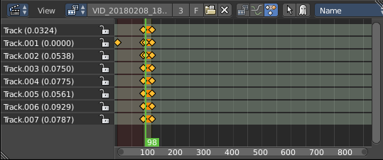
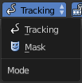
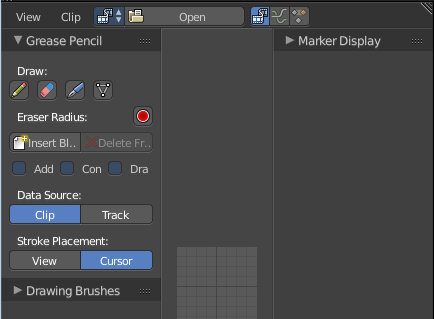
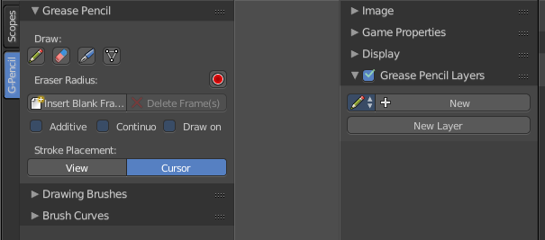
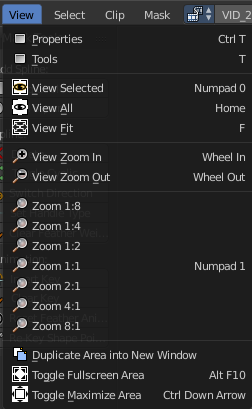
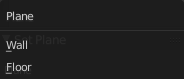
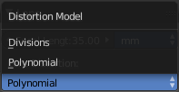
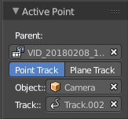
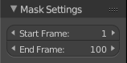

********************
14 Movie Clip Editor
********************

.. contents:: Contents

Detailed Table of content
=========================

Tracking Introduction
=====================

Match moving is a cinematic technique that allows the insertion of computer graphics into live-action footage ( a movie ) with correct position, scale, orientation, and motion relative to the objects in the shot. And this is what motion tracking does.

Bforartists motion tracker supports tools for 2D tracking and 3D motion tracking. This includes camera tracking and object tracking, as well as some special features like the plane track for compositing. Tracks can also be used to move and deform masks for rotoscoping in the Mask Editor. This is available as a special mode in the Movie Clip Editor.

Manual Lens Calibration
-----------------------

All cameras record distorted video. That's how optical lenses work. For accurate camera motion you need the exact value of the focal length and the “strength” of distortion.

Focal length can only be automatically obtained from the camera’s settings or from the EXIF information. Both is not necessarily available. There are some tools which can help to find approximate values to compensate for distortion. There are also fully manual tools where you can use a grid which is getting affected by distortion model and deformed cells defines straight lines in the footage.

You can also use the grease pencil for this – just draw a line which should be straight on the footage using poly line brush and adjust the distortion values to make the grease pencil match lines on the footage.

To calibrate your camera more accurately, use the grid calibration tool from OpenCV. OpenCV is using the same distortion model, so it should not be a problem.

Camera and Object Motion Solving
--------------------------------

Bforartistssupports the solving of camera motion, including tripod shots,. It includes also the solving of object motion in relation to the motion of the camera. In addition to that there is the Plane Track, which solves the motion of all markers on one plane.

Tools for Scene Orientation and Stabilization
---------------------------------------------

After solve, you need to orient the real scene in the 3D scene for more convenient compositing. There are tools to define the floor, the scene origin, and the X/Y axes to perform scene orientation.

Sometimes, the video footage includes spurious jumps and tilting movements, like e.g. when using a hand held camera. Based on some tracked image elements, the 2D Stabilization is able to detect and compensate such movements to improve the quality of the final result.

Movie Clip Editor Introduction
==============================

The Movie Clip Editor is the editor where you deal with the footage for motion tracking. Here you load your footage movies, mask them out, set the markers, and calculate the tracks.

The Movie clip editor is three editors in one. The actual Clip editor, a Graph editor, and a Dopesheet editor. You can switch to the different editor types with this menu here in the header:

And the Clip editor has two modes. Tracking and Mask.

Marker
======

A marker is a tracking point in the movie. A point where the position of the pixel underneath the marker gets tracked. That's where the camera tries to follow the motion.

Each marker is represented by a rectangle. You can insert a marker by hand or automatically with the Detect feature.

When you select a marker then it will be displayed with handlers. One in each corner, and a straight line from the center of the marker. This Handlers can be manipulated with the mouse.

The handlers in the corners allows to distort the marker, to fit it to distortions in the movie. 

The straight handler from the center allows you to rotate and scale the marker.

Every marker has also a search area, where the searching for the tracking happens.

The search area can be enabled in the Marker Display panel in the Properties Sidebar.

This area usually scales with the marker. To scale this search area separately you can use the handlers of this search area.

Or you can scale the marker only by pressing the scale hotkey twice. 

Track
=====

A track is the recorded movement of a marker. The movement is recorded in keyframes and curves. Once recorded you can see the track for the markers in the Dopesheet editor in the Movie Clip Editor.

And you can see the curves for this track(s) in the Graph editor.

Short tutorial
==============

There are too many steps involved to get Motion tracking working. You can't figure it out by your own, nothing is self explaining. So here comes a short workflow tutorial.

Note that we will just cover some of the basics here, some first steps. And we describe the setup for a ground tracking case here. I would suggest to search for a Blender tracking tutorial for more details.

Preparing the video
-------------------

Load a video.

Set the frame to the one where you want to start the tracking. The range of the movie to work with can be set in the Timeline at the bottom of the layout. I have chosen frame 90 to 120 here. Since especially the first frames of my example movie were very blurry.

Click the Detect Features button in the tool shelf in the Track tab in the Marker panel. This sets some markers automatically, and adds tracks in the movie clip editor in dopesheet mode. Every track represents one marker.

You can add a few more markers manually with the Add Marker button, and place them at marcant locations in the current image of the movie. Borders or Corners for example. To do so, click the Add Marker button, then click in the image. We need minimum eight markers to have enough stability. The Add Marker button is below the Detect Features button.

Selected markers can be moved with the left mouse. You can fine tune the position of the marker in the Track panel in the Properties sidebar. Simply move the image there to the required position.

Now choose a camera preset in the properties sidebar in the Camera Data panel. If unsure, and your camera isn't listed, select Blender.

Or type in the values manually. Sensor and Optical Center ...

Select all markers.

Click the Track Forward button in the Track panel. This records everything. And you get data in the Graph Editor view. Blue and red lines for every marker.

.. image:: graphics/14_Editors_-_Movie_Clip_Editor/10000201000000AB0000012FBD93E9ED74753206.png

Some markers may go crazy at this point. Motion means blurry graphics. And then a marker can loose its tracking position. Or the tracking point moves out of the visible area. 

You can either remove such markers after tracking when you have enough working tracks left. Remember we need eight valid tracks. You can also try to add new markers, and repeat the procedure with this new markers.

Or you can manually adjust the markers, and add a keyframe where they loose their position. Scroll to the frames where the marker is loosing its position, move it back into location, and add a keyframe for it. Adding keyframes is done in the Track menu.

Tracking the object
-------------------

This was the preparation of the movie material. Now for the tracking part. We need a camera. And something to track. A cube will do it for now.

In the 3D view, create or select the object that you want to track. 

Now go into camera view, and adjust it so that it shows the content somehow in the center. Our cube for example.

Go to the solve tab into the solve panel. First adjust the range. I had tracked frame 90 to frame 120. So the default of 1 and 30 will not work since there are no keyframes for the markers at this position. And so you will get an error.

When done click at the solve camera motion button. This calculates the camera motion.

In the solve tab in the Scene Setup panel click at Set as Background. This will show our movie as background now in the 3D view in the camera view.

In the solve tab in the Geometry panel, click at 3D Markers to Mesh. You can also click Link Empty to Track. This will create an empty where you can parent things at.

Then click at Setup Tracking Scene below the Set as Background button. This will create a ground plane, which is used for shadow catching in the rendering. And now our object should already follow the motion of the movie when you play back.

Orientation and dimensions
--------------------------

In the solve tab you can find the Orientation panel. This allows you to adjust the orientation of the object along marker points. Select three of your markers, and click at Floor, and the object will orient along this three points.

This may or may not lead to useful results. In our case it didn't. Even after selecting other markers. So we need to rotate our object manually.

.. image:: graphics/14_Editors_-_Movie_Clip_Editor/1000020100000167000000D5729B15B701281F04.png

Note that the view in the Motion Tracking layout the camera is NOT locked to view. So when you zoom then the passepartout zooms, not the view. And you can't rotate the camera view that way. So go to the View panel, and tick Lock Camera to view. Then you can navigate from the camera view, and rotate and zoom everything so that it fits.

You can also scale the object to the needed size. Or fit the perspectivic distortions by changing the Camera focal length, or by zooming.

Reloading a project
-------------------

When you save your project and reload it then you might notice that the Movie Clip editor loads empty. This is because Bforartists has "Load UI" unticked. And so it looks like the movie is missing and the project is empty.

There is nothing missing. You just need to select the movie again in the dropdown box at the top.

When you work more often with motion tracking, then you might want to activate Load UI in the user preferences permanently.

Clip Editor, Gaph Editor and Dopesheet Editor
=============================================

The Tracking mode has three different sub editor types. Clip Editor, Graph Editor and Dopesheet Editor.

Clip Editor
-----------

The clip editor contains the footage related tools and settings. Here you deal with the footage movie. It's the main window that you see in the Motiontracking layout. The Clip Editor view has two main purposes. It can be used for for tracking or masking movies. 

The Clip Editor has four areas. Actually five, since the tool shelf is divided into two areas. 

The Header. The place for menus and some often used tools and settings.The viewport, where you display your movies. The Tool shelf. Here you will find the tools. When you are in Mask mode then the toolset will be different.The Last Operator panel. Here you will find the settings for the currently active tool.The Properties Sidebar. Here you will find properties.

Graph Editor
------------

The Graph editor is the place where you can see and deal with the function curves of the recorded tracks.

The Graph editor has two areas. 

The Header. The place for menus and some often used tools and settings.The viewport, where you display the curves.

Dopesheet Editor
----------------

The Dopesheet Editor is the place where you deal with the keyframes for the tracks.

The Dopesheet editor has three areas. 

The Header. The place for menus and some often used tools and settings.The left column where you can see the name of the tracks.The right column where you can see the keyframes.

Clip Editor Introduction
========================

The clip editor contains the footage related tools and settings. Here you deal with the footage movie. It's the main window that you see in the Motiontracking layout. The Clip Editor view has two main purposes. It can be used for for tracking or masking movies. 

The Clip View is used is the main part of the of the Movie Clip editor. Almost all motion tracking tools are concentrated in the Movie Clip Editor.

Camera solver consists of three separate steps.

2D tracking of footage. 

Camera intrinsics (focal length, distortion coefficients) specification/estimation/calibration. 

Solving camera, scene orientation, and scene reconstruction. 

Clip Editor general navigation
==============================

You can move the frame slider with the left mouse here.

To scroll in and out in the viewport you can use the scroll wheel. Or the + and - Buttons at the Numpad.

Panning the viewport happens with middle mouse button.

Clip Editor - Tracking and Mask Mode
====================================

The Clip editor has two modes. Tracking Mode and Mask Mode.

The Tracking mode contains all functionality regarding motion tracking and footage.The Mask Mode contains tools to mask out parts of the footage. The masking part is spline based.

The mask tools in the Tool Shelf and the Properties Editor appears when you create a new mask.

Tool Shelf - Grease Pencil
==========================

The Grease Pencil tool is a tool with which you can paint strokes in editors like the 3D view. 

It is unfortunately cluttered across two shelves. The Tool Shelf and the Properties Sidebar. Means you have to adjust settings at two places.

The first thing that you have to do is to load a movie. Without a movie loaded you can't use the Grease Pencil here. Then you can create a new Grease pencil. 

This can either be done in the Properties Editor by clicking at New. Or in the Grease Pencil Tab in the Tool Shelf by simply clicking at the Draw button. Then all Grease Pencil tools becomes visible. And a Grease Pencil layer gets created.

Grease Pencil Panel
-------------------

The Grease Pencil panel contains the general Grease Pencil tools. The Draw tool, eraser, some settings and tools.

Draw
----

The Draw section contains the draw tools.

Draw
----

Draw activates the freehand draw mode.

Erase
-----

Erase is the eraser tool with which you can delete strokes.

Line 
-----

Line paints a straight line between start and end point.

Poly 
-----

Poly allows you to paint polygon shapes.

Eraser Radius
-------------

Here you can adjust the radius of the eraser tool. Have a look at the hotkey, it's a hotkey only tool for proper functionality.

Insert Blank Frame
------------------

Insert a blank frame on the current frame.

Delete frames
-------------

Delete the active frame(s) of all editable grease pencil layers.

Draw Settings
-------------

The draw settings are placed besides each other, to save space. 

Additive Drawing
----------------

When you create new frames then the strokes from the previous active frame are included as the base for the current frame.

Continuous Draw
---------------

The Continuous Draw checkbox enables and disables the continuous draw mode. Normally the draw mode ends when you stop drawing the current line. And you have to activate the draw tool again when you want to continue with painting. With continuous draw you can immediately paint the second stroke without to enable the draw tool again. 

Eraser in Continuous Draw
-------------------------

The draw tools are disabled as long as you are in continuous draw. To erase a stroke use the right mouse button. The pencil turns into a red circle. With which you can erase strokes now.

.. image:: graphics/14_Editors_-_Movie_Clip_Editor/10000201000000BD000000AA52ECFB61A45A382E.png

End Continuous Draw
-------------------

The draw tools are disabled as long as you are in continuous draw. To end the continuous draw mode click outside of the viewport. In the tool shelf for example.

Draw on Back
------------

New strokes will be drawn behind all other strokes in the layer

Stroke Placement
----------------

Stroke Placement defines where the Grease Pencil stroke is placed.

View
----

View will place the stroke at the top of the viewport. It is not drawn in the 3D view.

Cursor
------

Cursor will place the stroke aligned with the 3d cursor, and aligned with the current camera view. It is drawn in the 3D view.

Enable Editing
--------------

Sometimes you want to edit the strokes that you have placed. Here you can enter the editing mode, and reveal some editing tools.

Edit Strokes Panel
------------------

The Edit Strokes Panel contains the tools to edit the Grease Pencil strokes. Most of the tools are pretty self explaining.

It is divided into two sections. Select and Edit.

Select
------

The select section.

Select All
----------

Toggles between select all and deselect all.

Border Select
-------------

Border select enters the Border Select mode. This is a special select mode where you can select elements by dragging a rectangle. And what's inside of the rectangle gets selected then. It adds to selection by default. 

To subtract from selection hold down Shift key. 

The selection gets applied when you release the mouse. You leave the mode automatically when you release the mouse.

Circle Select
-------------

Circle select enters the Circle Select mode. This is a special select mode where you can select elements by moving with the mouse over it. It adds to selection by default. 

To subtract from selection hold down Shift key. To exit the Circle select click with the right mouse button.

The pencil radius of the circle select tool can be adjusted with the scroll wheel.

Select Linked
-------------

Select the linked vertices of the same stroke.

Select More
-----------

More expands the selection.

Select Less
-----------

Less reduces the selection.

Select Color
------------

Select all grease pencil strokes with the same color than the currently selected one.

Edit
----

The Edit section.

Translate
---------

Moves the selected grease pencil geometry in the viewport by moving the mouse.

Last Operator Translate
-----------------------

The last operator appears in the 3D view!

Vector
------

Here you can adjust the position values for the three values

Constraint Axis
---------------

Here you can limit the position relative to the source object.

Orientation
-----------

Orientation is a drop-down box where you can choose the type of orientation for the mirroring action.

Proportional Editing
--------------------

Proportional Editing is a drop-down box where you can choose to use proportional editing. When you choose one of the active methods then the neighbour geometry gets influenced in a proportional way.

Proportional Editing Falloff
----------------------------

Proportional Editing Falloff is a drop-down box where you can choose a method for the falloff for the proportional editing.

Proportional Size
-----------------

Proportional size is a edit box where you can adjust the strength of the Proportional falloff.

Edit Grease Pencil
------------------

Edit Grease Pencil edits the selected Grease Pencil strokes.

Edit Texture Space
------------------

With Confirm on Release checked the action gets performed when you release the mouse button.

Rotate
------

The last operator appears in the 3D view!

Rotates the selected grease pencil geometryi in the viewport by moving the mouse.

Last Operator Translate
-----------------------

Angle
-----

Here you can adjust the rotation angle.

Constraint Axis
---------------

Here you can limit the position relative to the source object.

Orientation
-----------

Orientation is a drop-down box where you can choose the type of orientation for the mirroring action.

.. image:: graphics/14_Editors_-_Movie_Clip_Editor/1000020100000090000000932D2EC1559DCA838C.png

Proportional Editing
--------------------

Proportional Editing is a drop-down box where you can choose to use proportional editing. When you choose one of the active methods then the neighbour geometry gets influenced by Shrink/Fatten too in a proportional way.

Proportional Editing Falloff
----------------------------

Proportional Editing Falloff is a drop-down box where you can choose a method for the falloff for the proportional editing.

.. image:: graphics/14_Editors_-_Movie_Clip_Editor/10000201000000BA000000D5C32417D7CA2D08A2.png

Proportional Size
-----------------

Proportional size is a edit box where you can adjust the strength of the Proportional falloff.

Edit Grease Pencil
------------------

Edit Grease Pencil edits the selected Grease Pencil strokes.

Scale
-----

The last operator appears in the 3D view!

Scales the selected grease pencil geometry in the viewport by moving the mouse.

Last Operator Resize
--------------------

Vector
------

Here you can adjust the position values for the three values

Constraint Axis
---------------

Here you can limit the position relative to the source object.

Orientation
-----------

Orientation is a drop-down box where you can choose the type of orientation for the mirroring action.

.. image:: graphics/14_Editors_-_Movie_Clip_Editor/1000020100000090000000932D2EC1559DCA838C.png

Proportional Editing
--------------------

Proportional Editing is a drop-down box where you can choose to use proportional editing. When you choose one of the active methods then the neighbour geometry gets influenced by Shrink/Fatten too in a proportional way.

Proportional Editing Falloff
----------------------------

Proportional Editing Falloff is a drop-down box where you can choose a method for the falloff for the proportional editing.

.. image:: graphics/14_Editors_-_Movie_Clip_Editor/10000201000000BA000000D5C32417D7CA2D08A2.png

Proportional Size
-----------------

Proportional size is a edit box where you can adjust the strength of the Proportional falloff.

Edit Grease Pencil
------------------

Edit Grease Pencil edits the selected Grease Pencil strokes.

Edit Texture Space
------------------

With Confirm on Release checked the action gets performed when you release the mouse button.

Mirror
------

Mirror mirrors the selected geometry along the defined axis. Click the Mirror button, type in X, Y or Z, then confirm with enter.

Last Operator Mirror
--------------------

The Last Operator Mirror panel gives you tools to adjust the mirror action.

Constraint Axis
---------------

Constraint Axis gives you again the possibility to define the mirror axis. You can choose more than one axis here.

Orientation 
------------

Orientation is a drop-down box where you can choose the type of orientation for the mirroring action.

.. image:: graphics/14_Editors_-_Movie_Clip_Editor/1000020100000090000000932D2EC1559DCA838C.png

Proportional Editing
--------------------

Proportional Editing is a drop-down box where you can choose to use proportional editing. When you choose one of the active methods then the neighbour geometry gets influenced by Shrink/Fatten too in a proportional way.

Proportional Editing Falloff
----------------------------

Proportional Editing Falloff is a drop-down box where you can choose a method for the falloff for the proportional editing.

Proportional size 
------------------

Proportional size is a edit box where you can adjust the strength of the Proportional falloff.

Edit Grease Pencil
------------------

Edit Grease Pencil edits the selected Grease Pencil strokes.

Confirm on Release
------------------

With Confirm on Release checked the action gets performed when you release the mouse button.

Shear
-----

Shear shears the selection.

Last Operator Shear
-------------------

Offset
------

Adjust the offset 

Proportional Editing
--------------------

Proportional Editing is a drop-down box where you can choose to use proportional editing. When you choose one of the active methods then the neighbour geometry gets influenced by Shrink/Fatten too in a proportional way.

Proportional Editing Falloff
----------------------------

Proportional Editing Falloff is a drop-down box where you can choose a method for the falloff for the proportional editing.

.. image:: graphics/14_Editors_-_Movie_Clip_Editor/10000201000000BA000000D5C32417D7CA2D08A2.png

Edit Grease Pencil
------------------

Edit Grease Pencil edits the selected Grease Pencil strokes.

Confirm on Release
------------------

With Confirm on Release checked the action gets performed when you release the mouse button.

To Sphere
---------

To Sphere transforms the selection into a spherical form.

Last Operator To Sphere
-----------------------

Factor
------

Adjust the rounding factor

Proportional Editing
--------------------

Proportional Editing is a drop-down box where you can choose to use proportional editing. When you choose one of the active methods then the neighbour geometry gets influenced by Shrink/Fatten too in a proportional way.

Proportional Editing Falloff
----------------------------

Proportional Editing Falloff is a drop-down box where you can choose a method for the falloff for the proportional editing.

Proportional Size
-----------------

Adjust the proportional size

.. image:: graphics/14_Editors_-_Movie_Clip_Editor/10000201000000BA000000D5C32417D7CA2D08A2.png

Edit Grease Pencil
------------------

Edit Grease Pencil edits the selected Grease Pencil strokes.

Confirm on Release
------------------

With Confirm on Release checked the action gets performed when you release the mouse button.

Arrange Strokes
---------------

This is a dropdown box where you can arrange the currently selected stroke relative to the other ones.

Move to Color
-------------

Recolors the currently selected grease pencil stroke with the active color in the Grease Pencil Colors color.

The grease pencil colors can be found in the properties sidebar at the right.

Subdivide
---------

Subdivide subdivides the current selection.

Last Operator Subdivide Stroke
------------------------------

Number of Cuts
--------------

Adjust the number of subdivisions

Join
----

Joins strokes.

Last Operator Join Strokes
--------------------------

Type
----

Here you can choose if it should only join, or join and also copy the strokes.

Leave Gaps
----------

Leave Gaps between joined strokes instead of linking them.

Join & Copy
-----------

Joins strokes and copies it.

For last operator see above.

Flip Direction
--------------

Change the direction of the stroke.

Sculpt Strokes Panel
--------------------

The Sculpt Strokes Panel provides tools to sculpt the Grease pencil strokes. 

.. Note!:: The ``Sculpt Strokes`` Panel is just visible in Edit Strokes Mode!

Sculpt Strokes Button
---------------------

The Sculpt Strokes Button activates the Sculpt brush. Now you can sculpt the Grease Pencil stroke with left mouse button. Clicking with right mouse button ends the sculpt mode.

Radius
------

The radius of the sculpt brush.

The button behind the edit box allows you to set the radius by moving the mouse. This should be done in the viewport and with the hotkey. This button is just a visible reminder.

Strength
--------

The strength of the sculpt brush.

The button behind the edit box allows you to set the strength by moving the mouse. This should be done in the viewport and with the hotkey. This button is just a visible reminder.

Use Falloff
-----------

Defines if the brush has a falloff from the centre to the border of the pencil.

Position
--------

The Brush affects the position of the point.

Strength
--------

The Brush affects the strength of the point.

Thickness
---------

The Brush affects the thickness of the point.

Selection Mask 
---------------

Only sculpt the selected points.

Alpha
-----

Alpha value for selected vertices.

Affect Pressure
---------------

Affect pressure values as well when smoothing strokes.

Drawing Brushes panel
---------------------

The Drawing Brushes panel contains everything around the Brushes and their settings. It is visible in all modes. But the content just shows when you have activated the draw tool already.

Brushes selection box
---------------------

Here you can choose different brush types. At the right you can add and remove brushes. And you can sort the brushes order.

Thickness
---------

Defines the thickness of the stroke.

Sensitivity
-----------

Pressure sensitivity for new strokes.

Strength
--------

Color strength for new strokes. The alpha factor of the color is affected.

Randomness
----------

Randomness factor for pressure and strength of new strokes.

Jitter
------

Jitter factor for new strokes.

Angle
-----

Direction of the stroke at which the brush gives the maximum thickness.

Factor
------

Reduce Brush thickness by this factor when stroke is perpendicular to angle direction

Smooth
------

Amount of smoothing to apply to newly created strokes to reduce jitter / noise.

Iterations
----------

Number of times to smooth newly created strokes.

Subdivision
-----------

Number of times to subdivide newly created strokes, for less jagged strokes.

Randomness
----------

Randomness factor for new strokes after subdivision.

Brush Curves Panel
------------------

The Brush curves panel is meant for usage with tablets. Here you can manipulate the curves for Sensitivity, Strength and Jitter.

Properties Sidebar - Grease Pencil - Layers Panel
=================================================

The Grease Pencil Layers are connected with the Grease Pencil panel in the Tool Shelf. And provides you with the layer settings for the Grease Pencil.

When no layer exists then there are just a few buttons available.

Grease Pencil Prop
------------------

Here you can add a new grease pencil to work with. Or choose an existing grease pencil.

The edit box allows you to rename the current grease pencil. 

The F Button adds a fake user to the grease pencil. So that it does not get deleted when you delete the connected object and close the scene.

When you add a fake user, then a number field will appear that shows how much users are connected with the current pencil.

New Layer
---------

Here you can create a new layer for your grease pencil. Doing so will reveal several layer settings. And another panel with some color settings.

Layer list
----------

Here you can see a list of the current layers. And here you can select the current active layers.

Grease Pencil Layers can be locked (lock icon) and hidden (eye icon). The third symbol is to unprotect selected colors from further modifications.

Add / Delete
------------

Right besides the layer list box there is a add button and a delete button. The plus button adds a new layer, The minus button removes the current layer.

Layer Specials menu
-------------------

Below the add and delete buttons there is a text menu with some further options.

Duplicate Layer
---------------

Duplicates the currently selected layer.

Show All
--------

Unhides all hidden layers.

Hide Others
-----------

Hides all layers but the selected.

Lock All
--------

Locks all layers.

Unlock All
----------

Unlocks all layers.

Merge Down
----------

Merges all layers into one.

Move Up / Move down
-------------------

Moves the currently selected Grease pencil layer one up or down the list.

Lock Unlock unselected / Show Hide unselected
---------------------------------------------

Lock Unlock unselected toggles the lock for the unselected layers.

Show Hide unselected toggles the visibility for the unselected layers.

Opacity
-------

Opacity sets the opacity of the current grease pencil stroke.

X Ray
-----

X Ray makes the grease pencil stroke appear in front of objects. Without X Ray the stroke will be invisible behind objects.

Show Points
-----------

Shows the points in the current grease pencil stroke.

Tint 
-----

Tint tints the color of the current grease pencil stroke with the tint color.

The upper field is a color picker where you can select a color. The fac slider defines the blending factor between the grease pencil stroke color and the tint color.

Thickness Change
----------------

Increase or decrease the thickness of the grease pencil stroke.

Lock Frame
----------

You can draw grease pencil strokes in different frames. Here you can lock those frames from further editing.

Onion Skinning
--------------

You can draw grease pencil strokes in different frames. With onion skinning you can display the strokes from the previous and following frames as ghost drawings.

Onion Skinning checkbox
-----------------------

Activates / deactivates the onion skinning.

Use always ghosts
-----------------

When activated the ghost images will also show in rendering.

Use custom colors
-----------------

Here you can choose to display the ghost drawing in predefined colors, or in their original colors. Default is to display the predefined colors.

Before 
-------

Here you can choose in which color the previous frame gets displayed. And how many frames gets displayed before the current frame.

After
-----

Here you can choose in which color the following frame gets displayed. And how many frames gets displayed after the current frame.

Properties Sidebar - Grease Pencil - Colors Panel
=================================================

The grease pencil colors panel contains all the settings to set up and define the colors that you use for your grease pencil drawings.

It activates when you start to draw a grease pencil stroke. And shows its content then.

GP Palette
----------

Here you can select, create and delete a color palette for the grease pencil colors. Define some colors in the Color list, then create a new palette with it.

Color List
----------

Here you can add custom colors. 

The color field at the beginning of the edit box reveals a color picker when you click at it. Which allows you to define a color.

The string “Color”, “Color 002” and “Color 003” is an edit box which allows you to rename the color. Click into the field to activate it.

The Lock symbol allows you to lock the current color.

The eye symbol allows you to show or hide the current layer.

The ghost symbol allows you to display this color with onion skinning.

Add / Delete
------------

Right besides the layer list box there is a add button and a delete button. The plus button adds a new layer, The minus button removes the current layer.

Palette color Specials menu
---------------------------

Below the add and delete buttons there is a text menu with some further options.

Show All
--------

Unhides all hidden colors.

Hide Others
-----------

Hides all colors but the selected.

Lock All
--------

Locks all colors.

Unlock All
----------

Unlocks all colors.

Copy color
----------

Copys the color.

Select strokes
--------------

Selects all grease pencil strokes that uses the curent color.

Move to color
-------------

Move selected strokes to active color.

Strokecolor
-----------

Here you can define the stroke color and set its opacity.

Volumetric Strokes
------------------

With Volumetric strokes the grease pencil stroke does not draw as a stroke, but a line of dotted points.

Fill
----

Fill fills the space between the grease pencil strokes.

The opacity is by default at zero. The fill color shows when you increase the opacity.

High Quality Fill
-----------------

Fill Strokes uses high quality to avoid glitches. But this gives slower fps while animation. Here you can turn it off.

All Modes - Header - View Menu
==============================

The View menu provides you with some view related tools.

Properties
----------

Opens or closes the Properties sidebar at the right side of the UV Image Editor.

Tools
-----

Opens or closes the Tool Shelf at the left side of the UV Image Editor.

View Selected
-------------

Just visible with 3D View in Edit mode, for UV mapping.

View Selected zooms in or out until the Selection is displayed fitting in the viewport.

View All 
---------

View all zooms in or out until all selections are displayed fitting in the viewport.

View Fit
--------

Zooms in or out to fit the selection into the current view.View Zoom In

Zooms into the view

View Zoom Out
-------------

Zooms out of the view

Zoom 1:8 ... Zoom 8:1
---------------------

A set of predefined zoom factors.

Duplicate Area into new Window
------------------------------

Duplicate Area into New Window makes the selected editor window floating. You can then drag it around at the monitor.

A separated window cannot be merged into the main window

Toggle Full screen Area
-----------------------

Displays the editor maximized without menus.

To return from the full screen view press hotkey Alt F10, or use the little button that appears up right when you move the mouse in

Toggle Maximize Area
--------------------

Displays the editor maximized with menus.

To return to split view press hotkey Ctrl Up Arrow, or reuse the menu item in the View menu.

All Modes - Header - Clip menu
==============================

The clip menu contains clip related tools. It shows in both modes, Tracking and Mask.

Open Clip
---------

Open a new movie file

Prefetch Frames
---------------

Preloads the frames of the movie file for faster playback.

Reload Clip
-----------

Reloads the movie file.

Proxy
-----

Proxy is a sub menu with proxy related settings. A proxy is a smaller image (faster to load) that stands in for the main image. And this allows faster editing once this proxy images are generated. The Proxy and Timecode settings are in the Properties sidebar at the right.

Rebuild Proxy and Timecode Indices
----------------------------------

Rebuild all selected proxies and time code indicies in the background.

Delete Proxy
------------

Delete the Proxy.

Set Solver Keyframe A
---------------------

Set keyframe used by solver A at current keyframe position. It's the same solver keyframe than in the Solve panel.

Set Solver Keyframe B
---------------------

Set keyframe used by solver B at current keyframe position. It's the same solver keyframe than in the Solve panel.

All Modes - Header - Tools
==========================

Clip Browser
------------

The clip browser is the place where you can load a new movie and choose an existing movie. 

When no movie is loaded, or when no movie is selected, then you will see the Open button.

.. image:: graphics/14_Editors_-_Movie_Clip_Editor/100000000000009F0000001B5CD4A5414BFF9EF3.jpg

When a movie is loaded and selected, then you will see the currently selected movie.

From left to right.

Clip browser
------------

A dropdown box with the currently loaded movies.

Edit Box
--------

Here you can read and edit the currently selected movie.

Number of users
---------------

How much other sources uses this movie at the moment.

Fake User
---------

Pressing this button sets the selected movie to have a fake user. Zero user data-blocks are normally not saved. But sometimes you want to force the data to be kept even when the data block has no user.

Open Clip
---------

Open a new movie

Delete Clip
-----------

Deletes the movie. Note that the numbers of users has to be zero when you really want to remove the movie completely from the Blend file. Else it always comes back.

Mode dropdown box
-----------------

Here you can choose if you want to be in Tracking or in Mask mode.

In Tracking mode you do motion tracking. 

In Mask Mode you can mask out specific parts of the footage. For green screening for example.

Clip Editor Type
----------------

The clip editor is made of three sub editors. Clip Editor, Graph Editor and Dopesheet Editor. Here you can switch between them. This element is available in all three sub editor types.

Pivot Point
-----------

Here you can adjust where the pivot point of the currently selected element is. This is important for transforms like move or rotate.

Bounding Box Center
-------------------

The pivot point is in the center of a bounding box around the selected element(s).

2D Cursor
---------

The pivot point is at the 2D cursor.

Individual Origins
------------------

Each selected element has its own pivot point.

Median Point
------------

The pivot point is in the center of the selected element(s).

Tracking Mode - Select Menu
===========================

Border Select
-------------

Border select enters the Border Select mode. This is a special select mode where you can select elements by dragging a rectangle. And what's inside of the rectangle gets selected then. It adds to selection by default. 

To subtract from selection hold down Shift key. 

The selection gets applied when you release the mouse. You leave the mode automatically when you release the mouse.

Circle Select
-------------

Circle select enters the Circle Select mode. This is a special select mode where you can select elements by moving with the mouse over it. It adds to selection by default. 

To subtract from selection hold down Shift key. To exit the Circle select click with the right mouse button.

The pencil radius of the circle select tool can be adjusted with the scroll wheel.

(De)Select All
--------------

Toggles between select all and deselect all.

Last Operator (De)Select All
----------------------------

Action
------

Action is a drop-down box where you can choose between different methods.

Invert
------

Inverts the selection.

Deselect
--------

Deselects all.

Select
------

Selects all.

Toggle
------

Inverse
-------

Inverts the current selection.

Grouped tracks
--------------

Grouped tracks is a sub menu where you can select grouped tracks by specific types. The menu items are pretty self explaining. So we won't go into detail here.

Last Operator Select Grouped
----------------------------

Action is again the same menu content from above. But the names differs here a bit. Here every item contains the term track.

Tracking Mode - Header Tools
============================

Info String
-----------

In this area you might get additional information. For example in this case the solve error after motion tracking calculation for the markers.

Tracking Mode - Track menu
==========================

The track menu contains some tracking related tools. They belong to the Dopesheet Editor in the Movie Clip Editor.

Clear Solution
--------------

Clears all calculated data.

Clear Track Path
----------------

Clear tracks after/before current position or clears the whole track. It basically deletes the involved keyframes.

Last Operator Clear Track Path
------------------------------

Action
------

Action is a dropdown box where you can choose the clear method.

Clear Active
------------

Clear just the active track instead of all selected tracks.

Lock 
-----

Locks the current track. This setting is related to the lock symbol in the Dopesheet editor.

Unlock
------

Unlocks the current track. This setting is related to the lock symbol in the Dopesheet editor.

Last Operator Lock Tracks
-------------------------

Action
------

A dropdown box where you can choose again if you want to lock or to unlock the current track. Plus a possibility to toggle the current lock. 

Copy 
-----

Copies a track

Paste
-----

Pastes the copied track

Insert Keyframe
---------------

Inserts a keyframe to the selected track(s) at current movie position

Delete Keyframe
---------------

Deletes a keyframe in the selected track(s) at current movie position

Show / Hide
-----------

Show Hide is a sub menu where you will find show hide functionality for the markers in the viewport.

Show Hidden
-----------

Shows all hidden markers.

Hide Selected
-------------

Hides the selected markers.

Hide Unselected
---------------

Hides the unselected markers.

Last Operator Hide Tracks
-------------------------

Unselected
----------

Here you can again choose if you want to hide the selected or the unselected marker

Transform
---------

Markers can be changed in size position and rotation. Transform is a sub menu where you will find the menu items for the transform operations to manipulate the markers in the clip viewport.

Translate
---------

Move the selected marker(s).

Last Operator Translate
-----------------------

Move
----

Here you can adjust the position.

Proportional Editing
--------------------

Proportional Editing is a drop-down box where you can choose to use proportional editing. When you choose one of the active methods then the neighbour geometry gets influenced too in a proportional way.

Proportional Editing Falloff
----------------------------

Proportional Editing Falloff is a drop-down box where you can choose a method for the falloff for the proportional editing.

Proportional size 
------------------

Proportional size is a edit box where you can adjust the strength of the Proportional falloff.

Edit grease Pencil
------------------

Edit Grease Pencil edits the selected Grease Pencil strokes.

Edit Texture Space
------------------

Edit Object Data Texture space. - Note that this most probably doesn't belong here.

Rotate
------

Rotate the selected marker(s).

Last Operator Rotate
--------------------

Values
------

Here you can adjust the position.

Proportional Editing
--------------------

Proportional Editing is a drop-down box where you can choose to use proportional editing. When you choose one of the active methods then the neighbour geometry gets influenced too in a proportional way.

Proportional Editing Falloff
----------------------------

Proportional Editing Falloff is a drop-down box where you can choose a method for the falloff for the proportional editing.

Proportional size 
------------------

Proportional size is a edit box where you can adjust the strength of the Proportional falloff.

Edit grease Pencil
------------------

Edit Grease Pencil edits the selected Grease Pencil strokes.

Resize
------

Scale the selected marker(s).

Note: Every marker has also a search area connected to it. It normally scales with the marker. You can scale just the marker without scaling the search area by pressing the Resize hotkey twice.

This functionality has no menu entry.

Last Operator Resize
--------------------

Scale
-----

Here you can adjust the scale.

Proportional Editing
--------------------

Proportional Editing is a drop-down box where you can choose to use proportional editing. When you choose one of the active methods then the neighbour geometry gets influenced too in a proportional way.

Proportional Editing Falloff
----------------------------

Proportional Editing Falloff is a drop-down box where you can choose a method for the falloff for the proportional editing.

Proportional size 
------------------

Proportional size is a edit box where you can adjust the strength of the Proportional falloff.

Edit grease Pencil
------------------

Edit Grease Pencil edits the selected Grease Pencil strokes.

Edit Texture Space
------------------

Edit Object Data Texture space. - Note that this most probably doesn't belong here.

Reconstruction
--------------

This menu was formerly a menu full of double entries that can also be found in the tool shelf. It remains in place for addon compatibility.

Tracking Mode - Tool Shelf
==========================

The Tool Shelf is split into two areas. The upper area with the tabs is the actual tool shelf where you find your tools. It is also a usual place where add-ons gets installed, and adds their tab too.

The lower area is the so called Last Operator panel. Here you will find the settings for the currently performend tool.

The content is varying, dependant of the mode you are in. Tracking mode has other tools than the Masking mode.

Track Tab and Solve Tab
-----------------------

The track tab contains the tools around the movie side of things. Markers, tracking etc. 

The solve tab contains the tools around the scene side of things. Scene setup, camera motion, etc.

Grease Pencil tab
-----------------

The grease pencil tab contains grease pencil tools. 

Tracking Mode - Tool Shelf - Track tab - Clip Panel
===================================================

The Clip panel contains movie related tools.

Set Scene Frames
----------------

Sets the length, means start and end frame of the tracking to match the start and end frame of the active movie.

You can see the length of the active movie in the Properties sidebar in the Footage Information panel. And the tracking length and position can be seen and set in the time line.

The default range for tracking is from 1 to 250. But our movie is 295 frames long. Pressing the Set Scene Frames button makes the range going from 1 to 295 here.

Tracking Mode - Tool Shelf - Track tab - Marker Panel
=====================================================

The marker panel contains marker related tools.

Detect Features
---------------

Adds automatically markers at the current movie position, and tries to detect marcant areas in the current frame that are useful for tracking. It also sets keyframes at this position.

When enough marcant areas are available then it adds up to eight markers that way.

Last Operator Detect Features
-----------------------------

Placement
---------

Placement is a dropdown box where you can limit the placement of the markers.

Whole frame
-----------

The markers can be at every position of the current frame image.

Inside Grease Pencil
--------------------

The markers have to be inside the Grease Pencil.

Outside Grease Pencil
---------------------

The markers have to be outside Grease Pencil.

Margin
------

Gives a margin to the border of the frame image. Markers have to stay away from the border by the given amount.

Threshold
---------

The threshold level to consider the current position of the marker as good enough for tracking.

Distance
--------

The minimum distance between two markers.

Add Marker
----------

Adds a marker by hand. First click the tool, then click at the location where you want it to be. 

You can reposition this marker afterwards by simply clicking at it and move it to a new position.

Last Operator Add Marker at Click
---------------------------------

This last operator has no functionality. Just a warning that redo is not supported.

Enable Markers
--------------

Enables the currently selected marker(s)

Disable Markers
---------------

Disables the currently selected marker(s)

Last operator Disable Markers
-----------------------------

Action
------

Edit box where you can again choose if you want to enable or disable the selected marker(s).

Delete Marker
-------------

Deletes the currently selected marker(s) data. The track stays available. And the marker is still there too. But cleared.

Delete Track
------------

Deletes marker, marker data and track data.

Tracking Mode - Tool Shelf - Track tab - Tracking Settings Panel
================================================================

In the Tracking Settings Panel you will find some settings for Tracking.

Tracking Presets
----------------

A dropdown box where you can choose between some predefined tracking presets.

+ Button adds a new preset with the current settings.

.. image:: graphics/14_Editors_-_Movie_Clip_Editor/10000201000000AA0000006FFA2DE2EF3516AE02.png

- Button removes the current tracking preset.

R G B
-----

By default all three colors gets used for calculation. But you can enable or disable specific color range.

Pattern Size
------------

Size of pattern area for newly created tracks.

Search Size
-----------

Size of search area for newly created tracks.

Motion
------

Here you can choose between different motion models for tracking.

Loc stands for location. Rot for Rotation, etc. 

Match
-----

The pattern match method. 

Keyframe matches the tracking from the keyframe.

Previous frame matches the tracking from the previous frame. Regardless if there is a keyframe recorded or not.

Prepass
-------

Use a Brute Force translation - only intialisation when tracking.

Normalize
---------

Normalize light intensities when tracking.

Copy from Active Track
----------------------

Copy tracking settings from active track to default settings

Extra Settings
--------------

Extra settings is a sub menu that contains some not so often used settings.

Use Mask
--------

Use a Grease Pencil data block as a mask.

Correlation
-----------

Default minimum value of correlation between matched pattern and reference that is still treated as successful tracking.

Frames Limit
------------

In every tracking cylce the numbers of given frames are tracked.

Margin
------

Default distance from image boundary at which markers stops tracking.

Weight
------

Influence of newly created track on a final solution.

Tracking Mode - Tool Shelf - Track tab - Track Panel
====================================================

The tracking tools.

Track
-----

Track selected markers in chosen direction. Usually you want to play them forward. But you can also track backwards. And by one step.

The two play buttons in the center tracks the whole range. The two outer buttons tracks just frame wise.

.. list-table::

	* - Tip

	* - To select good points for tracking, use points in the middle of the footage timeline and track backwards and forwards from there. This will provide a greater chance of the marker and point staying in the camera shot.

Clear
-----

The left button clears the track before the chosen position. The right button clears the track after the chosen position.

Last Operator Clear Track Path
------------------------------

Action
------

Here you can again choose the direction.

Clear up to clears the track before the chosen position.

Clear remained clears the track after the chosen position.

Clear all clears the whole track.

Clear active
------------

When ticked, just the active track gets cleared.

Refine
------

Refine selected marker position in given direction from the current position.

Last operator Refine Markers

Backwards
---------

Refine in backwards directory.

Merge
-----

Joins selected tracks.

Tracking Mode - Tool Shelf - Solve tab - Plane Track Panel
==========================================================

Here you can create a plane track. A plane track can be used to map an image or a movie at an area in your clip. The Plane track.

A plane track can be used to replace things like billboards and screens on the footage with another image or video. It can also be used for masking.

It is also possible to have some tracks appear and disappear during the time. This required to have two neighbor frames have at least 4 common tracks.

You need to select at least four markers. And the four markers should preferrably be at the corners of the area in which you want to map the image or movie.

With the left mouse button and clicking at one of the corners of the cage you can move the plane track plane around in the view. 

With the right mouse button and clicking at one of the corners of the cage you can move the single corners, and fit the plane into the area of the movie.

The image or movie that you want to display here has to be added in the node editor then, in the compositing mode. 

Here add a image or movie node, and load an image or movie. Then back in motion tracking layout have a look at the plane track panel in the Properties sidebar. Here choose the Image that we have added here.

Tracking Mode - Tool Shelf - Solve tab - Solve Panel
====================================================

The Solve Panel contains functionality around solving the camera motion.

Tripod
------

Tripod tracking is a special method to track a stable camera position, and uses special solver. Tripod Motion can be used for footage where the camera does not move and only rotates. Here you can enable Tripod camera tracking. Keyframe A and B are greyed out then.

Note that Tripod behaves different from regular solver. More tracks doesn't imply to have more accuration. 5-10 solver is recommended.

Keyframe
--------

Automatically select Keyframes when solving camera / object motion

Keyframe A
----------

The first keyframe for camera tracking.

Keyframe B
----------

The last keyframe for camera tracking.

Refine
------

Here you can choose between different refine methods.

Solve Camera Motion
-------------------

Starts the calculation for the camera motion to match the track motion.

There should be at least eight common tracks on the both of the selected keyframes. 

There should be noticeable parallax effects between these two keyframes. 

The average reprojection error is reported to the information space and to the clip editor header. Reprojeciton error means the average distance between reconstructed 3D position of tracks projected back to footage and original position of tracks. Reprojection error below 0.3 means accurate reprojection, (0.3 - 3.0) means quite nice solving which still can be used. Values above 3 means some tracks should be tracked more accurately, or that values for focal length or distortion coefficients were set incorrectly.

Tracking Mode - Tool Shelf - Solve tab - Cleanup Panel
======================================================

This panel contains tools to clean up tracks.

Clean Tracks
------------

Cleans tracks with high error values or few frames. The tracks or segments in question can either be selected, or directly removed. Dependant of the settings.

Last Operator Clean Tracks
--------------------------

Frames
------

Here you can adjust the number of "few" frames for clean track. 0 means the feature gets ignored.

Error
-----

Here you can adjust the error value for Clean Tracks.

See also Last Operator Clean Tracks.

Select
------

The action that should happen when you click at Clean Tracks. Default is select.

Frames
------

Here you can adjust the number of "few" frames for clean track. 0 means the feature gets ignored.

See also Last Operator Clean Tracks

Error
-----

Here you can adjust the error value for Clean Tracks.

See also Last Operator Clean Tracks.

Select
------

The action that should happen when you click at Clean Tracks. Default is select.

See also Last Operator Clean Tracks.

Filter Tracks
-------------

Removes tracks with too high spikes in their motion curve.

Tracking Mode - Tool Shelf - Solve tab - Geometry Panel
=======================================================

3D Markers to Mesh
------------------

Creates a vertex cloud using the coordinates of the reconstructed tracks. 

Link Empty to Track
-------------------

Creates an Empty which will be copying movement of active track.

Tracking Mode - Tool Shelf - Solve tab - Orientation Panel
==========================================================

Here you will find some orientation functionality to match the geometry in the 3D view to the movie.

Floor
-----

Set plane in the 3D space as a Floor plane, based at three selected markers.

Wall
----

Set plane in the 3D space as a Wall plane, based at three selected markers.

Last Operator Set Plane
-----------------------

Plane
-----

A dropdown box where you can choose if you want to set the selected markers as plane or as floor.

Set Origin
----------

Set active marker as origin in 3D space.

Last Operator Set Origin
------------------------

Use Median
----------

Set Origin to Median Point of selected bundles.

Set X Axis
----------

Set X axis rotation in 3D space, based at the selected marker.

Set Y Axis
----------

Set X axis rotation in 3D space, based at the selected marker.

Last Operator Set Axis
----------------------

Axis
----

A dropdown box where you can again choose if you want to use the axis to X or to Y

Set Scale
---------

Set scale of scene by scaling camera, based at two selected markers.

Last Operator Set Scale
-----------------------

Distance
--------

The distance between two bundles used for scene scaling.

Apply Scale
-----------

Apply scale to solution.

Last operator Apply Solution Scale
----------------------------------

Distance
--------

The distance between two bundles used for scene scaling.

Distance
--------

The distance between two bundles used for scene scaling. This setting is a pre value, and gets used for Set Scale as well as for Apply Scale when you perform those tools.

Tracking Mode - Tool Shelf - Solve tab - Scene Setup Panel
==========================================================

Set as Background
-----------------

Sets the current movie as background in the 3D view. You need to be in camera view to see the movie in the background. 

Setup Tracking Scene
--------------------

Prepare Scene for composing 3D objects into this footage.

This feature will create a ground plane, which is used for shadow catching in the rendering.

Tracking Mode - Properties Sidebar - Track Panel
================================================

.. image:: graphics/14_Editors_-_Movie_Clip_Editor/10000201000000A10000016A93FB129522DE92FB.png

Here you can find some marker settings for the currently selected marker.

Edit Box
--------

Here you can read and edit the name of the currently selected marker.

Enable
------

Enable the currently selected marker.

Lock
----

Lock the currently selected marker.

Track Scope
-----------

This is a preview image and fine tune window for the currently selected marker. The fade cross stays always in the center, but you can move the image with the left mouse. This automatically records the changed position, and inserts a keyframe at the current position if necessary.

You can pull it vertically bigger by pulling at the handler below the image. And horizontally bigger by pulling out the properties sidebar.

If an anchor is used (the position in the image which is tracking is different from the position which is used for parenting), a preview widget will display the area around the anchor position. 

Color Settings
--------------

R, G, B
-------

Use red, green and blue color in the preview image.

B/W
---

Use a greyscale preview image.

Alpha
-----

Use existing alpha channel for preview image.

Weight
------

The influence of this track to the final solution. Altering the weights of problem tracking markers can correct or greatly reduce undesirable jumps. This parameter can be animated.

Stabilization Weight
--------------------

The influence of this track on 2D stabilization.

Average Error
-------------

The average error of this marker.

Marker Color
------------

Here you can give the markers different colors.

Color Preset
------------

A dropdown box where you can choose between some predefined colors.

Copy
----

Here you can copy the color of the currently chosen preset.

Add Preset, Remove Preset
-------------------------

Here you can add a new or remove a existing preset.

Custom Color
------------

Use a custom color instead of a preset or the default color. A color field will appear. And you can change the color by clicking at it. A color picker will appear.

All Modes - Properties Sidebar - Objects Panel
==============================================

This content shows in Tracking Mode and Masking mode. 

A list of the tracked objects. Usually the camera. But you can track every other object too.

Add, Remove Tracking Object
---------------------------

The plus and minus buttons at the right allows you to add new objects to the list, or to remove existing objects from the list.

Search Field
------------

The list field contains a hidden search field. Click at the little + button down left to reveal it.

Tracking Mode - Properties Sidebar - Plane Track Panel
======================================================

This content is just active and visible when you have a Plane track in your footage.

Name
----

The name of the Plane track.

Auto Keyframe
-------------

Use Auto Keyframe when moving plane track corners.

Image
-----

Here you can see and load images or movies that you want to display inside of the Plane track. Note that this image needs to exist already so that it gets displayed in the list. As a image node for example.

Opacity
-------

The opacity of the image or movie.

Tracking Mode - Properties Sidebar - Tracking Settings Panel
============================================================

This content is visible when you have at least one of the markers selected.

Motion Model
------------

Here you can choose the motion model for the marker.

Match
-----

Here you can choose the pattern match method.

Prepass
-------

Use a brute-force translation only pre-track before refinement.

Normalize
---------

Normalize light intensities while tracking.

Extra settings is a sub menu that contains some not so often used settings.

Use Mask
--------

Use a Grease Pencil data block as a mask.

Correlation
-----------

Default minimum value of correlation between matched pattern and reference that is still treated as successful tracking.

Frames Limit
------------

In every tracking cylce the numbers of given frames are tracked.

Margin
------

Default distance from image boundary at which markers stops tracking.

Speed
-----

A dropdown box where you can choose the tracking speed. This is just a preview feature. The tracking quality is not affected.

Tracking Mode - Properties Sidebar - Camera Panel
=================================================

Here you can choose the settings for the camera with which you have recorded the footage movie. Every camera has some specific settings. And this needs to be calculated too to match the footage to the 3D content.

Presets
-------

A dropdown box where you can choose between different camera presets. When your camera is not listed then you need to do the settings manually.

Add / Remove Camera Preset
--------------------------

Here you can add a new preset or remove an existing preset

Sensor
------

The sensor width and pixel aspect ratio of your camera.

Width
-----

The width of the CCD Sensor in your used camera. This value can be found in the camera specifications.

Pixel Aspect Ratio
------------------

The Pixel Aspect of the CCD Sensor in your used camera. This value can be found in the camera specifications.

This value ccan also be guessed. For example, when the footage should be 1920×1080, but the images themselves are 1280×1080, then the pixel aspect is: 1920 / 1280 = 1.5. 

Optical center
--------------

The optical center. Usually in the middle of the movie. But some cameras also have an offset here.

Center
------

Center the optical center.

In most cases it is equal to the image center, but it can be different in some special cases. Check camera/lens specifications in such cases. To set the optical center to the center of image, there is a Return button below the sliders. 

Tracking Mode - Properties Sidebar - Lens Panel
===============================================

This panel belongs to the Camera panel above. Here you can type in your lens values from the camera with which you have recorded your footage movie. 

Focal length
------------

The focal length units with which the movie was shot. You can choose between milimeter and pixel.

Lens Distortion
---------------

The lens distortion of your camera. You can choose between two distortion models. Polynomial and Divisions.

Basically, just tweak K1 until solving is most accurate for the known focal length (but also take grid and grease pencil into account to prevent “impossible” distortion).

All Modes - Properties Sidebar - Display Panel
==============================================

.. image:: graphics/14_Editors_-_Movie_Clip_Editor/10000201000000D4000000D35D2B522D757AB725.png

This content shows in Tracking Mode and Masking mode. 

Here you can adjust how the movie in the movie clip editor viewport gets displayed.

Color settings
--------------

R G B
-----

Here you can activate single colors.

B / W
-----

Display the footage movie in greyscale.

Mute Footage
------------

Hide the footage movie.

Render Undistorted
------------------

Display the footage movie undistorted, without the camera and lens settings.

Lock to Selection
-----------------

Locks the display to selected markers through playback. Means the marker stays in position, and the movie moves.

Display Stabilization
---------------------

Show stable footage movie in the viewport. 2D Stabilization must be enabled for this.

Grid
----

Displays a grid above the footage movie.

Calibration
-----------

Use manual calibration helpers. 

Display Aspect Ratio
--------------------

The aspect ratio of the footage movie.

Show Metadata
-------------

Displays the metadata of the movie if available.

Tracking Mode - Properties Sidebar - Marker Panel
=================================================

The Marker panel contains the settings for the selected marker(s).

Enabled
-------

Enable the selected marker(s).

Position
--------

The position of the selected marker(s) in pixel. Zero is down left.

Offset
------

You can give the marker handler an offset. So that it gets displayed besides the marker.

Pattern Area
------------

The handler size.

Search Area
-----------

The size and position of the search area for this marker for tracking.

Tracking Mode - Properties Sidebar - Marker Display Panel
=========================================================

Pattern
-------

Display the marker handler.

Path
----

Display the marker paths.

Disabled
--------

Show disabled tracks from the footage.

3D Markers
----------

Shows the 3D markers from the 3D view as colored dots. The color of the point depends on the distance between the projected coordinate and the original coordinate: if they are close enough, the point is green, otherwise it will be red. 

Search
------

Shows a handler cage for the search area for the marker(s).

Length
------

This belongs to the path. Here you can adjust how many frames the path should display.

Info 
-----

Displays a info string below the markers

Thin
----

Displays the handlers as thin dotted lines instead of thick lines.

Tracking Mode - Properties Sidebar - 2D Stabilization Panel
===========================================================

The purpose of 2D Stabilization is to smooth out jerky camera handling on existing real world footage. To activate the 2D stabilizer, you need to set the toggle in the panel, and additionally you need to enable **Display Stabilization** in the Display panel. Then you’ll need to set up some tracking points to detect the image movements.

Anchor Frame
------------

The first frame of the stabilization.

Rotation/Scale
--------------

Normally you just stabilize the position. Here you can stabilize rotation and scale too. Note that you can't activate scale independently here.

Tracks for Location
-------------------

The list of markers that gets used for location stabilization.

With the plus and minus button at the right you can add selected markers, or remove the markers from the list. 

Tracks for Rotation/Scale
-------------------------

The list of markers that gets used for rotation/scale stabilization.

With the plus and minus button at the right you can add selected markers, or remove the markers from the list. 

This list is just visible when you have at least Rotation activated.

Autoscale
---------

The stabilization will lead to areas where the movie doesn't show at the canvas anymore. Autoscale scales the content so that the whole canvas is covered again.

Max
---

The maximum value for autoscale.

X / Y
-----

The position of the movie at the canvas.

Expected Rotation
-----------------

Here you can rotate the movie at the canvas manually.

Expected Scale
--------------

Here you can scale the movie at the canvas manually. Note that this slider is greyed out when you have Autoscale activated

Influence
---------

The influence of stabilization algorithm. You can independently adjust location, rotation and scale. When oyu have rotation off, then the sliders for rotation influence and scale influence are greyed out.

Interpolate
-----------

For rotation and scale the images needs to be recalculated. Here you can adjust the interpolation mode for it.

All Modes - Properties Sidebar - Proxy/Timecode Panel
=====================================================

This content shows in Tracking Mode and Masking mode. 

A proxy is a smaller replacement image for the main image. Think of it as a thumbnail. The creation may take some time. But once done, all other calculations happens much faster. So it can make sense to use proxies for bigger footages.

Make sure to disable the Proxy images before doing the final render!

Build Original 
---------------

Here you can define the resolution of the proxy images.

Build Undistorted 
------------------

Builds the proxy images from the undistorted original images for the sizes set above.

Quality 
--------

Defines the quality of the JPEG images used for proxies. 

Proxy Custom Directory 
-----------------------

By default, all generated proxy images are storing to the <path of original footage>/BL_proxy/<clip name> folder. Here you can define a custom directory.

Build Proxy / Timecode
----------------------

(Re)creates the proxy images and the timecode.

Use Timecode Index
------------------

When you are working with footage directly copied from a camera without pre-processing it, then there might be a bunch of artifacts. In this case the calculation can give errant result. One way to avoid this is to use the Proxy / Timecode option. Another method would be to use a external tool like mencoder to repair the file header and insert correct keyframes.

.. Note:: Record Run is ``recommended for most needs. Buf when the`` clip’s file is totally damaged, ``Record Run No Gaps`` will be the only chance of getting acceptable result.

Proxy Render Size 
------------------

This setting defines which proxy image resolution is used for display in the viewport. If there is no generated proxies, render size is set to “No proxy, full render”.

All Modes - Properties Sidebar - Footage Settings Panel
=======================================================

This content shows in Tracking Mode and Masking mode. 

Here you can find some footage related settings.

File Path
---------

The file path for the currently loaded and active video. Here you can also load another video, or refresh the video.

Color Space
-----------

The color space for the currently loaded and active video.

Start Frame
-----------

The start frame for the currently loaded and active video.

Frame Offset
------------

Here you can define a frame offset.

All Modes - Properties Sidebar - Footage Information Panel
==========================================================

This content shows in Tracking Mode and Masking mode. 

.. image:: graphics/14_Editors_-_Movie_Clip_Editor/100002010000010D000000525E9E3F87D6855C36.png

Here you can see some information about the footage movie.

Masking Introduction
====================

Masks have many purposes. They can be used in a motion tracking workflow to mask out, or influence a particular object in the footage. They can be used for manual rotoscoping to pull a particular object out of the footage. Or as a rough matte for green screen keying. This is done in the Node editor in compositing mode by a mask node.

Masks are independent from a particular image of movie clip, and so they can just as well be used for creating motion graphics or other effects in the compositor. 

Masks are defined by splines. Means you work with splines, and you have a bunch of spline tools available.

S-Curves
========

The curve type used for creating mask splines is almost a Bézier curve,. But there are some differences. Smooth edges of the mask are defined by feathering. These are called S-Curves.

Besides the handles, every control point also has points that define the feather between the current point and the next point on the spline. Each feather point is stored in UV space, where U means position across spline segment, and V means distance between main spline and feather points.

This allows for deforming the main spline in almost any way, and the feather will be updated automatically to reflect that change.

For example if there is just rotation of the spline, feather would stay completely unchanged. If one point’s feather is moved, the other feathers will be automatically stretched uniformly along that segment and the overall shape will be almost the same as artists would want it to be.

Mask Mode - Header - Select Menu
================================

The select tools for masking.

Border Select
-------------

Border select enters the Border Select mode. This is a special select mode where you can select elements by dragging a rectangle. And what's inside of the rectangle gets selected then. It adds to selection by default. 

To subtract from selection hold down Shift key. 

The selection gets applied when you release the mouse. You leave the mode automatically when you release the mouse.

Circle Select
-------------

Circle select enters the Circle Select mode. This is a special select mode where you can select elements by moving with the mouse over it. It adds to selection by default. 

To subtract from selection hold down Shift key. To exit the Circle select click with the right mouse button.

The pencil radius of the circle select tool can be adjusted with the scroll wheel.

Select All
----------

Toggles between select all and deselect all.

Select Linked
-------------

Select the linked vertices of the same stroke.

Select More
-----------

More expands the selection.

Select Less
-----------

Less reduces the selection.

Mask Mode - Header - Mask Menu
==============================

The mask menu contains some mask related functionality. 

Delete
------

Deletes the selected mask spline.

Duplicate
---------

Duplicates the selected mask spline.

Clear Parent
------------

You can parent spline points to motion tracks. This tool clears the parent relationship.

Make Parent
-----------

You can parent spline points to motion tracks. This tool creates the parent relationship.

Select spline point(s), hold down shift, select the marker where you want to parent it to. Then choose make parent.

In the Properties editor you will see now content in the Active Point panel. The parent relationship for the active spline point(s).

Copy Splines
------------

Copies the selected mask spline(s)

Paste Splines
-------------

Pastes the copied mask spline(s)

Show Hide
---------

Here you can find the tools to show or hide mask layers. Every spline is one layer. See also the Mask layer list in the Mask layer panel in the Properties sidebar.

Show Hidden
-----------

Show the hidden mask layer.

Last operator Show Hidden Layer
-------------------------------

Select
------

Select the layer when revealing.

Hide Selected
-------------

Hide the selected mask layer.

Hide Unselected
---------------

Hide unselected mask layer.

Last Operator Hide Layer
------------------------

Unselected
----------

Hide Selected or Hide Unselected.

Transform
---------

The transform tools. Usually you will use the hotkeys here, not the menu items.

.. image:: graphics/14_Editors_-_Movie_Clip_Editor/10000201000001380000005A1E548EA9FE39CF08.png

Translate
---------

Move the selected spline point(s).

Last Operator Translate
-----------------------

Move
----

Here you can adjust the position.

Proportional Editing
--------------------

Proportional Editing is a drop-down box where you can choose to use proportional editing. When you choose one of the active methods then the neighbour geometry gets influenced too in a proportional way.

Proportional Editing Falloff
----------------------------

Proportional Editing Falloff is a drop-down box where you can choose a method for the falloff for the proportional editing.

Proportional size 
------------------

Proportional size is a edit box where you can adjust the strength of the Proportional falloff.

Edit grease Pencil
------------------

Edit Grease Pencil edits the selected Grease Pencil strokes.

Edit Texture Space
------------------

Edit Object Data Texture space. - Note that this most probably doesn't belong here.

Rotate
------

Rotate the selected spline point(s).

Last Operator Rotate
--------------------

Values
------

Here you can adjust the position.

Proportional Editing
--------------------

Proportional Editing is a drop-down box where you can choose to use proportional editing. When you choose one of the active methods then the neighbour geometry gets influenced too in a proportional way.

Proportional Editing Falloff
----------------------------

Proportional Editing Falloff is a drop-down box where you can choose a method for the falloff for the proportional editing.

Proportional size 
------------------

Proportional size is a edit box where you can adjust the strength of the Proportional falloff.

Edit grease Pencil
------------------

Edit Grease Pencil edits the selected Grease Pencil strokes.

Scale
-----

Scale the selected spline point(s).

Last Operator Resize
--------------------

Scale
-----

Here you can adjust the scale.

Proportional Editing
--------------------

Proportional Editing is a drop-down box where you can choose to use proportional editing. When you choose one of the active methods then the neighbour geometry gets influenced too in a proportional way.

Proportional Editing Falloff
----------------------------

Proportional Editing Falloff is a drop-down box where you can choose a method for the falloff for the proportional editing.

Proportional size 
------------------

Proportional size is a edit box where you can adjust the strength of the Proportional falloff.

Edit grease Pencil
------------------

Edit Grease Pencil edits the selected Grease Pencil strokes.

Edit Texture Space
------------------

Edit Object Data Texture space. - Note that this most probably doesn't belong here.

Scale Feather
-------------

Scales the feather point(s). See chapter S Curves.

Last Operator Transform
-----------------------

Values
------

Here you can adjust the scale amount.

X, Y and Z defines the position. W defines the rotation.

Proportional Editing
--------------------

Proportional Editing is a drop-down box where you can choose to use proportional editing. When you choose one of the active methods then the neighbour geometry gets influenced too in a proportional way.

Proportional Editing Falloff
----------------------------

Proportional Editing Falloff is a drop-down box where you can choose a method for the falloff for the proportional editing.

Proportional size 
------------------

Proportional size is a edit box where you can adjust the strength of the Proportional falloff.

Edit grease Pencil
------------------

Edit Grease Pencil edits the selected Grease Pencil strokes.

Mask Mode - Header - Mask tools
===============================

Mask Browser
------------

Here you can create new masks, and set the active mask.

From left to right:

Mask browser
------------

A dropdown box with the available masks.

Edit Box
--------

Here you can read and edit the currently selected mask.

Number of users
---------------

How much other sources uses this mask at the moment.

Fake User
---------

Pressing this button sets the selected movie to have a fake user. Zero user data-blocks are normally not saved. But sometimes you want to force the data to be kept even when the data block has no user.

New Mask
--------

Creates a new mask.

Delete Mask
-----------

Deletes the Mask. Note that the numbers of users has to be zero when you really want to remove the mask completely from the Blend file. Else it always comes back.

Proportional Editing
--------------------

here you can activate Proportional editing. With proportional editing neighbour geometry gets influenced too.

Proportional Editing Falloff
----------------------------

Proportional Editing Falloff is a drop-down box where you can choose a method for the falloff for the proportional editing.

Mask Mode - Tool Shelf - Mask tools panel
=========================================

The Mask tools provides you with tools to modify the mask splines. It is divided into three sections. Add Spline, Spline and Animation.

The splines that you can add have handlers to change their position and size. And in the Spline section you can modify the splines even more. In the animation section you can animate the spline points.

Add Spline section
------------------

Here you can add two types of mask splines.

Add Circle
----------

Add a circle shaped spline.

Last Operator Add Circle
------------------------

Size
----

The size of the mask spline.

Location
--------

The location of the mask spline.

Add Square
----------

Add a square shaped spline.

Last Operator Add Square
------------------------

Size
----

The size of the mask spline.

Location
--------

The location of the mask spline.

Spline Section
--------------

Delete
------

Deletes the selected spline point.

Toggle Cyclic
-------------

A spline can be closed or have two ends. Here you can toggle between a closed spline and a open spline.

Switch Direction
----------------

Switch direction switches the direction of the spline.

Set Handle Type
---------------

Here you can set the type of the spline handles. The different handle types gives you more control about the shape of the spline.

Last Operator Set Handle Type
-----------------------------

Type
----

A dropdown box where you can again set the handle type.

Clear Feather Weight
--------------------

With Scale feather in the Mask Transform menu you can scale the feather points. With Clear feather weight you can reset this scaling to default.

Animation section
-----------------

Insert Key
----------

Inserts a shape key to the selected spline points().

Clear Key
---------

Removes a shape key from the selected spline points().

Reset Feather Animation
-----------------------

Resets feather weights at all selected points animation values.

Re Key Shape Points
-------------------

Recalculate the animation data on selected points for the selected frames in the dope sheet.

Mask Mode - Properties Sidebar - Mask Settings Panel
====================================================

Here you can adjust the start and endframe for the mask.

Mask Mode - Properties Sidebar - Mask Layers Panel
==================================================

Here you handle the mask layers and their settings. You can have more than one mask layer in a mask. And they can be blended in different ways.

Layers can be used to create complex shapes and to define how the splines interact with each other. Splines belonging to the same layer can be animated together,

List Box
--------

The list of currently existing Mask layers.

Double clicking at a name allows you to rename the mask layer.

The eye icon allows you to hide this specific layer.

The arrow icon allows you to make this layer unselectable.

The camera icon allows you to make this layer not to render.

Add / Remove Layer
------------------

Here you can add a new layer, and remove an existing layer.

Move Layer upwards / downwards
------------------------------

Here you can move the selected layer upwards or downwards the hierarchy.

Opacity
-------

The opacity of this layer.

The button at the right end inverts the mask in black and white.

Blend
-----

Layers can have different blend modes. The names of the blend modes should be self explaining.

Falloff
-------

The falloff mode for the feather spline.

Overlap
-------

Calculate self intersections and overlap before filling.

Holes
-----

Calculate holes when filling overlapping curves.

Mask Mode - Properties Sidebar - Mask Display Panel
===================================================

Here you can find some display options for the masks.

Smooth
------

Display the spline lines smoothed.

Edge Draw Type
--------------

How to draw the spline lines.

Overlay
-------

Displays the mask in the footage. Masked areas are white.

Overlay Mode
------------

Combined
--------

Displays the footage in the mask area. Areas outside the mask are displayed black.

Alpha Channel
-------------

Displays the masked area white, the rest black.

Mask Mode - Properties Sidebar - Active Spline Panel
====================================================

Here you can find some settings for the active mask spline.

Feather Offset
--------------

The offset method for the feather spline.

Weight Interpolation
--------------------

The type of weight interpolation for this spline.

Cyclic
------

Is it a closed spline or one with two ends.

Fill
----

Make this spline filled.

Self Intersection Check
-----------------------

Prevent the feather spline from self intersecting.

Mask Mode - Properties Sidebar - Active Spline Panel
====================================================

This panel content appears when you parent a spline to a marker. Here you can see and adjust the parent relationship for the currently active spline point.

Parent
------

The parent footage.

Point Track / Plane Track
-------------------------

The parent type. If you use point tracking here, or plane tracking.

Object
------

The tracking object. Usually the camera.

Track
-----

The track / marker where this spline point is parented at.

Graph Editor Introduction
=========================

The Graph editor is the place where you can see and deal with the function curves of the recorded tracks.

There are not this much tools to find. And there is no Tool Shelf and no Properties Sidebar. The functionality is focused at the function curves.

The function curves shows you the speed of the trackers at the given frames. A function curve is made of a green curve and a red curve. The red curve represents the horizontal movement of a marker. The green curve the vertical moveoment. The first frame will always be at zero.

When you have performed a camera resolve then you will see a blue line. The blue line is the average per frame error. It is not editable. This line should be as flat as possible. The high points will show you the inaccurate tracking areas.

Frames outside of scene frame range are darkened.

Graph Editor general navigation
===============================

You need to use the right mouse button to move the frame slider here. The left mouse button is used to select marker points.

To scroll in and out in the viewport you can use the scroll wheel. Or the + and - Buttons at the Numpad.

Panning the viewport happens with middle mouse button.

Graph Editor - View Menu
========================

Show Seconds
------------

This affects the scrolling bar below the view. You can display the values at it in frame units, or in second units.

Lock Time to Other Windows
--------------------------

Synchronizes the frame positionof theMotion tracking editors. That way these editors shows the identical part of the time you work on. When you scrub to frame 90 here, then in the other editors the marker scrubs to frame 90 too.

Center Current Frame
--------------------

Centers the view at the current frame.

View All
--------

Fits the view of the function curves into the window.

Duplicate Area into new Window
------------------------------

Duplicate Area into New Window makes the selected editor window floating. You can then drag it around at the monitor.

A separated window cannot be merged into the main window

Toggle Full screen Area
-----------------------

Displays the editor maximized without menus.

To return from the full screen view press hotkey Alt F10, or use the little button that appears up right when you move the mouse in

Toggle Maximize Area
--------------------

Displays the editor maximized with menus.

To return to split view press hotkey Ctrl Up Arrow, or reuse the menu item in the View menu.

Graph Editor - Select Menu
==========================

.. image:: graphics/14_Editors_-_Movie_Clip_Editor/10000201000000B70000006A6B11EFA5D4B7F68A.png

Border Select
-------------

Border select enters the Border Select mode. This is a special select mode where you can select elements by dragging a rectangle. And what's inside of the rectangle gets selected then. It adds to selection by default. 

To subtract from selection hold down Shift key. 

The selection gets applied when you release the mouse. You leave the mode automatically when you release the mouse.

(De)select All Markers
----------------------

Here you can select or deselect all markers of the currently selected tracks.

Inverse
-------

Inverts the selection.

Graph Editor - Graph Menu
=========================

Note, selecting a track and its curve is done in the Dopesheet Editor.

Delete Curve
------------

Deletes the selected curve(s). The track gets deleted.

Delete Knot
-----------

Deletes the selected knot(s) of the curve(s).

Clear Track Path Remained
-------------------------

Deletes the knots and track part after the current frame position.

Clear Track Path Up To
----------------------

Deletes the knots and track part before the current frame position.

Clear Track Path All
--------------------

Deletes the track.

Disable Markers
---------------

Disables the markers.

Translate
---------

Move the selected knot points.

Resize
------

Scale the selected knot points along the Y axis

Rotate
------

Rotates the selected knot points along the center of the selection. The knot points will go up or downwards.

Graph Editor - Header Tools
===========================

Show Selected
-------------

Just display the function curve from the selected track(s).

Display Hidden
--------------

Include channels from objects or bones that aren't visible.

Filters
-------

The filter section allows you to show or hide different kind of function curves.

ShowFrames
----------

Show curve for per frame average error for the selected track(s). This one requires to have a camera resolve first. The color is blue.

Show Track Motion
-----------------

Displays the speed curves for the markers of the selected track(s). Red is X Direction. Green is Y direction.

Show Track Error
----------------

Display the reprojection error curve for the selected track(s). The color is blue like for the frame average error curve.

Dopesheet Editor - Intro
========================

Dopesheet Editor
----------------

The Dopesheet Editor is the place where you deal with the keyframes for the tracks. The possibilties are limited. Adding or deleting keyframes is done in the Clip editor, by tracking.

In the left row you will see the tracks. In the right row the keyframes.

You can select or deselect tracks by clicking at them.

Tracks can be locked. The lock symbol in the left row besides the track name. Locked tracks can't be edited anymore.

Dopesheet Editor general navigation
===================================

You can move the frame slider with the left mouse here.

To scroll in and out in the viewport you can use the scroll wheel. Or the + and - Buttons at the Numpad.

Panning the viewport happens with middle mouse button.

Dopesheet Editor - View menu
============================

Show Seconds
------------

This affects the scrolling bar below the view. You can display the values at it in frame units, or in second units.

Lock Time to Other Windows
--------------------------

Synchronizes the frame positionof theMotion tracking editors. That way these editors shows the identical part of the time you work on. When you scrub to frame 90 here, then in the other editors the frame slider also goes to this position.

Duplicate Area into new Window
------------------------------

Duplicate Area into New Window makes the selected editor window floating. You can then drag it around at the monitor.

A separated window cannot be merged into the main window

Toggle Full screen Area
-----------------------

Displays the editor maximized without menus.

To return from the full screen view press hotkey Alt F10, or use the little button that appears up right when you move the mouse in

Toggle Maximize Area
--------------------

Displays the editor maximized with menus.

To return to split view press hotkey Ctrl Up Arrow, or reuse the menu item in the View menu.

Dopesheet Editor - Header Tools
===============================

Dopesheet Sort Field
--------------------

Here you can sort the list of tracks by different methods.

Invert
------

This functionality is connected to the sort field. It inverts the list of tracks.

