***********************
15 Editors - Dope Sheet
***********************

.. contents:: Contents

Timeline Editor
===============

The **Timeline** window, identified by a clock icon, is shown by default at the bottom of the screen.

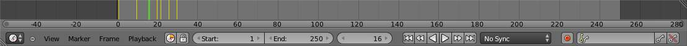

Timeline

The **Timeline** is not much of an editor, but more of a information and control window.

Here you can have an overview of the animation part of your scene 

What is the current time frame, either in frames or in seconds, where are the keyframes of the active object, the start and end frames of your animation, markers, etc... 

The **Timeline** has **Player Controls**, to play, pause the animation, and to skip though parts of the scene.

It also has some tools for **Keyframes**, **Keying Sets**, and **Markers**.

Timeline Elements
-----------------

Time Cursor
-----------

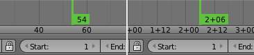

Time Cursor

The **Time Cursor** is the green line, its used to set and display the current time frame.

The **Time Cursor** can be set or moved to a new position by pressing or holding LMB in the Timeline window.

The current frame or second can be displayed on the **Time Cursor**, check the View menu for settings.

The **Time Cursor** can be moved in steps by pressing Left or Right, or in steps of 10 frames by pressing Shift-Up or Shift-Down.

Keyframes
---------

For the active and selected objects, keyframes are displayed as a yellow line.

For **Armatures**, the object keyframes and the pose bones keyframes are drawn.

**Only Selected Channels** can be enabled. **Timeline > View > Only Selected Channels**. For **Armatures**, this will draw the object keyframes, and the keyframes for the active and selected pose bones.

Markers
-------

Markers are the small triangles, with their name near them.

Markers are usually used to identify key parts of the animation.

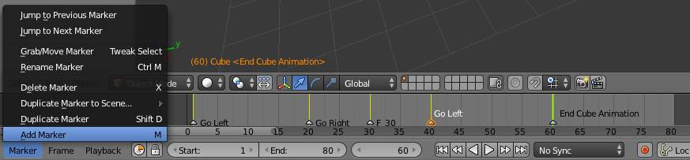

Markers

Markers can be selected by pressing RMB or Shift-RMB to select more.

See Marker Menu below or **Markers** for more info.

Adjusting the View
------------------

Timeline Area
-------------

The main **Timeline** area displays the animation frames over time.

Timeline Main Area

The **Timeline** can be panned by holding MMB, then dragging the area left or right.

You can zoom the **Timeline** by using Ctrl-MMB, the mouse Wheel, or pressing the Minus and Plus keys on the numpad.

By default, the **Playback/Rendering Range** (Frame Start 1 to Frame End 200) is a lighter shade of gray. The start and end frame can be set to the **Time Cursor** by pressing S or E. The **Playback Range** can also be set by pressing P then drawing a box.

Timeline Header
---------------

View Menu
---------

The **View Menu** controls what you see, and what it looks like.

Toggle Full Screen 

Maximize or minimize the **Timeline** window. Ctrl-Up or Ctrl-Down

Duplicate Area into New Window 

This creates a new OS window, and sets the editor window to the **Timeline**. 

Bind Camera to Markers 

This is used switch cameras during animation. It binds the active camera to the selected markers. First select a camera. Then select the marker(s). Then use the function. Ctrl-B

Cache 

This will display the baked **Cache Steps** for the active object. 

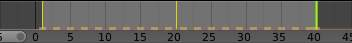

Timline Cache

Show Cache 

Show all enabled types. 

**Softbody**, **Particles**, **Cloth**, **Smoke**, **Dynamic Paint**, **Rigid Body**.

Only Selected Channels 

For **Armatures**, this will draw the object keyframes, and the keyframes for the active and selected pose bones. 

Show Frame Number Indicator 

This will draw the current frame or seconds on the **Time Cursor**. 

View All 

Maximize the **Timeline** area based on the Animation Range. Home

Show Seconds 

Show time in seconds for the **Timeline** and the **Time Cursor** based on the FPS.

Marker Menu
-----------

Jump to Previous Marker

Jump to Next Marker

Grab/Move Marker 

Grab/Move the selected markers. G

Rename Marker 

Rename the active marker. 

Delete Marker 

Delete selected markers. 

Duplicate Marker to Scene... 

Duplicate the selected markers to another scene. 

Duplicate Marker 

Duplicate the selected markers.

Add Marker 

Add marker to the current frame. 

Frame Menu
----------

Auto-Keyframing Mode 

	This controls how the Auto Keyframe mode works. Only one mode can be used at a time.

	Add & Replace 

	Add or Replace existing keyframes. 

	Replace 

	Only Replace existing keyframes. 

Playback Menu
-------------

- **Audio Scrubbing** If your animation has sound, this option plays bits of the sound wave while you move the time cursor with LMB or keyboard arrows. 
- **Audio Muted** Mute the sound from Sequence Editors. 
- **AV-sync** Play back and sync with audio clock, dropping frames if frame display is too slow. See 4. Synchronize Playback for more info. 
- **Frame Dropping** Play back dropping frames if frames are too slow. See 4. Synchronize Playback for more info. 
- **Clip Editors** While playing, updates the **Movie Clip Editor**. 
- **Node Editors** While playing, updates the Node properties for the **Node Editor**. 
- **Sequencer Editors** While playing, updates the **Video Sequence Editor**. 

.. Note:: Image Editors

- **Image Editors** Todo 
- **Property Editors** When the animation is playing, this will update the property values in the UI. 
- **Animation Editors** While playing, updates the **Timeline**, **Dope Sheet**, **Graph Editor**, **Video Sequence Editor**. 
- **All 3D View Editors** While playing, updates the **3D View** and the **Timeline**. 
- **Top-Left 3D Editor** While playing, updates the **Timeline** if **Animation Editors** and **All 3D View Editors** disabled. 

Header Controls
---------------

The Timeline header controls.

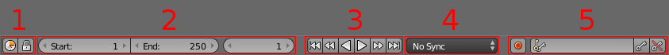

Timeline header controls.

1. Range Control
----------------

	Use Preview Range 

	This is an alternative range used to preview animations. This works for the UI playback, this will not work for rendering an animation. 

	Lock Time Cursor to Playback Range 

	This limits the **Time Cursor** to the **Playback Range**. 

2. Frame Control
----------------

	Start Frame 

	The start frame of the animation / playback range. 

	End Frame 

	The end frame of the animation / playback range. 

	Current Frame 

	The current frame of the animation / playback range. Also the position of the **Time Cursor**. 

3. Player Control
-----------------

These button are used to set, play, rewind, the **Time Cursor**.

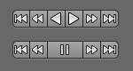

Player Controls.

Jump to start 

This sets the cursor to the start of frame range. 

Jump to previous keyframe 

This sets the cursor to the previous keyframe. 

Rewind 

This plays the animation sequence in reverse. SWhen playing the play buttons switch to a pause button. 

Play 

This plays the animation sequence. When playing the play buttons switch to a pause button. 

Jump to next keyframe 

This sets the cursor to the next keyframe. 

Jump to end 

This sets the cursor to the end of frame range. 

Pause 

This stops the animation. 

4. Synchronize Playback
-----------------------

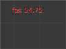

3D View Red FPS. 60:54.75

When you play an animation, the FPS is displayed at the top left of the 3D View. If the scene is detailed and playback is slower than the set **Frame Rate** (see Dimensions Presets, these options are used to synchronize the playback.

No Sync 

Do not sync, play every frame. 

Frame Dropping 

Drop frames if playback is too slow. This enables **Frame Dropping** from the **Playback Menu**. 

AV-sync 

Sync to audio clock, dropping frames if playback is slow. This enables **AV-sync** and **Frame Dropping** from the **Playback Menu**. 

5. Keyframe Control
-------------------

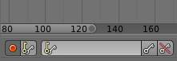

Timeline Auto Keyframe.

Auto Keyframe 

	The “Record” red-dot button enables something called **Auto Keyframe** : It will add and/or replace existing keyframes for the active object when you transform it in the 3D view.

For example, when enabled, first set the **Time Cursor** to the desired frame, then move an object in the 3d view, or set a new value for a property in the UI.

When you set a new value for the properties, Bforartists will add keyframes on the current frame for the transform properties.

**Auto Keying Set** - Optional if Auto Keyframe enabled. **Auto Keyframe** will insert new keyframes for the properties in the active **Keying Set**.

	Note that **Auto Keyframe** only works for transform properties (objects and bones), in the 3D views (i.e. you cant use it e.g. to animate the colors of a material in the Properties window...).

.. Note:: Layered

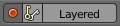

Timeline Layered.

**Layered** - Optional while playback. TODO.

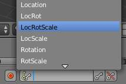

Timeline Keying Sets.

Active Keying Set 

	**Keying Sets** are a set of keyframe channels in one.

They are made so the user can record multiple properties at the same time.

With a keying set selected, when you insert a keyframe, Bforartists will add keyframes for the properties in the active **Keying Set**.

There are some built in keying sets, ‘LocRotScale’, and also custom keying sets.

	Custom keying sets can be defined in the in the panels **Properties > Scene > Keying Sets + Active Keying Set**.

Insert Keyframes 

Insert keyframes on the current frame for the properties in the active **Keying Set**. 

Delete Keyframes 

Delete keyframes on the current frame for the properties in the active **Keying Set**. 

User Preferences
----------------

Some related user preferences from the **Editing** tab.

Playback 

	Allow Negative Frames 

	Time Cursor can be set to negative frames with mouse or keyboard. When using **Use Preview Range**, this also allows playback. 

Keyframing 

	Visual Keying 

	When an object is using constraints, the objects property value doesnt actually change. **Visual Keying** will add keyframes to the object property, with a value based on the visual transformation from the constraint. 

	Only Insert Needed 

	This will only insert keyframes if the value of the propery is different. 

	Auto Keyframing 

	Enable **Auto Keyframe** by default for new scenes. 

	Show Auto Keying Warning 

	Displays a warning at the top right of the **3D View**, when moving objects, if **Auto Keyframe** is on. 

	Only Insert Available 

	With **Auto Keyframe** enabled, this will only add keyframes to channel F-Curves that already exist. 

Graph Editor
============

The graph editor is the main animation editor. It allows you to modify the animation for any properties using **F-Curves**.

The graph editor has two modes, **F-Curve** for **Actions**, and **Drivers** for **Drivers**. Both are very similar in function.

The Graph Editor.

Curve Editor Area
-----------------

Here you can see and edit the curves and keyframes.

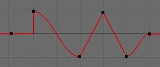

A curve with different types of interpolation.

See **F-Curves** for more info.

2D Cursor
---------

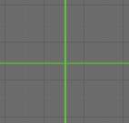

Graph Editor 2D Cursor.

The current frame is represented by a green vertical line called the **Time Cursor**.

As in the **Timeline**, you can change the current frame by pressing or holding LMB.

The green horizontal line is called the **Cursor**. This can be disabled via the **View Menu** or the **View Properties** panel.

The **Time Cursor** and the **Cursor** make the **2D Cursor**. The **2D Cursor** mostly used for editing tools.

View Axes
---------

For **Actions** the X-axis represents time, the Y-axis represents the value to set the property.

For **Drivers** the X-axis represents the **Driver Value**, the Y-axis represents the value to set the property.

Depending on the selected curves, the values have different meaning: For example rotation properties are shown in degrees, location properties are shown in Bforartists Units. Note that **Drivers** use radians for rotation properties.

Markers
-------

Like with most animation editors, markers are shown at the bottom of the editor.

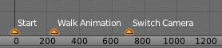

Graph Editor Markers.

**Markers** can be modified in the **Graph Editor** though its usually best to use the **Timeline**.

See **Markers** for more info.

Header
------

Here you’ll find.

- The menus. 
- Graph Editor mode. 
- View controls. 
- Curve controls. 

Header Controls
---------------

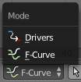

Graph Mode.

Mode 

F-Curve for **Actions**, and Drivers for **Drivers**. 

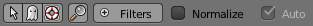

View Controls.

View controls 

	Show Only Selected 

	Only include curves related to the selected objects and data. 

	Show Hidden 

	Include curves from objects/bones that are not visible. 

	Show Only Errors

	Only include curves that are disabled or have errors. 

	Search Filter 

	Only include curves with keywords contained in the search text. 

	Type Filter 

	Filter curves by property type. 

	Normalize 

	Normalize curves so the maximum or minimum point equals 1.0 or -1.0. 

	Auto 

	Automatically recalculate curve normalization on every curve edit. 

Curve Controls.

Curve controls 

	Auto Snap 

	Auto snap the keyframes for transformations.

	**No Auto-Snap****Time Step****Nearest Frame****Nearest Marker**

	Pivot Point 

	Pivot point for rotation.

	Bounding Box Center 

	Center of the select keyframes. 

	2D Cursor 

	Center of the **2D Cursor**. **Time Cursor** + **Cursor**. 

	Individual Centers 

	Rotate the selected keyframe **Bezier** handles. 

	**Copy Keyframes**

	Copy the selected keyframes to memory. 

	**Paste Keyframes**

	Paste keyframes from memory to the current frame for selected curves. 

	Create Snapshot

	Creates a picture with the current shape of the curves. 

Channels Region
---------------

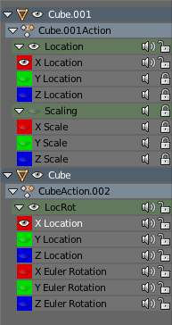

Channels Region.

The channels region is used to select and manage the curves for the graph editor.

Hide curve 

Represented by the eye icon. 

Deactivate/Mute curve 

Represented by the speaker icon. 

Lock curve from editing 

Represented by the padlock icon. 

Channel Editing
---------------

**Select channel**

**Multi Select/Deselect**

**Toggle Select All**

**Border Select**

**Border Deselect**

**Delete selected**

**Lock selected**

**Make only selected visible**

**Enable Mute Lock selected**

**Disable Mute Lock selected**

**Toggle Mute Lock selected**

Properties Region
-----------------

The panels in the **Properties Region**.

View Properties Panel
---------------------

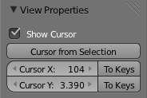

View Properties Panel.

Show Cursor 

Show the vertical **Cursor**. 

Cursor from Selection 

Set the **2D cursor** to the center of the selected keyframes. 

Cursor X 

	**Time Cursor** X position.

	To Keys 

	Snap selected keyframes to the **Time Cursor**. 

Cursor Y 

	Vertical **Cursor** Y position.

	To Keys 

	Snap selected keyframes to the **Cursor**. 

Active F-Curve Panel
--------------------

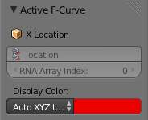

Active F-Curve Panel.

This panel displays properties for the active **F-Curve**.

**Channel Name** (X Location) 

**ID Type** + Channel name. 

RNA Path 

**RNA Path** to property + Array index. 

Color Mode 

	**Color Mode** for the active **F-Curve**.

	Auto Rainbow 

	Increment the **HUE** of the **F-Curve** color based on the channel index. 

	Auto XYZ to RGB 

	For property sets like location xyz, automatically set the set of colors to red, green, blue. 

	User Defined 

	Define a custom color for the active **F-Curve**. 

Active Keyframe Panel
---------------------

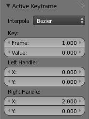

Active Keyframe Panel.

Interpolation 

	Set the forward interpolation for the active keyframe.

	Constant 

	Keep the same value till the next keyframe. 

	Linear 

	The difference between the next keyframe. 

	Bezier 

	Bezier interpolation to the next keyframe. 

Key

	Frame 

	Set the frame for the active keyframe. 

	Value

	Set the value for the active keyframe. 

Left Handle

Set the position of the left interpolation handle for the active keyframe. 

Right Handle 

Set the position of the right interpolation handle for the active keyframe. 

Drivers Panel
-------------

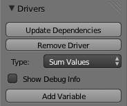

Drivers Panel.

See Drivers Panel for more info.

Modifiers Panel
---------------

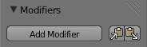

Modifiers Panel.

See **F-Modifiers** for more info.

.. Tip:: See also

F-Curves
========

After animating some property in Bforartists using keyframes you can edit their corresponding curves. When something is “animated,” it changes over time. This curve in shown as something called an F-Curve. Basically what an F-Curve does is it a interpolates between two animated properties. In Bforartists, animating an object means changing one of its properties, such as an objects location, or its scale.

As mentioned, Bforartists’s fundamental unit of time is the “frame”, which usually lasts just a fraction of a second, depending on the **frame rate** of the scene. As animation is composed of incremental changes spanning multiple frames, usually these properties ARE NOT manually modified **frame by frame**, because:

- it would take ages! 
- it would be very difficult to get smooth variations of the property (unless you compute mathematical functions and type a precise value for each frame, which would be crazy). 

This is why nearly all direct animation is done using **interpolation**.

The idea is simple: you define a few Key Frames, which are multiple frames apart. Between these keyframes, the properties’ values are computed (interpolated) by Bforartists and filled in. Thus, the animators’ workload is significantly reduced.

Example of interpolation

For example, if you have:

- a control point of value 0 at frame 0, 
- another one of value 10 at frame 25, 
- and you use linear interpolation, 

then, at frame 5 we get a value of 2.

The same goes for all intermediate frames: with just two points, you get a smooth growth from 0 to 10 along the **25 frames**. Obviously, if you’d like the frame 15 to have a value of 9, you’d have to add another control point (or keyframe)...

Settings
--------

F-curves have three additional properties, which control the interpolation between points, extension behavior, and the type of handles.

Interpolation Mode
------------------

You have three choices (T, or Curve > Interpolation Mode):

Constant 

There is no interpolation at all. The curve holds the value of its last keyframe, giving a discrete (stairway) “curve”. Usually only used during the initial “blocking” stage in pose-to-pose animation workflows. 

Constant.

Linear 

This simple interpolation creates a straight segment between each neighbor keyframes, giving a broken line. It can be useful when using only two keyframes and the **Extrapolation** extend mode, to easily get an infinite straight line (i.e. a linear curve). 

Linear.

Bezier 

The more powerful and useful interpolation, and the default one. It gives nicely smoothed curves, i.e. smooth animations! 

Bézier.

Remember that some FCurves can only take discrete values, in which case they are always shown as if constant interpolated, whatever option you chose.

Extrapolation
-------------

(Shift-E, or Channel > Extrapolation Mode)

Extrapolation defines the behavior of a curve before the first and after the last keyframes.

There are two basic extrapolation modes:

Constant 

The default one, curves before their first keyframe and after their last one have a constant value (the one of these first and last keyframes). 

Constant extrapolation

Linear 

Curves ends are straight lines (linear), as defined by their first two keyframes (respectively their last two keyframes). 

Linear extrapolation

Additional extrapolation tools (e.g. the “Cycles” F-Modifier) are located in the **F-Curve Modifiers**

Handle Types
------------

There is another curve option quite useful for Bézier-interpolated curves. You can set the type of handle to use for the curve points V

Automatic 

Keyframes are automatically interpolated 

Auto handles

Vector 

Creates linear interpolation between keyframes. The linear segments remain if keyframe centers are moved. If handles are moved, the handle becomes Free. 

Vector handles

Aligned 

Handle maintain rotation when moved, and curve tangent is maintained 

Aligned handles

Free 

Breaks handles tangents 

Free handles

Auto Clamped 

Auto handles clamped to not overshoot 

Auto clamped handles

Direction of time
-----------------

Although F-curves are very similar to Bezier Curves, there are some important differences.

For obvious reasons, **a property represented by a Curve cannot have more than one value at a given time**, hence:

- when you move a control point ahead of a control point that was previously ahead of the point that you are moving, the two control points switch their order in the edited curve, to avoid that the curve goes back in time 
- for the above reason, it’s impossible to have a closed Ipo curve 

Two control points switching: the curve can’t go back in time!

.. list-table::

	* - 	  - 

Editing Tools
-------------

By default, when new channels are added, the **Graph Editor** sets them to **Edit Mode**. Selected channels can be locked by pressing Tab.

Many of the hotkeys are the same as the viewport ones, for example Navigation hotkeys and select keys. Which one depends of the chosen keymap.

And of course you can lock the transformation along the X (time frame) or Y (value) axises by pressing X or Y during transformation.

For precise control of the keyframe position and value, you can set values in the **Active Keyframe** of the Properties Region.

Transform Snapping
------------------

When transforming keyframes with the navigation hotkeys the transformation can be snapped to increments.

Snap Transformation to 1.0 Ctrl

Divide Transformation by 10.0 Shift

Keyframes can be snapped to different properties by using the **Snap Keys** tool.

Snap Keys Shift-S

	Current Frame 

	Snap the selected keyframes to the **Time Cursor**. 

	Cursor Value 

	Snap the selected keyframes to the **Cursor**. 

	Nearest Frame 

	Snap the selected keyframes to their nearest frame individually. 

	Nearest Second 

	Snap the selected keyframes to their nearest second individually, based on the **FPS** of the scene. 

	Nearest Marker 

	Snap the selected keyframes to their nearest marker individually. 

	Flatten Handles 

	Flatten the **Bezier** handles for the selected keyframes. 

Flatten Handles snapping example.

.. list-table::

	* - 	  - 

Mirror
------

Selected keyframes can be mirrored over different properties using the **Mirror Keys** tool.

Mirror Keys 

	By Times Over Current Frame 

	Mirror horizontally over the **Time Cursor**. 

	By Values over Cursor Value 

	Mirror vertically over the **Cursor**. 

	By Times over Time 0 

	Mirror horizontally over frame 0. 

	By Values over Value 0 

	Mirror vertically over value 0. 

	By Times over First Selected Marker 

	Mirror horizontally the over the first selected **Marker**. 

Clean Keyframes
---------------

**Clean Keyframes** resets the keyframe tangents to their auto-clamped shape, if they have been modified. **Clean Keyframes**O

.. list-table::

	* - 	  - 

Smoothing
---------

There is also an option to smooth the selected curves , but beware: its algorithm seems to be to divide by two the distance between each keyframe and the average linear value of the curve, without any setting, which gives quite a strong smoothing! Note that the first and last keys seem to be never modified by this tool.

.. list-table::

	* - 	  - 

Sampling and Baking Keyframes
-----------------------------

Sample Keyframes 

Sampling a set a keyframes replaces interpolated values with a new keyframe for each frame. 

.. list-table::

	* - 	  - 
Bake Curves

Baking a curve replaces it with a set of sampled points, and removes the ability to edit the curve. 

F-Curve Modifiers
=================

F-Curve modifiers are similar to object modifiers, in that they add non-destructive effects, that can be adjusted at any time, and layered to create more complex effects.

Adding a Modifier
-----------------

The F-curve modifier panel is located in the Properties panel. Select a curve by selecting one of its curve points, or by selecting the channel list. Click on the **Add Modifier** button and select a modifier.

To add spin to an object or group, select the object/group and add a keyframe to the axis of rotation (x,y, or z)

Go to the Graph Editor.....make sure the f-curves properties panel is visible (View > Properties)

>Add Modifier > (e.g.) Generator

Types of Modifiers
------------------

Generator
---------

Generator creates a Factorized or Expanded Polynomial function. These are basic mathematical formulas that represent lines, parabolas, and other more complex curves, depending on the values used.

Additive 

This option causes the modifier to be added to the curve, instead of replacing it by default. 

Poly Order 

Specify the order of the polynomial, or the highest power of ‘x’ for this polynomial. (number of coefficients - 1). 

Change the Coefficient values to change the shape of the curve.

.. See also::  for more information on polynomials.

Built-in Function
-----------------

These are additional formulas, each with the same options to control their shape. Consult mathematics reference for more detailed information on each function.

- Sine 
- Cosine 
- Tangent 
- Square Root 
- Natural Logarithm 
- Normalized Sine (sin(x)/x) 

Amplitude

Adjusts the Y scaling 

Phase Multiplier 

Adjusts the X scaling 

Phase Offset 

Adjusts the X offset 

Value Offset 

Adjusts the Y offset 

Envelope
--------

Allows you to adjust the overall shape of a curve with control points.

Reference Value 

Set the Y value the envelope is centered around. 

Min 

Lower distance from Reference Value for 1:1 default influence. 

Max 

Upper distance from Reference Value for 1:1 default influence. 

Add Point 

Add a set of control points. They will be created at the current frame. 

Fra: 

Set the frame number for the control point. 

Min 

Specifies the lower control point’s position. 

Max 

specifies the upper control point’s position. 

Cycles
------

Cycles allows you add cyclic motion to a curve that has 2 or more control points. The options can be set for before and after the curve.

Cycle Mode 

	Repeat Motion 

	Repeats the curve data, while maintaining their values each cycle. 

	Repeat with Offset 

	Repeats the curve data, but offsets the value of the first point to the value of the last point each cycle. 

	Repeat Mirrored 

	Each cycle the curve data is flipped across the X-axis. 

Before/After Cycles 

Set the number of times to cycle the data. A value of 0 cycles the data infinitely. 

Noise
-----

Modifies the curve with a noise formula. This is useful for creating subtle or extreme randomness to animated movements, like camera shake.

Blend Type 

	Replace 

	Adds a -.5 to .5 range noise function to the curve. 

	Add 

	Adds a 0 to 1 range noise function to the curve. 

	Subtract 

	Subtracts a 0 to 1 range noise function to the curve. 

	Multiply 

	Multiplies a 0 to 1 range noise function to the curve. 

Scale 

Adjust the overall size of the noise. Values further from 0 give less frequent noise. 

Strength 

Adjusts the Y scaling of the noise function. 

Phase 

Adjusts the random seed of the noise. 

Depth 

Adjusts how detailed the noise function is. 

Python
------

Limits
------

Limit curve values to specified X and Y ranges.

Minimum/Maximum X 

Cuts a curve off at these frames ranges, and sets their minimum value at those points. 

Minimum/Maximum Y 

Truncates the curve values to a range. 

Stepped
-------

Gives the curve a stepped appearance by rounding values down within a certain range of frames.

Step Size 

Specify the number of frames to hold each frame 

Offset 

Reference number of frames before frames get held. Use to get hold for ‘1-3’ vs ‘5-7’ holding patterns. 

Use Start Frame 

Restrict modifier to only act before its ‘end’ frame 

Use End Frame 

Restrict modifier to only act after its ‘start’ frame 

Dope Sheet
==========

- Action Editor
- The Dopesheet
- Shape Key 

- - Action Data-Blocks 
- - Channel Menu 

- - Dope Sheet Modes 
- - Interface 

Action Editor
=============

In Bforartists **Actions** are a generic containers for F-Curves. Actions can contain any number of F-Curves, and can be attached to any data block. As long as the RNA data paths stored in the Action’s F-Curves can be found on that data block, the animation will work. For example, an action modifying ‘X location’ and ‘Y location’ properties can be shared across multiple objects, since both objects have ‘X location’ and ‘Y location’ properties beneath them.

The **Action Editor** window enables you to see and edit the FCurve data-blocks you defined as actions in the **FCurve Editor** window. So it takes place somewhere in-between the low-level **FCurves**, and the high-level **NLA editor**. Hence, you do not have to use them for simple Ipo curves animations - and they have not much interest in themselves, so you will mostly use this window when you do **NLA animation** (they do have a few specific usages on their own, though, like e.g. with the **Action constraint**, or the **pose libraries**).

This is not a mandatory window, as you do can edit the actions used by the NLA directly in the **FCurve Editor** window (or even the **NLA Editor** one). However, it gives you a slightly simplified view of your FCurve data-blocks (somewhat similar to the “key” mode of the FCurve window, even though more powerful in some ways) - and, more interesting, it can show you all “action” FCurve data-blocks of a same object at once.

Additionally, it also allows you to affect timing of the different keys of the layers created with the **grease pencil tool**.

Each “action” FCurve data-block forms a top-level channel (see below). Note that an object can have several **Constraint** (one per animated constraint) and **Pose** (for armatures, one per animated bone) FCurve data-blocks, and hence an action can have several of these channels.

Action Data-Blocks
------------------

As everything else in Bforartists, actions are data-blocks. Unlike FCurve ones, there is only one type of action, which can regroup all FCurve of a given object. You’ll find its usual data-block controls in the **Action Editor** header.

However, there is one specificity with action data-blocks: they have by default a “fake user”, i.e. once created, they are always kept in Bforartists file, even if no object uses them. This is due to the fact that actions are designed to be used in the NLA, where you can affect several different actions to a same object! Yes, this is the only way to use different actions (and hence, different FCurve data-blocks of the same kind) to animate a same object. But as you have to assign an action to an object to be able to edit it (and an object can only have one action data-block at a time), to have “fake users” guaranties you that you won’t lost your precious previously-edited actions when you start working on a new one!

This window shows, by default, the action data-block linked to the current active object. However, as with FCurvs, you can pin an **Action Editor** to a given action with the small “pin” button to the left of the data-block controls, in the header. This will force the window to always display this data-block, whatever the current selected object is.

Channel Menu
------------

Delete (X) 

	Deletes the whole channel from the current action (i.e. unlink the underlying FCurve data-block from this action data-block).

.. list-table::

	* - Warning

	* - The X shortcut is area-dependent: if you use it in the left list part, it’ll delete the selected channels, whereas if you use it in the main area, it’ll delete the selected keyframes...

Settings > Toogle/Enable/Disable a Setting 

Enable/disable a channel’s setting (selected in the menu that pops-up) - currently, “lock” and/or “mute” only. 

Toggle Channel Editability Tab

Locks or unlocks a channel for editing 

Extrapolation Mode 

Change the extrapolation between selected keyframes. More options are available in the Graph Editor. 

Expand Channels, Collapse Channels 

Expands or collapses selected channels. 

Move... 

This allows you to move top-level channels up/down , or directly to the top/bottom.

Revive Disabled F-Curves 

Clears ‘disabled’ tag from all F-Curves to get broken F-Curves working again 

The Dopesheet
=============

The DopeSheet

Classical hand-drawn animators often made a chart, showing exactly when each drawing, sound and camera move would occur, and for how long. They nicknamed this the ‘dopesheet’. While CG foundations dramatically differ from classical hand-drawn animation, Bforartists’s Dopesheet inherits a similar directive. It gives the animator a ‘birds-eye-view’ of every thing occurring within a scene.

Dope Sheet Modes
----------------

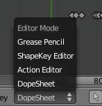

DopeSheet modes

There are four basic views for the Dopesheet.These all view different contexts of animation:

**DopeSheet**

The dopeSheet allow you to edit multiple actions at once. 

**Action Editor**

**Action Editor** is the default, and most useful one. It’s here you can define and control your actions. 

**Shape Key Editor**

**ShapeKey Editor** is dedicated to the **Shape** Ipo data-blocks. It uses/edits the same action data-block as the previous mode. It seems to be an old and useless thing, as the **Action Editor** mode handles **Shape** channels very well, and this mode adds nothing... 

**Grease Pencil**

**Grease Pencil** is dedicated to the **grease pencil tool’s** keyframes - for each grease pencil layer, you have a strip along which you can grab its keys, and hence easily re-time your animated sketches. As it is just another way to see and edit the grease pencil data, this mode uses no data-block (and hence has nothing to do with actions...). Note that you’ll have as much top-level grease pencil channels as you have sketched windows (3D views, **UV/Image Editor**, etc.) 

Interface
---------

The **Action Editor** interface is somewhat similar to the **FCurve Editor** one, it is divided in three areas:

The Action Editor window, Action Editor mode, with an Object and Shape channels.

The header bar 

Here you find the menus, a first block of controls related to the editor “mode”, a second one concerning the action data-blocks, and a few other tools (like the copy/paste buttons, and snapping type). 

The main area 

It contains the keyframes for all visible action channels. As with the other “time” windows, the X-axis materializes the time. The Y-axis has no mean in itself, unlike with the FCurve editor, it’s just a sort of “stack” of action channels - each one being shown as an horizontal colored strip (of a darker shade “during” the animated/keyed period). On these channel strips lay the keyframes, materialized as light-gray (unselected) or yellow (selected) diamonds. One of the key feature of this window is that it allow you to visualize immediately which channel (i.e. Ipo curve) is **really** affected. When the value of a given channel does not change at all between two neighboring keyframes, a gray (unselected) or yellow (selected) line is drawn between them. 

The left “list-tree” 

	This part shows the action’s channel “headers” and their hierarchy. Basically, there are:

- “Top-level” channels, which represent whole FCurve data-blocks (so there’s one for **Object** one, one for **Shape** one, etc.). They gather **all** keyframes defined in their underlying FCurve data-block. 
- “Mid-level” channels, which seem currently to have no use (there’s one per top-level channel, they are all named **FCurves**, and have no option at all...). 
- “Low-level” channels, which represent individual FCurve , with their own keyframes (fortunately, only keyed Ipos are shown!). 

Each level can be expended/collapsed by the small arrow to the left of its “parent” channel. To the right of the channel’s headers, there are some channel’s setting controls:

- Clicking on the small “eye” will allow you to mute that channel (and all its “children” channels, if any!). 
- Clicking on the small “lock” will allow you to prevent this channel and its children to be edited (note that this is also working inside the NLA, but that it doesn’t prevent edition of the underlying FCurve ...). 

	A channel can be selected (text in white, strip in gray-blue color) or not (text in black, strip in pink-brown color.), use LMB clicks to toggle this state. You can access some channel’s properties by clicking Ctrl-LMB on its header. Finally, you can have another column with value-sliders, allowing you to change the value of current keyframes, or to add new ones. These are obviously only available for low-level channels (i.e. individual FCurve ). See View Menu below for how to show these sliders.

View Menu
---------

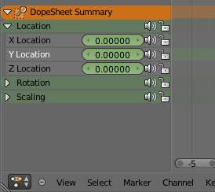

the action editor showing sliders

Realtime Updates 

When transforming keyframes, changes to the animation data are flushed to other views 

Show Frame Number Indicator

Show frame number beside the current frame indicator line 

Show Sliders 

A toggle option that shows the value sliders for the channels. See the **The****Action Editor****window,****Action Editor****mode, with a group and sliders** picture above). 

Use Group Colors 

Draw groups and channels with colors matching their corresponding groups. 

AutoMerge Keyframes

Automatically merge nearby keyframes 

Sync Markers 

Sync Markers with keyframe edits 

Show Seconds 

Whether to show the time in the X-axis as frames or as seconds 

Set Preview Range 

Interactively define frame range used for playback. Allow you to define a temporary preview range to use for the Alt-A realtime playback (this is the same thing as the **Playback Range** option of the timeline window header). 

Clear Preview Range

Clears the preview range 

Auto-Set Preview Range 

Automatically sets the preview range to playback the whole action. 

Marker Menu
-----------

See the **Markers page**.

Shape Key
=========

To do

Non-Linear Animation Editor
===========================

The NLA editor can manipulate and repurpose actions, without the tedium of keyframe handling. Its often used to make broad, significant changes to a scene’s animation, with relative ease. It can also repurpose, and ‘layer’ actions, which make it easier to organize, and version-control your animation.

Tracks
------

Tracks are the layering system of the NLA. At its most basic level, it can help organize strips. But it also layers motion much like an image editor layers pixels - the bottom layer first, to the top, last.

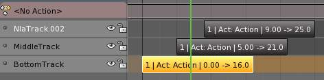

Strips
------

There’s three kinds of strips - Action, Transition, and Meta. Actions contain the actual keyframe data, Transitions will perform calculations between Actions, and Meta will group strips together as a whole.

Creating Action Strips
----------------------

Any action used by the NLA first must be turned into an Action strip. This is done so by clicking the

next to the action listed in the NLA. Alternatively, you can go to

Reference
=========

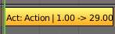

Action Strip.

Creating Transition Strips
--------------------------

Select two or more strips on the same track, and go to

Reference
=========

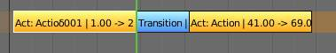

Transition Strip.

Grouping Strips into Meta Strips
--------------------------------

If you find yourself moving a lot of strips together, you can group them into a Meta strip. A meta strip can be moved and duplicated like a normal strip.

Reference
=========

.. list-table::

	* - 	  - 
A meta strip still contains the underlying strips. You can ungroup a Meta strip.

Reference
=========

Editing Strips
--------------

The contents of Action strips can be edited, but you must be in ‘Tweak Mode’ to do so.

Reference
=========

.. list-table::

	* - 	  - 
If you try moving the strip, while in edit mode, you’ll notice that the keys will go along with it. On occasion, you’ll prefer the keys to remain on their original frames, regardless of where the strip is. To do so, hit the ‘unpin’ icon, next to the strip.

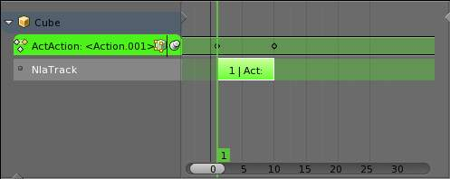

Nla strip with pinned keys.

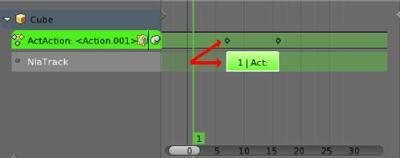

Strip moved, notice the keys move with it.

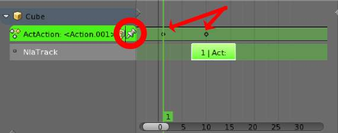

The unpinned keys return to their original frames.

When your finished editing the strip, simply go to View > Exit Tweak Mode. Note the default key for this is Tab.

Re-Instancing Strips
--------------------

The contents’ of one Action strip can be instanced multiple times. To instance another strip, select a strip, go to

Reference
=========

Now, when any strip is tweaked, the others will change too. If a strip other than the original is tweaked, the original will turn to red.

.. list-table::

	* - 	  - 	  - 

Strip Properties
----------------

Strip properties can be accessed via the NLA header.

Reference
=========

Renaming Strips
---------------

All strips can be renamed, in the “Active Track” section in the Strip Properties.

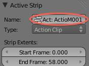

Active Track
------------

This is which track the strip currently belongs to.

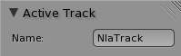

Active Strip
------------

Elements of the strip itself. An Action Strip can be either an Action Clip, or a Transition Clip. Note that the ‘Strip Extents’ fields determine strictly the strip, and not the action. Also, the “Hold” value in the Extrapolation section means hold both beginning, and after. This can cause previous clips to not work, if checked.

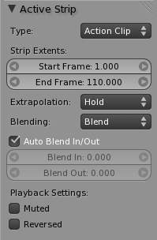

Active Action
-------------

This represents the ‘object data’ of the strip. Much like the transform values of an object.

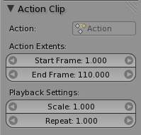

Evaluation
----------

This determines the degree of influence the strip has, and over what time.

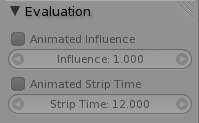

If influence isn’t animated, the strips will fade linearly, during the overlap.

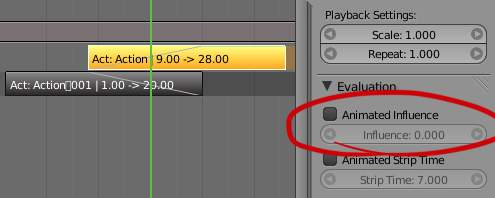

Strip Modifiers
---------------

Like its close cousins in mesh and graph editing, Modifiers can stack different combinations of effects for strips. Obviously there will be more to come on this.

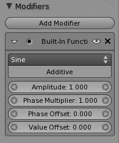

