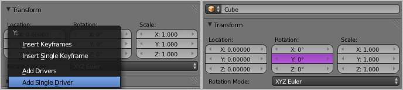

************
52 Animation
************

.. contents:: Contents

Animation
=========

Animation is making an object move or change shape over time. Objects can be animated in many ways:

Moving as a whole object 

Changing their position, orientation or size in time; 

Deforming them 

Animating their vertices or control points; 

Inherited animation 

Causing the object to move based on the movement of another object (e.g. its parent, hook, armature, etc...). 

In this chapter we will cover the first two, but the basics given here are actually vital for understanding the following chapters as well.

Animation is typically achieved with the use of **Key Frames**.

Chapters
--------

General Principles and Tools
----------------------------

- **Key frames**
- **Using The Timeline**
- **Markers**

The Graph Editor
----------------

- **F-Curves**
- **F-Curve Editing**
- **F-Curve Modifiers**

The Action Editor
-----------------

- **Actions**
- Working with Actions 

Animation Techniques
--------------------

- **Constraints**
- **Moving objects on a Path**
- **Game Engine Physics Recording**

Animating Deformation
---------------------

- **Shape Keys**
- **Deforming by a Lattice**
- **Deforming with Hooks**

See also **Hook Modifier**

Drivers
-------

- **Drivers**
- **Driven Shape Keys**

The Introduction to Character Animation tutorial is a good starting point for learning character animation. Even if you never used Bforartists before.

Animation Fundamentals
----------------------

**Actions**

Actions are used to record the animation of objects and properties. 

**Drivers**

Drivers are used to control and animate properties. 

**Keying Sets**

Keying Sets are used to record a set of properties at the same time. 

**Markers**

Markers are used to mark key points/events within an animation. 

**Motion Paths**

Motion Paths are used to visualize an animation. 

**Shape Keys**

Shape Keys are used to deform objects into new shapes. 

Animation Editors
-----------------

**Timeline**

The Timeline Editor is a quick editor to set and control the time frame. This also has some tools for animation. 

**Graph Editor**

The Graph Editor is mostly used to edit the F-Curves and Keyframes for Channels and Drivers. 

**Dope Sheet**

The Dopes Sheet contains a collection of animation editors. 

**NLA Editor**

The NLA Editor is used to edit and blend Actions together. 

Categories
----------

**Modifiers**

Modifiers are automatic operations that affect an object in a non-destructive way. With modifiers, you can perform many effects automatically that would otherwise be tedious to do manually. 

**Rigging**

Rigging. 

**Constraints**

Constraints are a way of connecting transform properties (position, rotation and scale) between objects. 

**Physical Simulation**

This category covers various advanced Bforartists effects, often used to simulate real physical phenomena. There is the Particle System for things like hair, grass, smoke, flocks. Soft Bodies are useful for everything that tends to bend, deform, in reaction to forces like gravity or wind. Cloth simulation, to simulate clothes or materials. Rigid Bodies can simulate dynamic objects that are fairly rigid. Fluids, which include liquids and gasses, can be simulated, including Smoke. Force Fields can modify the behavior of simulations. 

**Motion Tracking**

Motion tracking is a new technique available in Bforartists. It is still under development, and currently supports basic operations for 2D motion tracking, 3D motion tracking, and camera solution. 

Animation Scripts 

Add-on scripts for animation. 

Rigging Scipts 

Add-on scripts for rigging. 

Key Frames
==========

A **Key Frame** is simply a marker in time which stores the value of a property.

For example, a key frame might indicate that the horizontal position of a cube is at 3m on frame 1.

The purpose of a key frame is to allow for interpolated animation, meaning, for example, that the user could then add another key on frame 10, specifying the cube’s horizontal position at 20m, and Bforartists will automatically determine the correct position of the cube for all the frames between frame 1 and 10 depending on the chosen interpolation method (e.g. linear, bezier, quadratic, etc...).

Adding Key Frames
-----------------

There are several methods of adding new keys. Namely:

- In the 3D View, pressing I will bring up a menu to choose what to add a key frame to. 
- Hovering over a property and pressing I. 
- RMB a value and choose **Insert Keyframe** from the menu. 

Removing Key Frames
-------------------

There are several methods of removing key frames

- In the 3D View press Alt-I to remove keys on the current frame for selected objects. 
- When the mouse is over a value press Alt-I. 
- RMB a value and choose **Delete Keyframe** from the menu. 

Editing Key Frames
------------------

For editing key frames go to the **Graph Editor** or to the **Dopesheet**

Keyframe Visualization
======================

There are some important visualization features in the 3D views that can help animation.

When the current frame is a keyframe for the current active object, the name of this object (shown in the bottom left corner of the 3D views) turns yellow.

.. image:: graphics/15.xx_Animation/100000000000023A000000B0DFA6CCB0F6DF6F0C.jpg

Left: Current frame at 0. Right: Current frame is a keyframe for Cube

Motion Paths
------------

Reference
=========

This feature allows you to visualize the animation of objects by displaying their position over a series of frames.

An animated cube with its motion path displayed

.. image:: graphics/15.xx_Animation/100000000000010C000000BE8954A18ED6984E30.jpg

Motion paths panel

Before we look at its options (all regrouped in the same **Visualisations** panel, in the **Editing** context, let’s first see how to display/hide these paths. You have to do it manually - and you have to first select the objects you want to show/hide the motion paths. Then,

- To show the paths (or update them, if needed), click on the **Calculate Path** button. 
- To hide the paths, click on the **Clear Paths** button 

Remember: only selected object and their paths are affected by these actions!

The paths are drawn in black with white dots indicating frames, and a blue glow around the current frame.

Options
-------

The Motion Paths Panel set to “Around Frame”

Around Frame 

Around Frame, Display Paths of poses within a fixed number of frames around the current frame. When you enable this button, you rather get paths for a given number of frames before and after the current one (again, as with ghosts). 

The Motion Paths Panel set to “In Range”

In Range 

In Range, Display Paths of poses within specified range. 

Display Range 

	Before/After 

	Number of frames to show before and after the current frame (only for ‘Around Current Frame’ Onion-skinning method) 

	Start/End 

	Starting and Ending frame of range of paths to display/calculate (not for ‘Around Current Frame’ Onion-skinning method) 

	Step 

	This is the same thing as the **GStep** for ghosts - it allows you the only materialize on the path one frame each **n** ones. Mostly useful when you enable the frame number display (see below), to avoid cluttering the 3D views. 

Frame Numbers 

When enabled, a small number appears next to each frame dot on the path, which is of course the number of the corresponding frame... 

Keyframes 

When enabled, big yellow square dots are drawn on motion paths, materializing the keyframes of their bones (i.e. only the paths of keyed bones at a given frame get a yellow dot at this frame). 

Keyframe Numbers 

When enabled, you’ll see the numbers of the displayed keyframes - so this option is obviously only valid when **Show Keys** is enabled. 

Cache 

	From / To 

	These are the start/end frames of the range in which motion paths are drawn. You cannot modify this range without deleting the motion path first. 

	Calculate Paths/ Update Paths 

	If no paths have been calculated, Calculate Paths will create a new motion path in cache. In the pop up box, select the frame range to calculate. If a path has already been calculated, Update Paths will update the path shape to the current animation. To change the frame range of the calculated path, you need to delete the path and calculate it again. 

.. list-table::

	* - 
When animating objects and properties in Bforartists, Actions record and contain the data.

Actions.

So when you animate an object by changing its location with keyframes, the animation is saved to the Action.

Each property has a channel which it is recorded to, for example, Cube.location.x is recorded to Channel X Location.

Graph Editor. Each Channel has an F-Curve represented by the lines between the keyframes.

Actions 

Record and contain animation data. 

Groups 

Are groups of channels. 

Channels 

Record properties. 

F-Curves 

Are used to interpolate the difference between the keyframes. 

Keyframes 

Are used to set the values of properties. 

F-Curve Interpolation
---------------------

.. image:: graphics/15.xx_Animation/10000000000001040000009ECBB51A6A35EFC8B5.png

Graph Editor: Channel F-Curve.

The keyframes are set values by the user.

The **F-Curve** is used to interpolate the difference between the keyframes.

The **F-Curve** has different types of interpolation and also **F-Curve Modifiers**.

Most the settings for the **F-Curve** are found in the **Graph Editor**.

Basic Animation
---------------

These are some common ways to animate objects. These methods can be used on different objects, like armature bones in pose mode.

Insert Keyframes
----------------

This example shows you how to animate a cubes location, rotation, and scale.

- First, in the **Timeline**, or other animation editors, set the frame to 1. 
- With the **Cube** selected in **Object Mode**, press I in the 3D View. 
- From the **Insert Keyframe Menu** select **LocRotScale**. 
- This will record the location, rotation, and scale, for the **Cube** on frame 1. 
- Set the frame to 100. 
- Use Grab/Move G, Rotate R, Scale S, to transform the cube. 
- Press I in the 3D View. From the **Insert Keyframe Menu** select **LocRotScale**. 

Insert Keyframes.

To test the animation, press Alt-A to play.

The animation on frames 1, 50, 100.

Auto Keyframe
-------------

Timeline Auto Keyframe.

Auto Keyframe is the red record button in the **Timeline** header. Auto Keyframe adds keyframes automatically to the set frame if the value for transform type properties changes.

See Timeline V Keyframe Control for more info.

Keying Sets
-----------

.. image:: graphics/15.xx_Animation/10000000000000D60000008E86DDB942A0825A9D.jpg

Timeline Keying Sets.

Keying Sets are a set of keyframe channels. They are used to record multiple properties at the same time. There are some built in keying sets, ‘LocRotScale’, and also custom keying sets can be made.

To use the keying set, first select a keying set from the **Timeline** header, or the **Keying Sets Panel**.

Now when you press I in the 3D view, Bforartists will add keyframes for all the properties in the active keying set.

See **Keying Sets** for more info.

Properties
----------

Keyframe properties.

Keyframes can be used to animate lots of different properties in Bforartists. To add keyframes to a property in the UI, RMB the property, then select Insert Single Keyframe, or Insert Keyframes. Insert Keyframes I will add a keyframes for the set of properties.

Properties, Drivers, Keyframes.

Properties have different colors and menu items for different states.

Gray - Property is not animated with Keyframes or Drivers. 

Insert Keyframes I. Insert Single Keyframe. Add Drivers. Add Single Driver. Paste Driver. 

Purple - Property value is controlled with a Driver. 

Delete Drivers. Delete Single Driver. Copy Driver. Paste Driver. 

Green - Property has Channel with Keyframes. 

Insert Keyframes I. Insert Single Keyframe. Clear Keyframes Alt-Shift-I Clear Single Keyframes. 

Yellow - Property has Keyframes on the current Frame. 

Replace Keyframes I. Replace Single Keyframe. Delete Keyframes Alt-I. Delete Single Keyframe. Clear Keyframes Alt-Shift-I Clear Single Keyframes. 

Each property also has some Keying Set options. 

Add All to Keying Set K. Add Single to Keying Set. Remove from Keying Set. 

Editing
-------

3D View. 

Insert Keyframes on current frame I Delete Keyframes on current frame Alt-I

Working with Actions
--------------------

Action Browser.

When you first animate an object by adding keyframes, Bforartists creates an **Action** to record the data.

**Actions** can be managed with the **Action Browser** in the **DopeSheet****Action Editor** header, or the properties region of the **NLA Editor**.

If you are making multiple actions for the same object, press the **F** button for each action, this will give the actions a **Fake User** and will make Bforartists save the unlinked actions.

Objects can only use one **Action** at a time for editing, the **NLA Editor** is used to blend mutiple actions together.

Drivers
=======

.. image:: graphics/15.xx_Animation/10000000000001040000009ECBB51A6A35EFC8B5.png

Graph Editor: Driver example.

Drivers can use properties, numbers, transformations, and scripts, to control the values of properties.

Using a F-Curve, the driver reads the value of the Driver Value and sets the value of the selected property it was added to.

So from this example, if the Driver Value is 2.0 the property will be 0.5.

The Driver Value is determined by Driver Variables or a Scripted Expression.

Most the settings for the drivers **F-Curves** are found in the **Graph Editor**.

Drivers Panel
-------------

Graph Editor: Drivers: Drivers Panel.

This panel is located in the **Graph Editor** with the mode set to Drivers.

The drivers panel is for setting up **Driver Variables** or a **Scripted Expression** which will determine the value of the **Driver Value**.

Driver Settings
---------------

Update Dependencies 

This will force an update for the Driver Value dependencies. 

Remove Driver 

Removes the driver from the object. 

Type 

	The type of calculation to use on the set of Driver Variables. (If you only have one driver variable there is no real difference between average, sum, minimum and maximum)

	Average Value 

	Uses the average value of the referenced Driver Variables. 

	Sum Values 

	Uses the sum of the referenced Driver Variables. 

	Scripted Expression 

	Uses a Scripted Expression. See Expr. You must write a python expression which performs your own calculations on the Driver Variables. 

	Minimum Value 

	Uses the lowest value from the referenced Driver Variables. 

	Maximum Value 

	Uses the highest value from the referenced Driver Variables. 

Expr 

Scripted Expression. Here you can add real numbers, math operators, math functions, python properties, driver functions. See Driver Expression below for some examples. 

Show Debug Info 

Shows the Driver Value. The current value of the variables or scripted expression. 

Add Variable 

Adds a new Driver Variable. 

Setup of a Single Property.

.. list-table::

	* - 	  - 

Driver Variables
----------------

Name 

Name to use for scripted expressions/functions. No spaces or dots are allowed and must start with a letter. 

Variable Type 

	The type of variable to use.

	Single Property 

	Use the value from some RNA property. For example, the Ambient shading color from a material. First select the type of ID-block, then the ID of the ID-block, then copy and paste an RNA property (Ctrl+V).

	ID-Type 

	The ID-Block type, example, Key, Image, Object, Material. 

	ID 

	The ID of the ID-Block type, example, Material.001. 

	RNA Path 

	The RNA id name of the property, example, ‘ambient’ from material shading. 

	Transform Channel 

	Use one of the Transform channels from an object or bone.

	ID 

	ID of the object, example, Cube, Armature, Camera. 

	Bone 

	ID of the Armature bone, example, Bone, Bone.002, Arm.r. This option is for armatures. 

	Type 

	Example, X Location, X Rotation, X Scale. 

	Space 

	World Space, Transform Space, Local Space. 

	Rotational Difference 

	Use the rotational difference between two objects or bones. 

	Distance 

	Use the distance between two objects or bones. 

Value 

Shows the value of the variable. 

Workflow
--------

There are some different ways to add drivers in Bforartists. These are some driver examples and workflow. After adding drivers they are usually modified in the **Graph Editor** with the mode set the **Drivers**.

UI
--

The common way to add a driver to a property is to right click a property, then add a driver via the context menu.

Add Drivers 

This will add drivers to the set of properties related to the selected one. For example, it will add drivers to X, Y, and Z for Rotation. 

Add Single Driver 

This will add a single driver to the selected property. 

Drivers can also be added by pressing D with the mouse over the property set.

Expression
----------

This is quick way to add drivers with a scripted expression. First click the property you want add a driver to, then add a hash # and a scripted expression.

Some examples.

- #frame
- #frame / 20.0
- #sin(frame)
- #cos(frame)

Copy Paste
----------

Drivers can be copied and pasted in the UI, via the context menu. When adding drivers with the same settings, this can save time modifying settings.

Transform Driver
----------------

This examples shows you how setup a transform driver. First make sure you are in the Front Ortho view. Numpad5, Numpad1.

- In object mode, select then duplicate the default Cube. Shift-D. Move Cube.001 to a new location. 
- With Cube.001 selected, add a single driver to the **Rotation Y** property. 
- Open the **Graph Editor**, set the **Mode** to **Drivers**. 
- **Show Only Selected** is useful disabled for drivers, marked green in the picture. 
- In the channels region, select the **Y Euler Rotation** property. 
- Press N to open the properties region, scroll down to **Drivers** panel. 
- Change the **Type** to **Averaged Value**, this will return the averaged value of the driver variables. 
- Modify the driver variable settings. 

- **Type** - **Transform Channel**
- **Ob/Bone** - **Cube**
- **Transform Type** - **X Location**
- **Transform Space** - **World Space**

When finished, Cube.001 should rotate on the Y axis when moving Cube left of right.

Examples
--------

Some Driver Examples.

Driver Expression
-----------------

Here are some examples using the scripted expression Expr to set the Driver Value.

.. image:: graphics/15.xx_Animation/100000000000016500000175DDEFDBA4AF745504.png

Object Rotation.

Orbit a point
-------------

Here two drivers have been added to the Cube, X Location and Y Location.

The scripted expressions are being used to set the object location.

X Location Expr 

	0 + (sin(frame / 8) \* 4)

	(frame/8) : is the current frame of the animation, divided by 8 to slow the orbit down. (sin( )\*4) : This returns the sine of (frame/8), then multiplies by 4 for a bigger circle. 0 + : is used to control the X Location offset of the orbit. 

Y Location Expr 

	0 + (cos(frame / 8) \* 4)

	(frame / 8) : is the current frame of the animation, divided by 8 to slow the orbit down. (cos( ) \* 4) : This returns the cosine of (frame/8), then multiplies by 4 for a bigger circle. 0 + : is used to control the Y Location offset of the orbit. 

frame is the same as bpy.context.scene.frame_current.

Driver Namespace
----------------

There is a list of built in driver functions and properties. These can be displayed via the python console.

>>> bpy.app.driver_namespace['

__builtins__']

__doc__']

__loader__']

__name__']

__package__']

acos']

acosh']

asin']

asinh']

atan']

atan2']

atanh']

bpy']

ceil']

copysign']

cos']

cosh']

..

This script will add a function to the driver namespace, which can then be used in the expression driver_func(frame)

import bpy

def driver_func(val):

return val \* val # return val squared

# add function to driver_namespace

bpy.app.driver_namespace['driver_func'] = driver_func

Shape Key Driver
----------------

This example is a Shape Key Driver. The driver was added to the shape key Value.

Shape Key Driver. Click to enlarge.

This example uses the Armature Bone ‘b’ Z Rotation to control the Value of a Shape Key. The bone rotation mode is set to XYZ Euler.

The Driver F-Curve is mapped like so 

Bone Z Rotation 0.0(0.0): Shape Key value 0.0 Bone Z Rotation -2.09(-120.0): Shape Key value 1.0 

This kind of driver can also be setup with the Variable Type Rotational Difference.

See **Shape Keys** for more info.

Drivers And Multiple Relative Shape Keys
----------------------------------------

The following screenshots illustrate combining shape keys, bones, and drivers to make multiple chained relative shape keys sharing a single root. While it lacks the convenience of the single Evaluation Time of an absolute shape key, it allows you to have more complex relationships between your shape keys.

Key1 must handle conflicting values from the two bones

Key2A has different generator coefficients so it is activated in a different range of the bone’s position.

Key2B is the same as Key2A, but is controlled by the second bone.

when both bones are low, Key2B and Key2A are deactivated and Key1 is at low influence.

The Basis shape key has the stacks fully retracted. Key1 has the base fully extended. Key2A has the left stack fully extended. Key2B has the right stack fully extended. Key2A and Key2B are both relative to Key1 (as you can see in the field in the bottom right of the Shape Keys panel.

The value of Key1 is bound to the position of bones by a driver with two variables. Each variable uses the world Z coordinate of a bone and uses the maximum value to determine how much the base should be extended. The generator polynomial is crafted such that the top of the dominant stack should line up with the bone for that stack.

The value of Key2A is bound to the position of Bone.L. Its generator parameters are crafted such that when Key1’s value reaches 1, the value of Key2A starts increasing beyond zero. In this way the top of the left stack will move with bone.L (mostly).

The value of Key2B is bound to the position of Bone.R. Its generator parameters are similar to Key2A so that the top of the right stack will move with bone.R (mostly).

Since it’s quite easy for bone.L and bone.R to be in positions that indicate conflicting values for Key1 there will be times when the bones do not line up with the tops of their respective stacks. If the driver for Key1 were to use Average or Minimum instead of Maximum to determine the value of the shape key then “conflicts” between bone.L and bone.R would be resolved differently. You will chose according to the needs of your animation.

Troubleshooting
---------------

Some common problems people may run in to when using drivers.

Scripted Expression
-------------------

Graph Editor > Properties > Drivers.

Info Header.

By default Bforartists will not auto run python scripts.

If using a **Scripted Expression** Driver Type, you will have to open the file as **Trusted Source**, or set **Auto Run Python Scripts** in **User Preferences > File > Auto Execution**.

File Browser.

User Preference > File > Auto Execution.

Rotational Properties are Radians
---------------------------------

Parts of the User Interface may use different units of measurements for angles, rotation. In the Graph Editor while working with Drivers, all angles are Radians.

Intra-armature Bone Drivers Can Misbehave
-----------------------------------------

There is a well known limitation with drivers on bones that refer to another bone in the same armature. Their values can be incorrectly calculated based on the position of the other bone as it was **before** you adjust the current_frame. This can lead to obvious shape glitches when the rendering of frames has a jump in the frame number (either because the .blend file is currently on a different frame number or because you’re skipping already-rendered frames).

See Also
--------

- **Animation**
- **Graph Editor**
- **F-Curves**
- Extending Bforartists with Python. 

Links
-----

- Python and its documentation. 
- functions.wolfram.com 

Keying Sets
===========

.. image:: graphics/15.xx_Animation/10000000000000D60000008E86DDB942A0825A9D.jpg

Timeline Keying Sets.

Keying Sets are a collection of properties. They are used to keyframe multiple properties at the same time, usually by pressing I in the 3D View.

There are some built in Keying Sets, and also custom Keying Sets called **Absolute Keying Sets**.

To select and use a Keying Set, set the **Active Keying Set** in the Timeline Header, or the **Keying Set Panel**, or press Ctrl-Alt-Shift-I in the 3D View.

Keying Set Panel
----------------

This panel is used to add, select, manage **Absolute Keying Sets**.

Properties > Scene > Keying Set Panel.

Keying Set Name 

The active Keying Set is highlighted in blue, press Ctrl-LMB to rename. 

+

Add new (Empty) keying set to the active Scene. 

-

Remove the active Keying Set. 

**Active Keying Set properties**

	Description 

	A short description of the keying set. 

	Export to File 

	Export Keying Set to a python script **File.py**. To re add the keying set from the **File.py**, open then run the **File.py** from the Text Editor. 

	Keyframing Settings 

	These options control all properties in the Keying Set. Note, the same settings in **User Preferences** override these settings if enabled.

	Only Needed 

	Only insert keyframes where they’re needed in the relevant F-Curves. 

	Visual Keying 

	Insert keyframes based on the visual transformation. 

	XYZ=RGB Colors 

	For new F-Curves, set the colors to RGB for the property set, Location XYZ for example. 

Active Keying Set Panel
-----------------------

This panel is used to add properties to the active Keying Set.

Properties > Scene > Active Keying Set Panel.

.. image:: graphics/15.xx_Animation/10000000000000B9000001478CC6FF0E61FCFBDF.jpg

Properties > Graph Editor > Channels, Named Group.

Paths 

A collection of **Paths** each with a **Data Path** to a property to add to the active Keying Set. The active **Path** is highlighted in blue. 

- Add new empty path to active Keying Set. 

- Remove active path from the active Keying Set. 

**Active Path properties**

	ID-Block 

	Set the **ID-Type** + **Object ID****Data Path** for the property. 

	Data Path 

	Set the rest of the **Data Path** for the property. 

	Array Target 

	Use **All Items** from the **Data Path** or select the array index for a specific property. 

	F-Curve Grouping 

	This controls what **Group** to add the **Channels** to. **Keying Set Name**, **None**, **Named Group**. 

	Keyframing Settings 

	These options control individual properties in the Keying Set.

	Only Needed 

	Only insert keyframes where they’re needed in the relevant F-Curves. 

	Visual Keying 

	Insert keyframes based on the visual transformation. 

	XYZ=RGB Colors 

	For new F-Curves, set the colors to RGB for the property set, Location XYZ for example. 

Adding Properties
-----------------

Some ways to add properties to keying sets.

RMB the property in the **User Interface**, then select **Add Single to Keying Set** or **Add All to Keying Set**. This will add the properties to the active keying set, or to a new keying set if none exist.

Hover the mouse over the properties, then press K, to add **Add All to Keying Set****.**

Markers
=======

Markers are used to denote frames at which something significant happens - it could be that a character’s animation starts, the camera changes position, or a door opens, for example. Markers can be given names to make them more meaningful at a quick glance. They are available in many of Bforartists’s windows, under different forms. Unlike the keyframes, markers are always placed at a whole frame number, you cannot e.g. set a marker at “frame 2.5 ”.

Markers can be created and edited in all of the following editors (including their different modes):

- The **Graph Editor Window**. 
- The **Action Editor window**. 
- The **The Dope Sheet**. 
- The **NLA Editor window**. 
- The **Video Sequence Editor window**. 
- The **Timeline window**.When you create 

A marker created in one of these windows will also appear in all others that support them, including:

- The **3D View window**. 

Pose markers
------------

There is another type of markers, called “pose markers”, which are specific to the armatures and the Action Editor window. They are related to the pose libraries, and are discussed in detail **here**.

Visualization
-------------

Standard
--------

Markers: small but useful.

Most of the window types visualize markers the same way: as small triangles at their bottom, white if unselected or yellow if selected.

If they have a name, this is shown to their right, in white when the marker is selected. See (Markers: small but useful).

Sequencer
---------

Markers in the Sequencer

The **Video Sequence Editor** just adds a vertical dashed line to each marker (gray if the marker is unselected, or white if it’s selected).

3D View
-------

Marker in a 3D View.

The View do not allow you to create/edit/remove markers, they just show their name between <> at there bottom left corner, near the active object’s name, when you are at their frame (see Marker in a 3D view).

Creating and Editing Markers
----------------------------

Unfortunately, there is no common shortcuts and menu for marker’s editing, across the different window types that supports them... So in the refboxes of each action described below, I put the most-common shortcut and menu entry, with the known exceptions between brackets.

Creating Markers
----------------

Reference
=========

The simplest way to add a marker is to move to the frame where you would like it to appear, and press M (or Ctrl-Alt-M in a video sequence editor).

Alternatively, you can press Alt-A (or the “playback” button of the **Timeline** window) to make the animation play, and then press M (or Ctrl-Alt-M in VSE) at the appropriate points. This can be especially useful to mark the beats in some music.

Selecting Markers
-----------------

Reference
=========

Click RMB on the marker’s triangle to select it. Use Shift-RMB to (de)select multiple markers.

In the Ipo Curve Editor, Action Editor, NLA Editor and Video Sequence Editor windows, you can also (de)select all markers with Ctrl-A, and border-select them with Ctrl-B (as usual, LMB to select, RMB to deselect). The corresponding options are found in the Select menu of these windows.

In the Timeline and Audio windows, you can (de)select all markers with A , and border (de)select them with B ...

Naming Markers
--------------

Reference
=========

Having dozens of markers scattered throughout your scene’s time won’t help you much unless you know what they stand for. You can name a marker by selecting it, pressing Ctrl-M, typing the name, and pressing the OK button.

Moving Markers
--------------

Reference
=========

Once you have one or more markers selected, press Ctrl-G (or G in Timeline or Audio windows) to move them, and confirm the move with LMB or Return (as usual, cancel the move with RMB, or Esc).

By default, you grab the markers in one-frame steps, but if you hold Ctrl, the markers will move in steps corresponding to one second (according to the scenes **FPS**).

Duplicating Markers
-------------------

Reference
=========

You can duplicate the selected markers by pressing Ctrl-Shift-D (or Shift-D in a Timeline or Audio window). Once duplicated, the new ones are automatically placed in grab mode, so you can move them where (or rather when) you want.

Note that unlike most other duplications in Bforartists, the names of the duplicated markers are not altered at all (no .001 numeric counter append...).

Deleting Markers
----------------

Reference
=========

To delete the selected marker(s) simply press Shift-X (or X in a Timeline or Audio’’ window), and confirm the pop-up message with LMB.

Using Constraints in Animation
==============================

**Constraints** are a way to control an object’s properties (its location/rotation/scale), using either plain static values (like the **“limit” ones**), or (an)other object(s), called “targets” (like e.g. the **“copy” ones**).

Even though these constraints might be useful in static projects, their main usage is obviously in animation. There are two different aspects in constraints’ animation:

- You can control an object’s animation through the targets used by its constraints (this is a form of indirect animation). 
- You can animate constraints’ settings 

Controlling Animation with Constraints
--------------------------------------

This applies only to constraints using target(s). Indeed, these targets can then control the constraint’s owner’s properties, and hence, animating the targets will indirectly animate the owner.

This indirect “constraint” animation can be very simple, like for example with the **Copy Location constraint**, where the owner object will simply copy the location of its target (with an optional constant offset). But you can also have very complex behaviors, like when using the **Action constraint**, which is a sort of **Animation Driver** for actions!

We should also mention the classical **Child Of constraint**, which creates parent/child relationship. These relationships indeed imply indirect animation (as transforming the parent affects by default all its children). But the **Child Of** constraint is also very important, as it allows you to parent your objects to bones, and hence use **Armatures** to animate them!

Back to our simple **Copy Location** example, you can have two different behaviors of this constraint:

- When its **Offset** button is disabled (the default), the location of the owner is “absolutely” controlled by the constraint’s target, which means nothing (except other constraints below in the stack...) will be able to control the owner’s position. Not even the object’s animation curves. 
- However, when the **Offset** button is enabled, the location of the owner is “relatively” controlled by the constraint’s target. This means that location’s properties of the owner are offset from the location of the target. And these owner’s location properties can be controlled e.g. by its **Loc...** curves (or actions, or NLA...)! 

Example
-------

Let’s use the **Copy Location** constraint and its **Offset** button. For example, you can make your owner (let’s call it moon) describe perfect circles centered on the (0.0, 0.0, 0.0) point (using e.g. pydriven **LocX** / **LocY** animation curves, see **this page**), and then make it copy the location of a target (called, I don’t know... earth, for example) - with the **Offset** button enabled. Congratulation, you just modeled a satellite in a (simplified) orbit around its planet... Just do the same thing with its planet around its star (which you might call sun, what do you think?), and why not, for the star around its galaxy...

Here is a small animation of a “solar” system created using (among a few others) the technique described above:

https://vimeo.com/15187945

Note that the this “solar” system is not realistic at all (wrong scale, the “earth” is rotating in the wrong direction around the “sun”, ...).

You can download the .blend file (download here) used to create this animation.

Animating Constraints Influence
-------------------------------

More “classically”, you can also animate a few properties of each constraint using animation curves.

You only have two animation curves (see also: **Graph Editor**):

- You can animate the **Influence** of a constraint. For example, in the Example above, I used it to first stick the camera to the “moon”, then to the “earth”, and finally to nothing, using two **Copy Location** constraints with **Offset** set, and their **Influence** cross-fading together... 
- More anecdotal, you can also, for some constraints using an armature’s bone as target, animate where along this bone (between root and tip) lays the real target point (0.0 means “full-root”, and 1.0, “full-tip”). 

Shape Keys
==========

**Shape Keys** are used on Objects like **Mesh**, **Curve**, **Surface**, **Lattice**. They are used to deform the object vertices into a new shape.

.. image:: graphics/15.xx_Animation/10000000000001DC000000CEFBCCB9FFB49C3B79.jpg

A mesh with different shape keys applied.

There are two types of Shape Keys.

Relative 

Which are relative to the Basis or selected shape key. They are mainly used as, for limb joints, muscles, or Facial Animation. 

Absolute 

Which are relative to the previous and next shape key. They are mainly used to deform the objects into different shapes over time. 

The shape key data, the deformation of the objects vertices, is usually modified in the 3D View by selecting a shape key, then moving the object vertices to a new position.

Shape Keys Panel
----------------

Reference
=========

.. image:: graphics/15.xx_Animation/10000000000001BA000000CEE5EC83265190EA3C.jpg

Shape Keys. Options.

Relative 

Set the shape keys to Relative or Absolute. 

Name 

Name of the Shape Key. 

Value 

Current Value of the Shape Key (0.0 to 1.0). 

Mute 

This visually disables the shape key in the 3D view. 

Add 

Add a new shape key to the list. 

Remove 

Remove a shape key from the list. 

.. image:: graphics/15.xx_Animation/10000000000000EA000000D02795201A9018D4DE.jpg

Shape Keys Specials.

Specials 

	A menu with some operators.

	Transfer Shape Key 

	Transfer the active ‘Shape Key’ from a different object. Select two objects, the active Shape Key is copied to the active object. 

	Join as Shapes 

	Transfer the ‘Current Shape’ from a different object. Select two objects, the Shape is copied to the active object. 

	Mirror Shape Key 

	If your mesh is nice and symmetrical, in **Object** Mode, you can mirror the shape keys on the X axis. This won’t work unless the mesh vertices are perfectly symmetrical. Use the Mesh > Symmetrize function in **Edit** Mode. 

	Mirror Shape Key (Topology) 

	This is the same as **Mirror Shape Key** though it detects the mirrored vertices based on the topology of the mesh. The mesh vertices dont have to be perfectly symmetrical for this one to work. 

	New Shape From Mix 

	Add a new shape key with the current deformed shape of the object. 

	Delete All Shapes 

	Delete all shape keys. 

Move 

Move shape key up or down in the list. 

Show Active 

Show the shape of the active shape key in the 3D View. **Show Active** is enabled while the object is in **Edit Mode**, unless the setting below is enabled. 

Edit Mode 

Modify the shape key settings while the object is in **Edit mode**. 

Relative Shape Keys
-------------------

Relative shape keys deform from a selected shape key. By default all relative shape keys deform from the first shape key called the Basis shape key.

.. image:: graphics/15.xx_Animation/1000000000000216000000FDF023E78D336EE959.jpg

Relative Shape Keys. Options.

Clear Weights 

Set all values to 0. 

Name 

Name of the active shape key. 

Value 

Value of the active shape key. 

Range 

Min and Max range of the active shape key value. 

Vertex Group 

Limit the active shape key deformation to a vertex group. 

Relative 

Select the shape key to deform from. 

Absolute Shape Keys
-------------------

Absolute shape keys deform from the previous and to the next shape key. They are mainly used to deform the object into different shapes over time.

Absolute Shape Keys. Options.

Reset Timing 

	Reset the timing for absolute shape keys. For example, if you have the shape keys, Basis, Key_1, Key_2, in that order.

	Reset Timing will loop the shapekeys, and set the shape key frames to +0.1. 

	Basis 0.1 Key_1 0.2 Key_2 0.3 

	Evaluation Time will show this as frame\*100. 

	Basis 10.0 Key_1 20.0 Key_2 30.0 

Name 

Name of the active shape key. 

Interpolation 

This controls the interpolation between shape keys. 

.. image:: graphics/15.xx_Animation/100000000000018B0000006F7147FE0498A70E18.jpg

Different types of interpolation.

Evaluation Time 

	This is used to control the shape key influence.

	For example, if you have the shape keys, Basis, Key_1, Key_2, in that order,and you reset timing. 

	Basis 10.0 Key_1 20.0 Key_2 30.0 

	You can control the shape key influence with Evaluation Time. Here keyframes have been used to control Evaluation Time for animation.

Animation with Evaluation Time.

Workflow For Relative Shape Keys
--------------------------------

This example shows you how to make a cube mesh transform in to a sphere.

- In **Object Mode** add two shape keys via the **Shape Key Panel**. 
- **Basis** is the rest shape. **Key 1** will be the new shape. 
- With **Key 1** selected, switch to **Edit Mode**. 
- Press Shift-Alt-S**To Sphere**, move the mouse right, then LMB. 
- Switch to **Object Mode**. 
- Set the **Value** for **Key 1** to see the transformation between the shape keys. 

.. image:: graphics/15.xx_Animation/100000000000022A000001389D30F911C9E604C2.jpg

Shape Key workflow.

Workflow For Absolute Shape Keys
--------------------------------

- Select the default Cube. 
- Switch to Edit Mode. 
- Switch to Face Select mode (if you are not already in it) 

.. image:: graphics/15.xx_Animation/10000000000001AA0000005F9AF51F7BDEC44178.jpg

- Select the top face. 
- Extrude up E1LMB. 

- Select a side face on the top half. (the one at x=1 if possible) 
- Extrude out E1LMB. 
- Switch back to Object Mode. 

- Add a basis shape keys and two more via the + button on the Shape Key Panel. 
- Uncheck the Relative checkbox. 
- Click the Reset Timing button. 
- Switch to Edit Mode. 

- Select shape key Key 2 to edit the third shape key. 
- Select the extruded side face and GZ1LMB

- Select shape key Basis to edit the first shape key. 
- Select the extruded size face and S0.5LMB, then GXMinus1LMB. 
- Switch to Object Mode. 
- Drag the Evaluation Time slider to make its value vary from 10 to 30. 

More Details On Absolute Shape Keys
-----------------------------------

The thing to remember about absolute shape keys is that they are incomplete until you click the Reset Timing button. When you create a shape key its “frame” property is zero (https://developer.Bforartists.org/T39897), which is a completely useless value. This frame value is not displayed on the UI so you can’t easily tell if something is wrong or screwy until your animation starts misbehaving.

The number displayed to the right of the key name is the value and is used in relative shape keys. It has no effect on absolute shape keys, so ignore it.

When you reset the timings Bforartists iterates through the shape keys assigning them frame values incrementing by 0.1 from key to key.

.. list-table::

	* - Basis
	  - 0.1
	  - 10

	* - Key 1
	  - 0.2
	  - 20

	* - Key 2
	  - 0.3
	  - 30

	* - Key 3
	  - 0.4
	  - 40

If you delete a shape key this does not automatically alter the frame values assigned to remaining shape keys.

.. list-table::

	* - Basis
	  - 0.1
	  - 10

	* - Key 1
	  - 0.2
	  - 20

	* - Key 3
	  - 0.4
	  - 40

The Evaluation Time is how you choose which shape key is active, and how active it is. The interesting values range from 10 .. (n\*10) where n is the number of shape keys. (assuming you have not deleted or added any keys since the last Reset Timing). If you are using shape keys for animation, 99% of the time you will be putting keyframes on this Evaluation Time field.

Remember: if you are having problems with your absolute shape keys, there is a good chance that you need to Reset Timing.

Shape Key Operators
-------------------

3D View > Edit Mode > Header > Mesh > Vertices > Shape Propagate 

Apply selected vertex locations to all other shape keys. 

3D View > Edit Mode > Header > Mesh > Vertices > Blend From Shape 

Blend in shape from a shape key. 

Animating Cameras
=================

These are some basic tools and properties animators may use for the camera.

Switching Cameras
-----------------

Switching cameras is done with the Timeline operator ‘Bind Camera to Markers’.

The triangle above the camera will become shaded when active.

First in the Timeline, add a set of markers used to switch cameras. Press M to add marker, then Ctrl M to rename, duplicated markers should retain the same name.

- In the 3D View, select the Camera the Markers will switch to. 
- In the Timeline, select the Marker(s) to switch to the Camera. 
- In the Timeline, press Ctrl-B to Bind Cameras to Markers. 

Moving Cameras
--------------

Move Along a Path
-----------------

Sometimes its easier to move objects on path, see **Moving Objects on a Path** for more info.

Fly/Walk Modes
--------------

Fly/Walk Mode can be used in conjunction with the timeline record option.

To record your flight path as animation curves.

Lock Camera to View
-------------------

Lock Camera to View can be used in conjunction with the timeline record option.

To record your view-port navigation as animation curves.

Dolly Zoom
----------

The camera has a set of properties and tools via the **Properties Editor**.

While the camera is moving towards an object the **Focal Length** property can be decreased to produce a **Dolly Zoom** camera effect, or vice versa.

Moving Objects on a Path
========================

To make objects move along a path is a very common animation need. Think of a complex camera traveling, a train on his rails - and most other vehicles can also use “invisible” tracks! -, the links of a bicycle chain, etc. All these movements could obviously be done with standard Ipo curves, but this would be a nightmare! It’s much more easy and intuitive to define a path materializing the desired movement, and make your object(s) follow it.

Bforartists features you two different constraints to make an object follow a path, which have different ways to determine/animate the position of their owner along their path.

In Bforartists, any **curve object** can become a path. A curve becomes a path when its **Path Animation** button is enabled in the **Curve** data panel, but you don’t even have to bother about this: once a curve is selected as target for a “path” constraint, it automatically is enabled.

You can also directly add a “path” from the Add > Curve > Path menu entry (in a 3D view). This will insert in your scene a **three-dimensional** NURBS curve. This is an important point: by default, Bforartists’s curve are **2D** and won’t move on the Z axis. To turn a standard curve three-dimensional, enable its **3D** button, in the same **Curve and Surface** editing panel.

One last curve property that is important for a path is its **direction**, which is, for three-dimensional ones, materialized by its small arrows. You can switch it with the Curve > Segments > Switch Direction menu entry (or W, 2).

For more on editing path/curves, see the **modeling chapter**.

.. Note:: Shapes on Curves

Parenting Method
----------------

Older versions of Bforartists did not have constraints to make an object follow a path. They used a different method (deprecated, but still available), based on parenting.

To use this method, select the object that will follow the path, then Shift select the curve, and use Ctrl-P to bring up the parenting menu. Choose **Follow Path**. The object will now be animated along the path.

The settings for the path animation are in the **Path Animation** panel of the Curve properties panel.

Frames 

Defines the number of frames it takes for the object to travel the path. 

Evaluation Time 

Defines current frame of the animation. By default it is linked to the global frame number, but could be keyframed to give more control over the path animation. 

Follow 

Causes the curve path children to rotate along the curvature of the path. 

Radius 

Causes the curve path child to be scaled by the set curve radius. See **Curve Extruding**

Offset Children 

Causes the animation to be offset by the curve path child’s time offset value, which can be found in its **Animation Hacks** section of the **Object Panel**. 

The Follow Path Constraint
--------------------------

The **Follow Path** constraint implements the most “classical” technique. By default, the owner object will walk the whole path only once, starting at frame one, and over 100 frames. You can set a different starting frame in the **Offset** field of the constraint panel, and change the length (in frames) of the path using its **Frames** property (**Curve and Surface** panel).

But you can have a much more precise control over your object’s movement along its path by keyframing or defining a **Speed** animation curve for the path’s **Evaluation Time** attribute. This curve maps the current frame to a position along the path, from 0.0 (start point) to 1.0 (end point).

For more details and examples, see the **Follow Path constraint page**.

The Clamp To Constraint
-----------------------

Another method of keeping objects on a path is to use the **Clamp To** constraint, which implements a more advanced technique. To determine where along the path should lay its owner, its uses the **location of this owner** along a given axis. So to animate the movement of your owner along its target path, you have to animate some way (Ipo curves or other indirect animation) its location.

This implies that here, the length of the path have no more any effect - and that by default, the object is static somewhere on the path!

For more details and examples, see the **Clamp To constraint page**.

