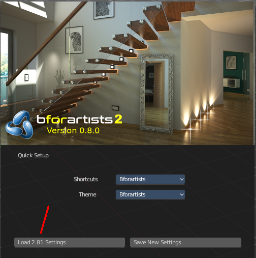
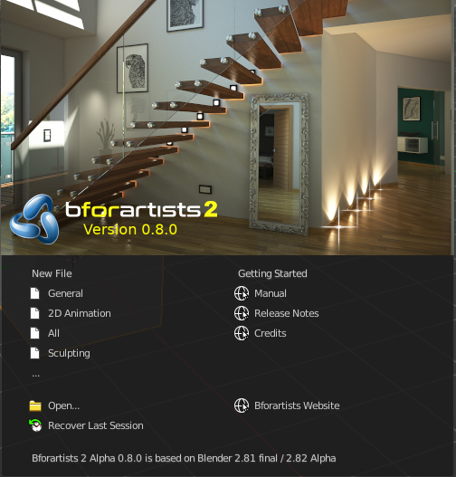
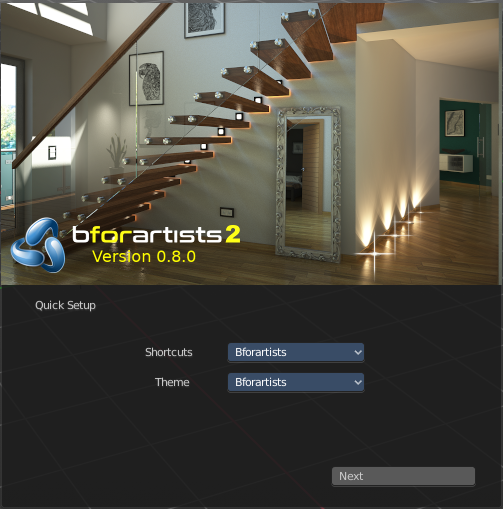

**************************
1 - Installing Bforartists
**************************

.. contents:: Contents

Getting Bforartists
===================

Download Bforartists
--------------------

Bforartists downloads can be downloaded here: https://www.bforartists.de/content/download

Bforartists is available for download for Linux, macOS and MS-Windows.Linux users needs to compile Bforartists by themselves though. We don't have binaries for this OS

There is also the source code available at github.https://github.com/Bforartists/Bforartists

Minimum Requirements
====================

**Minimum**

	32-bit dual core 2Ghz  CPU with SSE2 support.

	2 GB RAM

	24 bits 1280×768 display

	Mouse or trackpad

	OpenGL 2.1 compatible graphics with 512 MB RAM

**Recommended**

	64-bit quad core CPU

	8 GB RAM

	Full HD display with 24 bit color

	Three button mouse

	OpenGL 3.2 compatible graphics with 2 GB RAM

Installing on Linux
===================

Compiling yourself
------------------

There may not be the newest version of Bforartists available for Linux. Or not for your Linux distribution. Or not at all. Means you want or need to compile Bforartists from source code. Here you can find a tutorial that shows the whole process under Linux Ubuntu 17. Most of the process should work for other Linux distributions too.

https://www.bforartists.de/data/tuts/Building_with_Ubuntu17.pdf

Installing
----------

Compile the Linux version for your architecture to the desired location (eg. ~/software or /usr/local).

Bforartists 2 can now be launched by double-clicking the executable.

For easy access, you can configure your system by adding a menu entry or shortcut for Bforartists and associate and open .blend files with Bforartists when opening from the file browser. These settings typically belong to the Window Manager (KDE, Gnome, Unity).

Running from the terminal
-------------------------

To run Bforartists from the terminal without needing to be in the executable directory, add the extracted folder to the environment PATH.

Add the following command to .bash_rc or .bash_profile with Bforartists’s binary:

export PATH=$/path/to/Bforartists-VERSION-linux-glibcVERSION-ARCH:$PATH

.. Tip:: If you use daily builds and update Bforartists frequently, you can link or always rename your folder to ‘Bforartists’ and use this name for the ``PATH`` environment variable and for keeping the window manager menu up to date.

Avoiding Alt+Mouse Conflict
---------------------------

Many Window Managers default to Alt-LMB for moving windows, which is a shortcut that Bforartists uses to simulate a 3 button mouse. You can either have this feature disabled User Preferences > Input > Emulate 3 Button Mouse or you can change the Window Manager settings to use the **Meta** key instead (also called **Super** or **Windows key**):

- **KDE:** System Settings > Window Behavior > Window Behavior > Window Actions , Switch ‘Alt’ for ‘Meta’ key 
- **Unity/Gnome:** enter the following in a command line (effective at next login): 

gsettings set org.gnome.desktop.wm.preferences mouse-button-modifier '<Super>'

Installing on OSX
=================

After downloading Bforartists for Mac-OSX, uncompress the file and drag Bforartists.app onto the Applications folder.

.. Tip:: Because ``Bforartists`` doesn’t use the standard OS menu system, you likely have a redundant menu-bar at the top.

Installing on MS-Windows
========================

Exe
---

Download the installer, and execute it. Follow the advice of the installer.

Uninstalling previous versions
------------------------------

Bforartists 1 and 2 have different folders and settings. This wil not conflict. And you can have them installed side by side.

But in case you want to install a new version of Bforartists 2, and have an earlier version of Bforartists 2 already installed, then please uninstall this previous version first. Bforartists is in permanent development. And so lots of things can change with every version. Like wich addon is in what folder, or the number of addons at all. And this can lead to disfunctional or a double set of addons or files then when you simply install over the old installation.

Changes at the settings are not affected by uninstalling the software. They are stored in the appdata directory, and will remain. You can work with the old settings, see point below. But there is no guarantee that everything works flawless then. Old settings may or may not work proper.

Zip
---

Download the .zipfile. 

Place the zip file where you want Bforartists to be. This can be everywhere at your system. Then extract the zipfile. To start Bforartists you have to double click at the exe file inside the created folder now. 

It is also recommend to make a shortcut towards this executable. So that you don't have to navigate to the folder all the time when you want to start Bforartists. Place this shortcut at the desktop or the quickstart taskbar.

Import previous settings
========================

When you install a new version of Bforartists and had an older version installed, then you might experience that your old settings are gone, and Bforartists starts with the factory settings again.

Have a look at the splash screen. When there is a button down left, then this means that old settings from the previous version is available. And that you can import it. Which can be done with a click at the Load xxx Settings button.

Bforartists is based at Blender. And follows under the hood the naming conventions of Blender. So the number that you can see at the button here is the Blender version number that was used for the old settings.

This just works for the former version. You can import 2.81 settings in 2.82. But settings from 2.80 does not show.

Beware of possible conflicts. The keymap is still in change here and there. New addons pr code might conflict with the ones that you have installed.

Save new Settings
=================

Bforartists starts with a quick setup dialog as long as you haven't saved the new settings by clicking at the Next button down right. When you save the new settings, then you will see the workflow content like common links and last used scenes.

Note that you will loose the ability to load previous settings when you click at the Save New Settings button. So when you want to import old settings, do this step first. 

Configuration
=============

Here are some quick preferences that you may wish to set as quickly as possible. The full list and explanation of the preferences is in the section **User Preferences**.

Language
--------

At File > User Preferences > System, enable International Fonts to choose the Language and what to translate from Interface, Tooltips and New Data. See more at Internationalization

Input
-----

If you have a compact keyboard without a separate number pad enable File > User Preferences > Emulate Numpad.

If you don’t have a middle mouse button you can enable File > User Preferences > Emulate 3 Button Mouse.

File and Paths
--------------

At File > User Preferences > File you can set options such as what external Image Editor to use, such as GIMP or Krita, and the Animation Player.

The Temp directory sets where to store files such as temporary renders and autosaves.

.. Tip:: ``//`` at the start of a path in Bforartists means the directory of the currently opened ``.blend`` file, used to reference relative-paths.

If you trust the source of your .blend files, you can enable Auto Run Python Scripts. This option is meant to protect you from malicious Python scripts that someone can include inside a Bforartists file. This would not happen by accident, and most users leave this option on to automatically run scripts such as Rigify that controls the skeleton of a human rig. 

Input Devices
=============

Bforartists supports various types of input devices:

	Keyboard (recommended: keyboard with numeric keypad, English layout works best)Mouse (recommended: 3 button mouse with scroll wheel)NDOF Devices (also known as **3D Mouse**)Graphic Tablets

Mice
----

Mouse Button Emulation
----------------------

If you do not have a 3 button mouse, you will need to emulate it by checking the option in the User Preferences.

The following table shows the combinations used:

.. list-table::

	* - 3-button Mouse
	  - LMB
	  - MMB
	  - RMB

	* - 2-button Mouse
	  - LMB
	  - Alt-LMB
	  - RMB

Keyboards
---------

Numpad Emulation
----------------

If you do not have a numeric Numpad on the side of your keyboard, at a laptop for example, you may want to emulate one (uses the numbers at the top of the keyboard instead, however, removes quick access to layer visibility).

Non-English Keyboards
---------------------

Bforartists defaults are made for an english keyboard layout. It works fine at non-english keyboards in most cases. But in the input manager in the user preferences you may stumble across some oddities.

Graphic Tablets
---------------

Graphics tablets can be used to provide a more traditional method of controlling the mouse cursor using a pen. This can help to provide a more familiar experience for artists who are used to painting and drawing with similar tools, as well as provide additional controls such as pressure sensitivity.

3D Mice
-------

3D Mice or NDOF devices are hardware that you can use to navigate a scene in Bforartists. Currently only devices made by 3Dconnexion are supported. These devices allow you to explore a scene, as well as Walk/Fly modes.

Configuring Directories
=======================

There are three different directories Bforartists may use, their exact locations are operating system dependent.

LOCAL 

Location of configuration and runtime data (for self contained bundle) 

USER 

Location of configuration files (normally in the user’s home directory). 

SYSTEM 

Location of runtime data for system wide installation (may be read-only). 

For system installations both **SYSTEM** and **USER** directories are needed.

For locally extracted Bforartists distributions, the user configuration and data runtime data are kept in the same sub-directory, allowing multiple Bforartists versions to run without conflict, ignoring the **USER** and **SYSTEM** files.

.. Note:: You may need to have the “show hidden files” option checked in your file browser settings.

Platform Dependant Paths
------------------------

Every OS handles the peripheral paths a bit different. The default locations for each system are as follow. Note that he path ./\|BFORARTISTS_VERSION\|/ is relative to the Bforartists executable.

Linux
-----

LOCAL 

	./2.80/

USER 

	$HOME/.config/Bforartists/2.80/

SYSTEM 

	/usr/share/Bforartists/2.80/

.. Note:: The ``USER`` path will use ``$XDG_CONFIG_HOME`` if its set:

Mac OSX
-------

LOCAL 

	./2.80/

USER 

	/Users/$USER/Library/Application Support/Bforartists/2.80/

SYSTEM 

	/Library/Application Support/Bforartists/2.80/

.. Note:: OSX stores the Bforartists binary in ``./Bforartists.app/Contents/MacOS/Bforartists``, so the local path to data & config is:

MS-Windows
----------

LOCAL 

	.\\2.80\\\\.

USER 

	C:\\Documents and Settings\\$USERNAME\\AppData\\Roaming\\Bforartists Foundation\\Bforartists\\2.80\\

SYSTEM 

	C:\\Documents and Settings\\All Users\\AppData\\Roaming\\Bforartists Foundation\\Bforartists\\2.80\\

Path Layout
-----------

This is the path layout which is used within the directories described above.

Where ./config/startup.blend could be ~/.Bforartists/2.80/config/startup.blend for example.

./autosave/ ...

	Autosave blend file location. **Windows only, temp directory used for other systems.**

	Search order: LOCAL, USER.

./config/ ...

	Defaults & session info.

	Search order: LOCAL, USER.

./config/startup.blend

Default file to load on startup. 

./config/userpref.blend

Default preferences to load on startup. 

./config/bookmarks.txt

File selector bookmarks. 

./config/recent-files.txt

Recent file menu list. 

./datafiles/ ...

	Runtime files.

	Search order: LOCAL, USER, SYSTEM

./datafiles/locale/{language}/

Static precompiled language files for UI translation. 

./datafiles/icons/\*.png

Icon themes for Bforartistss user interface. **Not currently selectable in the theme preferences.**

./datafiles/brushicons/\*.png

Images for each brush. 

./scripts/ ...

	Python scripts for the user interface and tools.

	Search order: LOCAL, USER, SYSTEM.

./scripts/addons/\*.py

Python add-ons which may be enabled in the user preferences, includes import/export format support, render engine integration and many handy utilities. 

./scripts/addons/modules/\*.py

Modules for add-ons to use (added to Python’s sys.path). 

./scripts/addons_contrib/\*.py

Another add-ons directory which is used for community maintained add-ons (must be manually created). 

./scripts/addons_contrib/modules/\*.py

Modules for addons_contrib to use (added to Python’s sys.path). 

./scripts/modules/\*.py

Python modules containing our core API and utility functions for other scripts to import (added to Python’s sys.path). 

./scripts/startup/\*.py

Scripts which are automatically imported on startup. 

./scripts/presets/{preset}/\*.py

Presets used for storing user defined settings for cloth, render formats etc. 

./scripts/templates/\*.py

Example scripts which can be accessed from: Text Space’s Header –> Text –> Script Templates. 

./python/ ...

	Bundled Python distribution, only necessary when the system Python installation is absent or incompatible.

	Search order: LOCAL, SYSTEM. 

Temporary Directory
-------------------

The temporary directory is used to store various files at run-time (including render layers, physics cache, copy-paste buffer and crash logs).

The temporary directory is selected based on the following priority:

- User Preference (see `File Paths <https://docs.blender.org/manual/en/dev/preferences/file.html#prefs-file-paths>`_).
- Environment variables (TEMP on MS-Windows, TMP & TMP_DIR on other platforms).
- The /tmp/ directory.

