************************
20 Editors - Text Editor
************************

.. contents:: Contents


Text Editor
===========

**The ****Text Editor**is mainly used to write scripts. And so the functionality orients towards this useage. But you can also use it to write any text. To store some notes for the scene for example. See Tip below.

When you don't have a file loaded then the header content is rather small.


Once you create a new file, or load a file, you will see the toolbar change, and reveal further functionality.


Some text related functionality can also be found in the tool shelf at the right.

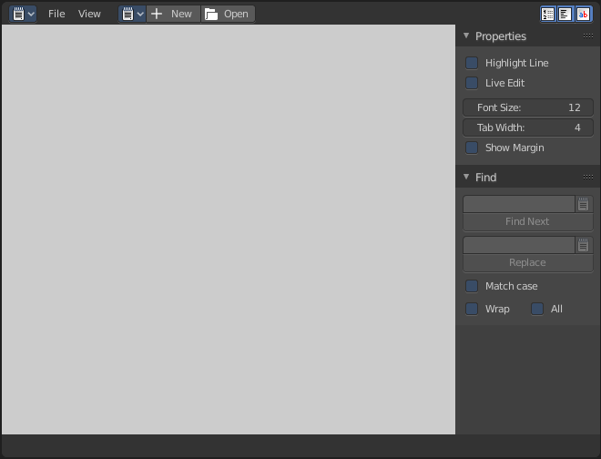

.. Tip:: ``A ````Text```` window can be used to write in a ````README```` text explaining the contents of your blend file. Be sure to keep it visible when saving!```` And be sure to tell the receiver to activate Load UI to display the text file then.```` Bforartists has Load UI deactivated by default.``


Header - File Menu
==================

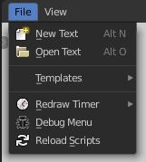

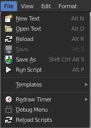

The File menu contains the load and save functionality. But also some Python and OSL templates. And some general debug functionality.

When no text is loaded then the menu is reduced.


New Text
--------

Creates a new text file.


Open Text
---------

Open a text file.


Reload
------

It can happen that you work with an external script editor, like Visual Studio, and change your script there. The reload button reloads the current active text file from hard disk.

You will get a warning symbol in the header when the script in the text editor doesn't match with the external text anymore.

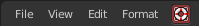


Save
----

Saves the text file. Overwrites the existing version immediately.


Save As
-------

Save as opens a save as file dialog.


Run Script
----------

This button is for python or OSL scripts. It executes the script.


Templates
---------

The Templates category contains some example scripts. There are two kind of templates. Python scripts and Open Shading Language scripts. The name of the files should tell you what the script is good for.

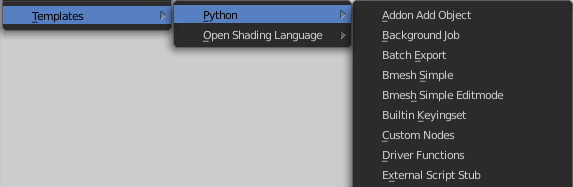


Redraw Timer
------------

This is a relict from early Blender days. A debugging timer for the UI where you can test the redraw time of different UI elements.


Debug Menu
----------

Another development tool. Here you can set the debug level.

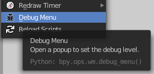

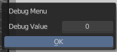

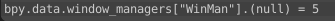


Reload Scripts
--------------

Reload Scripts reloads all active python scripts and addons. Including the Bforartists pyhton UI files. This can be useful when you work at the UI or at an addon. Then you don't have to close and reload Bforartists to see the changes. You can simply reload the scripts and keep Bforartists open.


Header - View Menu
==================

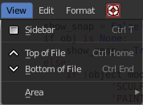

The View menu contains some view related functionality.


Properties
----------

Opens or closes the Properties sidebar.


Top of File
-----------

Jumps to the top of the text file.


Bottom of File
--------------

Jumps to the bottom of the text file.


Area
----

Area is a menu with window related settings.


Horizontal Split
----------------

Splits the editor horizontally into two editors.


Vertical Split
--------------

Splits the editor vertically into two editors.


Duplicate Area into new Window
------------------------------

Creates a floating window out of the current editor


Toggle Maximize Area
--------------------

Displays the editor maximized with menus.

To return to split view press hotkey Ctrl Up Arrow, or reuse the menu item in the View menu.


Toggle Fullscreen Area
----------------------

Displays the editor maximized without menus.

To return from the full screen view press hotkey Alt F10, or use the little button that appears up right when you move the mouse in this corner.


Header - Edit Menu
==================

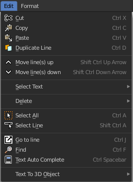

The Edit menu contains tools to modify the text.


Cut
---

Cuts the selected text.


Copy
----

Copies the selected text.


Paste
-----

Pastes copied text at Textcursor position.


Duplicate Line
--------------

Duplicates the line where the Textcursor currently is.


Move Line up
------------

Moves the line where the Textcursor is one line up.


Move Line down
--------------

Moves the line where the Textcursor is one line down.


Select Text
-----------

Select text is a sub menu that contains selection functionality, starting from the current position of the Textcursor. The buttons should be self explaining. And usually you use the hotkeys for this functionality.


Delete
------

Delete is a sub menu with some special Delete methods, starting from the current position of the Textcursor. And usually you use the hotkeys for this functionality.


Select all
----------

Selects all text.


Select Line
-----------

Selects the line where the Textcursor currently is


Go to Line
----------

This tool opens a sub menu where you can type in the line number and jump to this line then.


Find
----

Find opens the Tool Shelf, where you can find a search panel. The search panel is explained in the tool shelf chapter.


Text: Auto Complete
-------------------

Auto Complete tries to complete your text input.

This feature is currently broken, and will most probably lead to crashes. Don't use it!


Text to 3D Object
-----------------

Text to 3D Object converts the text of the file to a editable 3D object in the 3D Viewport.

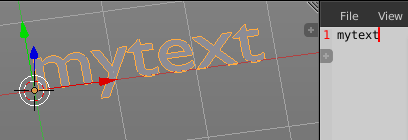


One Object
----------

Converts the whole text into one object.


One Object Per Line
-------------------

Converts every line of the text into a separate object.


Header - Fromat Menu
====================

The format menu contains some formatting functionality.

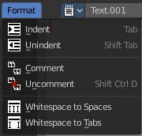


Indent
------

Indents the text. Python requires proper indentation.


Unindent
--------

Unindents the text.


Comment
-------

Comments the text out. For Python usually with a # sign.


Uncomment
---------

Uncomments commented text.


Whitespaces to Spaces
---------------------

Converts Whitespaces in the text to Spaces.


Whitespaces to Tabs
-------------------

Converts Whitespaces in the text to Tabs.


Header - Tools
==============

The Headertools provides you with quick access functionality.


Header Tools without a text file loaded
---------------------------------------


Text File Browser Dropdown box
------------------------------

This list is empty when no file is loaded.


New
---

Creates a new text file.


Open
----

Opens a file browser where you can choose a file to load.


Show Line Numbers, Wrap and Syntax Highlight
--------------------------------------------

See below.


Header Tools with a text file loaded
------------------------------------


Text File Browser Dropdown box
------------------------------

This list shows you the currently loaded text files.


Text File Browser Edit Box
--------------------------

The edit box allows you to rename the currently active text file.

The + Button behind allows you to create a new text file. 

The Button with the folder at it calls a file browser where you can load files.

The X button at the end unlinks the text file, means it deletes it from the Text file browser list.


Show Line Numbers, Wrap and Syntax Highlight
--------------------------------------------

Show Line numbers dislpays a row of numbers at the left side of the text file.

Wrap words wraps the text to fit into the current editor size.

Syntax highlighting colors text parts fitting to the language.


Run Script
----------

This button is for python or OSL scripts. It executes the script.


Register
--------

This checkbox is for Python or OSL Scripts. When checked the classes of the script gets registered in Bforartists.


Info String
-----------

Shows infos about the current text file. When it's an internal created file then it displays the String File : Internal. When it's an external loaded file, then the string displays the path to the location of the file.


Tool Shelf
==========

The Tool Shelf is the place for some options and the text search panel.


Properties Panel
----------------


Highlight
---------

Highlights the line where the textcursor is.


Live Edit
---------

Updates the script while editing.


Font Size
---------

The font size for the text editor


Tab width
---------

Number of spaces to display tabs with. Default is four. 


Tabs as spaces
--------------

When you press tab and Tabs as spaces is active, then it gets indented as a tab indent. When Tabs as spaces is unticked, then a tab just acts like pressing a spacebar.


Show Margin
-----------

Shows a dotted line at the right. Note that we have curerntly a theming problem here with the default Bforartists theme. We have white text, means a white dotted line. And we have a white background. This means that the dotted line just shows with other themes where the header text color is black.


Margin Column
-------------

This edit box becomes visible when Show Margin is ticked.

Here you can adjust the width from the left at which the dotted margin line should show.


Find Panel
----------

In the find panel you will find tools with text search and replace functionality.


Find Edit Box
-------------

Here you can type in the string that you want to search.


Find set selected
-----------------

Copies the currently selected text into the Find edit box, searches for a matching string in the text, and selects this match then.


Find Next
---------

Searches for the next matching string in the text.


Replace Edit Box
----------------

Here you can type in the string that you want to replace in the text.


Replace set selected
--------------------

Copies the currently selected text into the Find edit box, searches for a matching string in the text, and replaces this match with the string in the Replace edit box.


Replace Next
------------

Searches for the next matching string in the text. And replaces it the string in the Replace edit box.

.. Note:: By default when the search does not find a matching string anymore in the text below the current selection, then you will get a warning that the search string is not present in the text file. It will not automatically start the search from the top again. You have to place the text cursor manually at the top of the text.


Match case
----------

When ticked then the search is Upper case sensitive.


Wrap
----

Starts the search from the top of the document when the search has reached the end of the document.


All
---

Search in all opened Textfiles, not just the currently active one.


Footer
======


Info String
-----------

This string shows infos about the current text file. 

When it's an internal created file then it displays the String File : Internal. 

When it's an external loaded file, then the string displays the full path to the location of the file.


Context menu
============

When you right click into the text editor then a popup menu opens up. It is to 100% made of double menu entries. And not contextual at all.

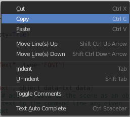

See edit menu.

