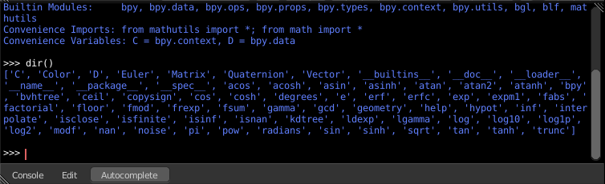

***************************
21 Editors - Python Console
***************************

.. contents:: Contents

Python Console
==============

The Python console is a quick way to execute commands, with access to the entire Python API, command history and auto-complete. It's a research tool for addon- and script developers. But also a place to quickly execute single operators or to try out some simple code.

Console Menu
============

The Console menu provides some console editor window specific functionality.

Console Execute
---------------

The expressions in the python console are not read only. You can execute them like you would do from a script. This button executes a selected command.

Clear
-----

Clears all lines. The blue help text remains.

Clear Line
----------

Clears the selected line(s).

Copy as Script
--------------

Copies the whole content of the console as a script that can be pasted into the Text editor.

Copy
----

Copies selected content.

Paste
-----

Pastes copied content.

Zoom Text Out
-------------

Zooms out the text in the console window.

Zoom Text In
------------

Zooms in the text in the console window.

Languages
---------

Languages is a sub menu where you can choose the language.

This menu looks pretty uselesss, since there is just one language available. Python. But it has its useage. With a click at the Python button you can restart the console when you have lost yourself in the deeps of the api.

Area Menu
---------

Area is a menu with window related settings.

Horizontal Split
----------------

Splits the editor horizontally into two editors.

Vertical Split
--------------

Splits the editor vertically into two editors.

Duplicate Area into new Window
------------------------------

Creates a floating window out of the current editor.

Toggle Maximize Area
--------------------

Displays the editor maximized with menus.

To return to split view press hotkey Ctrl Up Arrow, or reuse the menu item in the View menu.

Toggle Fullscreen Area
----------------------

Displays the editor maximized without menus.

To return from the full screen view press hotkey Alt F10, or use the little button that appears up right when you move the mouse in this corner.

Edit Menu
=========

The Edit menu provides you with text specific functionality. Its content should be used by hotkeys. The menu is more to show that this functionality exists.

Indent
------

Indents the selected text.

Unindent
--------

Removes indention of the selected text.

Cursor to Previous word
-----------------------

Sets the caret in front of the previous word.

Cursor to Next word
-------------------

Sets the caret in front of the next word.

Cursor to Line Begin
--------------------

Sets the caret to line begin.

Cursor to Line End
------------------

Sets the caret to line end.

Cursor to Previous Character
----------------------------

Sets the caret in front of the previous character.

Cursor to Next character
------------------------

Sets the caret in front of the next character.

Delete
------

Delete is a sub menu with several delete methods.

Next character
--------------

Deletes the character beyond the caret.

Previous Character
------------------

Deletes the character before the caret.

Next Word
---------

Deletes the word beyond the caret.

Previous Word
-------------

Deletes the word before the caret.

History Cycle
-------------

Cycles through the history. Up arrow cycles forwards through the history.

Down arrow cycles backwards through the history.

What does this mean? When you write some text, then add something more, delete something, then all this steps are entries in the history. And with History cycle you can access this steps.

Autocomplete
============

Autocomplete is a functionality to autocomplete what you have written in the console. It lists for example all available bpy operators when you type in bpy.context.area. , and then hit the Autocomplete button. That way you can go through the whole bpy hierarchy down to what you need for your code, starting with bpy. , and having a look at what is available.

Useage
======

Accessing Built-in Python Console
---------------------------------

From the screen shot above, you will notice that by clicking at the Autocomplete button you can enable Auto-complete feature.

The command prompt is typical for Python 3.x, the interpreter is loaded and is ready to accept commands at the prompt >>>

First look at the Console Environment
-------------------------------------

To check what is loaded into the interpreter environment, type dir() at the prompt and execute it.

Following is a quick overview of the output

C

Quick access to bpy.context

D

Quick access to bpy.data

bpy

Top level Bforartists Python API module. 

The rest of the commands are of various content. Most of them are mathematical expressions.

Auto Completion at work
-----------------------

Tpe bpy. and then press the Autocomplete button.

A list of sub-modules inside of bpy will appear. These modules encapsulate all that we can do with Bforartists Python API.

Lets list all the contents of bpy.app module.

Notice the green output above the prompt where you enabled auto-completion. What you see is the result of auto completion listing. In the above listing all are module attribute names, but if you see any name end with ‘(‘, then that is a function.

We will make use of this a lot to help our learning the API faster. Now that you got a hang of this, lets proceed to investigate some of modules in bpy.

Before working with the modules.
--------------------------------

If you look at the 3D Viewport in the default Bforartists scene, you will notice some objects. We have added a cube here too.

- All objects exist in a context and there can be various modes under which they are operated upon. 
- At any instance, only one object is active and there can be more than one selected objects. 
- All objects are data in the Bforartists file. 
- There are operators/functions that create and modify these objects.

For all the scenarios listed above the bpy module provides functionality to access and modify data.

Examples
========

.. Note :: For the commands below to show the proper output, make sure you have selected object(s) in the 3D view. 

bpy.context
-----------

Try it out!
-----------

bpy.context.mode 

Will print the current 3D View mode (Object, Edit, Sculpt etc.,) 

bpy.context.object or bpy.context.active_object 

Will give access to the active object in the 3D View 

>>> bpy.context.object.location.x = 1

Change x location to a value of 1

>>> bpy.context.object.location.x += 0.5

Move object from previous x location by 0.5 unit

>>> bpy.context.object.location = (1, 2, 3)

Changes x, y, z location

>>> bpy.context.object.location.xyz = (1, 2, 3)

Same as above

>>> type(bpy.context.object.location)

Data type of objects location

>>> dir(bpy.context.object.location)

Now that is a lot of data that you have access to

bpy.context.selected_objects 

Will give access to a list of all selected objects. 

>>> bpy.context.selected_objects

... then press Ctrl-Spacebar

>>> bpy.context.selected_objects[0]

Prints out name of first object in the list

>>> [object for object in bpy.context.selected_objects if object != bpy.context.object]

Complex one... But this prints a list of objects not including the active object

bpy.data
--------

bpy.data has functions and attributes that give you access to all the data in the Bforartists file.

You can access following data in the current Bforartists file: objects, meshes, materials, textures, scenes, screens, sounds, scripts, ... etc.

That’s a lot of data.

Try it out!
-----------

Exercise
--------

>>> for object in bpy.data.scenes['Scene'].objects: print(object.name)

Return twice Prints the names of all objects belonging to the Bforartists scene with name “Scene”

>>> bpy.data.scenes['Scene'].objects.unlink(bpy.context.active_object)

Unlink the active object from the Bforartists scene named ‘Scene’

>>> bpy.data.materials['Material'].shadows

>>> bpy.data.materials['Material'].shadows = False

bpy.ops
-------

The tool/action system in Bforartists is built around the concept of operators. These operators can be called directly from console or can be executed by click of a button or packaged in a python script. Very powerful they are..

Lets create a set of five Cubes in the 3D Viewport. First, delete the existing Cube object by selecting it and pressing X

Try it out!
-----------

The following commands are used to specify that the objects are created in layer 1. So first we define an array variable for later reference:

>>> mylayers = [False] \* 20

>>> mylayers[0] = True

We create a reference to the operator that is used for creating a cube mesh primitive

>>> add_cube = bpy.ops.mesh.primitive_cube_add

Now in a for loop, we create the five objects like this (In the screenshot above, I used another method) Press ENTER-KEY twice after entering the command at the shell prompt.

>>> for index in range(0, 5): add_cube(location=(index \* 3, 0, 0), layers=mylayers)

