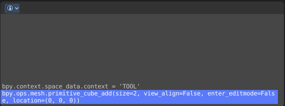

************************
22 Editors - Info Editor
************************

.. contents:: Contents

Info Editor
===========

The Info Editor has just one purpose. It lists the performed operations in the current session. And displays them as Python commands. Here you can also find error messages.

You can find the Info Editor in the scripting layout down left.

You can copy text from the Info Editor by marking some text, and then use the hotkey ctrl + c to copy it.

Header
------

In the Scripting Layout the header of the Info Editor is collapsed. Pull it down to reveal it.

The header is empty besides the Editor Type menu. Here you can switch to other editor types.

