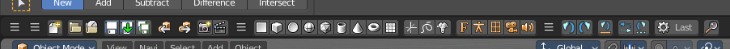
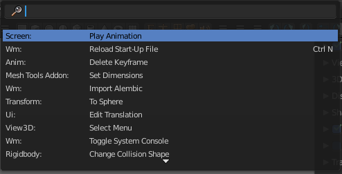

********************
23 Editors - Toolbar
********************

.. contents:: Contents

Detailed Table of Content
=========================

Introduction
============

The Toolbar editor is what you normally have to avoid in UI design. It's a bunch of double menu entries. It is made by lots of tools that already exists elsewhere.

But the value of this double menu here is that it is configurable. This customizable toolbar makes it possible to have the most needed tools at top UI level. This can save a ton of clicks, tabbing, scrolling, and digging in sub menus. And you can display what you need for your personal workflow. And hide away the rest.

The toolbar editor uses pure Icon buttons. 

Parts of the toolbars are just visible when you are in the right mode. The full Primitives toolbar for example in just visible in Object mode. Parts of it are visible in Edit mode, dependant of what type of object you modify. And in the other modes the toolbars are hidden.

Parts of the toolbars are just visible when the right object type in the scene exists / is selected.

As told, the toolbars are double menu entries. This means te description of the tools in this chapter will be as short as possible. Closer descriptions, like how to use the tools, can be found in the other chapters where the tools comes from. The Tool Shelf in the 3D View for example.

Limits
------

- The toolbar does not contain all possible tools. More the opposite, the selection is very limited. Lots of tools depends to be performed in the editor type where you want to do the change. They just work there.And not in other editors. This affects for example most tools in edit mode. And the toolbar is another editor. This limits the available tools in the toolbar dramatically.

- The toolbars have a fixed order. The content is not sortable. The sorting is defined by the order of the toolbar type. And inside the toolbar type by the order in the toolbars menu. You would need to have to edit the python file to change this order.

- Just the toolbar types are independent. The checkboxes to display the toolbars themselves are global. Means when you set one toolbar type to Primitives, and activate all the primitives types there, then other toolbars with thist toolbar type will have the same primitives types displayed. 

Menus
=====

When you first look at the Toolbar then you will see no visible menus. They exists, but they are hidden away to save UI space. The text menus would eat lots of space that we can better spend in displaying more tools.

The Toolbar Type menu and the Toolbars menus are collapsed. You can expand those menus. This makes it easier to setup. But you can also work with the collapsed menus.

(Un-) Collapse the menus
------------------------

Right click a the Toolbar. Untick Collapse Menus in the upcoming menu. Then the collapsed menus becomes visible again. 

To collapse the menus go the opposite route. Right click a the Toolbar. And tick Collapse Menus in the upcoming menu.

Toolbar Type menu
-----------------

The first entry of a toolbar is the Toolbar Type menu.

Here you can choose what kind of Toolbar Type you want to show. You can show multiple types of toolbars at once.

The toolbar types are independant from each other. You can set up every toolbar to display different content.

Toolbars Menus
--------------

Every toolbar type has several toolbars to display. 

In the toolbar menu you can choose what toolbars you want to display.

The toolbars are not independant. This setup is global. When you for example tick the Toolbar File in this toolbar, then it will be displayed in all other toolbars too. Including in other layouts.

These checkboxes are also available in the Toolbar Settings Bforartists addon.

Toolbar Settings Bforartists addon
==================================

The settings for the toolbar needs to be stored somewhere. This is done in an addon called Toolbar Settings Bforartists. 

This addon contains the same checkboxes than the single toolbars menus in the toolbar. But all of them at once. And here is where they get stored when you save the user settings. So when you activate some toolbars, then save the Userpreferences to make it permanent.

.. list-table::

	* - Warning! 

	* - Do not deactivate this addon. The toolbar will not work then. It depends of the settings in the addon!

Create new toolbar
==================

You might want to create your own toolbar for a new layout. Let's explain the needed steps.

First create a new editor type. This can be done by dragging the triangle area of an existing editor. And will create a new editor.

Look at the right of this new created editor type. You will now see a small button. This is the Editor type menu. Open it by clicking at it. And choose Toolbar.

Now set up your new created Toolbar editor. Choose the toolbar types you want to display here. Then choose the toolbars to display.

The last step is to hide the Editor Type menu and to collapse the menus. Right click at the toolbar, and tick Collapse Menus and Hide Editortype menu. 

.. image:: graphics/23_Editors_-_Toolbar/100002010000013B000000814297907F020F30D8.png

Save Toolbar state
==================

You may want to save the changes at the toolbar. Because without saving the changes you will loose them when you reopen Bforartists. 

The state of the checkboxes are stored in the Toolbar Settings Bforartists Addon. So to save this part you have to save the User Settings in the User Preferences. It doesn't matter if you have changed the checkboxes in the toolbar or the addon. They are the same. 

But the state of the collapsed Toolbar menus is not stored in the User Preferences. They are part of the layout. You have to save the startup file to make this changes permanent. 

Be careful here. Saving the startup file saves every change at the layout. Including things like having a mesh in the scene.

Toolbar Types
=============

Currently the Toolbar editor contains eight toolbar types. 

File - Contains some file menu related tools. Like load save. But also the render menu. 

Mesh Edit- Contains tools for Meshes in Edit Mode.

Primitives - Contains the primitives from the Create tab in the Tool Shelf.

Image - Contains some tools for editing UV

Tools - Contains the content of the Relations panel in Object mode.

Animation - Contains Animation tools

Edit - Contains some tools from Object and Edit Mode

Misc - Contains Undo, and an empty menu as a place holder.

Toolbars File
=============

The Toolbars File contains some file menu related tools. Like load save. But also the render menu. 

These toolbars are available in all modes. 

Available Toolbars
------------------

The description of the single buttons goes from left to right.

Load / Save
-----------

The original menu items are in the File menu of the Info editor.

Reload Startup file
-------------------

Creates a new scene.

Open Blend File
---------------

Load a Blend file.

Recent
------

The recent files menu.

Save Blend File
---------------

Save a Blend file.

Save As Blend File
------------------

Save a Blend file as.

Save Copy
---------

Saves a copy of the Blend file. 

Link Append
-----------

The original menu items are in the File menu of the Info editor.

Link from Library
-----------------

Link contend from a Blend file

Append from Library
-------------------

Append content

Import Menu
-----------

The Import menu is the same menu that you can find in the File menu of the Info editor. It contains all available file import types.

Export Menu
-----------

The Export menu is the same menu that you can find in the File menu of the Info editor.

It contains all available file export types.

Import Common
-------------

The original menu items are in the File menu of the Info editor.

Import FBX
----------

Import FBX files.

Import Obj
----------

Import Object files.

Import ABC
----------

Import Alembic files.

Import Common 2
---------------

The original menu items are in the File menu of the Info editor.

Import DAE
----------

Import Collada files.

Import BVH
----------

Import Biovision Motion Capture files.

Import gITF2
------------

Import gITF2 files.

Import Uncommon
---------------

The original menu items are in the File menu of the Info editor.

Import STL
----------

Import STL files

Import PLY
----------

Import PLY files.

Import SVG
----------

Import SVG Files.

Export Common
-------------

The original menu items are in the File menu of the Info editor.

Export FBX
----------

Export as FBX file.

Export Obj
----------

Export as Obj file.

Export ABC
----------

Export as Alembic file.

Export Common 2
---------------

The original menu items are in the File menu of the Info editor.

Export DAE
----------

Export as Collada file.

Export BVH
----------

Export as BVH Motion Capture file.

Export gITF2
------------

Export as gITF2 file.

Export Uncommon
---------------

The original menu items are in the File menu of the Info editor.

Export 3DS
----------

Export as 3DS.

Export PLY
----------

Export as PLY file.

Render
------

The original menu items are in the Render menu of the Info editor.

Render Image
------------

Renders the current scene as an image by using the current offline renderer. Either Blender Internal or Cycles.

Render Animation
----------------

Renders the current scene as an animation. Either Blender Internal or Cycles.

Render Open GL
--------------

Open GL Render Image
--------------------

Renders the current scene as an image by using the Viewport and Open GL.

Open GL Render Animation
------------------------

Renders the current scene as an animation by using the Viewport and Open GL.

Render Misc
-----------

The original menu items are in the Render menu of the Info editor.

Mixdown Audio
-------------

Mixdown and export the scene's audio to an audio file.

Show/ Hide Renderview
---------------------

Toggles display of Render view.

Play rendered animation
-----------------------

Play rendered Animation sequence.

Window Search
-------------

The original menu item is in the Windows menu in the Info editor.

This button calls the search menu.

Toolbars Mesh Edit
==================

The Toolbars Mesh Edit contains tools for Mesh Objects in Edit Mode. The original menu items are mainly in the Mesh menu in Edit Mode. In the Vertices, Edges and Faces submenus.

This toolbarsshows its content Edit mode. 

Available Toolbars
------------------

The description of the single buttons goes from left to right.

Vertices Splitconnect
---------------------

Split
-----

Splits two connected Vertices.

Vertex Connect Path
-------------------

Connect Vertices by their seleciton order, creating edges, splitting faces

Vertex Connect
--------------

Connect selected vertices of faces, splitting the face.

Vertices Misc
-------------

Convex Hull
-----------

Enclose selected vertices in a convex polyhedron.

Blend from Shape
----------------

Blend in shape from a shapekey.

Shape Propagate
---------------

Apply selected vertex locations to all other shapekeys.

Edges Subdiv
------------

Subdivide Edge Ring
-------------------

Subdivides an Edge Ring

Un-Subdivide
------------

Unsubdivides selected edges and faces.

Edges Sharp
-----------

Mark Sharp
----------

Mark selected edges as sharp.

Unmark Sharp
------------

Unmark selected edges as sharp.

Edges Freestyle
---------------

Mark Freestyle Edge
-------------------

Mark selected edges as Freestyle feature edges.

Unmark Freestyle Edge
---------------------

Unmark selected edges as Freestyle feature edges.

Edges Rotate
------------

Rotate
------

Rotate selected edges or adjoining faces.

Edges Misc
----------

Edge Split
----------

Split selected edges so tthat each neighbour face gets its own copy.

Bridge Edgeloops
----------------

Create faces between selected edge loops.

Faces general
-------------

Fill
----

Fill a selected edge loop with faces.

Grid Fill
---------

Fill grid from two loops.

Beautify Faces
--------------

Rearrange some faces to minimize degenerations.

Solidify
--------

Create a solid skin by extruding. Compensating for sharp angles.

Intersect
---------

Cut an intersection into faces.

Boolean Intersect
-----------------

Cut solid geometry from selected to unselected.

Wire Frame
----------

Create a solid wire frame from faces.

Faces Freestyle
---------------

Mark Freestyle Face
-------------------

Mark selected faces for exclusion from freestyle feature edge detection.

Unmark Freestyle Face
---------------------

Unmark selected faces for exclusion from freestyle feature edge detection.

Faces Tris
----------

Poke Faces
----------

Split a face into a fan.

Triangulate Faces
-----------------

Triangulates selected faces.

Tris to Quads
-------------

Join triangle faces into quads.

Split by Edges
--------------

Split faces by loose edges.

Faces Rotate Misc
-----------------

Rotate UV's
-----------

Rotate UV coordinates inside faces.

Reverse UV's
------------

Flip direction of UV coordinates inside faces.

Rotate Colors
-------------

Rotate Vertex Colors inside faces.

Reverse Colors
--------------

Flip direction of Vertex Colors inside faces.

Cleanup
-------

Delete Loose
------------

Delete loose vertices, edges or faces.

Decimate Geometry
-----------------

Simplify geometry by collapsing edges.

Degenerate Dissolve
-------------------

Dissolve zero area faces and zero length edges.

Make Planar Faces
-----------------

Flatten selected faces.

Split Non Planar Faces
----------------------

Split non planar faces that exceeds the angle threshold.

Split Concave Faces
-------------------

Make all faces convex.

Fill Holes
----------

Fill in holes (boundary edge loops)

Toolbars Primitives
===================

The toolbars Primitives contains the Add items from the Create tab.

The full toolbar with all its content is just available in Object mode. In other modes it hides away. Single types are also visible in Edit mode. When you work at an mesh type, then the Mesh primitives toolbar is visible for example.

Available Toolbars
------------------

The description of the single buttons goes from left to right.

Mesh
----

The Mesh toolbar contains the Mesh primitives. 

The original menu items are in the Tool Shelf in the 3D View, in the Create tab in the Add Primitives Panel.

Add Plane
---------

Add a Plane primitive.

Add Cube
--------

Add a Cube primitive.

Add Circle
----------

Add a Circle primitive.

Add UV Sphere
-------------

Add a UV Sphere primitive.

Add Cylinder
------------

Add a Cylinder primitive.

Add Cone
--------

Add a Cone primitive.

Add Torus
---------

Add a Torus primitive.

Add Grid
--------

Add a Grid primitive.

Curve
-----

The Curve toolbar contains the Curve primitives. 

The original menu items are in the Tool Shelf in the 3D View, in the Create tab in the Add Primitives Panel.

Add Bezier
----------

Add a Bezier curve primitive.

Add Circle
----------

Add a Circle curve primitive.

Add Nurbs Curve
---------------

Add a Nurbs Curve primitive.

Add Nurbs Circle
----------------

Add a Nurbs Circle curve primitive.

Add Nurbs Path
--------------

Add a Nurbs Path curve primitive.

Surface
-------

The Surface toolbar contains the Surface primitives. 

The original menu items are in the Tool Shelf in the 3D View, in the Create tab in the Add Primitives Panel.

Add Surface Curve
-----------------

Add a Nurbs Surface curve primitive.

Add Surface Circle
------------------

Add a Nurbs Surface Circle primitive.

Add Surface Patch
-----------------

Add a Nurbs Surface Patch primitive.

Add Surface Cylinder
--------------------

Add a Nurbs Surface Cylinder primitive.

Add Surface Sphere
------------------

Add a Nurbs Surface Sphere primitive.

Add Surface Torus
-----------------

Add a Nurbs Surface Torus primitive.

Metaball
--------

The metaball toolbar contains the Metaball primitives.

The original menu items are in the Tool Shelf in the 3D View, in the Create tab in the Add Primitives Panel.

Add Metaball of type Ball
-------------------------

Add Metaball of type Ball primitive.

Add Metaball of type Capsule
----------------------------

Add Metaball of type Capsule primitive.

Add Metaball of type Plane
--------------------------

Add Metaball of type Plane primitive.

Add Metaball of type Elipsoid
-----------------------------

Add Metaball of type Elipsoid primitive.

Add Metaball of type Cube
-------------------------

Add Metaball of type Cube primitive.

Grease Pencil
-------------

Blank
-----

Inserts a blank Grease Pencil Object. A blank Grease Pencil Object has just one color

Stroke
------

Inserts a Stroke Grease Pencil Object. A Stroke Grease Pencil Object has a few standard colors already.

Monkey
------

Inserts a Monkey Grease Pencil Object. This is a grease pencil object which contains the shape of a monkey already. This monkey is a example object.

Lamp
----

The Lamp toolbar contains the different lamp types.

The original menu items are in the Tool Shelf in the 3D View, in the Create tab in the Add Misc Panel.

Add Lamp of type Point
----------------------

Add Lamp of type Point.

Add Lamp of type Sun
--------------------

Add Lamp of type Sun.

Add Lamp of type Spot
---------------------

Add Lamp of type Spot.

Add Lamp of type Area
---------------------

Add Lamp of type Area.

Other
-----

The Other toolbar contains some other ground types like bones and text.

The original menu items are in the Tool Shelf in the 3D View, in the Create tab in the Add Misc Panel.

Add Text
--------

Add a Text object.

Add Armature
------------

Add a Armature object.

Add Lattice
-----------

Add a Lattice object.

Add Camera
----------

Add a Camera object.

Add Speaker
-----------

Add a Speaker object.

Empties
-------

The Empties toolbar contains the available empty types.

The original menu items are in the Tool Shelf in the 3D View, in the Create tab in the Add Misc Panel.

Add Empty of type Plain Axes
----------------------------

Add Empty of type Plain Axes.

Add Empty of type Sphere
------------------------

Add Empty of type Sphere.

Add Empty of type Circle
------------------------

Add Empty of type Circle.

Add Empty of type Cone
----------------------

Add Empty of type Cone.

Add Empty of type Cube
----------------------

Add Empty of type Cube.

Add Empty of type Single Arrow
------------------------------

Add Empty of type Single Arrow.

Add Empty of type Arrows
------------------------

Add Empty of type Arrows.

Add Empty of type Image
-----------------------

Add Empty of type Image.

Image
-----

Reference Image
---------------

Creates a plane with an image that can be used as a reference image.

Background Image
----------------

Creates a plane with an image that can be used as a Background image.

Light Probe
-----------

Reflection Cubemap
------------------

Creates a lightprobe with a reflection cubemap.

Reflection Plane
----------------

Creates a lightprobe with a reflection plane.

Irradiance Volume
-----------------

Creates a lightprobe with Irradiance Volume.

Force Field 
------------

The Force Field toolbar contains the available Force field types.

The original menu items are in the Tool Shelf in the 3D View, in the Create tab in the Add Misc Panel.

Add Physics Effector of Type Boid
---------------------------------

Add Physics Effector of Type Boid.

Add Physics Effector of Type Charge
-----------------------------------

Add Physics Effector of Type Charge.

Add Physics Effector of Type Curve Guide
----------------------------------------

Add Physics Effector of Type Curve Guide.

Add Physics Effector of Type Drag
---------------------------------

Add Physics Effector of Type Drag.

Add Physics Effector of Type Force
----------------------------------

Add Physics Effector of Type Force.

Add Physics Effector of Type Harmonic
-------------------------------------

Add Physics Effector of Type Harmonic.

Add Physics Effector of Type Lennard-Jones
------------------------------------------

Add Physics Effector of Type Lennard-Jones.

Add Physics Effector of Type Magnetic
-------------------------------------

Add Physics Effector of Type Magnetic.

Add Physics Effector of Type Smoke Flow
---------------------------------------

Add Physics Effector of Type Smoke Flow.

Add Physics Effector of Type Texture
------------------------------------

Add Physics Effector of Type Texture.

Add Physics Effector of Type Turbulence
---------------------------------------

Add Physics Effector of Type Turbulence.

Add Physics Effector of Type Vortex
-----------------------------------

Add Physics Effector of Type Vortex.

Add Physics Effector of Type Wind
---------------------------------

Add Physics Effector of Type Wind.

Collection 
-----------

Add Collection Instance
-----------------------

Add a collection instance.

Toolbars Image
==============

The toolbars Image contains some image related tools. At the moment this toolbar contains just tools to edit UV meshes. This means that you have to be in Edit mode with an UV mapped mesh to make the tools active. 

The original menu items are in the Image menu of the UV Image Editor.

Available Toolbars
------------------

The description of the single buttons goes from left to right.

UV Align 
---------

The UV Align toolbar contains tools to clean up and align the selected UV geometry.

Align Straighten
----------------

Align UV's along the line defined by the end points of the selection.

Align Straighten X
------------------

Align UV's along the line defined by the end points along the X axis.

Align Straighten Y
------------------

Align UV's along the line defined by the end points along the Y axis.

Align Auto
----------

Automatically choose the axis on which there is most alignmend already.

Align X
-------

Align UV's at X axis

Align Y
-------

Align UV's at Y axis

UV Unwrap
---------

The UV Common toolbar contains tools for unwrapping.

Mark Seam
---------

Mark selected UV Edges as Seam.

Clear Seam
----------

Remove Seam from selected UV Edges.

Seams from Islands
------------------

Marks the border edges of the UV patches as Seam.

Unwrap Angle Based
------------------

Unwraps the selected geometry with the Angle based ( ABF ) method.

Unwrap Conformal
----------------

Unwraps the selected geometry with the Conformal ( LSCM ) method.

UV Modify UV
------------

The UV Modify toolbar contains tools to clean up the uv mapping.

Pin
---

Pins the selected vertices.

Unpin
-----

Unpins the selected verstices.

Weld
----

Weld the selected UV vertices together.

Remove Doubles UV
-----------------

Removes double vertices

Average Island Scale
--------------------

Average the size of separated UV patches, based at their size in 3D space.

Pack Island
-----------

Packs the UV patches so that they fit best into the UV space, and as few texturespace as possible is wasted.

Copy mirrored UV Coordinates
----------------------------

Copy mirrored UV Coordinates at X axis based on a mirrored mesh.

ToolbarsTools
=============

The Toolbars Tools contains some tools in object mode. The content from the relations panel and the edit panel in the tool shelf. And one tool in Edit mode. Make Vertex Parent. Since this is also part of the relations panel.

Available Toolbars
------------------

The description of the single buttons goes from left to right.

Parent
------

Make Parent
-----------

Parents the selected object to the active object.

Clear Parent
------------

Removes the parenting.

Object to Data
--------------

Make Single User
----------------

Make linked data local to each object.

Link Data
---------

Apply active object links to other selected objects.

This button is a menu where you can choose the link method.

Link to SCN
-----------

Link to SCN
-----------

Link selection to another scene. This other scene has of course to exist.

Linked Objects
--------------

Make Local
----------

Make library linked datablocks local to this file.

Make Proxy
----------

Add empty object to become local replacement data of a library linked object.

Join
----

Join
----

Join selected objects into active objects.

Origin
------

Set Geometry to Origin
----------------------

Sets the geometry to origín.

Set Origin to Geometry
----------------------

Sets the origin to geometry.

Set Origin to 3D cursor
-----------------------

Sets the origin to the 3D cursor.

Set Origin to Center of Mass
----------------------------

Sets the origin to the center of mass.

Set Origin to Center of Volume
------------------------------

Sets the origin to the center of volume.

Shading
-------

Shade Smooth
------------

Shades the geometry smooth.

Shade Flat
----------

Shades the geometry flat.

Data Transfer
-------------

Transfer Mesh Data
------------------

Transfers mesh data.

Transfer Mesh Data Layout
-------------------------

Transfers the mesh data layout.

Join UV's
---------

Transfer UV Maps.

Relations
---------

The Relations toolbar contains one tool in Edit mode. Make Vertex Parent. 

Make Vertex Parent
------------------

Parents an object to the selected vertice(s).

ToolbarsAnimation
=================

The Toolbars Animation contains tools around animation. The Toolbars Range, Play, Sync and Keyingset are the toolbars from the Timeline. But separated into four independant parts. 

Available Toolbars
------------------

The description of the single buttons goes from left to right.

Keyframes
---------

The Keyframes toolbar contains some keyframe tools. The original menu items can be found in the Tool Shelf in the Animation tab in the Animation panel.

The original menu items are in the Tool Shelf in the 3D View, in the Animation tab in the Animation panel.

Insert Keyframe Menu
--------------------

When there is no keying set assigned to the currently selected object ,then this button is a menu where you can choose a keying set. When there is already a keying set assigned, then you can record a keyframe with this button

Delete Keyframe
---------------

Deletes the current Keyframe

Bake Action
-----------

Bakes the animation to a new action

Remove Animation
----------------

Remove all keyframe animation for selected objects

Calculate Object Paths
----------------------

Calculate motion paths for the selected objects. 

Clear Object Paths
------------------

Clears motion paths for the selected objects. 

Play
----

Jump to Endpoint
----------------

Jumps to beginning of animation

Jump to Keyframe
----------------

Jumps to the previous keyframe Play Animation

Play Animation
--------------

Plays animation reversed

Play Animation
--------------

Plays animation forward

Jump to Keyframe
----------------

Jumps to next keyframe

Jump to Endpoint
----------------

Jumps to end of animation

Current Frame
-------------

The current frame number

Range
-----

Use Preview Range
-----------------

Use an alternative start/end frame grange for animation playback and OpenGL renders instead of the Render Properties start/end frame range.

Lock Frame Selection to Range
-----------------------------

Don't allow frame to be selected with mouse outside of frame range

Frame Start
-----------

The frame start point

Frame End
---------

The frame end point

Keyframe Type
-------------

Keyframe Type is a dropdown box where you can choose in what color the keyframe gets displayed in the Dope Sheet Editor.

Sync
----

Sync is a dropdown box where you can adjust the syncing method.

Keyingset
---------

Insert Keyframe
---------------

Insert a keyframe.

Delete Keyingset Keyframe
-------------------------

Delete Keyframe.

Use Keyframe Insert Auto
------------------------

Auto insert keyframes at manipulation.

Keying set Dropdown box
-----------------------

This is a dropdown box where you can choose the keyingset method.

ToolbarsEdit
============

The Toolbars Edit contains various toolbars around editing. Some content just shows when an object exists in the scene. Some content is visible in Object mode. Some content is visible in Edit mode. 

Available Toolbars
------------------

The description of the single buttons goes from left to right.

Edit 
-----

The Edit toolbar is just visible in Edit Mode. The original menu items are in the Tool Shelf in the 3D View in the Tools tab in the Mesh Tools panel.

Dissolve Vertices
-----------------

Dissolve Vertices.

Dissolve Edges
--------------

Dissolve Edges.

Dissolve Faces
--------------

Dissolve Faces.

Remove Doubles
--------------

Removes double vertices.

Limited Dissolve
----------------

Dissolve Edges and Vertices limited by the surrounding angle.

Dissolve Selection
------------------

Dissolve Geometry dependant of selection mode.

Edge Collapse
-------------

Collapse selected edges.

Merge
-----

Merges selected geometry. This is a dropdown box where you can choose where to merge.

Separate
--------

Separate the selection, and create a new object from it. This is a dropdown box where you can choose the separate method.

Weigth in Edit
--------------

The Weight in Edit toolbar is just visible in Edit Mode for normal meshes, and Pose mode when you have a rigged character selected. The original menu items are in the Tool Shelf in the 3D View in the Tools tab in the Weight Tools panel. You need to have a Vertex Group applied.

Normalize all
-------------

Normalizes the whole mesh.

Normalize
---------

Normalizes the selection

Mirror
------

Mirrors the selection.

Invert
------

Inverts the weighting.

Clean
-----

Remove Vertex Assignments that are not required.

Quantize
--------

Set Weights to a fixed number of steps.

Levels
------

Add some offset and multiply with some gain the weights of the active vertex group.

Smooth
------

Smooth weights for selected vertices.

Limit Total
-----------

Limit deform weights.

Fix Deforms
-----------

Fix Deforms by modifying the position of selected vertices.

Object Apply
------------

The Object Apply toolbar is just visible in Object Mode. The original menu items are in the Object menu in the 3D View. The Apply menu.

Apply Location
--------------

Apply location.

Apply Rotation
--------------

Apply Rotation.

Apply Scale 
------------

Apply Scale.

Apply All
---------

Apply Location, Rotation, Scale.

Apply Rotation & Scale
----------------------

Apply Rotation, Scale.

Apply Visual Transform
----------------------

Apply Visual Transform.

Apply Make Duplicates real
--------------------------

Make Duplicates attached to this object real.

Object Apply Deltas
-------------------

Object Apply deltas converts normal object transforms to delta transforms. Any existing delta transform will also be included.

Location
--------

Apply location.

Rotation
--------

Apply Rotation.

Scale 
------

Apply Scale.

All
---

Apply Location, Rotation, Scale.

Transforms to Delta Anims
-------------------------

Convert object animation for normal transforms to delta transforms

Object Clear
------------

The Object Clear toolbar is just visible in Object Mode. The original menu items are in the Object menu in the 3D View. The Clear menu.

Location
--------

Resets the position of the object to zero

Rotation
--------

Resets the object's rotation to zero

Scale 
------

Resets the object's scale to 1

Origin
------

Resets the Origin Position 

ToolbarsMisc
============

The Toolbars Misc contains some miscellaneous tools. Undo, the Scene dropdown box, Last Operator and Operator Search.

Available Toolbars
------------------

The description of the single buttons goes from left to right.

Undo / Redo
-----------

Undo
----

Undo the last step

Redo
----

Redo the last undone step

Undo History
------------

Undo History
------------

A click at at the button reveals a list of the last operations where you can undo more than one step.

Repeat
------

Repeat
------

Repeats the last action

Repeat History
--------------

A click at at the button reveals a list of the last operations where you can choose from wich undo step to repeat.

Scene
-----

The Scene dropdown box to choose and create a new scene data block. The original dropdown box is in the Properties editor in the Scene tab in the Scene panel.

Adjust last Operation
---------------------

This is the same panel than the one in the 3D view down left. At least when it comes to content. Here you can adjust the latest operation.

Operator Search Menu
--------------------

The original menu item is in the header in the Edit menu.

This button calls the Operator search menu.

Misc
----

The Misc toolbar is currently empty besides a placeholder string.

