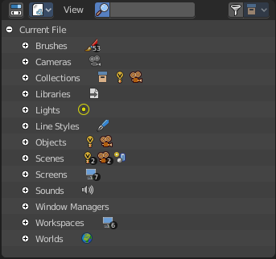

*********************
24 Editors - Outliner
*********************

.. contents:: Contents

Outliner
========

The Outliner is an editor where you can organize the data in your scene. It is in the View Layer mode basically a list of the available objects and data in the scene, which is organized in so called collections. Think of it as a container that carrys the scene data. This also includes things like brushes, textures and materials.

The outliner not only lists the data. But you can modify the data in various ways. And it has more than one mode. We will go through them, one by one.

The outliner has some context menus that are available by a right click at an element. We will also cover them, one by one.

General hotkey functionality
----------------------------

There is some general hotkey functionality that works across the whole interface. And so it works in the outliner too.

Left click at an object selects it. When you select an object in the outliner, thent it is also selected in the scene.

Dragging the mouse with left click box selects.

Like in the 3D view, Shift + LMB adds to the selection, or can remove the clicked object from the selection.

Ctrt+LMB enters the rename mode for the object. You can also double click at it. In both cases the text becomes editable.

You can drag objects into the hierarchy of other objects, and make them a child object by that.

You can navigate with the arrow buttons. Holding shift while navigating with the arrow buttons will extend the selection.

Extended Functionality
----------------------

The outliner has some extended functionality in some modes. 

Objects with a + sign at the left are hierarchical objects. Hierarchy can be expanded and collapsed by clicking at the + and - signs.

When you click at a data block of some object types object, like the mesh component for a mesh or a curve object, then you will jump from object mode into edit mode. And vice versa.

Collections
-----------

Collections are containers that can contain objects or anything else in the scene. They can also include collections, and are fully recursive.

Header - All Modes
==================

The header content changes, dependant of the display mode. Here we list the elements that are available in all display modes.

Switch to Properties Editor / Outliner
--------------------------------------

Sometimes you want to switch from Outliner to the Properties Editor , or vice versa. Since you sometimes don't have enough space for both, and end in dragging the borders of the editors around all the time. This two editors are connected by a menu that allows exactly that. A button in each header that switches to the other editor.

Display Mode
------------

The Outliner has more than one purpose and workspace. Here you can switch to different display modes. The available Modes are Scenes, View Layer, Sequence, Blender File, Data API and Orphan Data. We will cover their functionality in their own chapters.

View Menu
---------

The View menu contains general view related functionality.

Show Active
-----------

Centers the view of the list to the active object.

Show One Level
--------------

Expands the list hierarchy level by one.

Hide One Level
--------------

Collapses the list hierarchy level by one.

Expand / Collapse All
---------------------

Expands or collapses all collapsed hierarchy. It's a toggle

Show Hierarchy
--------------

Open all object entries and close all others. For example, when you are in Scene view, and have the objects expanded, then the Show Hierarchy closes the objects hierarchy.

Box Select
----------

Box select items in the list.

Select All
----------

Select all items in the list.

Deselect All
------------

Deselect all items in the list.

Invert Selection
----------------

Inverts the selection. Unselected list items becomes selected, selected list items becomes unselected.

Area
----

Area is a menu with window related settings.

Horizontal Split
----------------

Splits the editor horizontally into two editors.

Vertical Split
--------------

Splits the editor vertically into two editors.

Duplicate Area into new Window
------------------------------

Creates a floating window out of the current editor

Toggle Maximize Area
--------------------

Displays the editor maximized with menus.

To return to split view press hotkey Ctrl Up Arrow, or reuse the menu item in the View menu.

Toggle Fullscreen Area
----------------------

Displays the editor maximized without menus.

To return from the full screen view press hotkey Alt F10, or use the little button that appears up right when you move the mouse in this corner.

Search Field
------------

Here you can search for specific terms in the list. When the search term matches a name in the list, then the list will center at the first entry with the match.

This search field is collapsible, and closed by default to free some UI space.

Right Click Menus
=================

The Outliner comes with various right click functionality, dependant at what data you right click.

Outliner Scene Operation
------------------------

This menu appears when you right click at a scene in Scene mode.

Delete
------

Deletes the currently selected scene.

Outliner Data Operation
-----------------------

This menu appears at various object types and when you for example right click at the View Layer. It also appears at objects in Data API mode.

This menu is work in progress, the functionality is not implemented yet! You will get a warning!

Select
------

Select the current element.

Deselect
--------

Deselect the current element.

Hide
----

Hides the current element.

Unhide
------

Unhides the current element.

Select Linked
-------------

Selects the linked elements.

Collection
----------

This menu apperars when you right click at a collection. Clicking at a Scene collection will just give you a New menu item. Clicking at the Collection item lower in the hierarchy will give you a bigger menu then.

New
---

Create a new collection.

New Nested
----------

Create a new nested collection. There is no difference. Both gets added in the selected collection as a child, and the functionality is the same. Ask the Blender developers what they did here.

Paste
-----

Paste a collection.

New
---

Create a new scene collection.

New Nested
----------

Create a new nested collection. There is no difference. Both gets added in the selected collection as a child, and the functionality is the same. Ask the Blender developers what they did here.

Duplicate Collection
--------------------

Duplicates the currently selected collection, all its children, objects and the object data.

Duplicate Linked
----------------

Recursively duplicate the selected collection, all its children and objects, including linked object data.

Copy
----

Copies the collection.

Paste
-----

Pastes a copied collection.

Delete
------

Delete the collection. Objects in the hierarchy will remain.

Delete Hierarchy
----------------

Delete the collection. Objects in the hierarchy will be deleted too.

Select Objects
--------------

Select the objects in the collection.

Deselect Objects
----------------

Deselect the objects in the collection.

Instance to Scene
-----------------

Instance selected collections to the active scene.

Link to Scene
-------------

Link selected collections to the active scene.

Unlink
------

Unlink selected collections from the active scene.

Visibility
----------

Visibility is a sub menu with some visibility functionality. The greyed out menu items will become available when the functionality becomes available. For example, Show becomes available when something is hidden.

Isolate
-------

Hide all but this collection and its parents.

Show All Inside
---------------

Reveals the collection and all its content.

Hide
----

Hides the collection.

ID Data
-------

Data related operations. Note that the tooltips are currently missing here.

Unlink
------

Does basically the same than delete. It unlinks all data, and removes the object from the scene.

Make Local
----------

For appended or linked data. Makes the selected object a local copy in the current blend file.

Add Library Override
--------------------

Add a local library override to this collection.

This tool works different from Make Override in the outliner. It does not iterate through the hierarchy of objects and collections based on the selection. But works just for the currently selected object.

Library Overrides is the new system designed to replace and supersede Proxies. Most types of linked data-blocks can be overridden, and the properties of those overrides can then be edited. When the library data change, unmodified properties of the override one will be updated accordingly.

Make Single User
----------------

For duplicated content. Makes the data block of the selected object a single user.

Delete
------

Not functional in all situations. In the orphan data mode you can remove objects with this.

Remap Users
-----------

Remaps the user of a data block to another one of the same type. This allows you to replace all usages of a material or texture by another one.

Copy
----

Copies the user data block.

Paste
-----

Pastes a copied user data block.

Add Fake User
-------------

Adds a fake user to the selected object. Fake users is a odd concept to keep data in the scene even if it has no user somewhere. The fake user is then a dummy user so that the object is not deleted when saving the scene.

Clear Fake User
---------------

Removes the fake user from the selected object.

Rename
------

Rename the object in the outliner.

Select Linked
-------------

Selects all objects that are linked to the currently selected one.

Object Menu
-----------

This menu appears when you click at an object type. A mesh, a lamp, a camera ...

Select
------

Selects the object.

Select Hierarchy
----------------

Selects the object and its hierarchy.

Deselect
--------

Deselects the object.

Copy
----

Copies object.

Paste
-----

Pastes copied object.

Delete
------

Deletes the selected object.

Unlink
------

Deletes the selected object.

ID Data
-------

Data related operations. Note that the tooltips are currently missing here.

Unlink
------

Does basically the same than delete. It unlinks all data, and removes the object from the scene.

Make Local
----------

For appended or linked data. Makes the selected object a local copy in the current blend file.

Make Single User
----------------

For duplicated content. Makes the data block of the selected object a single user.

Delete
------

Not functional in all situations. In the orphan data mode you can remove objects with this.

Remap Users
-----------

Remaps the user of a data block to another one of the same type. This allows you to replace all usages of a material or texture by another one.

Copy
----

Copies ID data.

Paste
-----

Pastes copied ID data.

Add Fake User
-------------

Adds a fake user to the selected object. Fake users is a odd concept to keep data in the scene even if it has no user somewhere. The fake user is then a dummy user so that the object is not deleted when saving the scene.

Clear Fake User
---------------

Removes the fake user from the selected object.

Rename
------

Rename the object in the outliner.

Select Linked
-------------

Selects all objects that are linked to the currently selected one.

Outliner ID Data Operation
--------------------------

This menu appears when you for example click at the mesh component of a mesh object. It is the same content than the ID Data menu from the Object menu.

Unlink
------

Does basically the same than delete. It unlinks all data, and removes the object from the scene.

Make Local
----------

For appended or linked data. Makes the selected object a local copy in the current blend file.

Make Single User
----------------

For duplicated content. Makes the data block of the selected object a single user.

Delete
------

Not functional in all situations. In the orphan data mode you can remove objects with this.

Remap Users
-----------

Remaps the user of a data block to another one of the same type. This allows you to replace all usages of a material or texture by another one.

Copy
----

Copies ID data.

Paste
-----

Pastes copied ID data.

Add Fake User
-------------

Adds a fake user to the selected object. Fake users is a odd concept to keep data in the scene even if it has no user somewhere. The fake user is then a dummy user so that the object is not deleted when saving the scene.

Clear Fake User
---------------

Removes the fake user from the selected object.

Rename
------

Rename the object in the outliner.

Select Linked
-------------

Selects all objects that are linked to the currently selected one.

Level Restrictions
==================

Level Restrictions
------------------

Some list items have so called level restrictions. You can click at them , and so exclude the object from specific things. You can make more level restrictions available in the filter settings, which will be covered below. The by default activated are:

Selectability
-------------

Makes the object unselectable in the viewport. Or disables it, in case of a collection for example.

Hide from Viewport
------------------

Hides the object from the Viewport.

Hide from Render
----------------

Excludes the object from rendering.

Scenes Mode
===========

.. image:: graphics/24_Editors_-_Outliner/1000020100000159000001A1753537485D3865EC.png

The Scenes mode starts one hierarchy higher than the default View Layer Mode. It shows all available scenes and their content.

Normally you work with one scene. And so the default starts with the View Layer mode of the scene. But you can create more scenes in the Properties Editor in the Scene tab.

View Layer Mode
===============

Shows the content of the current View Layer. This is the default mode.

Headertools
-----------

Restriction Toggles
-------------------

Here you can enable or disable further level restrictions. To make the changes permanent you would have to save the startup file. This settings is part of the layout. 

Sort Alphabetically
-------------------

Sorts the content of the outliner in alphabetically order.

Sync Selection
--------------

Synchronize the selection between outliner and 3d view.

Search
------

Exact Match Search
------------------

The search result must fit exactly. For example, when you search for cam, then a camera should not display as a search result.

Case Sensitive Search
---------------------

Search case sensitive.

Filter
------

Shows or hides the object and data types. The names should be self explaining.

Object State Filter
-------------------

Shows or hides objects by its state.

Collection Menu
---------------

Move to Collection
------------------

Moves the selected object to a collection. The object is removed from the collection it was in.

By clicking at this menu item a popup will appear where you can choose the new collection. Here you can also create a new collection. Once done, the object will be moved to this new created collection.

Last Operator Move to Collection
--------------------------------

Name
----

Here you can set a name for your new collection. When you haven't created a new collection, then this name stays blank.

Link to Collection
------------------

Links the object to a collection. The object remains in the collection it was in.

By clicking at this menu item a popup will appear where you can choose the collection. Here you can also create a new collection. Once done, the object will be linked to this new created collection.

Last Operator Link to Collection
--------------------------------

Name
----

Here you can set a name for your new collection. When you haven't created a new collection, then this name stays blank.

Remove From Collection
----------------------

Objects can be in more than one collection. Remove from collection removes the selected object from the current collection.

When the object is in no collection anymore, then it gets removed.

Remove From all Unlinked Collections
------------------------------------

Objects can be in more than one collection. Remove from all unlinked collection removes the selected object from all unlinked collections.

When the object is in no collection anymore, then it gets removed.

Add selected To Active Collection
---------------------------------

Objects can be in more than one collection. Adds the selected object to the active collection.

Remove Selected From Active Collection
--------------------------------------

Objects can be in more than one collection. Removes the selected object from the active collection.

When the object is in no collection anymore, then it gets removed.

Add Collection
--------------

Add a collection inside of the current selected collection.

Sequence Mode
=============

This mode lists the loaded files when you work with the sequencer layout and have video material loaded.

Sync Outliner Selection
-----------------------

Keep the selection in synchronization with the other editors. 3D View and VSE.

Blender File Mode
=================

This mode lists the whole content of the current Blender file. It includes also things like the default brushes, which comes from the startup defaults.

Headertools
-----------

Filter
------

Here you can enable a filter to display a specific data type. You can just filter by one data type at a time. The rest will be hidden.

Filter ID Type
--------------

The menu where you can choose the data type that should be displayed.

Data API Mode
=============

Displays Low Level Blender data and its properties.

This view also reveals some properties. Like File is Saved or Use Autopack.

When no keying set is defined then you will get a No Keyingset Active message instead of the Keyingset element.

Headertools
-----------

Edit Menu
---------

Keying Set Add Selected
-----------------------

Add a keying set to the selected object.

Keying Set Remove Selected
--------------------------

Remove the keying set from the selected object.

Add Drivers to Selected
-----------------------

Add a driver to the selected object.

Delete Drivers for Selected
---------------------------

Delete a driver from the selected object.

Set Keyingset
-------------

Here you can choose a keyingset.

Add keyframe
------------

Adds a keyframe for the selected element.

Remove keyframe
---------------

Removes the current keyframe from the selected element.

Orphan Mode
===========

Bforartists has a special system to treat not longer used data. Unused data will normally remain in the scene as long as you haven't saved it and reloaded it. Means delete does not immediately remove a mesh completely from the scene for example. It will be orphan data now. Until you save and reopen the scene. The cleanup process happens at saving the blend file.

The Orphan Mode allows you to clean up the unused data without to save and reload the blend file. It lists all data that has no user in the scene. This includes the standard brushes from the startup configuration. Don't delete them!

Headertools
-----------

Filter
------

Here you can enable a filter to display a specific data type. You can just filter by one data type at a time. The rest will be hidden.

Filter ID Type
--------------

The menu where you can choose the data type that should be displayed.

Purge
-----

Normally you would need to save the blend file and reload it to get rid of the orphan data. Purge removes all orphan data from the blend file immediately. Note that this does not remove objects with a fake user associated.

Statuscolumn
------------

The number at the right tells you how many users the object has. Objects with a power icon and a F besides the number have a fake user assigned. Objects with an X in the row is orphan data, and will be removed with the next save and reload of the blend file. Objects with the power icon will remain in the scene. They have a fake user.

To remove the Fake User at an object click at the Power icon. It will turn into the X button then. And the object will be removed at saving.

