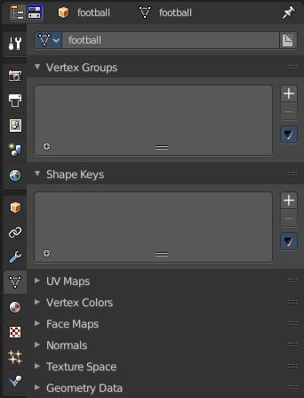
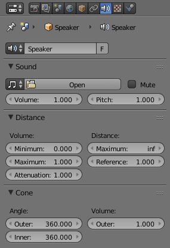

25.10 Editors - Properties Editor - Object Data Tab
===================================================

Speaker
=======

The speaker object is used to give sound in the 3D View. After adding the object the various settings can be changed in the properties editor.

Options
-------

Sound
-----

Mute 

Toggles whether or not the sound can be heard. 

Volume 

Adjust the loudness of the sound. 

Pitch 

Can be used to bend the pitch of the sound to be either deeper or higher. 

Distance
--------

Volume

Minimum 

Minimum volume, no matter how far the object is. 

Maximum 

Maximum volume, no matter how far the object is. 

Attenuation 

How strong the distance affects the volume. 

Distance

Maximum 

Maximum distance for volume calculation. 

Reference 

Reference distance at which volume is 100%. 

Cone
----

Angle

Outer 

Angle of the outer cone in degrees. Outside this cone the volume is the outer cone volume (see below). Between the inner and outer cone the volume is interpolated. 

Inner 

Angle of the inner cone in degrees. Inside the cone the volume is 100%. 

Volume

Outer 

Volume outside the outer cone. 

