**********************************************************
25.13.1  Editors - Properties Editor - Physics - Particles
**********************************************************

.. contents:: Contents

Particles
=========

Particles are lots of items emitted from mesh objects, typically in the thousands. Each particle can be a point of light or a mesh, and be joined or dynamic. They may react to many different influences and forces, and have the notion of a lifespan. Dynamic particles can represent fire, smoke, mist, and other things such as dust or magic spells.

**Hair** type particles are a subset of regular particles. Hair systems form strands that can represent hair, fur, grass and bristles.

You see particles as a **Particle** modifier, but all settings are done in the **Particle tab**.

Some fur made from particles

Particles generally flow out from their mesh into space. Their movement can be affected by many things, including:

- Initial velocity out from the mesh. 
- Movement of the emitter (vertex, face or object) itself. 
- Movement according to “gravity” or “air resistance”. 
- Influence of force fields like wind, vortexes or guided along a curve. 
- Interaction with other objects like collisions. 
- Partially intelligent members of a flock (herd, school, ...), that react to other members of their flock, while trying to reach a target or avoid predators. 
- Smooth motion with softbody physics (only **Hair** particle systems). 
- Or even manual transformation with **Lattices**. 

Particles may be rendered as:

- **Halos** (for Flames, Smoke, Clouds). 
- Meshes which in turn may be animated (e.g. fish, bees, ...). In these cases, each particle “carries” another object. 
- **Strands** (for **Hair, Fur, Grass**); the complete way of a particle will be shown as a strand. These strands can be manipulated in the 3D window (combing, adding, cutting, moving, etc). 

Every object may carry many particle systems. Each particle system may contain up to 100. 000 particles. Certain particle types (**Hair** and **Keyed**) may have up to 10.000 children for each particle (children move and emit more or less like their respective parents). The size of your memory and your patience are your practical boundaries.

Workflow
--------

The process for working with standard particles is:

- Create the mesh which will emit the particles. 
- Create one or more Particle Systems to emit from the mesh. Many times, multiple particle systems interact or merge with each other to achieve the overall desired effect. 
- Tailor each Particle System’s settings to achieve the desired effect. 
- Animate the base mesh and other particle meshes involved in the scene. 
- Define and shape the path and flow of the particles. 
- For **Hair** particle systems: Sculpt the emitter’s flow (cut the hair to length and comb it for example). 
- Make final render and do physics simulation(s), and tweak as needed. 

Creating a Particle System
--------------------------

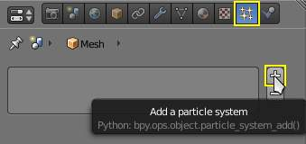

Adding a particle system.

To add a new particle system to an object, go to the **Particles** tab of the object **Settings** editor and click the small **+** button. An object can have many Particle Systems.

Each particle system has separate settings attached to it. These settings can be shared among different particle systems, so one doesn’t have to copy every setting manually and can use the same effect on multiple objects. Using the **Random** property they can be randomized to look slightly different, even when using the same settings.

Types of Particle systems
-------------------------

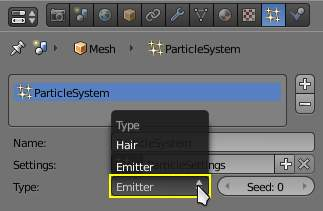

Particle System Types.

After you have created a particle system, the **Property** window fills with many panels and buttons. But don’t panic! There are two different types of particle systems, and you can change between these two with the **Type** drop-down list:

Emitter 

This parallels the old system to the greatest extent. In such a system, particles are emitted from the selected object from the **Start** frame to the **End** frame and have a certain lifespan. 

**Hair**

This system type is rendered as strands and has some very special properties: it may be edited in the 3D window in realtime and you can also animate the strands with **Cloth Simulation**. 

The settings in the **Particle System** panel are partially different for each system type. For example, in **Image 3** they are shown for only system type **Emitter**.

Common Options
--------------

Each system has the same basic sets of controls, but options within those sets vary based on the system employed. These sets of controls are:

**Emission**

Settings for the initial distribution of particles on the emitter and the way they are born into the scene. 

**Cache**

In order to increase realtime response and avoid unnecessary recalculation of particles, the particle data can be cached in memory or stored on disk. 

**Velocity**

Initial speed of particles. 

**Rotation**

Rotational behavior of particles. 

**Physics**

How the movement of the particles behaves. 

**Render**

Rendering options. 

**Display**

Realtime display in the 3D View. 

**Children**

Control the creation of additional child particles. 

**Field Weights**

Factors for external forces. 

**Force Field Settings**

Makes particles force fields. 

**Vertex Groups**

Influencing various settings with vertex groups. 

Particle Emission
=================

The **Emitter** system works just like its name says: it emits/produces particles for a certain amount of time. In such a system, particles are emitted from the selected object from the **Start** frame to the **End** frame and have a certain lifespan. These particles are rendered default as **Halos**, but you may also render these kind of particles as objects (depending on the particle system’s render settings, see **Visualization**).

Options
-------

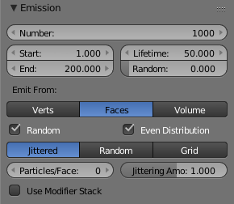

Particle Emission Settings

The buttons in the **Emission** panel control the way particles are emitted over time:

Amount 

The maximum amount of parent particles used in the simulation. 

Start 

The start frame of particle emission. You may set negative values, which enables you to start the simulation before the actual rendering. 

End 

The end frame of particle emission. 

Lifetime 

The lifetime (in frames) of the particles. 

Random 

A random variation of the lifetime of a given particle. The shortest possible lifetime is **Lifetime**×(1-**Rand**). Values above 1.0 are not allowed. For example with the default **Lifetime** value of 50 a **Random** setting of 0.5 will give you particles with lives ranging from 50 frames to 50×(1.0-0.5) =25 frames, and with a **Random** setting of 0.75 you’ll get particles with lives ranging from 50 frames to 50×(1.0-0.75) =12.5 frames. 

Emission Location
-----------------

**Emit From** parameters define how and where the particles are emitted, giving precise control over their distribution. You may use vertex groups to confine the emission, that is done in the **Vertexgroups** panel.

Verts 

Emit particles from the vertices of a mesh. 

Faces 

Emit particles from the surface of a mesh’s faces. 

Volume 

Emit particles from the volume of an enclosed mesh. 

Distribution Settings
---------------------

These settings control how the emissions of particles are distributed throughout the emission locations

Random 

The emitter element indices are gone through in a random order instead of linearly (one after the other). 

For Faces and Volume, additional options appear:

Even Distribution 

Particle distribution is made even based on surface area of the elements, i.e. small elements emit less particles than large elements, so that the particle density is even. 

Jittered 

	Particles are placed at jittered intervals on the emitter elements.

	Particles/Face 

	Number of emissions per face (0 = automatic). 

	JitteringAmount 

	Amount of jitter applied to the sampling. 

Random 

Particles are emitted from random locations in the emitter’s elements. 

Grid 

	Particles are set in a 3d grid and particles near/in the elements are kept.

	Invert Grid 

	Invert what is considered the object and what is not. 

	Hexagonal 

	Uses a hexagonal shaped grid instead of a rectangular one. 

	Resolution 

	Resolution of the grid. 

	Random 

	Add a random offset to grid locations. 

.. Tip:: Your mesh must be manifold to emit particles from the volume.

Use Modifier Stack 

	Take any **Modifiers** above the particle modifier in the **Modifier Stack** into account when emitting particles.

	Note that particles may differ in the final render if these modifiers generate different geometry between the viewport and render.

Particle Physics
================

The movement of particles may be controlled in a multitude of ways. With particles physics: there are five different systems:

None (No Physics) 

It doesn’t give the particles any motion, which makes them belong to no physics system. 

**Newtonian**

Movement according to physical laws. 

**Keyed**

Dynamic or static particles where the (animated) targets are other particle systems. 

**Boids**

Particles with limited artificial intelligence, including behavior and rules programming, ideal for flocks of birds or schools of fishes, or predators vs preys simulations. 

**Fluid**

Movement according to fluid laws (based on Smoothed Particle Hydrodynamics technique). 

Additional ways of moving particles:

- By softbody animation (only for Hair particle systems). 
- By forcefields and along curves. 
- By lattices. 

Here we will discuss only the particle physics in the narrower sense, i.e. the settings in the Physics panel.

Velocity
--------

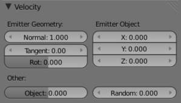

Image 3: Initial velocity.

The initial velocity of particles can be set through different parameters, based on the type of the particle system (see Particle System tab). If the particle system type is Emitter or Hair, then the following parameters give the particle an initial velocity in the direction of...

Emitter Geometry
----------------

Normal 

The emitter’s surface normals (i.e. let the surface normal give the particle a starting speed). 

Tangent 

Let the tangent speed give the particle a starting speed. 

Rot 

Rotates the surface tangent. 

Emitter Object
--------------

Align X,Y,Z 

Give an initial velocity in the X, Y, and Z axes. 

Object 

The emitter objects movement (i.e. let the object give the particle a starting speed). 

Random 

Gives the starting speed a random variation. You can use a texture to only change the value, see Controlling Emission, Interaction and Time). 

Rotation
--------

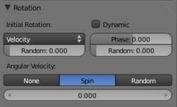

Particles rotation settings.

These parameters specify how the individual particles are rotated during their travel. To visualize the rotation of a particle you should choose visualization type Axis in the Visualization panel and increase the Draw Size.

Initial Rotation Mode 

	Sets the initial rotation of the particle by aligning the x-axis in the direction of:

	None 

	the global x-axis. 

	Normal 

	Orient to the emitter’s surface normal, the objects Y axis points outwards. 

	Normal-Tangent 

	As with normal, orient the Y axis to the surface normal. Also orient the X axis to the tangent for control over the objects rotation about the normal. requires UV coordinates, the UV rotation effects the objects orientation, currently uses the active UV layer. This allow deformation without the objects rotating in relation to their surface. 

	Velocity 

	the particle’s initial velocity. 

	Global X/Global Y/Global Z 

	one of the global axes 

	Object X/Object Y/Object Z 

	one of the emitter object axes. 

	Random 

	Randomizes rotation. 

Dynamic 

If enabled, only initializes particles to the wanted rotation and angular velocity and let’s physics handle the rest. Particles then change their angular velocity if they collide with other objects (like in the real world due to friction between the colliding surfaces). Otherwise the angular velocity is predetermined at all times (i.e. set rotation to dynamic/constant). 

Phase 

Initial rotation phase 

Random 

Rand allows a random variation of the Phase. 

Angular Velocity 

	The magnitude of angular velocity, the dropdown specifies the axis of angular velocity to be

	None 

	a zero vector (no rotation). 

	Spin 

	the particles velocity vector. 

	Random 

	a random vector. 

If you use a Curve Guide and want the particles to follow the curve, you have to set Angular Velocity to Spin and leave the rotation on Constant (i.e. don’t turn on Dynamic). Curve Follow does not work for particles.

Common Physics Settings
-----------------------

Size 

Sets the size of the particles. 

Random Size 

Give the particles a random size variation. 

Mass 

Specify the mass of the particles. 

Multiply mass with particle size 

Causes larger particles to have larger masses. 

No Physics
----------

At first a Physics type that makes the particles do nothing could seem a bit strange, but it can be very useful at times. None physics make the particles stick to their emitter their whole life time. The initial velocities here are for example used to give a velocity to particles that are affected by a harmonic effector with this physics type when the effect of the effector ends.

Moreover, it can be very convenient to have particles at disposal (whose both Unborn and Died are visible on render) to groom vegetation and/or ecosystems using Object, Group or Billboard types of visualization.

Field Weights
-------------

The Field Weight Panel allows you to control how much influence each type of external force field, or effector, has on the particle system. Force fields are external forces that give dynamic systems motion. The force fields types are detailed on the **Force Field Page**.

Effector Group 

Limit effectors to a specified group. Only effectors in this group will have an effect on the current system. 

Gravity 

Control how much the Global Gravity has an effect on the system. 

All 

Scale all of the effector weights. 

Force Fields
------------

The Force Field Settings Panel allows you to make each individual act as a force field, allowing them to affect other dynamic systems, or even, each other.

Self Effect 

Causes the particle force fields to have an effect on other particles within the same system. 

Amount 

Set how many of the particles act as force fields. 0 means all of them are effectors. 

You can give particle systems up to 2 force fields. By default they do not have any. Choose an effector type from the dropdowns to enable them. Settings are described on the **Force Field Page**.

Newtonian Physics
=================

These are the “normal” particle physics. Particles start their life with the specified initial velocities and angular velocities, and move according to Newtonian forces. The response to environment and to forces is computed differently, according to any given integrator chosen by the animator.

Forces
------

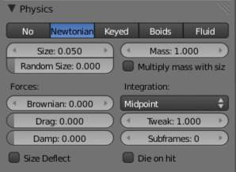

Newtonian Physics Settings.

Brownian 

Specify the amount of Brownian motion. Brownian motion adds random motion to the particles based on a Brownian noise field. This is nice to simulate small, random wind forces. 

Drag 

A force that reduces particle velocity in relation to it’s speed and size (useful in order to simulate Air-Drag or Water-Drag). 

Damp 

Reduces particle velocity (deceleration, friction, dampening). 

Collision
---------

Size Deflect 

Use the particle size in deflections. 

Die on Hit 

Kill particle when it hits a deflector object. 

Integration
-----------

Integrators are a set of mathematical methods available to calculate the movement of particles. The following guidelines will help to choose a proper integrator, according to the behavior aimed at by the animator.

Euler 

Also known as “Forward Euler”. Simplest integrator. Very fast but also with less exact results. If no dampening is used, particles get more and more energy over time. For example, bouncing particles will bounce higher and higher each time. Should not be confused with “Backward Euler” (not implemented) which has the opposite feature, energies decrease over time, even with no dampening. Use this integrator for short simulations or simulations with a lot of dampening where speedy calculations is more important than accuracy. 

Varlet 

Very fast and stable integrator, energy is conserved over time with very little numerical dissipation. 

Midpoint 

Also known as “2nd order Runge-Kutta”. Slower than Euler but much more stable. If the acceleration is constant (no drag for example), it is energy conservative. It should be noted that in example of the bouncing particles, the particles might bounce higher than they started once in a while, but this is not a trend. This integrator is a generally good integrator for use in most cases. 

RK4 

Short for “4th order Runge-Kutta”. Similar to Midpoint but slower and in most cases more accurate. It is energy conservative even if the acceleration is not constant. Only needed in complex simulations where Midpoint is found not to be accurate enough. 

Frame Settings
--------------

Timestep 

The simulation time step per frame. 

Subframes 

Subframes to simulate for improved stability and finer granularity in simulations. Use higher values for faster moving particles. 

Keyed Particles
===============

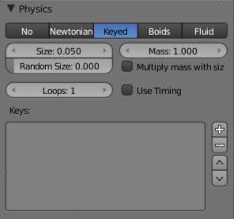

Keyed Physics Settings.

The particle paths of keyed particles are determined from the emitter to another particle system’s particles. This allows creation of chains of systems with keyed physics to create long strands or groovy moving particles. Basically the particles have no dynamics but are interpolated from one system to the next at drawtime.

Setup
-----

To setup Keyed particles you need at least two particle systems.

The first system has keyed physics, and it needs the option First activated. This will be the system thats is visible.

- The second system may be another keyed system but without the option First, 

or a normal particle system. This second system is the target of the keyed system.

Loops 

Sets the number of times the keys are looped. Disabled if **Use Timing** is enabled. 

Keys
----

Key Targets 

	You have to enter the name of the object which bears the target system and if there are multiple particle systems the number of the system.

	Click the Plus to add a key, then select the object.

If you use only one keyed system the particles will travel in their lifetime from the emitter to the target. A shorter lifetime means faster movement. If you have more than one keyed system in a chain, the lifetime will be split equally. This may lead to varying particle speeds between the targets.

Timing
------

Use Timing 

Timing works together with the Time slider for the other keyed systems in a chain. The Time slider allows to define a fraction of particle lifetime for particle movement. 

An example: let’s assume that you have two keyed systems in a chain and a third system as target. The particle lifetime of the first system shall be 50 keys. The particles will travel in 25 frames from the first keyed system to the second, and in further 25 frames from the second system to the target. If you use the Timed button for the first system, the Time slider appears in the second systems panel. It’s default value is 0.5, so the time is equally split between the systems. If you set Time to 1, the movement from the first system to the second will get all the lifetime (the particles will die at the second system).

If you set Time to 0 the particles will start at the second system and travel to the target.

Boids
=====

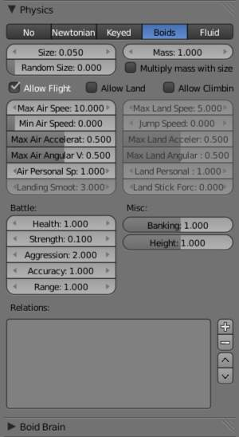

Boid Physics Settings.

Boids particle systems can be set to follow basic rules and behaviors. They are useful for simulating flocks, swarms, herds and schools of various kind of animals, insects and fishes. They can react on the presence of other objects and on the members of their own system. Boids can handle only a certain amount of information, therefore the sequence of the Behaviour settings is very important. In certain situations only the first three parameter are evaluated.

To view the subpanel to the right, add a **Particle System** of type **Emitter** and look in the middle area of the **Particle System** tab.

Physics
-------

Boids try to avoid objects with activated Deflection. They try to reach objects with positive Spherical fields, and fly from objects with negative Spherical fields. The objects have to share one common layer to have effect. It is not necessary to render this common layer, so you may use invisible influences.

Boids can different physics depending on whether they are in the air, or on land (on collision object)

Allow Flight 

Allow boids to move in the air. 

Allow Land 

Allow boids to move on land. 

Allow Climbing 

Allow boids to climb goal objects. 

Max Air Speed 

Set the Maximum velocity in the air. 

Min Air Speed 

Set the Minimum velocity in the air. 

Max Air Acceleration 

Lateral acceleration in air, percent of max velocity (turn). Defines how fast a boid is able to change direction. 

Max Air Angular Velocity 

Tangential acceleration in air, percent 180 degrees. Defines how much the boid can suddenly accelerate in order to fulfill a rule. 

Air Personal Space 

Radius of boids personal space in air. Percentage of particle size. 

Landing Smoothness 

How smoothly the boids land. 

Max Land Speed 

Set the Maximum velocity on land. 

Jump Speed 

Maximum speed for jumping 

Max Land Acceleration 

Lateral acceleration on land, percent of max velocity (turn). Defines how fast a boid is able to change direction. 

Max Land Angular Velocity 

Tangential acceleration on land, percent 180 degrees. Defines how much the boid can suddenly accelerate in order to fulfill a rule. 

Land Personal Space 

Radius of boids personal space on land. Percentage of particle size. 

Land Stick Force 

How strong a force must be to start effecting a boid on land. 

Banking 

Amount of rotation around velocity vector on turns. Banking of (1.0 == natural banking). 

Pitch 

Amount of rotation around side vector. 

Height 

Boid height relative to particle size. 

Battle
------

Health 

Initial boid health when born. 

Strength 

Maximum caused damage per second on attack. 

Aggression 

Boid will fight this times stronger than enemy. 

Accuracy 

Accuracy of attack. 

Range 

Maximum distance of which a boid can attack. 

Alliance
--------

The relations box allows you to set up other particle systems to react with the boids. Setting the type to **Enemy** will cause the systems to fight with each other. **Friend** will make the systems work together. **Neutral** will not cause them to align or fight with each other.

Deflectors and Effectors
------------------------

As mentioned before, very much like Newtonian particles, Boids will react to the surrounding deflectors and fields, according to the needs of the animator:

Deflection: Boids will try to avoid deflector objects according to the Collision rule’s weight. It works best for convex surfaces (some work needed for concave surfaces). For boid physics, Spherical fields define the way the objects having the field are seen by others. So a negative Spherical field (on an object or a particle system) will be a predator to all other boids particle systems, and a positive field will be a goal to all other boids particle systems.

When you select an object with a particle system set on, you have in the Fields tab a little menu stating if the field should apply to the emitter object or to the particle system. You have to select the particle system name if you want prey particles to flew away from predator particles.

Spherical fields: These effectors could be predators (negative Strength) that boids try to avoid or targets (positive Strength) that boids try to reach according to the (respectively) Avoid and Goal rules’ weights. Spherical’s effective Strength is multiplied by the actual relevant weight (e.g. if either Strength or Goal is null, then a flock of boids won’t track a positive Spherical field). You can also activate Die on hit (Extras panel) so that a prey particle simply disappears when “attacked” by a predator particle which reaches it. To make this work, the predator particles have to have a spherical field with negative force, it is not sufficient just to set a positive goal for the prey particles (but you may set the predators force strength to -0.01). The size of the predators and the prey can be set with the Size button in the Extras panel.

Boid Brain
----------

The Boid Brain panel controls how the boids particles will react with each other. The boids’ behavior is controlled by a list of rules. Only a certain amount of information in the list can be evaluated. If the memory capacity is exceeded, the remaining rules are ignored.

The rules are by default parsed from top-list to bottom-list (thus giving explicit priorities), and the order can be modified using the little arrows buttons on the right side.

The list of rules available are:

Goal 

	Seek goal (objects with Spherical fields and positive Strength)

	Predict 

	Predict target’s movements 

Avoid 

	Avoid “predators” (objects with Spherical fields and negative Strength)

	Predict 

	Predict target’s movements 

	Fear Factor 

	Avoid object if danger from it is above this threshold 

Avoid Collision 

	Avoid objects with activated Deflection

	Boids 

	Avoid collision with other boids 

	Deflectors 

	Avoid collision with deflector objects 

	Look Ahead 

	Time to look ahead in seconds 

Separate 

Boids move away from each other 

Flock 

Copy movements of neighboring boids, but avoid each other 

Follow Leader 

	Follows a leader object instead of a boid

	Distance 

	Distance behind leader to follow 

	Line 

	Follow the leader in a line 

Average Speed 

	Maintain average velocity.

	Speed 

	Percentage of maximum speed 

	Wander 

	How fast velocity’s direction is randomized 

	Level 

	How much velocity’s Z component is kept constant 

Fight 

	Move toward nearby boids

	Fight Distance 

	Attack boids at a maximum of this distance 

	Flee Distance 

	Flee to this distance 

Rule Evaluation
---------------

There are three ways control how rules are evaluated.

Average 

All rules are averaged. 

Random 

A random rule is selected for each boid. 

Fuzzy 

Uses fuzzy logic to evaluate rules. Rules are gone through top to bottom. Only the first rule that effect above fuzziness threshold is evaluated. The value should be considered how hard the boid will try to respect a given rule (a value of 1.000 means the Boid will always stick to it, a value of 0.000 means it will never). If the boid meets more than one conflicting condition at the same time, it will try to fulfill all the rules according to the respective weight of each. 

Please note that a given boid will try as much as it can to comply to each of the rules he is given, but it is more than likely that some rule will take precedence on other in some cases. For example, in order to avoid a predator, a boid could probably “forget” about Collision, Crowd and Center rules, meaning that “while panicked” it could well run into obstacles, for example, even if instructed not to, most of the time.

As a final note, the Collision algorithm is still not perfect and in research progress, so you can expect wrong behaviors at some occasion. It is worked on.

Fluid Physics
=============

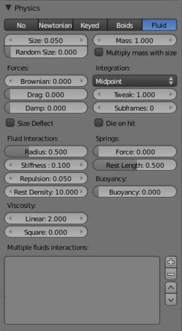

Fluid Physics Settings.

Fluid simulations are widely used in CG, and a very desired feature of any particle system, fluid particles are similar to newtonian ones but this time particles are influenced by internal forces like pressure, surface tension, viscosity, springs, etc. Bforartists particle fluids use the SPH techniques to solve the particles fluid equations.

Smoothed-particle hydrodynamics (SPH) is a computational method used for simulating fluid flows. It has been used in many fields of research, including astrophysics, ballistics, vulcanology, and oceanography. It is a mesh-free Lagrangian method (where the co-ordinates move with the fluid), and the resolution of the method can easily be adjusted with respect to variables such as the density.

From liquids to slime, goo to sand and wispy smoke the possibilities are endless.

Settings
--------

Fluid physics share options with **Newtonian Physics**. These are covered on that page.

Fluid Properties
----------------

Stiffness 

How incompressible the fluid is. 

Viscosity 

Linear viscosity. Use lower viscosity for thicker fluids. 

Buoyancy 

Artificial buoyancy force in negative gravity direction based on pressure differences inside the fluid. 

Advanced
--------

Repulsion Factor 

How strongly the fluid tries to keep from clustering (factor of stiffness). Check box sets repulsion as a factor of stiffness. 

Stiff Viscosity 

Creates viscosity for expanding fluid. Check box sets this to be a factor of normal viscosity. 

Interaction Radius 

Fluid’s interaction radius. Check box sets this to be a factor of 4\*particle size. 

Rest Density 

Density of fluid when at rest. Check box sets this to be a factor of default density. 

Springs
-------

Force 

Spring force 

Rest Length 

Rest length of springs. Factor of particle radius. Check box sets this to be a factor of 2\*particle size. 

Viscoelastic Springs 

Use viscoelastic springs instead of Hooke’s springs. 

Elastic Limit 

How much the spring has to be stretched/compressed in order to change its rest length 

Plasticity 

How much the spring rest length can change after the elastic limit is crossed. 

Initial Rest Length 

Use initial length as spring rest length instead of 2\*particle size. 

Frames 

Create springs for this number of frames since particle’s birth (0 is always). 

Particle Visualization
======================

With the items in the **Display** and **Render** panel you can set the way the particles will be rendered or depicted in the view ports in various ways. Some option are valid only for the 3D window, the particles then are rendered always as **Halos**. Some of the options will be rendered as shown in the 3D window.

Viewport Display
----------------

The Display Panel controls how particles are displayed in the 3d viewport. This does not necessarily determine how they will appear when rendered.

None 

The particles are not shown in the 3D window and are not rendered. The emitter may be rendered though. 

Point 

Particles are displayed as square points. Their size is independent of the distance from the camera. 

Circle 

Particles are displayed as circles that face the view. Their size is independent of the distance from the camera. 

Cross 

Particles are displayed as 6-point crosses that align to the rotation of the particles. Their size is independent of the distance from the camera. 

Axis 

Particles are displayed as 3-point axes. This useful if you want to see the orientation and rotation of particles in the view port. Increase the **Draw Size** until you can clearly distinguish the axis. 

Particles visualized like Point, Circle, Cross and Axis don’t have any special options, but can be very useful when you have multiple particle systems at play, if you don’t want to confuse particles of one system from another (e.g. in simulations using **Boids** physics).

Display 

Specifies the percentage of all particles to show in the viewport (all particles are still rendered). 

Draw Size 

Specifies how large (in pixels) the particles are drawn in the viewport (0 = default). 

Size 

Draw the size of the particles with a circle. 

Velocity 

Draw the velocity of the particles with a line that points in the direction of motion, and length relative to speed. 

Number 

Draw the id-numbers of the particles in the order of emission. 

Color
-----

The Color Menu allows you to draw particles according to certain particle properties.

None 

Particles are black. 

Material 

Particles are colored according to the material they are given. 

Velocity 

Color particles according to their speed. The color is a ramp from blue to green to red, Blue being the slowest, and Red being velocities approaching the value of **Max** or above. Increasing **Max** allows for a wider range of particle velocities. 

Acceleration 

Color particles according to their acceleration. 

Render Settings
---------------

The Render Panel controls how particles appear when they are rendered.

Material Index 

Set which of the object’s material is used to shade the particles. 

Parent 

Use a different object’s coordinates to determine the birth of particles. 

Emitter 

When disabled, the emitter is no longer rendered. Activate the button **Emitter** to also render the mesh. 

Parents 

Render also parent particles if child particles are used. Children have a lot of different deformation options, so the straight parents would stand between their curly children. So by default **Parents** are not rendered if you activate **Children**.. See **Children**

Unborn 

Render particles before they are born. 

Died 

Render particles after they have died. This is very useful if particles die in a collision (**Die on hit**), so you can cover objects with particles. 

None
----

When set to **None** particles are not rendered. This is useful if you are using the particles to duplicate objects.

Halo
----

Halo particles are rendered as **Halo Type Materials**.

Trail Count 

Set the number of trail particles. When greater than 1, additional options appear. 

Length in Frames 

Path timing is in absolute frames. 

Length 

End time of drawn path. 

Random 

Give path lengths a random variation. 

Line
----

The Line visualization mode creates (more or less thin) polygon lines with the strand renderer in the direction of particles velocities. The thickness of the line is set with the parameter **Start** of the **Strands** shader (**Material** sub-context, **Links and Pipeline** panel).

Back 

Set the length of the particle’s tail. 

Front 

Set the length of the particle’s head. 

Speed 

Multiply the line length by particles’ speed. The faster, the longer the line. 

Trail Count 

See description in Halo. 

Path
----

The **Path** visualization needs a **Hair** particle system or **Keyed** particles.

Strand render 

[Keypointstrands] Use the strand primitive for rendering. Very fast and effective renderer. 

Adaptive render 

Tries to remove unnecessary geometry from the paths before rendering particle strands in order to make the render faster and easier on memory. 

Angle 

How many degrees path has to curve to produce another render segment (straight parts of paths need fewer segments). 

Pixel 

How many pixels path has to cover to produce another render segment (very short hair or long hair viewed from far away need fewer parts). (only for Adaptive render). 

B-Spline 

Interpolate hair using B-Splines. This may be an option for you if you want to use low **Render** values. You loose a bit of control but gain smoother paths. 

Steps 

Set the number of subdivisions of the rendered paths (the value is a power of 2). You should set this value carefully, because if you increase the render value by two you need four times more memory to render. Also the rendering is faster if you use low render values (sometimes drastically). But how low you can go with this value depends on the waviness of the hair.(the value is a power of 2). This means 0 steps give 1 subdivision, 1 give 2 subdivisions, 2–>4, 3–>8, 4–>16, ... **n**-->2**n**. 

Timing Options
--------------

Absolute Path Time 

Path timing is in absolute frames. 

Start 

Start time of the drawn path. 

End 

End time of the drawn path. 

Random 

Give the path length a random variation. 

Please see also the manual page about **Strands** for an in depth description.

Object
------

In the Object visualization mode the specified object (**Dupli Object:** field) is duplicated in place of each particle. The duplicated object has to be at the center of the coordinate system, or it will get an offset to the particle.

Global 

Use object’s global coordinates for duplication. 

Size 

Size of the objects 

Random Size 

Give the objects a random size variation. 

Group
-----

In the Group visualization mode, the objects that belong to the group (**GR:** field) are duplicated sequentially in the place of the particles.

WholeGroup 

Use the whole group at once, instead of one of its elements, the group being displayed in place of each particle. 

Use Count 

Use objects multiple times in the same groups. Specify the order and number of times to repeat each object with the list box that appears. You can duplicate an object in the list with the Plus button, or remove a duplicate with the Minus button. 

Use Global 

Use object’s global coordinates for duplication. 

Pick Random 

The objects in the group are selected in a random order, and only one object is displayed in place of a particle. Please note that this mechanism fully replaces old Bforartists particles system using parentage and DupliVerts to replace particles with actual geometry. This method is fully deprecated and doesn’t work anymore. 

Size 

Size of the objects 

Random Size 

Give the objects a random size variation. 

Billboard
---------

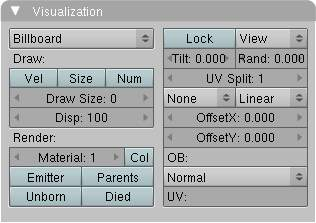

**Billboards** are aligned square planes. They are aligned to the camera by default, but you can choose another object that they should be aligned to.

If you move a billboard around it’s target, it always faces the center of it’s target. The size of a billboard is set with the parameter **Size** of the particle (in Bforartists Units). You can use them e.g. for Sprites, or to replace **Halo** visualization. Everything that can be done with a halo can also be done with a billboard. But billboards are real objects, they are seen by raytracing, they appear behind transparent objects, they may have an arbitrary form and receive light and shadows. They are a bit more difficult to set up and take more render time and resources.

Texturing billboards (including animated textures with alpha) is done by using uv coordinates that are generated automatically for them so they can take an arbitrary shape. This works well for animations, because the alignment of the billboards can be dynamic. The textures can be animated in several ways:

- Depending on the particle lifetime (relative time). 
- Depending on the particle starting time. 
- Depending on the frame (absolute time). 

You can use different sections of an image texture:

- Depending on the lifetime of the billboard. 
- Depending on the emission time. 
- Depending on align or tilt. 

Since you use normal materials for the billboard you have all freedoms in mixing textures to your liking. The material itself is animated in absolute time.

The main thing to understand is that if the object doesn’t have any **UV Layers**, you need to create at least one in the objects **Editing** context, for any of these to work. Moreover, the texture has to be set to UV coordinates in the **Map Input** panel. If you want to see examples for some of the animation possibilities, see the Billboard Animation Tutorial.

An interesting alternative to billboards are in certain cases strands, because you can animate the shape of the strands. Because this visualization type has so much options it is explained in greater detail below.

You can limit the movement with these options. How the axis is prealigned at emission time.

View 

No prealignement, normal orientation to the target. 

X / Y / Z 

Along the global X/Y/Z-axis respectively. 

Velocity 

Along the speed vector of the particle. 

Lock 

Locks the align axis, keeps this orientation, the billboard aligns only along one axis to it’s target 

Billboard Object 

The target object that the billboards are facing. By default, the active camera is used. 

Tilt Angle 

Rotation angle of the billboards planes. A tilt of 1 rotates by 180 degrees (turns the billboard upside down). 

Random 

Random variation of tilt. 

Offset X 

Offset the billboard horizontally in relation to the particle center, this does not move the texture. 

Offset Y 

Offset the billboard vertically in relation to the particle center. 

UV Channels 

Billboards are just square polygons. To texture them in different ways we have to have a way to set what textures we want for the billboards and how we want them to be mapped to the squares. These can then be set in the texture mapping buttons to set wanted textures for different coordinates. You may use three different UV layers and get three different sets of UV coordinates, which can then be applied to different (or the same) textures. 

Billboard Normal UV 

Coordinates are the same for every billboard, and just place the image straight on the square. 

Billboard Time-Index (X-Y) 

Coordinates actually define single points in the texture plane with the x-axis as time and y-axis as the particle index. For example using a horizontal blend texture mapped to color from white to black will give us particles that start off as white and gradually change to black during their lifetime. On the other hand a vertical blend texture mapped to color from white to black will make the first particle to be white and the last particle to be black with the particles in between a shade of gray. 

The animation of the UV textures is a bit tricky. The UV texture is split into rows and columns (N times N). The texture should be square. You have to use **UV Split** in the UV channel and fill in the name of the UV layer. This generated UV coordinates for this layer.

Split UV’s 

The amount of rows/columns in the texture to be used. Coordinates are a single part of the **UV Split** grid, which is a n?n grid over the whole texture. What the part is used for each particle and at what time is determined by the **Offset** and **Animate** controls. These can be used to make each billboard unique or to use an “animated” texture for them by having each frame of the animation in a grid in a big image. 

Billboard Split UV 

Set the name of the **UV layer** to use with billboards (you can use a different one for each **UV Channel**). By default, it is the active UV layer (check the **Mesh** panel in the **Editing** context. 

Animate 

	Dropdown menu, indicating how the split UVs could be animated (changing from particle to particle with time):

	None 

	No animation occurs on the particle itself, the billboard uses one section of the texture in it’s lifetime. 

	Age 

	The sections of the texture are gone through sequentially in particles’ lifetimes. 

	Angle 

	Change the section based on the angle of rotation around the **Align to** axis, if **View** is used the change is based on the amount of tilt. 

	Frame 

	The section is changes according to the frame. 

Offset 

	Specifies how to choose the first part (of all the parts in the n×n grid in the texture defined by the **UV Split** number) for all particles.

	None 

	All particles start from the first part. 

	Linear 

	First particle will start from the first part and the last particle will start from the last part, the particles in between will get a part assigned linearly from the first to the last part. 

	Random 

	Give a random starting part for every particle. 

Trail Count 

See the description in Halo. 

Cache
=====

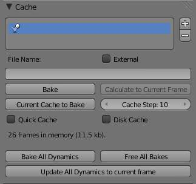

Particles Cache Settings.

**Emitter** systems use a unified system for caching and baking (together with softbody and cloth). The results of the simulation are automatically cached to disk when the animation is played, so that the next time it runs, it can play again quickly by reading in the results from the disk. If you **Bake** the simulation the cache is protected and you will be asked when you’re trying to change a setting that will make a recalculating necessary.

.. Tip:: Beware of the ``Start`` and ``End`` Settings

Caching
-------

- As animation is played, each physics system writes each frame to disk, between the simulation start and end frames. These files are stored in folders with prefix blendcache, next to the .blend file. Note that for the cache to fill up, one has to start playback before or on the frame that the simulation starts. 
- The cache is cleared automatically on changes - but not on all changes, so it may be necessary to free it manually e.g. if you change a force field. 
- If it is impossible to write in the subdirectory there will be no caching. 
- The cache can be freed per physics system with a button in the panels, or with the Ctrl-B shortcut key to free it for all selected objects. 
- If the file path to the cache is longer than what is possible with your operating system (more than 250 characters for example), strange things might happen. 

Baking
------

- The system is protected against changes after baking. 
- The **Bake** result is cleared also for all selected objects by click on **Free Bake** for a singular particle system. 
- If the mesh changes the simulation is not calculated anew. 
- Sorry: no bake editing for particles like for softbodies and clothes. 

Two notes at the end:

- For renderfarms, it is best to bake all the physics systems, and then copy the blendcache to the renderfarm as well. 
- Be careful with the sequence of modifiers in the modifier stack (as always). You may have a different number of faces in the 3D window and for rendering (e.g. when using subdivision surface), if so, the rendered result may be very different from what you see in the 3D window. 

Hair
====

When set to hair mode, particle system creates only static particles, which may be used for hair, fur, grass and the like.

Particle hair systems example. Used for the grass and fur.

Growing
-------

The first step is to create the hair, specifying the amount of hair strands and their lengths.

The complete path of the particles is calculated in advance. So everything a particle does a hair may do also. A hair is as long as the particle path would be for a particle with a lifetime of 100 frames. Instead of rendering every frame of the particle animation point by point there are calculated control points with an interpolation, the segments.

Styling
-------

The next step is to style the hair. You can change the look of base hairs by changing the **Physics Settings**.

A more advanced way of changing the hair appearance is to use **Children**. This adds child hairs to the original ones, and has settings for giving them different types of shapes.

You can also interactively style hairs in **Particle Mode**. In this mode, the particle settings become disabled, and you can comb, trim, lengthen, etc. the hair curves.

Animating
---------

Hair can now be made dynamic using the cloth solver. This is covered in the **Hair Dynamics** page.

Rendering
---------

Bforartists can render hairs in several different ways. Materials have a Strand section, which is covered in the materials section in the **Strands Page**.

Hair can also be used as a basis for the **Particle Instance modifier**, which allows you to have a mesh be deformed along the curves, which is useful for thicker strands, or things like grass, or feathers, which may have a more specific look.

Options
-------

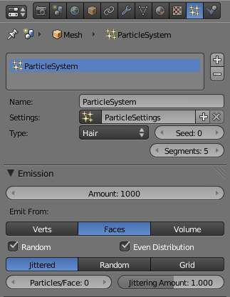

Hair particle system settings

Regrow 

Regrow Hair for each frame. 

Advanced 

Enables advanced settings which reflect the same ones as working in Emitter mode. 

Emission
--------

Amount 

Set the amount of hair strands. Use as little particles as possible, especially if you plan to use softbody animation later. But you need enough particles to have good control. For a “normal” haircut I found some thousand (very roughly 2000) particles to give enough control. You may need a lot more particles if you plan to cover a body with fur. Volume will be produced later with **Children**. 

Hair Dynamics
-------------

Settings for adding movement to hair see **Hair Dynamics**.

Display
-------

Rendered 

Draw hair as curves. 

Path 

Draw just the end points if the hairs. 

Steps 

The number of segments (control points minus 1) of the hair strand. In between the control points the segments are interpolated. The number of control points is important: 

- for the softbody animation, because the control points are animated like vertices, so more control points mean longer calculation times.
- for the interactive editing, because you can only move the control points (but you may recalculate the number of control points in **Particle** Mode).
- 10 Segments should be sufficient even for very long hair, 5 Segments are enough for shorter hair, and 2 or 3 segments should be enough for short fur.

Children
--------

See **Children**.

Render
------

Hair can be rendered as a Path, Object, or Group. See **Particle Visualization** for descriptions.

.. Tip:: See also

Hair Dynamics
=============

Hair particles can now be made dynamic using Cloth physics.

To enable hair physics, click the check box beside **Hair Dynamics**.

Material
--------

Stiffness 

Controls how stiff the root of the hair strands are. 

Mass 

Controls the mass of the cloth material. 

Bending 

Controls the amount of bend along the hairs. Higher values cause less bending. 

Internal Friction 

Amount of friction between individual hairs. 

Collider Friction 

Amount of friction between hairs and external collision objects. 

Damping
-------

Spring 

Damping of cloth velocity. (higher = more smooth, less jiggling). 

Air 

Air has normally some thickness which slows falling things down. 

Quality
-------

Steps 

Quality of the simulation in steps per frame. (higher is better quality but slower). 

Simulation
----------

..TODO

.. list-table::

	* - Warning

	* - If you use motion blur in your animation, you will need to bake one extra frame past the last frame which you will be rendering.

Children
========

**Children** are **Hair** and **Keyed** particles assigned subparticles. They make it possible to work primarily with a relatively low amount of Parent particles, for whom the physics are calculated. The children are then aligned to their parents. Without recalculating the physics the number and visualization of the children can be changed.

- Children can be emitted from particles or from faces (with some different options). Emission from **Faces** has some advantages, especially the distribution is more even on each face (which makes it better suitable for fur and the like). However, children from particles follow their parents better, e.g. if you have a softbody animation and don’t want the hair to penetrate the emitting mesh. But see also our manual page about **Hair**. 
- If you turn on children the parents are no longer rendered (which makes sense because the shape of the children may be quite different from that of their parents). If you want to see the parents additionally turn on the **Parents** button in the **Visualization** panel. 
- Children carry the same material as their parents and are colored according to the exact place from where they are emitted (so all children may have different color or other attributes). 

The possible options depend from the type of particle system, and if you work with **Children from faces** or **Children from particles**. We don’t show every possible combination, only the settings for a **Hair** particle system.

Settings
--------

Simple 

Children are emitted from the parent hairs. 

Interpolated 

Children are emitted between the **Parent** particles on the faces of a mesh. They interpolate between adjacent parents. This is especially useful for fur, because you can achieve an even distribution. Some of the children can become virtual parents, which are influencing other particles nearby. 

Display 

The number of children in the 3D window. 

Render 

The number of children to be rendered (up to 10.000). 

For Simple Mode 

	Size 

	Only for **Emitter**. A multiplier for children size. 

	Random 

	Random variation to the size of child particles. 

Interpolated Mode 

	Seed 

	Offset the random number table for child particles, to get a different result. 

	Virtual 

	Relative amount of virtual parents. 

	Long Hair 

	Calculate children that suit long hair well. 

Effects
-------

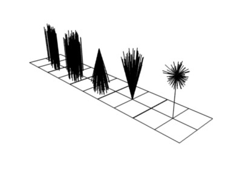

From left to right: Round: 0.0 / Round: 1.0 / Clump: 1.0 / Clump: -1.0 / Shape: -0.99.

Clump 

Clumping. The children may meet at their tip (1.0) or start together at their root (-1.0). 

Shape 

Form of **Clump**. Either inverse parabolic (0.99) or exponentially (-0.99). 

Length 

Length of child paths 

Threshold 

Amount of particles left untouched by child path length 

Radius 

The radius in which the children are distributed around their parents. This is 3D, so children may be emitted higher or lower than their parents. 

Roundness 

The roundness of the children around their parents. Either in a sphere (1.0) or in-plane (0.0). 

Seed 

Offset in the random number table for child particles, to get a different randomized result 

Roughness
---------

Uniform, Size 

It is based on children location so it varies the paths in a similar way when the children are near. 

Endpoint, Shape 

“Rough End” randomizes path ends (a bit like random negative clumping). Shape may be varied from <1 (parabolic) to 10.0 (hyperbolic). 

Random, Size, Threshold 

It is based on a random vector so it’s not the same for nearby children. The threshold can be specified to apply this to only a part of children. This is useful for creating a few stray children that won’t do what others do. 

Kink
----

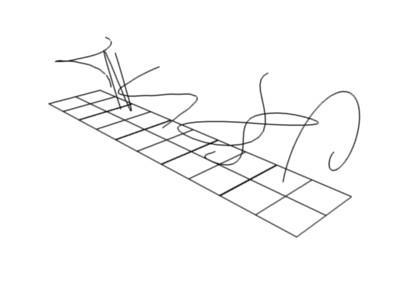

Child particles with Kink. From left to right: Curl / Radial / Wave / Braid / Roll.

With **Kink** you can rotate the children around the parent. See above picture for the different types of **Kink**.

Curl 

Children grow in a spiral around the parent hairs. 

Radial 

Children form around the parent a wave shape that passes through the parent hair. 

Wave 

Children form a wave, all in the same direction. 

Braid 

Children braid themselves around the parent hair. 

Amplitude 

The amplitude of the offset. 

Clump 

How much clump effects kink amplitude. 

Flatness 

How flat the hairs are. 

Frequency 

The frequency of the offset (1/total length). The higher the frequency the more rotations are done. 

Shape 

Where the rotation starts (offset of rotation). 

Vertex Groups
=============

The Vertexgroups panel allows you to specify vertex groups to use for several child particle settings. You can also negate the effect of each vertex group with the check boxes. You can affect the following attributes:

- Density 
- Length 
- Clump 
- Kink 
- Roughness 1 
- Roughness 2 
- Roughness End 

Examples
--------

Particle Mode
=============

Using **Particle Mode** you can edit the key-points (key-frames) and paths of **Baked****Hair**, **Particle**, **Cloth**, and **Soft Body** simulations. (You can also edit and style hair before baking).

Since working in particle mode is pretty easy and very similar to working with vertices in the 3D window, we will show how to set up a particle system and then give a reference of the various functions.

Usage
-----

Ways to use Particle Mode
-------------------------

.. Tip:: Only Frames Baked to Memory are Editable!

If you cannot edit the particles, check that you are not baking to a **Disk Cache**.

**Setup for Hair Particles**

- Create a **Hair** particle system - With your object selected, click the **Particle System** icon in the Properties panel. Create a new particle system by clicking the **Plus**. 
- Give it an initial velocity in the **Normal** direction (first check the **Advanced** box, then modify the **Velocity** sub-panel), or adjust the **Hair Length**. 
- Create a simulation - Place the camera at a good position (pop-up > View > Cameras > Active Camera 
- Check the **Hair Dynamics** box. Select pop-up > Render > Render OpenGL Animation in **Render Engine** mode. 

Editing hair strands in Particle Mode

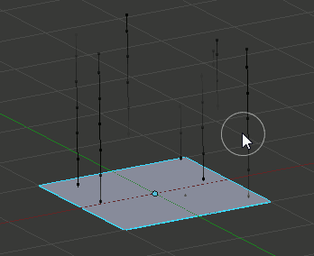

Editing a baked particle simulation’s particle paths in Particle Mode

**Setup for Particle, Cloth, and Soft Body Simulations**

- Use **Emitter** particles, or a cloth/soft-body simulation 
- Create a simulation - set up objects and or emitters, set your time range (use a small range if you are just starting out and experimenting), set up the simulation how you want it, using Alt-A to preview it. 

**Bake the Simulation**

- Once you are happy with the general simulation, **bake** the simulation from object mode. The simulation must be baked to enable editing. (remember to bake to memory, a disk cache will not be editable in **Particle Mode**) 

**Edit the Simulation**

- Switch to **Particle Edit** from the **Mode dropdown menu** in the bottom menu bar of the **3D View** to edit the particle’s paths/key-frames. You may need to press T from within the 3D viewport to see the **Particle Edit** panel. Move to the frame you want to edit and use the various **Particle Edit** tools to edit your simulation. Work slowly, previewing your changes and save often so that you can go back to the previous version should something happen, or that you do not like the latest changes you have made. 

To be able to clearly see what you are working on:

- Turn on the **Particle Edit Properties** (**PEP**) panel
- Select **Point select mode**

in the header of the 3D window. This will display key points along the particle path.

Using Particle Mode
-------------------

Selecting Points
----------------

You may use the **Select** Menu.

.. Tip:: Selections

.. Tip:: Beware of Undo!

Moving keypoints or particles
-----------------------------

- To move selected keypoints use one of the various other methods to grab vertices. 
- To move a particle root you have to turn off **Keep****Root** in the **Tool Bar**. 
- You can do many of the things like with vertices, including scaling, rotating and removing (complete particles or single keys). 
- You may not duplicate or extrude keys or particles, but you can subdivide particles which adds new keypoints
- Alternatively you can rekey a particle and choose the number of keys. 

How smoothly the hair and particle paths are displayed depends on the **Path Steps** setting in the **Tool Bar**. Low settings produce blocky interpolation between points, while high settings produce a smooth curve.

Mirroring particles
-------------------

- If you want to create an X-Axis symmetrical haircut you have to do following steps: - Select all particles with A. - Mirror the particles- Turn on **X-Axis Mirror Editing** in the **Particle** menu. 

It may happen that after mirroring two particles occupy nearly the same place. Since this would be a waste of memory and rendertime, you can **Remove doubles** fromthe **Particle** menu.

Hiding/Unhiding
---------------

Hiding and unhiding of particles works similar as with vertices in the 3D window. The particle in fact doesn’t vanish, only the key points.

Hidden particles (i.e. particles whose keypoints are hidden) don’t react on the various brushes. But:

If you use **Mirror Editing** even particles with hidden keypoints may be moved, if their mirrored counterpart is moved.

Select Modes
------------

Path 

No keypoints are visible, you can select/deselect only all particles. 

Point 

You see all of the keypoints. 

Tip 

You can see and edit (including the brushes) only the tip of the particles, i.e. the last keypoint. 

Brush
-----

With the buttons you can select the type of “Comb” utility you want to use. Below the brush types, their settings appear:

Common Options: 

	Radius 

	Set the radius if the brush. 

	Strength 

	Set the strength of the brush effect (not for Add brush). 

	Add/Sub Grow/Shrink 

	Sets the brush to add the effect or reverse it.. 

None 

No special tool, just edit the keypoints as “normal” vertices. 

Comb 

Moves the keypoints (similar to “proportional editing”). 

Smooth 

Parallels visually adjacent segments. 

Add 

	Adds new particles.

	Count 

	The number of new particles per step. 

	Interpolate 

	Interpolate the shape of new hairs from existing ones. 

	Steps 

	Amount of brush steps 

	Keys 

	How many keys to make new particles with. 

Length 

Scales the segments, so it makes the hair longer(**Grow**) or shorter(**Shrink**). 

Puff 

	Rotates the hair around it’s first keypoint (root). So it makes the hair stand up (**Add**) or lay down (**Sub**).

	Puff Volume 

	Apply puff to unselected end-points, (helps maintain hair volume when puffing root) 

Cut 

Scales the segments until the last keypoint reaches the brush. 

Weight 

This is especially useful for softbody animations, because the weight defines the softbody **Goal**. A keypoint with a weight of 1 won’t move at all, a keypoint with a weight of 0 subjects fully to softbody animation. This value is scaled by the **GMin** - **GMax** range of softbody goals... 

Options
-------

Deflect Emitter, Dist 

Don’t move keypoints through the emitting mesh. **Dist** is the distance to keep from the Emitter. 

Keep 

	Length 

	Keep the length of the segments between the keypoints when combing or smoothing the hair. This is done by moving all the other keypoints. 

	Root 

	Keep first key unmodified, so you can’t transplant hair. 

X Mirror 

Enable mirror editing across the local x axis. 

Draw 

	Path Steps 

	Drawing steps, sets the smoothness of the drawn path. 

	Show Children 

	Draws the children of the particles too. This allows to fine tune the particles and see their effects on the result, but it may slow down your system if you have many children. 

