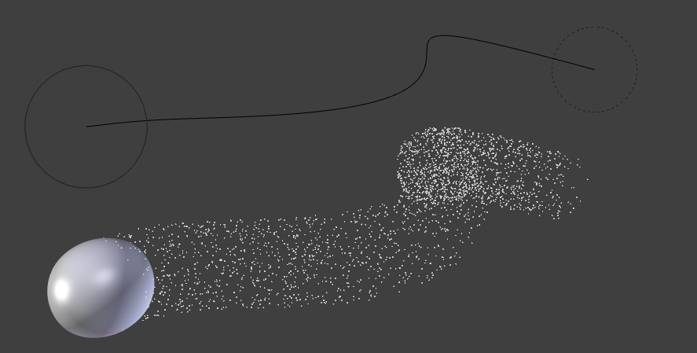
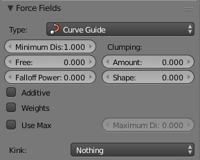
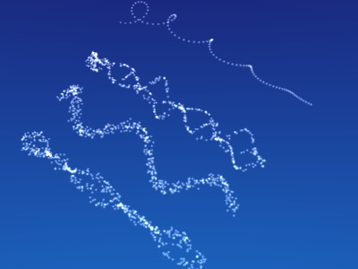
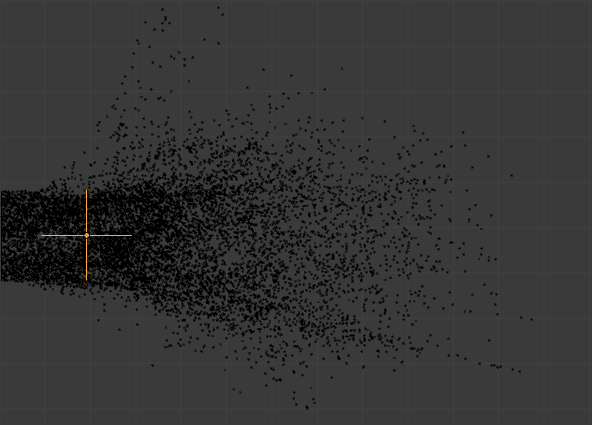

*************************************************************
25.14.1  Editors - Properties Editor - Physics - Force Fields
*************************************************************

.. contents:: Contents

Force Fields
============

Force Fields offer a way to add extra movement to dynamic systems. **Particles**, **Soft Bodies**, Rigid Bodies and **Cloth objects** can all be affected by forces fields. Force Fields automatically affect everything. To remove a simulation or particle system from their influence, simply turn down the influence of that type of Force Field in its Field Weights panel.

- All types of objects and particles can generate fields, but only curve object can bear **Curve Guides** fields. 
- Force Fields can also be generated from particles. See **Particle Physics**
- The objects need to share at least one common layer to have effect. 

You may limit the effect on particles to a group of objects (see the **Particle Physics** page).

Creating a Force Field
----------------------

Reference
=========

To create a single Force Field, you can select Add > Force Field and select the desired force field. This method creates an Empty with the force field attached.

To create a field from an existing object you have to select the object and change to the **Physics** sub-context. Select the field type in the **Fields** menu.

The fields have many options in common, these common options are explained for the **Spherical** field.

.. Note:: After changing the fields (``Fields`` panel) or deflection (``Collision`` panel) settings, you have to recalculate the particle, softbody or cloth system (``Free Cache``), this is not done automatically. You can clear the cache for all selected objects with ``Free cache selected``.

Common Field Settings
---------------------

Most Fields have the same settings, even though they act very differently. Settings unique to a field type are described below. Curve Guide and Texture Fields have very different options.

Shape 

The field is either a **Point**, with omnidirectional influence, or a **Plane**, constant in the XY-plane, changes only in Z direction. 

Strength 

The strength of the field effect. This can be positive or negative to change the direction that the force operates in. A force field’s strength is scaled with the force object’s scale, allowing you to scale up and down scene, keeping the same effects. 

Flow 

Convert effector force into air flow velocity. 

Noise 

Adds noise to the strength of the force. 

Seed 

Changes the seed of the random noise. 

Effect Point 

You can toggle the field’s effect on particle **Location** and **Rotation**

Collision Absorption 

Force gets absorbed by collision objects. 

Falloff
-------

Here you can specify the shape of the force field (if the **Fall-off** Power is greater than 0).

Sphere 

Falloff is uniform in all directions, as in a sphere. 

Tube 

Fall off results in a tube shaped force field. The Field’s **Radial falloff** can be adjusted, as well as the **Minimum** and **Maximum** distances of the field. 

Cone 

Fall off results in a cone shaped force field. Additional options are the same as those of **Tube** options. 

Z Direction 

**Fall-off** can be set to apply only in the direction of the positive Z Axis, negative Z Axis, or both. 

Power (Power) 

How the power of the force field changes with the distance from the force field. If r is the distance from the center of the object, the force changes with 1/rPower. A **Fall-off** of 2 changes the force field with 1/r2, which is the falloff of gravitational pull. 

Max Distance 

Makes the force field only take effect within a specified maximum radius (shown by an additional circle around the object). 

Min Distance 

The distance from the object center, up to where the force field is effective with full strength. If you have a **Fall-off** of 0 this parameter does nothing, because the field is effective with full strength up to **Max Dist** (or the infinity). Shown by an additional circle around the object. 

Types
=====

- Force 
- Wind 
- Vortex Field 
- Magnetic 
- Harmonic 
- Charge 
- Lennard Jones 
- Texture Field
- Curve Guide
- Boid 
- Turbulence 
- Drag 
- Smoke Flow 

Force
=====

The **Force** field is the simplest of the fields. It gives a constant force towards (positive strength) or away from (negative strength) the object’s center. Newtonian particles are attracted to a field with negative strength, and are blown away from a field with positive strength.

For **Boids** a field with positive strength can be used as a **Goal**, a field with negative strength can be used as **Predator**. Whether **Boids** seek or fly goals/predators depends on the **Physics** settings of the Boids.

Image 2b: Spherical field indicator.

Wind
====

Image 3a: Wind field indicator.

Wind gives a constant force in a single direction, along the force object’s local Z axis. The strength of the force is visualized by the spacing of the circles shown.

Vortex Field
============

Image 3b: Vortex field indicator.

Vortex fields give a spiraling force that twists the direction of points around the force object’s local Z axis. This can be useful for making a swirling sink, or tornado, or kinks in particle hair.

Magnetic
========

This field depends on the speed of the particles. It simulates the force of magnetism on magnetized objects.

Harmonic
========

The source of the force field is the zero point of a harmonic oscillator (spring, pendulum). If you set the **Damping** parameter to 1, the movement is stopped in the moment the object is reached. This force field is really special if you assign it to particles.

Rest Length 

Controls the rest length of the harmonic force. 

Multiple Springs 

Causes every point to be affected by multiple springs. 

Normally every particle of the field system influences every particle of the target system. Not with **Harmonic** ! Here every target particle is assigned to a field particle. So particles will move to the place of other particles, thus forming shapes. Tutorial: Particles forming Shapes

Charge
======

It is similar to spherical field except it changes behavior (attract/repulse) based on the effected particles charge field (negative/positive), like real particles with a charge. This mean this field has only effect on particles that have also a **Charge** field (else, they have no “charge”, and hence are unaffected)!

Lennard Jones
=============

This field is a very short range force with a behavior determined by the sizes of the effector and effected particle. At a distance smaller than the combined sizes the field is very repulsive and after that distance it’s attractive. It tries to keep the particles at an equilibrium distance from each other. Particles need to be at a close proximity to each other to be effected by this field at all.

Particles can have for example both a charge and a Lennard-Jones potential - which is probably something for the nuclear physicists amongst us.

Texture Field
=============

You can use a texture force field to create an arbitrarily complicated force field, which force in the 3 directions is color coded. Red is coding for the x-axis, green for the y-axis and blue for the z-axis (like the color of the coordinate axes in the 3D window). A value of 0.5 means no force, a value larger than 0.5 acceleration in negative axis direction (like -Z), a value smaller than 0.5 acceleration in positive axis direction (like +Z).

Texture mode 

	This sets the way a force vector is derived from the texture.

	RGB 

	Uses the color components directly as the force vector components in the color encoded directions. You need an RGB texture for this, e.g. an image or a colorband. So a **Blend** texture without a colorband would not suffice. 

	Gradient 

	Calculates the force vector as the 3d-gradient of the intensity (grayscale) of the texture. The gradient vector always points to the direction of increasing brightness. 

	Curl 

	Calculates the force vector from the curl of the 3d-rgb texture (rotation of rgb vectors). This also works only with a color texture. It can be used for example to create a nice looking turbulence force with a color clouds texture with perlin noise. 

Nabla 

It is the offset used to calculate the partial derivatives needed for **Gradient** and **Curl** texture modes. 

Use Object Coordinates 

Uses the emitter object coordinates (and rotation & scale) as the texture space the particles use. Allows for moving force fields, that have their coordinates bound to the location coordinates of an object. 

Root Texture Coordinates 

This is useful for hair as it uses the texture force calculated for the particle root position for all parts of the hair strand. 

2D 

The **2D** button disregards the particles z-coordinate and only uses particles x&y as the texture coordinates. 

Remember that only procedural texture are truly 3D.

Examples
--------

- A single colored texture 0.5/0.0/0.5 creates a force in the direction of the positive y-axis, e.g. hair is orientated to the y-axis. 
- A blend texture with colorband can be used to created a force “plane”. E.g. on the left side 0.5/0.5/0.5, on the right side 1.0/0.5/0.5 you have a force plane perpendicular to XY (i.e. parallel to Z). If you use an object for the coordinates, you can use the object to push particles around. 
- An animated wood texture can be used to create a wave like motion. 

Curve Guide
===========

The **Curve Guild** is used to force particles to follow a certain path defined by a **Curve Object**.

Example of Curve Guide.

A typical scenario would be to move a red blood cell inside a vein, or to animate the particle flow in a motor. You can use **Curve Guide** s also to shape certain hair strands.

.. Note:: You can also use the ``Particle Mode`` to define a path.

Since you can animate curves as Softbody or any other usual way, you may build very complex animations while keeping great control and keeping the simulation time to a minimum.

The option **Curve Follow** does not work for particles. Instead you have to set **Angular Velocity** (in the **Physics** panel of the **Particle** sub-context) to **Spin** and leave the rotation constant (i.e. don’t turn on **Dynamic**).

**Curve Guide** s affect all particles on the same layer, independently from their distance to the curve. If you have several guides in a layer, their fields add up to each other (the way you may have learned it in your physics course). But you can limit their influence radius by changing there **Minimum Distance** (see below).

.. Note:: The Curve Guide does not effect ``Softbodys``.

Options
-------

Curve Guide Settings.

Minimum Distance 

The distance from the curve, up to where the force field is effective with full strength. If you have a **Fall-off** of 0 this parameter does nothing, because the field is effective with full strength up to **MaxDist** (or the infinity). **MinDist** is shown with a circle at the endpoints of the curve in the 3D window. 

Free 

Fraction of particle life time, that is not used for the curve. 

Fall-off 

This setting governs the strength of the guide between **MinDist** and **MaxDist**. A **Fall-off** of 1 means a linear progression. 

A particle follows a **Curve Guide** during it’s lifetime, the velocity depends from it’s lifetime and the length of the path.

Additive 

If you use **Additive**, the speed of the particles is also evaluated depending on the **Fall-off**. 

Weights 

Use Curve weights to influence the particle influence along the curve. 

Maximum Distance / Use Max 

The maximum influence radius. Shown by an additional circle around the curve object. 

The other settings govern the form of the force field along the curve.

Clumping Amount 

The particles come together at the end of the curve (1) or they drift apart (-1). 

Shape 

Defines the form in which the particles come together. +0.99: the particles meet at the end of the curve. 0: linear progression along the curve. -0.99: the particles meet at the beginning of the curve. 

Kink 

	Changes the shape that the particles can take:

	Curl 

	The radius of the influence depends on the distance of the curve to the emitter. 

	Radial 

	A three dimensional, standing wave. 

	Wave 

	A two dimensional, standing wave. 

	Braid 

	Braid. 

	Roll 

	A one dimensional, standing wave. 

It is not so easy to describe the resulting shapes, so have a look at the example below.

Kink options of a curve guide. From left to right: Radial, Wave, Braid, Roll. Animation

Frequency 

The frequency of the offset. 

Shape 

Adjust the offset to the beginning/end. 

Amplitude 

The Amplitude of the offset. 

Boid
====

Boid probably comes from theoretical works. **Boids** is an artificial life program, developed by Craig Reynolds in 1986, which simulates the flocking behaviour of birds. His paper on this topic was published in 1987 in the proceedings of the ACM SIGGRAPH conference. The name refers to a “bird-like object”, but its pronunciation evokes that of “bird” in a stereotypical New York accent. As with most artificial life simulations, Boids is an example of emergent behavior; that is, the complexity of Boids arises from the interaction of individual agents (the boids, in this case) adhering to a set of simple rules. The rules applied in the simplest Boids world are as follows: separation: steer to avoid crowding local flockmates alignment: steer towards the average heading of local flockmates cohesion: steer to move toward the average position (center of mass) of local flockmates More complex rules can be added, such as obstacle avoidance and goal seeking.

Turbulence
==========

Creates a random & chaotic 3d noise effect, similar to jets of water or geysers under the ocean.

Turbulence force field affecting a particle system.

Size 

Indicates the scale of the noise. 

Global 

Makes the size and strength of the noise relative to the world, instead of the object it is attached to. 

Drag
====

Drag is a force that works to resist particle motion by slowing it down.

Linear 

Drag component proportional to velocity. 

Quadratic 

Drag component proportional to the square of the velocity. 

Smoke Flow
==========

Todo.

