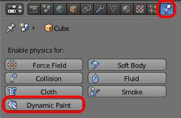

**************************************************************
25.14.4  Editors - Properties Editor - Physics - Dynamic Paint
**************************************************************

.. contents:: Contents

Dynamic Paint
=============

Dynamic paint is a new modifier and physics system that can turn objects into paint canvases and brushes, creating vertex colors, image sequences or displacement. This makes many effects possible that were previously difficult to achieve, for example footsteps in the snow, raindrops that make the ground wet, paint that sticks to walls, or objects that gradually freeze.

This guide explains the very basics of Dynamic Paint user interface and general features.

How to activate the Dynamic Paint

Activating the modifier
-----------------------

Dynamic Paint can be activated from the “Physics” tab of the “Properties” editor.

Types
-----

Modifier itself has two different types:

**Canvas**

Makes object receive paint from Dynamic Paint brushes. 

**Brush**

Makes object apply paint on the canvas. 

.. Note:: You can also enable brush and canvas simultaneously. In that case same object’s “brush” doesn’t influence it’s “canvas”, but can still interact with other objects in the scene.

See also
--------

- A step-by step introduction 
- A detailed guide that covers every setting with images and examples (Currently not up-to-date) 

Dynamic Paint Brush
===================

Main Panel
----------

Brush main panel

From the first brush panel you can define how brush affects canvas color surfaces.

Absolute Alpha 

This setting limits brush alpha influence. Without it, brush is “added” on surface over and over again each frame, increasing alpha and therefore influence of brush on canvas. In many cases however, it’s preferred to not increase brush alpha if it already is on brushes level. 

Erase Paint 

Makes brush dissolve exiting paint instead of adding it. 

Wetness 

Defines how “wet” new paint is. Wetness is visible on “Paint” surface “wetmap”. Speed of “Drip” and “Spread” effects also depends on how wet the paint is. 

Use object material 

	When enabled, you can define a material to be used as brush color. This includes material’s base color and all textures linked to it, eventually matching the rendered diffuse color. This setting is only available when using “Bforartists Internal” renderer at the moment.

	Otherwise you can define a color for the brush from the color box below.

Alpha 

Defines brush alpha or visibility. Final wetness is also affected by alpha. 

Source Panel
------------

Brush source panel

Brush “Source” setting lets you define how brush influence/intersection is defined.

There are currently five brush behavior types to choose from, each having individual settings for further tweaking:

Brush Source - Volume

Mesh Volume 

This the default option. Brush affects all surface point inside the mesh volume. 

.. list-table::

	* - 	  - 
Proximity 

	Only uses defined distance to the closest point on brush mesh surface. Note that inside of the volume is not necessarily affected because it’s not close to the surface.

	Proximity falloff type can be “Smooth”, “Sharp” or tweaked with a color ramp.

Project 

Projects brush to the canvas from a defined direction. Basically this can be considered as “direction aligned” proximity. 

.. list-table::

	* - 	  - 
	* - 	  - 
Mesh Volume + Proximity 

Same as volume type, but also has influence over defined distance. Same falloff types as for “Proximity” type are available. 

Inner Proximity 

Applies proximity inside the mesh volume. 

Negate Volume 

Negates brush alpha within mesh volume. 

Brush Source - Object Center

Object Center 

Instead of calculating proximity to the brush object mesh, which can be quite slow in some cases, only distance to only center is calculated. This is much faster and often good enough. 

Brush Source - Particle System

Particle System 

Brush influence is defined by particles from a selected particle system. 

Velocity Panel
--------------

Velocity panel

This panel shows brush options that are based on object velocity.

On top you have a color ramp and several related settings. Basically the color ramp represents brush velocity values: left side being zero velocity and right side being the “Max velocity”. Speed is measured in “Bforartists units per frame”.

Tick boxes above can be used to define color ramp influence.

Multiply Alpha 

Uses color ramp’s alpha value depending on current velocity and multiplies brush alpha with it. 

Replace Color 

Replaces the brush color with the ramp color. 

Multiply Depth 

Multiplies brushes “depth intersection” effect. Basically you can adjust displace and wave strength depending on brush speed. 

Smudge settings 

	Enabling Smudge makes the brush “smudge” (or “smear”) existing colors on the surface as it moves. The strength of this effect can be defined from the “Smudge Strength” property.

	Even when smudge is enabled brush still does it’s normal paint effect. If you want a purely smudging brush use zero alpha. It’s also possible to have “Erase” option enabled together with smudge.

Waves Panel
-----------

Brush Waves panel

This panel is used to adjust brush influence to “Wave” surfaces.

You can use “Wave Type” menu to select what effect this brush has on the wave simulation. Below are two settings for further adjustments.

Factor 

Adjusts how strongly brush “depth” affects the simulation. You can also use negative values to make brush pull water up instead of down. 

Clamp Waves 

In some cases the brush goes very deep inside the surface messing whole simulation up. You can use this setting to “limit” influence to only certain depth. 

There are four “Wave Type” options available:

Depth Change 

	This option makes brush create waves when the intersection depth with the surface is **changed** on that point. If the brush remains still it won’t have influence.

	Using a negative “Factor” with this type can create a nice looking “wake” for moving objects like ships.

Obstacle 

Constantly affects surface whenever intersecting. Waves are also reflected off this brush type. However, due the nature of wave simulation algorithm this type creates an unnatural “dent” in the surface if brush remains still. 

Force 

Directly affects the velocity of wave motion. Therefore the effect isn’t one to one with brush intersection depth, yet the force strength depends on it. 

Reflect Only 

This type has no visible effect on the surface alone but reflects waves that are already on the surface. 

Dynamic Paint Canvas
====================

Main Panel
----------

Canvas main panel

The first panel of canvas contains the list of Dynamic Paint surfaces. These surfaces are basically layers of paint, that work independently from each other. You can define individual settings for them and bake them separately.

If surface type/format allows previewing results in 3D-viewport, an eye icon is visible to toggle preview.

The checkbox toggles whether surface is active at all. If not selected, no calculations or previews are done.

You can also give each surface an unique name to easily identify them.

Below you can set surface type and adjust quality and timing settings.

Each surface has a certain format and type. Format determines how data is stored and outputted. Currently there are two formats available:

- Image Sequences. Dynamic Paint generates UV wrapped image files of defined resolution as output. 
- Vertex. Dynamic Paint operates directly on mesh vertex data. Results are stored by point cache and can be displayed in viewports. However, using vertex level also requires a highly subdivided mesh to work. 

From quality settings you can adjust image resolution (for image sequences) and anti-aliasing.

Then you can define surface processing start and end frame, and number of used sub-steps. Sub-steps are extra samples between frames, usually required when there is a very fast brush.

Advanced Panel
--------------

Canvas advanced panel

From “Advanced” panel you can adjust surface type and related settings.

Each surface has a “type” that defines what surface is used for. Available types are:

- Paint 
- Displace 
- Waves 
- Weight 

Common options
--------------

For each surface type there are special settings to adjust. Most types have the settings **Dissolve** and **Brush** :

Dissolve 

used to make the surface smoothly return to its original state during a defined time period 

Brush Group 

used to define a specific object group to pick brush objects from 

Paint
-----

Paint Surface

“Paint” is the basic surface type that outputs color and wetness values. In case of vertex surfaces results are outputted as vertex colors.

Wetmap is a black-and-white output that visualizes paint wetness. White being maximum wetness, black being completely dry. It is usually used as mask for rendering. Some “paint effects” affect wet paint only.

Displace
--------

Displace Surface

This type of surface outputs intersection depth from brush objects.

.. Tip:: If the displace output seems too rough it usually helps to add a “Smooth” modifier after Dynamic Paint in the modifier stack.

Waves
-----

Waves Surface

This surface type produces simulated wave motion. Like displace, wave surface also uses brush intersection depth to define brush strength.

You can use following settings to adjust the motion:

Open Borders 

Allows waves to pass through mesh “edges” instead of reflecting from them. 

Timescale 

Directly adjusts simulation speed without affecting simulation outcome. Lower values make simulation go slower and otherwise. 

Speed 

Affects how fast waves travel on the surface. This setting is also corresponds to the size of the simulation. Half the speed equals surface double as large. 

Damping 

Reduces the wave strength over time. Basically adjusts how fast wave disappears. 

Spring 

Adjusts the force that pulls water back to “zero level”. 

.. Tip:: In some cases the wave motion gets very unstable around brush. It usually helps to reduce wave speed, brush “wave factor” or even the resolution of mesh/surface.

Weight
------

Weight Surface

This is a special surface type only available for vertex format. It outputs vertex weight groups that can be used by other Bforartists modifiers and tools.

.. Tip:: It’s usually preferred to use “proximity” based brushes for weight surfaces to allow smooth falloff between weight values.

Output Panel
------------

Canvas output panel

From “Output” panel you can adjust how surface outputs its results.

For “Vertex” format surfaces, you can select a mesh data layer (color / weight depending on surface type) to generate results to. You can use the “+”/”-” icons to add/remove a data layers of given name. If layer with given name isn’t found, it’s shown as red.

For “Image Sequence” surfaces, you can define used “UV Layer” and output file saving directory, filenames and image format.

Effects Panel
-------------

Canvas effects panel

This is a special feature for “Paint” type surface. It generates animated movement on canvas surface.

Effects:

Spread 

Paint slowly spreads to surrounding points eventually filling all connected areas. 

Drip 

Paint moves in specific direction specified by Bforartists force fields, gravity and velocity with user defined influences. 

Shrink 

Painted area slowly shrinks until disappears completely. 

For spread and drip effects, only “wet paint” is affected, so as the paint dries, movement becomes slower until it stops.

Cache Panel
-----------

Canvas cache panel

This panel is currently only visible for “vertex” format surfaces. You can use it to adjust and bake point cache.

