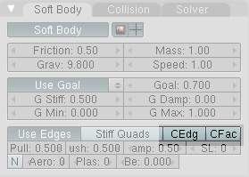
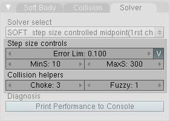

*********************************************************
25.14.5 Editors - Properties Editor - Physics - Soft Body
*********************************************************

.. contents:: Contents

Soft Body
=========

Image 1a: A softbody cloth uncovering a text. Animation - Blend file

A Soft Body in general, is a simulation of a soft or rigid deformable object. In Bforartists, this system is best for simple cloth objects and closed meshes. There is dedicated **Cloth Simulation** physics that use a different solver, and is better for cloth.

This simulation is done by applying forces to the vertices or controlpoints of the object. There are exterior forces like gravity or forcefields and interior forces that hold the vertices together. This way you can simulate the shapes that an object would take on in reality if it had volume, was filled with something, and was acted on by real forces.

Soft Bodies can interact with other objects (**Collision**). They can interact with themselves (**Self Collision**).

The result of the Soft Body simulation can be converted to a static object. You can also **bake edit** the simulation, i.e. edit intermediate results and run the simulation from there.

Typical scenarios for using Soft Bodies
---------------------------------------

Image 1b: A wind cone. The cone is a Soft Body, as the suspension. Animation - Blend file

Soft Bodies are well suited for:

- Elastic objects with or without collision. 
- Flags, fabric reacting to forces. 
- Certain modeling tasks, like a cushion or a table cloth over an object. 
- Bforartists has another simulation system for clothing (see **Clothes**). But you can sometimes use Soft Bodies for certain parts of clothing, like wide sleeves. 
- Hair (as long as you minimize collision). 
- Animation of swinging ropes, chains and the like. 

The following videos may give you some more ideas: http://youtube.com/watch?v=qdusMZlBbQ4, http://de.youtube.com/watch?v=3du8ksOm9Fo

Creating a Soft Body
--------------------

Soft Body simulation works for all objects that have vertices or control points:

- Meshes. 
- Curves. 
- Surfaces. 
- Lattices. 

To activate the Soft Body simulation for an object:

- In the **Properties** window, go to the **Physics** tab (it is all the way on the right, and looks like a bouncing ball). 
- Activate the **Soft Body** button. 

A lot of options appear. For a reference of all the settings see **this page**.

- You start a Soft Body simulation with Play button
- You pause the simulation with Pause button
- You stop the simulation with Esc. 

Simulation Quality
------------------

The settings in the **Soft Body Solver** panel determine the accuracy of the simulation.

Min Step 

Minimum simulation steps per frame. Increase this value, if the Soft Body misses fast moving collision objects. 

Max Step 

Maximum simulation steps per frame. Normally the number of simulation steps is set dynamically (with the **Error Limit**) but you have probably a good reason to change it. 

Auto-Step 

Use Velocities for automatic step sizes. 

Error Limit 

Rules the overall quality of the solution delivered. Default 0.1. The most critical setting that says how precise the solver should check for collisions. Start with a value that is 1/2 the average edge length. If there are visible errors, jitter, or over-exaggerated responses, decrease the value. The solver keeps track of how “bad” it is doing and the **Error Limit** causes the solver to do some “adaptive step sizing”. 

Fuzzy 

Simulation is faster, but less accurate. 

Choke 

Calms down (reduces the exit velocity of) a vertex or edge once it penetrates a collision mesh. 

**Diagnostics**

Print Performance to Console 

Prints on the console how the solver is doing. 

Estimate Matrix 

Estimate matrix. Split to COM , ROT ,SCALE 

Cache and Bake
--------------

Soft Bodies and other physic simulations use a unified system for caching and baking. See **Particle Cache** for reference.

The results of the simulation are automatically cached to disk when the animation is played, so that the next time it runs, it can play again quickly by reading in the results from the disk. If you **Bake** the simulation the cache is protected and you will be asked when you’re trying to change a setting that will make a recalculating necessary.

.. Tip:: Beware of the ``Start`` and ``End`` settings

- Caching:
- Baking:

- - As animation is played, each physics system writes each frame to disk, between the simulation start and end frames. These files are stored in folders with prefix blendcache, next to the .blend file. 
- - The cache is cleared automatically on changes - but not on all changes, so it may be necessary to free it manually, e.g. if you change a force field. Note that for the cache to fill up, one has to start playback before or on the frame that the simulation starts. 
- - If you are not allowed to write to the required sub-directory caching will not take place. 
- - The cache can be freed per physics system with a button in the panels, or with the Ctrl-B shortcut key to free it for all selected objects. 
- - You may run into trouble if your .blend file path is very long and your operating system has a limit on the path length that is supported. 

- - The system is protected against changes after baking. 
- - The **Bake** result is cleared for all selected objects or click on **Free Bake** for the current Soft Body system. 
- - If the mesh changes the simulation is not calculated anew. 

For renderfarms, it is best to bake all the physics systems, and then copy the blendcache to the renderfarm as well.

Interaction in real time
------------------------

To work with a Soft Body simulation you will find it handy to use the **Timeline** window. You can change between frames and the simulation will always be shown in the actual state. The option **Continue Physics** in the **Playback** menu of the **Timeline** window lets you interact in real time with the simulation, e.g. by moving collision objects or shake a Soft Body object. And this is real fun!

You can than select the Soft Body object while running the simulation and **Apply** the modifier in the **Modifiers** panel of the **Editing** context. This makes the deformation permanent.

Tips
----

- Soft Bodies work especially well if the objects have an even vertex distribution. You need enough vertices for good collisions. You change the deformation (the stiffness) if you add more vertices in a certain region (see the animation of **Image 1b**). 
- The calculation of collisions may take a long time. If something is not visible, why calculate it? 
- To speed up the collision calculation it is often useful to collide with an additional, simpler, invisible, somewhat larger object (see the example to **Image 1a**). 
- Use Soft Bodies only where it makes sense. If you try to cover a body mesh with a tight piece of cloth and animate solely with Soft Body, you will have no success. Self collision of Soft Body hair may be activated, but that is a path that you have to wander alone. We will deal with **Collisions** in detail later. 
- Try and use a **Lattice** or a **Curve Guide** Soft Body instead of the object itself. This may be magnitudes faster. 

Exterior Forces
===============

Exterior forces are applied to the vertices (and nearly exclusively to the vertices) of Soft Body objects. This is done using Newtons Laws of Physics:

- If there is no force on a vertex, it stays either unmoved or moves with constant speed in a straight line. 
- The acceleration of a vertex depends on its mass and the force. The heavier the mass of a vertex the slower the acceleration. The larger the force the greater the acceleration. 
- For every action there is an equal and opposite reaction. 

Well, this is done only in the range of computing accurateness, there is always a little damping to avoid overshoot of the calculation.

Example
-------

We will begin with a very simple example - the default cube.

- To judge the effect of the external forces you should at first turn off the **Goal**, so that the vertices are not retracted to their original position. 
- Click Play

What happens? The cube moves in negative Z-direction. Each of it’s eight vertices is affected by a global, constant force - the gravitation. Gravitation without friction is independent from the weight of an object, so each object you would use as a Soft Body here would fall with the same acceleration. The object does not deform, because every vertex moves with the same speed in the same direction.

Settings
--------

Soft Body Panel
---------------

Friction 

The friction of the surrounding medium. The larger the friction, the more viscous is the medium. Friction always appears when a vertex moves relative to it’s surround medium. 

Mass 

Mass value for vertices. Larger mass slows down acceleration, except for gravity where the motion is constant regardless of mass. Larger mass means larger inertia, so also braking a Soft Body is more difficult. 

Mass Vertex Group 

You can paint weight values for an mesh’s mass, and select that vertex group here. 

Speed 

You can control the internal timing of the Softbody system with this value. It sets the correlation between frame rate and tempo of the simulation. A free falling body should cover a distance of about five meters after one second. You can adjust the scale of your scene and your simulation with this correlation. If you render with 25 frames per second and 1 meter shall be 1 BU, you have to set **Speed** to 1.3. 

Force Fields
------------

To create other forces you have to use another object, often **Empty** objects are used for that. You can use some of the forces on Soft Body vertices as on **Particles**. Soft Bodies react only to:

- Spherical 
- Wind 
- Vortex 

Soft bodies do react on **Harmonic** fields, but not in a useful way. So if you use a **Harmonic** field for particles move the Soft body to another layer.

See the section **Force Fields** for details. The force fields are quite strong, a **Spherical** field with a strength of -1.0 has the same effect that gravity has - approximately - a force of 10 Newton.

Aerodynamics
------------

This special exterior force is not applied to the vertices but to the connecting edges. Technically, a force perpendicular to the edge is applied. The force scales with the projection of the relative speed on the edge (dot product). Note that the force is the same if wind is blowing or if you drag the edge through the air with the same speed. That means that an edge moving in its own direction feels no force, and an edge moving perpendicular to its own direction feels maximum force.

Simple 

Edges receive a drag force from surrounding media 

Lift Force 

Edges receive a lift force when passing through surrounding media. 

Factor 

How much aerodynamic force to use. Try a value of 30 at first. 

Using a Goal
------------

A goal is a shape that a soft body object tries to conform to.

You have to confine the movement of vertices in certain parts of the mesh, e.g. to attach a Soft Body object at other objects. This is done with the **Vertex Group** (target). The target position is the original position of the vertex, like it would result from the “normal” animation of an object including **Shape Keys**, **Hooks** and **Armatures**. The vertex tries to reach it’s target position with a certain, adjustable intensity.

Image 2b: Shock absorber description.

Imagine the vertex is connected with it’s target through a spring (**Image 2b**).

Default 

	This parameter defines how strong the influence of this spring is. A strength of 1 means, that the vertex will not move as Soft Body at all, instead keep its original position. 0 **Goal** (or no **Goal**) means, that the vertex moves only according to Soft Body simulation. If no vertex group is used/assigned, this numeric field is the default goal weight for all vertices. If a vertex group is present and assigned, this button instead shows an pop-up selector button that allows you to choose the name of the goal vertex group. If you use a vertex group the weight of a vertex defines its goal.

	Often Weight Paint is used to adjust the weight comfortably. For non-mesh objects the **Weight** parameter of their vertices/controlpoints is used instead (W in **Edit mode**, or use the **Transform Properties** panel). The weight of **Hair** particles can also be painted in **Particle Mode**.

Minimum / Maximum 

When you paint the values in vertex-groups (using **WeightPaint** mode), you can use the **G Min** and **G Max** to fine-tune (clamp) the weight values. The lowest vertex-weight (blue) will become **G Min**, the highest value (red) becomes **G Max** (please note that the blue-red color scale may be altered by User Preferences). 

.. Tip:: For now all is applied to single vertices

Stiffness 

The spring stiffness for Goal. A low value creates very weak springs (more flexible “attachment” to the goal), a high value creates a strong spring (a stiffer “attachment” to the goal). 

Dampimg 

The friction of the spring. With a high value the movement will soon come to an end (little jiggle). 

Interior Forces
===============

Image 1a: Vertices and forces along their connection edges.

To create a connection between the vertices of a Soft Body object there have to be forces that hold the vertices together. These forces are effective along the edges in a mesh, the connections between the vertices. The forces act like a spring. (**Image 1a**) illustrates how a 3×3 grid of vertices (a mesh plane in Bforartists) are connected in a Soft Body simulation.

But two vertices could freely rotate if you don’t create additional edges between them. Have you ever tried building a storage shelf out of 4 planks alone? Well - don’t do it, it will not be stable. The logical method to keep a body from collapsing would be to create additional edges between the vertices. This works pretty well, but would change your mesh topology drastically.

Image 1b: Additional forces with Stiff Quads enabled.

Luckily, Bforartists allows us to define additional **virtual** connections. On one hand we can define virtual connections between the diagonal edges of a quad face (**Stiff Quads**, **Image 1b**), on the other hand we can define virtual connections between a vertex and any vertices connected to it’s neighbors (**Bending Stiffness**). In other words, the amount of bend that is allowed between a vertex and any other vertex that is separated by two edge connections.

Edges Settings
--------------

The characteristics of edges are set with the **Soft Body Edge** properties.

Use Edges 

Allow the edges in a Mesh Object to act like springs. 

Pull 

The spring stiffness for edges (how much the edges are allowed to stretch). A low value means very weak springs (a very elastic material), a high value is a strong spring (a stiffer material) that resists being pulled apart. 0.5 is latex, 0.9 is like a sweater, 0.999 is a highly-starched napkin or leather. The Soft Body simulation tends to get unstable if you use a value of 0.999, so you should lower this value a bit if that happens. 

Push 

How much the Softbody resist being scrunched together, like a compression spring. Low values for fabric, high values for inflated objects and stiff material. 

Damp 

The friction for edge springs. High values (max of 50) dampen the **Push** / **Pull** effect and calm down the cloth. 

Plastic 

Permanent deformation of the object after a collision. The vertices take a new position without applying the modifier. 

Bending 

This option creates virtual connections between a vertex and the vertices connected to it’s neighbors. This includes diagonal edges. Damping also applies to these connections. 

Length 

The edges can shrink or been blown up. This value is given in percent, 0 disables this function. 100% means no change, the body keeps 100% of his size. 

Stiff Quads 

For quad faces, the diagonal edges are used as springs. This stops quad faces to collapse completely on collisions (what they would do otherwise). 

Shear 

Stiffness of the virtual springs created for quad faces. 

Preventing Collapse
-------------------

To show the effect of the different edge settings we will use two cubes (blue: only quads, red: only tris) and let them fall without any goal onto a plane (how to set up collision is shown on the page **Collisions**).

.. list-table::

	* - 	  - 	  - 
In (**Image 3**), the default settings are used (without **Stiff Quads**). The “quad only” cube will collapse completely, the cube composed of tris keeps it’s shape, though it will deform temporarily because of the forces created during collision.

.. list-table::

	* - 	  - 	  - 
In (**Image 4**), **Stiff Quads** is activated (for both cubes). Both cubes keep their shape, there is no difference for the red cube, because it has no quads anyway.

.. list-table::

	* - 	  - 	  - 
The second method to stop an object from collapsing is to change it’s **Bending Stiffness**. This includes the diagonal edges (Damping also applies to these connections).

In (**Image 5**), **Be** is activated with a strength setting of 1. Now both cubes are more rigid.

.. list-table::

	* - 	  - 	  - 
Bending stiffness can also be used if you want to make a subdivided plane more plank like. Without **Be** the faces can freely rotate against each other like hinges (**Image 6b**). There would be no change in the simulation if you activated **Stiff Quads**, because the faces are not deformed at all in this example.

Bending stiffness on the other hand prevents the plane from being - well - bent.

Collisions
==========

There are two different collision types that you may use: collision between different objects and internal collision. We should set one thing straight from the start: the primary targets of the collision calculation are the vertices of a Soft Body. So if you have too few vertices too few collision takes place. Secondarily, you can use edges and faces to improve the collision calculation.

Collisions with other objects
-----------------------------

For a **Soft Body** to collide with another object there are a few prerequisites:

- Both objects have to share a layer, but the layer does not necessarily have to be visible. 
- The collision object has to be a mesh object. 
- You have to activate the option **Collision** in the **Collision** panel of the **Physics** sub-context (**Image 1**) for the collision object. The collision object may also be a Soft Body. 
- If you use modifiers such as **Array** and **Mirror** you have to activate **EV.M.Stack** to ensure that collision calculation is based on the modified object. The sequence of **Modifiers** is not important. 

Examples
--------

.. list-table::

	* - 	  - 	  - 
A cube colliding with a plane works pretty well (**Image 2a**), but a plane falls right through a cube that it is supposed to collide with (**Image 2b**). Why is that? Because the default method of calculation only checks to see if the four vertices of the plane collides with the cube as the plane is pulled down by gravity. You can activate **CFace** to enable collision between the face of the plane and the object instead (**Image 2c**), but this type of calculation takes much longer.

Let’s have a closer look at the collision calculation, so you can get an idea of how we might optimize it.

Calculating Collisions
----------------------

.. list-table::

	* - 	  - 
Soft Body simulation is by default done on a per vertex basis. If the vertices of the Soft Body do not collide with the collision object there will be no interaction between the two objects.

In (**Image 3a**), you can see a vertex colliding with a plane. If a vertex penetrates the zone between **Outer** and **Inner**, it is repulsed by a force in the direction of the face normal. The position that a vertex finally ends up in is dependent on the forces that act upon it. In the example gravity and the repulsion force of the face balance out. The speed at which the vertex is pulled out of the collision zone is influenced by the **Choke** parameter (**Image 4**).

Now lets see what happens if we make vertices heavier and let them travel at a faster speed. In (**Image 3b**), you can see vertices traveling at different speeds. The two on the far right (5 and 6) are traveling so fast that they pass right through the collision zone (this is because of the default solver precision - which we can fix later). You will notice that the fourth vertex also travels quite fast and because it is heavier it breaches the inner zone. The first three vertices collide OK.

Image 3d: Also Edges and Faces can be used for the collision calculation.

You can set up your collision so that edges and even faces are included in the collision calculation (**Image 3d**). The collision is then calculated differently. It is checked whether the edge or face intersects with the collision object, the collision zones are not used.

Good collisions
---------------

Image 4: Parameters for Soft Body calculation.

If the collision you have set up is not behaving properly, you can try the following:

.. Tip:: The best way

- The Soft Body object must have more subdivisions than the collision object. 
- Check the direction of the face normals. 
- If the collision object has sharp spikes they might penetrate the Soft Body. 
- The resolution of the solver must match the speed at which Soft Body vertices are traveling. Lower the parameter **Error Lim** and carefully increase **Min S**. 
- **Outer** and **Inner** should be large enough, but zones of opposite faces should not overlap, or you have forces in opposite directions. 
- If you use strong forces you should use large zones. 
- Set **Choke** to a high enough value (all the way up if necessary) if you have difficulties with repelled vertices. 
- Colliding faces are difficult to control and need long calculation times. Try not to use them. 

Often it is better to create a simplified mesh to use as your collision object, however this may be difficult if you are using an animated mesh.

Self Collision
--------------

**Self Collision** is working only if you have activated **Use Edges**.

When enabled, allows you to control how Bforartists will prevent the Soft Body from intersecting with itself. Every vertex is surrounded with an elastic virtual ball. Vertices may not penetrate the balls of other vertices. If you want a good result you may have to adjust the size of these balls. Normally it works pretty well with the default options.

Ball Size Calculation 

	Man (“manual”) 

	The **Ball Size** directly sets the ball size (in BU). 

	Av (“average”) 

	The average length of all edges attached to the vertex is calculated and then multiplied with the **Ball Size** setting. Works well with evenly distributed vertices. 

	Min / Max 

	The ball size is as large as the smallest/largest spring length of the vertex multiplied with the **Ball Size**. 

	AvMiMax (“average min/max”) 

	Size = ((Min + Max)/2) × **Ball Size**. 

Ball Size 

	Default 0.49 BU or fraction of the length of attached edges. The edge length is computed based on the algorithm you choose. You know how when someone stands too close to you, and feel uncomfortable? We call that our “personal space”, and this setting is the factor that is multiplied by the spring length. It is a spherical distance (radius) within which, if another vertex of the same mesh enters, the vertex starts to deflect in order to avoid a self-collision.

	Set this value to the fractional distance between vertices that you want them to have their own “space”. Too high of a value will include too many vertices all the time and slow down the calculation. Too low of a level will let other vertices get too close and thus possibly intersect because there won’t be enough time to slow them down.

Stiffness 

Default 1.0. How elastic that ball of personal space is. 

Damping 

Default 0.5. How the vertex reacts. A low value just slows down the vertex as it gets too close. A high value repulses it. 

Collisions with other objects are set in the (other) **Collision panel**. To collide with another object they have to share at least one common layer.

Simple examples
===============

some simple examples showing the power of softbody physics.

bouncing cube
-------------

change your start and end frames to 1 and 150.

The timeline

add a plane, and scale it 5 times. next go to the physics tab, and add a collision. the default settings are fine for this example.

now add a cube, or use the default cube. Tab into edit mode and subdivide it thrice. then add a bevel modifier to it, to smoothen the edges. to add a little more, press r twice, and move your cursor a bit.

when finisht, your scene should look like this:

The scene, ready for softbody physics

Everything is ready to add the softbody physics. go to the physics tab and add ‘softbody’. uncheck the soft body goal , and check softbody self collision. under soft body edges, increase the bending to 10.

playing tha animation with alt a will now give a slow animation of a bouncing cube. to speed things up, we need to bake the softbody physics.

Under Soft Body Cache change start and end to your start and end frames. in this case 1 and 150. to test if everything is working, you can take a cache step of 5 or 10, but for the final animation it’s better to reduce it to 1, to cache everything.

when finisht, your physics panel should look like this:

The physics settings.

you can now bake the simulation, give the cube materials and textures and render the animation.

Combination With Armatures
==========================

To Do

Combination With Hair Particles
===============================

To Do

Soft Body settings
==================

Soft Body 

This creates the soft body modifier on the selected object 

Render 

Enable soft body during render 

Display 

Display soft body in real time. 

Soft Body
---------

Friction 

The friction of the surrounding medium. Generally friction dampens a movement. 

Mass 

Mass value for vertices. Larger mass slows down acceleration, except for gravity where the motion is constant regardless of mass. Larger mass means larger inertia, so also braking a Soft Body is more difficult. 

Vertex Group Mass 

Use a specified vertex group for mass values 

Speed 

You can control the internal timing of the Softbody system with this value. 

Soft Body Cache
---------------

.. Note:: Start- and Endframe

Cache 

Select cache to use for simulation. Add, and remove caches. 

Cache Name 

Specify the name of the cache. 

Start / End 

First and last frame of the simulation. Always valid, not only for **baking**. 

Cache Step 

Number of frames between cache steps. 

Disk Cache 

Save cache files to disk. Blend file must be saved first. 

Use Lib Path 

Use this files path when library linked into another file. 

Compression 

	Compression method to be used

	No 

	No compression. 

	Light 

	Fast but not so effective compression. 

	Heavy 

	Effective but slow compression. 

Bake 

Calculates the simulation and protects the cache. You need to be in **Object** mode to bake. 

Free Bake 

Clears the cache. 

Calculate to Frame 

Bake physics to current frame 

Current Cache to Bake 

Bake from Cache. 

Bake All Dynamics 

Bake all physics 

Free All Bakes 

Free all baked caches of all objects in the current scene 

Update All To Frame 

Update cache to current frame 

If you haven’t saved the blend file the cache is created in memory, so save your file first or the cache may be lost.

Soft Body Goal
--------------

Use Goal 

Soft Body Goal acts like a pin on a chosen set of vertices; controlling how much of an effect soft body has on them. Enabling this tells Bforartists to use the position / animated position of a vertex in the simulation. Animating the vertices can be done in all the usual ways before the Soft Body simulation is applied. The **goal** is the desired end-position for vertices. How a softbody tries to achieve this goal can be defined using stiffness forces and damping. 

Default 

A **Goal** value of 1.0 means no Soft Body simulation, the vertex stays at its original (animated) position. When setting **Goal** to 0.0, the object is only influenced by physical laws. By setting goal values between 0.0 and 1.0, you can blend between having the object affected only by the animation system, and having the object affected only by the soft body effect. 

Minimum / Maximum 

When you paint the values in vertex-groups (using **Weight Paint** mode), you can use the **G Min** and **G Max** to fine-tune (clamp) the weight values. The lowest vertex-weight (blue) will become **G Min**, the highest value (red) becomes **G Max** (please note that the blue-red color scale may be altered by User Preferences). 

Stiffness 

The spring stiffness for **Goal**. A low value creates very weak springs (more flexible “attachment” to the goal), a high value creates a strong spring (a stiffer “attachment” to the goal). 

Damping 

The friction for **Goal**. Higher values dampen the effect of the goal on the soft body. 

Vertex Group 

Use a vertex group to allow per-vertex goal weights (multiplied by the **Default** goal). 

Soft Body Edges
---------------

Use Edges 

The edges in a Mesh Object can act as springs as well, like threads in fabric. 

Pull 

The spring stiffness for edges (how much the edges are stretched). A low value means very weak springs (a very elastic material), a high value is a strong spring (a stiffer material) that resists being pulled apart. 0.5 is latex, 0.9 is like a sweater, 0.999 is a highly-starched napkin or leather. 

Push 

How much the Softbody resist being scrunched together, like a compression spring. Low values for fabric, high values for inflated objects and stiff material. 

Damp 

The friction for edge springs. High values (max of 50) dampen the edge stiffness effect and calm down the cloth. 

Plastic 

Plasticity, permanent deformation of the object. 

Bending 

This option creates virtual connections between a vertex and the one after the next. This includes diagonal edges. Damping applies also to these connections. 

Length 

The edges can shrink or been blown up. This value is given in percent, 0 disables this function. 100% means no change, the body keeps 100% of his size. 

Stiff Quads 

For quad faces, the diagonal edges are used as springs. This stops quad faces to collapse completely on collisions (what they would do otherwise). 

Shear 

Stiffness of the virtual springs for quad faces. 

Aerodynamics 

	Simple 

	If you turn on **Aero** the force is not confined to the vertices, but has an effect also on the edges. The angle and the relative speed between medium and edge is used to calculate the force on the edge. This force results that vertices with little connecting edges (front of a plane) fall faster than vertices with more connecting edges (middle of a plane). If all vertices have the same amount of edges in a direction they fall with equal speed. An edge moving in its own direction feels no force, and an edge moving perpendicular to its own direction feels maximum force (think of a straw moving through air). Try it with an **Factor** of 30 at first. 

	Lift Force 

	Use an aerodynamic model that is closer to physical laws and looks more interesting. Disable for a more muted simulation. 

	Factor 

	How much aerodynamic effect to use 

Edge 

Checks for edges of the softbody mesh colliding. 

Face 

Checks for any portion of the face of the softbody mesh colliding (compute intensive!). While **CFace** enabled is great, and solves lots of collision errors, there doesn’t seem to be any dampening settings for it, so parts of the softbody object near a collision mesh tend to “jitter” as they bounce off and fall back, even when there’s no motion of any meshes. Edge collision has dampening, so that can be controlled, but Deflection dampening value on a collision object doesn’t seem to affect the face collision. 

Soft Body Self Collision
------------------------

**Self Collision** is working only if you have activated **Use Edges**.

Self Collision 

When enabled, allows you to control how Bforartists will prevent the Soft Body from intersecting with itself. Every vertex is surrounded with an elastic virtual ball. Vertices may not penetrate the balls of other vertices. If you want a good result you may have to adjust the size of these balls. Normally it works pretty well with the default options. 

Manual 

The **Ball Size** directly sets the ball size (in BU). 

Averavge (“average”) 

The average length of all edges attached to the vertex is calculated and then multiplied with the **Ball Size** setting. Works well with evenly distributed vertices. 

Minimal / Maximal 

The ball size is as large as the smallest/largest spring length of the vertex multiplied with the **Ball Size**. 

AvMiMax 

Size = ((Min + Max)/2) × **Ball Size**. 

Size 

Default 0.49 BU or fraction of the length of attached edges. The edge length is computed based on the algorithm you choose. You know how when someone stands too close to you, and feel uncomfortable? We call that our “personal space”, and this setting is the factor that is multiplied by the spring length. It is a spherical distance (radius) within which, if another vertex of the same mesh enters, the vertex starts to deflect in order to avoid a self-collision. Set this value to the fractional distance between vertices that you want them to have their own “space”. Too high of a value will include too many vertices all the time and slow down the calculation. Too low of a level will let other vertices get too close and thus possibly intersect because there won’t be enough time to slow them down. 

Stiffness 

Default 1.0. How elastic that ball of personal space is. 

Dampening 

Default 0.5. How the vertex reacts. A low value just slows down the vertex as it gets too close. A high value repulses it. 

Collisions with other objects are set in the (other) **Collision panel**. To collide with another object they have to share at least one common layer.

Soft Body Solver
----------------

These settings determine the accurateness of the simulation.

Min Step 

Minimum simulation steps per frame. Increase this value, if the Soft Body misses fast moving collision objects. 

Max Step 

Maximum simulation steps per frame. Normally the number of simulation steps is set dynamically (with the **Error Limit**) but you have probably a good reason to change it. 

Auto-Step 

helps the Solver figure out how much work it needs to do based on how fast things are moving. 

Error Limit 

Rules the overall quality of the solution delivered. Default 0.1. The most critical setting that says how precise the solver should check for collisions. Start with a value that is 1/2 the average edge length. If there are visible errors, jitter, or over-exaggerated responses, decrease the value. The solver keeps track of how “bad” it is doing and the **Error Limit** causes the solver to do some “adaptive step sizing”. 

Fuzzy 

Fuzziness while on collision, high values make collision handling faster but less stable. 

Choke 

Calms down (reduces the exit velocity of) a vertex or edge once it penetrates a collision mesh. 

Print Performance to Console 

Prints on the console how the solver is doing. 

Estimate Matrix 

Estimate matrix... split to COM, ROT, SCALE 

