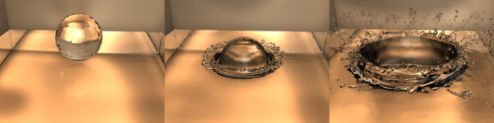

******************************************************
25.14.6  Editors - Properties Editor - Physics - Fluid
******************************************************

.. contents:: Contents

Fluid Simulation
================

Fluid physics are used to simulate physical properties of liquids especially water. While creating a scene in Bforartists, certain objects can be marked to participate in the fluid simulation. These can include but not limited to, being a fluid or as an obstacle. For a fluid simulation you have to have a domain to define the space that the simulation takes up. In the domain settings you will be be able to define the global simulation parameters (such as viscosity and gravity).

.. image:: graphics/25.14.6__Editors_-_Properties_Editor_-_Physics_-_Fluid/10000000000002BC000000AF9C0906029D345B25.png

Example of Fluid Simulation

Workflow
--------

In general, you follow these steps:

- First you want to set the **simulation domain**, 
- Next set the **fluid source(s)**, and specify there physical properties, 
- In some cases you may want to set other objects to **Control the Flow** of the fluid, 
- You can also depending on your scene add other objects related to the fluid, like:
- And lastly you must **Bake the Simulation**. 

- - **Obstacles**, 
- - **Particles** floating on the fluid, 

.. Tip:: Baking is done on the Domain object!

.. See also :: To know more about simulating fluids in Bforartists you can read the ``fluids appendix``. Their you can find the limitations and workarounds, and some additional links.

Fluid Types
===========

Common Options
--------------

Animated Mesh/Export
--------------------

Click this button if the network is animated (eg . Deformed by an armature , shape keys (shape keys) or lattice). It can become very slow and is not necessary if the network is animated IPO position and rotation (ie only object transformations).

Volume Initialization Type
--------------------------

A common option amoung the different fluid types is **Volume Initialization**.

	Volume 

	The inside of the object is initialized as fluid all . This works only if the closed mesh . 

	Shell 

	It is initialized as a thin fluid layer of the surface of the mesh . This can also be used in the mesh open. 

	Both 

	It is a state , such as the sum of the Volume and Shell. This also must be a closed mesh. 

Example of different types of initiation of volume

Fluid Domain
============

The Domain Object
-----------------

The bounding box of the object serves as the boundary of the simulation. **All fluid objects must be in the domain.** Fluid objects outside the domain will not bake. No tiny droplets can move outside this domain; it’s as if the fluid is contained within the 3D space by invisible force fields. There can be only a single fluid simulation domain object in the scene.

**The shape of the object does not matter because it will****always****be treated like a box** (The lengths of the bounding box sides can be different). So, usually there won’t be any reason to use another shape than a box. If you need obstacles or other boundaries than a box to interfere with the fluid flow, you need to insert additional obstacle objects **inside** the domain boundary.

This object will be **replaced** by the fluid during the simulation.

.. Tip:: Baking is done on the Domain object

Options
-------

The fluid simulation options with Domain selected

Bake button 

For baking options, see **Baking**. 

Resolution

	Render resolution 

	The granularity at which the actual fluid simulation is performed. This is probably the most important setting for the simulation as it determines the amount of details in the fluid, the memory and disk usage as well as computational time.

.. list-table::

	* - 	  - 
	Note that the amount of required memory quickly increases: a resolution of 32 requires ca. 4MB, 64 requires ca. 30MB, while 128 already needs more than 230MB. Make sure to set the resolution low enough, depending on how much memory you have, to prevent Bforartists from crashing or freezing. Remember also that many operating systems limit the amount of memory that can be allocated by a single **process**, such as Bforartists, even if the **machine** contains much more than this. Find out what limitations apply to your machine.

.. Note:: Resolution and Real-size of the Domain

Preview resolution

	This is the resolution at which the preview surface meshes will be generated. So it does not influence the actual simulation. Even if “there is nothing to see” in the preview, there might be a thin fluid surface that cannot be resolved in the preview.

Display quality 

	How to display a baked simulation in the 3d view (menu **Viewport Display**) and for rendering (menu **Render Display**):

	Geometry 

	use the original geometry (before simulation). 

	Preview 

	use the preview mesh. 

	Final 

	use the final high definition mesh. 

When no baked data is found, the original mesh will be displayed by default.

	After you have baked a domain, it is displayed (usually) in the Bforartists window as the preview mesh. To see the size and scope of the original domain box, select **Geometry** in the left dropdown.

Time 

	Start 

	It is the simulation start time (in seconds).

	This option makes the simulation computation in Bforartists start later in the simulation. The domain deformations and fluid flow prior to the start time are not saved.

	For example, if you wanted the fluid to appear to already have been flowing for 4 seconds before the actual first frame of data, you would enter 4.0 here.

	End 

	It is the simulation ending time (in seconds). 

.. Tip:: Start and end times have nothing to do with how many frames are baked

Generate Speed Vector 

If this button is clicked, no speed vectors will be exported. So by default, speed vectors are generated and stored on disk. They can be used to compute image based motion blur with the compositing nodes. 

Reverse fluid frames 

The simulation is calculated backward 

**Bake** directory 

For baking options see **Baking**. 

Domain World
------------

The Domain World options.

Viscosity 

	The “thickness” of the fluid and actually the force needed to move an object of a certain surface area through it at a certain speed. You can either enter a value directly or use one of the presets in the drop down (such as honey, oil, or water).

For manual entry, please note that the normal real-world viscosity (the so-called dynamic viscosity) is measured in Pascal-seconds (Pa.s), or in Poise units (P, equal to 0.1 Pa.s, pronounced **pwaz**, from the Frenchman Jean-Louis Poiseuille, who discovered the laws on “the laminar flow of viscous fluids”), and commonly centiPoise units (cP, equal to 0.001 Pa.s, **sentipwaz**). Bforartists, on the other hand, uses the kinematic viscosity (which is dynamic viscosity in Pa.s, divided by the density in kg.m -3, unit m2.s-1). The table below gives some examples of fluids together with their dynamic and kinematic viscosities.

Manual entries are specified by a floating point number and an exponent. These floating point and exponent entry fields (scientific notation) simplify entering very small or large numbers. The viscosity of water at room temperature is 1.002 cP, ou 0.001002 Pa.s; the density of water is about 1000 kg.m -3, which gives us a kinematic viscosity of 0.000001002 m 2.s -1 - so the entry would be 1.002 times 10 to the minus six (1.002?10-6 in scientific notation). Hot Glass and melting iron is a fluid, but very thick; you should enter something like 1.0?100 (= 1.0) as its kinematic viscosity (indicating a value of 1.0?106 cP).

	Note that the simulator is not suitable for non-fluids, such as materials that do not “flow”. Simply setting the viscosity to very large values will not result in rigid body behavior, but might cause instabilities.

.. Note:: Viscosity varies

Bforartists Viscosity Unit Conversion.

.. list-table::

	* - Water (20- C)
	  - 1.002×10 0 (1.002)
	  - 1.002×10 -6 (0.000001002)

	* - Oil SAE 50
	  - 5.0×10 2 (500)
	  - 5.0×10 -5 (0.00005)

	* - Honey (20- C)
	  - 1.0×10 4 (10,000)
	  - 2.0×10 -3 (0.002)

	* - Chocolate Syrup
	  - 3.0×10 4 (30,000)
	  - 3.0×10 -3 (0.003)

	* - Ketchup
	  - 1.0×10 5 (100,000)
	  - 1.0×10 -1 (0.1)

	* - Melting Glass
	  - 1.0×10 15
	  - 1.0×10 0 (1.0)

Realworld-size 

Size of the domain object in the real world in meters. If you want to create a mug of coffee, this might be 10 cm (0.1 meters), while a swimming pool might be 10m. The size set here is for the longest side of the domain bounding box. 

Optimization

	Gridlevel 

	How many adaptive grid levels to be used during simulation - setting this to -1 will perform automatic selection. 

	Compressibility 

	If you have problems with large standing fluid regions at high resolution, it might help to reduce this number (note that this will increase computation times). 

Domain Boundary
---------------

The Domain Boundary panel

This box has all the slip and surface options.

Boundary type 

The stickiness of the surface of the obstacle, to determine the “tacky surface (Surface Adhesion).” In the real world, and the tackiness and fluid, the granularity of the object surface, tack, determined by the elasticity. 

No Slip 

Fluid will stick To snugly (speed 0). 

Free Slip 

Fluid will move on the object (0 normal direction of speed). 

Part Slip 

It is a two intermediate. It is almost Noslip, 1 in the Free exactly the same in 0. 

**Surface**

	Surface Smoothing 

	Amount of smoothing to be applied to the fluid surface. 1.0 is standard, 0 is off, while larger values increase the amount of smoothing. 

	Subdivisions 

	Allows the creation of high-res surface meshes directly during the simulation (as opposed to doing it afterwards like a subdivision modifier). A value of 1 means no subdivision, and each increase results in one further subdivision of each fluid voxel. The resulting meshes thus quickly become large, and can require large amounts of disk space. Be careful in combination with large smoothing values - this can lead to long computation times due to the surface mesh generation. 

**Hide fluid surface**

Domain Particles
----------------

The Domain Particles Panel

Here you can add particles to the fluid simulated, to enhance the visual effect.

Tracer Particles 

Number of tracer particles to be put into the fluid at the beginning of the simulation. To display them create another object with the **Particle** fluid type, explained below, that uses the same bake directory as the domain. 

Generate Particles 

Controls the amount of fluid particles to create (0=off, 1=normal, >1=more). To use it, you have to have a surface subdivision value of at least 2. 

An example of the effect of particles can be seen here - the image to the left was simulated without, and the right one with particles and subdivision enabled.

Fluid Object
============

Fluid object settings

All regions of this object that are inside the domain bounding box will be used as actual fluid in the simulation. If you place more than one fluid object inside the domain, they should currently not intersect. Also make sure the surface normals are pointing outwards. In contrast to domain objects, the actual mesh geometry is used for fluid objects.

Volume Initialization Type 

See Volume Initialization Type 

Animated Mesh/Export 

See Animated Mesh/Export 

Initial velocity 

Speed of the fluid at the beginning of the simulation, in meters per second. 

.. Tip:: The direction of Surface Normals makes a big difference!

Fluid Obstacle
==============

This object will be used as an obstacle in the simulation. As with a fluid object, obstacle objects currently should not intersect. As for fluid objects, the actual mesh geometry is used for obstacles. For objects with a volume, make sure that the normals of the obstacle are calculated correctly, and radiating properly (use the **Flip Normal** button, in **Edit mode**, **Mesh Tools** panel, **Editing** context), particularly when using a spinned container. Applying a **SubSurf Modifier** before baking the simulation could also be a good idea if the mesh is not animated.

Volume Initialization Type 

See Volume Initialization Type 

Boundary type 

	Determines the stickiness of the obstacle surface, called “Surface Adhesion”. Surface Adhesion depends in real-world on the fluid and the graininess or friction/adhesion/absorption qualities of the surface.

	No Slip 

	Causes the fluid to stick to the obstacle (zero velocity). 

	Free Slip 

	Allows movement along the obstacle (only zero normal velocity). 

	Part Slip 

	Mixes both types, with 0 being mostly no slip, and 1 being identical to free slip. 

	Note that if the mesh is moving, it will be treated as no slip automatically.

Example of the different boundary types for a drop falling onto the slanted wall. From left to right: no-slip, part-slip 0.3, part-slip 0.7 and free-slip.

Animated Mesh/Export 

See Animated Mesh/Export 

PartSlip Amount 

Amount of mixing between no- and free-slip, described above. 

Impact Factor 

Amount of fluid volume correction for gain/loss from impacting with moving objects. If this object is not moving, this setting has no effect. However, it if is and the fluid collides with it, a negative value takes volume away from the Domain, and a positive number adds to it. Ranges from -2.0 to 10.0. 

Fluid Inflow / Outflow
======================

To control the volume of the fluid simulation, you can set objects in the scene to add or absorb fluid within the **Fluid Domain**.

Inflow
------

.. image:: graphics/25.14.6__Editors_-_Properties_Editor_-_Physics_-_Fluid/1000020100000136000000B223A4EA8DA1EF5E68.png

Fluid Inflow Settings

Volume Initialization Type 

See Volume Initialization Type 

This object will put fluid into the simulation, like a water tap.

Inflow Velocity 

Speed of the fluid that is created inside of the object. 

Local Coords/Enable 

Use local coordinates for the inflow. This is useful if the inflow object is moving or rotating, as the inflow stream will follow/copy that motion. If disabled, the inflow location and direction do not change. 

Animated Mesh/Export 

See Animated Mesh/Export 

Outflow
-------

Fluid Outflow Settings

Any fluid that enters the region of this object will be deleted (think of a drain or a black hole). This can be useful in combination with an inflow to prevent the whole domain from filling up. When enabled, this is like a tornado (waterspout) or “wet vac” vacuum cleaner, and the part where the fluid disappears will follow the object as it moves around.

Volume Initialization Type 

See Volume Initialization Type 

Animated Mesh/Export 

See Animated Mesh/Export 

Fluid Particle
==============

Fluid particle settings

This type can be used to display particles created during the simulation. For now only tracers swimming along with the fluid are supported. Note that the object can have any shape, position or type - once the particle button is pressed, a particle system with the fluid simulation particles will be created for it at the correct position. When moving the original object, it might be necessary to delete the particle system, disable the fluidsim particles, and enable them again. The fluidsim particles are currently also unaffected by any other particle forces or settings.

Influence 

	Size Influence 

	The particles can have different sizes, if this value is 0 all are forced to be the same size. 

	Alpha Influence 

	If this value is >0, the alpha values of the particles are changed according to their size. 

Particle type 

	Drops 

	Surface splashes of the fluid result in droplets being strewn about, like fresh water, with low Surface Tension. 

	Floats 

	The surface tension of the fluid is higher and the fluid heavier, like cold seawater and soup. Breakaways are clumpier and fall back to the surface faster than **Drops**, as with high Surface Tension. 

	Tracer 

	Droplets follow the surface of the water where it existed, like a fog suspended above previous fluid levels. Use this to see where the fluid level has been. 

Path (bake directory) 

The simulation run from which to load the particles. This should usually have the same value as the fluid domain object 

Fluid Control
=============

Description
-----------

Using the Lattice-boltzman method, the fluid is controlled using particles which define local force fields and are generated automatically from either a physical simulation or a sequence of target shapes. At the same time, as much as possible of the natural fluid motion is preserved.

Examples
--------

In this examples, we use the Fluid Control option to control part of the fluid so that it has a certain shape (the sphere drop or the teapot drop) before it falls in the rest of the fluid:

Falling drop

“Magic Fluid Control”

Options
-------

Fluid control options.

Quality 

Higher quality result in more control particles for the fluid control object. 

Reverse Frames 

The control particle movement gets reversed. 

Time 

You specify the start and end time during which time the fluid control object is active. 

Attraction force 

The attraction force specifies the force which gets emitted by the fluid control object. Positive force results in attraction of the fluid, negative force in avoidance. 

Velocity force 

If the fluid control object moves, the resulting velocity can also introduce a force to the fluid. 

Baking
======

The fluid simulation options with Domain selected

Bake Button
-----------

Perform the actual fluid simulation. Bforartists will continue to work normally, except there will be a status bar in the top of the window, next to the render pulldown. Pressing Esc or the “x” next to the status bar will abort the simulation. Afterwards two .bobj.gz (one for the **Final** quality, one for the **Preview** quality), plus one .bvel.gz (for the **Final** quality) will be in the selected output directory for each frame.

Bake directory
--------------

Directory and file prefix to store baked surface meshes.

This is similar to the animation output settings, only selecting a file is a bit special: when you select any of the previously generated surface meshes (e.g. test1_fluidsurface_final_0132.bobj.gz), the prefix will be automatically set (test1_ in this example). This way the simulation can be done several times with different settings, and allows quick changes between the different sets of surface data.

Notes
-----

Unique domain 

Because of the possibility of spanning and linking between scenes, there can only be one domain in an entire .blend file. 

Selecting a Baked Domain 

After a domain has been baked, it changes to the fluid mesh. To re-select the domain so that you can bake it again after you have made changes, go to any frame and select (RMB) the fluid mesh. Then you can click the **BAKE** button again to recompute the fluid flows inside that domain. 

Baking always starts at Frame #1 

The fluid simulator disregards the **Start** setting in the **Animation** panel, it will always bake from frame 1. If you wish the simulation to start later than frame 1, you must key the fluid objects in your domain to be inactive until the frame you desire to start the simulation. 

Baking always ends at the **End** Frame set in the **Animation** panel 

If your frame-rate is 25 frames per second, and ending time is 4.0 seconds, then you should (if your start time is 0) set your animation to end at frame 4.0 × 25 = 100

Freeing the previous baked solutions 

Deleting the content of the “Bake” directory is a destructive way to achieve this. Be careful if more than one simulation uses the same bake directory (be sure they use different filenames, or they will overwrite one another)! 

Reusing Bakes 

Manually entering (or searching for) a previously saved (baked) computational directory and filename mask will switch the fluid flow and mesh deformation to use that which existed during the old bake. Thus, you can re-use baked flows by simply pointing to them in this field. 

Baking processing time 

	Baking takes a **lot** of compute power (hence time). Depending on the scene, it might be preferable to bake overnight.

	If the mesh has modifiers, the rendering settings are used for exporting the mesh to the fluid solver. Depending on the setting, calculation times and memory use might exponentially increase. For example, when using a moving mesh with **Subsurf** as an obstacle, it might help to decrease simulation time by switching it off, or to a low subdivision level. When the setup/rig is correct, you can always increase settings to yield a more realistic result.

Fluid Appendix
==============

Hints
-----

Some useful hints about fluid simulation in Bforartists:

- Don’t be surprised, but you’ll get whole bunch of mesh (.bobj.gz) files after a simulation. One set for preview, and another for final. Each set has a .gz file for each frame of the animation. Each file contains the simulation result - so you’ll need them.
- Currently these files will not be automatically deleted, so it is a good idea to e.g. create a dedicated directory to keep simulation results. Doing a fluid simulation is similar to clicking the **ANIM** button - you currently have to take care of organizing the fluid surface meshes in some directory yourself. If you want to stop using the fluid simulation, you can simply delete all the \*fluid\*.bobj.gz files.
- Before running a high resolution simulation that might take hours, check the overall timing first by doing lower resolution runs.
- Fluid objects must be completely inside the bounding box of the domain object. If not, baking may not work correctly or at all. Fluid and obstacle objects can be meshes with complex geometries. Very thin objects might not appear in the simulation, if the chosen resolution is too coarse to resolve them (increasing it might solve this problem).
- Don’t try to do a complicated scene all at once. Bforartists has a powerful compositor that you can use to combine multiple animations.
- For example, to produce an animation showing two separate fluid flows while keeping your domain small, render one .avi using the one flow. Then move the domain and render another .avi with the other flow using an alpha channel (in a separate B&W .avi?). Then, composite both .avi’s using the compositor’s add function. A third .avi is usually the smoke and mist and it is laid on top of everything as well. Add a rain sheet on top of the mist and spray and you’ll have quite a storm brewing! And then lightning flashes, trash blowing around, all as separate animations, compositing the total for a truly spectacular result.

Limitations & Workarounds
-------------------------

- If the setup seems to go wrong, make sure all the normals are correct (hence, enter **Edit mode**, select all, and recalculate normals once in a while). 
- Currently there’s a problem with zero gravity simulation - simply select a very small gravity until this is fixed. 
- If an object is initialized as **Volume**, it has to be closed and have an inner side (a plane won’t work). To use planes, switch to **Shell**, or extrude the plane. 
- Bforartists freezes after clicking **BAKE**. Pressing Esc makes it work again after a while - this can happen if the resolution is too high and memory is swapped to hard disk, making everything horribly slow. Reducing the resolution should help in this case. 
- Bforartists crashes after clicking **BAKE** - this can happen if the resolution is really high and more than 2GB are allocated, causing Bforartists to crash. Reduce the resolution. Many operating systems limit the total amount of memory that can be allocated by a **process**, such as Bforartists, even if the **machine** has more memory installed. 
- The meshes should be closed, so if some parts of e.g. a fluid object are not initialized as fluid in the simulation, check that all parts of connected vertices are closed meshes. Unfortunately, the Suzanne (monkey) mesh in Bforartists is not a closed mesh (the eyes are separate). 
- If the fluid simulation exits with an error message (stating e.g. that the “init has failed”), make sure you have valid settings for the domain object, e.g. by resetting them to the defaults. 
- Note that first frame may well take only a few hundred MBs of RAM memory, but latter ones go over one GB, which may be why your bake fails after awhile. If so, try to bake one frame at the middle or end at full res so you’ll see if it works. 
- Memory used doubles when you set surface subdivision from 1 to 2. 
- Using “generate particles” will also add memory requirements, as they increase surface area and complexity. Ordinary fluid-sim generated particles probably eat less memory. 

