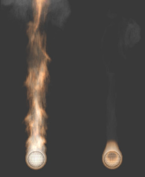

******************************************************
25.14.7  Editors - Properties Editor - Physics - Smoke
******************************************************

.. contents:: Contents

Smoke Simulation
================

Smoke simulation is used to simulate the fluid movement of air and generate animated voxel textures representing the density, heat, and velocity of other fluids or suspended particles (i.e. smoke) which can be used for rendering.

Smoke and fire are emitted into a **Domain** from a mesh object or particle system. Smoke movement is controlled by airflow inside the domain, which can be influenced by **smoke collision objects**. Smoke will also be affected by scene gravity and **force fields**. Airflow inside the domain can affect other physics simulations via the smoke flow force field.

Workflow
--------

At least a **Domain Object** object and one **Flow object** are required to create a smoke simulation. A basic workflow looks like this:

- Create a **Domain Object** that defines the bounds of the simulation volume. 
- Define a **Flow object** or objects which will emit smoke and fire. 
- Set **Collision objects** to make the smoke interact with objects in the scene. 
- Assign a **Volumetric material** to the domain object. 
- Save the .blend. 
- **Bake** the simulation. 

.. Note:: There is a ``Quick Smoke`` operator which will automatically create a domain object with a basic smoke/fire material. It can be found in 3D View > Object > Quick Effects > Quick Smoke, or in the ``Spacebar`` search box.

Technical information
---------------------

Bforartists’s smoke simulation is based on the paper Wavelet Turbulence for Fluid Simulation and associated sample code.

It has been implemented in Bforartists by Daniel Genrich and Miika Hamalainen.

Smoke Domain
============

The domain object contains the entire simulation. Smoke and fire cannot leave the domain, it will either collide with the edge or disappear, depending on the domain’s settings.

Keep in mind that large domains require higher resolutions and longer bake times. You’ll want to make it just large enough that the simulation will fit inside it, but not so large that it takes too long to compute the simulation.

To create a domain, add a cube and transform it until it encloses the area where you want smoke. Translation, rotation, and scaling are all allowed. To turn it into a smoke domain, click **Smoke** in Properties > Physics, then select **Domain** as the **Smoke Type**.

.. Note:: You ``can`` use other shapes of mesh objects as domain objects, but the smoke simulator will use the shape’s bounding box as the domain bounds. In other words, the actual shape of the domain will still be rectangular.

**Smoke Domain** settings.

Settings
--------

Resolution 

	The smoke domain is subdivided into many “cells” called voxels (see voxel) which make up “pixels” of smoke. This setting controls the number of subdivisions in the domain. Higher numbers of subdivisions are one way of creating higher resolution smoke (See Smoke High Resolution)

Since the resolution is defined in terms of **subdivisions**, larger domains will need more divisions to get an equivalent resolution to a small domain.

	Also see Note on Divisions and High Resolution.

Time Scale 

Controls the speed of the simulation. Low values result in a “slow motion” simulation, while higher values can be used to advance the simulation faster (useful for generating smoke for use in still renders). 

Border Collisions 

	Controls which sides of the domain will allow smoke “through” the domain, making it disappear without influencing the rest of the simulation, and which sides will deflect smoke as if colliding with a **Collision Object**.

	Vertically Open 

	Smoke disappears when it hits the top or bottom of the domain, but collides with the walls. 

	Open 

	Smoke disappears when it hits any side of the domain. 

	Collide All 

	Smoke collides with all sides of the domain. 

Density 

	Controls how much smoke is affected by density.

- Values above 0 will cause the smoke to rise (simulating smoke which is lighter than ambient air). 
- Values below 0 will cause smoke to sink (simulating smoke which is heavier than ambient air). 

Temp. Diff. 

	The **Temperature Difference** setting controls how much smoke is affected by temperature.

The effect this setting has on smoke depends on the per flow object \*Temp. Diff.\* setting:

- Values above 0 will result in the smoke rising when the flow object **Temp. Diff.** is set to a positive value, and smoke sinking when the flow object **Temp. Diff.** is set to a negative value. 
- Values below 0 will result in the opposite of positive values, i.e. smoke emitted from flow objects with a positive **Temp. Diff.** will sink, and smoke from flow objects with a negative **Temp. Diff.** will rise. 

	Note that smoke from multiple flow objects with different temperatures will mix and warm up/cool down until an equilibrium is reached.

Vorticity 

	Controls the amount of turbulence in the smoke. Higher values will make lots of small swirls, while lower values make smoother shapes.

	Comparison of different amounts of vorticity. The domain on the left has a vorticity of 3, while the domain on the right has a vorticity of .01.

Dissolve 

Allow smoke to dissipate over time. 

Time 

Speed of smoke’s dissipation in frames. 

Slow 

Dissolve smoke in a logarithmic fashion. Dissolves quickly at first, but lingers longer. 

Smoke Flames
------------

Speed 

How fast fuel burns. Larger values result in smaller flames (fuel burns before it can go very far), smaller values result in larger flames (fuel has time to flow farther before being fully consumed). 

Smoke 

Amount of extra smoke created automatically to simulate burnt fuel. 

Vorticity 

Additional vorticity for flames. 

Ignition 

Minimum temperature of flames. 

Maximum 

Maximum temperature of flames. 

Smoke Color 

Color of smoke created by burnt fuel. 

Smoke Adaptive Domain
---------------------

When enabled, the domain will adaptively shrink to best fit the smoke, saving computation time by leaving voxels without smoke out of the simulation. Unless the **Additional** option is used, the adaptive domain will not exceed the bounds of the original domain.

Additional 

Number of voxels to add around the outside of the domain. 

Margin 

Amount of extra space to leave around smoke, measured in voxels. With very fast moving smoke larger margins may be required to prevent the smoke from being cut off by the adaptive boundary, but note this will increase the number of voxels which need to be computed. 

Threshold 

Smallest amount of smoke a voxel can contain before it’s considered empty and the adaptive domain is allowed to cut it out of the simulation. 

Smoke High Resolution
---------------------

The High Resolution option lets you simulate at low resolution and then uses noise techniques to enhance the resolution without actually computing it. This allows animators to set up a low resolution simulation quickly and later add details without changing the overall fluid motion. Also see Note on Divisions and High Resolution.

Resolution/Divisions 

Factor by which to enhance the resolution of smoke using the specified noise method. 

Show High Resolution 

Show high resolution in the viewport (may cause viewport responsiveness to suffer). 

Noise Method 

	The two options, **Wavelet** and **FFT**, are very similar.

	Comparison of noise methods. **Wavelet** on the left, **FFT** on the right.

.. Note:: ``Wavelet`` is an implementation of Turbulence for Fluid Simulation.

Strength 

	Strength of noise.

.. image:: graphics/25.14.7__Editors_-_Properties_Editor_-_Physics_-_Smoke/100000000000035D00000204544993AF68D2FD99.png

	From left to right, the domains’ high resolution strengths are set to 0, 2, and 6.

Smoke Groups
------------

Flow Group 

If set, only objects in the specified Group will be allowed to act as flow objects in this domain. 

Collision Group 

If set, only objects in the specified Group will be allowed to act as collision objects in this domain. 

Smoke Cache
-----------

See **Baking**.

Smoke Field Weights
-------------------

These settings determine how much gravity and **Force Fields** affect the smoke.

Effector Group 

When set, smoke can only be influenced by force fields in the specified group. 

Gravity 

How much the smoke is affected by Gravity. 

All 

Overall influence of all force fields. 

The other settings determine how much influence individual force field types have.

Smoke with a wind force field.

Note on Divisions and High Resolution
-------------------------------------

High Resolution Divisions and Domain Subdivisions are not equivalent. By using different combinations of these resolution settings you can obtain a variety of different styles of smoke.

Comparison between a domain with 24 divisions and 4 **High Resolution** divisions (left), and a domain with 100 divisions and 1 **High Resolution** division (right).

Low division simulations with lots of **High Resolution** divisions generally appear smaller in real-world scale (larger flames etc.) and can be used to achieve pyroclastic plumes such as this:

High **Domain Division** simulations tend to appear larger in real-world scale, with many smaller details.

Smoke Flow Object
=================

**Smoke Flow** objects are used to add or remove smoke and fire to a **Smoke Domain** object.

To define any mesh object as a **Smoke Flow** object, add smoke physics by clicking **Smoke** in Properties > Physics. Then select **Flow** as the **Smoke Type**. Now you should have a default smoke flow source object. You can test this by playing the animation from the first frame. If your source object is inside your domain, you should see smoke.

Settings
--------

**Smoke Flow** settings

Flow Type
---------

Fire 

Emit only fire. Note that the domain will automatically create some smoke to simulate smoke left by burnt fuel. 

Smoke 

Emit only smoke. 

Fire + Smoke 

Emit both fire and smoke. 

Outflow 

Remove smoke and fire. Note that the shape of the outflow will use the object’s bounding box. 

Flow Source
-----------

Source 

	This setting defines the method used to emit smoke and fire.

	Mesh 

	Create smoke/fire directly from the object’s mesh. With this option selected there two additional settings, **Surface** and **Volume**.

	Surface 

	Maximum distance in voxels from the surface of the mesh in which smoke is created (see voxel). Since this setting uses voxels to determine distance, results will vary depending on the domain’s resolution. 

	Volume 

	Amount of smoke to emit inside the emitter mesh, where 0 is none and 1 is Note that emitting smoke based on volume may have unpredictable results if your mesh is non-manifold. 

	Particle System 

	Create smoke/fire from a particle system on the flow object. Note that only **Emitter** type particle systems can add smoke. See **Particles** for information on how to create a particle system.

	With this option selected there is a box to select a particle system and one addition setting, **Set Size**.

	Set Size 

	When this setting is enabled it allows the **Size** setting to define the maximum distance in voxels at which particles can emit smoke, similar to the \*Surface\* setting for mesh sources.

	When disabled, particles will fill the nearest voxel with smoke.

Initial Velocity 

	When enabled, smoke will inherit the momentum of the flow source.

	Source 

	Multiplier for inherited velocity. A value of 1 will emit smoke moving at the same speed as the source. 

	Normal 

	When using a mesh source, this option controls how much velocity smoke is given along the source’s normal. 

Initial Values
--------------

Smoke Color 

	Color of emitted smoke. When smoke of different colors are mixed they will blend together, eventually settling into a new combined color.

Flame Rate: 

	Amount of “fuel” being burned per second. Larger values result in larger flames, smaller values result in smaller flames:

	Example showing two fire sources. The object on the left has a **Flame Rate** of 5, while the one on the right has 0.3.

Absolute Density 

Maximum density of smoke allowed within range of the source. 

Density 

Amount of smoke to emit at once. 

Temp. Diff. 

Difference between the temperature of emitted smoke and the domain’s ambient temperature. This setting’s effect on smoke depends on the domain’s \*Temp. Diff.\* setting. 

Sampling 

	Number of sub-frames used to reduce gaps in emission of smoke from fast-moving sources.

	Example showing two fast moving sources. The object on the left uses 0 subframes, while the one on the right uses 6.

Smoke Flow Advanced
-------------------

When using a mesh as the **Flow Source**, you can use these settings to control where on the mesh smoke can be emitted from. These settings have no effect on outflow objects.

Use Texture 

When enabled, use the specified texture to control where smoke is emitted. 

Vertex Group 

When set, use the specified **Vertex Group** to control where smoke is emitted. 

These settings are useful for effects like this:

Collisions
==========

**Smoke Collision** objects are used to deflect smoke and influence airflow.

To define any mesh object as a **Smoke Collision** object, add smoke physics by clicking **Smoke** in Properties > Physics. Then select **Collision** as the **Smoke Type**.

**Smoke Collision** settings

Collision type 

	Static 

	Simple collision model which can be calculated quickly, but may be inaccurate for moving objects. 

	Animated 

	More complex collision model which takes into account impulse imparted to smoke when the collider is moving. Calculations are slower, but more accurate for moving objects. 

	Rigid 

	Identical to **Static** (unfinished code). 

Forces
------

**Force Fields** (such as wind or vortex) are supported, like most physics systems. The influence individual force types have can be controlled per domain object.

Smoke Material
==============

Bforartists has multiple render engines each with their own method of rendering smoke-data:

- **Bforartists Internal**
- **Cycles Render**

Baking Smoke Simulations
========================

Baking is used to store the outcome of a simulation so it doesn’t need to be recalculated.

Smoke baking settings are in Properties > Physics > Smoke > Smoke Cache. See **Baking Physics Simulations**.

**Smoke Cache** options

.. Note:: Baking can only been done once your .blend is saved. If your .blend has not been saved, the ``Smoke Cache`` panel will be disabled.

