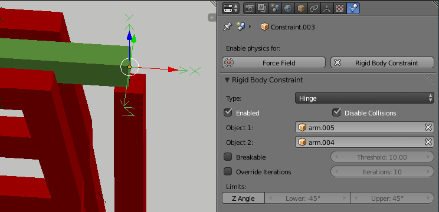

***********************************************************
25.14.8  Editors - Properties Editor - Physics - Rigid Body
***********************************************************

.. contents:: Contents

Rigid Body
==========

The rigid body simulation can be used to simulate the motion of solid objects. It affects the position and orientation of objects and does not deform them.

Unlike the other simulations in Bforartists, the rigid body sim works closer with the animation system. This means that rigid bodies can be used like regular objects and be part of parent-child relationships, animation constraints and drivers.

Creating a Rigid Body
---------------------

Creating the Rigid Body.

Right now only mesh objects can participate in the rigid body simulation. To create rigid bodies, either click on **Rigid Body** button in the **Physics** context of the **Properties** window or use the **Add Active**/**AddPassive** buttons in the **Physics** tab of the **Tool Shelf**.

There are two types of rigid body: active and passive. **Active** bodies are dynamically simulated, while **passive** bodies remain static. Both types can be driven by the animation system when using the **Animated** option.

During the simulation, the rigid body system will override the position and orientation of dynamic rigid body objects. Note however that the location and rotation of the objects is not changed, so the rigid body sim acts similar to a constraint. To apply the rigid body transformations you can use the **Apply Transformation** button in the **Physics** tab of the **Tool Shelf**.

The scale of the rigid body object also influences the simulation, but is always controlled by the animation system.

Rigid Body physics on the object can be **removed** with the **Rigid Body** button in the **Physics** context or **Remove** button in the **Physics** tab of the **Tool Shelf**.

Rigid Body Properties
=====================

Main properties
---------------

Rigid Body panel.

**Type**

	Role of the rigid body in the simulation. Active objects can be simulated dynamically, passive object remain static.

	**Active**

	Object is directly controlled by simulation results. The possibility to select this type also available with **Add Active** button in the **Physics** tab of the **Tool Shelf**. 

	**Passive**

	Object is directly controlled by animation system. Thus, this type is not available for Rigid Body Dynamics. The possibility to select this type also available with **Add Passive** button in the **Physics** tab of the **Tool Shelf**. 

**Dynamic**

Enables/disables rigid body simulation for object. 

**Animated**

Allows the rigid body additionally to be controlled by the animation system. 

**Mass**

	Specifies how heavy the object is and “weights” irrespective of gravity. There are predefined mass preset available with the **Calculate Mass** button in the **Physics** tab of the **Tool Shelf**.

	**Calculate Mass**

	Automatically calculate mass values for Rigid Body Objects based on volume. There are many useful presets available from the menu, patching real-world objects.

	Also you can have **Custom** mass material type, which is achieved by setting a custom density value (kg/m3).

Rigid Body Collisions
---------------------

Rigid Body Collisions panel.

General settings
----------------

**Surface Response**

	**Friction**

	Resistence of object to movement. Specifies how much velocity is lost when objects collide with each other. 

	**Bounciness**

	Tendency of object to bounce after colliding with another (“0” - stays still, “1” - perfectly elastic). Specifies how much objects can bounce after collisions. 

**Collision Groups**

Allows rigid body collisions allocate on different groups (maximum 20). 

Collision shapes
----------------

The **Shape** option determines the collision shape of the object. The following Collision Shapes are available:

- **Primitive shapes** : these are best in terms of memory/performance but don’t necessarily reflect the actual shape of the object. They’re calculated based on the object’s bounding box. The center of gravity is always in the middle for now.
- **Mesh based shapes** : these are calculated based on the geometry of the object so they are a better representation of the object. The center of gravity for these shapes is the object origin.

- - **Box**
- - Box-like shapes (i.e. cubes), including planes (i.e. ground planes). The size per axis is calculated from the bounding box.
- - **Sphere**
- - Sphere-like shapes. The radius is the largest axis of the bounding box.
- - **Capsule**
- - This points up the Z-Axis.
- - **Cylinder**
- - This points up the Z-Axis. The height is taken from the z-axis, while the radius is the larger of the x/y-axes.
- - **Cone**
- - This points up the Z-Axis. The height is taken from the z-axis, while the radius is the larger of the x/y-axes.

- - **Convex Hull**
- - A mesh-like surface encompassing (i.e. shrinkwrap over) all vertices (best results with fewer vertices). Convex approximation of the object, has good performance and stability.
- - **Mesh**
- - Mesh consisting of triangles only, allowing for more detailed interactions than convex hulls. Allows to simulate concave objects, but is rather slow and unstable.

The changing collision shape is available also with **Change Shape** button in the **Physics** tab of the **Tool Shelf**.

Mesh source
-----------

Users can now specify the mesh **Source** for **Mesh** bases collision shapes:

**Base**

The base mesh of the object. 

**Deform**

Includes any deformations added to the mesh (shape keys, deform modifiers). 

**Deforming**

Rigid body deforms during simulation. 

**Final**

Includes all modifiers. 

Collision Margin
----------------

**Margin**

Threshold of distance near surface where collisions are still considered (best results when non-zero). 

The collision margin is used to improve performance and stability of rigid bodies. Depending on the shape, it behaves differently: some shapes embed it, while others have a visible gap around them.

The margin is **embedded** for these shapes:

- Sphere 
- Box 
- Capsule 
- Cylinder 
- Convex Hull: Only allows for uniform scale when embedded. 

The margin is **not embedded** for these shapes:

- Cone 
- Active Triangle Mesh 
- Passive Triangle Mesh: Can be set to 0 most of the time. 

Rigid Body Dynamics
-------------------

Rigid Body Dynamics panel.

This panel is available only for **Active** type of rigid bodies.

**Deactivation**: 

	**Enable Deactivation**

	Enable deactivation of resting rigid bodies. Allows object to be deactivated during the simulation (improves performance and stability, but can cause glitches). 

	**Start Deactivated**

	Starts objects deactivated. They are activated on collision with other objects. 

	**Linear Vel**

	Specifies the linear deactivation velocity below which the rigid body is deactivated and simulation stops simulating object. 

	**Angular Vel**

	Specifies the angular deactivation velocity below which the rigid body is deactivated and simulation stops simulating object. 

**Damping**: 

	**Translation**

	Amount of linear velocity that is lost over time. 

	**Rotation**

	Amount of angular velocity that is lost over time. 

Rigid Body World
================

Rigid Body World panel.

The rigid body world is a group of Rigid Body objects, which holds settings that apply to all rigid bodies in this simulation and can be found in **Rigid Body World** panel of **Scene** context.

When you add Rigid Body physics on an object, primary there is created a group of objects with default “RigidBodyWorld” name. Rigid body objects automatically are added to this group when you add Rigid Body physics for them.

You can be create several Rigid Body World groups and allocate there yours Rigid Body objects with **Groups** panel in **Object** context.

Rigid body objects and constraints are only taken into account by the simulation if they are in the groups specified in **Group** field of the **Rigid Body World** panel in the **Scene** context.

**Rigid Body World** checkbox 

Enable/disable evaluation of the Rigid Body simulation based on the rigid body objects participating in the specified group of Rigid Body World. 

**Remove Rigid Body World** button 

Remove Rigid Body simulation from the current scene. 

**Group**

Containing rigid body objects participating in this simulation. 

**Constraints**

Containing rigid body object constraints participating in the simulation. 

Simulation quality and timing settings:

**Speed**

Can be used to speed up/slow down the simulation. 

**Split Impulse**

Enable/disable reducing extra velocity that can build up when objects collide (lowers simulation stability a little so use only when necessary). Limits the force with which objects are separated on collision, generally produces nicer results, but makes the simulation less stable (especially when stacking many objects). 

**Steps Per Second**

Number of simulation steps made per second (higher values are more accurate but slower). This only influences the accuracy and not the speed of the simulation. 

**Solver Iterations**

Amount of constraint solver iterations made per simulation step (higher values are more accurate but slower). Increasing this makes constraints and object stacking more stable. 

Rigid Body caching and baking
-----------------------------

Rigid Body Cache panel.

Specifies the frame range in which the simulation is active. Can be used to bake the simulation.

**Start**/**End**

First and last frame of the simulation. 

**Bake**

	Calculates the simulation and protects the cache. You need to be in **Object** mode to bake.

	**Free Bake**

	Active after the baking of simulation. Clears the baked cache. 

**Calculate to Frame**

Bake physics to current frame. 

**Current Cache to Bake**

Bake from Cache. 

**Bake All Dynamics**

Bake all physics. 

**Free All Bakes**

Free all baked caches of all objects in the current scene. 

**Update All To Frame**

Update cache to current frame. 

If you haven’t saved the blend file, the cache is created in memory, so save your file first or the cache may be lost.

External Force Influence on Rigid Body
--------------------------------------

Rigid Body Cache panel.

As other physics dynamics systems, Rigid Body simulation are also influenced by external force effectors.

Rigid Body Constraints
======================

Constraints (also known as joints) for rigid bodies connect two rigid bodies.

The physics constraints available in the non-game modes are meant to be attached to an Empty object. The constraint then has fields which can be pointed at the two physics-enabled object which will be bound by the constraint. The **Empty** object provides a location and axis for the constraint distinct from the two constrained objects. The location of the entity hosting the physics constraint marks a location and set of axes on each of the two constrained objects. These two anchor points are calculated at the beginning of the animation and their position and orientation remain fixed **in the local coordinate system of the object** for the duration of the animation. The objects can move far from the constraint object, but the constraint anchor moves with the object. If this feature seems limiting, consider using multiple objects with a non-physics **Child-of** constraint and animate the relative location of the child.

The quickest way to constrain two objects is to select both and click the **Connect** button in the **Physics** tab of the **Tool Shelf**. This creates a new **Empty** object (named “Constraint”) with a physics constraint already attached and pointing at the two selected objects.

Also you can create **Rigid Body Constaint** on of the two constrained objects with **Rigid Body Constaint** button of the **Physics** context in the **Properties** window. This constraint be depend on the object location and rotation which on it created. Thereafterat, there are no **Empty** object created for the constraint. The role of the **Empty** object is put on this object. The constrained object can be then set as **Passive** type for better driving the constrain.

Additional parameters appear in the **Rigid Body Constaint** panel of the **Physics** context in the **Properties** window for the selected **Empty** object or the one of the two constrained objects with the created constraint.

Common Options
--------------

Rigid Body Constraint panel.

Enabled 

Specifies whether the constraint is active during the simulation. 

Disable Collisions 

Allows constrained objects to pass through one another. 

Object 1 

First object to be constrained. 

Object 2 

Second object to be constrained. 

Breakable 

	Allows constraint to break during simulation. Disabled for the **Motor** constraint.

	Threshold 

	Impulse strength that needs to be reached before constraint breaks. 

Override Iterations 

	Allows to make constraints stronger (more iterations) or weaker (less iterations) than specified in the rigid body world.

	Iterations 

	Number of constraint solver iterations made per simulation step for this constraint. 

Limits 

By using limits you can constrain objects even more by specifying a translation/rotation range on/around respectively axis (see below for each one individually). To lock one axis, set both limits to 0. 

Fixed
=====

Options available to a **Fixed** constraint.

This constraint cause the two objects to move as one. Since the physics system does have a tiny bit of slop in it, the objects don’t move as rigidly as they would if they were part of the same mesh.

Point
=====

Options available to a **Point** constraint.

The objects are linked by a point bearing allowing any kind of rotation around the location of the constraint object, but no relative translation is permitted. The physics engine will do its best to make sure that the two points designated by the constraint object on the two constrained objects are coincident.

Hinge
=====

Options available to a **Hinge** constraint.

The hinge permits 1 degree of freedom between two objects. Translation is completely constrained. Rotation is permitted about the Z axis of the object hosting the Physics constraint (usually an Empty, distinct from the two objects that are being linked). Adjusting the position and rotation of the object hosting the constraint allows you to control the anchor and axis of the hinge.

The Hinge is the only 1-axis rotational constraint that uses the Z axis instead of the X axis. If something is wrong with your hinge, check your other constraints to see if this might be the problem.

**Limits**: 

	**Z Angle**

	Enables/disables limit rotation around Z axis.

	**Lower**

	Lower limit of Z axis rotation. 

	**Upper**

	Upper limit of Z axis rotation. 

Slider
======

The Slider constraint allows relative translation along the X axis of the constraint object, but permits no relative rotation, or relative translation along other axes.

**Limits**: 

	**X Axis**

	Enables/disables limit translation around X axis.

	**Lower**

	Lower limit of X axis translation. 

	**Upper**

	Upper limit of X axis translation. 

Piston
======

A piston permits translation along the X axis of the constraint object. It also allows rotation around the X axis of the constraint object. It’s like a combination of the freedoms of a slider with the freedoms of a hinge (neither of which is very free alone).

**Limits**: 

	**X Axis**

	Enables/disables limit translation around X axis.

	**Lower**

	Lower limit of X axis translation. 

	**Upper**

	Upper limit of X axis translation. 

	**X Angle**

	Enables/disables limit rotation around X axis.

	**Lower**

	Lower limit of X axis rotation. 

	**Upper**

	Upper limit of X axis rotation. 

Generic
=======

The generic constraint has a lot of available parameters.

The X, Y, and Z axis constraints can be used to limit the amount of translation between the objects. Clamping the min/max to zero has the same effect as the Point constraint.

Clamping the relative rotation to zero keeps the objects in alignment. Combining an absolute rotation and translation clamp would behave much like the Fixed constraint.

Using a non-zero spread on any parameter allows it to rattle around in that range throughout the course of the simulation.

Limits: 

	X Axis/Y Axis/Z axis 

	Enables/disables limit translation on X, Y or Z axis respectively.

	Lower 

	Lower limit of translation for X, Y or Z axis respectively. 

	Upper 

	Upper limit of translation for X, Y or Z axis respectively. 

	X Angle/Y Angle/Z Angle 

	Enables/disables limit rotation around X, Y or Z axis respectively.

	Lower 

	Lower limit of rotation for X, Y or Z axis respectively. 

	Upper 

	Upper limit of rotation for X, Y or Z axis respectively. 

Generic Spring
==============

Options available to a **Generic Spring** constraint.

The generic spring constraint adds some spring parameters for the X/Y/Z axes to all the options available on the Generic constraint. Using the spring alone allows the objects to bounce around as if attached with a spring anchored at the constraint object. This is usually a little too much freedom, so most applications will benefit from enabling translation or rotation constraints.

If the damping on the springs is set to 1, then the spring forces are prevented from realigning the anchor points, leading to strange behavior. If your springs are acting weird, check the damping.

Limits: 

	X Axis/Y Axis/Z axis 

	Enables/disables limit translation on X, Y or Z axis respectively.

	Lower 

	Lower limit of translation for X, Y or Z axis respectively. 

	Upper 

	Upper limit of translation for X, Y or Z axis respectively. 

	X Angle/Y Angle/Z Angle 

	Enables/disables limit rotation around X, Y or Z axis respectively.

	Lower 

	Lower limit of rotation for X, Y or Z axis respectively. 

	Upper 

	Upper limit of rotation for X, Y or Z axis respectively. 

Springs: 

	X/Y/Z 

	Enables/disables springs on X, Y or Z axis respectively.

	Stiffness 

	Spring Stiffness on X, Y or Z axis respectively. Specifies how “bendy” the spring is. 

	Damping 

	Spring Damping on X, Y or Z axis respectively. Amount of damping the spring has. 

Motor
=====

Options available to a **Motor** constraint.

The motor constraint causes translation and/or rotation between two entities. It can drive two objects apart or together. It can drive simple rotation, or rotation and translation (although it won’t be constrained like a screw since the translation can be blocked by other physics without preventing rotation).

The rotation axis is the X axis of the object hosting the constraint. This is in contrast with the Hinge which uses the Z axis. Since the Motor is vulnerable to confusing perturbations without a matching Hinge constraint, special care must be taken to align the axes. Without proper alignment, the motor will appear to have no effect (because the hinge is preventing the motion of the motor).

Linear motor/Angular motor: 

	Enable 

	Enable linear or angular motor respectively.

	Target Velocity 

	Target linear or angular motor velocity respectively. 

	Max Impulse 

	Maximum linear or angular motor impulse respectively.

Tips
====

As with all physics-enabled objects, pay close attention to the **Animated** check box in the **Rigid Body** panel of the **Physics** context in the **Properties** window. A common mistake is to use keyframe animation on a **Passive** physics object without checking the **Animated** box. The object will move, but the physics engine will behave as if the **Passive** is still in its starting place, leading to disappointment.

Animation
---------

The most common trick is to keyframe animate the location or rotation of an **Active** physics object as well as the **Animated** checkbox. When the curve on the **Animated** property switches to disabled, the physics engine takes over using the object’s last known location, rotation and velocities.

Animating the strengths of various other parameters (a **Motor’s** Target Velocity, a **Hinge’s** limits, etc) can be used to accomplish a wide variety of interesting results.

Enabling a constraint during the physics simulation often has dramatic results as the physics engine tries to bring into alignment two objects which are often dramatically out of alignment. It is very common for the affected objects to build up enough kinetic energy to bounce themselves out of camera (and into orbit, although the physics engine is not yet capable of simulating a planet’s gravity well, so scratch that).

Rigid Body dynamics can be baking to normal keyframes with **Bake To Keyframes** button in the **Physics** tab of the **Tool Shelf**.

Simulation Stability
--------------------

The simplest way of improving simulation stability is to increase the steps per second. However, care has to be taken since making too many steps can cause problems and make the simulation even less stable (if you need more than 1000 steps, you should look at other ways to improve stability).

Increasing the number of solver iterations helps making constraints stronger and also improves object stacking stability.

It’s best to avoid small objects, as they’re currently unstable. Ideally, objects should be at least 20 cm in diameter. If it’s still necessary, setting the collision margin to 0, while generally not recommended, can help making small object behave more naturally.

When objects are small and/or move very fast, they can pass through each other. Besides what’s mentioned above it’s also good to avoid using mesh shapes in this case. Mesh shapes consist of individual triangles and therefore don’t really have any thickness, so objects can pass through more easily. You can give them some thickness by increasing the collision margin.

Combining Rigid Bodies with Other Simulations
---------------------------------------------

Since the rigid body simulation is part of the animation system, it can influence other simulations just like the animation system can.

In order for this to work, the rigid body object needs to have a collision modifier. Simply click on **Collision** in the **Physics** context.

Scaling Rigid Bodies
--------------------

Rigid body objects can be scaled, also during the simulation. This work well in most cases, but can sometimes cause problems.

If dynamic scaling is not needed, rigid body objects should have the scale applied by using the **Apply Scale** command 

