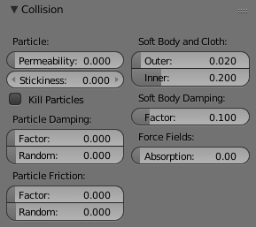
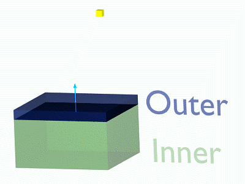
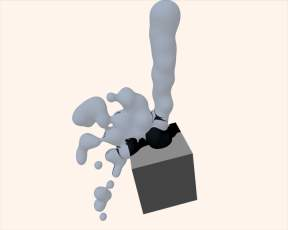

***********************************************
25.14 Editors - Properties Editor - Physics Tab
***********************************************

.. contents:: Contents

Physics
=======

The Physics chapter covers various advanced Bforartists effects, often used to simulate real physical phenomena, such as:

- Smoke 
- Rain 
- Dust 
- Cloth 
- Water 
- Jello 

**Particle Systems** can be used to simulate many things: hair, grass, smoke, flocks.

**Hair** is a subset of the particle system, and can be used for strand-like objects, such as hair, fur, grass, quills, etc.

**Soft Bodies** are useful for everything that tends to bend, deform, in reaction to forces like gravity or wind, or when colliding with other objects... It can be used for skin, rubber, and even clothes, even though there is separate **Cloth Simulation** specific for cloth-like objects.

**Rigid Bodies** can simulate dynamic objects that are fairly rigid.

**Fluids**, which include liquids and gases, can be simulated, including **Smoke**.

**Force Fields** can modify the behavior of simulations.

Gravity
-------

Gravity is a global setting that is applied the same to all physics systems in a scene, which can be found in the scene tab. This value is generally fine left at its default value, at -9.810 in the Z axis, which is the force of gravity in the real world. Lowering this value would simulate a lower or higher force of gravity. Gravity denoted g, measurement [m×s -2]).

Gravity is practically same around whole **Earth**. For rendering scenes from **Moon** use value 6 times smaller, e.g. 1.622 m×s -2. The most popular and probably not colonized **Mars** has g = 3.69.

Note that you can scale down the gravity value per physics system in the **Field Weights tab.**

Collisions
==========

**Particles**, **Soft Bodies** and **Cloth objects** may collide with mesh objects. **Boids** try to avoid **Collision** objects.

- The objects need to share at least one common layer to have effect. 
- You may limit the effect on particles to a group of objects (in the **Field Weights panel**). 
- **Deflection** for softbody objects is difficult, they often penetrate the colliding objects. 
- Hair particles ignore deflecting objects (but you can animate them as softbodies which take deflection into account). 

If you change the deflection settings for an object you have to recalculate the particle, softbody or cloth system (**Free Cache**), this is not done automatically. You can clear the cache for all selected objects with Ctrl-B –> **Free cache selected**.

Reference
=========

Options
-------

Collision Panel

Permeability 

Fraction of particles passing through the mesh. 

Stickiness 

How much particles stick to the object. 

Kill Particles 

Deletes Particles upon impact. 

Damping Factor 

Damping during a collision (independent of the velocity of the particles). 

Random damping 

Random variation of damping. 

Friction Factor 

Friction during movements along the surface. 

Random friction 

Random variation of friction. 

Image 1b: A softbody vertex colliding with a plane.

Soft Body and Cloth Interaction
-------------------------------

Outer 

Size of the outer collision zone. 

Inner 

Size of the inner collision zone (padding distance). 

Outside and inside is defined by the face normal, depicted as blue arrow in (**Image 1b**).

Damping Factor 

Damping during a collision. 

**Softbody** collisions are difficult to get perfect. If one of the objects move too fast, the soft body will penetrate the mesh. See also the section about **Soft Bodies**.

Force Field Interaction
-----------------------

Absorption 

A deflector can also deflect effectors. You can specify some collision/deflector objects which deflect a specific portion of the effector force using the **Absorption** value. 100% absorption results in no force getting through the collision/deflector object at all. If you have 3 collision object behind each other with e.g. 10%, 43% and 3%, the absorption ends up at around 50% (100×(1-0.1)×(1-0.43)×(1-0.03)). 

Examples
--------

Deflected Particles

Here is a **Meta** object, dupliverted to a particle system emitting downwards, and deflected by a mesh cube:

Hints
-----

- Make sure that the normals of the mesh surface are facing towards the particles/points for correct deflection. 
- Hair particles react directly to force fields, so if you use a force field with a short range you don’t need necessarily collision. 
- Hair particles avoid their emitting mesh if you edit them in **Particle** mode. So you can at least model the hair with collision. 

