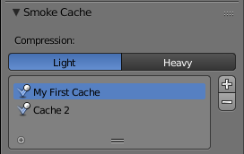

****************************************************************************
25.14.xx  Editors - Properties Editor - Physics - Baking Physics Simulations
****************************************************************************

.. contents:: Contents

Baking Physics Simulations
==========================

Baking refers to the act of storing or caching the results of a calculation.

It’s generally recommended to bake your physics simulations before rendering. Aside from no longer needing to go through the time-consuming process of simulating again, baking can help prevent potential glitches and ensure that the outcome of the simulation remains exactly the same every time.

.. Note:: Most physics simulators in Bforartists use a similar system, but not all have exactly the same settings available. All the settings are covered here, but individual physics types may not provide all these options.

Compression 

	Compression level for cache files. Some physics caches can be very large (such as smoke). Bforartists can compress these caches in order to save space.

	**Light** compression optimizes speed of compressing/decompressing operations over file size. **Heavy** compression will result in smaller cache files more than **Light**, however requires more CPU time to compress/decompress.

External 

	Read and write the cache to disk using a user-specified file path.

	Index Number 

	This number specifies which cache should be used when the specified cache directory contains multiple caches. 0 refers to the top-most cache, 1 to the second from the top, 2 to the third, and so on. 

Use Lib Path 

	Share the disk cache when the physics object is **linked** into another blendfile.

	When this option is enabled, linked versions of the object will reference the same disk cache. When disabled, linked versions of the object will use independent caches.

Start 

Frame on which to start the simulation. 

End 

Frame on which to stop the simulation. 

Cache Step 

	Interval for storing simulation data.

	Some physics systems (such as particles) allow for positions to be stored only on every nth frame, letting the positions for in-between frames be interpolated. Using a cache step greater than 1 will result in a smaller cache, but the result may differ from the original simulation.

Bake 

Start baking. Bforartists will become unresponsive during most baking operations. The cursor will display as a number representing the bakes’ progress. 

Free Bake 

Mark the baked cache as temporary. The data will still exist, but will be removed with the next object modification and frame change. This button is only available when the physics system has been baked. 

Calculate To Frame 

Bake only up to the current frame. Limited by **End** frame set in the cache settings. 

Current Cache to Bake 

Store any temporarily cached simulation data as a bake. Note that playing the animation will try to simulate any visible physics simulations. Depending on the physics type, this data may be temporarily cached. Normally such temporary caches are cleared when an object or setting is modified, but converting it to a bake will “save” it. 

Bake All Dynamics 

	Bake all physics systems in the scene, even those of different types. Useful for baking complex setups involving interactions between different physics types.

	See Bake

Free All Bakes 

	Free bakes of all physics systems in the scene, even those of different types.

	See Free Bake.

Update All To Frame 

	Bake all physics systems in the scene to the current frame.

	See Calculate To Frame

Multiple Caches
---------------

Bforartists allows for storing and managing multiple caches at once for the same physics object.

Two different caches stored simultaneously.

Caches can be added and removed with the Plus and Minus buttons. Renaming a cache can be done by either double clicking or pressing Ctrl-LMB on the desired cache.

