****************************************************
25.16 Editors - Properties Editor - Bone Constraints
****************************************************

.. contents:: Contents

Bone Constraints tab
====================

Constraints allows two objects to interact with each other. You can for example set the x position to the x position of another object with the Copy Location constraint. Bone constraints is a special constraints chapter just dedicated to bones. And just shows when you have a armature or a bone selected.

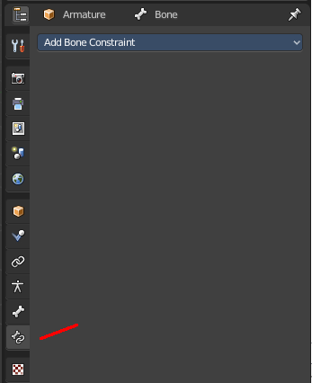

Bones behave like objects in Pose Mode. And so they can also be constrained. 

The Bone Constraints tab shows inObject Mode and Pose mode. 

In Object mode you can edit existing constraints. But you can't add constraints in Object mode. Bone Constraints can only be added in Pose Mode.

The constraints dropdown menu shows the same constraints than the Object Constraints tab. You can add any of the other object constraints here. Like a Limit Rotation from the Transform category, to limit the rotation of an ellbow for example. 

Most of the other constraints works with all object types, and are explained in the Object Constraints chapter. But there are two constraints that just works for and with bones. And can just be added from the Bone Constraints dropdown menu. The IK constraint and the Spline IK constraint. Both are covered in this chapter.

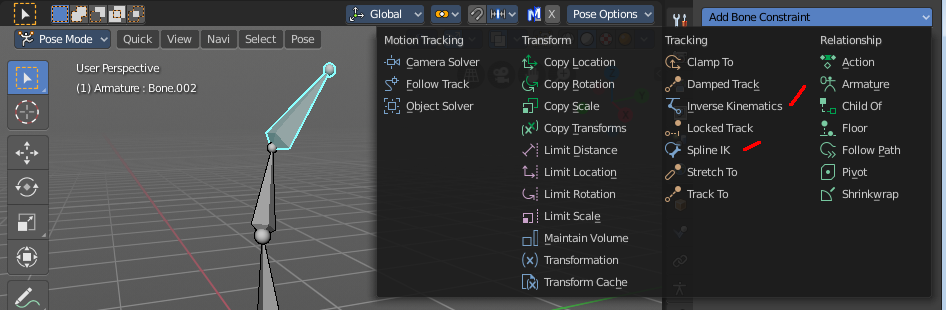

What is Inverse Kinematics?
===========================

You can pose a skeleton in two ways. With Forward Kinematics. And with Inverse Kinematics.

Forward kinematics means, you bend a bone, and the bones downwards the hierarchy follows this motion. For example you pull the ellbow, and the hand with its fingers follows. You don't need a constraint for that. This is native behaviour of an armature.

The other technique is called inverse kinematics. Here the motion gets calculated upwards the hierarchy. For example you pull at the hand, and the arm follows. That's where you need the IK Constraint.

Quick Setup
-----------

You can add the Inverse Kinematics from the 3D View. Or directly in the Bone Constraints panel. In Pose Mode select the bone, and either choose the Add IK to Bone in the Pose menu. Or add the constraint directly in the Bone Constraint tab.

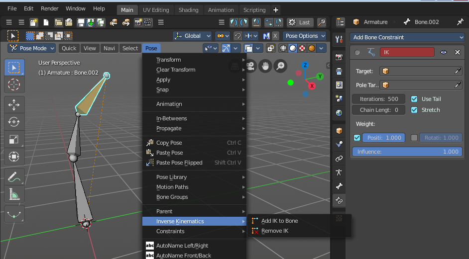

The Add IK to Bone menu item brings up a sub item. Without targets means that it just creates the constraint. It misses the handler to pose it then. And so you have to pull at the bone with the IK solution to pose your armature. The title of the constraint is red when the target is missing. Which usually means that the constraint is disfunctional since it misses some vital information. But you can nevertheless use this constraint in Pose Mode as is.

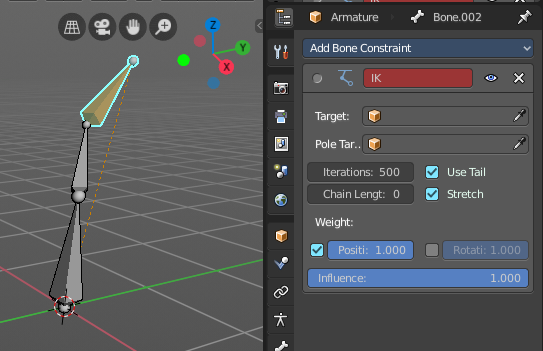

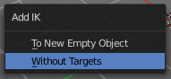

A common method is to use a unconnected Bone inside of the same armature to be the target or the pole target. But then you can still just pose this armature in Pose mode.

Adding a bone as an IK handler
------------------------------

In Edit Mode create a loose bone in your armature. Turn off Connected and clear Parent in the Relations panel.

Untick Deform. We use this bone as a handler, not as a bone.

Go to Pose mode. Select the IK bone. Hold down Shift and select the bone where you want to add the IK to.

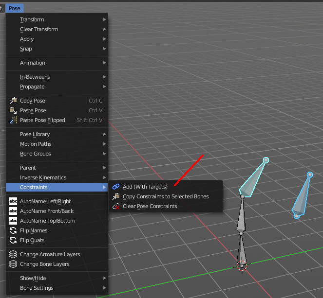

Then in the Pose menu choose Constraints, Add (With Targets), and choose the IK constraint in the upcoming menu.

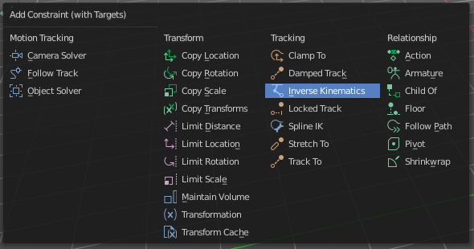

This creates the IK constraint, and will add our prepared bone to be the target. And now you can pull at this bone in Pose Mode, and the Ik solution will follow this bone.

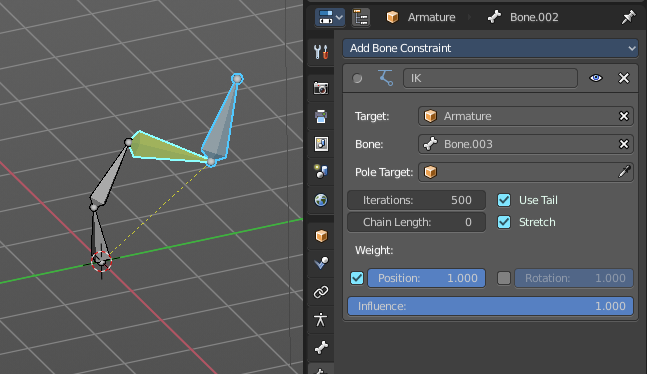

Needless to say that you might be faster to add the IK constraint manually in the Bone IK tab here. You have to adjust it anyways ...

Adding an Object as an IK handler
---------------------------------

You might want to animate a character together with other objects. They are usually animated in Object Mode. And so you need a solution to pose your character in Object mode, and not in Pose mode. For that you can simply add any object in the scene to be the IK handler instead of a bone in the same armature.

First go to the Pose menu again. Choose Inverse Kinematics / Add IK to Bone. Then choose To New Empty Object

This adds the IK constraint, and creates an empty as the Target. This empty can then be used as a handler to pose the IK solution in Object Mode. The IK solution will follow this Target.

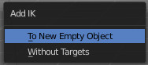

You can add any other object in the scene as a Target. It does not need to be an empty. Simply replace it in the IK constraint in the Target edit box.

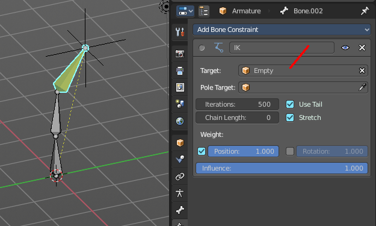

The further functionality of the IK constraint gets explained below.

IK Constraint
=============

Target
------

Here you can add a object as an IK handler object.

Bone
----

If the target is an armature, then you can choose the bone here that you want to use as an IK handler.

Pole Target
-----------

Here you can add an object to be the Pole target. 

Pole target is a secondary IK target. A object that lets the Ik solution point into a defined direction, towards this object. 

Think of a knee here for example. Without a Pole target the knee might dance around when you try to pose the leg. And it will point in all directions but the one in that it should bend. With a Pole target you can let the Ik solution point towards this target object.

Bone
----

If the target is an armature, then you can choose the bone here that you want to use as a Pole Target.

Pole Angle
----------

The Ik solution might not point correctly into the direction of the Pole target. Or you might need some offset. Here you can define an offset for the pole angle.

Iterations
----------

The maximum number of iterations to calculate the IK solution

Chain Length
------------

How many bones are included into this IK solution. A value of 0 uses all bones.

Use Tail
--------

Include the Bone's tail as the last element in chain.

Stretch
-------

Enable IK stretching.

Weight
------

Position
--------

For Tree IK (multiple IK targets): Weight of Position Control for this target.

Rotation
--------

For Tree IK (multiple IK targets): Weight of Orientation Control for this target.

Influence
---------

The influence level of this constraints.

Spine IK Constraint
===================

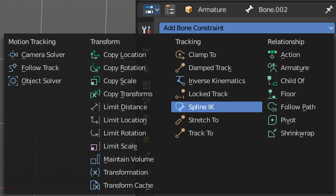

The **Spline IK** constraint aligns a chain of bones along a curve. This constraint requires to have a curve object in the scene as the target object. So you should create one beforehand.

Target 
-------

Here you can choose the target curve.

Spline Fitting: 
----------------

Chain Length 
-------------

How many bones are included in the chain. Set it to 0 to influence the whole chain.

Even Division 
--------------

Ignore the relative length of the bones when fitting to the curve. Every bone in the chain will be equal long.

Chain Offset 
-------------

Offset the entire chain relative to the root joint. Else just the bones in reach of the chain length gets aligned. 

Note: The calculation happens relative to the curve. When this curve is rotated in world space, then the bones still uses the unrotated state of the curve.

Chain Scaling: 
---------------

Use Curve Radius 
-----------------

Average radius of the endpoints is used to tweak the X and Z scaling of the bones, on top of the X and Z scale mode.

Y scale mode
------------

Here you can choose how the bone length should fit into the curve length.

None 
-----

Don’t scale the X and Z axes.

Fit Curve
---------

Fit the bone chain length into the length of the curve.

Bone Original 
--------------

Use the original scaling of the bones.

XZ Scale Mode: 
---------------

None 
-----

Don’t scale the X and Z axes.

Bone Original 
--------------

Use the original scaling of the bones.

Inverse Scale
-------------

Scale of the Z and X axis is the inverse of the Y axis.

Volume Preservation 
--------------------

Scale of the X and Z axes is the inverse of the Y scale. With enabling Volume Preservation you will reveal some further options for this method.

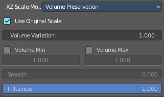

Use Original Scale
------------------

Apply volume preservation over the original scaling.

Volume Variation
----------------

Factor between volume variation and stretching.

Volume Min / Volume Max
-----------------------

Minimum and maximum volume stretching factor.

Smooth
------

Here you can adjust the factor between volume variation and stretching.

Influence
---------

The influence level of this constraints.

