***********************************************************
25.1.2 Editors - Properties Editor - Tools Tab - Edit  Mode
***********************************************************

.. contents:: Contents

Tools Tab in Edit Mode
======================

Many object types can be edited in edit mode. Mesh objects, armature, text object and so on. In this chapter we will go through all the object types in edit mode. But just a few object types have really relevant settings in the tools tab in edit mode. Mesh Objects. All kind of curve objects. And the Armature.

For the rest of the editable object types the tools tab stays blank.

Edit Mode - Mesh Object
=======================

Options panel
-------------

Here you can find some mesh specific settings.

The same content can also be found in the tool settings bar

Mirror
------

Mirror Editing.

The same buttons can also be found in the tool settings bar as icon buttons. This allows quicker access and better visual control which mirror axis is currently active.

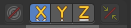

Topology Mirror
---------------

Use Topology based mirroring.

Auto Merge Editing
------------------

Automatically merge vertices that are close to each other.

The same checkbox can also be found in the tool settings bar as an icon button. This allows quicker access and better visual control which mirror axis is currently active.

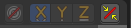

Split Edges and Faces
---------------------

When mirror editing then split edges and faces automatically.

Threshold
---------

Limit for removing duplicates and 'Auto Merge'.

Edit Mode - Bezier Curve
========================

Curve Stroke Panel type Bezier
------------------------------

Type
----

Here you switch between the curve type Bezier and Poly.

Bezier Options
--------------

Tolerance
---------

Allow deviation for a smoother but less precise line.

Method
------

The curve fitting method. Here you can choose between Refit and Split.

Detect Corners
--------------

Detect corners and use non aligned angles.

Corner Angle
------------

Corners above this angle are considered as corners.

Pressure Radius
---------------

Pressure radius is interesting when you use a tablet. Here you can adjust the Minimum and Maximum pressure radius. When you don't use a tablet then the maximum pressure value will be used.

Taper Radius
------------

Taper factor for the radius of each point along the curve.

Projection depth
----------------

Here you can set the method of projection depth.

Cursor
------

Sets the projection depth to 3D Cursor.

Surface
-------

Sets the projection depth to Surface. Then the curve paints at a surface that is placed under the stroke. It also reveals some more settings for Projection Depth method Surface 

Offset
------

Offset the stroke from the surface.

Absolute Offset
---------------

Apply a fixed offset.

Only First
----------

Use the start of the stroke for depth.

Curve Stroke Panel type Poly
----------------------------

Type
----

Here you switch between the curve type Bezier and Poly.

Pressure Radius
---------------

Pressure radius is interesting when you use a tablet. Here you can adjust the Minimum and Maximum pressure radius. When you don't use a tablet then the maximum pressure value will be used.

Taper Radius
------------

Taper factor for the radius of each point along the curve.

Projection depth
----------------

Here you can set the method of projection depth.

Cursor
------

Sets the projection depth to 3D Cursor.

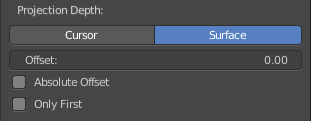

Surface
-------

Sets the projection depth to Surface. Then the curve paints at a surface that is placed under the stroke. It also reveals some more settings for Projection Depth method Surface 

Offset
------

Offset the stroke from the surface

Absolute Offset
---------------

Apply a fixed offset

Only First
----------

Use the start of the stroke for depth.

Edit Mode - Armature Options panel
==================================

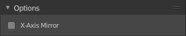

X Axis Mirror
-------------

X Axis Mirror is made to sync the right side of a symmetrical armature with the left side of a symmetrical armature. Means you can create just one half of a skeleton. And then simply mirror it over to the other half. And any further changes that you do at the one side will also apply to the other side of the armature. This includes the whole FK IK setup. And can save you lots of work therefore.

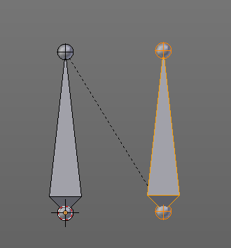

The same checkbox can also be found in the tool settings bar as an icon button. This allows quicker access and better visual control which mirror axis is currently active.

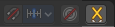

Workflow
--------

To get X Axis mirror to work requires a bit preparation work. 

Create a armature, with some bones at the one side. Like this. The 3D cursor needs to be at 0/0/0. The left bone is in the middle. Think of it as the backbone. The right bone has an offset, and shall represent our right side of the armature.

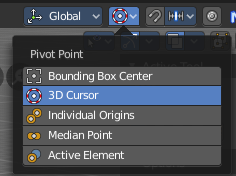

Change the Pivot Point in the Header to 3D Cursor. Important step. We want to mirror around the 3D Cursor.

Now select the right side of the armature. Border select is one fast way. But NOT the bone in the middle, which is our backbone. We don't want to mirror this one too. 

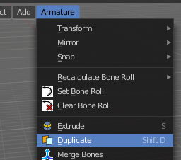

Duplicate what we have selected. And click immediately to leave the duplicate mode. Or you will pull the duplicated part around. Which is not what we want. 

Next we will scale our new created armature part by -1 to mirror it over to the other side. Activate Scale, don't move the mouse, but type immediately in X for the axis and -1 for the scale factor.

This will create our mirrored armature part.

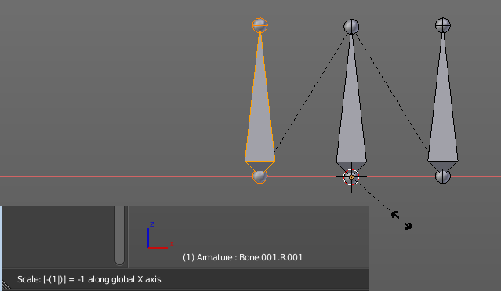

Next important step is to Flip Names. This renames the mirrored bones. Bone.001.R becomes without this step Bone.001.R.001. With rename we get Bone.001.L

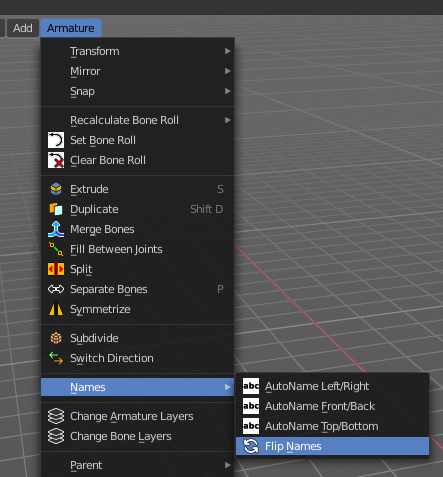

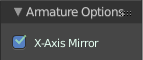

And now we are finally arrived at X Axis Mirror. Tick it. 

Now you should be able to modify the one side of the armature, and the other side will be modified too. This includes as told above also FK IK set-ups that you do in Pose mode.

