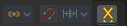

**********************************************
25.1.3 Editors - Properties Editor - Tools Tab
**********************************************

.. contents:: Contents

Tools Tab in Pose Mode
======================

There is just one object tpye that has a pose mode. The Armature. The number of available tools in the tools panel is rather small. There is just one panel.

Pose Mode - Armature
====================

Pose Options Panel
------------------

Auto IK
-------

Add temporary IK constraints while grabbing bones in Pose mode.

X Axis Mirror
-------------

X Axis Mirror in pose mode synces the right side of a symmetrical armature with the left side of a symmetrical armature. 

The same checkbox can also be found in the tool settings bar as an icon button. This allows quicker access and better visual control which mirror axis is currently active.

Relative Mirror
---------------

This is a setting for X Axis Mirror, and just shows when X Axis Mirror is ticked. Here you can define if the mirroring happens relative to the armature or to the world.

Affect Only Locations
---------------------

This is for having more than one armature part selected. Scales or rotates the selection instead of scaling or rotating the single armature parts. The single bones keeps their scale and their rotation.

