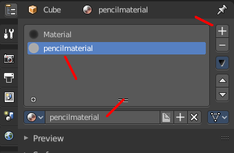
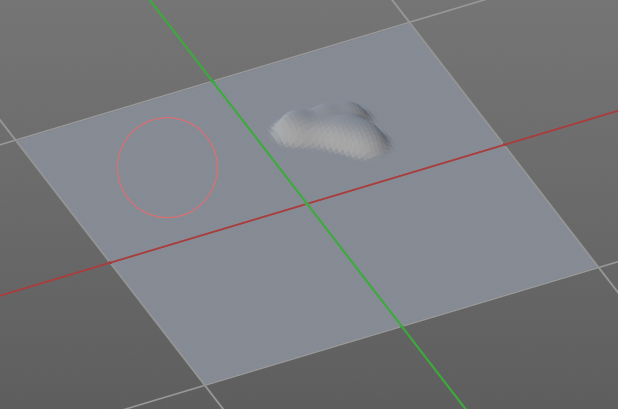

************************************************************
25.1.4 Editors - Properties Editor - Tools Tab - Sculpt Mode
************************************************************

.. contents:: Contents

Detailed table of content
=========================

Tools Tab in Sculpt Mode
========================

Sculpting is a process to deform thegeometry by using a brush. Mesh objects can be sculpted. And Grease Pencil can be sculpted. In this chapter we handle the mesh tools. Grease Pencil has its own chapter.

In Sculpt Mode you will mainly find settings for the different brushes. General settings. And brush specific settings. This settings can be found in different panels. The different brushes have different options and settings, dependant of which brush is selected. This brush specific options and settings are explained in the tool shelf chapter. Here we just cover the general panels with options and settings that exists for (nearly) all brushes.

The Sculpt Mode just exists for Mesh objects.

Sculpt Mode - Brush Panel
=========================

Brush Panel
-----------

The Brush Panel contains the different Sculpt Brushes and some Brush settings. The content differs, dependant of which brush you have chosen.

Browse Brush
------------

The big image at the top is a dropdown box where you can see the currently active brush. The file browser just shows the current active brush. Which gets chosen in the 3d view in the tool shelf. You can duplicate this brush, and modify it to your needs.

When you have added a few more brushes then the dropdown box may be more than full. You will see some little white arrows then. Either in the top left or in the bottom right corner. They indicate that some brushes are hidden before or after the current display.

To scroll to this hidden content use the mouse wheel, or the arrow up and down buttons at the keyboard.

The edit box below the Image shows you the name of the current active brush. 

The number right of it, in this case 2, indicates how much number of users ( internally ) this brush uses. This means that this data block (the brush) shares currently settings with at least one other object. Most probably the parent brush where we have created it from. Click at the value to make this brush a single user. The button will vanish then.

F set the brush to have a fake user. Zero user data-blocks are normally not saved. But sometimes you want to force the data to be kept even when the data block has no user.

The + button allows you to add a new pencil with the current settings. Note that the brushes are NOT saved when you close Bforartists. You can save them into the current blend file. Or you can save the startup file. But be careful here. This saves everything else of the current state of Bforartists too.

The X button deletes the brush as the active one. It does NOT delete it from the brushes list.

Radius 
-------

The Radius edit box allows you to adjust the radius of the brush. When the Lock symbol at the front is ticked, then the pencil keeps its size relative to the object when zooming in and out. The button behind the edit box enables tablet pressure sensitivity for radius. 

Strength
--------

The Strength edit box allows you to adjust the strength of the brush. When the Lock symbol at the front is ticked, then the pencil keeps its strength relative to the object when zooming in and out. The button behind the edit box enables tablet pressure sensitivity for strength.

Direction Add / Subtract
------------------------

Add means the stroke adds to the geometry. Subtract means the stroke subtracts from the geometry. 

Normal Radius
-------------

The ratio between the brush radius and the radius that is going to be used to sample the normal

Autosmooth
----------

The autosmooth edit box allows you to adjust the amout of smoothing that gets automatically applied to each stroke. The button behind the edit box enables tablet pressure sensitivity for autosmooth.

Plane Offset
------------

Clay brush setting. Adjust the plane on which the brush acts towards or away from the objects surface. Sculpting with the Clay brush happens in a plane defined by the view you are in and the first vertices hit by the brush.

Plane Trim
----------

Clay brush setting. Enable Plane Trim. Sculpting with the Clay brush happens in a plane defined by the view you are in and the first vertices hit by the brush. The trim distance defines a limit above which vertices are not affected by the brush.

Distance
--------

Here you can adjust the plane trim distance.

Height 
-------

Layer brush setting. The height that can be affected by the layer brush.

Persistent
----------

Layer brush setting. Sculpt on a persistent layer of the mesh.

Set Persistent Base
-------------------

This button resets the base so that you can add another layer. 

Magnify
-------

Blob Brush setting. The Crease Brush Pinch Factor.

Pinch
-----

Crease Brush setting. The Crease Brush Pinch Factor.

Grab active Vertex
------------------

Grab brush setting. Apply the maximum grab strength to the active vertex instead of the cursor position.

Deformation
-----------

Elastic Deform brush setting. The deformation type that is used for the brush.

Volume Preservation
-------------------

Elastic Deform brush setting. Poisson ratio for elastic deform. The higher the value is the more the volume is kept. But leads to more bulging.

Rake
----

Snake Hook brush setting. How much grab will follow cursor rotation.

Pose Origin Offset
------------------

Pose Brush setting. Offset of the pose origin in relation to the brush radius.

Mask Tool 
----------

Draw or smooth the current mask.

Options
-------

In the options you can find the not so often used settings. They differ from brush to brush. Have a look at the tooltips.

Topology Automasking
--------------------

Affect only vertices that are connected to the current active vertex under the brush.

Accumulate
----------

Accumulate stroke daubts on top of each other.

Radius Unit
-----------

Here you can adjust the unit in which the brush works. Relative to the view, or relative to the scene. Relative to the view means you can zoom out and the brush becomes relatively bigger compared to the mesh. With scene you can zoom in and out, and the brush size stays the same relative to the mesh.

Sculpt Plane
------------

The sculpt plane defines how the sculpting is aligned. It is a dropdown box where you can choose different methods. By default the Area Plane gets used.

.. image:: graphics/25.1.4_Editors_-_Properties_Editor_-_Tools_Tab_-_Sculpt_Mode/100002010000007900000092CE7514CC93DCAA46.png

Original Normal
---------------

When ticked keep using normal of the surface where the stroke was initiated.

Original Plane
--------------

When ticked keep using plane origin of the surface where the stroke was initiated.

Front Faces Only
----------------

Front Faces only means that the stroke just affects the vertices that are pointing forwards to the camera.

2D Falloff
----------

Apply the brush influence in 2d circle instead of a sphere.

Sculpt Mode - Texture Panel
===========================

The Texture panel allows you to sculpt with textures. This allows you for example to grab a foto from some fish scales, and simply sculpt them into the surface of your object by using this image as a pencil. Or as a blueprint where you calk through ( Stencil method ).

Note that the following shots are made with Symmetry off and without Brush falloff. Since they disturbed.

Symmetry can be turned off a few panels deeper in the Symmetry panel:

Browse Texture to be linked
---------------------------

The image at the top of the panel is a image browser. Here you can choose a texture that you can choose for sculpting then. You can also have more than one image loaded at once. 

Adding a texture
----------------

The way to add the texture here is a bit more complicated. And not done with clicking at the New button.

First click at the New button below the image. This will create a new texture slot. This slot is still empty, it displays black. 

We need to load the texture in this slot. This must be done in the Properties editor in the Textures tab.

.. image:: graphics/25.1.4_Editors_-_Properties_Editor_-_Tools_Tab_-_Sculpt_Mode/1000020100000165000001DD14C44CD2386FE788.png

.. image:: graphics/25.1.4_Editors_-_Properties_Editor_-_Tools_Tab_-_Sculpt_Mode/100002010000015A000001E8001A5F0BFDE01983.png

.. image:: graphics/25.1.4_Editors_-_Properties_Editor_-_Tools_Tab_-_Sculpt_Mode/100002010000015A000001D781DFBF5DA2993AAD.png

And when you switch back to the Tools tab, then the texture finally shows in the Texture panel in the Tool Shelf. And we can use it.

Texture Edit box
----------------

The Texture edit box is the edit box below the Image browser. When there's no image loaded then it displays the New button. When there's a image (or more) loaded, then you will see the name of the current texture. 

The Fake User button turns this texture into a data block with a fake user. Means it will exists even when there is no data connected to it anymore.

The + Button adds another texture slot. Note that you will have to load a texture too, as explained above.

The X button deletes the texture slot.

Brush Mapping
-------------

Our texture can be mapped in different methods. The Brush mapping is a dropdown box where you can choose this different brush mapping methods.

The settings vary. So we will go through them by the different brush mapping methods.

Brush Mapping with mapping method View Plane and Area Plane
-----------------------------------------------------------

The brush mapping method View Plane maps the brush onto the surface of the object, calculating the mapping from the current view. The result may be distorted when the view does not align with the surface of the object.

.. image:: graphics/25.1.4_Editors_-_Properties_Editor_-_Tools_Tab_-_Sculpt_Mode/10000201000001A70000012284C165F20645EDCE.png

The brush mapping method Area Plane maps the brush onto the surface of the object, calculating the mapping from the current view. The result is not distorted.

Angle edit box
--------------

Here you can adjust the angle of the brush.

Rake
----

The angle follows the direction of the brush stroke. 

Random
------

The brush angle gets set random.

Random edit box
---------------

Becomes visible when you tick Random. Here you can adjust the maximum value of the random angle.

Offset
------

Fine tune the offset of the texture in the brush.

Size
----

Fine tune the size of the texture in the brush. 

Sample Bias
-----------

Here you can add to or subtract from the amount that gets added by the brush texture. 

Brush Mapping with mapping method Tiled
---------------------------------------

The brush mapping method View Plane maps the brush onto the surface of the object, and tiles the pencil onto the surface. The mapping happens from the View plane. Means you get distortions when you sculpt from an angle.

Angle edit box
--------------

Here you can adjust the angle of the brush.

Offset
------

Fine tune the offset of the texture in the brush.

Size
----

Fine tune the size of the texture in the brush. 

Sample Bias
-----------

Here you can add to or subtract from the amount that gets added by the brush texture. 

Brush Mapping with mapping method 3D
------------------------------------

The brush mapping method View Plane and Area Planesculpts where the pencil is. The method 3D sculpts at the initial position of the pencil, as long as you don't release the mouse. The mapping happens from the View plane. Means you get distortions when you sculpt from an angle.

Offset
------

Fine tune the offset of the texture in the brush.

Size
----

Fine tune the size of the texture in the brush. 

Sample Bias
-----------

Here you can add to or subtract from the amount that gets added by the brush texture. 

Brush Mapping with mapping method Random
----------------------------------------

The brush mapping method Random randomizes the texture position of the pencil texture. And so it sculpts random fragments of the pencil.

Angle edit box
--------------

Here you can adjust the angle of the brush.

Rake
----

The angle follows the direction of the brush stroke. 

Random
------

The brush angle gets set random.

Random edit box
---------------

Becomes visible when you tick Random. Here you can adjust the maximum value of the random angle.

Offset
------

Fine tune the offset of the texture in the brush.

Size
----

Fine tune the size of the texture in the brush. 

Sample Bias
-----------

Here you can add to or subtract from the amount that gets added by the brush texture.

Brush Mapping with mapping method Stencil
-----------------------------------------

The former methods uses the textures for the brush. The method Stencil works different. You have your texture displayed in the workspace above the object, and you paint this texture onto your object with your pencil strokes.

Note that the texture in the 3d space is just visible when you are with the mouse over the viewport.

Image Aspect
------------

Adjust the stencil size to fit to the image aspect ratio.

Angle edit box
--------------

Here you can adjust the angle of the brush. The button at the end allows you to set the radius by dragging the mouse. This should be done in the viewport and with the hotkey. This button is just a visible reminder.

Offset
------

Fine tune the offset of the texture in the brush.

Stencil Texture Controls
------------------------

You can find the controls to modify the position, rotation and scale of the stencil texture in the Brush menu in the 3D view. This happens by Hotkeys.

Sculpt Mode - Stroke Panel
==========================

The Stroke panel contains settings to influence the behaviour of the brush stroke. There are various stroke methods available. We will go through them one by one.

Stroke Panel with Stroke method Space
-------------------------------------

This is the default Stroke method. The sculpt stroke gets added continuously with given settings.

Spacing Edit Box
----------------

The sculpt drawing happens by mapping the pencil onto the mouse position. And when you move the mouse then the next mapping happens. Here you can adjust the spacing after what mouse movement the next mapping should happen. The lower the value, the lower the distance between the single dots.

The icon behind the edit box enables tablet pressure sensitivity for tablets.

Adjust Strength for Spacing
---------------------------

Automatically adjust the strength to give consistent results for different spacings.

Jitter Edit Box
---------------

Here you can add Jitter to the brush while painting.

The icon in front of the edit box toggles between jittering in screen space and relative to brush size.

The icon behind the edit box enables tablet pressure sensitivity for tablets.

Input Samples Edit Box
----------------------

Average multiple input samples together to smooth the brush stroke.

Smooth Stroke
-------------

When activated then the brush lags behind the mouse position, and produces a much smoother stroke by that. It is a subpanel with two settings.

Smooth Stroke Radius Edit Box
-----------------------------

Here you can adjust the radius of the smoothing.

Smooth Stroke Factor Edit Box
-----------------------------

Here you can adjust the factor of the smoothing.

Stroke Panel with Stroke method Curve
-------------------------------------

The Stroke method curve doesn't simply influence the way how the stroke is painted. 

It is a special method. First you draw a curve object by holding down ctrl and clicking with left mouse button. Then you tweak the curve. You can click at the curve point, and drag out handlers to make the curve points smoooth.

Then you hit the Draw Curve button. And the curve gets sculpted.

Spacing Edit Box
----------------

The sculpt drawing happens by mapping the pencil onto the mouse position. And when you move the mouse then the next mapping happens. Here you can adjust the spacing after what mouse movement the next mapping should happen. The lower the value, the lower the distance between the single dots.

The icon behind the edit box enables tablet pressure sensitivity for tablets.

Paint Curve edit box
--------------------

Here you set the active curve.

The first element is a dropdown box where you will find your curves objects. You can have more than one.

The second element is the edit box that displays the active curve.

Fake Userset the brush to have a fake user. Zero user data-blocks are normally not saved. But sometimes you want to force the data to be kept even when the data block has no user.

The + button allows you to add a new pencil with the current settings. Note that the brushes are NOT saved when you close Bforartists. You can save them into the current blend file. Or you can save the startup file. But be careful here. This saves everything else of the current state of Bforartists too.

The X button deletes the brush as the active one. It does NOT delete it from the brushes list.

Draw Curve Button
-----------------

A click at it to turns the curve into a sculpt stroke.

Adjust Strength for Spacing
---------------------------

Automatically adjust the strength to give consistent results for different spacings.

Jitter Edit Box
---------------

Here you can add Jitter to the brush while painting.

The icon in front of the edit box toggles between jittering in screen space and relative to brush size.

The icon behind the edit box enables tablet pressure sensitivity for tablets.

Input Samples Edit Box
----------------------

Average multiple input samples together to smooth the brush stroke.

Stroke Panel with Stroke method Line
------------------------------------

With Stroke method line you draw a line between a starting point and a endpoint. And when you release the mouse then the line gets sculpted.

.. image:: graphics/25.1.4_Editors_-_Properties_Editor_-_Tools_Tab_-_Sculpt_Mode/10000201000003D0000000F0E75D50F9EC72A19B.png

Spacing Edit Box
----------------

The sculpt drawing happens by mapping the pencil onto the mousehappens. Here you can adjust the spacing after what mouse movement the next mapping should happen. The lower the value, the lower the distance between the single dots.

The icon behind the edit box enables tablet pressure sensitivity for tablets.

Adjust Strength for Spacing
---------------------------

Automatically adjust the strength to give consistent results for different spacings.

Jitter Edit Box
---------------

Here you can add Jitter to the brush while painting.

The icon in front of the edit box toggles between jittering in screen space and relative to brush size.

The icon behind the edit box enables tablet pressure sensitivity for tablets.

Input Samples Edit Box
----------------------

Average multiple input samples together to smooth the brush stroke.

Stroke Panel with Stroke method Airbrush
----------------------------------------

The sculpt stroke acts like an airbrush pencil. The dots gets placed randomly.

Rate Edit Box
-------------

Here you can define the rate of the drawing.

Jitter Edit Box
---------------

Here you can add Jitter to the brush while painting.

The icon in front of the edit box toggles between jittering in screen space and relative to brush size.

The icon behind the edit box enables tablet pressure sensitivity for tablets.

Input Samples Edit Box
----------------------

Average multiple input samples together to smooth the brush stroke.

Smooth Stroke
-------------

When activated then the brush lags behind the mouse position, and produces a much smoother stroke by that. Smooth stroke has two settings.

Smooth Stroke Radius Edit Box
-----------------------------

Here you can adjust the radius of the smoothing.

Smooth Stroke Factor Edit Box
-----------------------------

Is just active when Smooth Stroke is activated. Here you can adjust the factor of the smoothing.

Stroke Panel with Stroke method Anchored
----------------------------------------

Click and drag to place a dot and to scale it.

Edge to Edge
------------

Without Edge to Edge the scaling happens from the center of the brush. With edge to edge the scaling happesn from the edge of the brush.

Input Samples Edit Box
----------------------

Average multiple input samples together to smooth the brush stroke.

Stroke Panel with Stroke method Drag dot
----------------------------------------

Click and drag to place a dot.

.. image:: graphics/25.1.4_Editors_-_Properties_Editor_-_Tools_Tab_-_Sculpt_Mode/100002010000024800000174567BA7BC2A0CC415.png

Input Samples Edit Box
----------------------

Average multiple input samples together to smooth the brush stroke.

Stroke Panel with Stroke method dot
-----------------------------------

Jitter Edit Box
---------------

Here you can add Jitter to the brush while painting.

The icon in front of the edit box toggles between jittering in screen space and relative to brush size.

The icon behind the edit box enables tablet pressure sensitivity for tablets.

Input Samples Edit Box
----------------------

Average multiple input samples together to smooth the brush stroke.

Smooth Stroke
-------------

When activated then the brush lags behind the mouse position, and produces a much smoother stroke by that. Smooth stroke has two settings.

Smooth Stroke Radius Edit Box
-----------------------------

Here you can adjust the radius of the smoothing.

Smooth Stroke Factor Edit Box
-----------------------------

Here you can adjust the factor of the smoothing.

Sculpt Mode - Falloff Panel
===========================

The Falloff panel allows you to define different fallofs methods for the border of the brush.

Selecting Points
----------------

You can select curve points. This reveals two edit boxes for the x and y coordinate of this point.

Selected points can be moved around. Left click at them, hold the mouse button down and move them to a new location.

Adding Points
-------------

You can add new curve points by simply left clicking at the curve. Move the mouse to position them where you need it.

Navigation elements
-------------------

The navigation elements at the top are described from left to right.

Zoom in and out
---------------

The two buttons with the magnifying glass at it zooms in and out in the curve window.

Tools
-----

Tools is a menu where you can find some cuve related tools.

Reset View
----------

Resets the curve windows zoom.

Vector Handle
-------------

Set handle type to Vector.

Auto Handle
-----------

Set handle type to Auto.

Auto Clamped Handle
-------------------

Set handle type to Auto Clamped.

Reset Curve
-----------

Resets the curve to the initial shape.

Use Clipping
------------

Clipping options. Here you can set up clipping for the stroke. The blue button at the top turns clipping on or off.

Delete Points
-------------

Deletes the selected curve point.

Curve Presets
-------------

Here you can find some predefined curve presets.

Sculpt Mode - Dyntopo Panel
===========================

Dyntopo Panel
-------------

Dyntopo stands for Dynamic Topology Sculpting.

Without dyntopo you just deform the existing geometry. With Dyntopo geometry gets subdivided when needed. This makes it possible to sculpt complex shapes out of a block.

Left without Dyntopo, right with Dyntopo.

Note that some brushes does not work with Dyntopo. They are Grab brush, Rotate brush, Thumb brush, Layer brush, Smooth brush (including alt-key smoothing with a different brush) and Mask brush.

The topology will also not be updated if the stroke mode is Anchored or Drag Dot.

Resolution
----------

The Resolution defines how fine the subdivision will be. 

The edit box below does the same. But with a slider, and without visible feedback in form of a widget.

Sample detail size picker
-------------------------

This pipette allows you to pick the current resolution from a mesh.

Refine method
-------------

Here you can define the Detail refine method.

Subdivide Collapse
------------------

Both methods in one. Subdivide long edges to add mesh detail where needed. And collapse short edges to remove mesh detail where possible.

Collapse Edges
--------------

Collapse short edges to remove mesh detail where possible.

Subdivide Edges
---------------

Subdivide long edges to add mesh detail where needed.

Detail Type Method
------------------

Here you can define the Detail Type method.

Relative Detail
---------------

Mesh Detail is relative to brush size and detail size

Brush Detail
------------

Mesh Detail is relative to brush radius.

Constant Detail
---------------

Mesh detail is constant in object space according to detail size.

Manual Detail
-------------

Mesh detail does not change on each stroke. But just on flood fill

Smooth shading
--------------

Show faces in smooth shading instead of flat shading.

Direction
---------

Source and Destination for Symmetrize operator. This has to do with the symmetrize button below.

Symmetrize 
-----------

Symmetrize the topology modifications.

Optimize
--------

Recalculate the sculpt BVH to improve performance.

Detail Flood Fill
-----------------

Flood fill the mesh with the selected detail setting.

Sculpt Mode - Symmetry / Lock Panel
===================================

The Symmetry Lock panel contains tools around symmetry and lock features. Here you can turn on or off mirroring along axis, etc.

Mirror
------

Mirror sculpt along activated axis. By default the mirroring is activated around X axis.

The same buttons plus the whole Symmetry Lock Panel as a dropdown menu can also be found in the tool settings bar as icon buttons. This allows quicker access and better visual control which mirror axis is currently active.

Lock
----

Disallow vertices movement in locked axis direction.

Tiling
------

Produces a mesh that is tilable in the activated directions.

Radial
------

Adjust the repeatings across some axis. For example, when you change Z to 32, then you can draw 32 segments simultaneously around the Z axis instead of just one, distributed around the Z axis.

Tile Offset
-----------

Here you can adjust the offset of the tiling.

Feather
-------

Reduce the strength of the brush where it overlaps symmetrical daubs.

Sculpt Mode - Options Panel
===========================

Threaded Sculpt
---------------

Use multiple CPU cores for sculpting.

Fast Navigate
-------------

For Multires, show Low Res mesh when navigating.

Use Deform only
---------------

Use only deformation modifiers ( The other constructive modifiers except multi-resolution gets temporary disabled)

Show Diffuse Color
------------------

Show the diffuse color of the object while sculpting.

Show Mask
---------

Show mask as overlay on object.

Unified Settings
----------------

A panel with the unified brush settings.

Size
----

Instead of per Brush radius, the radius is shared across brushes.

Strength
--------

Instead of per Brush strength, the strength is shared across brushes.

Color
-----

Instead of per Brush color, the color is shared across brushes.

Gravity
-------

A panel with the gravity settings. Here you can add gravity after each stroke. 

Factor
------

The factor silder defines the amount.

Orientation
-----------

Here you define an object that gets used to determine the gravity from. The Z axis of this object gets used.

