******************************************************************
25.1.5 Editors - Properties Editor - Tools Tab - Vertex Paint Mode
******************************************************************

.. contents:: Contents

Tools tab in Vertex Paint Mode
==============================

The Vertex paint allows you to color the vertices of a mesh.

In Vertex Paint Mode you will mainly find settings for the different brushes. General settings. And brush specific settings. This settings can be found in different panels. The brush specific options and settings are explained in the tool shelf chapter. Here we just cover the general panels.

The Vertex paint Mode just exists for Mesh objects.

Vertex Paint Mode - Brush Panel
===============================

Brush Panel
-----------

The Brush Panel contains the different Brushes and some Brush settings. Here you can choose and adjust your current active brush.

Browse Brush
------------

The big image at the top is a dropdown box where you can choose a brush. Click at it, and you will see the different brushes. A click at one of the images will choose this brush then.

When you have added a few more brushes then the dropdown box may be more than full. You will see some little white arrows then. Either in the top left or in the bottom right corner. They indicate that some brushes are hidden before or after the current display.

.. image:: graphics/25.1.5_Editors_-_Properties_Editor_-_Tools_Tab_-_Vertex_Paint_Mode/100002010000028C000001560EBA49FB8F3DDB81.png

.. image:: graphics/25.1.5_Editors_-_Properties_Editor_-_Tools_Tab_-_Vertex_Paint_Mode/10000201000000F10000009F69DEB9570CD2B29D.png

To scroll to this hidden content use the mouse wheel, or the arrow up and down buttons at the keyboard.

The edit box below the Image shows you the name of the current active brush. 

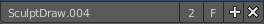

The number right of it, in this case 2, indicates how much number of users ( internally ) this brush uses. This means that this data block (the brush) shares currently settings with at least one other object. Most probably the parent brush where we have created it from. Click at the value to make this brush a single user. The button will vanish then.

F set the brush to have a fake user. Zero user data-blocks are normally not saved. But sometimes you want to force the data to be kept even when the data block has no user.

The + button allows you to add a new pencil with the current settings. Note that the brushes are NOT saved when you close Bforartists. You can save them into the current blend file. Or you can save the startup file. But be careful here. This saves everything else of the current state of Bforartists too.

The X button deletes the brush as the active one. It does NOT delete it from the brushes list.

Radius 
-------

The Radius edit box allows you to adjust the radius of the brush. The button behind the edit box enables tablet pressure sensitivity for radius.

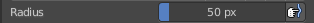

Strength
--------

The Strength edit box allows you to adjust the strength of the brush. The button behind the edit box enables tablet pressure sensitivity for strength.

Blend
-----

Here you can define how the stroke will blend. You can choose between various blend modes.

Color Picker
------------

Here you can define the color for your brush.

The active color is the left one. When you click the button with the two arrows down right then you can swap the color with the secondary color. Then this secondary color becomes the primary color, and is active.

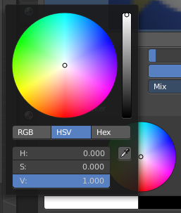

A click at one of the the color fields will open a more detailed color dialog, where you can set up the color by using rgb, hsv and hex colors and with value sliders.

Color Palette
-------------

Here you can create a color palette for later reuse. 

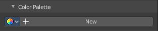

First create a new palette by clicking at New. Then adjust the color in the color picker. And then click at the add button to add this color to the palette.

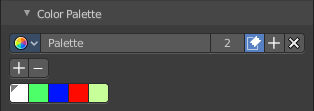

To set the color picker to a palette color simply click at this palette color. 

To remove a color from the palette, choose it, then click at the remove button. The active palette color that gets removed is the one with the triangle at it.

The color palette cannot be saved externally. It is part of the current blend file. You can however append color palettes from other blend files.

The elements are explained from left to right.

Palette browser
---------------

The button at the left opens a dropdown list where you can choose between your palettes.

Edit Box
--------

Here you can read the name of the currently active palette. You can also rename the palette here. A click into the edit box makes the name editable.

Number of users
---------------

Here you can see how many users the palette currently has.

Fake User
---------

Fake Usersets the element to have a fake user. Zero user data-blocks are normally not saved. But sometimes you want to force the data to be kept even when the data block has no user.

Add palette
-----------

Here you can add a new palette.

Remove Palette
--------------

Clicking at this button removes the palette. Note that you need to save, close Bforartists and reload the blend file to remove the palette completely.

Options
-------

Here you can find brush specific settings.

Accumulate
----------

Accumulate stroke daubts on top of each other.

Affect Alpha
------------

When disabled then the alpha is locked while painting.

Front Faces Only
----------------

Paint just at faces that points forwards. Backwards pointing faces are not painted.

2D Falloff
----------

Apply brush influence in a 2D circle instead of a 3D sphere.

Vertex Paint Mode - Texture Panel
=================================

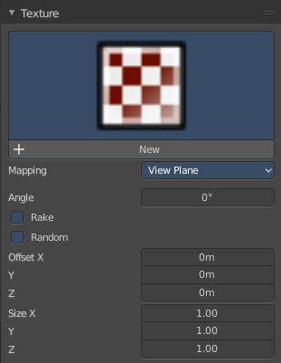

The Texture panel allows you to paint with textures. This allows you for example to grab a foto from some fish scales, and simply paint them onto the vertices by using this image as a pencil. Or as a blueprint where you calk through ( Stencil method ).

Browse Texture to be linked
---------------------------

The image at the top of the panel is a image browser. Here you can choose a texture that you can choose for vertex painting then. You can also have more than one image loaded at once. 

In this shot there is already a texture added. The way to add the texture here is a bit more complicated. And not done with clicking at the New button.

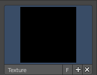

First click at the New button below the image. This will create a new texture slot. This slot is still empty, it displays black. 

We need to load the texture in this slot. This must be done in the Properties editor in the Textures tab. And then the texture finally shows in the Texture panel in the Tool Shelf.

.. image:: graphics/25.1.5_Editors_-_Properties_Editor_-_Tools_Tab_-_Vertex_Paint_Mode/1000020100000165000001DD14C44CD2386FE788.png

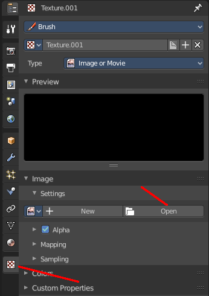

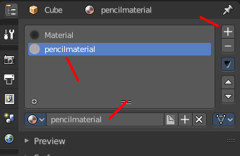

.. image:: graphics/25.1.5_Editors_-_Properties_Editor_-_Tools_Tab_-_Vertex_Paint_Mode/100002010000015A000001D781DFBF5DA2993AAD.png

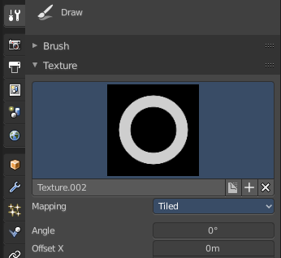

And when we switch back to the tools tab, then the texture is loaded. And we can work with this texture.

Texture Edit box
----------------

The Texture edit box is the edit box below the Image browser. When there's no image loaded then it displays the New button. When there's a image (or more) loaded, then you will see the name of the current texture. 

The F button turns this texture into a data block with a fake user. Means it will exists even when there is no data connected to it anymore.

When you activate Fake User, then you may get a value in front of it, which displays how much users this data block (our texture slot) currently has.

The + Button adds another texture slot. Note that you will have to load a texture too, as explained above.

The X button deletes the texture slot.

Brush Mapping
-------------

Our texture can be mapped in different methods. The Brush mapping is a dropdown box where you can choose this different brush mapping methods.

The settings vary. So we will go through them by the different brush mapping methods.

Brush Mapping with mapping method Tiled
---------------------------------------

The brush mapping method Tiled tiles the brush stroke at the surface. The mapping happens from the current view. The result may be distorted when the view does not align with the surface of the object.

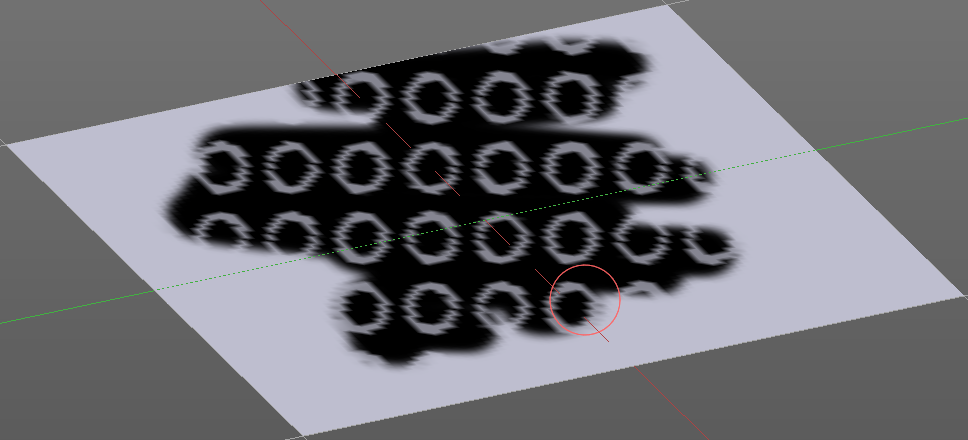

Angle
-----

The angle of the brush.

Offset 
-------

The offset of the texture in the brush.

Size
----

The size of the texture in the brush.

Brush Mapping with mapping method View Plane
--------------------------------------------

The brush mapping method View Plane simply paints onto the surface. The mapping happens from the current view. The result may be distorted when the view does not align with the surface of the object.

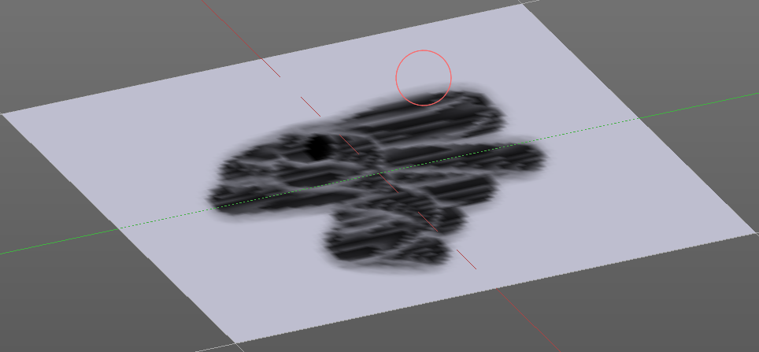

Angle
-----

The angle of the brush.

Rake
----

The angle follows the direction of the brush stroke. 

Random
------

The brush angle gets set random.

Offset 
-------

The offset of the texture in the brush.

Size
----

The size of the texture in the brush.

Brush Mapping with mapping method 3D
------------------------------------

The brush mapping method 3D paints the texture at the surface, by tiling it 1/1 at the object surface. 

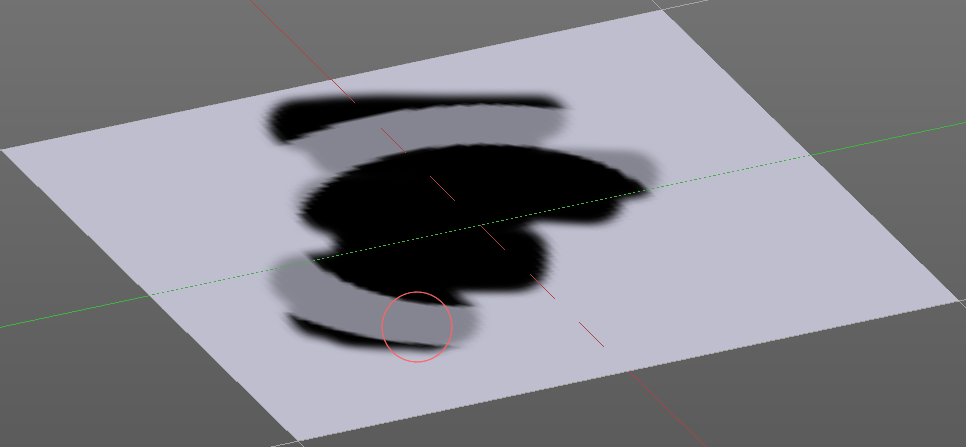

Offset 
-------

The offset of the texture in the brush.

Size
----

The size of the texture in the brush.

Brush Mapping with mapping method Random
----------------------------------------

The brush mapping method Random paints onto the surface, and randomizes the texture position in the brush while that. The mapping happens from the current view. The result may be distorted when the view does not align with the surface of the object.

Angle
-----

The angle of the brush.

Rake
----

The angle follows the direction of the brush stroke. 

Random
------

The brush angle gets set random.

Offset 
-------

The offset of the texture in the brush.

Size
----

The size of the texture in the brush.

Brush Mapping with mapping method Stencil
-----------------------------------------

The former methods uses the textures for the brush. The method Stencil works different. You have your texture displayed in the workspace above the object, and you paint this texture onto your object with your pencil strokes.

Note that the texture in the 3d space is just visible when you are with the mouse over the viewport. It gets by default displayed down left. You have to position it where you need it. See Brush menu, Stencil Texture controls.

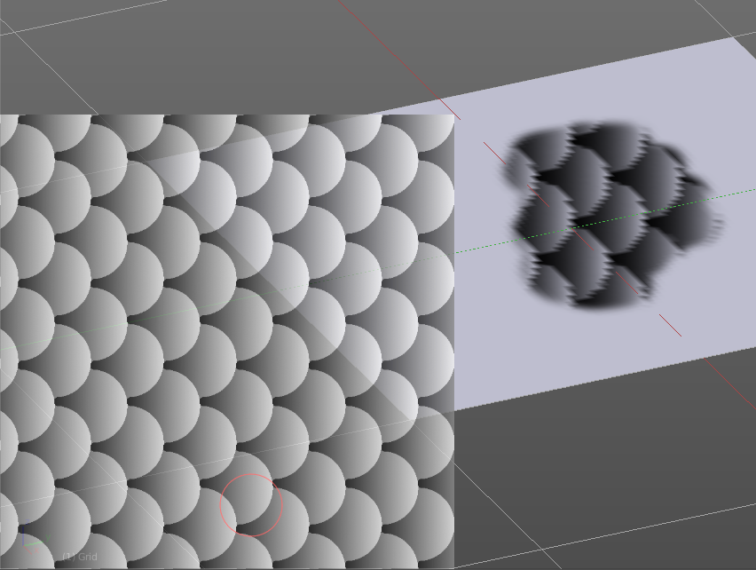

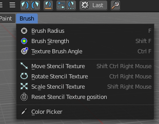

Image Aspect
------------

Adjust the stencil size to fit to the image aspect ratio.

Reset Transform
---------------

Resets all transforms.

Angle edit box
--------------

Here you can adjust the angle of the brush. The button at the end allows you to set the radius by dragging the mouse. This should be done in the viewport and with the hotkey. This button is just a visible reminder.

Offset
------

Fine tune the offset of the texture in the brush.

Size
----

Fine tune the size of the texture in the brush. 

Vertex Paint Mode - Stroke Panel
================================

The Stroke panel contains settings to influence the behaviour of the brush stroke. There are various stroke methods available. We will go through them one by one.

Stroke Panel with Stroke method Space
-------------------------------------

This is the default Stroke method. The sculpt stroke gets added continuously with given settings.

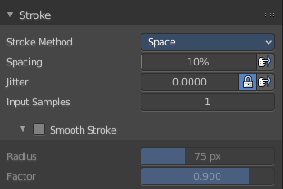

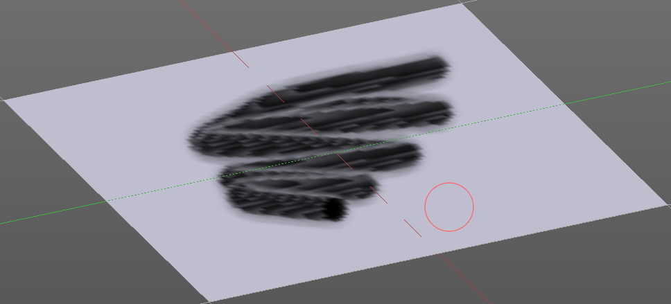

Spacing Edit Box
----------------

The sculpt drawing happens by mapping the pencil onto the mouse position. And when you move the mouse then the next mapping happens. Here you can adjust the spacing after what mouse movement the next mapping should happen. The lower the value, the lower the distance between the single dots.

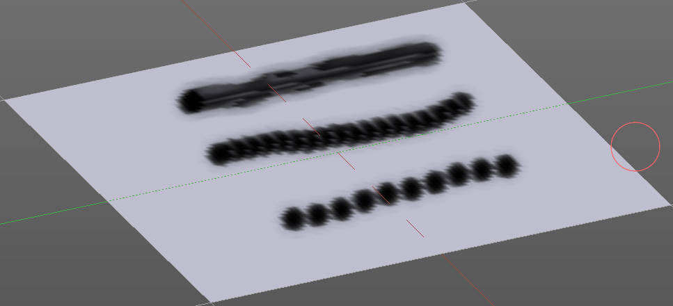

The icon behind the edit box enables tablet pressure sensitivity for tablets.

Jitter Edit Box
---------------

Here you can add Jitter to the brush while painting.

The icon in front of the edit box toggles between jittering in screen space and relative to brush size.

The icon behind the edit box enables tablet pressure sensitivity for tablets.

Input Samples Edit Box
----------------------

Average multiple input samples together to smooth the brush stroke.

Smooth Stroke
-------------

The brush lags behind the mouse position, and produces a much smoother stroke by that. The Smooth Stroke relatet settings are hidden as long as Smooth Stroke is not activated.

Smooth Stroke Radius Edit Box
-----------------------------

Is just active when Smooth Stroke is activated. Here you can adjust the radius of the smoothing.

Smooth Stroke Factor Edit Box
-----------------------------

Is just active when Smooth Stroke is activated. Here you can adjust the factor of the smoothing.

Stroke Panel with Stroke method Curve
-------------------------------------

The Stroke method curve doesn't simply influence the way how the stroke is painted. It is a special method. First you draw a curve object by holding down ctrl and clicking with left mouse button. Then you tweak the curve. You can click at the curve point, and drag out handlers to make the curve points smoooth.

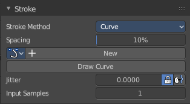

Then you hit the Draw Curve button. And the curve gets drawn onto the surface.

Spacing Edit Box
----------------

The drawing happens by mapping the pencil onto the mouse position. And when you move the mouse then the next mapping happens. Here you can adjust the spacing after what mouse movement the next mapping should happen. The lower the value, the lower the distance between the single dots.

The icon behind the edit box enables tablet pressure sensitivity for tablets.

Paint Curve edit box
--------------------

Here you set the active curve.

The first element is a dropdown box where you will find your curves objects. You can have more than one.

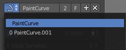

The second element is the edit box that displays the active curve.

The number right of it, in this case 2, indicates how much number of users ( internally ) this brush uses. This means that this data block (the brush) shares currently settings with at least one other object. Most probably the parent brush where we have created it from. Click at the value to make this brush a single user. The button will vanish then.

F set the brush to have a fake user. Zero user data-blocks are normally not saved. But sometimes you want to force the data to be kept even when the data block has no user.

The + button allows you to add a new pencil with the current settings. Note that the brushes are NOT saved when you close Bforartists. You can save them into the current blend file. Or you can save the startup file. But be careful here. This saves everything else of the current state of Bforartists too.

The X button deletes the brush as the active one. It does NOT delete it from the brushes list.

Draw Curve Button
-----------------

A click at it to turns the curve into a sculpt stroke.

Jitter Edit Box
---------------

Here you can add Jitter to the brush while painting.

The icon in front of the edit box toggles between jittering in screen space and relative to brush size.

The icon behind the edit box enables tablet pressure sensitivity for tablets.

Input Samples Edit Box
----------------------

Average multiple input samples together to smooth the brush stroke.

Stroke Panel with Stroke method Line
------------------------------------

With Stroke method line you draw a line between a starting point and a endpoint. And when you release the mouse then the line gets sculpted.

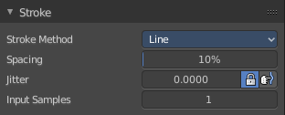

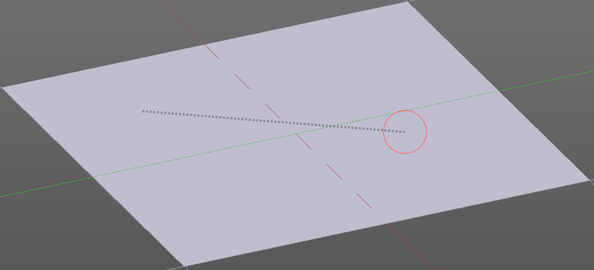

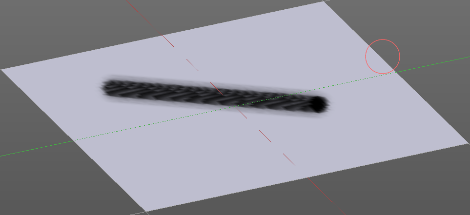

Spacing Edit Box
----------------

The sculpt drawing happens by mapping the pencil onto the mouse position. And when you move the mouse then the next mapping happens. Here you can adjust the spacing after what mouse movement the next mapping should happen. The lower the value, the lower the distance between the single dots.

The icon behind the edit box enables tablet pressure sensitivity for tablets.

Jitter Edit Box
---------------

Here you can add Jitter to the brush while painting.

The icon in front of the edit box toggles between jittering in screen space and relative to brush size.

The icon behind the edit box enables tablet pressure sensitivity for tablets.

Input Samples Edit Box
----------------------

Average multiple input samples together to smooth the brush stroke.

Stroke Panel with Stroke method Airbrush
----------------------------------------

The stroke acts like an airbrush pencil. The dots gets placed randomly.

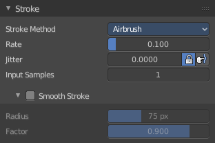

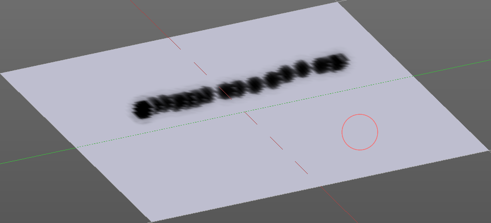

Rate Edit Box
-------------

Here you can define the rate of the drawing.

Jitter Edit Box
---------------

Here you can add Jitter to the brush while painting.

The icon in front of the edit box toggles between jittering in screen space and relative to brush size.

The icon behind the edit box enables tablet pressure sensitivity for tablets.

Input Samples Edit Box
----------------------

Average multiple input samples together to smooth the brush stroke.

Smooth Stroke
-------------

The brush lags behind the mouse position, and produces a much smoother stroke by that.

Smooth Stroke Radius Edit Box
-----------------------------

Is just active when Smooth Stroke is activated. Here you can adjust the radius of the smoothing.

Smooth Stroke Factor Edit Box
-----------------------------

Is just active when Smooth Stroke is activated. Here you can adjust the factor of the smoothing.

Stroke Panel with Stroke method Dots
------------------------------------

The stroke method Dots draws dots of the pencil onto the surface. The mapping happens from the current view. Means you will get distortions when your view is not aligned with the surface of the object.

Jitter Edit Box
---------------

Here you can add Jitter to the brush while painting.

The icon in front of the edit box toggles between jittering in screen space and relative to brush size.

The icon behind the edit box enables tablet pressure sensitivity for tablets.

Input Samples Edit Box
----------------------

Average multiple input samples together to smooth the brush stroke.

Smooth Stroke
-------------

The brush lags behind the mouse position, and produces a much smoother stroke by that.

Smooth Stroke Radius Edit Box
-----------------------------

Is just active when Smooth Stroke is activated. Here you can adjust the radius of the smoothing.

Smooth Stroke Factor Edit Box
-----------------------------

Is just active when Smooth Stroke is activated. Here you can adjust the factor of the smoothing.

Vertex Paint Mode - Falloff Panel
=================================

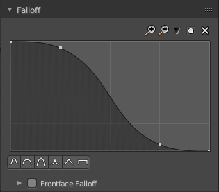

The curve panel allows you to define different fallofs methods for the border of the brush.

Navigation elements
-------------------

The navigation elements at the top are described from left to right.

Zoom in and out
---------------

The two buttons with the magnifying glass at it zooms in and out in the curve window.

Tools
-----

Tools is a menu where you can find some cuve related tools.

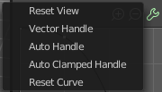

Reset View
----------

Resets the curve windows zoom.

Vector Handle
-------------

Set handle type to Vector.

Auto Handle
-----------

Set handle type to Auto.

Auto Clamped Handle
-------------------

Set handle type to Auto Clamped.

Reset Curve
-----------

Resets the curve to the initial shape.

Use Clipping
------------

Clipping options. Here you can set up clipping for the stroke.

Delete Points
-------------

Deletes selected curve points

Curve Presets
-------------

Here you can find some predefined curve presets.

Vertex Paint Mode - Display Panel
=================================

Curve
-----

This setting is interesting for the Stroke method Curve. Here you can adjust how transparent the curve is.

The brush icon is to hide the overlay during a stroke.

The eye icon button in front of the slider is to show the curve object in viewport. The brush icon button behind the slider is to hide the overlay during a stroke.

Texture Alpha
-------------

This setting is interesting for Texture painting. Here you can adjust how transparent the texture is.

The brush icon is to hide the overlay during a stroke.

The eye icon button in front of the slider is to show the texture in the viewport. The brush icon button behind the slider is to hide the overlay during a stroke.

The Stencil map texture has no eye icon button since it gets shown in the viewport anyways.

Show Brush
----------

Show the brush in 3D view.

Color
-----

The color of the outline of the brush.

Custom Brush Icon
-----------------

Here you can define a custom icon for the brush.

Edit Box
--------

The button at the right allows you to load a custom brush image.

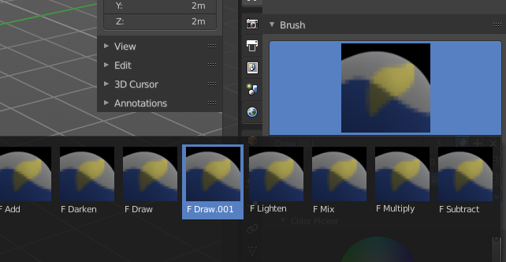

How to:

Select an existing brush type. Create a new brush out of it.

Now load our new brush. The image in the browser will turn into this icon.

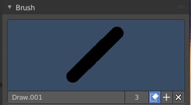

To turn this into a own brush with own shape you would need to load a texture now too. This feature here just loads a icon for the currently active brush in the brush browser.

Vertex Paint Mode - Symmetry Panel
==================================

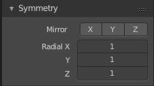

Mirror
------

Mirror along given axis.

The same buttons plus the whole Symmetry Lock Panel as a dropdown menu can also be found in the tool settings bar as icon buttons. This allows quicker access and better

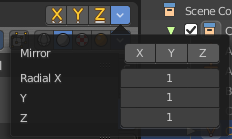

Radial
------

Tiling. The number of times to repeat the strokes across the surface.

Vertex Paint Mode - Options Panel
=================================

Unified Settings
----------------

Size
----

Instead of per Brush radius, the radius is shared across brushes.

Strength
--------

Instead of per Brush strength, the strength is shared across brushes.

Color
-----

Instead of per Brush color, the color is shared across brushes.

