******************************************************************
25.1.6 Editors - Properties Editor - Tools Tab - Weight Paint Mode
******************************************************************

.. contents:: Contents

Tools tab in Weight Paint Mode
==============================

The Tools tab in Weight Paint Mode provides you the tools to do weight painting at a mesh. Skinned characters for example.

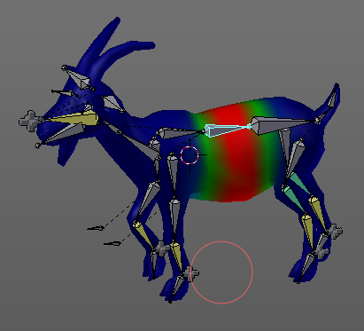

The vertices becomes a "weighting" assigned in this process. Means a per centage influence of the bone to a vertice. And under the hood you create vertex groups with the vertices that are assigned to the bones.

The amount of influence is defined by the weight paint color. Pure red has an influence value of 1. Pure blue has an influence value of 0. And the gradients between red and blue defines the inbetween steps in the 0-1 range. This is needed since there can be more than one bone influence and deform a vertice. Usually at the transition areas between two bones. The green areas in this shot.

The Weight Paint mode is just available for mesh objects.

Weight painting at characters
-----------------------------

The main purpose for Weightpainting is to weight the skin for characters. So that they deform proper when you pose your armature.

Skinning
--------

To do weightpainting at a character you first have to assign the mesh to the armature. This process is called skinning. The mesh becomes the "skin" for the skeletton.

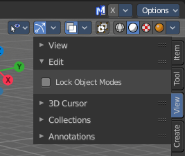

Let's do a quick run through skinning. You can skin in Object Mode. But also from Pose Mode. Lock Object Modes needs to be unticked to get it to work from Pose Mode, which it is by default. In case you have it on, untick it now. 

Create an object, create a armature. 

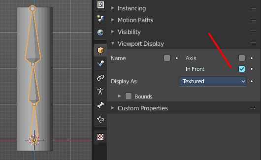

First we activate Display "in Front"for the armature. So that we can still see the armature inside of the mesh.

Position the mesh at its final location.

Now select the Mesh, hold down Shift key, and select the Armature. Both should be selected now.

Dive into the Object menu in the header of the 3D view, and search for Parent, with automatic weights. You can also press the hotkey Ctrl P. This calls the parenting menu under the mouse position.

Here we choose "With Automatic Weights". Automatic weighting means that the bones grabs the nearest vertices within a given radius, and assignes them to this bone.

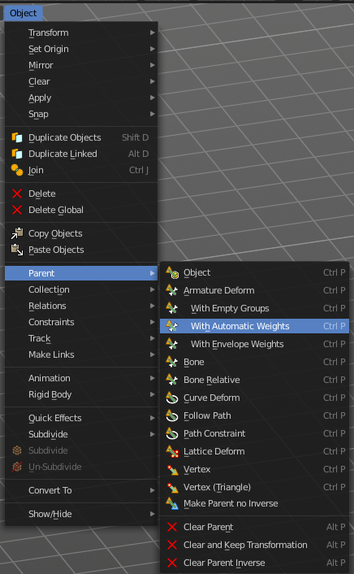

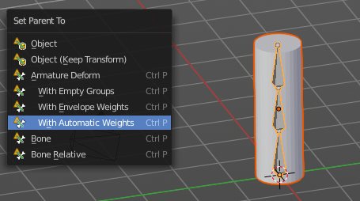

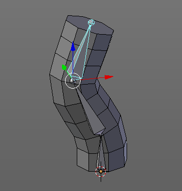

When everything went well then the mesh, in our case the Cylinder, is now part of the hierarchy of the armature. 

And when you select the armature, and switch to Pose mode now, then you can already deform the mesh by posing the armature.

Note that currently the outliner does not indicate the hierarchy anymore. In former versions the cylinder became part of the armature when you parented it together. In the current version the cylinder remains where it is.

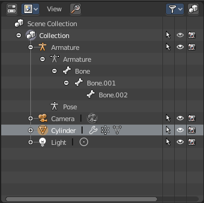

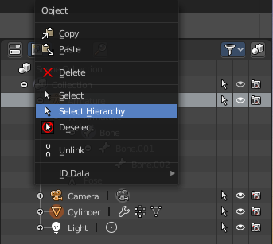

You can however select the whole hierarchy in the right click menu. And put it into a own collection for example.

Enter and leave Weightpainting
------------------------------

Weight painting should happen in Pose mode so that you can pose your mesh to see the resulting deformings.

With the armature in Pose mode, select the mesh by clicking at it. Then enter Weight Paint mode. You can now do weight painting at the mesh.

To leave Weight painting, simply switch back to Object mode. Or select the armature in the outliner. 

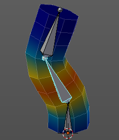

Switch bones
------------

The weighting that gets displayed when you enter Weight Paint mode is from the last active bone. So that's one method to define the bone that you want to weight paint. But you can also switch bones while in weight painting. 

Hold down Ctrl, and left click at the bone that you want to set active. Then the weighting for this bone gets displayed.

Note that this just works when you come from Pose Mode. When you come from object mode, then you can't select another bone that way.

Weightpainting a plain mesh
---------------------------

You can also do weightpainting without an armature. Just at the pure mesh. In this case you just create the vertex groups for the mesh. And those vertex groups can be accessed in edit mode then for further useage. As shown in the shots below.

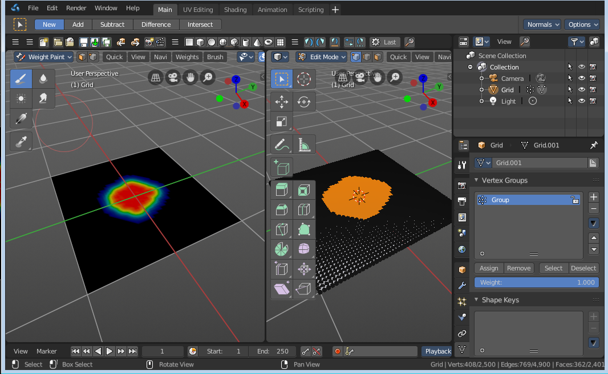

Weightpainting in combination with particles
--------------------------------------------

You can also combine weight painting with particles. To influence the density of hair for example. The weightmap can be assigned in the Vertex Groups panel in the Particles tab.

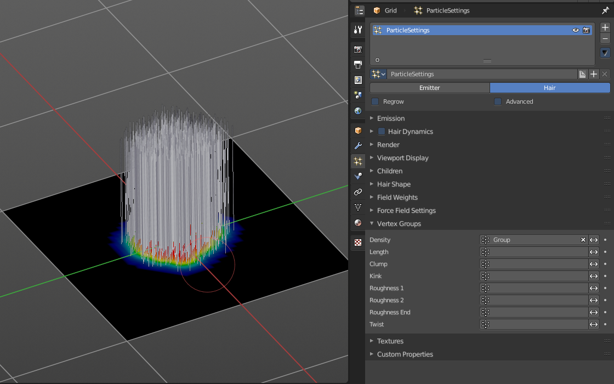

Weight Paint Mode - Brush Panel
===============================

Brush Panel
-----------

The Brush Panel contains the different Brushes and some Brush settings. Here you can choose and adjust your current active brush.

Browse Brush
------------

The big image at the top is a dropdown box where you can choose a brush. Click at it, and you will see the different brushes. A click at one of the images will choose this brush then.

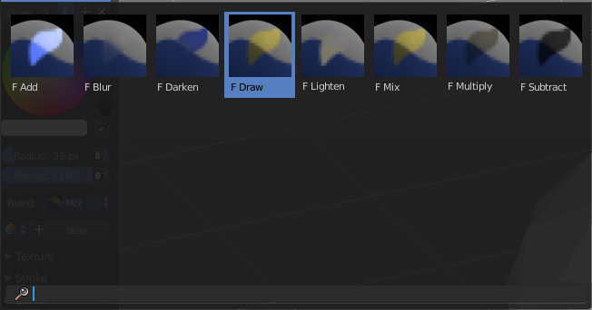

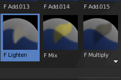

When you have added a few more brushes then the dropdown box may be more than full. You will see some little white arrows then. Either in the top left or in the bottom right corner. They indicate that some brushes are hidden before or after the current display.

To scroll to this hidden content use the mouse wheel, or the arrow up and down buttons at the keyboard.

The edit box below the Image shows you the name of the current active brush. 

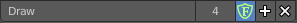

The number right of it, in this case 3, indicates how much number of users ( internally ) this brush uses. This means that this data block (the brush) shares currently settings with at least two other data blocks.

Fake Userset the brush to have a fake user. Zero user data-blocks are normally not saved. But sometimes you want to force the data to be kept even when the data block has no user.

The + button allows you to add a new pencil with the current settings. Note that the brushes are NOT saved when you close Bforartists. You can save them into the current blend file. Or you can save the startup file. But be careful here. This saves everything else of the current state of Bforartists too.

The X button deletes the brush as the active one. It does NOT delete it from the brushes list.

Weight
------

Here you can adjust the strength of the weight painting.

Radius 
-------

The Radius edit box allows you to adjust the radius of the brush. The button behind the edit box enables tablet pressure sensitivity for radius.

And the button at the end allows you to set the radius of the pencil by hotkey. A click at this button works of course too. But this is a hotkey tool. The button is just a visible reminder.

Strength
--------

The Strength edit box allows you to adjust the strength of the brush. The button behind the edit box enables tablet pressure sensitivity for strength.

And the button at the end allows you to set the strength by hotkey. A click at this button works of course too. But this is a hotkey tool. The button is just a visible reminder.

Blend
-----

Blend is a dropdown box where you can choose between different blend modes for the color that you paint.

Options
-------

Accumulate
----------

Accumulate stroke daubts on top of each other

Front Faces Only
----------------

The Brush only paints at faces that faces to the view.

2D Falloff
----------

Apply brush influence in 2D circle instead of a sphere. 

Auto Normalize
--------------

Auto normalizes the weighting so that in the sum all vertex groups does not go over 1.0

Multipaint
----------

Paint across the weights of all selected bones, maintaining their relative influence.

Tools Tab - Weight Paint Mode - Stroke Panel
============================================

Stroke Panel
------------

The Stroke panel contains settings to influence the behaviour of the brush stroke. There are various stroke methods available. We will go through them one by one.

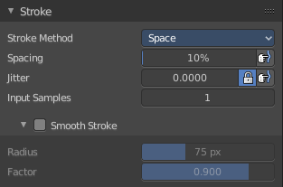

Stroke Panel with Stroke method Space
-------------------------------------

This is the default Stroke method. The sculpt stroke gets added continuously with given settings.

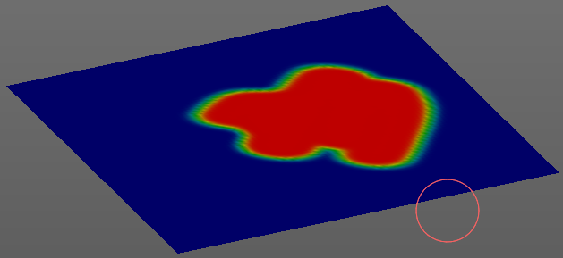

Spacing Edit Box
----------------

The drawing happens by mapping the pencil onto the mouse position. And when you move the mouse then the next mapping happens. Here you can adjust the spacing after what mouse movement the next mapping should happen. The lower the value, the lower the distance between the single dots.

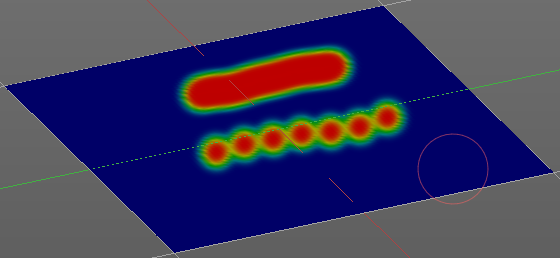

The icon behind the edit box enables tablet pressure sensitivity for tablets.

Jitter Edit Box
---------------

Here you can add Jitter to the brush while painting.

The icon in front of the edit box toggles between jittering in screen space and relative to brush size.

The icon behind the edit box enables tablet pressure sensitivity for tablets.

Input Samples Edit Box
----------------------

Average multiple input samples together to smooth the brush stroke.

Smooth Stroke
-------------

The brush lags behind the mouse position, and produces a much smoother stroke by that.

Smooth Stroke Radius Edit Box
-----------------------------

Is just active when Smooth Stroke is activated. Here you can adjust the radius of the smoothing.

Smooth Stroke Factor Edit Box
-----------------------------

Is just active when Smooth Stroke is activated. Here you can adjust the factor of the smoothing.

Stroke Panel with Stroke method Curve
-------------------------------------

The Stroke method curve doesn't simply influence the way how the stroke is painted. It is a special method. First you draw a curve object by holding down ctrl and clicking with left mouse button. Then you tweak the curve. You can click at the curve point, and drag out handlers to make the curve points smoooth.

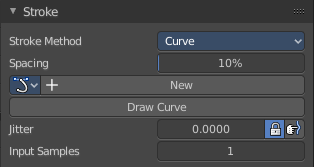

Then you hit the Draw Curve button. And the curve gets drawn onto the surface.

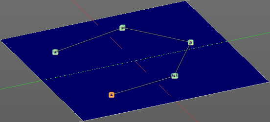

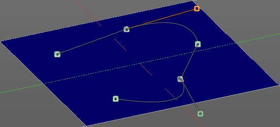

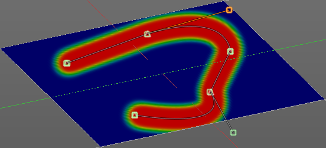

Spacing Edit Box
----------------

The drawing happens by mapping the pencil onto the mouse position. And when you move the mouse then the next mapping happens. Here you can adjust the spacing after what mouse movement the next mapping should happen. The lower the value, the lower the distance between the single dots.

The icon behind the edit box enables tablet pressure sensitivity for tablets.

Paint Curve edit box
--------------------

Here you set the active curve.

The first element is a dropdown box where you will find your curves objects. You can have more than one.

The second element is the edit box that displays the active curve.

The number right of it, in this case 2, indicates how much number of users ( internally ) this brush uses. This means that this data block (the brush) shares currently settings with at least one other object. Most probably the parent brush where we have created it from. Click at the value to make this brush a single user. The button will vanish then.

F set the brush to have a fake user. Zero user data-blocks are normally not saved. But sometimes you want to force the data to be kept even when the data block has no user.

The + button allows you to add a new pencil with the current settings. Note that the brushes are NOT saved when you close Bforartists. You can save them into the current blend file. Or you can save the startup file. But be careful here. This saves everything else of the current state of Bforartists too.

The X button deletes the brush as the active one. It does NOT delete it from the brushes list.

Draw Curve Button
-----------------

A click at it to turns the curve into a sculpt stroke.

Jitter Edit Box
---------------

Here you can add Jitter to the brush while painting.

The icon in front of the edit box toggles between jittering in screen space and relative to brush size.

The icon behind the edit box enables tablet pressure sensitivity for tablets.

Input Samples Edit Box
----------------------

Average multiple input samples together to smooth the brush stroke.

Stroke Panel with Stroke method Line
------------------------------------

With Stroke method line you draw a line between a starting point and a endpoint. And when you release the mouse then the line gets sculpted.

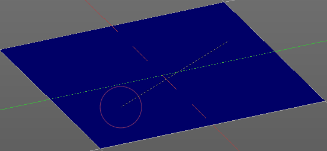

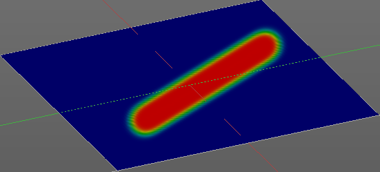

Spacing Edit Box
----------------

The sculpt drawing happens by mapping the pencil onto the mouse position. And when you move the mouse then the next mapping happens. Here you can adjust the spacing after what mouse movement the next mapping should happen. The lower the value, the lower the distance between the single dots.

The icon behind the edit box enables tablet pressure sensitivity for tablets.

Jitter Edit Box
---------------

Here you can add Jitter to the brush while painting.

The icon in front of the edit box toggles between jittering in screen space and relative to brush size.

The icon behind the edit box enables tablet pressure sensitivity for tablets.

Input Samples Edit Box
----------------------

Average multiple input samples together to smooth the brush stroke.

Stroke Panel with Stroke method Airbrush
----------------------------------------

The stroke acts like an airbrush pencil. The dots gets sprayed randomly.

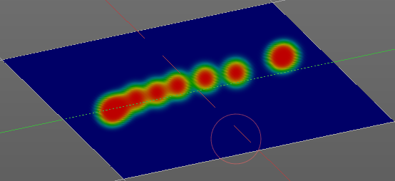

Rate Edit Box
-------------

Here you can define the rate of the drawing.

Jitter Edit Box
---------------

Here you can add Jitter to the brush while painting.

The icon in front of the edit box toggles between jittering in screen space and relative to brush size.

The icon behind the edit box enables tablet pressure sensitivity for tablets.

Input Samples Edit Box
----------------------

Average multiple input samples together to smooth the brush stroke.

Smooth Stroke
-------------

The brush lags behind the mouse position, and produces a much smoother stroke by that.

Smooth Stroke Radius Edit Box
-----------------------------

Is just active when Smooth Stroke is activated. Here you can adjust the radius of the smoothing.

Smooth Stroke Factor Edit Box
-----------------------------

Is just active when Smooth Stroke is activated. Here you can adjust the factor of the smoothing.

Stroke Panel with Stroke method Dots
------------------------------------

The stroke method Dots draws dots of the pencil onto the surface. The mapping happens from the current view. Means you will get distortions when your view is not aligned with the surface of the object.

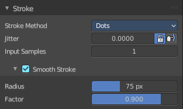

Jitter Edit Box
---------------

Here you can add Jitter to the brush while painting.

The icon in front of the edit box toggles between jittering in screen space and relative to brush size.

The icon behind the edit box enables tablet pressure sensitivity for tablets.

Input Samples Edit Box
----------------------

Average multiple input samples together to smooth the brush stroke.

Smooth Stroke
-------------

The brush lags behind the mouse position, and produces a much smoother stroke by that.

Smooth Stroke Radius Edit Box
-----------------------------

Is just active when Smooth Stroke is activated. Here you can adjust the radius of the smoothing.

Smooth Stroke Factor Edit Box
-----------------------------

Is just active when Smooth Stroke is activated. Here you can adjust the factor of the smoothing.

Tools Tab - Weight Paint Mode - Falloff Panel
=============================================

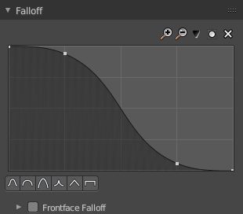

The curve panel allows you to define different fallofs methods for the border of the brush.

Navigation elements
-------------------

The navigation elements at the top are described from left to right.

Zoom in and out
---------------

The two buttons with the magnifying glass at it zooms in and out in the curve window.

Tools
-----

Tools is a menu where you can find some cuve related tools.

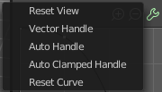

Reset View
----------

Resets the curve windows zoom.

Vector Handle
-------------

Set handle type to Vector.

Auto Handle
-----------

Set handle type to Auto.

Auto Clamped Handle
-------------------

Set handle type to Auto Clamped.

Reset Curve
-----------

Resets the curve to the initial shape.

Use Clipping
------------

Clipping options. Here you can set up clipping for the stroke. The button at the top enables or disables clipping

Delete Points
-------------

Deletes selected curve points

Curve Presets
-------------

Here you can find some predefined curve presets.

Frontface Falloff
-----------------

Blend the brush influence by how much they face the front.

Angle
-----

Paint most on faces printing towards the view according to the defined angle.

Tools Tab - Weight Paint Mode - Display Panel
=============================================

Curve Alpha
-----------

This setting is interesting for the Stroke method Curve. Here you can adjust how transparent the curve is.

The eye icon button at the end of the slider is to show the curve object in viewport. The brush icon button behind the slider is to hide the overlay during a stroke.

Show Brush
----------

Show the brush in 3D view.

Color
-----

The color that the brush cursor has.

CustomIcon
----------

Here you can define a custom icon for the brush.

Edit Box
--------

The button at the right allows you to load a custom brush image.

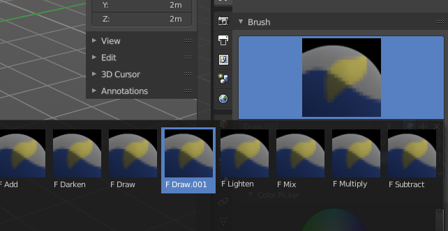

How to:

Select an existing brush type. Create a new brush out of it.

Now load our new brush. The image in the browser will turn into this icon.

.. image:: graphics/25.1.6_Editors_-_Properties_Editor_-_Tools_Tab_-_Weight_Paint_Mode/100002010000013F000000B07D800EEFE7DEA91F.png

To turn this into a own brush with own shape you would need to load a texture now too. This feature here just loads a icon for the currently active brush in the brush browser.

Tools Tab - Weight Paint Mode - Symmetry Panel
==============================================

Mirror
------

Mirror along given axis.

The same buttons plus the whole Symmetry Lock Panel as a dropdown menu can also be found in the tool settings bar as icon buttons. This allows quicker access and bettervisual control which mirror axis is currently active.

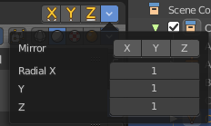

Radial
------

Tiling. The number of times to repeat the strokes across the surface.

Tools Tab - Weight Paint Mode - Options Panel
=============================================

Restrict
--------

Restrict painting to vertices in the group.

X Mirror
--------

X Axis Mirror Editing.

Topology Mirror
---------------

Needs X Mirror ticked. Use topology based mirroring. For when both sides of the mesh have matching, unique topology.

Unified Settings
----------------

Size
----

The radius of the brush is shared across brushes.

Strength
--------

The strength is shared across brushes.

Weight
------

The weight is shared across brushes.

