*******************************************************************
25.1.7 Editors - Properties Editor - Tools Tab - Texture Paint Mode
*******************************************************************

.. contents:: Contents

Tools Tab in Texture Paint Mode
===============================

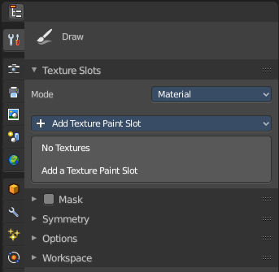

The Texture Paint Mode provides you the tools to paint directly at the texture of your mesh in the viewport. To fix visible seams for example.

The Texture Paint mode is just available for mesh objects.

Requirements
------------

Texture Painting requires to have a working UV mapping and a texture applied. When there is no UV mapping and no assigned texture, then you will get a warning about No Texture. You have to create a texture slot first.

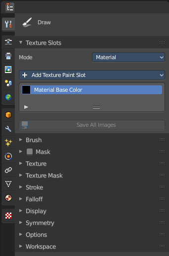

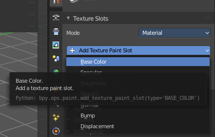

Open the Texture Paint Slot dropdown menu, and choose Base Color. This will call a menu where you can create a new blank texture.

Save Texture
------------

The result of texture painting can be found and be saved in the UV Image Editor. You can also paint in the UV editor.

The modified texture does NOT save with the scene. You have to save out the image when you want to save the changes at the texture. There is no warning. So DON'T FORGET TO SAVE THE TEXTURE.

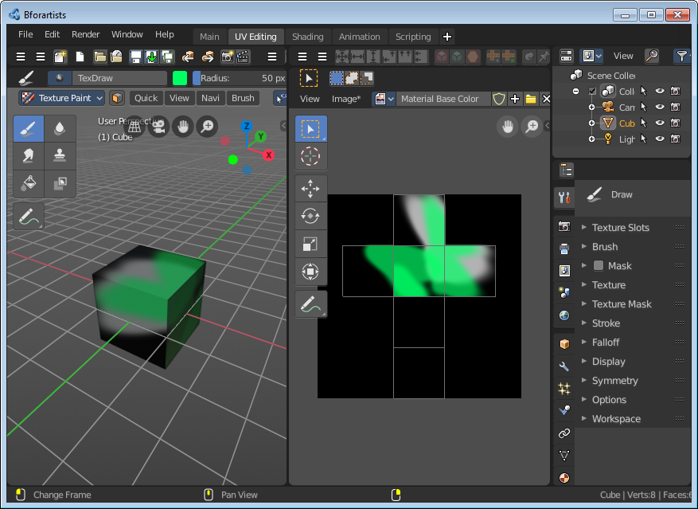

Texture Paint Mode - Texture Slots Panel
========================================

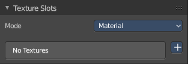

The texture slots panel allows you to manage the textures that you use for texture painting. When the mesh doesn't have a texture yet to paint at, then you get a hint about a missing texture. No Textures. The + button allows you to add one.

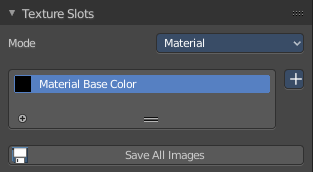

Mode 
-----

Here you can choose in which mode you want to paint. Single Image just works with a single image, without any material.

Material works with a material and a texture. The texture is here part of the material.

Paint Slot empty
----------------

In the texture slot panels you will see the texture slots in use. When the mesh does not have a texture or a material yet then you will get a warning displayed. No Textures. 

You can create a simple texture and material here too by clicking at the + button at the right.

Paint Slot with mode Material
-----------------------------

Material Paint Slot
-------------------

Here you can see the list of the available paint slot materials.

Add Texture Paint Slot
----------------------

The + button at the right. Here you can add more materials to the Material Paint Slot.

Paint Slot with Mode Single Image
---------------------------------

Image List
----------

Here you can find a list of the available images, and choose one in case one exists.

New/Open
--------

When no image is loaded then you can create a new image here, or load a new image.

Edit Box
--------

Here you can see the name of the image, and edit the name.

Fake User
---------

When enabled then this image will be stored internally. But not the painted changes at it!!

New Image
---------

Create a new image.

Open Image
----------

Open a image.

Unlink Data Block
-----------------

Delete the Image when saving the scene, closing and reopening Bforartists. Note that the number of Users must be zero. Or the image comes back.

UV Map
------

Here you can choose a UV map to work with. Usually there is just one. But there can be more than one UV map. You can add and manage more in the Object data tab in the UV Map panel.

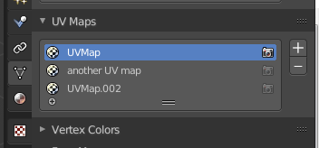

Interpolation
-------------

Here you can set the interpolation type. Linear or Closest.

Save all Images
---------------

Saves all images. Internal images needs to be saved manually first. They don't have a path yet to which they could be saved. You will get a invalid path warning.

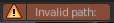

Texture Paint Mode - Brush Panel
================================

Brush Panel 
------------

The Brush Panel contains the different paintbrushes, a color dialog, and some brush settings.

Browse Brush
------------

The big image at the top is a dropdown box where you can see the current active brush. You can add duplicates of this active brush, and customize it to your needs. But the active brush gets chosen in the Tool Shelf at the left of the 3D View. 

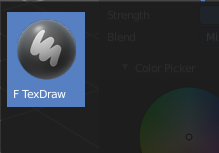

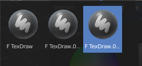

When you have added a few more brushes then the dropdown box may be more than full. You will see some little white arrows then. Either in the top left or in the bottom right corner. They indicate that some brushes are hidden before or after the current display.

To scroll to this hidden content use the mouse wheel, or the arrow up and down buttons at the keyboard.

The edit box below the Image shows you the name of the current active brush. 

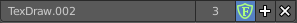

The number right of it, in this case 2, indicates how much number of users ( internally ) this brush uses. This means that this data block (the brush) shares currently settings with at least one other object. Most probably the parent brush where we have created it from. Click at the value to make this brush a single user. The button will vanish then.

Fake userset the brush to have a fake user. Zero user data-blocks are normally not saved. But sometimes you want to force the data to be kept even when the data block has no user.

The + button allows you to add a new pencil with the current settings. Note that the brushes are NOT saved when you close Bforartists. You can save them into the current blend file. Or you can save the startup file. But be careful here. This saves everything else of the current state of Bforartists too.

The X button deletes the brush as the active one. It does NOT delete it from the brushes list.

Radius 
-------

The Radius edit box allows you to adjust the radius of the brush. The button behind the edit box enables tablet pressure sensitivity for radius.

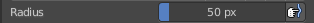

Strength
--------

The Strength edit box allows you to adjust the strength of the brush. The button behind the edit box enables tablet pressure sensitivity for strength.

Blend
-----

Here you can define how the stroke will blend. You can choose between various blend modes.

Color Picker
------------

Here you can define the color for your brush.

The active color is the left one. When you click the button with the two arrows down right then you can swap the color with the secondary color. Then this secondary color becomes the primary color, and is active.

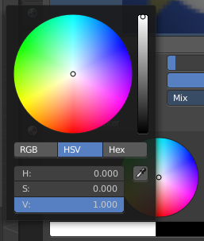

A click at one of the the color fields will open a more detailed color dialog, where you can set up the color by using rgb, hsv and hex colors and with value sliders.

Color Palette
-------------

Here you can create a color palette for later reuse. 

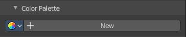

First create a new palette by clicking at New. Then adjust the color in the color picker. And then click at the add button to add this color to the palette.

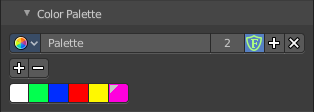

To set the color picker to a palette color simply click at this palette color. 

To remove a color from the palette, choose it, then click at the remove button. The active palette color that gets removed is the one with the triangle at it.

The color palette cannot be saved externally. It is part of the current blend file. You can however append color palettes from other blend files.

The elements are explained from left to right.

Palette browser
---------------

The button at the left opens a dropdown list where you can choose between your palettes.

Edit Box
--------

Here you can read the name of the currently active palette. You can also rename the palette here. A click into the edit box makes the name editable.

Number of users
---------------

Here you can see how many users the palette currently has.

Fake User
---------

Fake Usersets the element to have a fake user. Zero user data-blocks are normally not saved. But sometimes you want to force the data to be kept even when the data block has no user.

Add palette
-----------

Here you can add a new palette.

Remove Palette
--------------

Clicking at this button removes the palette. Note that you need to save, close Bforartists and reload the blend file to remove the palette completely.

Gradient
--------

This feature allows you to paint a gradient at the texture. Gradients are painted with the Fill tool. When you use the gradient tool with the draw tool, then you just paint with the hightest color of the gradient. This doesn't create a gradient then.

Usage
-----

Set up the gradient in the Gradient dialog.

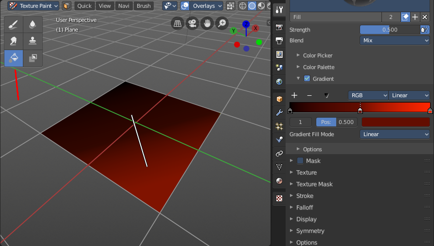

Choose the Fill pencil. Gradient will not work with other pencils.

Click at the start point of the gradient. 

Drag the mouse to the end point of the gradient. This will draw a line that defines the gradient direction.

Release the mouse.

The + Button adds a color stop point, which can be moved around. That way you can have more than one color in the gradient.

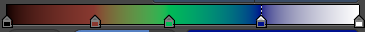

The - Button removes the currently selected color stop point.

Tools Menu 
-----------

Flip Color ramp flips the color ramp.

Distribute Stops from Left distributes the color stops from the left. The position at the right will remain empty.

Distribute Stops evenly distributes the color stops evenly across the gradient.

Eyedropper allows you to pick a color from the gradient.

Reset color ramp resets the color ramp to the default state.

Color Mode is a dropdown box where you can choose the color mode for the gradient.

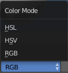

Interpolation is a dropdown box where you can choose the interpolation mode for the gradient. 

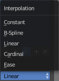

In the Color Ramp element you will see the color ramp with the single color points.

.. image:: graphics/25.1.7_Editors_-_Properties_Editor_-_Tools_Tab_-_Texture_Paint_Mode/100002010000016F0000001BD707FA2BE116305F.png

Choose Active Color Stop is the stop point of the gradient.

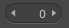

Position is a edit box where you can numerically fine tune the position of the currently selected color stop.

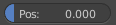

Color Ramp Element displays the color of the current selected color stop. When you click at it then you can open a color picker to change the color of the current color stop.

Background Color
----------------

Background color is the same color than the secondary color from the color picker. When you click at it then you can open a color picker to change the secondary color.

Gradient Stroke Mode
--------------------

Here you can set the gradient stroke mode.

Options
-------

Accumulate
----------

Accumulates stroke daubs on top of each other.

Adjust Strength for Spacing
---------------------------

Automatically adjust the strength for spacing to give consistent results for different spacings.

Affect Alpha
------------

When unchecked, lock Alpha while painting.

Texture Paint Mode - Mask Panel
===============================

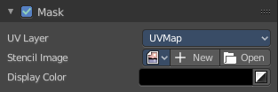

Here you can load a stencil map to mask out parts of the texture. You have to activate it in the panel header.

UV Map
------

A dropdown box with the UV map to use for image painting. A mesh can have more than one material and more than one UV Map applied.

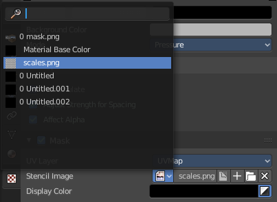

Stencil Image
-------------

Here you can choose or create a Image that gets used for the masking. You can choose any image that is loaded.

Fake userset the brush to have a fake user. Zero user data-blocks are normally not saved. But sometimes you want to force the data to be kept even when the data block has no user.

The + button allows you to add a new pencil with the current settings. Note that the brushes are NOT saved when you close Bforartists. You can save them into the current blend file. Or you can save the startup file. But be careful here. This saves everything else of the current state of Bforartists too.

The folder button allows you to browser for an image to load it.

The X button deletes the brush as the active one. It does NOT delete it from the brushes list.

Display Color
-------------

You usually want a black n white image for masking. But here you can set up the color for the stencil map. A click at the button opens a color dialog. The button at the right flips the colors. 

Texture Paint Mode - Texture Panel
==================================

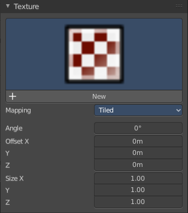

Texture Panel
-------------

The Texture panel allows you to paint with textures. This allows you for example to grab a foto from some fish scales, and simply paint them onto the mesh by using this image as a pencil. Or as a blueprint where you calk through ( Stencil method ).

Browse Texture to be linked
---------------------------

The image at the top of the panel is a image browser. Here you can choose a texture that you can choose for painting then. You can also have more than one image loaded at once. 

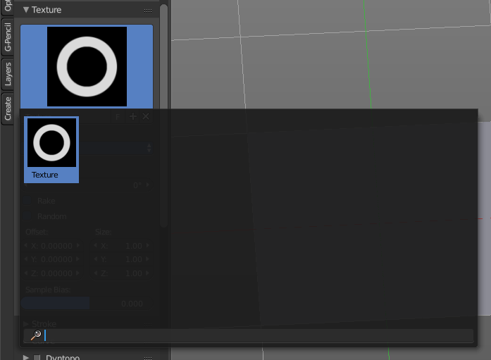

In this shot there is already a texture added. The way to add the texture here is a bit more complicated. And not done with clicking at the New button.

First click at the New button below the image. This will create a new texture slot. This slot is still empty, it displays black. 

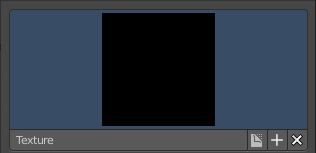

We need to load a texture in this slot. This must be done in the Properties editor in the Textures tab.

The problem is, we have an object with a material and a texture already selected. And when we change this texture , then we don't get the pencil texture loaded. But we change the texture at our mesh.

What we need to do is to create a material first. And in this material we load our pencil texture then. And then this texture becomes available in the image browser of the Texture panel.

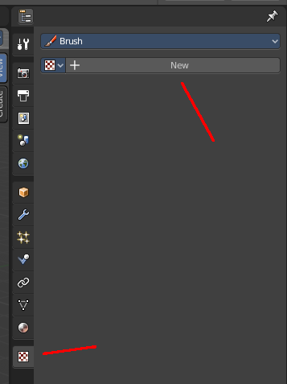

.. image:: graphics/25.1.7_Editors_-_Properties_Editor_-_Tools_Tab_-_Texture_Paint_Mode/100002010000015A000001E8001A5F0BFDE01983.png

.. image:: graphics/25.1.7_Editors_-_Properties_Editor_-_Tools_Tab_-_Texture_Paint_Mode/1000020100000154000000DEC60309A689328201.png

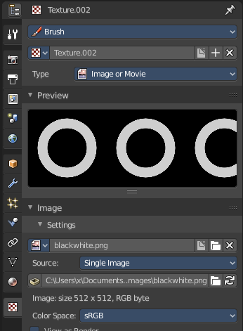

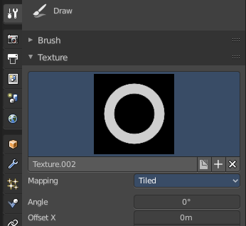

And when we switch back to the tools tab, then the texture is loaded. And we can work with this texture.

Texture Edit box
----------------

The Texture edit box is the edit box below the Image browser. When there's no image loaded then it displays the New button. When there's a image (or more) loaded, then you will see the name of the current texture. 

The F button turns this texture into a data block with a fake user. Means it will exists even when there is no data connected to it anymore.

When you activate Fake User, then you may get a value in front of it, which displays how much users this data block (our texture slot) currently has.

The + Button adds another texture slot. Note that you will have to load a texture too, as explained above.

The X button deletes the texture slot.

Brush Mapping
-------------

Our texture can be mapped in different methods. The Brush mapping is a dropdown box where you can choose this different brush mapping methods.

The settings vary. So we will go through them by the different brush mapping methods.

Brush Mapping with mapping method Tiled
---------------------------------------

The brush mapping method Tiled tiles the brush stroke at the surface. The mapping happens from the current view. The result may be distorted when the view does not align with the surface of the object.

Angle
-----

The angle of the brush.

.. image:: graphics/25.1.7_Editors_-_Properties_Editor_-_Tools_Tab_-_Texture_Paint_Mode/1000020100000207000000F2864E89BB7EDBDCA7.png

Offset 
-------

The offset of the texture in the brush.

Size
----

The size of the texture in the brush.

Brush Mapping with mapping method View Plane
--------------------------------------------

The brush mapping method View Plane simply paints onto the surface. The mapping happens from the current view. The result may be distorted when the view does not align with the surface of the object.

Angle
-----

The angle of the brush.

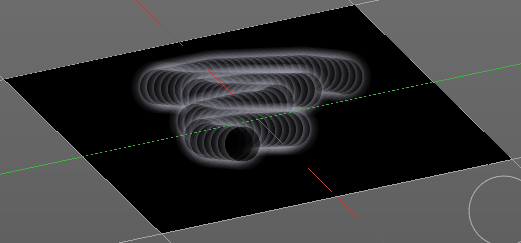

Rake
----

The angle follows the direction of the brush stroke. 

Random
------

The brush angle gets set random.

Offset 
-------

The offset of the texture in the brush.

Size
----

The size of the texture in the brush.

Brush Mapping with mapping method 3D
------------------------------------

The brush mapping method 3D paints the texture at the surface, by tiling it 1/1 at the object surface. 

Offset 
-------

The offset of the texture in the brush.

Size
----

The size of the texture in the brush.

Brush Mapping with mapping method Random
----------------------------------------

The brush mapping method Random paints onto the surface, and randomizes the texture position in the brush while that. The mapping happens from the current view. The result may be distorted when the view does not align with the surface of the object.

Angle
-----

The angle of the brush.

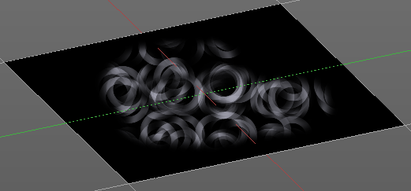

Rake
----

The angle follows the direction of the brush stroke. 

Random
------

The brush angle gets set random.

Brush Mapping with mapping method Stencil
-----------------------------------------

The former methods uses the textures for the brush. The method Stencil works different. You have your texture displayed in the workspace above the object, and you paint this texture onto your object with your pencil strokes.

Note that the texture in the 3d space is just visible when you are with the mouse over the viewport.

It gets by default displayed down left. You have to position it where you need it. See Brush menu, Stencil Texture controls.

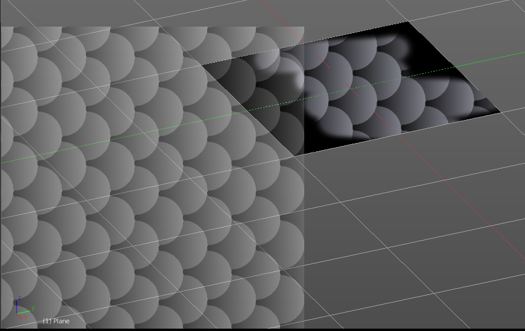

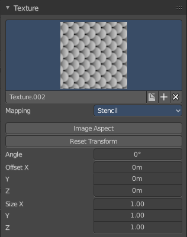

Image Aspect
------------

Adjust the stencil size to fit to the image aspect ratio.

Reset Transform
---------------

Resets the stencil image to be down right in the 3D view.

Angle edit box
--------------

Here you can adjust the angle of the brush. The button at the end allows you to set the radius by dragging the mouse. This should be done in the viewport and with the hotkey. This button is just a visible reminder.

Offset
------

Fine tune the offset of the texture in the brush.

Size
----

Fine tune the size of the texture in the brush. 

Texture Paint Mode - Texture Mask Panel
=======================================

Texture Mask Panel
------------------

The texture mask panel allows you to use a texture as a mask to define the strength of painting. In the shot example we use a tiled fishscale Texture as a pencil, and a stencil map as our texture mask. And it paints just where the mask texture is bright. You can of course use gradients here to define the paint strength.

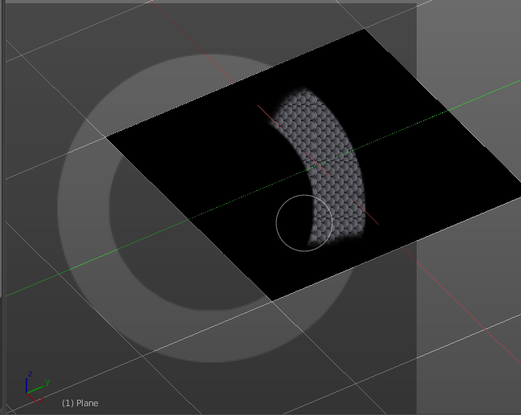

Browse Texture to be linked
---------------------------

The image at the top of the panel is a image browser. Here you can choose a texture that you can choose for painting then. You can also have more than one image loaded at once. 

In this shot there is already two textures added. The way to add the texture here is a bit more complicated. And not done with clicking at the New button.

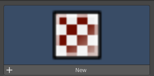

First click at the New button below the image. This will create a new texture slot. This slot is still empty, it displays black. 

We need to load a texture in this slot. This must be done in the Properties editor in the Textures tab.

The problem is, we have an object with a material and a texture already selected. And when we change this texture , then we don't get the pencil texture loaded. But we change the texture at our mesh.

What we need to do is to create a material first. And in this material we load our pencil texture then. And then we can choose this texture in the image browser of the texture.

.. image:: graphics/25.1.7_Editors_-_Properties_Editor_-_Tools_Tab_-_Texture_Paint_Mode/100002010000015A000001E8001A5F0BFDE01983.png

.. image:: graphics/25.1.7_Editors_-_Properties_Editor_-_Tools_Tab_-_Texture_Paint_Mode/1000020100000154000000DEC60309A689328201.png

And when we switch back to the tools tab, then the texture is loaded. And we can work with this texture.

Brush Mapping with mapping method Tiled
---------------------------------------

The brush mapping method Tiled tiles the brush stroke at the surface. The mapping happens from the current view. The result may be distorted when the view does not align with the surface of the object.

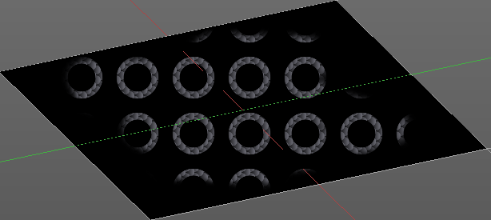

Mask Pressure Mode
------------------

A dropdown box where you can choose the mask pressure mode for tablets.

Angle
-----

The angle of the brush.

Offset 
-------

The offset of the texture in the brush.

Size
----

The size of the texture in the brush.

Brush Mapping with mapping method View Plane
--------------------------------------------

The brush mapping method View Plane simply paints onto the surface. The mapping happens from the current view. The result may be distorted when the view does not align with the surface of the object.

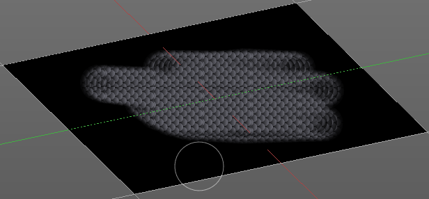

Mask Pressure Mode
------------------

A dropdown box where you can choose the mask pressure mode for tablets.

Angle
-----

The angle of the brush.

Rake
----

The angle follows the direction of the brush stroke. 

Random
------

The brush angle gets set random.

Offset 
-------

The offset of the texture in the brush.

Size
----

The size of the texture in the brush.

Brush Mapping with mapping method Random
----------------------------------------

The brush mapping method Random paints onto the surface, and randomizes the texture position in the brush while that. The mapping happens from the current view. The result may be distorted when the view does not align with the surface of the object.

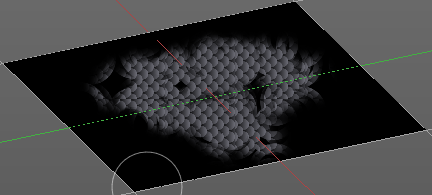

Mask Pressure Mode
------------------

A dropdown box where you can choose the mask pressure mode for tablets.

Angle
-----

The angle of the brush.

Rake
----

The angle follows the direction of the brush stroke. 

Random
------

The brush angle gets set random.

Offset 
-------

The offset of the texture in the brush.

Size
----

The size of the texture in the brush.

Brush Mapping with mapping method Stencil
-----------------------------------------

The former methods uses the textures for the brush. The method Stencil works different. You have your texture displayed in the workspace above the object, and you paint this texture onto your object with your pencil strokes.

Note that the texture in the 3d space is just visible when you are with the mouse over the viewport.Note that the texture in the 3d space is just visible when you are with the mouse over the viewport. It gets by default displayed down left. You have to position it where you need it. See Brush menu, Stencil Texture controls.

Mask Pressure Mode
------------------

A dropdown box where you can choose the mask pressure mode for tablets.

Angle edit box
--------------

Here you can adjust the angle of the brush. The button at the end allows you to set the radius by dragging the mouse. This should be done in the viewport and with the hotkey. This button is just a visible reminder.

Offset
------

Fine tune the offset of the texture in the brush.

Size
----

Fine tune the size of the texture in the brush. 

Texture Paint Mode - Stroke Panel
=================================

Stroke Panel
------------

The Stroke panel contains settings to influence the behaviour of the brush stroke. There are various stroke methods available. We will go through them one by one.

Stroke Panel with Stroke method Space
-------------------------------------

This is the default Stroke method. The sculpt stroke gets added continuously with given settings.

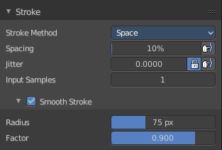

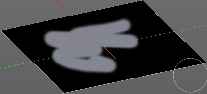

Spacing Edit Box
----------------

The sculpt drawing happens by mapping the pencil onto the mouse position. And when you move the mouse then the next mapping happens. Here you can adjust the spacing after what mouse movement the next mapping should happen. The lower the value, the lower the distance between the single dots.

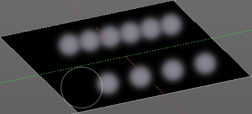

The icon behind the edit box enables tablet pressure sensitivity for tablets.

Jitter Edit Box
---------------

Here you can add Jitter to the brush while painting.

The icon in front of the edit box toggles between jittering in screen space and relative to brush size.

The icon behind the edit box enables tablet pressure sensitivity for tablets.

Input Samples Edit Box
----------------------

Average multiple input samples together to smooth the brush stroke.

Smooth Stroke
-------------

The brush lags behind the mouse position, and produces a much smoother stroke by that.

Smooth Stroke Radius Edit Box
-----------------------------

Is just active when Smooth Stroke is activated. Here you can adjust the radius of the smoothing.

Smooth Stroke Factor Edit Box
-----------------------------

Is just active when Smooth Stroke is activated. Here you can adjust the factor of the smoothing.

Stroke Panel with Stroke method Curve
-------------------------------------

The Stroke method curve doesn't simply influence the way how the stroke is painted. It is a special method. First you draw a curve object by holding down ctrl and clicking with left mouse button. Then you tweak the curve. You can click at the curve point, and drag out handlers to make the curve points smoooth.

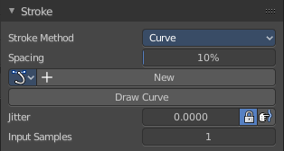

Then you hit the Draw Curve button. And the curve gets drawn onto the surface.

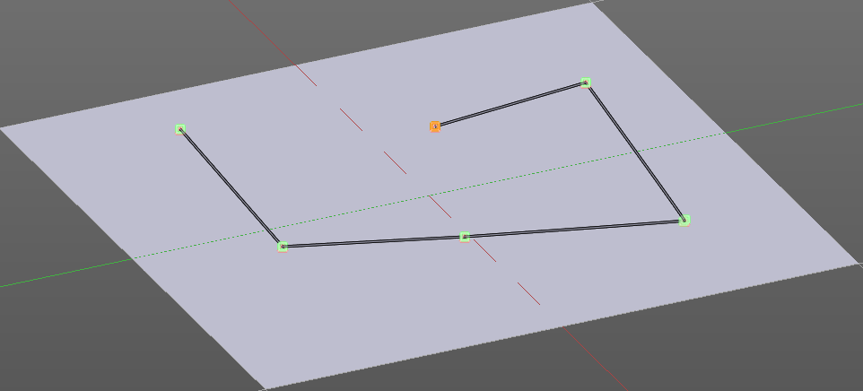

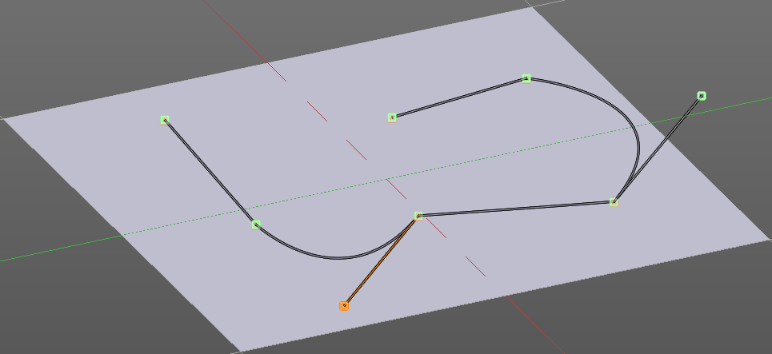

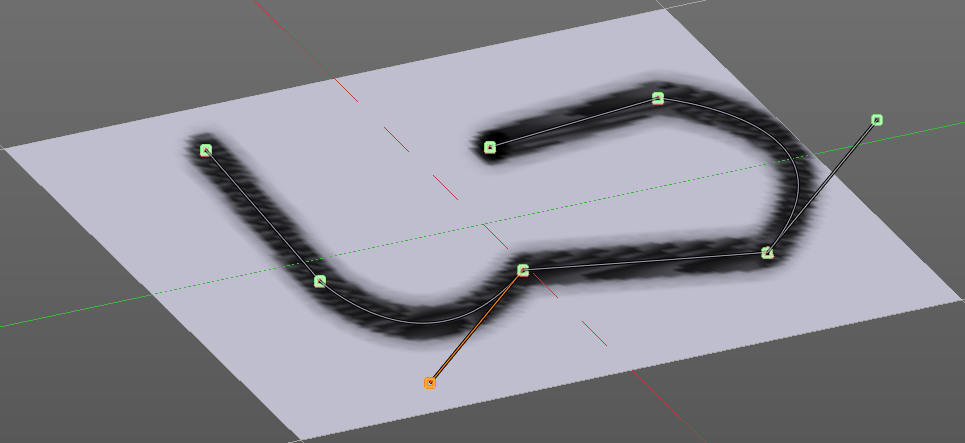

Spacing Edit Box
----------------

The drawing happens by mapping the pencil onto the mouse position. And when you move the mouse then the next mapping happens. Here you can adjust the spacing after what mouse movement the next mapping should happen. The lower the value, the lower the distance between the single dots.

The icon behind the edit box enables tablet pressure sensitivity for tablets.

Paint Curve edit box
--------------------

Here you set the active curve.

The first element is a dropdown box where you will find your curves objects. You can have more than one.

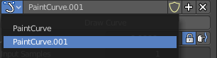

The second element is the edit box that displays the active curve.

The number right of it, in this case 2, indicates how much number of users ( internally ) this brush uses. This means that this data block (the brush) shares currently settings with at least one other object. Most probably the parent brush where we have created it from. Click at the value to make this brush a single user. The button will vanish then.

F set the brush to have a fake user. Zero user data-blocks are normally not saved. But sometimes you want to force the data to be kept even when the data block has no user.

The + button allows you to add a new pencil with the current settings. Note that the brushes are NOT saved when you close Bforartists. You can save them into the current blend file. Or you can save the startup file. But be careful here. This saves everything else of the current state of Bforartists too.

The X button deletes the brush as the active one. It does NOT delete it from the brushes list.

Draw Curve Button
-----------------

A click at it to turns the curve into a sculpt stroke.

Jitter Edit Box
---------------

Here you can add Jitter to the brush while painting.

The icon in front of the edit box toggles between jittering in screen space and relative to brush size.

The icon behind the edit box enables tablet pressure sensitivity for tablets.

Input Samples Edit Box
----------------------

Average multiple input samples together to smooth the brush stroke.

Stroke Panel with Stroke method Line
------------------------------------

With Stroke method line you draw a line between a starting point and a endpoint. And when you release the mouse then the line gets sculpted.

Spacing Edit Box
----------------

The drawing happens by mapping the pencil onto the mouse position. And when you move the mouse then the next mapping happens. Here you can adjust the spacing after what mouse movement the next mapping should happen. The lower the value, the lower the distance between the single dots.

The icon behind the edit box enables tablet pressure sensitivity for tablets.

Jitter Edit Box
---------------

Here you can add Jitter to the brush while painting.

The icon in front of the edit box toggles between jittering in screen space and relative to brush size.

The icon behind the edit box enables tablet pressure sensitivity for tablets.

Input Samples Edit Box
----------------------

Average multiple input samples together to smooth the brush stroke.

Stroke Panel with Stroke method Anchored
----------------------------------------

Click and drag to place a dot and to scale it.

Edge to edge
------------

Drag Anchor Brush from edge to edge.

Jitter
------

Adds a jitter to the dot.

Input Sample Edit Box
---------------------

Average multiple input samples together to smooth the brush stroke.

Stroke Panel with Stroke method Airbrush
----------------------------------------

The stroke acts like an airbrush pencil. The dots gets placed randomly.

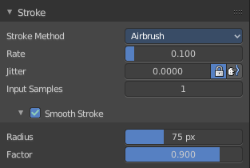

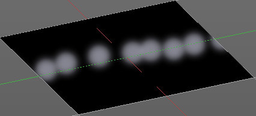

Rate Edit Box
-------------

Here you can define the rate of the drawing.

Jitter Edit Box
---------------

Here you can add Jitter to the brush while painting.

The icon in front of the edit box toggles between jittering in screen space and relative to brush size.

The icon behind the edit box enables tablet pressure sensitivity for tablets.

Input Samples Edit Box
----------------------

Average multiple input samples together to smooth the brush stroke.

Smooth Stroke
-------------

The brush lags behind the mouse position, and produces a much smoother stroke by that.

Smooth Stroke Radius Edit Box
-----------------------------

Is just active when Smooth Stroke is activated. Here you can adjust the radius of the smoothing.

Smooth Stroke Factor Edit Box
-----------------------------

Is just active when Smooth Stroke is activated. Here you can adjust the factor of the smoothing.

Stroke Panel with Stroke method Drag Dots
-----------------------------------------

Paint a dot and drag it around. The actual painting happens then at releasing the mouse

Jitter Edit Box
---------------

Here you can add Jitter to the brush while painting.

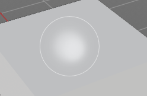

The icon in front of the edit box toggles between jittering in screen space and relative to brush size.

The icon behind the edit box enables tablet pressure sensitivity for tablets.

Input Samples Edit Box
----------------------

Average multiple input samples together to smooth the brush stroke.

Stroke Panel with Stroke method Dots
------------------------------------

The stroke method Dots draws dots of the pencil onto the surface. The mapping happens from the current view. Means you will get distortions when your view is not aligned with the surface of the object.

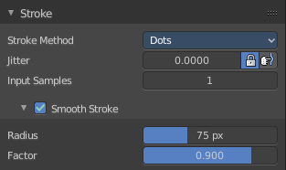

Jitter Edit Box
---------------

Here you can add Jitter to the brush while painting.

The icon in front of the edit box toggles between jittering in screen space and relative to brush size.

The icon behind the edit box enables tablet pressure sensitivity for tablets.

Input Samples Edit Box
----------------------

Average multiple input samples together to smooth the brush stroke.

Smooth Stroke
-------------

The brush lags behind the mouse position, and produces a much smoother stroke by that.

Smooth Stroke Radius Edit Box
-----------------------------

Is just active when Smooth Stroke is activated. Here you can adjust the radius of the smoothing.

Smooth Stroke Factor Edit Box
-----------------------------

Is just active when Smooth Stroke is activated. Here you can adjust the factor of the smoothing.

Texture Paint Mode - Falloff Panel
==================================

The curve panel allows you to define different fallofs methods for the border of the brush.

Navigation elements
-------------------

The navigation elements at the top are described from left to right.

Zoom in and out
---------------

The two buttons with the magnifying glass at it zooms in and out in the curve window.

Tools
-----

Tools is a menu where you can find some cuve related tools.

.. image:: graphics/25.1.7_Editors_-_Properties_Editor_-_Tools_Tab_-_Texture_Paint_Mode/10000201000000B400000067138C6BB418FD37EE.png

Reset View
----------

Resets the curve windows zoom.

Vector Handle
-------------

Set handle type to Vector.

Auto Handle
-----------

Set handle type to Auto.

Auto Clamped Handle
-------------------

Set handle type to Auto Clamped.

Reset Curve
-----------

Resets the curve to the initial shape.

Use Clipping
------------

Clipping options. Here you can set up clipping for the stroke.

Delete Points
-------------

Deletes selected curve points

Curve Presets
-------------

Here you can find some predefined curve presets.

Texture Paint Mode - Display Panel
==================================

Curve Alpha
-----------

This setting is interesting for the Stroke method Curve. Here you can adjust how transparent the curve is.

The eye icon button in front of the slider is to show the curve object in viewport. The brush icon button behind the slider is to hide the overlay during a stroke.

Texture Alpha
-------------

This setting is interesting for Texture painting. Here you can adjust how transparent the texture is.

The eye icon button in front of the slider is to show the texture in the viewport. The brush icon button behind the slider is to hide the overlay during a stroke.

Mask Texture Alpha
------------------

This setting is interesting for Texture painting. Here you can adjust how transparent the Mask texture is.

The eye icon button in front of the slider is to show the texture in the viewport. The brush icon button behind the slider is to hide the overlay during a stroke.

Appearance
----------

The Appearance subtab provides you with some settings to adjust the appearance of the brush.

Show Brush
----------

Show the brush in 3D view.

Color
-----

The color that the brush cursor has.

CustomIcon
----------

Here you can define a custom icon for the brush.

Edit Box
--------

The button at the right allows you to load a custom brush image.

.. image:: graphics/25.1.7_Editors_-_Properties_Editor_-_Tools_Tab_-_Texture_Paint_Mode/10000201000002820000014CBD227624FDBF860B.png

How to:

Select an existing brush type. Create a new brush out of it.

Now load our new brush. The image in the browser will turn into this icon.

To turn this into a own brush with own shape you would need to load a texture now too. This feature here just loads a icon for the currently active brush in the brush browser.

Texture Paint Mode - Symmetry Panel
===================================

Symmetry Panel
--------------

Here you can turn on/off symmetry painting along X, Y and Z axis. The mirroring happens along the world axis.

The same buttonscan also be found in the tool settings bar as icon buttons. This allows quicker access and better visual control which mirror axis is currently active.

Texture Paint Mode - Options Panel
==================================

Bleed
-----

An edit box to adjust the amount of bleeding into the areas outside of the faces uv.

Dither
------

An Edit box to adjust the amount of dither when painting on byte images

Occlude
-------

Only paint the faces directly under the mouse.

Backface Culling
----------------

Ignore faces that are painting away from the viewport.

Cavity Mask
-----------

Cavity mask allows mask painting according to mesh geometry cavity. It is a submenu tab. In expanded state it shows the falloff curve, which can be edited.

Navigation elements
-------------------

The navigation elements at the top are described from left to right.

Zoom in and out
---------------

The two buttons with the magnifying glass at it zooms in and out in the curve window.

Zoom in and out
---------------

The two buttons with the magnifying glass at it zooms in and out in the curve window.

Tools
-----

Tools is a menu where you can find some cuve related tools.

.. image:: graphics/25.1.7_Editors_-_Properties_Editor_-_Tools_Tab_-_Texture_Paint_Mode/10000201000000B400000067138C6BB418FD37EE.png

Reset View
----------

Resets the curve windows zoom.

Vector Handle
-------------

Set handle type to Vector.

Auto Handle
-----------

Set handle type to Auto.

Auto Clamped Handle
-------------------

Set handle type to Auto Clamped.

Reset Curve
-----------

Resets the curve to the initial shape.

Use Clipping
------------

Clipping options. Here you can set up clipping for the stroke.

Delete Points
-------------

Deletes selected curve points.

Unified Brush
-------------

Unified Brush is a subtab menu with some global brush settings.

Size
----

Instead of per Brush radius, the radius is shared across brushes.

Strength
--------

Instead of per Brush strength, the strength is shared across brushes.

Color
-----

Instead of per Brush color, the color is shared across brushes.

External
--------

The external subpanel allows you to do projection painting by using an external 2d image editor. The projection happens from the current view. So this can lead to distortions.

Screen Grab Size
----------------

Here you can set the resolution of the shot.

Quick Edit 
-----------

Opens a shot of the current view in your 2D Image Editor.

Apply
-----

Applies the changes that you made and saved in your 2D Image Editor.

Apply Camera Image
------------------

Project an edited render from the active camera back onto the object.

This feature requires to have a background image loaded. Then this background image can be projected onto the object from the camera view.

Workflow for external editing
-----------------------------

Preparations
------------

You first have to link your software that you want to use here. When there is no image editor linked then you will get a warning.

Open the User Preferences, go to the File tab. Here choose the Image Editor section, and browse for your image editor. I have chosen Gimp here at Windows 7.

Don't forget to save the User Settings!

For further options have a look in the Project Paint panel.

Usage
-----

Click at the Quick Edit Button. And your image editor will open up with a shot from the current view. Modify your image. 

When done simply overwrite the image. Sorry for the german shot ...

Back in Bforartists click at the Apply button. And the result gets mapped onto your object.

Attention, don't change the camera view while doing this. Mapping happens from the current camera view!

