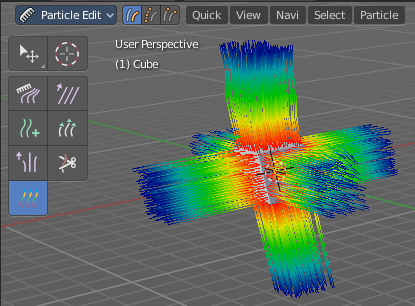
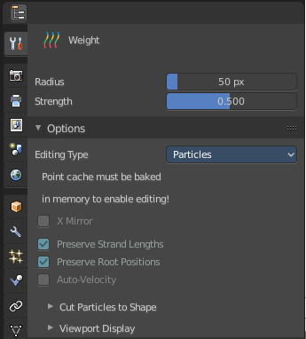
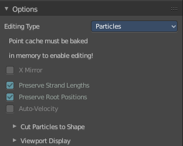
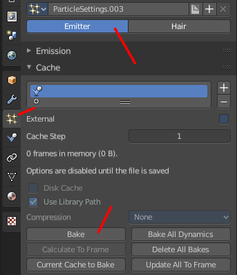
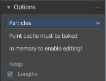
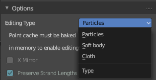

*******************************************************************
25.1.8 Editors - Properties Editor - Tools Tab - Particle Edit Mode
*******************************************************************

.. contents:: Contents

Tools Tab in Particle Edit Mode
===============================

The Particle Edit mode enables to edit particle settings. For example, Hair Particles can be manipulated with some brushes. They can be combed, cut etc.

The Tools tab contains the settings for the hair editing brushes.

Different from the other paint modes, there is no brush panel. The brushes are here part of the tool settings of the single brushes. The brush settings will be covered in the 3D view in the chapter for Particle Edit Mode.

Particle Edit Mode- Options panel
=================================

Here you can find some further options for the particles.

Note that you need to bake some particle types to be able modify them. Emitter for example. You will get a warning then, and the Options panel content is greyed out. 

The particles can be baked in the Particles tab in the Cache panel.

Particle Edit Type
------------------

The Particle Edit Type. This edit box just shows you what particle type you currently have. It does not allow you to change the particle type.

X Mirror
--------

Mirrors the selected particles.

If you want a symmetrical haircut, first select all particles, then mirror the particles, then tick X Mirror.

Preserve Strand Lengths
-----------------------

Keep the path lengths constant.

Preserve Root Positions
-----------------------

Keep root keys unmodified.

Auto-Velocity
-------------

Calculate Point Velocitys automatically.

Cut particles to Shape
----------------------

Here you can define a object to cut the hair particles into the shape of the object.

Viewport Display
----------------

With Hair
---------

Path Steps
----------

How many steps to display the path with. Meant is the resolution for the hair straints. 

Children
--------

Display all particles, including children. For performance reasons child particles are usually not displayed in the viewport.

With Emitter
------------

Path Steps
----------

How many steps to display the emitter path with.

Particles
---------

Display the actual particles.

Fade Time
---------

Fade paths and keys further away from the current frame

Frames
------

How many frames to fade.

