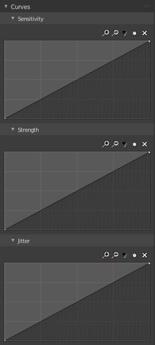
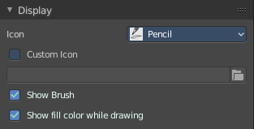

*********************************************************************
25.1.9 Editors - Properties Editor - Tools Tab - Grease Pencil Object
*********************************************************************

.. contents:: Contents

Tools Tab - Grease Pencil Object
================================

The Grease Pencil Object is a very special object which deserves its own chapter. Even when it has some modes that other objects has too. It is simply too special.

The Grease Pencil Object allows you to draw in 2D in the workspace.

It starts as an object type. By switchting into paint mode it becomes a paint feature. And editing turns it into a curve or a mesh object then.

In the Tools tab you will find all the options and settings for drawing and manipulating the grease pencil object, means your drawing.

The type Blank allows you to draw strokes. 

The type Stroke allows you to draw filled forms.

The type Monkey is just an example object.

Grease Pencil - Draw Mode - Brush Panel
=======================================

Brush Browser
-------------

Here you can choose between the different brushes. It's the same than in the tool shelf.

Create Presets
--------------

Here you can create a brush preset set. 

Not documented. Not to find out how this one works. Waiting for the Blender manual here ...

Brush Name Edit Box
-------------------

The edit box below the Image shows you the name of the current active brush. 

The number right of it, in this case 2, indicates how much number of users ( internally ) this brush uses. This means that this data block (the brush) shares currently settings with at least one other object. Most probably the parent brush where we have created it from. Click at the value to make this brush a single user. The button will vanish then.

Fake Userset the brush to have a fake user. Zero user data-blocks are normally not saved. But sometimes you want to force the data to be kept even when the data block has no user.

The + button allows you to add a new pencil with the current settings. Note that the brushes are NOT saved when you close Bforartists. You can save them into the current blend file. Or you can save the startup file. But be careful here. This saves everything else of the current state of Bforartists too.

The X button deletes the brush as the active one. It does NOT delete it from the brushes list.

Material Browser
----------------

This browser is just active when the Keep material assigned to Brush Pin is activated.

The colors for the grease pencil are materials each. For the grease pencil type Blank you will just have one color available. For this type you have to cteate new matertials in the material tab first when you need more colors. But the other two types, strokes and monkey, comes with a few base materials already. Which can be found in the Materials tab.

The tool settings above the header shows this panel too. And here you can quickly change the color of a material. It is explained in the chapter Materials Tab.

Dropdown box
------------

Here you can choose another material to draw with.

Edit Box
--------

Here you can read and modify the material name.

F set the material to have a fake user. Zero user data-blocks are normally not saved. But sometimes you want to force the data to be kept even when the data block has no user.

The X button deletes the material as the active one. It does NOT delete it from the materials list.

Keep material assigned to Brush Pin pins the brush to this material.

Radius 
-------

The Radius edit box allows you to adjust the radius of the brush. When the Lock symbol at the front is ticked, then the pencil keeps its size relative to the object when zooming in and out. The button behind the edit box enables tablet pressure sensitivity for radius.

Strength
--------

The Strength edit box allows you to adjust the strength of the brush. When the Lock symbol at the front is ticked, then the pencil keeps its strength relative to the object when zooming in and out. The button behind the edit box enables tablet pressure sensitivity for strength.

Grease Pencil - Draw Mode - Options Panel
=========================================

Here you can find some grease pencil related options.

Presets
-------

In the header you can find a presets menu. Here you can store your own presets, and reuse them at a later point.

Input Samples
-------------

Generate intermediate Points for very fast mouse movements. A value of 0 means this feature is disabled.

Active Smooth
-------------

The amount of smoothing the strokes while drawing.

Angle
-----

Direction of the stroke at which it gives the biggest thickness.

Factor
------

Reduce the brush thickness by this amount when the stroke is perpendicular to "Angle" direction.

Post Processing Settings
------------------------

Post processing settings is a sub menu. Here you can enable some post processing steps to manipulate the strokes that you currently draw.

You can activate or deactivate it by the checkbox in the header.

Note that you need to have this one enabled when you draw the stroke. It cannot manipulate already created stokes. Just the ones that you currently paint.

Smooth
------

Smooth the stroke form.

Iterations
----------

How much iterations to use for smoothing.

Smooth Thickness
----------------

Smooth the stroke thickness

Iterations
----------

How much iterations to use for smoothing.

Subdivision Steps
-----------------

Subdivide the strokes.

Randomness
----------

Randomness for subdivision.

Stabilizer Settings
-------------------

Stabilizer Settings is a sub menu. Here you can find some further stabilization settings.

You can activate or deactivate it by the checkbox in the header.

Radius
------

Minimum radius from last point before drawing continues.

Factor
------

Smooth stroke factor. Higher values gives a smoother stroke.

Random Settings
---------------

Random Settings is a sub menu. Here you can find some functionality to randomize your strokes.

You can activate or deactivate it by the checkbox in the header.

Pressure
--------

Randomize the pressure.

Strength
--------

Randomize the strength.

UV
--

Random factor for auto generated UV Rotation.

Jitter
------

Add some jitter to the strokes.

Grease Pencil - Draw Mode - Curves Panel
========================================

Here you can see and manipulate the curves for drawing Sensitivity, Strength and Jitter.

The navigation elements are the same for all three curve types.

Navigation elements
-------------------

The navigation elements at the top are described from left to right.

Zoom in and out
---------------

The two buttons with the magnifying glass at it zooms in and out in the curve window.

Tools
-----

Tools is a menu where you can find some cuve related tools.

Reset View
----------

Resets the curve windows zoom.

Vector Handle
-------------

Set handle type to Vector.

Auto Handle
-----------

Set handle type to Auto.

Auto Clamped Handle
-------------------

Set handle type to Auto Clamped.

Reset Curve
-----------

Resets the curve to the initial shape.

Use Clipping
------------

Clipping options. Here you can set up clipping for the stroke.

Delete Points
-------------

Deletes selected curve points.

Grease Pencil - Draw Mode - Display Panel
=========================================

Icon
----

A dropdown box where you can choose the brush that you want to alter.

CustomIcon
----------

Here you can define a custom icon for the brush.

Show Brush
----------

Show the brush icon while drawing

Show Fill Color while drawing
-----------------------------

Show the fill color while drawing. This one affects the Grease pencil type Stroke.

Grease Pencil - Sculpt Mode
===========================

In Sculpt mode you can sculpt the grease pencil strokes.

Grease Pencil - Sculpt Mode - Brush Panel
=========================================

Brush browser
-------------

Here you can pick a pencil, and see what pencil is active.

Radius
------

The radius of the brush.

Strength
--------

The strength of the brush.

Weight
------

The target weight. Everything below gets added towards this value. Everything above gets subtracted from this value. Usually you work with the maximum value of 1.

Use Falloff
-----------

Use Falloff for the brush.

Add / Subtract
--------------

Thickness and Strength brush. If this brush should add or subtract to the sculpt surface.

Clockwise/Counter Clockwise
---------------------------

Twist brush. If the twist goes clockwise or counter clockwise.

Pinch / Inflate
---------------

Pinch brush. If the brush should pinch or inflate.

Sculpt Strokes Submenu
----------------------

Affect Position, Strength, etc. 
--------------------------------

Make the strokes affect the listed items too.

Grease Pencil - Sculpt Mode - Display Panel
===========================================

.. image:: graphics/25.1.9_Editors_-_Properties_Editor_-_Tools_Tab_-_Grease_Pencil_Object/1000020100000136000000527F73205C66B5300A.png

Show Brush
----------

Show the brush icon when painting. 

Color
-----

The brush icon color.

Grease Pencil - Weight Paint Mode
=================================

In Weight Paint Mode you can weight paint your strokes.

Grease Pencil - Weight Paint Mode - Brush Panel
===============================================

Brush browser
-------------

Here you can pick a pencil, and see what pencil is active. There is just one pencil available for weightpainting.

Radius
------

The radius of the brush.

Strength
--------

The strength of the brush.

Weight
------

The target weight. Everything below gets added towards this value. Everything above gets subtracted from this value. Usually you work with the maximum value of 1.

Use Falloff
-----------

Use Falloff for the brush.

Grease Pencil - Weight Paint Mode - Display Panel
=================================================

.. image:: graphics/25.1.9_Editors_-_Properties_Editor_-_Tools_Tab_-_Grease_Pencil_Object/1000020100000136000000527F73205C66B5300A.png

Show Brush
----------

Show the brush icon when painting. 

Color
-----

The brush icon color.

