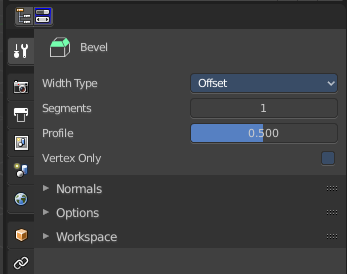
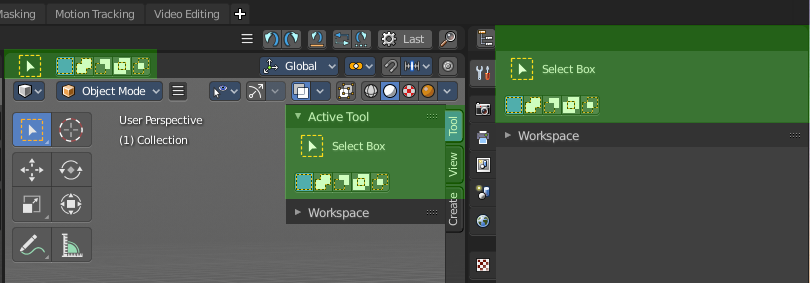
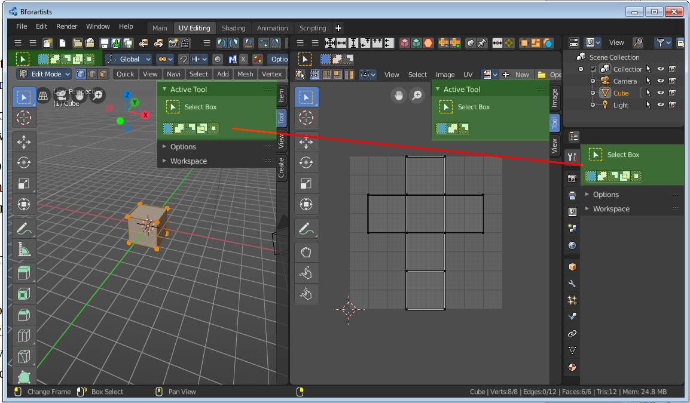
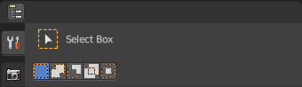
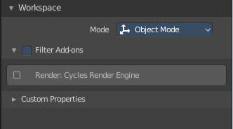
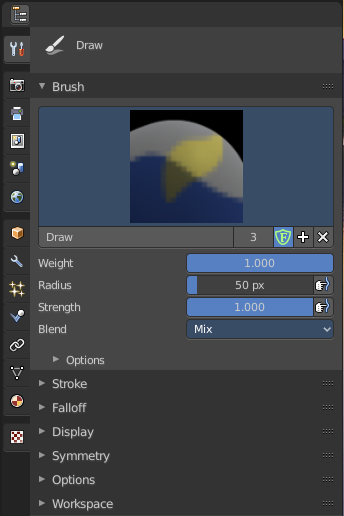
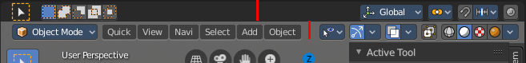
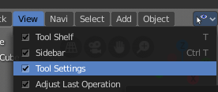
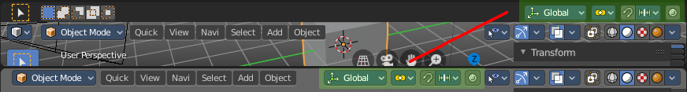

********************************************
25.1 Editors - Properties Editor - Tools Tab
********************************************

.. contents:: Contents

Tools Tab - General
===================

The Tools tab contains the tools settings for the currently active tool in the 3D view or in one of the image editors.The editor types that have a topbar. That's the 3D View, the UV Editor and the Image Editor. But also the Node editor has a tools tab in the sidebar.

Tools Tab, Top Bar and Sidebar Tools Tab
========================================

The content in the Tools tab is the same than in the Topbar. And it is the same than in the sidebar of the told editor types. Means this same functionality exists three times in the UI. It is up to you which one to use.

Tools tab with more than one editor in the workspace
====================================================

There can be more than one editor in the workspace. Then the content in the Tools tab depends of which editor is currently active and which tool you have activated last. UV Editing layout is one case where both editor types are open side by side. 

For example when you have the Knife tool in edit mode in the 3D View selected, then you will find its tool settings here. Or when you are in Vertex Paint, then you will find the paint tools here.

When you now activate one of the tools in the UV Editor, the grab tool for example, then the tool settings for this tool from the UV editor will be displayed.

The content is also mode dependant. When you are in Edit mode with a mesh object, then you will have the Mesh options and the Normal Tools panels.

Something that is available in all modes is the Workspace panel.

The tool specific settings above the panels, in this case the Surface Project check box an dthe Orientation Dropdown box will be explained in the manual parts where this tools are covered. In the Tool shelf chapters.

Tool Settings Area
==================

In this area you will find all the tool relevant settings for the currently active tool. The tool specific settings.

Every tool has other specific settings here. The select tools has a row of buttons where you can choose if you want to start a new selection, add to the current selection and so on.

Tool specific settings are covered where they happen. Means either in the tool shelf chapters of the editors. Or in the menu chapters of he editors.

The display starts with the select tools by default.

Workspace Panel
===============

Workspaces can be configured to start in specific modes, and with a specific sets of active addons. This is the place where you configure this settings.

This panel also exists in the Sidebar of the editors.

You have to save the startup file to make these changes permanent.

Mode
----

The mode in which the 3D view should start when you switch to this workspace layout.

Filter Addons
-------------

Here you can filter, means activate or deactivate specific addons.

Custom Properties
-----------------

Custom properties allows you to store your own metadata. This metadata cna then be used for rigging and Python scripts.

The following data supports custom properties:

- All data-blocks types.
- Bones and Pose-Bones.
- Sequence strips.

Mode specific Panels
====================

In Object mode you don't have any panels in the tools tab besides the Workspace panel and the current tool settings. In all other modes you have specific panels that contains options and the tools settings.

In Weightpaint mode you have for example all brush related panels.

Top bar tools arrangement
=========================

The tools in the top bar are arranged in a special way. Left you have the tools area. At the right you will find further options in case there are any. This is a general UI design paradigm. Left tools and menus, right settings.

In the 3d view the tool settings area doesn't just contain the content of the tools tab. But also some general workspace settings. You can hide the Tool settings. And then those general settings appears in the header.

