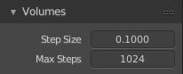
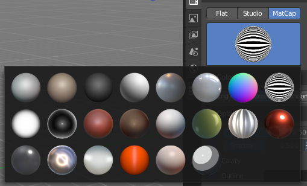

*********************************************
25.2 Editors - Properties Editor - Render Tab
*********************************************

.. contents:: Contents


Detailed Table of content
=========================


Render Tab
==========

Rendering is the process of calculating a 2D image (or video) from your 3D scene. For this you use a so called render engine.


The Render tab contains the functionality and settings around the available render engines in Bforartists. And here you can choose the renderer with which you render your still or animation with.

There are three different render engines available. Workbench, Eevee and Cycles.


Cycles is a so called offline renderer. It is a unbiased physically correct renderer with some biased adjustments to make it useable for animations.

Cycles can render at the CPU or the GPU.


Eevee and Workbench are both so called Realtime Renderers. They both render at the GPU.Workbench relies at the OpenGL render features of the graphics card. Eevee is a full independant realtime render engine.

All three renderers have different settings. And the choice of the renderer influences the tab and panel content of the whole Scene section. 


This content will be covererd in the chapters for the other tabs.


Cycles Feature Set
------------------

When you choose Cycles then you will see a new dropdown box called Feature set. Cycles has two feature set settings. Supported and Experimental. 

Supported means you have all common Cycles settings available.

Experimental means that you have access to some further experimental features of Cycles, which are somehow functional, but are still experimental features. Like Adaptive subdivision. Those features may or may not work proper. Use at own risk!


Cycles Device
-------------

When you turn on Cuda in the User Preferences then you will get a Device dropdown box where you can choose if you want to render with the CPU or the GPU.


Open Shading Language
---------------------

When you render with Cycles at the CPU, then you can choose to use the Open Shading Language.


Color Management panel - All Renderers
======================================


Color management is important to create renders and assets that are physically accurate and look great on multiple display devices. It is used both to ensure all parts of the pipeline interpret colors correctly, and to make artistic changes like exposure and color grading.

Bforartists color management is based on the OpenColorIO library. By using the same OpenColorIO configuration in multiple applications, the same color spaces and transforms will be available for consistent results.

In the Color Management panel you will find the settings around color management. It allows an artist to make sure that an image stays the same from rendering, to saving, to post-processing. Color management also allows an artist to tweak things like exposure, gamma, or the overall color grade.

The Color Management panel is the same for all render engines.


Display Device
--------------

The device that the image is being viewed on. Your monitor.

Most computer monitors are configured for the sRGB color space.


Color management can also be disabled by setting the device to None.


View Transform
--------------

Here you can choose between different ways to view the image on the same monitor.


Standard
--------

Does no extra conversion besides the conversion for the display device.


Filmic
------

For more photorealistic results and better handling of high dynamic range. The contrast can be adjusted by changing the **Look** option for the Filmic view transform.


Filmic Log
----------

Converts to Filmic log color space. This can be used for export to color grading applications, or to inspect the image by flattening out very dark and light areas. 


Raw
---

Intended for inspecting the image but not for final export. Raw gives the image without any color space conversion.


False Color
-----------

Shows a heat map of image intensities, to visualize the dynamic range.


Look
----

Here you can adjust the contrast.


Exposure
--------

Used to control the image brightness (in stops) applied before color space conversion. The calculation is: output_value=render_value×2(exposure)


Gamma
-----

Extra gamma correction applied after color space conversion. Note that the default sRGB or Rec709 color space conversions already include a gamma correction of approximately 2.2 (except the **Raw** and **Log** views), so this would be applied in addition to that. 


Sequencer Color Space
---------------------

The color space that the sequencer operates in. By default, the sequencer operates in sRGB space, but it can also be set to work in Linear space like the Compositing nodes, or another color space. Different color spaces will give different results for color correction, crossfades, and other operations. 


Use Curves
----------

Here you can adjust RGB Curves to control image colors before color space conversion.


Navigation elements
-------------------

The navigation elements at the top are described from left to right.


Zoom in and out
---------------

The two buttons with the magnifying glass at it zooms in and out in the curve window.


Tools
-----

Tools is a menu where you can find some cuve related tools.


Reset View
----------

Resets the curve windows zoom.


Vector Handle
-------------

Set handle type to Vector.


Auto Handle
-----------

Set handle type to Auto.


Auto Clamped Handle
-------------------

Set handle type to Auto Clamped.


Extend Horizontal
-----------------

Causes the curve to stay horizontal before the first point and after the last point. 


Extend Extrapolated
-------------------

Causes the curve to extrapolate before the first point and after the last point, based on the shape of the curve. 


Reset Curve
-----------

Resets the curve to the initial shape.


Use Clipping
------------

Clipping options. Here you can set up clipping for the stroke.


Delete Points
-------------

Deletes selected curve points.


Black Level 
------------

The color that Black is mapped to.


White Level
-----------

The color that White is mapped to.


Hotkeys for Black and White Level
---------------------------------

You may want to sample the black and white level colors directly in the image by clicking at an area. There are hotkeys for that.

Ctrl + Left Mouse click in the image sets the Black level value from that position.

Shift + Left Mouse click in the image sets the White Level value from that position.

To see the result you need to tick the View as Render button.


Reset
-----

Resets the Curve and the Black and White Level values to the default values.


Cycles and Eevee -Freestyle panel
=================================


What is FreeStyle?
------------------

Freestyle is an edge- and line-based non-photorealistic (NPR) rendering engine that works on top of Cycles. It relies on mesh data and z-depth information to draw lines on selected edge types. Various line styles can be added to produce artistic or technical looks.

The two operating modes - **Python Scripting** and **Parameter Editor** - allow a diversity of line styles and results. Line styles such as Japanese big brush, cartoon, blueprint, thickness-with-depth are already pre-scripted in Python. The Parameter Editor mode allows intuitive editing of features such as dotted lines and easy setup of multiple line types and edge definitions.

There are more Freestyle settings in the View Layer tab where you can adjust and define various parameters.


Enable
------

In the header is a checkbox where you can enable the Freestyle renderer.


Line Thickness Mode
-------------------


Absolute 
---------

The line thickness is given by a user-specified number of pixels. The default value is **1.0**. 


Relative 
---------

The unit line thickness is scaled by the proportion of the present vertical image resolution to **480** pixels. For instance, the unit line thickness is **1.0** with the image height set to **480**, **1.5** with **720**, and **2.0** with **960**. 


Line Thickness 
---------------

Line Thickness is only available for **Absolute** line thickness.The base line thickness in pixels.


Cycles -Sampling panel
======================


Here you can adjust the samples for Cycles.


Presets
-------

In the header you will find a Presets menu where you can choose between presets and define your own presets.


Integrator
----------

Here you can choose between Path Tracing and Branched Path Tracing. Branched path tracing branches up on first hit. This makes each sample slower, since now there is more to calculate. But this will increase quality and reduce noise.


Render
------

Number of samples for the rendered image.


Viewport
--------

Number of samples for rendering in the viewport.


Square Samples
--------------

Squares the amount samples. 


Sub Samples (Branched Path Tracing)
-----------------------------------

This sub panel just appears when you choose Branched Path Tracing.


Diffuse Samples 
----------------

Number of diffuse bounce samples to take for each AA sample. 


Glossy Samples 
---------------

Number of glossy bounce samples to take for each AA sample. 


Transmission Samples 
---------------------

Number of transmission bounce samples to take for each AA sample. 


AO Samples 
-----------

Number of ambient occlusion samples to take for each AA sample. 


Mesh Light Samples 
-------------------

Number of mesh light samples to take for each AA sample. 


Subsurface Samples 
-------------------

Number of subsurface scattering samples to take for each AA sample. 


Volume Samples 
---------------

Number of volume scattering samples to take for each AA sample. 


Total Samples
-------------

An info string that tells you the total number of samples with the current settings.


Advanced
--------


Seed
----

Seed value for integrator to get different noise patterns.


Animate Seed
------------

The clock icon besides the Seed value. Enable it to get different seed values for animation. Without animated seed you will get visible patterns in animations.


Pattern
-------

Random sampling pattern used by the integrator.


Sobol 
------

Uses a Sobol pattern to decide the random sapling pattern used by the integrator. 


Correlated Multi-Jitter 
------------------------

Uses a Correlated Multi-Jitter pattern to decide the random sapling pattern used by the integrator.


Light Threshold
---------------

Terminates light samples when the light contribution is below this value. This gives more noise, but renders faster. Type in 0 to disable this feature.


Sample all direct lights (Branched Path Tracing)
------------------------------------------------

Sample all direct lights rather than picking one random.


Sample all indirect lights (Branched Path Tracing)
--------------------------------------------------

Sample all indirect lights rather than picking one random.


Cycles -Light Paths panel
=========================


Here you will find all settings regarding light paths.


Presets
-------

In the header you will find a Presets menu where you can choose between presets and define your own presets.


Max Bounces
-----------

A sub menu with the Maximum Bounces settings.


Total
-----

Total maximum number of bounces.


Diffuse
-------

Maximum number of diffuse bounces. 


Glossy
------

Maximum number of glossy bounces. 


Transparency
------------

Maximum number of transparency bounces. 


Transmission Bounces 
---------------------

Maximum number of transmission bounces. 


Volume
------

Maximum number of volume scattering bounces. 


Clamping
--------

A sub menu with the Clamping settings. Clamping will reduce noise at the cost of accuracy.


Direct Light
------------

The maxium value for a direct sample. Zero means disabled.


Indirect Light
--------------

The maximum value for a indirect sample. Zero means disabled.


Caustics 
---------

A sub menu with caustics and filter glossy settings.


Filter Glossy 
--------------

When using a value higher than 0.0, this will blur glossy reflections after blurry bounces, to reduce noise at the cost of accuracy. 1.0 is a good starting value to tweak.

Some light paths have a low probability of being found while contributing much light to the pixel. As a result these light paths will be found in some pixels and not in others, causing fireflies. An example of such a difficult path might be a small light that is causing a small specular highlight on a sharp glossy material, which we are seeing through a rough glossy material. In fact in such a case we practically have a caustic.

With path tracing it is difficult to find the specular highlight, but if we increase the roughness on the material, the highlight gets bigger and softer, and so easier to find. Often this blurring will hardly be noticeable, because we are seeing it through a blurry material anyway, but there are also cases where this will lead to a loss of detail in lighting.


Reflective Caustics 
--------------------

Path tracing supports rendering of caustics with a sufficient number of samples. But in practice it may be inefficient to the point that there is just too much noise. Here you can disable reflective caustics. 


Refractive Caustics 
--------------------

Path tracing supports rendering of caustics with a sufficient number of samples. But in practice it may be inefficient to the point that there is just too much noise. Here you can disable refractive caustics. 


Cycles -Volumes panel
=====================

Here you can adjust the volume sampling.




Step Size 
----------

Distance between volume shader samples when rendering the volume. Lower values give more accurate and detailed results but also increased render time. 


Max Steps 
----------

Maximum number of steps through the volume before giving up, to protect from extremely long render times with big objects or small step sizes. 


Cycles -Hair panel
==================


Here you can adjust the settings for Hair particles.


Shape
-----

Here you can choose between the shape Thick and Ribbon


Cull Backfaces (Thick)
----------------------

Cull the backface geometry. Just available for the shape Thick.


Primitive
---------

What primitive to use for the Hair.


Triangles
---------

Use Triangle primitives.


Resolution
----------

The resolution of the triangle mesh.


Line Segments
-------------

Use Line Sement primitives.


Curve Segments
--------------

Use Curve primitives.


Curve Subdivision
-----------------

The subdivision of the curve primitive.


Cycles -Simplify panel
======================


Sometimes you want to simplify the rendering without to loose the already tweaked settings and adjustments. For test renderings for example. Simplify allows you to set global limits on subdivision, shadow samples and more.


Enable
------

In the header is a checkbox to enable Simplify.


Viewport
--------

This section affects the rendering with cycles in the Viewport.


Max Subdivisions
----------------

Limit the number of maximum subdivisions.


Child Particles
---------------

Limit the number of child particles.


Texture Limit
-------------

Automatically scales down textures to the chosen value.


AO Bounces
----------

Limit the number of Ambient Occlusion Bounces.


Render
------

This section affects the final rendering.


Max Subdivisions
----------------

Limit the number of maximum subdivisions.


Child Particles
---------------

Limit the number of child particles


Texture Limit
-------------

Automatically scales down textures to the chosen value.


AO Bounces
----------

Limit the number of Ambient Occlusion Bounces.


Culling
-------

Here you can find Culling settings. Culling means that the affected geometry is excluded from calculation.


Use Camera Cull
---------------

Allow objects to be culled based on the Camera Frustum. Frustum is the region of the 3D space that gets displayed by the camera, the field of view.


Camera cull margin
------------------

The margin for the camera space culling.


Use Distance Cull
-----------------

Allow objects to be culled based on the distance to the camera.


Distance
--------

The distance after which the objects gets culled away.


Cycles -Motion Blur panel
=========================

.. image:: graphics/25.2_Editors_-_Properties_Editor_-_Render_Tab/10000201000001380000009C93586F2C7DFED4E6.png

Here you can enable Motion Blur and adjust the settings.

Each object has also its own settings to control motion blur. These options can be found in the corresponding Object tab of the Properties editor. 


Enable
------

In the header is a checkbox to enable Simplify.


Position
--------

Controls at what point the shutter opens in relation to the frame.


Shutter
-------

Time between frames over which motion blur is computed. Shutter time 1.0 blurs over the length of 1 frame, 2.0 over the length of two frames, from the previous to the next. 


Rolling Shutter
---------------

Enable Rolling Shutter.


Rolling Sutter Duration
-----------------------

Controls balance between pure rolling shutter effect and pure motion blur effect. With zero being no rolling shutter and one being all rolling shutter. 


Shutter Curve
-------------

Sutter curve is a sub menu where you can adjust a curve for the shutter effect.


Navigation elements
-------------------

The navigation elements at the top are described from left to right.


Zoom in and out
---------------

The two buttons with the magnifying glass at it zooms in and out in the curve window.


Tools
-----

Tools is a menu where you can find some cuve related tools.


Reset View
----------

Resets the curve windows zoom.


Vector Handle
-------------

Set handle type to Vector.


Auto Handle
-----------

Set handle type to Auto.


Auto Clamped Handle
-------------------

Set handle type to Auto Clamped.


Extend Horizontal
-----------------

Causes the curve to stay horizontal before the first point and after the last point. 


Extend Extrapolated
-------------------

Causes the curve to extrapolate before the first point and after the last point, based on the shape of the curve. 


Reset Curve
-----------

Resets the curve to the initial shape.


Use Clipping
------------

Clipping options. Here you can set up clipping for the stroke.


Delete Points
-------------

Deletes selected curve points.


X and Y values
--------------

The coordinates of the currently selected curve point.


Presets
-------

At the bottom you can find some curve presets.


Cycles -Film panel
==================


Exposure 
---------

Exposure can be used to change the brightness of an image. Different then the **Exposure** option found in the Color management panel this exposure option works is **on the data** while the Color management exposure is **on the view**. 


Pixel Filter 
-------------

The Pixel Filter randomly changes the coordinates of every sample with the given distribution. For example: When the Sobol Sampling Pattern samples near the edge of the pixel, the neighbouring pixel might be lit instead with a rather high probability. Pixel filter is used to get rid of aliasing on the sharp edge of very bright objects, like mesh lights.


Type
----

Here you can choose the pixel filter type.


Width 
------

Here you can adjust the pixel filter width.


Transparent 
------------

Adds an alpha channel to the rendering, and enables to have transparent areas.


Transparent Glass
-----------------

Renders transmissive surfaces as transparent areas.


Roughness Threshold
-------------------

Keep transparent glass with a roughness above the threshold opaque.


Cycles -Performance panel
=========================

Here you can find settings to influence the render performance.


Threads
-------


Mode 
-----


Auto-detect 
------------

Automatically chooses the amount threads to match the number of logical processors on your computer. 


Fixed 
------

Here you can manually choose the amount threads to use for rendering. 


Threads
-------

Just active when you choose Fixed. Number of threads that you want to use.


Tiles
-----


Tile size X/Y 
--------------

The size of the tiles for rendering.

Depending on what device you are using for rendering, different tile sizes can give faster renders. For CPU rendering smaller tiles sizes (like 32 x 32) tend to be faster, while for GPU rendering larger tile sizes give better performance (like 256 x 256).


Order
-----

Order of rendering tiles. This does not significantly affect performance. 


Progressive Refine 
-------------------

Instead of rendering each tile until it has finished every sample, refine the whole image progressively. Note that progressive rendering is slightly slower than tiled rendering, but time can be saved by manually stopping the render when the noise level is low enough.

For rendering animations it is best to disable this feature, as stopping a frame early is not possible.


Acceleration Structure
----------------------


Use Spatial Splits 
-------------------

Spatial splits improve rendering performance in scenes with a mix of large and small polygons. The downsides are longer BVH build times and slightly increased memory usage. 


Use Hair BVH 
-------------

Use a special type of BVH for rendering hair. The bounding boxes are not axis aligned allowing a spatially closer fit to the hair geometry. Disabling this option will reduce memory, at the cost of increasing hair render time. 


BVH Time Steps
--------------

Is active when Spatial Splits is off. Split BVH Primitives by this number of time steps. This speeds up rendering, but requires more memory.


Final Render
------------


Save Buffers 
-------------

Saves all render layers and passes to the temp directory on a drive, and read them back after rendering has finished. This saves memory usage during rendering, particularly when using many render layers and passes. 


Persistent Images 
------------------

Keep image data in memory after rendering, for faster re-renders at the cost of extra memory usage when performing other tasks in Blender. 


Viewport
--------

This settings is for rendering in the Viewport.


Pixel Size
----------

Pixel Size for Viewport Rendering.


Start Pixels
------------

The resolution to start rendering at. And then progressively increase it to the full viewport rendering.


Cycles -Bake panel
==================

Texture baking is the process to bake specific informations from one object into the texture or the vertex colors of another object. Ambient Occlusion. Or a Normal Map for example.


.. NOTE:: ``Baking```` into textures```` requires to have a working UV map````ping ````and a texture at the target object````!``

How to use: Select the source object where you want to bake from, hold down Shift, select the target object where you want to bake to, so that both objects are selected. Adjust the settings to your needs. Then hit the Bake button.

.. NOTE:: The Bake panel is visible in all Modes. But you have to bake in Object Mode.


Settings for all Texture types
------------------------------

Most settings in the Bake panel are available for all texture types. 


Bake Button
-----------

Start the bake process.


Bake from Multires
------------------

Bake directly from multiresolution object.


Bake Type
---------

Bake Mode is a drop-down box where you can choose what type of information you want to bake from the source object into the texture or the vertex colors of the target object.


You can bake Subsurface, Transmission, Glossy, Diffuse, Environment, Emit, UV, Normal, Shadow, Ambient Occlusion and Combined.


Subsurface
----------

Bakes the Subsurface Passes of a material into the texture of the target object.


Transmission
------------

Bakes the transmission Passes of a material into the texture of the target object.


Glossy
------

Bakes the Glossy Passes of a material into the texture of the target object.


Diffuse
-------

Bake the diffuse texture of the source object into the texture of the target object.


Environment
-----------

Bakes the Environment texture into the texture of the target object. As seen from the center of the object.


Emit
----

Bakes the Emission or the glow color of a material into the texture of the target object.


Roughness
---------

Bakes the Roughness of a material into the texture of the target object.


UV
--

Bakes colors of materials and textures only, without shading. 


Normals
-------

Creates a Normal map by using the normals of the source object, and baking them as colors into the texture of the target object.


Shadow 
-------

Bakes the Shadow into the texture of the target object.


Ambient Occlusion
-----------------

Bakes ambient occlusion as specified in the World panels. Ignores all lights in the scene. 


Combined
--------

Bakes the full rendering, means materials, textures, lightning, into the texture of the target object. Except Specularity.


Influence Subpanel
------------------

Here you can adjust what data contributes to the bake process. The items are self explaining.

The content changes, dependant of what type you want to bake.


Subsurface, Transmission, Glossy, Diffuse
-----------------------------------------


Direct
------

Add direct Light.


Indirect
--------

Add indirect Light.


Color
-----

Add Color.


Normal
------


Space
-----

A drop-down box where you can chooses the Normal Space to use.


Swizzle
-------

Axis to bake in red, green and blue channels.


Combined
--------


Direct
------

Bake directly from Multires mesh.


Indirect
--------

Normalizes without using material settings.


Diffuse
-------

Bake with Diffuse.


Glossy
------

Bake with Glossy.


Transmission
------------

Bake with Transmission.


Subsurface
----------

Bake with Subsurface.


AO
--

Bake with Ambient Occlusion.


Emit
----

Bake with Emit.


Selected to Active
------------------

The usual way to bake is first select the Source Object, where you want to bake from, hold down Shift, select the target object where you want to bake to, so that both objects are selected. Then hit the Bake button. That's Selected to Active.


Cage
----

This setting is hidden as long as Selected to active is not ticked.

Cast Rays to active object from a cage.


Ray Distance
------------

Distance to use for the inward ray cast when using Selected to Active.


Output Subpanel
---------------


Margin
------

Adjust the margin width.


Clear Image
-----------

Clear clears the target image before baking.


Workbench -Lighting panel
=========================


The Workbench renderer uses Open GL. OpenGL rendering is not influenced by the lights that you place in the workspace. But by a special OpenGL light setup. It can be tweaked in the Lighting panel and the User Preferences.


Flat 
-----

Use a flat lighting.


Studio 
-------

Use a Studio light setup.


Light library browser
---------------------

Here you can choose a predefined studio light setup.


Rotation
--------

Rotate the studio light setup.


User Preferences
----------------

A click at this button opens up the user preferences where you can add and manage the OpenGL Lights.


Matcap
------

Use Matcaps to render the scene.




User Preferences
----------------

A click at this button opens up the user preferences where you can add and manage theMatcaps.


Flip Matcap
-----------

Flips the matcap.


Workbench -Color panel
======================


Here you can define the color of the surface of the object. This settings are dependant of the chosen lighting.


Material
--------

Uses the material including textures for the mesh.


Object
------

Uses the Object color.


Vertex
------

Uses the Vertex color.


Single
------

Uses a single color for the mesh.


Random
------

Uses a random color for the mesh.


Texture
-------

Renders the texture, and ignores the material settings.


Workbench -Options panel
========================


X Ray
-----

Render the faces transparent.


Backface Culling
----------------

Don't calculate back faces.


Show X-Ray
----------

Here you can set X-Ray active, and adjust the amount of alpha that is used for the x-ray effect.

Note that you can have either X-Ray or Shadow and Cavity active. Not both at the same time.


X-Ray Alpha
-----------

This slider shows up when you tick Showe X Ray. Here you can adjust the intensity.


Shadow
------

Render Shadow.


Shadow Intensity
----------------

This slider shows up when you tick Shadow. Here you can adjust the intensity.


Shading Shadow Options
----------------------

Here you can adjust a shadow shift relative to the light source.


Cavity
------

Show Cavity. Cavity highlights ridges and valleys in the scene geometry. Once activated Cavity shows some further settings.


World
-----

Draw the cavity shading in world space. 


World Space / Ridge Valley
--------------------------

Factor for the cavity ridges and valleys.


Shading Options
---------------

Here you can adjust samples, distance and attenuation for the cavity ridges and valleys.


Screen
------

Draw the cavity shading in Screen space. 


Screen Space / Ridge Valley
---------------------------

Factor for the curvature ridges and valleys.


Both
----

Draw the cavity shading in both, World Space and Screen space. 

Settings see above.


Outline
-------

Show the not selected objects with an outline.


Outline Color
-------------

Here you can define the color of the outline for not selected objects.


Specular Lighting
-----------------

Render specular highlights.


Workbench -Film panel
=====================

Here you can find film settings.


Transparent
-----------

World Background is transparent. Transparency is premultiplied Alpha.


Workbench -Simplify panel
=========================

Sometimes you want to simplify the rendering without to loose the already tweaked settings and adjustments. For test renderings for example. Simplify allows you to simplify the rendering.


Enable
------

In the header is a checkbox to enable Simplify.


Viewport
--------

This section affects the rendering with OpenGL in the Viewport.


Max Subdivisions
----------------

Limit the number of maximum subdivisions.


Max Child Particles
-------------------

Limit the number of child particles.


High Resolution Smoke
---------------------

Display high resolution smoke in the viewport.


Render
------

This section affects the rendering with OpenGL to file.


Max Subdivisions
----------------

Limit the number of maximum subdivisions.


Max Child Particles
-------------------

Limit the number of child particles.


Eevee -Sampling panel
=====================


Viewport Samples
----------------

The number of samples when rendering in the viewport.


Render Samples
--------------

The number of samples when rendering to file.


Viewport Denoising
------------------

Denoise Image. The temporal reprojection can cause some ghosting.


Eevee -Ambient Occlusion panel
==============================


Ambient occlusion is a self shadowing effect.


Enable
------

In the header you will find a checkbox to enable the Ambient Occlusion.


Distance
--------

The distance of the object to contribute to the ambient occlusion. 


Factor
------

The blend factor


Trace Precision
---------------

Precision of the horizon search


Bent Normals
------------

Compute the main non occluded direction to sample the environment


Bounces Approximation
---------------------

An approximation to simulate light bounces gives less occlusion on brighter objects.


Eevee -Bloom panel
==================


Enable
------

In the header you will find a checkbox to enable the Bloom.


Threshold
---------

Filters out pixel that are below this level of brightness.


Knee
----

Makes transition between under / over threshold gradual.


Radius
------

Bloom spread distance.


Color
-----

The color of the bloom effect.


Intensity
---------

Blend Factor.


Clamp
-----

Maximum intensity a bloom pixel can have.


Eevee -Depth of Field panel
===========================


Max Size
--------

The maximum size of the bokeh shape for Depth of Field. Lower is faster.


Eevee -Subsurface Scattering panel
==================================

Subsurface scattering is a mechanism of light transport through the object. It penetrates the surface of a translucent object, is scattered by interacting with the material, and exits the surface at a different point. 


Enable
------

In the header you will find a checkbox to enable the Subsurface Scattering.


Samples
-------

Number of samples to compute the scattering effect.


Jitter Threshold
----------------

Rotate samples that are below this value.


Separate Albedo
---------------

Avoid albedo being blurred by the subsurface scattering. This feature uses more memory.


Eevee -Screen Space reflections panel
=====================================

Here you can find settings around the Sceen Space reflections. 

Screen Space Reflections is a common technique in games. It reuses the information that is already on screen for reflections. It doesn't reflect geometry outside of the camera though.


Enable
------

In the header you will find a checkbox to enable the Subsurface Scattering.


Refraction
----------

Enable Screen Space refraction.


Half Res Trace
--------------

Raytrace at a lower resolution.


Trace Precision
---------------

The precision of the screen space raytracing.


Max Roughness
-------------

Do not raytrace reflections that are above this value.


Thickness
---------

Pixel thickness used to detect intersections.


Edge Fading
-----------

Screen percentage used to fade the Screen Space Reflection.


Clamp
-----

Clamp Pixel intensity to remove noise.


Eevee -Motion Blur panel
========================

Here you can find settings for motion blur.


Enable
------

In the header you will find a checkbox to enable the Subsurface Scattering.


Samples
-------

Nunber of samples for motion blur.


Shutter
-------

Time taken in frames between shutter open and close.


Eevee -Volumetric panel
=======================

Here you can find volumetrics settings.


Enable
------

In the header you will find a checkbox to enable Volumetric.


Start 
------

The start distance for volumetrics.


End
---

The end distance for volumetrics.


Tile Size
---------

The quality of the volumetrics effect. The lower the size the higher the quality and ram useage.


Samples
-------

Number of samples to compote for the volumetrics effect.


Exponential sampling
--------------------

Distribute more samples closer to the camera.


Volumetric Lighting
-------------------


Enable
------

In the header you will find a checkbox to enable Volumetric Lighting.


Light Clamping
--------------

The maximum light contribution.


Volumetric Shadows
------------------


Enable
------

In the header you will find a checkbox to enable Volumetric Shadows.


Shadow samples
--------------

Number of samples to compute volumetric shadowing.


Eevee -Hair panel
=================


Hair Shape Type
---------------

Choose if the hair is displayed as strand or as strip. 


Animate Property
----------------

This property can be animated. Activating this button sets a keyframe.


Additional Subdiv
-----------------

Additional subdivision along the hair.


Animate Propterty
-----------------

This property can be animated. Activating this button sets a keyframe.


Eevee -Shadows panel
====================


Here you can find settings regarding shadows.


Method
------

Here you can choose between ESM and VSM method for the shadow. ESM stands for exponential shadow mapping. VSM stands for Variance shadow mapping.


Cube Size
---------

The cube shadows resolution.


Cascade Size
------------

Directional shadows resolution.


High Bitdepth
-------------

Use 32 bit shadows. Low bitdepth uses 8 bit.


Soft Shadows
------------

Create soft shadows.


Eevee -Indirect Lighting panel
==============================


Indirect lighting can be baked to speed up the rendering process. 

Eevee uses irradiance probes to calculate indirect lighting.


Bake Indirect Lighting
----------------------

Bake both, the irradiance grids and reflection cubemaps.


Bake Cubemap Only
-----------------

Bakes only the reflection cubemaps.


Delete Lighting Cache
---------------------

Delete baked informations from cache.


Auto Bake
---------

Auto bake indirect lighting when editing probes.


Diffuse Bounces
---------------

Number of times the light is reinjected inside light grids. 0 will disable indirect diffuse light.


Cubemap Size
------------

The size of the cubemaps.


Diffuse Occlusion
-----------------

The size of the shadow map applied to each irradiance sample.


Irradiance Smoothing
--------------------

Here you can smooth the irradiance lightning. But this might introduce light bleeding.


Clamp Glossy
------------

Clamp Pixel intensity to reduce noise insinde glossy reflections from reflection cubemaps. A value of 0 disables the clamping.


Filter Quality
--------------

Take more samples during cubemap filtering to remove artifacts.


Display
-------


Cubemap Size
------------

Size of cubemap spheres to debug captured light.


Irradiance Size
---------------

Size of the irradiance sample spheres to debug captured light.


Eevee -Film panel
=================


Filter Size
-----------

The width over which the reconstruction filter combines samples.


Animate Propterty
-----------------

This property can be animated. Activating this button sets a keyframe.


Transparent
-----------

World Background is transparent. Transparency is premultiplied Alpha.


Animate Propterty
-----------------

This property can be animated. Activating this button sets a keyframe.


Overscan
--------

Internally render past the image borders to avoid screen space effects disappearing.


Overscan Size
-------------

How much bigger the image should be internally rendered.


Eevee -Simplify panel
=====================


Sometimes you want to simplify the rendering without to loose the already tweaked settings and adjustments. For test renderings for example. Simplify allows you to simplify the rendering

.


Enable
------

In the header is a checkbox to enable Simplify.


Viewport
--------

This section affects the rendering with Eevee in the Viewport.


Max Subdivisions
----------------

Limit the number of maximum subdivisions.


Child Particles
---------------

Limit the number of child particles.


Animate Propterty
-----------------

This properties can be animated. Activating this button sets a keyframe.


Render
------

This section affects the rendering with Eeveeto file.


Max Subdivisions
----------------

Limit the number of maximum subdivisions.


Child Particles
---------------

Limit the number of child particles.


Animate Propterty
-----------------

This properties can be animated. Activating this button sets a keyframe.


Grease Pencil
-------------

This section affects Grease Pencil drawings.


Playback Only
-------------

Simplify Grease Pencil only during animation playback.


Modifiers
---------

Do not apply modifiers in the viewport


Shader FX
---------

Do not apply shader FX.


Layers Blending
---------------

Don't display blending layers.


Disable Fill
------------

Disable fill strokes in the viewport.


Lines
-----

Disable external lines of fill strokes. This feature is just active when Disable Fill is checked.

