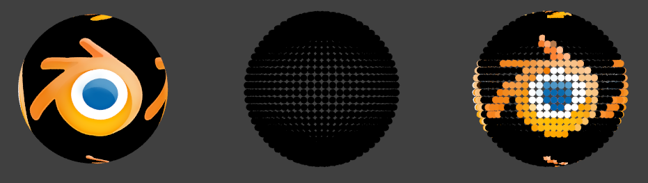
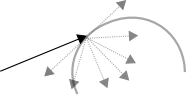
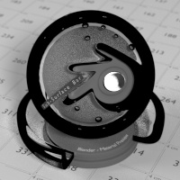
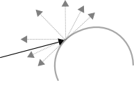
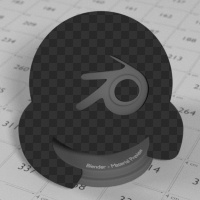

*****************************************************************
25.2.5 Editors - Properties Editor - Cycles Render Engine - Nodes
*****************************************************************

.. contents:: Contents

Introduction
============

Materials, lights and backgrounds are all defined using a network of shading nodes. These nodes output values, vectors, colors and shaders.

Shaders
-------

An important concept to understand when building node setups is that of the **shader socket**. The output of all surface and volume shaders is a shader, describing lighting interaction at the surface or of the volume, rather than the color of the surface.

There are a few types of shaders available as nodes:

- BSDF shader describing light reflection, refraction and absorption at an object surface. 
- **Emission** shader describing light emission at an object surface or in a volume. 
- **Volume** shader describing light scattering inside a volume. 
- **Background** shader describing light emission from the environment. 

Each shader node has a color input, and outputs a shader. These can then be mixed and added together using Mix and Add Shader nodes. No other operations are permitted. The resulting output can then be used by the render engine to compute all light interactions, for direct lighting or global illumination.

Textures
--------

Each texture type in Cycles corresponds to a node, with a texture coordinate and various parameters as input, and a color or value as output. No texture data-blocks are needed; instead node groups can be used for reusing texture setups.

For UV mapping and texture painting in the viewport, the Image texture node must be used. When setting such a node as active, it will be drawn in Textured draw mode, and can be painted on in texture paint mode.

The default texture coordinates for all nodes are Generated coordinates, with the exception of Image textures that use UV coordinates by default. Each node includes some options to modify the texture mapping and resulting color, and these can be edited in the texture properties.

More
----

Nodes for geometric data, texture coordinates, layering shaders and non-physically based tricks.

Open Shading Language
---------------------

Custom nodes can be written using the Open Shading Language.

Open Shading Language
=====================

Users can now create their own nodes using Open Shading Language (OSL). Note that these nodes will only work for CPU rendering; there is no support for running OSL code on the GPU.

To enable it, select Open Shading Language as the shading system in the render settings.

.. Note:: On Linux, C/C++ compiler tools (in particular /usr/bin/cpp) must be installed to compile OSL scripts.

Script Node
-----------

OSL was designed for node-based shading, and **each OSL shader corresponds to a node** in a node setup. To add an OSL shader, add a script node and link it to a text data-block or an external file. Input and output sockets will be created from the shader parameters on clicking the update button in the node or the text editor.

OSL shaders can be linked to the node in a few different ways. With the **Internal** mode, a text data-block is used to store the OSL shader, and the OSO bytecode is stored in the node itself. This is useful for distributing a .blend file with everything packed into it.

The **External** mode can be used to specify a .osl file on disk, and this will then be automatically compiled into a .oso file in the same directory. It is also possible to specify a path to a .oso file, which will then be used directly, with compilation done manually by the user. The third option is to specify just the module name, which will be looked up in the shader search path.

The shader search path is located in the same place as the scripts or configuration path, under:

Linux 

	$HOME/.config/Bforartists/2.76/shaders/

MS-Windows 

	C:\\Users\\$user\\AppData\\Roaming\\Bforartists Foundation\\Bforartists\\2.76\\shaders\\

Mac OSX 

	/Users/$USER/Library/Application Support/Bforartists/2.76/shaders/

For use in production, we suggest to **use a node group to wrap shader script nodes**, and link that into other .blend files. This makes it easier to make changes to the node afterwards as sockets are added or removed, without having to update the script nodes in all files.

Writing Shaders
---------------

For more details on how to write shaders, see the OSL specification. Here is a simple example:

shader simple_material(

color Diffuse_Color = color(0.6, 0.8, 0.6),

float Noise_Factor = 0.5,

output closure color BSDF = diffuse(N))

{

color material_color = Diffuse_Color \* mix(1.0, noise(P \* 10.0), Noise_Factor);

BSDF = material_color \* diffuse(N);

}

Closures
--------

OSL is different from, for example, RSL or GLSL, in that it does not have a light loop. There is no access to lights in the scene, and the material must be built from closures that are implemented in the render engine itself. This is more limited, but also makes it possible for the render engine to do optimizations and ensure all shaders can be importance sampled.

The available closures in Cycles correspond to the shader nodes and their sockets; for more details on what they do and the meaning of the parameters, see the **shader nodes manual**.

BSDF
----

- diffuse(N)
- oren_nayar(N, roughness)
- diffuse_ramp(N, colors[8])
- phong_ramp(N, exponent, colors[8])
- diffuse_toon(N, size, smooth)
- glossy_toon(N, size, smooth)
- translucent(N)
- reflection(N)
- refraction(N, ior)
- transparent()
- microfacet_ggx(N, roughness)
- microfacet_ggx_aniso(N, T, ax, ay)
- microfacet_ggx_refraction(N, roughness, ior)
- microfacet_beckmann(N, roughness)
- microfacet_beckmann_aniso(N, T, ax, ay)
- microfacet_beckmann_refraction(N, roughness, ior)
- ashikhmin_shirley(N, T, ax, ay)
- ashikhmin_velvet(N, roughness)

Hair
----

- hair_reflection(N, roughnessu, roughnessv, T, offset)
- hair_transmission(N, roughnessu, roughnessv, T, offset)

BSSRDF
------

- bssrdf_cubic(N, radius, texture_blur, sharpness)
- bssrdf_gaussian(N, radius, texture_blur)

Volume
------

- henyey_greenstein(g)
- absorption()

Other
-----

- emission()
- ambient_occlusion()
- holdout()
- background()

Attributes
----------

Some object, particle and mesh attributes are available to the built-in getattribute() function. UV maps and vertex colors can be retrieved using their name. Other attributes are listed below:

geom:generated

Generated texture coordinates 

geom:uv

Default render UV map 

geom:dupli_generated

For instances, generated coordinate from duplicator object 

geom:dupli_uv

For instances, UV coordinate from duplicator object 

geom:trianglevertices

3 vertex coordinates of the triangle 

geom:numpolyvertices

Number of vertices in the polygon (always returns 3 currently) 

geom:polyvertices

Vertex coordinates array of the polygon (always 3 vertices currently) 

geom:name

Name of the object 

geom:is_curve

Is object a strand or not 

geom:curve_intercept

Point along the strand, from root to tip 

geom:curve_thickness

Thickness of the strand 

geom:curve_tangent_normal

Tangent Normal of the strand 

path:ray_length

Ray distance since last hit 

object:location

Object location 

object:index

Object index number 

object:random

Per object random number generated from object index and name 

material:index

Material index number 

particle:index

Particle instance number 

particle:age

Particle age in frames 

particle:lifetime

Total lifespan of particle in frames 

particle:location

Location of the particle 

particle:size

Size of the particle 

particle:velocity

Velocity of the particle 

particle:angular_velocity

Angular velocity of the particle 

Trace
-----

We support the trace(point pos, vector dir, ...) function, to trace rays from the OSL shader. The “shade” parameter is not supported currently, but attributes can be retrieved from the object that was hit using the getmessage("trace", ..) function. See the OSL specification for details on how to use this.

This function can’t be used instead of lighting; the main purpose is to allow shaders to “probe” nearby geometry, for example to apply a projected texture that can be blocked by geometry, apply more “wear” to exposed geometry, or make other ambient occlusion-like effects.

Input Nodes
===========

Camera Data
-----------

View Vector 

A Camera space vector from the camera to the shading point. 

View Z Depth 

TODO 

View Distance 

Distance from the camera to the shading point. 

Value
-----

Input a scalar value.

Value 

Value output. 

RGB
---

Input an RGB color.

Color 

RGB color output. 

Attribute
---------

Retrieve attribute attached to the object or mesh. Currently UV maps and vertex color layers can be retrieved this way by their names, with layers and attributes planned to be added. Also internal attributes like **P** (position), **N** (normal), **Ng** (geometric normal) may be accessed this way, although there are more convenient nodes for this.

Name 

Name of the attribute. 

Color output 

RGB color interpolated from the attribute. 

Vector output 

XYZ vector interpolated from the attribute. 

Fac output 

Scalar value interpolated from the attribute. 

Wireframe
---------

Retrieve the edges of an object as it appears to cycles. As meshes are triangulated before being processed by cycles, topology will always appear triangulated when viewed with the **Wireframe node**.

Pixel Size 

When enabled, set the size of edge lines in screen space. 

Size 

Thickness of edge lines. 

Fac output 

Black and white mask showing white lines representing edges according to the object’s topology. 

Geometry
--------

Geometric information about the current shading point. All vector coordinates are in **World Space**. For volume shaders, only the position and incoming vector are available.

Position 

Position of the shading point. 

Normal 

Shading normal at the surface (includes smooth normals and bump mapping). 

Tangent 

Tangent at the surface. 

True Normal 

Geometry or flat normal of the surface. 

Incoming 

Vector pointing towards the point the shading point is being viewed from. 

Parametric 

Parametric coordinates of the shading point on the surface. 

Backfacing 

1.0 if the face is being viewed from the back side, 0.0 for the front side. 

Pointiness 

An approximation of the curvature of the mesh per-vertex. Lighter values indicate convex angles, darker values indicate concave angles. 

Light Path
----------

Node to find out for which kind of incoming ray the shader is being executed; particularly useful for non-physically based tricks. More information about the meaning of each type is in the **Light Paths** documentation.

Is Camera Ray output 

1.0 if shading is executed for a camera ray, 0.0 otherwise. 

Is Shadow Ray output 

1.0 if shading is executed for a shadow ray, 0.0 otherwise. 

Is Diffuse Ray output 

1.0 if shading is executed for a diffuse ray, 0.0 otherwise. 

Is Glossy Ray output 

1.0 if shading is executed for a glossy ray, 0.0 otherwise. 

Is Singular Ray output 

1.0 if shading is executed for a singular ray, 0.0 otherwise. 

Is Reflection Ray output 

1.0 if shading is executed for a reflection ray, 0.0 otherwise. 

Is Transmission Ray output 

1.0 if shading is executed for a transmission ray, 0.0 otherwise. 

Ray Length output 

Distance traveled by the light ray from the last bounce or camera. 

Ray Depth 

	Number of times the ray has “bounced”, i.e. been reflected or transmitted on interaction with a surface.

.. Note:: Passing through a transparent shader does not count as a normal “bounce”.

Transparent Depth 

Number of times the ray has passed through a transparent shader. 

Object Info
-----------

Information about the object instance. This can be useful to give some variation to a single material assigned to multiple instances, either manually controlled through the object index, based on the object location, or randomized for each instance. For example a Noise texture can give random colors or a Color ramp can give a range of colors to be randomly picked from.

Location 

Location of the object in world space. 

Object Index 

Object pass index, same as in the Object Index pass.transformed. 

Material Index 

Material pass index, same as in the Material Index pass. 

Random 

Random number unique to a single object instance. 

Fresnel
-------

Dielectric fresnel, computing how much light is refracted through and how much is reflected off a layer. The resulting weight can be used for layering shaders with the **Mix Shader** node. It is dependent on the angle between the surface normal and the viewing direction.

IOR input 

Index of refraction of the material being entered. 

Fresnel output 

Fresnel weight, indicating the probability with which light will reflect off the layer rather than passing through. 

Layer Weight
------------

Output weights typically used for layering shaders with the **Mix Shader** node.

Blend input 

Blend between the first and second shader. 

Fresnel output 

Dielectric fresnel weight, useful for example for layering diffuse and glossy shaders to create a plastic material. This is like the Fresnel node, except that the input of this node is in the often more-convenient 0.0 to 1.0 range. 

Facing output 

Weight that blends from the first to the second shader as the surface goes from facing the viewer to viewing it at a grazing angle. 

Texture Coordinate
------------------

Commonly used texture coordinates, typically used as inputs for the **Vector** input for texture nodes.

Generated output 

Automatically-generated texture coordinates from the vertex positions of the mesh without deformation, keeping them sticking to the surface under animation. Range from 0.0 to 1. 0 over the bounding box of the undeformed mesh. 

Normal output 

Object space normal, for texturing objects with the texture staying fixed on the object as it transformed. 

UV output 

UV texture coordinates from the active render UV map. 

Object output 

Position coordinate in object space. 

Camera output 

Position coordinate in camera space. 

Window output 

Location of shading point on the screen, ranging from 0.0 to 1. 0 from the left to right side and bottom to top of the render. 

Reflection output 

Vector in the direction of a sharp reflection, typically used for environment maps. 

Object 

Specific object to use for object space coordinates. This only affects the **Object** output. 

From Dupli 

	If the material is applied to a dupli object, use texture coordinates from the parent object. This only affects the **Generated** and **UV** outputs.

	From left to right: Sphere with UV mapped texture. Small spheres duplicated to the faces of the textured sphere using **duplifaces**. Small spheres with **From Dupli** enabled, using the UV map of the large sphere.

.. Note:: ``From Dupli`` only works with the UV output when the dupli object is instanced from faces, either with ``particles`` or ``duplifaces``.

UV Map
------

Retrieve specific UV maps. Unlike the Texture Coordinate node which only provides the active UV map, this node can retrieve any UV map belonging to the object using the material.

From Dupli 

See the From Dupli option of the **Texture Coordinate node**. 

UV Map 

UV map to use. 

UV output 

UV mapping coordinates from the specified UV layer. 

Particle Info
-------------

For objects instanced from a particle system, this node give access to the data of the particle that spawned the instance.

Index 

Index number of the particle (from 0 to number of particles). 

Age 

Age of the particle in frames. 

Lifetime 

Total lifespan of the particle in frames. 

Location 

Location of the particle. 

Size 

Size of the particle. 

Velocity 

Velocity of the particle. 

Angular Velocity 

Angular velocity of the particle. 

Hair Info
---------

This node gives access to strand information.

Is strand 

Returns 1 when the shader is acting on a strand, otherwise 0. 

Intercept 

The point along the strand where the ray hits the strand (1 at the tip and 0 at the root). 

Thickness 

The thickness of the strand at the point where the ray hits the strand. 

Tangent Normal 

Tangent normal of the strand. 

Tangent
-------

Generates a tangent direction for the Anisotropic BSDF.

Direction Type 

The tangent direction can be derived from a cylindrical projection around the X, Y or Z axis (Radial), or from a manually created UV Map for full control. 

Tangent Output 

The tangent direction vector. 

Output Nodes
============

Output nodes are the final node in every node tree. Although you can add more than one, only one will be used (indicated by a colored or darkened header). Output nodes are always preceded by **Shaders** except in the case of the **Displacement** of a Material Output.

Material Output
---------------

Surface 

The surface output of the material 

Volume 

**Currently under independent development, does nothing**

Displacement 

Used to create bump mapping or actual subdivided **Displacement**

Lamp Output
-----------

Surface 

Not an actual surface, but the final output of a **Lamp** Object 

World Output
------------

Surface 

The appearance of the environment, usually preceded by a Background shader 

Volume 

**Currently under independent development, does nothing**

Shader Nodes
============

Diffuse
-------

Lambertian and Oren-Nayar diffuse reflection.

Color input 

Color of the surface, or physically speaking, the probability that light is reflected or transmitted for each wavelength. 

Roughness input 

Surface roughness; 0.0 gives standard Lambertian reflection, higher values activate the Oren-Nayar BSDF. 

Normal input 

Normal used for shading; if nothing is connected the default shading normal is used. 

BSDF output 

Diffuse BSDF shader. 

.. list-table::

	* - 	  -  

	* - 	  - 

Translucent
-----------

Lambertian diffuse transmission.

Color input 

Color of the surface, or physically speaking, the probability that light is transmitted for each wavelength. 

Normal input 

Normal used for shading; if nothing is connected the default shading normal is used. 

BSDF output 

Translucent BSDF shader. 

Translucent Shader

Glossy
------

Glossy reflection with microfacet distribution, used for materials such as metal or mirrors.

Distribution 

Microfacet distribution to use. **Sharp** results in perfectly sharp reflections like a mirror, while **Beckmann**, **GGX** and **Ashikhmin-Shirley** can use the **Roughness** input for blurry reflections. 

Color input 

Color of the surface, or physically speaking, the probability that light is reflected for each wavelength. 

Roughness input 

Influences sharpness of the reflection; perfectly sharp at 0.0 and smoother with higher values. 

Normal input 

Normal used for shading; if nothing is connected the default shading normal is used. 

BSDF output 

Glossy BSDF shader. 

.. list-table::

	* - 	  - 
	* - 	  - 

Anisotropic
-----------

Anisotropic glossy reflection, with separate control over U and V direction roughness. The tangents used for shading are derived from the active UV map. If no UV map is available, they are automatically generated using a sphere mapping based on the mesh bounding box.

Distribution 

Microfacet distribution to use. **Sharp** results in perfectly sharp reflections like a mirror, while **Beckmann**, **GGX** and **Ashikhmin-Shirley** can use the **Roughness** input for blurry reflections. 

Color input 

Color of the surface, or physically speaking, the probability that light is reflected for each wavelength. 

Roughness input 

Sharpness of the reflection; perfectly sharp at 0.0 and smoother with higher values. 

Anisotropy input 

Amount of anisotropy in the reflection; 0.0 gives a round highlight. Higher values give elongated highlights orthogonal to the tangent direction; negative values give highlights shaped along the tangent direction. 

Rotation input 

Rotation of the anisotropic tangent direction. Value 0.0 equals 0- rotation, 0.25 equals 90- and 1.0 equals 360- = 0- . This can be used to texture the tangent direction. 

Normal input 

Normal used for shading; if nothing is connected the default shading normal is used. 

Tangent input 

Tangent used for shading; if nothing is connected the default shading tangent is used. 

BSDF output 

Anisotropic glossy BSDF shader. 

.. list-table::

	* - 	  - 

Toon
----

Diffuse and Glossy Toon BSDF for creating cartoon light effects.

Color input 

Color of the surface, or physically speaking, the probability that light is reflected for each wavelength. 

Size input 

Parameter between 0.0 and 1.0 that gives a angle of reflection between 0- and 90- . 

Smooth input 

This value specifies an angle over which a smooth transition from full to no reflection happens. 

Normal input 

Normal used for shading; if nothing is connected the default shading normal is used. 

BSDF output 

Toon BSDF shader. 

Toon Shader

Transparent
-----------

Transparent BSDF without refraction, passing straight through the surface, as if there were no geometry there. Useful with alpha maps, for example. This shader affects light paths somewhat differently than other BSDF s. Note that only pure white transparent shaders are completely transparent.

Color input 

Color of the surface, or physically speaking, the probability for each wavelength that light is blocked or passes straight through the surface. 

BSDF output 

Transparent BSDF shader. 

.. list-table::

	* - 	  -  

	* - 	  - 

Glass
-----

Glass-like shader mixing refraction and reflection at grazing angles. Like the transparent shader, only pure white will make it transparent. The glass shader tends to cause noise due to caustics. Since the Cycles path tracing integrator is not very good at rendering caustics, it helps to combine this with a transparent shader for shadows; for more details see here

Distribution 

Microfacet distribution to use. **Sharp** results in perfectly sharp refractions like clear glass, while **Beckmann** and **GGX** can use the **Roughness** input for rough glass. 

Color input 

Color of the surface, or physically speaking, the probability that light is transmitted for each wavelength. 

Roughness input 

Influences sharpness of the refraction; perfectly sharp at 0.0 and smoother with higher values. 

IOR input 

Index of refraction defining how much the ray changes direction. At 1. 0 rays pass straight through like transparent; higher values give more refraction. 

Normal input 

Normal used for shading; if nothing is connected the default shading normal is used. 

BSDF output 

Glass BSDF shader. 

.. list-table::

	* - 	  - 
	* - 	  - 

Principled Node
---------------

The **Principled** BSDF that combines multiple layers into a single easy to use node. It is based on the Disney principled model also known as the “PBR” shader, making it compatible with other software such as Pixar’s Renderman® and Unreal Engine®. Image textures painted or baked from software like Substance Painter® may be directly linked to the corresponding parameters in this shader.

This “Uber” shader includes multiple layers to create a wide variety of materials. The base layer is a user controlled mix between diffuse, metal, subsurface scattering and transmission. On top of that there is a specular layer, sheen layer and clearcoat layer.

Note

The emphasis on compatibility with other software means that it interprets certain input parameters differently from older blender nodes.

Refraction
----------

Glossy refraction with sharp or microfacet distribution, used for materials that transmit light. For best results this node should be considered as a building block and not be used on its own, but rather mixed with a glossy node using a fresnel factor. Otherwise it will give quite dark results at the edges for glossy refraction.

Distribution 

Microfacet distribution to use. **Sharp** results in perfectly sharp refractions, while **Beckmann** and **GGX** can use the **Roughness** input for blurry refractions. 

Color input 

Color of the surface, or physically speaking, the probability that light is refracted for each wavelength. 

Roughness input 

Influences sharpness of the refraction; perfectly sharp at 0.0 and smoother with higher values. 

Normal input 

Normal used for shading; if nothing is connected the default shading normal is used. 

BSDF output 

Glossy BSDF shader. 

Refraction Shader.

Velvet
------

Velvet reflection shader for materials such as cloth. It is meant to be used together with other shaders (such as a **Diffuse Shader**) and isn’t particularly useful on it’s own.

Color input 

Color of the surface, or physically speaking, the probability that light is reflected for each wavelength. 

Sigma input 

Variance of the normal distribution, controlling the sharpness of the peak - can be thought of as a kind of **roughness**. 

Normal input 

Normal used for shading; if nothing is connected the default shading normal is used. 

BSDF output 

Velvet BSDF shader. 

The Velvet Shader

Subsurface Scattering
---------------------

Simple subsurface multiple scattering, for materials such as skin, wax, marble, milk and others. For these materials, rather than light being reflect directly off the surface, it will penetrate the surface and bounce around internally before getting absorbed or leaving the surface at a nearby point.

How far the color scatters on average can be configured per RGB color channel. For example, for skin, red colors scatter further, which gives distinctive red-colored shadows, and a soft appearance.

Falloff 

Lighting distance falloff function. **Cubic** is a sharp falloff useful for many simple materials. The function is (radius - x) 3**Gaussian** gives a smoother falloff following a normal distribution, which is particularly useful for more advanced materials that use measured data that was fitted to one or more such Gaussian functions. The function is e -8x2/radius2, such that the radius roughly matches the maximum falloff distance. To match a given measured variance v, set radius = sqrt(16\*v). 

Color input 

Color of the surface, or physically speaking, the probability that light is reflected for each wavelength. 

Scale input 

Global scale factor for the scattering radius. 

Radius input 

Scattering radius for each RGB color channel, the maximum distance that light can scatter. 

Sharpness input 

Used only with **Cubic** falloff. Values increasing from 0 to 1 prevents softening of sharp edges and reduces unwanted darkening. 

Normal input 

Normal used for shading; if nothing is connected the default shading normal is used. 

Texture Blur input 

How much of the texture will be blurred along with the lighting, mixing the texture at the incoming and outgoing points on the surface. Note that the right choice depends on the texture. Consider for example a texture created from a photograph of skin, in this cases the colors will already be pre-blurred and texture blur could be set to 0. Even for hand painted textures no or minimal blurring might be appropriate, as a texture artist would likely paint in softening already, one would usually not even know what an unblurred skin texture looks like, we always see it blurred. For a procedural texture on the other hand this option would likely have a higher value. 

BSSRDF output 

BSSRDF shader. 

A skin-toned SSS shader with color radius: 1.0, 0.8, 0.5.

Emission
--------

Lambertian emission, to be used for material and lamp surface outputs.

Color input 

Color of the emitted light. 

Strength input 

Strength of the emitted light. For point and area lamps, the unit is Watts. For materials, a value of 1.0 will ensure that the object in the image has the exact same color as the Color input, i.e. make it ‘shadeless’. 

Emission output 

Emission shader. 

.. list-table::

	* - 	  - 
Cycles uses a physically correct light falloff by default, whereas Bforartists Internal uses a smoothed falloff with a Distance parameter. A similar effect can be found by using the Light Falloff node with the Smooth parameter.

Lamp strength for point, spot and area lamps is specified in Watts. This means you typically need higher values than Bforartists Internal, as you couldn’t use a 1W lamp to light a room; you need something stronger like a 100W lamp.

Sun lamps are specified in Watts/m^2, which require much smaller values like 1 W/m^2. This can be confusing, but specifying strength in Watts wouldn’t have been convenient; the real sun for example has strength 384600000000000000000000000W. Emission shaders on meshes are also in Watts/m^2.

Background
----------

Background light emission. This node should only be used for the world surface output; it is ignored in other cases.

Color input 

Color of the emitted light. 

Strength input 

Strength of the emitted light. 

Background output 

Background shader. 

Holdout
-------

The holdout shader creates a “hole” in the image with zero alpha transparency, which is useful for compositing (see alpha channel).

Note that the holdout shader can only create alpha when Properties > Render > Film > Transparent is enabled. If it’s disabled, the holdout shader will be black.

Holdout output 

Holdout shader. 

The checkered area is a region with zero alpha.

Ambient Occlusion
-----------------

The ambient occlusion node gives per-material control for the amount of AO. When AO is enabled in the world, it affects all diffuse BSDFs in the scene. With this option it’s possible to let only some materials be affected by AO, or to let it influence some materials more or less than others.

Color input 

surface reflection color. 

AO output 

Ambient Occlusion shader. 

White AO shader.

Mix and Add
-----------

Mix or add shaders together. Mixing can be used for material layering, where the **Fac** input may, for example, be connected to a Blend Weight node.

Shader inputs 

Shaders to mix, such that incoming rays hit either with the specified probability in the **Fac** socket. 

Fac input 

Blend weight to use for mixing two shaders; at zero it uses the first shader entirely and at one the second shader. 

Shader output 

Mixed shader. 

A mix of a glossy and a diffuse shader makes a nice ceramic material.

Texture Nodes
=============

Image Texture
-------------

Image texture from GoodTextures.com

Use an image file as a texture.

Image Data-Block 

Image data-block used as the image source. Currently not all images supported by Bforartists can be used by Cycles. In particular, generated, packed images or animations are not supported currently. 

Projection 

	Projection to use for mapping the textures.

- **Flat** will use the XY coordinates for mapping. 
- **Box** will map the image to the 6 sides of a virtual box, based on the normal, using XY, YZ and XYZ coordinates depending on the side. 
- **Sphere** will map the image to the sphere using Z axis as central. 
- **Tube** will map the tube to the sphere using Z axis as central. 

Projection Blend 

For Box mapping, the amount to blend between sides of the box, to get rid of sharp transitions between the different sides. Blending is useful to map a procedural-like image texture pattern seamlessly on a model. 0.0 gives no blending; higher values give a smoother transition. 

Color Space 

Type of data that the image contains, either Color or Non-Color Data. For most color textures the default of Color should be used, but in case of e.g. a bump or alpha map, the pixel values should be interpreted as Non-Color Data, to avoid doing any unwanted color space conversions. 

Extension Type 

	Extension type defines how the image is extrapolated past the original bounds:

- **Repeat** will repeat the image horizontally and vertically giving tiled-looking result. 
- **Extend** will extend the image by repeating pixels on it’s edges. 
- **Clip** will set all the extended pixels values to transparent black. 

Vector input 

Texture coordinate for texture lookup. If this socket is left unconnected, UV coordinates from the active UV render layer are used. 

Color output 

RGB color from image. If the image has alpha, the color is premultiplied with alpha if the Alpha output is used, and unpremultiplied or straight if the Alpha output is not used. 

Alpha output 

Alpha channel from image. 

Environment Texture
-------------------

HDR image from OpenFootage.net

Use an environment map image file as a texture. The environment map is expected to be in Latitude/Longitude or ‘latlong’ format.

Image Data-Block 

Image data-block used as the image source. Currently not all images supported by Bforartists can be used by Cycles. In particular, generated, packed images or animations are not supported currently. 

Color Space 

Type of data that the image contains, either Color or Non-Color Data. For most color textures the default of Color should be used, but in case of e.g. a bump or alpha map, the pixel values should be interpreted as Non-Color Data, to avoid doing any unwanted color space conversions. 

Vector input 

Texture coordinate for texture lookup. If this socket is left unconnected, the image is mapped as environment with the Z axis as up. 

Color output 

RGB color from the image. If the image has alpha, the color is premultiplied with alpha if the Alpha output is used, and unpremultiplied if the Alpha output is not used. 

Alpha output 

Alpha channel from image. 

Sky Texture
-----------

Sky Texture

Procedural Sky texture.

Sky Type 

Sky model to use (Preetham or Hosek / Wilkie). 

Sun Direction 

Sun direction vector. 

Turbidity 

Atmospheric turbidity. (2: Arctic like, 3: clear sky, 6: warm/moist day, 10: hazy day) 

Ground Albedo 

Amount of light reflected from the planet surface back into the atmosphere. (RGB 0,0,0 is black, 1,1,1 is white). 

Vector 

Texture coordinate to sample texture at; defaults to Generated texture coordinates if the socket is left unconnected. 

Color output 

Texture color output. 

Noise Texture
-------------

Noise Texture with high detail

Procedural Perlin noise texture, similar to the Clouds texture in Bforartists Internal.

Vector input 

Texture coordinate to sample texture at; defaults to Generated texture coordinates if the socket is left unconnected. 

Scale input 

Overall texture scale. 

Detail input 

Amount of noise detail. 

Distortion input 

Amount of distortion. 

Color output 

Texture color output. 

Fac output 

Texture intensity output. 

Wave Texture
------------

Default wave texture

Procedural bands or rings texture with noise distortion.

Type 

**Bands** or **Rings** shaped waves. 

Vector input 

Texture coordinate to sample texture at; defaults to Generated texture coordinates if the socket is left unconnected. 

Scale input 

Overall texture scale. 

Distortion input 

Amount of distortion of the wave (similar to the Marble texture in Bforartists Internal). 

Detail input 

Amount of distortion noise detail. 

Detail Scale input 

Scale of distortion noise. 

Color output 

Texture color output. 

Fac output 

Texture intensity output. 

Voronoi Texture
---------------

.. list-table::

	* - 	  - 
Procedural texture producing Voronoi cells.

Type 

**Intensity** or **Cells** output. 

Vector input 

Texture coordinate to sample texture at; defaults to Generated texture coordinates if the socket is left unconnected. 

Scale input 

Overall texture scale. 

Color output 

Texture color output. 

Fac output 

Texture intensity output. 

Musgrave Texture
----------------

Advanced procedural noise texture. Note that it often needs some adjustments (multiplication and addition) in order to see more detail.

.. list-table::

	* - 	  - 
Type 

Multifractal, Ridged Multifractal, Hybrid Multifractal, fBM, Hetero Terrain. 

Vector input 

Texture coordinate to sample texture at; defaults to Generated texture coordinates if the socket is left unconnected. 

Scale input 

Overall texture scale. 

Detail input 

Amount of noise detail. 

Dimension input 

The highest fractal dimension, specified as the highest scale for the steps of the intensity. 

Lacunarity input 

The space of the lacunarity, specified as a frequency factor. 

Offset input 

The offset of the fractal, specified between black and white values (Intensity) 

Gain input 

A multiplier for the gain input 

Color output 

Texture color output. 

Fac output 

Texture intensity output. 

Gradient Texture
----------------

Gradient texture using object coordinates

A gradient texture.

Type 

The gradient can be **Linear**, **Quadratic**, **Easing**, **Diagonal**, **Spherical**, **Quadratic Sphere** or **Radial**. 

Vector input 

Texture coordinate to sample texture at; defaults to Generated texture coordinates if the socket is left unconnected. 

Color output 

Texture color output. 

Fac output 

Texture intensity output. 

Magic Texture
-------------

Magic texture: Depth 10, Distortion 2.0

Psychedelic color texture.

Depth 

Number of iterations. 

Vector input 

Texture coordinate to sample texture at; defaults to Generated texture coordinates if the socket is left unconnected. 

Distortion input 

Amount of distortion. 

Color output 

Texture color output. 

Fac output 

Texture intensity output. 

Checker Texture
---------------

Default Checker texture

Checkerboard texture.

Vector input 

Texture coordinate to sample texture at; defaults to Generated texture coordinates if the socket is left unconnected. 

Color1/2 input 

Color of the checkers. 

Scale input 

Overall texture scale. The scale is a factor of the bounding box of the face divided by the scale. For example, a scale of 15 will result in 15 alternate patterns over the overall UV bounding box. Different patterns could be achieved using other nodes to give different input patterns to this socket. For example, using the Math Node. 

Color output 

Texture color output. 

Fac output 

Checker 1 mask (1 = Checker 1). 

Brick Texture
-------------

Brick texture: Colors changed, Squash 0.62, Squash Frequency 3.

Procedural texture producing Bricks.

Options
-------

Offset 

Determines the brick offset of the various rows. 

Frequency 

Determines the offset frequency. A value of 2 gives a even/uneven pattern of rows. 

Squash 

Amount of brick squashing. 

Frequency 

Brick squashing frequency. 

Sockets
-------

Color 1/2 and Mortar 

Color of the bricks and mortar. 

Scale 

Overall texture scale. 

Mortar Size 

The Mortar size; 0 means no Mortar. 

Bias 

The color variation between Brick color 1 / 2. Values of -1 and 1 only use one of the two colors; values in between mix the colors. 

Brick Width 

The width of the bricks. 

Row Height 

The height of the brick rows. 

Color output 

Texture color output. 

Fac output 

Mortar mask (1 = mortar). 

Point Density
-------------

Domain object with Point Density texture using vertices from ball as points.

Used to add volumetric points for each particle or vertex of another object.

Options
-------

Point Data 

	Where to get points from.

	Particle System 

	Use each particle position from the specified particle system. 

	Object Vertices 

	Use each vertex position from the specified object. 

Object 

Which object’s vertices or particle system will be used. 

Particle System 

Particle positions from this system will be used. 

Space 

	The coordinate system for mapping points.

	World Space 

	Map each point exactly where the source particle/vertex is. 

	Object Space 

	Fit the points from the source particles/vertices inside the bounding box of the object with the point density texture. .. TODO As far as I can tell this is how it works, but should be checked with a developer. 

Radius 

Radius from the shaded sample to look for points within. .. TODO Same as tooltip, this does not make much sense to me. 

Interpolation 

	Texel filtering type.

	Closest 

	No interpolation, use nearest texel. Produces blocky looking points. 

	Linear 

	Interpolate linearly between texels, producing soft, round points. 

	Cubic 

	Use cubic falloff, producing very soft points. Useful when points are very densely packed. 

Resolution 

The dimensions of the texture holding the point data. 

Color Source 

Which attribute of the particle system is used to color the output. 

Sockets
-------

Vector 

Texture coordinate to sample texture at; defaults to global position (Position output of Geometry node) if the socket is left unconnected. 

Color output 

Texture color output. 

Density output 

Density of volume. 

More Nodes
==========

Value
-----

Input a scalar value.

Value 

Value output. 

RGB
---

Input an RGB color.

Color 

RGB color output. 

Geometry
--------

Geometric information about the current shading point. All vector coordinates are in **World Space**. For volume shaders, only the position and incoming vector are available.

Position 

Position of the shading point. 

Normal 

Shading normal at the surface (includes smooth normals and bump mapping). 

Tangent 

Tangent at the surface. 

True Normal 

Geometry or flat normal of the surface. 

Incoming 

Vector pointing towards the point the shading point is being viewed from. 

Parametric 

Parametric coordinates of the shading point on the surface. 

Backfacing 

1.0 if the face is being viewed from the backside, 0.0 for the frontside. 

Wireframe
---------

Node for a wireframe shader (Triangles only for now).

Pixel Size 

Use screen pixel size instead of world units. 

Size 

Controls the thickness of the wireframe. 

Fac output 

1.0 if shading is executed on an edge, 0.0 otherwise. 

Wavelength
----------

A wavelength to rgb converter.

Wavelength 

The color wavelength from 380 to 780 nanometers. 

Color 

RGB color output. 

Blackbody
---------

A blackbody temperature to RGB converter.

Temperature 

The temperature in Kelvin. 

Color 

RGB color output. 

Texture Coordinates
-------------------

Commonly used texture coordinates, typically used as inputs for the **Vector** input for texture nodes.

Generated 

Automatically-generated texture coordinates from the vertex positions of the mesh without deformation, keeping them sticking to the surface under animation. Range from 0.0 to 1. 0 over the bounding box of the undeformed mesh. 

Normal 

Object space normal, for texturing objects with the texture staying fixed on the object as it transformed. 

UV 

UV texture coordinates from the active render UV layer. 

Object 

Position coordinate in object space. 

Camera 

Position coordinate in camera space. 

Window 

Location of shading point on the screen, ranging from 0.0 to 1. 0 from the left to right side and bottom to top of the render. 

Reflection 

Vector in the direction of a sharp reflection, typically used for environment maps. 

Bump
----

Generate a perturbed normal from a height texture, for bump mapping. The height value will be sampled at the shading point and two nearby points on the surface to determine the local direction of the normal.

Invert 

Invert the bump mapping, to displace into the surface instead of out. 

Strength Input 

Strength of the bump mapping effect, interpolating between no bump mapping and full bump mapping. 

Distance Input 

Multiplier for the height value to control the overall distance for bump mapping. 

Height Input 

Scalar value giving the height offset from the surface at the shading point; this is where you plug in textures. 

Vector Transform
----------------

Allows converting a Vector, Point or Normal between World <=> Camera <=> Object coordinate space.

Type 

Specifies the input/output type: Vector, Point or Normal. 

Convert From 

Coordinate Space to convert from: World, Object or Camera. 

Convert To 

Coordinate Space to convert to: World, Object or Camera. 

Vector Input 

The input vector. 

Vector Output 

The transformed output vector. 

Tangent
-------

Generate a tangent direction for the Anisotropic BSDF.

Direction Type 

The tangent direction can be derived from a cylindrical projection around the X, Y or Z axis (Radial), or from a manually created UV Map for full control. 

Tangent Output 

The tangent direction vector. 

Normal Map
----------

Generate a perturbed normal from an RGB normal map image. This is usually chained with an Image Texture node in the color input, to specify the normal map image. For tangent space normal maps, the UV coordinates for the image must match, and the image texture should be set to Non-Color mode to give correct results.

Space 

The input RGB color can be in one of 3 spaces: Tangent, Object and World space. Tangent space normal maps are the most common, as they support object transformation and mesh deformations. Object space normal maps keep sticking to the surface under object transformations, while World normal maps do not. 

UV Map 

Name of the UV map to derive normal mapping tangents from. When chained with an Image Texture node, this UV map should be the same as the UV map used to map the texture. 

Strength 

Strength of the normal mapping effect. 

Color Input 

RGB color that encodes the normal in the specified space. 

Normal Output 

Normal that can be used as an input to BSDF nodes. 

Object Info
-----------

Information about the object instance. This can be useful to give some variation to a single material assigned to multiple instances, either manually controlled through the object index, based on the object location, or randomized for each instance. For example a Noise texture can give random colors or a Color ramp can give a range of colors to be randomly picked from.

Note that this node only works for material shading nodes; it does nothing for lamp and world shading nodes.

Location 

Location of the object in world space. 

Object Index 

Object pass index, same as in the Object Index pass.transformed. 

Material Index 

Material pass index, same as in the Material Index pass. 

Random 

Random number between 0 and 1 unique to a single object instance. 

Particle Info
-------------

For objects instanced from a particle system, this node give access to the data of the particle that spawned the instance. This node currently only supports parent particles, info from child particles is not available.

Index 

Index number of the particle (from 0 to number of particles). 

Age 

Age of the particle in frames. 

Lifetime 

Total lifespan of the particle in frames. 

Location 

Location of the particle. 

Size 

Size of the particle. 

Velocity 

Velocity of the particle. 

Angular Velocity 

Angular velocity of the particle. 

Hair Info
---------

This node gives access to strand information.

Is strand 

Returns 1 when the shader is acting on a strand, otherwise 0. 

Intersect 

The point along the strand where the ray hits the strand (1 at the tip and 0 at the root). 

Thickness 

The thickness of the strand at the point where the ray hits the strand. 

Tangent Normal 

Tangent normal of the strand. 

Attribute
---------

Retrieve attribute attached to the object or mesh. Currently UV maps and vertex color layers can be retrieved this way by their names, with layers and attributes planned to be added. Also internal attributes like **P** (position), **N** (normal), **Ng** (geometric normal) may be accessed this way, although there are more convenient nodes for this.

Name 

Name of the attribute. 

Color output 

RGB color interpolated from the attribute. 

Vector output 

XYZ vector interpolated from the attribute. 

Fac output 

Scalar value interpolated from the attribute. 

Mapping
-------

Transform a coordinate; typically used for modifying texture coordinates.

Location 

Vector translation. 

Rotation 

Rotation of the vector along XYZ axes. 

Scale 

Scale of the vector. 

Vector input 

Vector to be transformed. 

Vector output 

Transformed vector. 

Layer Weight
------------

Output weights typically used for layering shaders with the **Mix Shader** node.

Blend input 

Blend between the first and second shader. 

Fresnel output 

Dielectric fresnel weight, useful for example to layer diffuse and glossy shaders to create a plastic material. This is like the **Fresnel** node, except that the input of this node is in the often more-convenient 0.0 to 1.0 range. 

Facing output 

Weight that blends from the first to the second shader as the surface goes from facing the viewer to viewing it at a grazing angle. 

Fresnel
-------

Dielectric fresnel, computing how much light is reflected off a layer, where the rest will be refracted through the layer. The resulting weight can be used for layering shaders with the **Mix Shader** node. It is dependent on the angle between the surface normal and the viewing direction.

The most common use is to mix between two BSDFs using it as a blending factor in a mix shader node. For a simple glass material you would mix between a glossy refraction and glossy reflection. At grazing angles more light will be reflected than refracted as happens in reality.

For a two-layered material with a diffuse base and a glossy coating, you can use the same setup, mixing between a diffuse and glossy BSDF. By using the fresnel as the blending factor you’re specifying that any light which is refracted through the glossy coating layer would hit the diffuse base and be reflected off that.

IOR input 

Index of refraction of the material being entered. 

Fresnel output 

Fresnel weight, indicating the probability with which light will reflect off the layer rather than passing through. 

Light Path
----------

Node to find out for which kind of incoming ray the shader is being executed; particularly useful for non-physically based tricks. More information about the meaning of each type is in the **Light Paths** documentation.

Is Camera Ray output 

1.0 if shading is executed for a camera ray, 0.0 otherwise. 

Is Shadow Ray output 

1.0 if shading is executed for a shadow ray, 0.0 otherwise. 

Is Diffuse Ray output 

1.0 if shading is executed for a diffuse ray, 0.0 otherwise. 

Is Glossy Ray output 

1.0 if shading is executed for a glossy ray, 0.0 otherwise. 

Is Singular Ray output 

1.0 if shading is executed for a singular ray, 0.0 otherwise. 

Is Reflection Ray output 

1.0 if shading is executed for a reflection ray, 0.0 otherwise. 

Is Transmission Ray output 

1.0 if shading is executed for a transmission ray, 0.0 otherwise. 

Ray Length output 

Distance travelled by the light ray from the last bounce or camera. 

Ray Depth output 

Returns the current light bounce. 

Transparent Depth output 

Returns the number of transparent surfaces passed through. 

Light Falloff
-------------

Manipulate how light intensity decreases over distance. In reality light will always fall off quadratically; however it can be useful to manipulate as a non-physically based lighting trick. Note that using Linear or Constant falloff may cause more light to be introduced with every global illumination bounce, making the resulting image extremely bright if many bounces are used.

Strength input 

Light strength before applying falloff modification. 

Smooth input 

Smooth intensity of light near light sources. This can avoid harsh highlights, and reduce global illumination noise. 0.0 corresponds to no smoothing; higher values smooth more. The maximum light strength will be strength/smooth. 

Quadratic output 

Quadratic light falloff; this will leave strength unmodified if smooth is 0.0 and corresponds to reality. 

Linear output 

Linear light falloff, giving a slower decrease in intensity over distance. 

Constant output 

Constant light falloff, where the distance to the light has no influence on its intensity. 

Nodes shared with the Compositor
--------------------------------

Some nodes are common with Composite nodes, their documentation can be found at their relevant pages rather than repeated here.

- **Brightness Contrast**
- **Separate RGB**
- **Combine RGB**
- **Separate HSV**
- **Combine HSV**
- **Gamma**
- **Hue Saturation Value**
- **Invert**
- **Math**
- **Mix RGB**
- **RGB Curves**
- **RGB to BW**
- **Vector Curve**

