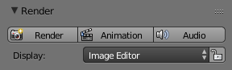
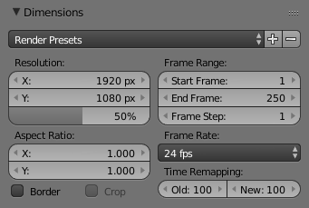
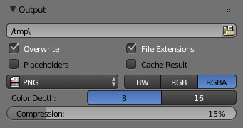
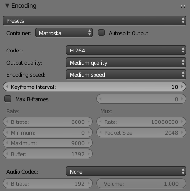
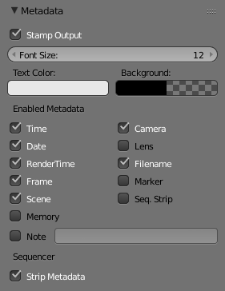

*********************************************
25.3 Editors - Properties Editor - Output Tab
*********************************************

.. contents:: Contents

Render Panel
============

Render panel.

Render F12

Starts rendering a still image of the current frame. 

Animation Ctrl-F12

Starts rendering an animation. See Rendering Animations for more detail. 

Audio 

Mixes all the audio found in a scene and saves into one file. See Introduction. 

By default the biggest area is replaced with the UV/Image Editor and the render appears.

To cancel the rendering process click the cancel button X besides the progressbar in the Info Editor, or press Esc.

Display
-------

Renders are displayed in the UV/Image Editor. You can set the way this is displayed to several different options in the Display menu:

Display 

	Keep UI 

	The image is rendered to the UV/Image Editor, but the UI remains the same. You will need to open the UV/Image Editor manually to see the render result. 

	New Window 

	A new floating window opens up, displaying the render. 

	Image Editor 

	One of the existing editors is replaced with the UV/Image Editor, showing the render. 

	Full Screen 

	The UV/Image Editor replaces the UI, showing the render. 

Lock Interface 

Lock interface during rendering in favor of giving more memory to the renderer. 

Output Options
==============

The first step in the rendering process is to determine and set the output options. This includes render size, frame rate, pixel aspect ratio, output location, and file type.

Dimensions panel
----------------

Dimensions Panel.

Render Presets 

Common format presets for TVs and screens. 

Resolution 

	X/Y 

	The number of pixels horizontally and vertically in the image. 

	Percentage 

	Slider to reduce or increase the size of the rendered image relative to the X/Y values above. This is useful for small test renders that are the same proportions as the final image. 

Aspect Ratio 

	Older televisions may have non-square pixels, so this can be used to control the shape of the pixels along the respective axis. This will **pre-distorted** the images which will look stretched on a computer screen, but which will display correctly on a TV set. It is important that you use the correct pixel aspect ratio when rendering to prevent re-scaling, resulting in lowered image quality.

	See Video Output for details on pixel aspect ratio.

Border 

	You can render just a portion of the view instead of the entire frame. While in Camera View, press Ctrl-B and drag a rectangle to define the area you want to render. Ctrl-Alt-B is the shortcut to disable the border.

	Note

	This disables the **Save Buffers** option in **Performance** and **Full Sample** option in **Anti-Aliasing**.

	Enabling **Crop** will crop the rendered image to the **Border** size, instead of rendering a black region around it.

Frame Range 

Set the **Start** and **End** frames for Rendering Animations. **Step** controls the number of frames to advance by for each frame in the timeline. 

Frame Rate 

For an Animation the frame rate is how many frames will be displayed per second. 

Time Remapping 

Use to remap the length of an animation. 

Output Panel
------------

Output panel.

This panel provides options for setting the location of rendered frames for animations, and the quality of the saved images.

File Path 

	Choose the location to save rendered frames.

When rendering an animation, the frame number is appended at the end of the file name with four padded zeros (e.g. image0001.png). You can set a custom padding size by adding the appropriate number of # anywhere in the file name (e.g. image_##_test.png translates to image_01_test.png).

	This setting expands relative paths where a // prefix represents the directory of the current blend-file.

Overwrite 

Overwrite existing files when rendering. 

Placeholders 

Create empty placeholder frames while rendering. 

File Extensions 

Adds the correct file extensions per file type to the output files. 

Cache Result 

Saves the rendered image and passes to a Multilayer EXR-file in temporary location on your hard drive. This allows the compositor to read these to improve performance, especially for heavy compositing. 

Output Format 

	Choose the file format to save to. Based on which format is used, other options such as channels, bit-depth and compression level are available.

	For rendering out to images see: saving images for rendering to videos see rendering to videos

Color Mode 

	Choose the color format to save the image to. Note that **RGBA** will not be avaible for all image formats.

	BW, RGB, RGBA

.. Hint:: Primitive Render-Farm

Video Output
============

Preparing your work for video
-----------------------------

Once you master the art of 3D animation, you will probably want to share your work with others; either on the internet (YouTube, Vimeo, etc) or with family and friends (DVD/Bluray) or even possibly for television broadcast.

To spare you some disappointment, here are some tips specifically targeted at video preparation.

Safe Areas and Overscan
-----------------------

For anyone creating motion graphics or simple text overlays, overscan is an important consideration. Although its origins are rooted in historic analog TV systems, unfortunately even in 2017, for various reasons it can still be an issue with modern digital flatscreen TVs.

Note

Due to various limitations in analog TV equipment, the displayed image could sometimes end up shifted horizontally or vary in size, which could lead to the area beyond the intended visible picture being shown. This hidden area sometimes contained junk noise, timing signals or closed-caption/subtitle data. To avoid this being visible to the viewer, the standard approach for TV manufacturers was to ‘overscan’ (zoom in) the displayed picture by a small amount (between 5-10% edge crop) to ensure that at no time would the hidden areas be visible.

Although modern digital electronics have eliminated the issue of shifting image position, unfortunately, some TV manufacturers have included overscan on their flatscreen TVs. Why? Because for many years it was given that the edge of the visible image would rarely be seen, so broadcasters would sometimes overlay ‘hidden’ data to the very edge of the image (e.g. some types of closed captions). Also, legacy analog recordings might still contain unwanted noise around the edge. To avoid consumer complaints, overscan is quite often enabled by default. For some flatscreen TVs, it is not possible to disable it.

Enabling Safe Areas
-------------------

Blender has configurable safe-area markings which can be made visible by selecting the scene camera, then in the camera settings by enabling Safe Areas. Several presets are available. If you are producing work for a television network or indeed any client, they may have their own rules and requirements on safe area dimensions – so consult with them.

Color Reproduction
------------------

When exporting to many of the common video formats, the rendered RGB(A) images go through a conversion process whereby they are translated to the YCbCr color model. Y corresponds to a grayscale representation of the image, Cb and Cr contain data for the blue and red channels respectively. Green is encoded into the Y and Cb, Cr channels with some clever math.

Importantly, the color components are often stored at a lower resolution to the Y (grayscale) channel. This can cause blurring/smearing which can be a problem with small text and some saturated color combinations – so it is well worth doing test encodes to make sure that text remains legible. As with safe areas, a TV network or client might have their own rules on minimum text size and positioning, so always seek clarification when unsure.

Encoding Panel
--------------

Reference
=========

Encoding panel.

Here you choose which video container, codec, and compression settings you want to use. With all of these compression choices, there is a tradeoff between file size, compatibility across platforms, and playback quality.

.. Tip:: When you view the System Console, you can see some of the output of the encoding process. You will see even more output if you execute Blender as ``blender -d``.

Presets 

You can use the presets, which choose optimum settings for you for that type of output. 

Container 

Video container or file type. For a list of all available options, see video formats. 

Autosplit Output 

If your video is huge and exceeds 2GiB, enable Autosplit Output. This will automatically split the output into multiple files after the first file is 2Gig. 

Codec 

Chooses the method of compression and encoding. For a list of all available options see video formats. 

.. Note:: Standards

Output Quality 

These are preset Rates 

Encoding Speed 

Presets to change between a fast encode (bigger file size) and more compression (smaller file size) 

Key Frame Interval 

The number of pictures per Group of Pictures. Set to 0 for “intra_only”, which disables inter-frame video. A higher number generally leads to a smaller file but needs a higher-powered device to replay it. 

Max B-frames 

	Enables the use of B‑frames.

	Interval 

	The maximum number of B‑frames between non-B-frames. 

Rate
----

Bitrate 

Sets the average bitrate (quality), which is the count of binary digits per frame. See also: FFmpeg -b:v. 

Rate 

Video files can use what is called variable bitrate (VBR). This is used to give some segments of the video less compressing to frames that need more data and less to frames with less data. This can be controlled by the **Minimum** and a **Maximum** values. 

Buffer 

The decoder bitstream buffer size. 

Mux
---

Multiplexing <http://www.afterdawn.com/glossary/term.cfm/multiplexing>`__ is the process of combining separate video and audio streams into a single file, similar to packing a video file and .mp3 audio file in a zip-file.

Rate 

Maximum bit rate of the multiplexed stream. 

Packet Size 

Reduces data fragmentation or muxer overhead depending on the source. 

Audio
-----

Audio Codec 

Audio format to use. For a list of all available options, see video formats. 

Bitrate 

For each codec, you can control the bitrate (quality) of the sound in the movie. Higher bitrates are bigger files that stream worse but sound better. Use powers of 2 for compatibility. 

Volume 

Sets the output volume of the audio. 

Tips
----

The choice of video format depends on what you are planning to do.

It’s not recommended to render directly to a video format in the first instance. If a problem occurs while rendering, the file might become unplayable and you will have to re-render all frames from the beginning. If you first render out a set of static images such as the default PNG format or the higher-quality OpenEXR (which can retain HDR pixel data), you can combine them as an Image Strip in the Video Sequence Editor (VSE). This way, you can easily:

- Restart the rendering from the place (the frame) where any problem occurred. 
- Try out different video encoding options in seconds, rather than minutes or hours as encoding is usually much faster than rendering the 3d scene. 
- Enjoy the rest of the features of the VSE, such as adding Image Strips from previous renders, audio, video clips, etc. 

You shouldn’t post-process a lossy-compressed file as the compression artifacts may become visible. Lossy compression should be reserved as a final ‘delivery format’.

If you are planning on doing significant post-processing and color correction, it is best to output a frameset rendered in OpenEXR format. If you plan to do only minimal changes after rendering and would prefer a single file, choose lossless H.264 for high quality, or regular H.264 for lower quality.

Metadata
========

Metadata panel.

The **Metadata** panel includes options for writing meta-data into render output.

.. Note:: Only some image formats support metadata: See image formats.

Stamp Output 

	Add metadata as text to the render.

	Stamp Text Color 

	Set the color and alpha of the stamp text. 

	Stamp Background 

	Set the color and alpha of the color behind the text. 

	Font Size 

	Set the size of the text. 

	Draw Labels 

	Draws the labels before the metadata text. For example, “Camera” infront of camera name etc. 

Enabled Metadata

Stamping can include the following data.

Time 

Includes the current scene time and render frame at HH:MM:SS.FF

Date 

Includes the current date and time. 

Render Time 

Includes the render time. 

Frame 

Includes the frame number. 

Scene 

Includes the name of the active scene. 

Memory 

Includes the peak memory usage. 

Note 

	Includes a custom note.

	Hint

It can be useful to use the **Note** field if you are setting up a render-farm.

Since you can script any information you like into it, such as an identifier for the render-node or the job-number.

	For details on stamping arbitrary values, see: this page.

Camera 

Includes the name of the active camera. 

Lens 

Includes the name of the active camera’s lens value. 

Filename 

Includes the filename of the blend-file. 

Marker 

Includes the name of the last marker. 

Seq. Strip 

Includes the name of the foreground sequence strip. 

Sequencer

Strip Metadata 

Use metadata from the strips in the sequencer. 

Animation Player
================

The Info Editor > Render > Play Rendered Animation menu will play back the rendered animation in a new window.

You can also drop images or movie files in a running animation player. It will then restart the player with the new data.

An external player can also be used instead of the one included in Blender. To do this, select it in the User Preferences.

Shortcuts
---------

The following table shows the available hotkeys for the animation player.

Playback

.. list-table::

	* - Start/Pause:
	  - Spacebar

	* - Start playback (when paused):
	  - Enter

	* - Quit:
	  - Esc

Timeline

.. list-table::

	* - Scrub in time:
	  - LMB

	* - Step back one frame:
	  - Left

	* - Step forward one frame:
	  - Right

	* - Step back 10 frames:
	  - Down

	* - Step forward 10 frames:
	  - Up

	* - Manual frame stepping:
	  - NumpadPeriod

Playback Options

.. list-table::

	* - Backward playback:
	  - Shift-Down

	* - Forward playback
	  - Shift-Up

	* - Slow down playback:
	  - Minus

	* - Speed up playback:
	  - Plus

	* - Toggle looping:
	  - Numpad0

	* - Toggle frame skipping:
	  - A

	* - Toggle ping-pong:
	  - P

Display

.. list-table::

	* - Toggle Time Cursor (Indicator):
	  - I

	* - Flip drawing on the X axis:
	  - F

	* - Flip drawing on the Y axis:
	  - Shift-F

	* - Hold to show frame numbers:
	  - Shift

	* - Zoom in:
	  - Ctrl-Plus

	* - Zoom out:
	  - Ctrl-Minus

Frame rate

- 60 fps Numpad1
- 50 fps Numpad2
- 30 fps Numpad3
- 25 fps Numpad4
- 24 fps Shift-Numpad4
- 20 fps Numpad5
- 15 fps Numpad6
- 12 fps Numpad7
- 10 fps Numpad8
-  6 fps Numpad9
-  5 fps NumpadSlash

