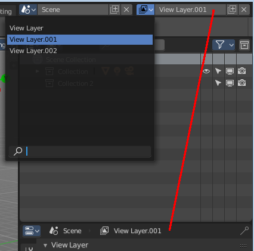
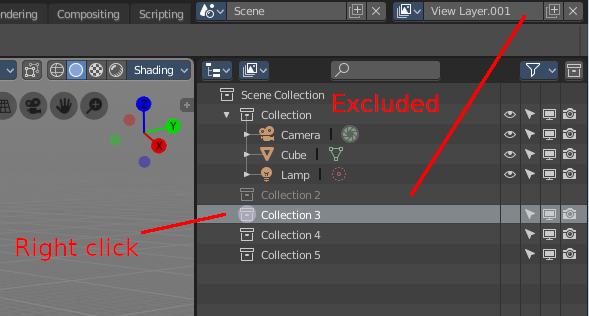
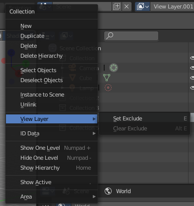
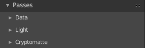
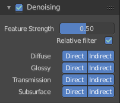
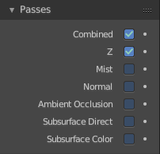

*************************************************
25.4 Editors - Properties Editor - View Layer Tab
*************************************************

.. contents:: Contents

View Layer
==========

View Layers reference to Scene collections. They allow to set their visibility, selectability and other options. Each View Layer can use any collection you wish, and multiple View Layers can use the same collections or different collections.

Usually you have just one View layer for the whole scene. But you can create more View layers in the header, and rename them there.

View layers are by default active for all collections. You have to exclude it in the RMB menu for the specific layers. This can be done in the Outliner. In the shot below Collection 2 is already excluded from View Layer 001. The text is greyed out, and the functionality is missing. This collection is not available for View Layer 001.

Right click at the Collection, and chose View Layer -> exclude

In the same menu you can also re enable the collection for a view layer.

The different render engines uses different view layer functionality. And so the panels and available options differ.

View Layer Panel - All Renderers
================================

Use for Rendering
-----------------

Disable or enable the render layer.

Animate Property
----------------

This property can be animated. Activating this button sets a keyframe.

Render Single Layer
-------------------

Only render the active layer. This just works for rendering from the interface. Rendering from command line ignores this setting.

Cycles - Filter Panel
=====================

Environment
-----------

Render Sky in this layer.

Surfaces
--------

Render solid surfaces in this layer.

Freestyle
---------

Render stylized strokes in this layer. This feature is greyed out when Freestyle is not activated.

Ambient Occlusion
-----------------

Render Ambient Occlusion in this layer.

Hair
----

Render Hair in this layer.

Cycles - Passes Panel
=====================

The passes panel is divided into three sub menus. Data, Light and Cryptomatte.

Here you enable or disable passes for single features.

Data
----

Combined
--------

Deliver full combined RGBA Buffer.

Mist
----

Deliver Mist factor pass. 0.0 - 1.0.

Vector
------

Deliver Speed Vector pass.

Object Index
------------

Deliver Object Index pass.

Denoising Data
--------------

Store the denoising feature passes and the noisy image.

Z
-

Deliver Z Value pass.

Normal
------

Deliver Normal pass.

UV
--

Deliver UV pass.

Material Index
--------------

Deliver Material Index pass.

Render Time
-----------

Render time in miliseconds per sample and pixel.

Alpha Threshold
---------------

Z, Index, Normal, UV and Vector passes are just affected by surfaces with alpha transparency equal or higher this threshold.

Light
-----

Diffuse
-------

Direct
------

Deliver direct pass.

Indirect
--------

Deliver indirect pass.

Color
-----

Deliver color pass.

Glossy
------

Direct
------

Deliver direct pass.

Indirect
--------

Deliver indirect pass.

Color
-----

Deliver color pass.

Transmission
------------

Direct
------

Deliver direct pass.

Indirect
--------

Deliver indirect pass.

Color
-----

Deliver color pass.

Subsurface
----------

Direct
------

Deliver direct pass.

Indirect
--------

Deliver indirect pass.

Color
-----

Deliver color pass.

Volume
------

Direct
------

Deliver direct pass.

Indirect
--------

Deliver indirect pass.

Color
-----

Deliver color pass.

Emission
--------

Deliver Emission pass.

Environment
-----------

Deliver Environment pass.

Shadow
------

Deliver Shadow pass.

Ambient Occlusion
-----------------

Deliver Ambient Occlusion pass.

Cryptomatte
-----------

Cryptomatte passes can be used to isolate objects or materials or assets in compositing.

Object
------

Render Cryptomatte Object Pass.

Materials
---------

Render Cryptomatte Materials Pass.

Asset
-----

Render Cryptomatte Asset Pass.

Levels
------

How many unique objects can be distinguished per pixel

Accurate Mode
-------------

Generate a more accurate cryptomatte pass. This feature renders at the CPU only, and comsumes more memory.

Cycles - Denoising Panel
========================

Rendering with an unbiased renderer like Cylces means you will always have some noise in the image. This noise can be reduced by Denoising. Denoising is a post process step that smoothes out noise.

Enable
------

In the header is a checkbox to enable the denoising.

Feature Strength
----------------

Controls the removal of noisy image passes. Lower values preserves more detail. But aren't as smooth.

Relative Filter
---------------

Use a relative threshold instead of an absolute one hwen removing pixels that don't carry information. This can help to reduce artifacts. But it might cause detail loss around edges.

Diffuse
-------

Direct
------

Denoise the direct diffuse lighting.

Indirect
--------

Denoise the indirect diffuse lighting.

Glossy
------

Direct
------

Denoise the direct Glossy lighting.

Indirect
--------

Denoise the indirect Glossy lighting.

Transmission
------------

Direct
------

Denoise the direct Transmission lighting.

Indirect
--------

Denoise the indirect Transmission lighting.

Subsurface
----------

Direct
------

Denoise the direct Subsurface lighting.

Indirect
--------

Denoise the indirect Subsurface lighting.

Eevee - Passes
==============

Here you enable or disable passes for single features.

Combined
--------

Deliver full combined RGBA Buffer.

Z
-

Deliver Z Value pass.

Mist
----

Deliver Mist factor pass. 0.0 to 1.0

Normal
------

Deliver Normal pass.

Ambient Occlusion
-----------------

Deliver Ambient Occlusion pass.

Subsurface Direct
-----------------

Deliver Subsurface Direct pass.

Subsurface Color
----------------

Deliver Subsurface Color pass.

Animate Property
----------------

These properties can be animated. Activating this button sets a keyframe.

