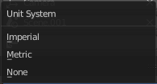

********************************************
25.5 Editors - Properties Editor - Scene Tab
********************************************

.. contents:: Contents

Scene Tab
=========

Scenes are a way to organize your work. Usually you work with just one scene. But each .blend file can contain multiple scenes which share other data, such as objects and materials.

The scenes can be managed in the scene dropdown box up right in the header.

Appending happens through the File menu / Append.

.. list-table::

	* - 

Scene Dropdown Box
------------------

A list of the available scenes.

New Scene
---------

To add a scene, click on the scene list button, and select **Add New**. 

New 
----

Creates an empty scene with default values. 

Copy Settings 
--------------

Creates an empty scene but also copies the settings from the active scene into the new one. 

Link Objects 
-------------

This option creates a new scene with the same settings and contents as the active scene. However, instead of copying the objects, the new scene contains links to the objects in the old scene. Therefore, changes to objects in the new scene will result in the same changes to the original scene, because the objects used are literally the same. The reverse is also true. 

Link Object Data 
-----------------

Creates new, duplicate copies of all of the objects in the currently selected scene, but each one of those duplicate objects will have **links to** the object-data (meshes, materials and so on) of the corresponding objects in the original scene.

This means that you can change the position, orientation and size of the objects in the new scene without affecting other scenes, but any modifications to the object-data (meshes, materials **etc**) will also affect other scenes. This is because a **single instance of** the “object-data” is now being shared by all of the objects in all of the scenes that link to it.

More information at the **Window Type** page. This has the effect of making a new independent copy of the object-data.

Full Copy 
----------

Using this option, nothing is shared. This option creates a fully independent scene with copies of the active scenes contents. Every object in the original scene is duplicated, and a duplicate, private copy of its object-data is made as well. 

.. Note:: To choose between these options, it’s useful to understand the difference between ``Objects`` and ``Object Data``. See ``Duplication``.

Delete Scene
------------

Deletes the currently selected scene.

Camera
------

Here you can define the active camera for rendering.

Background Scene
----------------

Here you can choose a background scene.

Active Movie Clip
-----------------

Here you can choose an active movie clip for constrainst and viewport drawing.

Units Panel
===========

Here you define the units for the scene.

Unit System
-----------

The overall unit system that gets used.

Unit Scale
----------

The standard unit scale

Separate Units
--------------

Display Units in pairs. 

Rotation
--------

Units to display on rotation. Radians or Degree.

Length
------

Units to display the length values.

Mass
----

Units to display the mass values.

Time
----

Units to display Time values.

GravityPanel
============

Here you can adjust the gravity settings. The default values are the standard gravity than on earth with the usual acceleration of 9.81 meters per second in Z direction.

.. image:: graphics/25.5_Editors_-_Properties_Editor_-_Scene_Tab/10000201000001270000006508622A7BF79BD7CF.png

Gravity is used for physics simulations like rigid body.

Enable
------

In the header is a checkbox to enable the gravity.

Gravity X, Y Z
--------------

The gravity values.

Animate Property
----------------

These properties can be animated. Activating this button sets a keyframe.

Keying SetsPanel
================

Keying Sets are a collection of properties. They are used to keyframe multiple properties at the same time.

There are some built in Keying Sets, and also custom Keying Sets called **Absolute Keying Sets**.

This panel here is used to add, select and manage Absolute Keying sets.

When you add a custom keying set in the list box, then you will reveal further options.

Every keying set that you add here is also available in the list of active keyingsets.

Keying Set List
---------------

Here you can see the list of your Absolute Keying Sets. The active keying set is highlighted in blue.

It has a search form below the list. Click the arrow button down left to expand the search.

The list display can be resized by clicking at the dotted area and drag it up or down.

Add / Remove Keying Set
-----------------------

At the right side you can add or remove a keying set with the + and - buttons

.. image:: graphics/25.5_Editors_-_Properties_Editor_-_Scene_Tab/10000201000000670000003229D61BFA114522D1.png

Description
-----------

A useless field where you could add and read a description when there would be a way to add one ....

Export to file
--------------

Here you can export the keyingset to a Python file.

To re add the keying set from the **File.py**, open then run the **File.py** from the Text Editor. 

Active Keying Set
-----------------

Here you can add properties to the active keying set.

Paths
-----

A list with a collection of **Paths** each with a **Data Path** to a property to add to the active Keying Set. The active **Path** is highlighted in blue. 

It has a search form below the list. Click the arrow button down left to expand the search.

The list display can be resized by clicking at the dotted area and drag it up or down.

Add / Remove Paths
------------------

At the right side you can add or remove a keying set with the + and - buttons

.. image:: graphics/25.5_Editors_-_Properties_Editor_-_Scene_Tab/10000201000000670000003229D61BFA114522D1.png

Target ID Block
---------------

Set the **ID-Type** + **Object ID****Data Path** for the property. Means pick the object or data type that you want to influence here.

At the left you have a list of the available ID Types. At the right you have a picker as long as you haven't defined the object where you want to use this prpoerty at. Use this picker to pick up the object.

.. image:: graphics/25.5_Editors_-_Properties_Editor_-_Scene_Tab/100002010000011300000021B47B383AF4DF416B.png

Data Path
---------

Here you can give your paths a name.

Array all Items
---------------

For an Array / Vector type, use **All Items** from the **Data Path** or select the array index for a specific property. 

FCurve Grouping
---------------

This controls what **Group** to add the **Channels** to. **Keying Set Name**, **None**, **Named Group**. 

Keyframe Settings
-----------------

General Override and Active Set Override have the same items each.

Only Needed 
------------

Only insert keyframes where they’re needed in the relevant F-Curves. 

Visual Keying 
--------------

Insert keyframes based on the visual transformation. 

XYZ=RGB Colors 
---------------

For new F-Curves, set the colors to RGB for the property set, Location XYZ for example. 

AudioPanel
==========

Here you can adjust the general audio settings.

Volume
------

The Audio Volume.

Distance Model
--------------

The algorithm for attenuation calculation.

Audio Channels
--------------

Audio Channels settings.

Sample Rate
-----------

The sample rate for audio playback.

Doppler Speed
-------------

Speed of sound for doppler effect calculation.

Doppler Factor
--------------

Pitch factor for doppler effect calculation.

Update Animation Cache
----------------------

Update the audio animation cache. Something that you might want to do after changes here ...

Rigid Body WorldPanel
=====================

The rigid body world is a group of Rigid Body objects, which holds settings that apply to all rigid bodies in this simulation.

When you add Rigid Body physics on an object, primary there is created a group of objects with default “RigidBodyWorld” name. Rigid body objects automatically are added to this group when you add Rigid Body physics for them.

You can create several Rigid Body World groups, and allocate the Rigid Body objects with **Groups** panel in **Object** context.

Rigid body objects and constraints are only taken into account by the simulation if they are in the groups specified in **Group** field of the **Rigid Body World** panel in the **Scene** context.

Activate
--------

In the header is a checkbox where you can enable or disable the Rigid Body World. 

**Remove Rigid Body World**

Remove Rigid Body simulation from the current scene. 

Settings
--------

A sub menu with further settings.

Collection
----------

Containing rigid body objects participating in this simulation. 

Constraints
-----------

Containing rigid body object constraints participating in the simulation. 

Speed
-----

Can be used to speed up/slow down the simulation. 

Split Impulse
-------------

Enable/disable reducing extra velocity that can build up when objects collide (lowers simulation stability a little so use only when necessary). Limits the force with which objects are separated on collision, generally produces nicer results, but makes the simulation less stable (especially when stacking many objects). 

Steps Per Second
----------------

Number of simulation steps made per second (higher values are more accurate but slower). This only influences the accuracy and not the speed of the simulation. 

Solver Iterations
-----------------

Amount of constraint solver iterations made per simulation step (higher values are more accurate but slower). Increasing this makes constraints and object stacking more stable. 

Animate Property
----------------

These properties can be animated. Activating this buttons sets a keyframe.

Cache
-----

A submenu with chache settings. The cache is getting used for animation.

Simulation Start / End
----------------------

First and last frame of the simulation. 

Bake
----

Calculates the simulation and protects the cache. You need to be in **Object** mode to bake.

Calculate to Frame
------------------

Bake physics to current frame. 

Current Cache to Bake
---------------------

Bake from Cache. 

Bake All Dynamics
-----------------

Bake all physics. 

Free All Bakes
--------------

Free all baked caches of all objects in the current scene. 

Update All To Frame
-------------------

Update cache to current frame. 

If you haven’t saved the blend file, the cache is created in memory, so save your file first or the cache may be lost.

Field Weights
-------------

With force fields you can influence rigid body objects in physics simulations. Every force field has its own local settings, which can be adjusted in the physics panel. Here you can adjust the general field weights for those forces.

Custom PropertiesPanel
======================

Here you can define custom properties that can be used for scripting.

.. image:: graphics/25.5_Editors_-_Properties_Editor_-_Scene_Tab/100002010000011C000000A371890A13CA5FC774.png

Here you might also find custom properties from addons or scripts. User Prefs Props are listed here for example.

Add
---

Adds a new property.

Edit
----

A panel where you can adjust the settings for the custom property.

Remove
------

Removes the property.

