********************************************
25.6 Editors - Properties Editor - World Tab
********************************************

.. contents:: Contents

World Tab
=========

The world tab provides you with world settings. Like Viewport Display color.

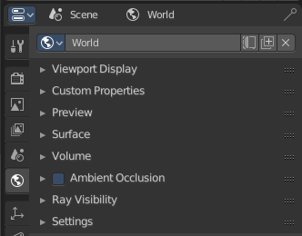

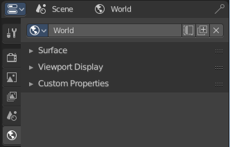

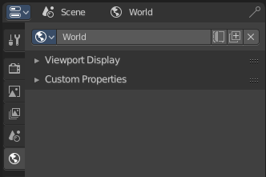

The content varys, dependant of the chosen renderer. From left to right: Eevee, OpenGL, Cycles.

World Edit Box
==============

Here you can manage and change your world settings. There can be more than one World.

World Browser
-------------

Here you can see and choose your world files.

World Edit Box
--------------

Here you can see and change the name of the current world file.

Fake User
---------

When enabled then this world file will be stored internally. And will remain in the scene.

New
---

Create a new world file.

Unlink Data Block
-----------------

Note that this just sets the World file inactive. It is still in the list. You can delete the world file when it has no user anymore by saving the scene, closing and reopening Bforartists. 

Viewport Display - All Renderers
================================

Color
-----

The color that you can choose here is the background color for rendering the image.

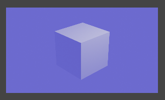

Animate Property
----------------

This property can be animated. Activating this button sets a keyframe.

Custom PropertiesPanel - All Renderers
======================================

Here you can define custom properties that can be used for scripting.

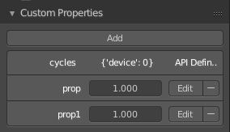

Here you might also find custom properties from addons or scripts.

Add
---

Adds a new property.

Edit
----

A panel where you can adjust the settings for the custom property.

Remove
------

Removes the property.

Surface Panel - Eevee and Cycles
================================

Use Nodes
---------

Use Nodes or simple background color.

When you use Nodes then you will reveal further options.

Color without nodes
-------------------

The color that you can choose here is the background color for rendering the image.

Surface
-------

Here you can choose what shader you want to use for the background. Usually the Background shader. But you can use any shader in the list here too.

The options below changes dependant of the shader that you choose. They are explained in the shader editor chapter.

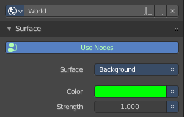

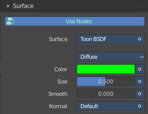

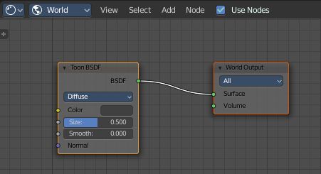

Cycles - Preview Panel
======================

The Preview panel gives you a preview of the background color.

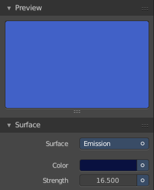

Cycles - Volume Panel
=====================

This panel just appears when you tick Use Nodes. 

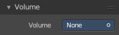

Volume rendering is a method to render light as it passes through a media within a 3D region. Here you can choose a shader for volume rendering.

Cycles - Ambient Occlusion Panel
================================

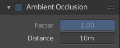

Ambient Occlusion is a method to self shadow surfaces in corners. The closer the faces to each other, the darker they get.

Enable
------

In the header is a checkbox to enable Ambient Occlusion.

Factor
------

The factor for ambient occlusion blending.

Distance
--------

The maximum distance at which Ambient Occlusion gets calculated.

Cycles - Ray Visibility Panel
=============================

Here you can adjust the ray visibility.

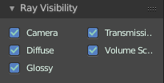

Camera
------

Object Visibility for Camera rays.

Diffuse
-------

Object Visibility for Diffuse Reflection rays.

Glossy
------

Object Visibility for Glossy Reflection rays.

Transmission
------------

Object Visibility for Transmission rays.

Volume Scatter
--------------

Object Visibility for Volume Scatter rays.

Cycles - Settings Panel
=======================

Surface
-------

Sampling
--------

Here you can choose the method for the surface sampling.

Map Resolution
--------------

When you choose sampling method manual, then you can adjust the map resolution here.

Max Bounces
-----------

Maximum number of bounces the background light will contribute to the render.

Volume
------

Sampling
--------

Here you can choose the volume sampling method.

Interpolation
-------------

Here you can choose between cubic and linear interpolation.

Homogenous
----------

When using volume rendering, assume that the volume has the same density everywhere.

