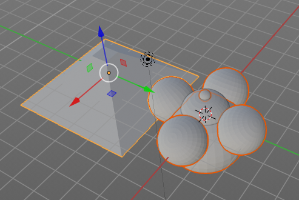

*********************************************
25.7 Editors - Properties Editor - Object Tab
*********************************************

.. contents:: Contents


Object Tab
==========

The Object tab contains all general object related settings like Transform, Relation or Collection related things. It is the same for all object types and in all modes.


Object Edit Box
===============


Here youcan read what object is currently selected. Here you can also choose another object in the list at the left.. And you can rename the object.


Transform Panel
===============

Transform is position, rotation and scale of the object. It is partially the same content that you see in Object mode in the Properties sidebar in the 3D view. 


However, when you switch to Edit mode, with a Bone for example, then you will still have the overall world transform values for the object here, while the Transform paneln in the Properties sidebar now displays the edit transform values for the bone.


Location
--------

The location of the object.


Rotation
--------

The rotation of the object.


Scale
-----

The scale of the object.


Lock
----

This properties can be locked.


Animate Properties
------------------

This properties can be animated. Activating the Animate Property button sets a keyframe.


Rotation Mode
-------------

The rotation mode. Euler angles are fine for most needs. But sometimes you want to use Quaternion to avoid gimbal lock. Gimbal lock is a mathematical problem where the rotation locks up in two instead of three degrees of freedom.


Delta Transform
---------------

Transforms are absolute to the world coordinates. Delta Transforms are relative to the current transformation.

Here you can adjust the delta transforms.


Delta Location
--------------

The delta location of the object.


Delta Rotation
--------------

The delta rotation of the object.


Delta Scale
-----------

The delta scale of the object.


Lock
----

This properties can be locked.


Animate Properties
------------------

This properties can be animated. Activating the Animate Property button sets a keyframe.


Relations Panel
===============

Here you can set up and adjust relations for the object.


Parent
------

Here you can set a parent object. One way is by the object picker at the right. Or choose the object in the list. This list appears by clicking at the edit box.


Parent Type
-----------

Here you can see and set the parent type.


Slow Parent
-----------

Create a delay in the parent relationship.

This feature is not renderfarm save. And may become invalid after jumping around the timeline.


Offset
------

The offset for slow parent.


Tracking Axis
-------------

The axis that points in forward direction.


Up Axis
-------

The axis that points in the up direction.

.. image:: graphics/25.7_Editors_-_Properties_Editor_-_Object_Tab/10000201000000640000006832CFA3974164A328.png


Pass Index
----------

The index number for the "Object Index" render pass.


Animate Properties
------------------

This properties can be animated. Activating the Animate Property button sets a keyframe.


Collections Panel
=================

Collections is a bunch of data, objects, cameras, lights, etc. , which you can manage in some ways at once. You can for example hide complete collections, include or exclude it from rendering, instance them, and so on. 


An object must be at least in one collection. Or it gets deleted. But an object can be in multiple collections. Here you can manage in what collection(s) the object is.


Add to collection
-----------------

A dropdown box where you can choose the collection that you want to add the object to.


Add Collection
--------------

At the end of the Add to Collection element is a + button where you can add more collections.


Collection
----------

This is the collection where the object is currently assigned at. As told, an object can be assigned to more than one collection.


Collection Name
---------------

Here you can read and edit the collection name


Remove
------

This deletes the collection from the object. Note that the collection still exists.


Collections Menu
----------------


Unlink Collection
-----------------

This deletes the collection from the object. Note that the collection still exists.


Select Objects in Collection
----------------------------

Selects all objects in the collection.


Set Offset From Cursor
----------------------

Set offset used for collection instance based on cursor position. (Narp, i don't understand this neither. Waiting for the Blender manual here ...)


Offset
------

Offset from the origin to use when instancing.


Duplication Panel
=================

Here you find settings for Dupliframes, Dupliverts and Dupliface. They require a special setup each.

The duplicated geometry by this method are instances of the mother object. And so they cannot be treaten like real objects. 

.. image:: graphics/25.7_Editors_-_Properties_Editor_-_Object_Tab/10000201000001B60000018921A4DBB50F16F9E4.png

To turn them into editable geometry go to Object menu, and choose Apply / Make Duplicates real.


None
----

No duplication happens.


Dupliframes
-----------

Note that this tool is currently broken! And does not work as expected. Waiting for a fix.


DupliFrames is a tool to duplicateobjects at frames distributed along a path.


Workflow with follow frame:
---------------------------

Create a bezier curve. In its Object Data tab tick Path Animation, tick Follow, and set the frames to whatever you need.

Create a cube. In its duplication panel tick Frames. And disable Speed.


Now parent the Cube to the Bezier Curve. 


You will notice that you will have a second cube now. An instance. When you shrub the time line, then this instanced cube will move. The position of the original cube relative to the circle is important to determine the position and movement of the instance.


Workflow as an array tool:
--------------------------

Create a bezier path. Tweak it to your needs.

Parent the cube to the path.

In the Duplication panel, tick Frames, and untick Speed. This should give you already a result. 

As told above, this tool is currently broken.


DupliFrames Tools
-----------------


Start
-----

Start Frame for Dupliframes.


End
---

End Frame forDupliframes.


On
--

Number of Frames to use between DupOff Frames. 


Off
---

Recurring frames to exclude from the dupliframes. With 100 frames and 20 off you will have 5 instances.

Example for on off. Lets say you have on with 4 and Off with 20. With 100 frames and 20 off you will have 5 instances as told above. And On 4 produces four extra instances here for each of this 5 instances. So we have 20 in the end. Distributed as shown below.


Display Dulipcator
------------------

Duplicator is our parent object, the cube. Display the duplicator in the viewport.


Render Duplicator
-----------------

Duplicator is our parent object, the cube. Render the duplicator.

Note that the child object in the center will always render. This one can't be turned off.


Dupliverts
----------

**DupliVerts** is the duplication of a base object at the location of the vertices of a mesh. In other words, an instance of the base object is placed on every vertex of the mesh.


Workflow:
---------

Create a cube, create a sphere. For demonstration purposes, move the sphere a bit off.Parent the sphere to the cube ( select sphere, hold down shift, select cube, press ctrl p). Cube must be the parent, sphere the child.


Select just the cube. In the Duplication Panel enable Verts.


As a result you will now have eight spheres around the childsphere, since the cube has eightvertices. The center point is the sphere. 


Dupliverts Tools
----------------


Display Dulipcator
------------------

Duplicator is our parent object, the cube. Display the duplicator in the viewport.


Render Duplicator
-----------------

Duplicator is our parent object, the cube. Render the duplicator.

Note that the child object in the center will always render. This one can't be turned off.


Rotation
--------

Without rotation the instances points all into the initial direction of the parent object. With rotation they point away from parent object.


Dupliface
---------

**DupliFaces** replicates an object on each face of a parent object, using the initial child object as the center. The faces of the parent object is the pattern that gets used as the pattern to create the duplicated objects. The child object gets used as the center point, and of course to duplicate the geometry from.


Workflow:
---------

Create a cube, create a sphere. Move the cube a bit off. Parent the sphere to the cube ( select sphere, hold down shift, select cube, press ctrl p). Cube must be the parent, sphere the child.

In the Duplication Panel enable Faces.


As a result you will now have six spheres at the childsphere, since the cube has six sides.


.. Note:: ``The location, orientation, and scale of the duplicated child(ren) matches that of the faces of the parent. So, if several ````objects```` are parented to the cube, they will all be duplicated once for each face on the cube. If the cube is subdivided, every child will be duplicated for each face on the cube.``


Dupliface Tools
---------------


Scale
-----

When you tick scale then you can control the size of the child objects.

With Scale ticked you can also influence the size of the child objects by changing the parent geometry.




Inherit Scale
-------------

The scale factor for scale.


Display Dulipcator
------------------

Duplicator is our parent object, the cube. Display the duplicator in the viewport.


Render Duplicator
-----------------

Duplicator is our parent object, the cube. Render the duplicator.

Note that the child object in the center will always render. This one can't be turned off.


Animate Properties
------------------

This properties can be animated. Activating the Animate Property button sets a keyframe.


Motion Paths Panel
==================

.. image:: graphics/25.7_Editors_-_Properties_Editor_-_Object_Tab/10000201000000C9000000C542486F7E93BDE249.png

Motion paths is a visual helper to judge the motion of objects.

Motion paths are not displayed by default. They need to be calculated. This can be done here.


Workflow:
---------


We simply need a motion animation first. For example a moving cube. 

Add a cube. Chooose a keying set. Set a keyframe at let's say frame 0. Go to frame 24. Move the object. Set a keyframe at frame 20.

Click Calculate. You will now see the motion path of this objet.


Motion Paths Tools:
-------------------


Paths Type
----------

There are two path types available.


In Range
--------

Displays the full range of the motion path.


Paths range update
------------------

Update Frame Range for Motion paths from the scene's current frame range.


Frame Range Start
-----------------

The start frame.


End
---

The end frame.


Step
----

Number of frames between paths shown.


Around Frame
------------

Displays just the motion path around the current frame. Not the whole path.


Frame Range before
------------------

The frames to display before the current frame.


After
-----

The frames to display after the current frame.


Step
----

Number of frames between paths shown.


Cache From and To
-----------------

Not editable. Internal cache information that should be hidden.


Update Paths
------------

Update the paths after any changes at the animation. You have to update the paths too if you change settings like the paths type.


Delete Paths
------------

Deletes ALL motion paths caches in the scene. Hold down shift to delete just the path for the current object.


Display
-------

Here you find some display options for the path.


Frame Numbers
-------------

Display the frame number above every knot of the motion path


Keyframes
---------

Display the keyframes in the path as orange dots.


Keyframe Numbers
----------------

Display the keyframe number above every keyframe.


Lines
-----

Display a line between the points.


Thickness
---------

The line thickness.


Custom Color
------------

Here you can define a custom color for the motion path. A click at the color area opens a color picker.


Viewport Display Panel
======================

Here you will find some further display options for the object. Object name, Wire Frame in Object Mode, etc.


Some of these settings will override general settings. For example when you set the maximum draw type (Display as) to Wire, then it will always display as wire, regardless if you set the Viewport render method to Material or Textured. 

The content is different for different object types. Mesh objects have more display options than a bone for example.


Display as
----------

Bones only. Here you can define what bone type you use. It's not only the bones shape. For example, Bendy bones can bend and twist. And the Envelope type displays also the envelope of the bones.

Bendy bones settings can be found in the Bone Property Tab in the Bendy Bones panel.


Name
----

Display the object name at the pivot point.


Wireframe
---------

Display parts of the wireframe in Object Mode. See All Edges.


Texture Space
-------------

Display the objects texture space. This has to do with the mapping. A sphere can for example have a cubic mapping.


In Front
--------

X Ray. Display this object in front of all other objects.


Axis
----

Display the objects axis. Best done with Wireframe display mode. Solid faces may hide the axis. Or tick in Front. Then the axis gets also drawn above the mesh faces.


All Edges
---------

This is a hieronymus bosch feature from Blender developers that will most probably trap you again and again. When you tick Wireframe then SOME of the edges of the object gets displayed. You need to tick all edges to display the whole Wireframe. 


Shadow
------

The object should throw a shadow in the 3D view.

Broken Feature.


Display As
----------

Here you can adjust the maximum display method for the object. For example when you set the maximum draw type to Wire, then it will always display as wire, regardless if you set the Viewport render method to Material or Textured. 


Bounds
------

Display the bounding box for this object. And you can choose what shape to choose. There is more than just the classical box shape available.


Color
-----

Object Color and Alpha that is used when Faces have the ObColor Mode enabled.

No idea where that gets enabled. Thanks Blender Devs!


Custom PropertiesPanel
======================

Here you can define custom properties that can be used for scripting.

.. image:: graphics/25.7_Editors_-_Properties_Editor_-_Object_Tab/100002010000011C000000A371890A13CA5FC774.png

Here you might also find custom properties from addons or scripts.


Add
---

Adds a new property.


Edit
----

A panel where you can adjust the settings for the custom property.


Remove
------

Removes the property.

