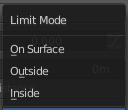
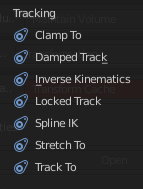
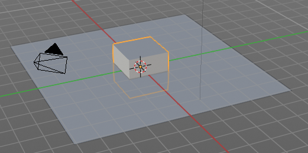

*********************************************************
25.8 Editors - Properties Editor - Object Constraints Tab
*********************************************************

.. contents:: Contents

Detailled Table of content
==========================

Object Constraints
==================

Object Constraints allows two objects to interact with each other. You can for example set the x position to the x position of another object with the Copy Location constraint. 

You can have more than one constraint at an object.

There are four groups of object constraints.

Motion Tracking constaints constraints with Motion Tracking functionality.

Transform contains constraints around everything transform related.

Tracking contains constraints around animation functionality.

And Relationship contains constraints around relations.

General functionality
=====================

Add
---

To add a constraint to an object, simply open the dropdown menu, and choose the type of constraint that you want to add.

This will add the constraint to the list.

For some constraints you will also find menu items in the 3D view. The Inverse Kinematics / Add IK to Bone is such an example. It also fills in some vital information already in some cases, which you would need to choosee by hand when you add the constraints in the constraint tab.

This menu entries exists to simplify the workflow. This menu entries are described in other chapters.

Enable / Disable
----------------

You might want to disable a constraint temporarily. This can be done by clicking at the button with the eye icon in the header. To enable the constraint simply click it again.

Remove
------

To remove a constraint from the object simply click the close button up right in the header.

Collapse panel
--------------

The whole constraints panel can be collapsed. Click at the arrow button up left in the header.

Reorder
-------

You can have more than one constraint in the list. And sometimes the order of the constraints is very important. 

When you have more than one constraint in the list then you will see some additional buttons appear in the header. This buttons allows you to move the constraint up or down in the list.

Missing Data - Red text in the header
-------------------------------------

When the constraint name is red underlayed then there is some vital data missing. For example the other object where this constraint should refer to.

The Target edit box is empty in the upper constraint. Click at it, and choose the object where this constraint should refer to.

Motion Tracking Constraints
===========================

This constraints gets used in Motion Tracking.

Camera Solver
-------------

The Camera Solver constraint gives the owner of this constraint, the location and rotation of the «solved camera motion».

The «solved camera motion» is where Blender reconstructs the position of the physical, real-world camera, when it filmed the video footage, relative to the thing being tracked.

Note: This constraint only works after you have set up a minimum of eight markers and pressed Solve Camera Motion. See motion tracking chapter.

Active Clip
-----------

Receive tracking data from the active clip in the Movie Clip editor. If unchecked, an option appears to choose from the other clips.

Constraint to F-Curve
---------------------

Applies the constraint, and creates Keyframes for the transforms.

Influence
---------

The influence level of this constraint.

Follow Track
------------

This constraint makes objects have the same position at a frame as the track has.The motion of this object happens on a single plane defined by the camera and the original position of the object.

Active Clip
-----------

Receive tracking data from the active movie clip in the Movie Clip editor. If unchecked, an option appears to choose from the other available clips.

3D Position
-----------

Use the 3D position of the track to parent to.

Undistorted
-----------

Parent to the undistorted position of the 2D track.

Frame Method
------------

Defines how the footage is fitted in the camera frame.

Camera
------

Select the camera to which the motion is parented to (if active an empty scene camera is used).

Depth Object
------------

If this object is set, constrained objects will be projected onto the surface of this depth object which can be used to create facial makeup visual effects.

Constraint to F-Curve
---------------------

Creates F-Curves for the object that copies the movement caused by the constraint.

Influence
---------

The influence level of this constraints.

Object Solver
-------------

The Object Solver constraint gives the owner of this constraint, the location and rotation of the «solved object motion».

This can be used to add a mesh to video for example.

Note: This constraint only works after you have set up a minimum of eight markers and pressed Solve object Motion.

If it says Solve Camera Motion instead of Solve Object Motion then go into the Movie Clip Editor ? Properties region ? Objects and switch it from the camera, to an object.

Active Clip
-----------

Receive tracking data from the active movie clip in the Movie Clip editor. If unchecked, an option appears to choose from the other available clips.

Camera
------

Here you can choose the camera.

Set Inverse / Clear Inverse
---------------------------

Set the connection for the object solver constraint inverse.

Clear the inversion.

Constraint to F-Curve
---------------------

Creates F-Curves for the object that copies the movement caused by the constraint.

Influence
---------

The influence level of this constraint.

TransformConstraints
====================

Here you can find transform constraints.

Copy Location
-------------

The **Copy Location** constraint sets the position to the position of the target object. 

.. list-table::

	* - Warning

	* - Usingthis constraint on a **connected** bonewill have no effect. Because it is the parent’s tip which controls the position of your owner bone’s root.

Target 
-------

Here you can choose the target object to copy the location from.

Bone 
-----

If the **Target** is an **Armature**, then you have the optional choice to set an individual bone as **Target**.

Head/Tail 
----------

If the target is a bone, then here you can adjust where along this bone the target point lies. 

Vertex Group 
-------------

If the **Target** is a **Mesh**, then you have the optional choice to set a **Vertex Group** as target. 

X, Y, Z 
--------

Here you can choose which axes to constraint.

Invert 
-------

Inverts the coordinate input. Positive becomes negative, and vice versa.

Offset 
-------

Add an offset from the original position to the target position.

Space 
------

Here you can choose the target space and its coordinate system to use for calculation. The local space uses local axis, the world space global axis ...

Influence
---------

The influence level of this constraint.

Copy Rotation
-------------

The **Copy ****Rotation** constraint sets the rotation to the rotation of the target object. 

Target 
-------

Here you can choose the target object to copy the rotation from.

Bone 
-----

If the **Target** is an **Armature**, a new field is displayed offering the optional choice to set an individual bone as **Target**.

Vertex Group 
-------------

If the **Target** is a **Mesh**, a new field is displayed offering the optional choice to set a **Vertex Group** as target. 

X, Y, Z 
--------

These buttons control which axes are constrained - by default, all three are on.

Invert 
-------

Inverts the coordinate input. Positive becomes negative, and vice versa.

Offset 
-------

Add an offset from the original position to the target position.

Space 
------

Here you can choose the target space and its coordinate system to use for calculation. The local space uses local axis, the world space global axis ...

Influence
---------

The influence level of this constraint.

Copy Scale
----------

The **Copy ****Scale** constraint sets the size to the size of the target object. 

Target 
-------

Here you can choose the target object to copy the size from.

Bone 
-----

If **Target** is an **Armature**, a new field is displayed offering the optional choice to set an individual bone as **Target**.

Vertex Group 
-------------

If **Target** is a **Mesh**, a new field is displayed offering the optional choice to set a **Vertex Group** as target. 

X, Y, Z 
--------

These buttons control which axes are constrained - by default, all three are on.

Offset 
-------

Add an offset from the original scale to the target scale.

Additive
--------

Use Addition instead of Multiplication to combine scale. This is a compatibility feature to Blender 2.79 and Bforartists 1

Space 
------

Here you can choose the target space and its coordinate system to use for calculation. The local space uses local axis, the world space global axis ...

Influence
---------

The influence level of this constraint.

Copy Transforms
---------------

The **Copy ****Transform** constraint copies the whole transform values from the target object. Location, Rotation and Scale.

Target 
-------

Here you can choose the target object to copy the location from.

Bone 
-----

If the **Target** is an **Armature**, a new field is displayed offering the optional choice to set an individual bone as **Target**.

Head/Tail 
----------

If the target is a bone, then here you can adjust where along this bone the target point lies. 

Space 
------

Here you can choose the target space and its coordinate system to use for calculation. The local space uses local axis, the world space global axis ...

Influence
---------

The influence level of this constraint.

Limit Distance
--------------

The **Limit Distance** constraint constraints either outside, inside, or at the surface of a sphere centered at the target object.

Target 
-------

Here you can choose the target object.

Vertex Group 
-------------

If **Target** is a **Mesh**, a new field is displayed offering the optional choice to set a **Vertex Group** as target. 

Bone 
-----

If the **Target** is an **Armature**, a new field is displayed offering the optional choice to set an individual bone as **Target**.

Head/Tail 
----------

If the target is a bone, then here you can adjust where along this bone the target point lies. 

Distance 
---------

This numeric field sets the limit distance, i.e. the radius of the constraining sphere. 

Reset Distance 
---------------

When clicked, this small button will reset the **Distance** value, so that it corresponds to the actual distance between the owner and its target (i.e. the distance before this constraint is applied). 

Clamp Region 
-------------

The **Limit Mode** drop-down menu allows you to choose how to use the sphere defined by the **Distance** setting and target’s center:

Inside
------

The owner is constrained **inside** the sphere. 

Outside 
--------

The owner is constrained **outside** the sphere. 

Surface 
--------

The owner is constrained **on the surface** of the sphere. 

Space 
------

Here you can choose the target space and its coordinate system to use for calculation. The local space uses local axis, the world space global axis ...

Influence
---------

The influence level of this constraint.

Limit Location
--------------

This constraint restricts the amount of allowed translations along each axis, through lower and upper bounds.

The limits for an object are calculated from its center. Te limits of a bone are calculated from its root.

Minimum X Y Z
-------------

Restrict the minimum location. You can adjust the value in the edit box below.

Maximum X Y Z
-------------

Restrict the maximum location. You can adjust the value in the edit box below.

For Transform
-------------

The constraint limits the location. The values in the transform panel can still change above this limit though. Wiht this option ticked the transform values are also clamped.

Convert
-------

Calculate the constraint in local space or world space.

Influence
---------

The influence level of this constraint.

Limit Rotation
--------------

This constraint restricts the amount of allowed rotation along each axis, through lower and upper bounds.

The limits for an object are calculated from its center. Te limits of a bone are calculated from its root.

Limit X Y Z
-----------

Restrict the rotation. You can adjust the minimum and maximum value in the edit boxes below.

For Transform
-------------

The constraint limits the rotation. The values in the transform panel can still change above this limit though. Wiht this option ticked the transform values are also clamped.

Convert
-------

Calculate the constraint in local space or world space.

Influence
---------

The influence level of this constraint.

Limit Scale
-----------

This constraint restricts the amount of allowed scale along each axis, through lower and upper bounds.

The limits for an object are calculated from its center. Te limits of a bone are calculated from its root.

Minimum X Y Z
-------------

The minimum size. You can adjust the value in the edit boxes below.

Maximum X Y Z
-------------

The maximum size. You can adjust the value in the edit boxes below.

For Transform
-------------

The constraint limits the location. The values in the transform panel can still change above this limit though. Wiht this option ticked the transform values are also clamped.

Convert
-------

Calculate the constraint in local space or world space.

Influence
---------

The influence level of this constraint.

Maintain Volume
---------------

The **Maintain Volume** constraint limits the volume of a mesh or a bone to a given ratio of its original volume.

Free X / Y / Z 
---------------

The free-scaling axis of the object. 

Volume 
-------

The bone’s rest volume. 

Convert
-------

Calculate the constraint in local space or world space.

Influence
---------

The influence level of this constraint.

Transformation
--------------

The Transformation constraint allows you to map one type of transform properties (i.e. location, rotation or scale) of the target, to the same or another type of transform properties of the owner, within a given range of values.

.. list-table::

	* - Warning

	* - 

Target
------

Here you can choose the target object.

Vertex Group 
-------------

If the **Target** is a **Mesh**, a new field is displayed offering the optional choice to set a **Vertex Group** as target. 

Bone 
-----

If the **Target** is an **Armature**, a new field is displayed offering the optional choice to set an individual bone as **Target**.

Extrapolate
-----------

With this option enabled the **min** and **max** values are no longer strict limits, but rather “markers” defining a proportional (linear) mapping between input and corresponding output values. 

Source
------

Loc Rot Scale
-------------

A tab to switch between the available location, rotation and scale values.

X Y Z
-----

The transform values. Here you can edit the minimum and maximum values for the source object.

Source to Destination Mapping
-----------------------------

Here you can choose to map specific axis to other axis than the source object.

Destination
-----------

Loc Rot Scale
-------------

A tab to switch between the available location, rotation and scale values.

X Y Z
-----

The transform values. Here you can edit the minimum and maximum values for the source object.

Influence
---------

The influence level of this constraint.

Transform Cache
---------------

The Transform Cache Constraint is used to be able to stream animations made at the transformation matrix level (for example rigid bodies, or camera movements). You need an alembic file with the animation. - And i have unfortunately no idea how to produce the required file. Thanks Blender manual writers!

Cache File Properties
---------------------

Here you can select the Alembic file.

Is sequence
-----------

If the file is a series of files.

Override Frame
--------------

Whether to use a cuctom frame for looking up data in the cache file, instead of using the current scene frame.

Frame
-----

The time to use for looking up the data in the cache file, or to determine which to use in a file sequence.

Manual Transform Scale
----------------------

Value by which to enlarge or shrink the object with respect to the world’s origin.

Object Path
-----------

The path to the Alembic object inside the archive.

Verts/Faces/UV/Color
--------------------

Type of data to read for a mesh object respectively: vertices, polygons, UV layers and Vertex Color layers.

Influence
---------

The influence level of this constraint.

Tracking Constraints
====================

Clamp To
--------

The **Clamp To** constraint clamps an object to a curve. So you need a curve object as the target.

Target
------

Here you can choose the target object.

Main Axis
---------

Auto clamps to all three axis. X , Y, Z maps just to one axis,.

Cyclic
------

With cyclic enabled the object will jump from end point to start point once it has reached the end.

Influence
---------

The influence level of this constraint.

Damped Track
------------

Damped track makes the object always look at the target object. For example a camera always looking at a armature.

Target
------

Here you can choose the target object.

Vertex Group 
-------------

If the **Target** is a **Mesh**, a new field is displayed offering the optional choice to set a **Vertex Group** as target. 

Bone 
-----

If the **Target** is an **Armature**, a new field is displayed offering the optional choice to set an individual bone as **Target**.

Head/Tail 
----------

If the target is a bone, then here you can adjust where along this bone the target point lies. 

To
--

The axis to use to point towards the target object. For a camera you might want to use -Z

Influence
---------

The influence level of this constraint.

Inverse Kinematics
------------------

Invese Kinematics is just used at an armature, for posing purposes. It is not available for other object types. And can not be added from this panel. 

This constraint is explained in the chapter Bone Constraints.

Locked Track
------------

Similar to Damped Track. Locked track makes the object always look at the target object. For example a camera always looking at a armature. But here you can lock single axis.

Note, you cannot lock the axis where you look at. The constraint will show the name red then.

Target
------

Here you can choose the target object.

Vertex Group 
-------------

If the **Target** is a **Mesh**, a new field is displayed offering the optional choice to set a **Vertex Group** as target. 

Bone 
-----

If the **Target** is an **Armature**, a new field is displayed offering the optional choice to set an individual bone as **Target**.

Head/Tail 
----------

If the target is a bone, then here you can adjust where along this bone the target point lies. 

To
--

The axis to use to point towards the target object. For a camera you might want to use -Z

Lock
----

The axis that you want to lock.

Influence
---------

The influence level of this constraint.

Spline IK
---------

Spline IK constraints can only be added to bones. It is not available for other object types. And can not be added from this panel. 

This constraint is explained in the chapter Bone Constraints.

Stretch To
----------

Stretch To makes the object always look at the target object. For example a cube always looking at another cube. And makes it stretch when the distance changes.

With bones, the “volumetric” variation scales them along their own local axes (remember that the local Y axis of a bone is aligned with it, from root to tip).

Target
------

Here you can choose the target object.

Vertex Group 
-------------

If the **Target** is a **Mesh**, a new field is displayed offering the optional choice to set a **Vertex Group** as target. 

Bone 
-----

If the **Target** is an **Armature**, a new field is displayed offering the optional choice to set an individual bone as **Target**.

Head/Tail 
----------

If the target is a bone, then here you can adjust where along this bone the target point lies. 

Rest Length 
------------

Here you can define the rest distance between the owner and its target. The rest length is the distance at which there is no deformation (stretching) of the owner.

Reset 
------

Resets the Rest Length.

Volume Min / Volume Max
-----------------------

Here you can control the amount of “volume” variation proportionally to the stretching amount. Note that the 0.0 value is not allowed.

Smooth
------

Strength of volume stretching clamping.

Volume 
-------

Here you can adjust which of the X and/or Z axes should be affected to preserve the virtual volume while stretching along the Y axis. The NONE button disables the volumetric features.

Plane 
------

Here you can control which of the X or Z axes should be as much as possible aligned with the global Z axis, while tracking the target with the Y axis. 

Influence
---------

The influence level of this constraint.

Track To
--------

Track To makes the object always look at the target object. For example a cube always looking at another cube. Or a camera looking at a mesh.

Target
------

Here you can choose the target object.

Vertex Group 
-------------

If the **Target** is a **Mesh**, a new field is displayed offering the optional choice to set a **Vertex Group** as target. 

Bone 
-----

If the **Target** is an **Armature**, a new field is displayed offering the optional choice to set an individual bone as **Target**.

Head/Tail 
----------

If the target is a bone, then here you can adjust where along this bone the target point lies. 

To
--

The axis to use to point towards the target object. 

Up
--

The axis that points upwards

Target Z
--------

Constrain the UP direction to the target's Z axis instead of hte World Z Axis.

Space 
------

Here you can choose the target space and its coordinate system to use for calculation. The local space uses local axis, the world space global axis ...

Influence
---------

The influence level of this constraint.

RelationshipConstraints
=======================

Action
------

The Action constraints allows you control an **Action** using the animated transformations of another object. For example move a cube when another cube moves by animation, without the need to record this movement by a keyframe. There needs to be a animation in the scene, not necessarily at the target object, which is used as the Action for the constraint.

The constraint accepts the **Mesh** action type. But only the **Object**, **Pose** and **Constraint** types are really working, since constraints can only affect objects’ or bones’ transform properties, and not meshes’ shapes. 

Only the object transformation (location, rotation, scale) is affected by the action.Keyframes for other properties are ignored. The constraints does not influence them.

Example:
--------

Create a cube. Animate it to create the needed action. Move from a to b for example. And record the keyframes. This will create a action that is now available to the constraint.

Moving the target in the [0.0, 2.0] range along its X axis maps the action content on the owner in the [0, 100] frame range. This will mean that when the target’s X property is 0.0 the owner will be as if in frame 0 of the linked action. With the target’s X property at 1.0 the owner will be as if in frame 50 of the linked action, etc.

Target
------

Here you can choose the target object.

Vertex Group 
-------------

If the **Target** is a **Mesh**, a new field is displayed offering the optional choice to set a **Vertex Group** as target. 

Bone 
-----

If the **Target** is an **Armature**, a new field is displayed offering the optional choice to set an individual bone as **Target**.

From Target
-----------

Here you can choose which transform property from the target to use as “action driver”. 

Target Space 
-------------

This constraint allows you to choose in which space to evaluate its target’s transform properties. 

To Action 
----------

Here you can choose the action that you want to use. Available actions appears in the dropdown list.

Object Action 
--------------

This is for bones only. This option will make the constrained bone use the “object” part of the linked action, instead of the “same-named pose” part. This allows you to apply the action of an object to a bone. 

Target Range Min / Max 
-----------------------

The lower and upper bounds of the driving transform property value. By default, both values are set to 0.0

Note:

• When using a rotation property as “driver”, these values are “mapped back” to the [-180.0- , 180.0- [ range. 

• When using a scale property as “driver”, these values are limited to null or positive values. 

Action Range Start / End 
-------------------------

The starting and ending frames of the action to be mapped.

Note:

• These values must be strictly positive. 

• By default, both values are set to 0 which disables the mapping (i.e. the owner just gets the properties defined at frame 0 of the linked action...). 

Influence
---------

The influence level of this constraint.

Notes
-----

- When the linked action affects some location properties, the owner’s existing location is added to the result of evaluating this constraint (exactly as when the **Offset** button of the **Copy Location constraint** is enabled...). 
- When the linked action affects some scale properties, the owner’s existing scale is multiplied with the result of evaluating this constraint. 
- When the linked action affects some rotation properties, the owner’s existing rotation is overridden by the result of evaluating this constraint. 
- Unlike usual, you can have a **Start** value higher than the **End** one, or a **Min** one higher than a **Max** one: this will reverse the mapping of the action (i.e. it will be “played” reversed...), unless you have both sets reversed, obviously! 
- When using a **Constraint** action, it is the constraint **channel’s names** that are used to determine to which constraints of the owner apply the action. E.g. if you have a constraint channel named “trackto_empt1”, its keyed **Influence** and/or **Head/Tail** values (the only ones you can key) will be mapped to the ones of the owner’s constraint named “trackto_empt1”. 
- Similarly, when using a **Pose** action (which is obviously only meaningful and working when constraining a bone!), it is the bone’s name that is used to determine which bone **channel’s names** from the action to use (e.g. if the constrained bone is named “arm”, it will use and only use the action’s bone channel named “arm”...). Unfortunately, using a **Pose** action on a whole armature object (to affect all the keyed bones in the action at once) won’t work... 
- Note also that you can use the **pose library feature** to create/edit a **Pose** action data-block... just remember that in this situation, there’s one pose per frame! 
- 

Child Of
--------

This constraints allows you to set a parent to this object. By using more than one constraint you can have more than one parent object here, and control the influence by the Influence slider. You can also just parent the movement of a specific axis.

Target
------

Here you can choose the target object.

Vertex Group 
-------------

If the **Target** is a **Mesh**, a new field is displayed offering the optional choice to set a **Vertex Group** as target. 

Bone 
-----

If the **Target** is an **Armature**, a new field is displayed offering the optional choice to set an individual bone as **Target**.

Location, Rotation, Scale
-------------------------

Activate the parenting for the corresponding axis.

Set Inverse / Clear Inverse
---------------------------

Set the connection for the object solver constraint inverse.

Clear the inversion.

Influence
---------

The influence level of this constraint.

Floor
-----

The Floor constraints allows to set an object as a floor or wall that cannot be passed by the object.

Note that the center of the object is calculated as the collision point, not the surface. Means a cube with the pivot in the center can still sink half into a groundplane. This can be adjusted with the Offset value.

Target
------

Here you can choose the target object.

Vertex Group 
-------------

If the **Target** is a **Mesh**, a new field is displayed offering the optional choice to set a **Vertex Group** as target. 

Bone 
-----

If the **Target** is an **Armature**, a new field is displayed offering the optional choice to set an individual bone as **Target**.

Sticky 
-------

The object sticks at its position at contact. For example, it cannot slide around on the surface of a plane any more. 

Use Rotation 
-------------

Take the target’s rotation into account. This allows you to have a “floor” plane of any orientation you like, not just the global XY, XZ and YZ ones... 

Offset
------

Here you can define an offfset from the pivot to the ground plane object.

Min / Max
---------

Here you define which side of the target object will be ther floor.

By default, these normals are aligned with the global axes. If you enable Use Rotation (see above), they will be aligned with the local target’s axes. 

Space 
------

Here you can choose the target space and its coordinate system to use for calculation. The local space uses local axis, the world space global axis ...

Influence
---------

The influence level of this constraint.

Follow Path
-----------

Makes the object follow a curve path. This constraint requires a Bezier or Nurbs Curve. Follow Path is an animation only constraint.

The movement happens in the global world.

Click at Animate Path to create the animation. When you play the animation, then the object will move along the path now. The path length can be adjusted in the Path Animation panel of the curve. Here you can see that the value behind evaluation time is now green. And there is a keyframe symbol behind the edit box. Adjust the number of frames to your needs.

Pivot
-----

The **Pivot** constraint allows the owner to rotate around a target object.

Target
------

Here you can choose the target object.

Vertex Group 
-------------

If the **Target** is a **Mesh**, a new field is displayed offering the optional choice to set a **Vertex Group** as target. 

Bone 
-----

If the **Target** is an **Armature**, a new field is displayed offering the optional choice to set an individual bone as **Target**.

Head/Tail 
----------

If the target is a bone, then here you can adjust where along this bone the target point lies. 

Pivot Offset
------------

Here you can adjust an offset.

Pivot When
----------

Enable rotation range for specific axis.

Influence
---------

The influence level of this constraint.

Shrinkwrap
----------

The **Shrinkwrap** constraint allows you to snap objects to the surface of mesh objects. The target object has to be a Mesh object. Other object types does not work.

The snap point is the pivot point of the object.

Distance
--------

Here you can adjust an offset.

Shrinkwrap Mode
---------------

Here you can choose between different shrinkwrap methods.

Target Normal Project
---------------------

Target the nearest target surface along the interpolated vertex normals of the target.

Nearest Vertex
--------------

Target the nearest vertex at the target.

Project
-------

Target the nearest surface point along a given axis.

Axis constraint to
------------------

Here you can define the axis

Axis Space
----------

Here you can define the space that gets used for this axis.

Face Culling
------------

Stop vertices from projecting to a face on the target when facing towards or away.

Project Opposite
----------------

Project in both specified and opposite directions.

Invert Cull
-----------

Invert the face cull mode.

Project Distance
----------------

Limit the distance used for projection. Zero disables the Project Distance.

Nearest Surface Point
---------------------

Target the nearest surface point.

Align Axis to Normal
--------------------

Align a specified axis to the surface normal.

Influence
---------

The influence level of this constraint.

Armature
--------

I have no idea what the Armature constraint is good for. It is not documented in the Blender manual yet. And i couldn't figure out the useage.

This constraint requires to have a armature as the target object.

Add Target Bone
---------------

Add a target bone. By clicking two edit boxes becomes available.You can add multiple armatures and bones here.

First Edit Box
--------------

Here you select the armature.

Second Edit Box
---------------

Here you select the bone.

Remove Target
-------------

Remove the target. Resets Add Target Bone.

Blend Weight
------------

Blending Weight of this bone.

Normalize Weights
-----------------

Normalize the weights of all target bones.

Preserve Volume
---------------

Tries to preserve the volume when deforming the mesh.

Use Envelopes
-------------

Multiply the weights by envelope for all bones instead of vertex group based blending. The specified weights are still used, and only the listed bones are considered.

Influence
---------

The influence level of this constraint.

Animate Property
----------------

This property can be animated. Activating this button sets a keyframe.

