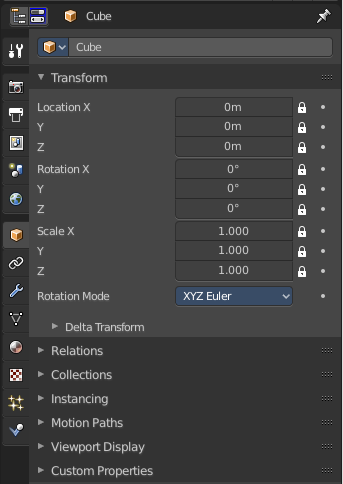
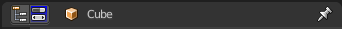
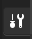

******************************
25 Editors - Properties Editor
******************************

.. contents:: Contents

Properties Editor
=================

The **Properties Editor** is the core to manage the data in Bforartists. It is used to edit data and properties for the **Active Scene** and the **Active Object**. It contains Scene and Object related settings and properties. It contains all the tool settings for the current active tool. And it contains global settings and properties, like Rendersettings. Materials, Particle settings. etc.

The Properties editor is divided into several tabs. And the tabs are divided into several panels. The tabs buttons can be found asides.

Various content just appears when you are in the right context. Means when you have a specific object type selected, are in a specific mode, etc. 

Header and Tabs
===============

The header contains a menu to switch to Outliner and back. The icon in which tab you are. And the name of the currently selected object. It can also contain a breadcrumb, dependand of where you are.

Context pin
-----------

The header can also contain a pin icon in some areas. This pin icon allows you to collapse the tabs to just the tabs that are available for the currently selected kind of object type.

Editortype Menu
---------------

You can display a Editortype Menu in the header. Here you can switch to another editor type. Note that this menu is hidden by default. You can reveal it in the right click menu of the header area.

Navigation Tabs
---------------

The navigation tabs to navigate in the Properties Editor are vertically aligned besides the editor. 

It is divided into three sections. Tools section, Globals Section and Object Data section.

Tabs position
-------------

The tabs can be displayed at the left or at the right side. Either click right in the empty space of the tab area. This will bring up the Context menu where you can flip the whole tabs menu bar to the right or to the left. Or move with the mouse over the area and press F5.

The navigation tabs are divided into three groups. Tools section, Globals section and Object Data Section. We will cover the content of the different tabs in the corresponding section of the manual.

Tools Section
-------------

The tools section is just one tab. It contains the settings and options for the currently selected tool. This panels and settings are described in the chapters where the tools are described.

Note that all this options and settings are also available in the global header. It is one big double menu entry by design. You as the user can decide with what to work. The Topbar tool area can be hidden.

Globals section
---------------

The Globals section contains everything that is not related to the currently selected object. But global. Rendersettings, View-, Scene- and Worldsettings.

Object Data Section
-------------------

The Object Data section contains everything that is related to the currently selected object. From mesh data across material up to texture and particle system.

The content differs, dependant of the currently active object. For an Armature you will have other tabs than for a Mesh object, and other tabs for a Lattice object for example.

There are some general tabs though for all object types. Like Object, Constraints, Texture, or Physics tab.

