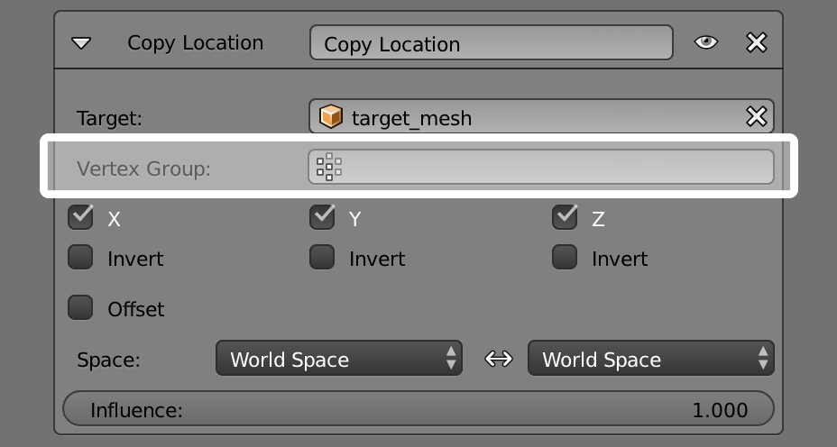

************************
49 Rigging - Constraints
************************

.. contents:: Contents

Rigging
=======

Rigging makes animation possible. Without a good rig animation is incredibly frustrating. Imagine animating a bouncing ball without the ability to squash it against the ground? Try animating a monkey swinging through the trees with no control to make the monkey’s hands grab onto the branches. What if you had to animate an army tank speeding through the desert by positioning each tread on the tank one at a time?

At its most basic level, rigging solves motion problems. Imagine a door that opens into a hallway. Without a rig, the door won’t swing open properly (1). A rig is needed to help the door swing open on its hinges (2,3,4), and there are many ways to rig the door. Door 2 gets rigged by repositioning the Object Center of the door. Door 3 gets rigged by Parenting the door to an Empty. Door 4 gets rigged by Weight Painting all of its Vertices to a Bone in an Armature.

Most production rigs are more complicated than a simple door, but be careful not to rush off building complicated rigs until you have developed some experience. Rigging is a discipline that takes practice. Start by building simple rigs (like a bouncing ball, a tumbling box, an odometer, a clock). Stay humble. Stay patient. Study the fundamental concepts that make a bouncing ball bounce. Add one rigging tool to your toolbox at a time. Test your simple rigs in actual animation projects. And only after much trial and error, consider putting everything together into the sophisticated character rig of your dreams.

.. See also:: The content of this chapter is simply a reference to how rigging is accomplished in Bforartists. It should be paired with additional resources such as Nathan Vegdahl’s excellent (and free!) introduction to the fundamental concepts of character rigging, Humane Rigging.

Constraints
===========

Constraints control the behavior of one object with data from another. Constraints can make the eyes of a tennis player track a tennis ball bouncing across the court. Constraints allow the wheels on a bus to all rotate together. Constraints help a dinosaur’s legs bend at the knee automatically. Constraints make it easy for a hand to grip the hilt of a sword and the sword to swing with the hand.

Constraints, in Bforartists, work with Objects and Bones.

Object Constraints.

Bone Constraints.

Constraints work in combination with each other to form a Constraint Stack.

The Constraint Stack is evaluated from top to bottom.

Constraints are a fantastic way to add sophistication and complexity to a rig. But be careful not to rush in too quickly, piling up constraint upon constraint until you lose all sense of how they interact with each other.

Start simply. Get to know a single constraint inside and out. Copy Location is a good first constraint to explore. Take the time to understand every fundamental concept behind it, and the other constraints will make far more sense.

Adding/Removing a Constraint
============================

To add a constraint in the **Constraints Panel**: 

Click on the “Add Constraint” drop-down box. 

To add a constraint in the 3D view: 

Select the object you would like to constrain. Go to and choose a constraint from the pop-up menu. If the chosen constraint needs a target, Bforartists will add an empty automatically as the target and position it at the center of the constrained object. 

To add a constraint in the 3D view and simultaneously give it a target: 

Select the target first and then shift-select the object you would like to constrain. Go to and choose a constraint from the menu. 

To remove a constraint: 

Click on the “X” button in the **header**. 

To remove all constraints from all selected object(s): 

	Click Object > Constraints > Clear Object Constraints in the 3D View Header.

or Pose > Constraints > Clear Pose Constraints (for bone constraints).

Header
======

Every constraint has a header. The interface elements of the header are explained below using a Copy Location constraint as an example.

A **Header** sits at the top of every constraint.

Expansion Arrow (pointing down or right) 

Show or Hide the settings of the constraint. Tidy up the **constraint stack** by hiding constraints that don’t currently need attention. Constraints will continue to affect the scene even when hidden. 

“Copy Location” (first occurrence) 

The type of constraint. This is determined at the time the constraint is created. 

“Copy Location” (second occurrence) 

	Give the constraint a meaningful name in this field, something that describes its intent. Meaningful names help you and your team members understand what each constraint is supposed to do.

	The **red** background is a warning that the constraint is not yet functional. The background will turn **gray** when the constraint is functioning. When this Copy Location constraint has a valid target in the “Target Field” it will turn gray and begin to function.

Eyeball (open or closed) 

	Enable or Disable (Mute/Unmute) the constraint. Disabling a constraint will stop its affect on the scene.

	Disabling a constraint is useful for turning off a constraint without losing all of its settings. Disabling means you can enable the constraint at a later time with the settings intact. Disabling is similar to setting the **influence** slider to 0.0.

Up/Down Arrows 

	Move a constraint up or down in the **constraint stack**. Since the stack is evaluated from top to bottom, moving a constraint in the stack can significantly affect the final outcome of the stack.

	If there is only one constraint in the stack, the arrows will not be drawn. If the constraint is at the top of the stack, only the down arrow will be drawn. If the constraint is at the bottom of the stack, only the up arrow will be drawn.

Delete

Delete the constraint from the stack. The settings will be lost. The constraint will no longer affect the final outcome of the stack. 

Target
======

The Target field lets you link the constraint to a Target object of your choosing. This link provides data to the constraint so that it can begin to function. For example, the Copy Location Constraint needs location data to function. Fill in the Target field, and the Copy Location constraint will begin to use location data from the Target object.

.. image:: graphics/25.xx_Rigging_-_Constraints/10000201000003A0000001B29486C599B3F3FB61.png

The **Target** field must be filled in for the constraint to function.

By default, the Target will use the Object Center as the target point.

If the Target field links to a Mesh or Lattice object, a Vertex Group field will appear. Enter the name of a vertex group and the constraint will target the median point of this vertex group instead of the object center.

If the Target field links to an Armature, a Bone field will appear along with a Head/Tail slider. Enter the name of a bone and the constraint will target the bone instead of the entire armature object center. Slide the slider and the constraint will target the head, the tail or somewhere inbetween.

Space
=====

Constraints need a frame of reference in order to function. This frame of reference is called the “space” of the constraint. Choosing one space vs. another will change this frame of reference and substantially alter the behavior of a constraint.

To understand how changing the space will change the behavior of the constraint, consider experimenting with two empties. Make sure they display as arrows so that you can see the local axes for each empty. Make sure to size one empty a little larger than the other so that they are both always visible even if directly on top of each other. Then add a constraint to one empty that targets the other and experiment thoroughly by moving, rotating and scaling the target in many different ways.

This constraint is set to use World Space as the frame of reference for both its Target Space and its Owner Space.

Target Space & Owner Space
--------------------------

The space used to evaluate the target of the constraint is called the Target Space. The space used to evaluate the constrained object (the object that owns the constraint) is called the owner space. Hover over the space drop-down box (or boxes) to learn whether it affects the space of the target or the space of the owner.

Some constraints don’t use Target or Owner space, so there won’t be a drop-down box. Some constraints use only Target or only Owner space, so there will only be one drop-down box. Some constraints (like the Copy Location constraint above) use both Target AND Owner space, so there will be two drop-down boxes.

When a constraint uses both Target and Owner space, the Target and Owner can be any combination of space types.

Space Types
-----------

World Space 

In this space type the world is the frame of reference for the object (or bone). Location is relative to the world origin. Rotation and Scale are oriented to the world axes. Transformations to the object, the object’s parent and any other constraints higher up in the constraint stack are all taken into account. 

Local Space 

In this space type the parent of the object (or bone) is the frame of reference. Location is relative to the parent object origin. Rotation and Scale are oriented to the parent object axes. Only transformations to the object istelf are taken into account. Transformations to the object’s parent and any other constraints higher up in the constraint stack are NOT taken into account. 

Local With Parent (bones only) 

The bone properties are evaluated in its own local space, **including** the transformations due to a possible parent relationship (i.e. due to the chain’s transformations above the bone). 

Pose Space (bones only) 

The bone properties are evaluated in the armature object local space (i.e. independently from the armature transformations in **Object** mode). Hence, if the armature object has null transformations, **Pose Space** will have the same effect as **World Space**. 

Influence
=========

The influence slider determines how much the constraint will affect the constrained object.

An influence of **0.0** will have no effect. An influence of **1.0** will have the full effect.

Values between 0.0 and 1.0, will have a partial effect, but be careful. These partial effects can be difficult to control, especially as the **constraint stack** grows in complexity.

The influence value is animatable, allowing constraints to be turned off, or or partially on as needed. (see 

The Constraints Stack
=====================

The combination of all the constraints that affect an object are called the Constraints Stack. The Stack is in the Constraints panel, below the “Add Constraint” drop-down box.

Constraints in the stack are evaluated from top to bottom. The order of each constraint has a substantial impace on the final outcome of the stack. Changing the order of the constraints can change the behavior of the entire stack.

The 7 constraints in this example stack are evaluated from top to bottom starting with the “Action” constraint and ending with the final “Transformation” constraint.

To change the order of a constraint use the up/down arrows in the **header**.

Camera Solver
=============

TODO - see: `https://developer.Bforartists.org/T46926 <https://developer.blender.org/T46926>`_

Object Solver
=============

TODO - see: `https://developer.Bforartists.org/T46926 <https://developer.blender.org/T46926>`_

Follow Track
============

TODO - see: `https://developer.Bforartists.org/T46926 <https://developer.blender.org/T46926>`_

Copy Location Constraint
========================

Description
-----------

The **Copy Location** constraint forces its owner to have the same location as its target.

.. list-table::

	* - Warning

	* - Note that if you use such a constraint on a **connected** bone, it will have no effect, as it is the parent’s tip which controls the position of your owner bone’s root.

Options
-------

Copy Location panel

Target 

	This constraint uses one target, and is not functional (red state) when it has none.

	Bone 

	If **Target** is an **Armature**, a new field is displayed offering the optional choice to set an individual bone as **Target**.

	Head/Tail 

	If a **Bone** is set as **Target**, a new field is displayed offering the optional choice of where along this bone the target point lies. 

	Vertex Group 

	If **Target** is a **Mesh**, a new field is displayed offering the optional choice to set a **Vertex Group** as target. 

X, Y, Z 

	These buttons control which axes (i.e. coordinates) are constrained - by default, all three ones are.

	Invert 

	The **Invert** buttons invert their respective preceding coordinates. 

Offset 

When enabled, this control allows the owner to be translated (using its current transform properties), relative to its target’s position. 

Space 

This constraint allows you to choose in which space to evaluate its owner’s and target’s transform properties. 

Copy Rotation Constraint
========================

The **Copy Rotation** constraint forces its owner to match the rotation of its target.

Options
-------

Copy Rotation panel

Target 

	This constraint uses one target, and is not functional (red state) when it has none.

	Bone 

	If **Target** is an **Armature**, a new field is displayed offering the optional choice to set an individual bone as **Target**.

	Head/Tail 

	If a **Bone** is set as **Target**, a new field is displayed offering the optional choice of where along this bone the target point lies. 

	Vertex Group 

	If **Target** is a **Mesh**, a new field is displayed offering the optional choice to set a **Vertex Group** as target. 

X, Y, Z 

	These buttons control which axes are constrained - by default, all three are on.

	Invert 

	The **Invert** buttons invert their respective rotation values. 

Offset 

When enabled, this control allows the owner to be rotated (using its current transform properties), relative to its target’s orientation. 

Space 

This constraint allows you to choose in which space to evaluate its owner’s and target’s transform properties. 

Copy Scale Constraint
=====================

Description
-----------

The **Copy Scale** constraint forces its owner to have the same scale as its target.

.. list-table::

	* - Warning

	* - Here we talk of **scale**, not of **size**! Indeed, you can have two objects, one much bigger than the other, and yet both of them have the same scale. This is also true with bones: in **Pose** mode, they all have a unitary scale when they are in rest position, represented by their visible length.

Options
-------

Copy Scale panel

Target 

	This constraint uses one target, and is not functional (red state) when it has none.

	Bone 

	If **Target** is an **Armature**, a new field is displayed offering the optional choice to set an individual bone as **Target**.

	Head/Tail 

	If a **Bone** is set as **Target**, a new field is displayed offering the optional choice of where along this bone the target point lies. 

	Vertex Group 

	If **Target** is a **Mesh**, a new field is displayed offering the optional choice to set a **Vertex Group** as target. 

X, Y, Z 

These buttons control along which axes the scale is constrained - by default, it is enabled along all three. 

Offset 

When enabled, this control allows the owner to be scaled (using its current transform properties), relatively to its target’s scale. 

Space 

This constraint allows you to choose in which space to evaluate its owner’s and target’s transform properties. 

Copy Transforms Constraint
==========================

Description
-----------

The **Copy Transforms** constraint forces its owner to have the same transforms as its target.

Options
-------

Copy Transforms panel

Target 

	This constraint uses one target, and is not functional (red state) when it has none.

	Bone 

	If **Target** is an **Armature**, a new field is displayed offering the optional choice to set an individual bone as **Target**.

	Head/Tail 

	If a **Bone** is set as **Target**, a new field is displayed offering the optional choice of where along this bone the target point lies. 

	Vertex Group 

	If **Target** is a **Mesh**, a new field is displayed offering the optional choice to set a **Vertex Group** as target. 

Space 

This constraint allows you to choose in which space to evaluate its owner’s and target’s transform properties. 

Limit Distance Constraint
=========================

Description
-----------

The **Limit Distance** constraint forces its owner to stay either further from, nearer to, or exactly at a given distance from its target. In other words, the owner’s location is constrained either outside, inside, or at the surface of a sphere centered on its target.

When you specify a (new) target, the **Distance** value is automatically set to correspond to the distance between the owner and this target.

.. list-table::

	* - Warning

	* - Note that if you use such a constraint on a **connected** bone, it will have no effect, as it is the parent’s tip which controls the position of your owner bone’s root.

Options
-------

Limit Distance panel

Target 

	This constraint uses one target, and is not functional (red state) when it has none.

	Bone 

	If **Target** is an **Armature**, a new field is displayed offering the optional choice to set an individual bone as **Target**.

	Head/Tail 

	If a **Bone** is set as **Target**, a new field is displayed offering the optional choice of where along this bone the target point lies. 

	Vertex Group 

	If **Target** is a **Mesh**, a new field is displayed offering the optional choice to set a **Vertex Group** as target. 

Distance 

This numeric field sets the limit distance, i.e. the radius of the constraining sphere. 

Reset Distance 

When clicked, this small button will reset the **Distance** value, so that it corresponds to the actual distance between the owner and its target (i.e. the distance before this constraint is applied). 

Clamp Region 

	The **Limit Mode** drop-down menu allows you to choose how to use the sphere defined by the **Distance**setting and target’s center:

	Inside (default) 

	The owner is constrained **inside** the sphere. 

	Outside 

	The owner is constrained **outside** the sphere. 

	Surface 

	The owner is constrained **on the surface** of the sphere. 

Limit Location Constraint
=========================

Description
-----------

An object or **unconnected** bone can be moved around the scene along the X, Y and Z axes. This constraint restricts the amount of allowed translations along each axis, through lower and upper bounds.

The limits for an object are calculated from its center, and the limits of a bone, from its root.

It is interesting to note that even though the constraint limits the visual and rendered location of its owner, its owner’s data block still allows (by default) the object or bone to have coordinates outside the minimum and maximum ranges. This can be seen in its **Transform Properties panel**. When an owner is grabbed and attempted to be moved outside the limit boundaries, it will be constrained to those boundaries visually and when rendered, but internally, its coordinates will still be changed beyond the limits. If the constraint is removed, its ex-owner will seem to jump to its internally specified location.

Similarly, if its owner has an internal location that is beyond the limits, dragging it back into the limit area will appear to do nothing until the internal coordinates are back within the limit threshold (unless you enabled the **For Transform** option, see below).

Setting equal the min and max values of an axis, locks the owner’s movement along that axis... Although this is possible, using the **Transformation Properties** axis locking feature is probably easier!

Options
-------

Limit Location panel

Minimum X, Minimum Y, Minimum Z 

These buttons enable the lower boundary for the location of the owner’s center along, respectively, the X, Y and Z axes of the chosen **Space**. The numeric field below them controls the value of their limit. Note that if a min value is higher than its corresponding max value, the constraint behaves as if it had the same value as the max one. 

Maximum X, Maximum Y, Maximum Z 

These buttons enable the upper boundary for the location of the owner’s center along, respectively, the X, Y and Z axes of the chosen **Space**. Same options as above. 

For Transform 

We saw that by default, even though visually constrained, the owner can still have coordinates out of bounds (as shown by the **Transform Properties** panel). Well, when you enable this button, this is no longer possible - the owner’s transform properties are also limited by the constraint. Note however that the constraint does not directly modify the coordinates: you have to grab its owner one way or another for this to take effect... 

Convert 

This constraint allows you to choose in which space to evaluate its owner’s transform properties. 

Limit Rotation Constraint
=========================

Description
-----------

An object or bone can be rotated around the X, Y and Z axes. This constraint restricts the amount of allowed rotations around each axis, through lower and upper bounds.

It is interesting to note that even though the constraint limits the visual and rendered rotations of its owner, its owner’s data block still allows (by default) the object or bone to have rotation values outside the minimum and maximum ranges. This can be seen in the **Transform Properties panel**. When an owner is rotated and attempted to be rotated outside the limit boundaries, it will be constrained to those boundaries visually and when rendered, but internally, its rotation values will still be changed beyond the limits. If the constraint is removed, its ex-owner will seem to jump to its internally specified rotation.

Similarly, if its owner has an internal rotation that is beyond the limit, rotating it back into the limit area will appear to do nothing until the internal rotation values are back within the limit threshold (unless you enabled the **For Transform** option, see below).

Setting equal the min and max values of an axis, locks the owner’s rotation around that axis... Although this is possible, using the **Transformation Properties** axis locking feature is probably easier.

This transform does not constrain the bone if it is manipulated by the IK solver. For constraining the rotation of a bone for IK purposes, see the “Inverse Kinematics” section of Bone properties.

Options
-------

Limit Rotation panel

Limit X, LimitY, LimitZ 

	These buttons enable the rotation limit around respectively the X, Y and Z axes of the owner, in the chosen **Space**. The **Min** and **Max** numeric fields to their right control the value of their lower and upper boundaries, respectively.

Note that:

- If a min value is higher than its corresponding max value, the constraint behaves as if it had the same value as the max one. 
- Unlike the **Limit Location constraint**, you cannot enable separately lower or upper limits... 

For Transform 

We saw that by default, even though visually constrained, the owner can still have rotations out of bounds (as shown by the **Transform Properties** panel). Well, when you enable this button, this is no more possible - the owner transform properties are also limited by the constraint. Note however that the constraint does not directly modifies the rotation values: you have to rotate one way or the other its owner, for this to take effect... 

Convert 

This constraint allows you to chose in which space evaluate its owner’s transform properties. 

.. list-table::

	* - 

Description
-----------

An object or bone can be scaled along the X, Y and Z axes. This constraint restricts the amount of allowed scalings along each axis, through lower and upper bounds.

.. list-table::

	* - Warning

	* - This constraint does not tolerate negative scale values (those you might use to mirror an object...): when you add it to an object or bone, even if no axis limit is enabled, nor the **For Transform** button, as soon as you scale your object, all negative scale values are instantaneously inverted to positive ones... And the boundary settings can only take strictly positive values.

It is interesting to note that even though the constraint limits the visual and rendered scale of its owner, its owner’s data block still allows (by default) the object or bone to have scale values outside the minimum and maximum ranges (as long as they remain positive!). This can be seen in its **Transform Properties panel**. When an owner is scaled and attempted to be moved outside the limit boundaries, it will be constrained to those boundaries visually and when rendered, but internally, its coordinates will still be changed beyond the limits. If the constraint is removed, its ex-owner will seem to jump to its internally-specified scale.

Similarly, if its owner has an internal scale that is beyond the limits, scaling it back into the limit area will appear to do nothing until the internal scale values are back within the limit threshold (unless you enabled the **For Transform** option, see below - or your owner has some negative scale values).

Setting equal the min and max values of an axis locks the owner’s scaling along that axis. Although this is possible, using the **Transformation Properties** axis locking feature is probably easier.

Options
-------

Limit Scale panel

Minimum / Maximum X, Y, Z 

These buttons enable the lower boundary for the scale of the owner along respectively the X, Y and Z axes of the chosen **Space**. The **Min** and **Max** numeric fields to their right control the value of their lower and upper boundaries, respectively. Note that if a min value is higher than its corresponding max value, the constraint behaves as if it had the same value as the max one. 

For Transform 

We saw that by default, even though visually constrained, and except for the negative values, the owner can still have scales out of bounds (as shown by the **Transform Properties** panel). Well, when you enable this button, this is no longer possible - the owner transform properties are also limited by the constraint. Note however that the constraint does not directly modify the scale values: you have to scale its owner one way or another for this to take effect. 

Convert 

This constraint allows you to choose in which space to evaluate its owner’s transform properties. 

Maintain Volume Constraint
==========================

Description
-----------

The **Maintain Volume** constraint limits the volume of a mesh or a bone to a given ratio of its original volume.

Option
------

Maintain Volume panel

Free X / Y / Z 

The free-scaling axis of the object. 

Volume 

The bone’s rest volume. Default is 1.0. 

Space 

This constraint allows you to choose in which space to evaluate its owner’s transform properties. 

See also
--------

- Harkyman on the development of the Maintain Volume constraint, March 2010 

Transformation Constraint
=========================

This constraint is more complex and versatile than the other “transform” constraints. It allows you to map one type of transform properties (i.e. location, rotation or scale) of the target, to the same or another type of transform properties of the owner, within a given range of values (which might be different for each target and owner property). You can also switch between axes, and use the range values not as limits, but rather as “markers” to define a mapping between input (target) and output (owner) values.

So, e.g. you can use the position of the target along the X axis to control the rotation of the owner around the Z axis, stating that **1 BU** along the target X axis corresponds to

10 around the owner Z axis. Typical uses for this include gears (see note below),

and rotation based on location setups.

Options
-------

Transformation panel

Target 

	This constraint uses one target, and is not functional (red state) when it has none.

	Bone 

	If **Target** is an **Armature**, a new field is displayed offering the optional choice to set an individual bone as **Target**.

	Head/Tail 

	If a **Bone** is set as **Target**, a new field is displayed offering the optional choice of where along this bone the target point lies. 

	Vertex Group 

	If **Target** is a **Mesh**, a new field is displayed offering the optional choice to set a **Vertex Group** as target. 

Extrapolate 

By default, the **min** and **max** values bound the input and output values; all values outside these ranges are clipped to them. When you enable this button, the **min** and **max** values are no longer strict limits, but rather “markers” defining a proportional (linear) mapping between input and corresponding output values. Let’s illustrate that with two graphs (**The****Extrapolate****principles**). In these pictures, the input range (in abscissa) is set to [1.0, 4.0], and its corresponding output range (in ordinate), to [1.0, 2.0]. The yellow curve represents the mapping between input and output. 

The **Extrapolate** principles.

.. list-table::

	* - 	  - 
.. list-table::

	* - Warning

	* - 
Source 

It contains the input (from target) settings. The three **Loc**, **Rot** and **Scale** toggle buttons, mutually exclusive, allow you to select which type of property to use. The **X:**, **Y:** and **Z:****min** and **max** numeric fields control the lower and upper bounds of the input value range, independently for each axis. Note that if a min value is higher than its corresponding max value, the constraint behaves as if it had the same value as the max one. 

Destination 

	It contains the output (to owner) settings.

- The three **Loc**, **Rot** and **Scale** toggle buttons, mutually exclusive, allow you to select which type of property to control. 
- The three **Axis Mapping** drop-down lists allow you to select which input axis to map to, respectively (from top to bottom), the X, Y and Z output (owner) axes. 
- The **min** and **max** numeric fields control the lower and upper bounds of the output value range, independently for each mapped axis. Note that if a min value is higher than its corresponding max value, the constraint behaves as if it had the same value as the max one. 

Space 

This constraint allows you to choose in which space to evaluate its owner’s and target’s transform properties. 

Clamp To Constraint
===================

The **Clamp To** constraint clamps an object to a curve. The **Clamp To** constraint is very similar to the **Follow Path** constraint, but instead of using the evaluation time of the target curve, **Clamp To** will get the actual location properties of its owner (those shown in the **Transform Properties** panel, N), and judge where to put it by “mapping” this location along the target curve.

One benefit is that when you are working with **Clamp To**, it is easier to see what your owner will be doing; since you are working in the 3D view, it will just be a lot more precise than sliding keys around on a time Ipo and playing the animation over and over.

A downside is that unlike in the **Follow Path constraint**, **Clamp To** doesn’t have any option to track your owner’s rotation (pitch, roll, yaw) to the banking of the targeted curve, but you don’t always need rotation on, so in cases like this it’s usually a lot handier to fire up a **Clamp To**, and get the bits of rotation you do need some other way.

The mapping from the object’s original position to its position on the curve is not perfect, but uses the following simplified algorithm (note, I am not the original code author so this may not be 100% accurate):

- A “main axis” is chosen, either by the user, or as the longest axis of the curve’s bounding box (the default). 
- The position of the object is compared to the bounding box of the curve in the direction of the main axis. So for example if X is the main axis, and the object is aligned with the curve bounding box’s left side, the result is 0; if it is aligned with the right side, the result is 1. 
- If the cyclic option is unchecked, this value is clamped in the range 0-1. 
- This number is used as the curve time, to find the final position along the curve that the object is clamped to. 

This algorithm does not produce exactly the desired result because curve time does not map exactly to the main axis position. For example an object directly in the centre of a curve will be clamped to a curve time of 0.5 regardless of the shape of the curve, because it is halfway along the curve’s bounding box. However the 0.5 curve time position can actually be anywhere within the bounding box!

Options
-------

Clamp To panel

Target 

The Target: field indicates which curve object the Clamp To constraint will track along. The Target: field must be a curve object type. If this field is not filled in then it will be highlighted in red indicating that this constraint does not have all the information it needs to carry out its task and will therefore be ignored on the constraint stack. 

Main Axis 

	This button group controls which global axis (X, Y or Z) is the main direction of the path. When clamping the object to the target curve, it will not be moved significantly on this axis. It may move a small amount on that axis because of the inexact way this constraint functions.

	For example if you are animating a rocket launch, it will be the Z axis because the main direction of the launch path is up. The default **Auto** option chooses the axis which the curve is longest in (or X if they are equal). This is usually the best option.

Cyclic 

By default, once the object has reached one end of its target curve, it will be constrained there. When the **Cyclic** option is enabled, as soon as it reaches one end of the curve, it is instantaneously moved to its other end. This is of course primarily designed for closed curves (circles & co), as this allows your owner to go around it over and over. 

Damped Track Constraint
=======================

The **Damped Track** constraint constrains one local axis of the owner to always point towards **Target**. In another 3D software you can find it with the name “Look at” constraint.

Options
-------

Damped Track panel

Target (Mesh Object Type) 

	This constraint uses one target, and is not functional (red state) when it has none.

	Vertex Group 

	If **Target** is a **Mesh**, a new field is displayed offering the optional choice to set a **Vertex Group** as target. 

Damped Track for Bones

Target (Armature Object Type): 

	Bone 

	If **Target** is an **Armature**, a new field is displayed offering the optional choice to set an individual bone as **Target**. 

	Head/Tail 

	If **Target** is an **Armature**, a new field is displayed offering the optional choice to set whether the Head or Tail of a Bone will be pointed at by the **Target**. It is a slider value field which can have a value between 0 and 1. A value of 0 will point the Target at the Head/Root of a Bone while a value of 1 will point the Target at the Tail/Tip of a Bone. 

To 

Once the owner object has had a Damped Track constraint applied to it, you must then choose which axis of the object you want to point at the Target object. You can choose between 6 axis directions (-X, -Y, -Z, X, Y, Z). The negative axis direction cause the object to point away from the Target object along the selected axis direction. 

IK Solver Constraint
====================

The **Inverse Kinematics** constraint implements the **inverse kinematics** armature posing technique. Hence, it is only available for bones. To quickly create an IK constraint with a target, select a bone in pose mode, and press ShiftI.

This constraint is fully documented in the **inverse kinematics page** of the rigging chapter.

Options
-------

Inverse Kinematics panel

Target 

Must be an armature 

Bone 

A bone in the armature 

Pole Target 

Object for pole rotation 

Iterations 

Maximum number of solving iterations 

Chain Length 

	How many bones are included in the IK effect. Set to 0 to include all bones

	Use Tail 

	Include bone’s tail as last element in chain 

	Stretch 

	Enable IK stretching 

Weight: 

	Position 

	For Tree-IK: Weight of position control for this target 

	Rotation 

	Chain follow rotation of target 

Target 

Disable for targetless IK 

Rotation 

Chain follows rotation of target 

Locked Track Constraint
=======================

The **Locked Track** constraint is a bit tricky to explain, both graphically and textually. Basically, it is a **Track To ****constraint**, but with a locked axis, i.e. an axis that cannot rotate (change its orientation). Hence, the owner can only track its target by rotating around this axis, and unless the target is in the plane perpendicular to the locked axis, and crossing the owner, this owner cannot really point at its target.

Let’s take the best real world equivalent: a compass. It can rotate to point in the general direction of its target (the magnetic North, or a neighbor magnet), but it can’t point **directly at it**, because it spins like a wheel on an axle. If a compass is sitting on a table and there is a magnet directly above it, the compass can’t point to it. If we move the magnet more to one side of the compass, it still can’t point **at** the target, but it can point in the general direction of the target, and still obey its restrictions of the axle.

When using a **Locked Track** constraint, you can think of the target as a magnet, and the owner as a compass. The **Lock** axis will function as the axle around which the owner spins, and the **To** axis will function as the compass’ needle. Which axis does what is up to you!

If you have trouble understanding the buttons of this constraint, read the tool-tips, they are pretty good. If you don’t know where your object’s axes are, turn on the **Axis** button in the **Object** menu’s **Draw** panel. Or, if you’re working with bones, turn on the **Axes** button in the **Armature** menu’s **Display** panel.

This constraint was designed to work cooperatively with the **Track To** constraint. If you set the axes buttons right for these two constraints, **Track To** can be used to point the axle at a primary target, and **Locked Track** can spin the owner around that axle to a secondary target.

This constraints also works very well for 2D billboarding.

Options
-------

Locked track panel

Target 

This constraint uses one target, and is not functional (red state) when it has none. 

To 

The tracking local axis (**Y** by default), i.e. the owner’s axis to point at the target. The negative options force the relevant axis to point away from the target. 

Lock 

	The locked local axis (**Z** by default), i.e. the owner’s axis which cannot be re-oriented to track the target.

.. list-table::

	* - Warning

	* - If you choose the same axis for **To** and **Lock**, the constraint will no longer be functional (red state).

Spline IK Constraint
====================

The **Spline IK** constraint aligns a chain of bones along a curve. By leveraging the ease and flexibility of achieving aesthetically pleasing shapes offered by curves and the predictability and well-integrated control offered by bones, **Spline IK** is an invaluable tool in the riggers’ toolbox. It is particularly well suited for rigging flexible body parts such as tails, tentacles, and spines, as well as inorganic items such as ropes.

To set up **Spline IK**, it is necessary to have a chain of connected bones and a curve to constrain these bones to.

- With the last bone in the chain selected, add a **Spline IK** constraint from the **Bone Constraints** tab in the **Properties Editor**. 
- Set the ‘Chain Length’ setting to the number of bones in the chain (starting from and including the selected bone) that should be influenced by the curve. 
- Finally, set **Target** to the curve that should control the curve. 

Options
-------

Spline IK panel

Target 

The target curve 

Spline Fitting: 

	Chain Length 

	How many bones are included in the chain 

	Even Division 

	Ignore the relative length of the bones when fitting to the curve 

	Chain Offset 

	Offset the entire chain relative to the root joint 

Chain Scaling: 

	Y stretch 

	Stretch the Y axis of the bones to fit the curve 

	XZ Scale Mode: 

	None 

	Don’t scale the X and X axes (default) 

	Bone Original 

	Use the original scaling of the bones 

	Volume Preservation 

	Scale of the X and Z axes is the inverse of the Y scale 

	Use Curve Radius 

	Average radius of the endpoints is used to tweak the X and Z scaling of the bones, on top of the X and Z scale mode 

Stretch To Constraint
=====================

The **Stretch To** constraint causes its owner to rotate and scale its Y axis towards its target. So it has the same tracking behavior as the **Track To constraint**. However, it assumes that the Y axis will be the tracking and stretching axis, and doesn’t give you the option of using a different one.

It also optionally has some raw volumetric features, so the owner can squash down as the target moves closer, or thin out as the target moves farther away. Note however that it is not the real volume of the owner which is thus preserved, but rather the virtual one defined by its scale values. Hence, this feature works even with non-volumetric objects, like empties, 2D meshes or surfaces, and curves.

With bones, the “volumetric” variation scales them along their own local axes (remember that the local Y axis of a bone is aligned with it, from root to tip).

Options
-------

Stretch To panel for a Mesh Object

Target (Mesh Object Type) 

	This constraint uses one target, and is not functional (red state) when it has none.

	Vertex Group 

	When **Target** is a mesh, a new field is display where a vertex group can be selected. 

Stretch To panel for a Armature Object

Target (Armature Object Type) 

	This constraint uses one target, and is not functional (red state) when it has none.

	Bone 

	When **Target** is an armature, a new field for a bone is displayed. 

	Head/Tail 

	When using a Bone **Target**, you can choose where along this bone the target point lies. 

Rest Length 

	This numeric field sets the rest distance between the owner and its target, i.e. the distance at which there is no deformation (stretching) of the owner.

	Reset 

	When clicked, this small button will recalculate the **Rest Length** value, so that it corresponds to the actual distance between the owner and its target (i.e. the distance before this constraint is applied). 

Volume Variation 

This numeric field controls the amount of “volume” variation proportionally to the stretching amount. Note that the **0.0** value is not allowed, if you want to disable the volume feature, use the **None** button (see below). 

Volume 

These buttons control which of the X and/or Z axes should be affected (scaled up/down) to preserve the virtual volume while stretching along the Y axis. If you enable the **NONE** button, the volumetric features are disabled. 

Plane 

These buttons are equivalent to the **Up** ones of the **Track To constraint**: they control which of the X or Z axes should be maintained (as much as possible) aligned with the global Z axis, while tracking the target with the Y axis. 

Track To Constraint
===================

Description
-----------

The **Track To** constraint applies rotations to its owner, so that it always points a given “To” axis towards its target, with another “Up” axis permanently maintained as much aligned with the global Z axis (by default) as possible. This tracking is similar to the “billboard tracking” in 3D (see note below).

This is the preferred tracking constraint, as it has a more easily controlled constraining mechanism.

This constraint shares a close relationship to the **Inverse Kinematics constraint** in some ways.

.. Tip:: Billboard tracking

Options
-------

Track To panel

Targets 

	This constraint uses one target, and is not functional (red state) when it has none.

	Bone 

	When **Target** is an armature, a new field for a bone is displayed. 

	Head/Tail 

	When using a bone target, you can choose where along this bone the target point lies. 

	Vertex Group 

	When **Target** is a mesh, a new field is display where a vertex group can be selected. 

To 

The tracking local axis (**Y** by default), i.e. the owner’s axis to point at the target. The negative options force the relevant axis to point away from the target. 

Up 

The “upward-most” local axis (**Z** by default), i.e. the owner’s axis to be aligned (as much as possible) with the global Z axis (or target Z axis, when the **Target** button is enabled). 

Target Z 

By default, the owner’s **Up** axis is (as much as possible) aligned with the global Z axis, during the tracking rotations. When this button is enabled, the **Up** axis will be (as much as possible) aligned with the target’s local Z axis? 

Space 

	This constraint allows you to choose in which space to evaluate its owner’s and target’s transform properties.

.. list-table::

	* - Warning

	* - If you choose the same axis for **To** and **Up**, the constraint will not be functional anymore (red state).

Action Constraint
=================

The **Action** constraint is powerful. It allows you control an **Action** using the transformations of another object.

The underlying idea of the **Action** constraint is very similar to the one behind the **Drivers**, except that the former uses a whole action (i.e. a bunch a Fcurves of the same type), while the latter controls a single Fcurve of their “owner”...

Note that even if the constraint accepts the **Mesh** action type, only the **Object**, **Pose** and **Constraint** types are really working, as constraints can only affect objects’ or bones’ transform properties, and not meshes’ shapes. Also note that only the object transformation (location, rotation, scale) is affected by the action, if the action contains keyframes for other properties they are ignored, as constraints do not influence those.

As an example, let’s assume you have defined an **Object** action (it can be assigned to any object, or even no object at all), and have mapped it on your owner through an **Action** constraint, so that moving the target in the [0.0, 2.0] range along its X axis maps the action content on the owner in the [0, 100] frame range. This will mean that when the target’s X property is 0.0 the owner will be as if in frame 0 of the linked action; with the target’s X property at 1.0 the owner will be as if in frame 50 of the linked action, etc.

Options
-------

Action panel

Target 

This constraint uses one target, and is not functional (red state) when it has none. 

Bone: 

When target is an armature object, use this field to select the target bone. 

Transform Channel 

This drop-down list controls which transform property (location, rotation or scale along/around one of its axes) from the target to use as “action driver”. 

Target Space 

This constraint allows you to choose in which space to evaluate its target’s transform properties. 

To Action 

	Select the name of the action you want to use.

.. list-table::

	* - Warning

	* - Even though it might not be in red state (UI refresh problems...), this constraint is obviously not functional when this field does not contain a valid action.

Object Action 

**Bones only**, when enabled, this option will make the constrained bone use the “object” part of the linked action, instead of the “same-named pose” part. This allows you to apply the action of an object to a bone. 

Target Range Min / Max 

	The lower and upper bounds of the driving transform property value. By default, both values are set to 0.0

.. list-table::

	* - Warning

	* - Unfortunately, here again we find the constraints limitations:

	Action Range Start / End 

	The starting and ending frames of the action to be mapped. Note that:

- These values must be strictly positive. 
- By default, both values are set to 0 which disables the mapping (i.e. the owner just gets the properties defined at frame 0 of the linked action...). 

Notes
-----

- When the linked action affects some location properties, the owner’s existing location is added to the result of evaluating this constraint (exactly as when the **Offset** button of the **Copy Location constraint** is enabled...). 
- When the linked action affects some scale properties, the owner’s existing scale is multiplied with the result of evaluating this constraint. 
- When the linked action affects some rotation properties, the owner’s existing rotation is overridden by the result of evaluating this constraint. 
- Unlike usual, you can have a **Start** value higher than the **End** one, or a **Min** one higher than a **Max** one: this will reverse the mapping of the action (i.e. it will be “played” reversed...), unless you have both sets reversed, obviously! 
- When using a **Constraint** action, it is the constraint **channel’s names** that are used to determine to which constraints of the owner apply the action. E.g. if you have a constraint channel named “trackto_empt1”, its keyed **Influence** and/or **Head/Tail** values (the only ones you can key) will be mapped to the ones of the owner’s constraint named “trackto_empt1”. 
- Similarly, when using a **Pose** action (which is obviously only meaningful and working when constraining a bone!), it is the bone’s name that is used to determine which bone **channel’s names** from the action to use (e.g. if the constrained bone is named “arm”, it will use and only use the action’s bone channel named “arm”...). Unfortunately, using a **Pose** action on a whole armature object (to affect all the keyed bones in the action at once) won’t work... 
- Note also that you can use the **pose library feature** to create/edit a **Pose** action data-block... just remember that in this situation, there’s one pose per frame! 

Child Of Constraint
===================

**Child Of** is the constraint version of the standard parent/children relationship between objects 

Parenting with a constraint has several advantages and enhancements, compared to the traditional method:

- You can have several different parents for the same object (weighting their respective influence with the **Influence** slider). 
- As with any constraint, you can key (i.e. animate) its Influence setting. This allows the object which has a Child Of constraint upon it to change over time which target object will be considered the parent, and therefore have influence over the Child Of constrained object. 

.. list-table::

	* - Warning

	* - Don’t confuse this “basic” object parenting with the one that defines the chains of bones inside of an armature. This constraint is used to parent an object to a bone (the so-called **object skinning**), or even bones to bones. But don’t try to use it to define chains of bones.

Options
-------

Child Of panel

Target 

The target object that this object will act as a child of. This constraint uses one target, and is not functional (red state) when it has none. If **Target** is an armature or a mesh, a new name field appears where a name of a **Bone** or a **Vertex Group** can be selected. 

Location X, Y, Z 

Each of these buttons will make the parent affect or not affect the location along the corresponding axis. 

Rotation X, Y, Z 

Each of these buttons will make the parent affect or not affect the rotation around the corresponding axis. 

Scale X, Y, Z 

Each of these buttons will make the parent affect or not affect the scale along the corresponding axis. 

Set Inverse 

By default, when you parent your owner to your target, the target becomes the origin of the owner’s space. This means that the location, rotation and scale of the owner are offset by the same properties of the target. In other words, the owner is transformed when you parent it to your target. This might not be desired! So, if you want to restore your owner to its before-parenting state, click on the **Set Inverse** button. 

Clear Inverse 

This button reverses (cancels) the effects of the above one, restoring the owner/child to its default state regarding its target/parent. 

Tips

When creating a new parent relationship using this constraint, it is usually necessary to click on the **Set Inverse**button after assigning the parent. As noted above, this cancels out any unwanted transform from the parent, so that the owner returns to the location/rotation/scale it was in before the constraint was applied. Note that you should apply **Set Inverse** with all other constraints disabled (their **Influence** set to **0.0**) for a particular **Child Of** constraint, and before transforming the target/parent (see example below).

About the toggle buttons that control which target’s (i.e. parent’s) individual transform properties affect the owner, it is usually best to leave them all enabled, or to disable all three of the given Location, Rotation or Scale transforms.

Technical Note
--------------

If you use this constraint with all channels on, it will use a straight matrix multiplication for the parent relationship, not decomposing the parent matrix into loc/rot/size. This ensures any transformation correctly gets applied, also for combinations of rotated and non-uniform scaled parents.

Examples
--------

.. list-table::

	* - 	  - 
	* - 	  - 
	* - 	  - 

Floor Constraint
================

Description
-----------

The **Floor** constraint allows you to use its target position (and optionally rotation) to specify a plane with a “forbidden side”, where the owner cannot go. This plane can have any orientation you like. In other words, it creates a floor (or a ceiling, or a wall)! Note that it is only capable of simulating entirely flat planes, even if you use the **Vertex Group** option. It cannot be used for uneven floors or walls.

Options
-------

Floor panel

Targets 

	This constraint uses one target, and is not functional (red state) when it has none.

	Bone 

	When **Target** is an armature, a new field for a bone is displayed. 

	Vertex Group 

	When **Target** is a mesh, a new field is display where a vertex group can be selected. 

Sticky 

This button makes the owner immovable when touching the “floor” plane (it cannot slide around on the surface of the plane any more). This is fantastic for making walk and run animations! 

Use Rotation 

This button forces the constraint to take the target’s rotation into account. This allows you to have a “floor” plane of any orientation you like, not just the global XY, XZ and YZ ones... 

Offset 

This numeric field allows you to offset the “floor” plane from the target’s center, by the given number of Bforartists Units. Use it e.g. to account for the distance from a foot bone to the surface of the foot’s mesh. 

Max / Min 

This set of (mutually exclusive) buttons controls which plane will be the “floor”. The buttons’ names correspond indeed to the **normal** to this plane (e.g. enabling **Z** means “XY plane”, etc.) By default, these normals are aligned with the **global** axes. However, if you enable **Use Rotation** (see above), they will be aligned with the **local target’s axes**. As the constraint does not only define an uncrossable plane, but also a side of it which is forbidden to the owner, you can choose which side by enabling either the positive or negative normal axis... E.g, by default (**Z**), the owner is stuck in the positive Z coordinates. 

Space 

This constraint allows you to choose in which space to evaluate its owner’s and target’s transform properties. 

Follow Path Constraint
======================

The **Follow Path** constraint places its owner onto a **curve** target object, and makes it move along this curve (or path). It can also affect its owner’s rotation to follow the curve’s bends, when the **Follow Curve** option is enabled.

The owner is always evaluated in the global (world) space:

- Its location (as shown in the **Transform Properties** panel, N) is used as an offset from its normal position on the path. E.g. if you have an owner with the (1.0, 1.0, 0.0) location, it will be one BU away from its normal position on the curve, along the X and Y axis. Hence, if you want your owner **on** its target path, clear its location (Alt-G)! 
- This location offset is also proportionally affected by the **scale of the target curve**. Taking the same (1.0, 1.0, 0.0) offset as above, if the curve has a scale of (2.0, 1.0, 1.0), the owner will be offset **two** BU along the X axis (and one along the Y one)... 
- When the **Curve Follow** option is enabled, its rotation is also offset to the one given by the curve (i.e. if you want the Y axis of your object to be aligned with the curve’s direction, it must be in rest, non-constrained state, aligned with the global Y axis). Here again, clearing your owner’s rotation (Alt-R) might be useful... 

The movement of the owner along the target curve/path may be controlled in two different ways:

- The most simple is to define the number of frames of the movement, in the Path Animation panel of the Object Data context, via the numeric field Frames, and its start frame via the constraint’s Offset option (by default, start frame: 1 [= offset of 0)], duration: 100). 
- The second way, much more precise and powerful, is to define a **Evaluation Time** interpolation curve for the **Target** path (in the **Graph Editor**. See the **animation chapter** to learn more about Fcurves. 
- If you don’t want your owner to move along the path, you can give to the target curve a flat **Speed** FCurve (its value will control the position of the owner along the path). 

**Follow Path** is another constraint that works well with the **Locked Track one**. One example is a flying camera on a path. To control the camera’s roll angle, you can use a **Locked Track** and a target object to specify the up direction, as the camera flies along the path.

.. Note:: ``Follow Path`` and ``Clamp To``

.. Note:: Note that you also need to keyframe Evaluation Time for the Path. Select the path, go to the path properties, set the overall frame to the first frame of the path (e.g. frame 1), set the value of Evaluation time to the first frame of the path (e.g. 1), right click on Evaluation time, select create keyframe, set the overall frame to the last frame of the path (e.g. frame 100), set the value of Evaluation time to the last frame of the path (e.g. 100), right click on Evaluation time, select create keyframe. .. Comment: <!– from http://overshoot.tv/node/1123 paragraph needs cleanup but this definitely needs to be in the documentation –> .

Options
-------

Follow Path panel

Target 

This constraint uses one target, which **must be a curve object**, and is not functional (red state) when it has none. 

Curve Radius 

Objects scale by the curve radius. See **Curve Editing**

Fixed Position 

Object will stay locked to a single point somewhere along the length of the curve regardless of time 

Offset 

The number of frames to offset from the “animation” defined by the path (by default, from frame **1**). 

Follow Curve 

	If this option is not activated, the owner’s rotation isn’t modified by the curve; otherwise, it’s affected depending on the following options:

	Forward 

	The axis of the object that has to be aligned with the forward direction of the path (i.e. tangent to the curve at the owner’s position). 

	Up 

	The axis of the object that has to be aligned (as much as possible) with the world Z axis. In fact, with this option activated, the behavior of the owner shares some properties with the one caused by a **Locked Track constraint**, with the path as “axle”, and the world Z axis as “magnet”. 

Pivot Constraint
================

Description
-----------

The **Pivot** constraint allows the owner to rotate around a target object.

It was originally intended for foot rigs.

Options
-------

Pivot panel

Target 

	The object to be used as a pivot point

	Bone 

	When **Target** is an armature, a new field for a bone is displayed. 

	Head/Tail 

	When using a bone target, you can choose where along this bone the target point lies. 

	Vertex Group 

	When **Target** is a mesh, a new field is display where a vertex group can be selected. 

Pivot Offset 

Offset of pivot from target 

Pivot When 

Always, Z Rot, Y Rot... 

Rigid Body Joint Constraint
===========================

Description
-----------

The **Rigid Body Joint** constraint is very special. Basically, it is used by the physical part of the Bforartists Game Engine to simulate a joint between its owner and its target. It offers four joint types: hinge type, ball-and-socket type, cone-twist, and generic six-DoF (degrees of freedom) type.

The joint point and axes are defined and fixed relative to the owner. The target moves as if it were stuck to the center point of a stick, the other end of the stick rotating around the joint/pivot point...

This constraint is of no use in most “standard” static or animated projects. However, you can use its results outside of the BGE, through the Game > Record Animation menu entry (from the main menu of the **User Preferences** window, see **Rigid Bodies** for more info on this topic).

.. Note:: In order for this constraint to work properly, both objects (so the owner and the target object) need to have “Collision Bounds” enabled.

Options
-------

Rigid Body Joint panel

Target 

This constraint uses one target, and is not functional (red state) when it has none. 

Joint Type: 

	Ball 

	works like an ideal ball-and-socket joint, i.e. allows rotations around all axes like a shoulder joint. 

	Hinge 

	works in one plane, like an elbow: the owner and target can only rotate around the X axis of the pivot (joint point).

	Limits 

	Angular limits for the X axis 

	Cone Twist 

	similar to **Ball**, this is a point-to-point joint with limits added for the cone and twist axis

	Limits 

	Angular limits 

	Generic 6DOF 

	works like the **Ball** option, but the target is no longer constrained at a fixed distance from the pivot point, by default (hence the six degrees of freedom: rotation and translation around/along the three axes). In fact, there is no longer a joint by default, with this option, but it enables additional settings which allow you to restrict some of these DoF:

	Limits 

	Linear and angular limits for a given axis (of the pivot) in Bforartists Units and degrees respectively. 

Child Object 

normally, leave this blank. You can reset it to blank by right clicking and selecting Reset to Default Value. Comment: <!– Is this right? 2.4 just had a ‘to object’. Now we have a ‘target’ and a ‘child object’. These are not documented. It seems that we recreate the behaviour of 2.4 by leaving the child object blank. The target seems to be the 2.4 ‘to object’. What is the child object? Please explain: m.e –> . 

Linked Collision 

When enabled, this will disable the collision detection between the owner and the target (in the physical engine of the BGE). 

Display Pivot 

When enabled, this will draw the pivot of the joint in the 3D views. Most useful, especially with the **Generic 6DOF** joint type! 

Pivot 

These three numeric fields allow you to relocate the pivot point, **in the owner’s space**. 

Axis 

These three numeric fields allow you to rotate the pivot point, **in the owner’s space**. 

Shrinkwrap Constraint
=====================

The **Shrinkwrap** constraint is the “object counterpart” of the **Shrinkwrap modifier**. It moves the owner origin and therefore the owner object’s location to the surface of its target.

This implies that the target **must** have a surface. In fact, the constraint is even more selective, as it can only use meshes as targets. Hence, the **Shrinkwrap** option is only shown in the **Add Constraint to Active Object** menu, (or its bone’s equivalent), when the selected inactive object is a mesh.

Options
-------

Shrinkwrap panel

Target 

This constraint uses one target, which **must be a mesh object**, and is not functional (red state) when it has none. 

Distance 

This numeric field controls the offset of the owner from the shrunk computed position on the target’s surface. Positive values place the owner “outside” of the target, and negative ones, “inside” the target. This offset is applied along the straight line defined by the original (i.e. before constraint) position of the owner, and the computed one on the target’s surface. 

Shrinkwrap Type 

	This drop-down list allows you to select which method to use to compute the point on the target’s surface to which to translate the owner’s center. You have three options:

	Nearest Surface Point 

	The chosen target’s surface’s point will be the nearest one to the original owner’s location. This is the default and most commonly useful option. 

	Projection 

	The target’s surface’s point is determined by projecting the owner’s center along a given axis. This axis is controlled by the three **X**, **Y** and **Z** toggle buttons that show up when you select this type. This mean the projection axis can only be aligned with one of the global axes, median to both of them (XY, XZ or YZ), or to the three ones (XYZ). When the projection of the owner’s center along the selected direction does not hit the target’s surface, the owner’s location is left unchanged. 

	Nearest Vertex 

	This method is very similar to the **Nearest Surface Point** one, except that the owner’s possible shrink locations are limited to the target’s vertices. 

