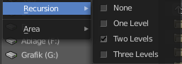

*************************
26 Editors - File browser
*************************

.. contents:: Contents

File Browser
============

The file browser is a explorer dialog that allows you to browse for locations and files, and allows you to load and save them.

The file browser has multiple uses. While its often used for save/load, it can be kept open for other uses too.

In the file browser you can:

- Opening and Saving Blend files. 
- Import/Export other file formats. 
- Picking new locations for existing file-paths (images, video’s, fonts... etc). 
- Browsing inside other .blend files, when using **Append and Link**. 

You can also keep the file selector open, as with any other window type. In this case the buttons to load files is removed.The main purpose of this is to be able to drag media files.

- Images into the Video Sequence Editor (to set background or apply as material textures). 
- Media files into the Video Sequence Editor.

Header
======

There are several tools in the header to find. The range goes from navigation elements across filters up to display options. 

Navigation
----------

Here you can navigate in the folder hierarchy.

Previous Folder
---------------

Navigate to the previous folder.

Next Folder
-----------

Navigate to the next folder.

Parent File
-----------

Go upwards in the hierarchy.

Refresh
-------

Refresh the file list.

New Folder
----------

Creates a new folder.

File path
---------

The current directory.

Search
------

Name Filter. Here you can search for specific files and folders.

Display Options
---------------

Display As
----------

There are three methods to display the content of the folders.

Vertical List
-------------

Displays the content of the file browser as a vertical list.

Horizontal List
---------------

Displays the content of the file browser as a horizontal list.

Thumbnails
----------

Displays the content of the file browser as thumbnails. This is especially of use for images or blend files with thumbnail preview.

Size
----

Display the size of the files.

Date
----

Display the creation date of the files.

Recursion
---------

Here you can adjust how deep the explorer should dig. Normally it just lists the content of the currently selected directory. But it is also possible to list the content of the folders three levels lower.

The recursion direction is always downwards. Default is None.

Sort by
-------

Sort the files by chosen method. The methods are self explaining.

Reverse Sorting
---------------

Reverts the sorting direction.

Filter
------

Filter
------

Enable the filtering.

Folders, etc.
-------------

The different file types that should be filtered. What is ticked here and what file types shows depends of what file browser you call. If you want to load a blend file. Or a FBX file from the File menu in the header. Or a image in the UV Editor for example.

Show Hidden
-----------

Shows hidden Dot files. 

This is a Unix feature. Unix systems like Linux or Mac hides files from file browsers and explorers by having a dot before the file. A good example is the .htaccess file at servers. Show hidden Dot Files makes such files visible to the file browser.

Toggle Region
-------------

Toggles the sidebar at the right. The sidebar contains various im and export settings for the single file types.

Tool Shelf
==========

The Tool Shelf at the left provides you with some panels for quick access to files and bookmarks.

System Panel
------------

Lists your drives.

System Bookmarks
----------------

Lists some system libraries.

Favourites
----------

Here you can add your own bookmarks. A direct bookmark towards the Downloads folder for example.

.. image:: graphics/26_Editors_-_File_browser/10000201000000EF000000646256795D483D1FD5.png

Recent
------

A list of the recent accessed folders.

Greyed out folders are not longer existing directories. There is unfortunately no way to remove them from within Bforartists. You would need to do this manually in the History text files in the settings folder.

Under Windows this is the bookmarks.txt file in the Appdata folder.

Sidebar
=======

At the right side you will find the special Import or Export settings for the current file format. For a Blend file you will just see two entries. For file formats like FBX you wil find plenty of settings.

At the right you see the import dialog for FBX.

As an example, and to explain the two settings for loading a blend file:

Load UI
-------

Bforartists comes with the feature \*Load UI\* unticked. This means the Bforartists UI will not change when you load a scene. Here you can temporary enable to load the scene with the layout and UI arrangement in which the scene was saved. 

Trusted Source
--------------

With Load UI you can also load script files, which can execute. This is a potential security risk when the file comes from an unknown source.

File dialog
===========

The file dialog is the actual place where your files and directories gets listed.

Click navigation.
-----------------

Double clicking at a folder enters the folder. To go upwards in the hierarchy see Parent File button in the header.

Double Click to load
--------------------

Double clicking at a file loads the chosen file when you are in a load dialog. The file dialog will then close.

Double click to save
--------------------

Double clicking at a file overwrites the chosen file when you are in a save dialog.

The file dialog will then close.

Select and load more than one file
----------------------------------

Holding down shift allows you to select and to load more than one file. 

Box select
----------

You can drag a box around the files by simply left clicking and moving the mouse.

Renaming
--------

You can rename files and folders from within this list. Holding down ctrl and clicking at a file enters the edit file name mode.

File Name
---------

Here you can read the file that you want to load or to save.

Open / Save
-----------

Open or save the current file(s).

Cancel
------

Cancel the loading or save process and close the file browser.

Footer
======

Formerly the header. The footer is hidden by default. But contains some more functionality.

You can reveal the footer by clicking at the triangle button at the right.

And then you will see the footer bar. Which will reveral two menus. View and Select.

View Menu
---------

Tool Shelf
----------

Shows or hides the tool shelf at the left side

Display Size
------------

Here you can set the display size of the file browser to four predefined sizes.

Recursion
---------

Recursion is a dropdown menu where you can adjust how deep the explorer should dig. Normally it just lists the content of the currently selected directory. But it is also possible to list the content of the folders three levels lower.

The recursion direction is always downwards. Default is None.

Area Menu
---------

Area is a menu with window related settings.

Horizontal Split
----------------

Splits the editor horizontally into two editors.

Vertical Split
--------------

Splits the editor vertically into two editors.

Duplicate Area into new Window
------------------------------

Creates a floating window out of the current editor.

Toggle Maximize Area
--------------------

Displays the editor maximized with menus.

To return to split view press hotkey Ctrl Up Arrow, or reuse the menu item in the View menu.

Toggle Fullscreen Area
----------------------

Displays the editor maximized without menus.

To return from the full screen view press hotkey Alt F10, or use the little button that appears up right when you move the mouse in this corner.

Select menu
-----------

Box Select
----------

Allows you to box select files. Note that this is an old obsolete operator. You don't need to press the hotkey anymore for box select.

Inverse
-------

Inverts the selection.

None
----

Select none.

All
---

Select all.

