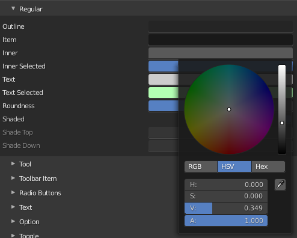
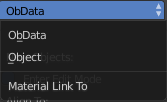

************************
27 Editors - Preferences
************************

.. contents:: Contents

Detailed Table of content
=========================

Preferences
===========

The Preferences is the place where you can tweak several settings to your needs. It can be opened in the Edit menu in the topbar.

The Preferences contains several tabs. And every tab contains several rows or panels with content. We will go through them one by one.

When you have changed something, and want that changes to be permanent, then you are required to save the user settings. See the Save User Settings button in the header.

Navigation Sidebar
------------------

At the left side you will find the navigation elements to access the different categories. At the bottom resides the Save Preferences menu.

Save Preferences menu
---------------------

Auto Save preferences
---------------------

Changes at the preferences are saved automatically when Auto Save Preferences is ticked. When this option is off, then changes needs to be saved manually. When you don't save the changes, then Bforartists loads the next time with the status before the changes.

Save current State
------------------

Manually saves the current state.

Revert to Saved
---------------

This option is just available when Auto Save preferences is off. It reverts the settings to the last saved state.

Load Factory Settings
---------------------

Resets the settings to the factory defaults.

.. Note:: Not everything can be changed from the Preferences. Everything regarding ``l``ayout is stored in the ``S``tartup ``F``ile, and not in the Preferences. So when you want to save a layout change then you have to save the startup file. The menu item is right ``above`` the Preferences button`` in the Edit menu``.

Interface Tab
=============

The Interface category contains settings to change how UI elements are displayed and how they react. 

Display Panel
-------------

Resolution Scale
----------------

At 4K displays the whole UI elements are usually ways too small. Here you can scale the whole UI size display by moving the slider to the needed value. 

Line Width
----------

Here you can define the size of the line between the editors. This is a theming setting.

Splash Screen
-------------

Display the Splash Screen when starting Bforartists.

Tooltips
--------

Display tooltips in the UI. With this feature unticked you won't see any tooltips anymore. It is not recommended to turn this feature off. The icon buttons needsthe tooltips to display the tool name.

Python Tooltips
---------------

Every tooltip can also display the Python code tag for the tool. It may look like noise in the first moment. But can give you some further hints here and there. Some tooltips, like the Node editor buttons, doesn't have a proper tool description by design. Here the Python tooltip can tell you the function when you turn it into pure icon buttons.

The tools in the tool shelf doesn't have a Python tooltip by design. This buttons sits on top of the normal operators, and doesn't access the tooltip of it.

Note: It is not recommended to turn the Python tooltips off.

Developer Extras
----------------

This tickbox turns on or off the developer entries in the right click menus.

Large Cursors
-------------

Use large mouse cursors if available.

Editors Panel
-------------

Region Overlap 
---------------

This checkbox will enable Blender to draw the Header, Tool Shelf and the Sidebar overlapping the 3D View. The transparent areas becomes workspace area. You can for example select vertices now in the transparent areas.

If you have a capable graphics card and drivers with **Triple Buffer** support, clicking the checkbox will enable the overlapping regions to be drawn using the **Triple Buffer** method, which will also enable them to be drawn using Alpha, showing the 3D View contents trough the **Object Tools** and **Transform Properties** regions.

Corner Splitting
----------------

This feature enables you to split editors by dragging the upper right or lower left corner around.

Navigation Controls
-------------------

Display the navigation controls in the 3D view.

Color Picker Type
-----------------

Here you can choose the type of Color picker that will show when you click on a color field. You can choose between three square types and two circle types.

Header Position
---------------

Here you can define at which default position the headers of the editors should reside.

Factor Display Type
-------------------

Display factor values either as percentage or as factor.

Translation Panel
-----------------

Here you can choose another default language for Bforartists.

Language
--------

Choose between automatic language detection. In this case the system language gets chosen. Or pick a language that you want to use.

Tooltips
--------

Tooltips translates the tooltips too.

Interface
---------

Interface translates all the interface texts

New Data
--------

New data is meant to edit the localization texts. 

This can be done in the right click menus of the tools when everything is set up in the correct way.

This is a development feature. You need a repository of Bforartists!

.. list-table::

	* - Note

	* - This feature is currently not functional in Bforartists. It ends in an error message.

Let's nevertheless document the way how it should work. Note that you need a Bforartists repository for that. The binary version does not come with the editable \*.po files, but with already compiled \*.mo files for the translation.

Note that you first need to set the path to the translation files for that. Or you will get an error. This is done in the File tab. The \|18n string.

The path should lead to the \*.po files that you want to translate. Which can be found in the Bforartistrs repository.

And you need to enable the Manage UI translations addon. And to fix the paths in this addon. The default paths are currently set for Blender.

And then you might end in this error here ...

In case somebody has an idea what's going on here, every hint is welcome ...

Text Rendering Panel
--------------------

Text related settings for the font of the interface.

Anti Aliasing
-------------

Use Anti Alias at the UI elements to prevent pixelated look of the font. 

Hinting
-------

What sharpening method to use to make the text render sharp.

Interface Font
--------------

Here you can define a custom interface font. The font in the whole UI.

Monospace Font
--------------

Here you can define a custom Monospace font. That's the one used in the python console for example.

Menus Panel
-----------

Open on Mouse Over
------------------

Normally you click at a menu to open it. With Open on Mouse Over the menu opens up when you just hover with the mouse over it.

Top Level
---------

Here you can adjust the time delay before the top level menu opens on mouse over.

Sub Level
---------

Here you can adjust the time delay before a sub level menu opens on mouse over.

Pie Menus
---------

Bforartists has some pie menus that can be called by hotkeys. Here you find some settings for it.

Animation Timeout
-----------------

The pie menu fades in with an animation. Here you can adjust the time needed to fully unfold the pie menu.

Top Key Timeout
---------------

Pie menu button longer held than this time will dismiss the menu on release.

Recenter Timeout
----------------

Pie menus will use the initial mouse position as center for this amount of time. The value is in 1/100 seconds.

Radius
------

The pie menu size in pixels.

Threshold
---------

The distance that is needed from the center to move the mouse so that a selection can be made.

Confirm Threshold
-----------------

Distance threshold after which selection is made. A value of zero disables this feature.

Themes
======

The **Themes** tab allows you to customize interface appearance and colors. There are various elements that can be themed. 

Any change here will appear in real-time on your screen in the corresponding editor. 

To change a color for a UI element, simply click at one of the color fields. A color dialog will open up where you can choose a new color.

Presets
-------

Bforartists comes with several theme presets. You can choose between them in the dropdown box. Don't forget to save the user settings to make the change to the new preset permanent.

Create new Theme
----------------

To create a new theme, click the + button next to the preset selection drop-down and enter a name. This will save the theme to an XML file in the ./scripts/presets/interface_theme/ subdirectory of one of the configuration directories.

To share the new created theme you have to copy it from that folder. This xml file can then be loaded as a theme at another computer with Bforartists installed.

Install
-------

Here you can install a external theme. This button will open a file browser.

Reset
-----

Resets all made changes, and resets the current theme to its initial state.

List of Editors
---------------

The list of the editors that you can theme. Every editor can have its own theming.

Viewport
========

Here you can find settings for the 3D Viewport. 

Display
-------

Object Info
-----------

Display current frame, collection nameand Object name in the upper left edge of the 3D view.

The letters appears in yellow when the current frame of the selected object has a keyframe.

View Name
---------

Display the name of the current view up left in the 3D view.

Playback FPS
------------

Show the frames per second screen refresh rate while an animation is played back. It appears in the viewport corner, displaying red if the frame rate set cannot be reached. Amd replaces the View name while the animation is playing.

Gizmo Size
----------

Here you can adjust the size of the transform gizmo that appears when you have one of the transform tools activated.

Pivot Size
----------

Here you can adjust the size of the orange dot that represents the center of the object. The pivot.

Quality
-------

Here you can find settings to adjust the display quality in the viewport.

Viewport Anti-Aliasing
----------------------

The anti alias quality settings for the solid mode rendering in the 3d viewport.

Multisampling
-------------

Here you can set the OpenGL Multisampling in case your system supports it.

Grease Pencil Multisampling
---------------------------

The grease pencil drawing has its own OpenGL Multisampling. Here you can set the OpenGL Multisampling in case your system supports it.

Edit Mode Smooth Wires
----------------------

Enable Edit Mode edge smoothing which reduces antialias and makes the edge more sharp. A change requires a restart of the software.

Textures
--------

Limit Size 
-----------

Limit the maximum resolution for pictures used in textured display to save memory. The limit options are specified in a square of pixels, (e.g.: the option 256 means a texture of 256×256 pixels) This is useful for game engineers, whereas the texture limit matches paging blocks of the textures in the target graphic card memory. Available Options are: **Off** (No limit), **128**, **256**, **512**, **1024**, **2048**, **4096**, and **8192**. 

Anisotropic Filtering 
----------------------

Sets the level of anisotropic filtering. This improves the quality of how textures are drawn at the cost of performance. Available Options are: **Off** (No Filtering), **2x**, **4x**, **8x**, and **16x**. 

Clip Alpha
----------

Clip alpha when the value is below the here defined value.

Image Display Method
--------------------

The method that is used to draw textures in the viewport.

Selection
---------

OpenGL Depth picking tries to pick the object in front. Without this method you may pick an object underneath.

Lights
======

The viewport uses different light setups in different situations. You can switch between them in the shading dropdown in the 3d view up right.

Here you can customize these light setups. And install custom light setups.

Studio Lights
-------------

The 3D view uses Solid OpenGL lamps to light the 3D view. You can enable four different light sources here. These lamps does not affect the rendering. Their only purpose is to light the 3D view.

You can turn on or off the lamps. But there should be at least one light enabled.

Install
-------

Here you can install a external studio light.

Preview Window
--------------

This window appears when you have a studio light saved, or a new studio light installed.

Down left you can see the name of the saved library. mystudio.sl .

This window gives you a preview of how this studio light looks like in the 3D view then.

Up right you can find two buttons. 

Delete Studio Light
-------------------

Deletes the studio light.

Copy Studio Light settings to the Studio Light Editor
-----------------------------------------------------

The editor settings does not update immediately. It shows the default studio light setting. So when you want to edit the studio light, then you want to press this button to update the editor values first.

Edit Studio Light
-----------------

Enable the editing of the studio light setup.

Save as Studio Light
--------------------

Save the current light setup as a studio light setup. Note that this does not export the light, but saves its settings internally in the appdata directory.

Use Light
---------

Turn on or off this specific light.

Diffuse
-------

Diffuse color is the constant color of the lamp.

Specular
--------

Specular is the hilight color of the lamp.

Smooth
------

Smooth the lighting from this specific light.

Direction
---------

Here you can adjust the direction. Click into the field and drag the sphere around until you have your desired light setup.

MatCaps
-------

Matcaps is a special material that can be assigned quickly to preview geometry. Usually matcaps are used while sculpting. You can switch between them in the shading dropdown in the 3d view up right.

Here you can install and manage custom matcaps.

LookDevHDRI's
-------------

You can light the scene with an environment image instead of lights. This is done with hdri images.

The viewport can do this in realtime when the shading is set to Viewport Shading.

Here you can install and manage custom LookDev HDRI's. Basically every image could do the trick here. But the hdri's uses a special spherical mapping. So you better use hdri images for this purpose.

Editing
=======

Here you can find settings around editing. Objects, Data, etc.

Objects
-------

New Objects
-----------

Link Materials To
-----------------

Here you can define how materials will be linked to its objects. Almost everything in Bforartists is organized in a hierarchy of data-blocks. A data-block can be thought of as containers for certain pieces of information. For example, the Object data-block contains information about the Object’s location while the Object Data ObData data-block contains information about the mesh.

ObData 
-------

Any created material will be created as part of the ObData data-block.

Object 
-------

Any created material will be created as part of the Object data-block. 

Align To 
---------

World 
------

New objects align with world coordinates. 

View 
-----

New object align with view coordinates. 

Enter Edit Mode 
----------------

If selected, Edit Mode is automatically activated when you create a new object. 

Duplicate Data
--------------

When you duplicate data, then most or all its subparts gets duplicated too. Here you can define which supparts should be duplicated when you duplicate an object.

3D Cursor
---------

Cursor Surface Project
----------------------

Use the surface depth to place the 3D cursor. That way you can place the 3D cursor at the surface of an object.

Cursor Lock Adjust
------------------

Place the cursor without a jumping effect at the new location when lock to cursor is used.

Annotations
-----------

Default Color
-------------

The default color for the annotations pencil.

Eraser radius
-------------

The eraser radius.

Simplify Stroke
---------------

Simplify the final stroke.

Weight Paint
------------

Use Custom Colors
-----------------

Bforartists uses by default a gradient that goes from red to green to blue to black to display the different weight at a mesh.

Here you can setup a custom gradient for the colors of a weight paint.

The + Button adds a color stop point, which can be moved around. That way you can have more than one color in the gradient.

.. image:: graphics/27_Editors_-_Preferences/100002010000016D00000020DF772CB3BF2B6774.png

The - Button removes the currently selected color stop point.

Tools Menu 
-----------

Flip Color ramp flips the color ramp.

Distribute Stops from Left distributes the color stops from the left. The position at the right will remain empty.

Distribute Stops evenly distributes the color stops evenly across the gradient.

Eyedropper allows you to pick a color from the gradient.

Reset color ramp resets the color ramp to the default state.

Color Mode is a dropdown box where you can choose the color mode for the gradient.

.. image:: graphics/27_Editors_-_Preferences/10000201000000740000007D5CBD019881346198.png

Interpolation is a dropdown box where you can choose the interpolation mode for the gradient. 

.. image:: graphics/27_Editors_-_Preferences/100002010000007B000000A8982321687ED3B6B0.png

In the Color Ramp element you will see the color ramp with the single color stops.

Choose Active Color Stop is the stop point of the gradient.

Position is a edit box where you can numerically fine tune the position of the currently selected color stop.

.. image:: graphics/27_Editors_-_Preferences/10000201000000740000001990178AA61449B886.png

Color Ramp Element displays the color of the current selected color stop. When you click at it then you can open a color picker to change the color of the current color stop.

Background Color
----------------

Background color is the same color than the secondary color from the color picker. When you click at it then you can open a color picker to change the secondary color.

Gradient Stroke Mode
--------------------

Here you can set the gradient stroke mode.

Grease Pencil
-------------

Manhattan Distance 
-------------------

The minimum number of pixels the mouse has to move horizontally or vertically before the movement is recorded. 

Euclidian Distance 
-------------------

The minimum distance that mouse has to travel before movement is recorded. 

Miscenlaneous
-------------

Sculpt Overlay Color
--------------------

This color button allows the user to define a color to be used in the inner part of the brushes circle when in sculpt mode, and it is placed as an overlay to the brush, representing the focal point of the brush influence. 

The overlay color is visible only when the overlay visibility is selected (clicking at the **eye** to set its visibility), and the transparency of the overlay is controlled by the alpha slider located at the brush pop-up, located at the top of the tool shelf, when in sculpt mode.

Node Auto Offset Margin
-----------------------

Minimum distance in the node editor between nodes for auto offsetting.

When you insert a new node between two existing connected nodes, then the two nodes gets pushed to left and right, with an offset. Here you can adjust this offset.

Animation
=========

Here you can find settings for the animation editors.

Timeline
--------

Allow negative Frames
---------------------

Minimum Grid Spacing 
---------------------

Here you can adjust the minimum number of pixels between grid lines in a 2D viewport. This affects for example Timeline, Dopesheet, Graph or NLE Editor.

TimeCode Style
--------------

In Timeline, Dopesheet, Graph and NLE editor you can either display the keyframe number or the time in the timeline. Here you can define how the time gets displayed when you have chosen to display time.

Zoom To Frame Type 
-------------------

Timeline, Dopesheet, Graph and NLE. Here you can define how zooming to frame focuses around current frame.

Keyframes
---------

Visual Keying 
--------------

When an object is using constraints, the objects property value doesnt actually change. **Visual Keying** will add keyframes to the object property, with a value based on the visual transformation from the constraint. 

Only Insert Needed 
-------------------

This will only insert keyframes if the value of the propery is different. 

Auto Keyframing
---------------

Show Warning 
-------------

Displays a warning at the top right of the **3D View**, when moving objects, if **Auto Keyframe** is on. 

Only Insert Available 
----------------------

This will only add keyframes to channel F-Curves that already exist. 

Enable in new scenes
--------------------

Automatic keyframe insertion for objects and bones as Default setting for new scenes.

F-Curves
--------

F-curve Visibility
------------------

The amount that unselected F-curves stands out from the background in the Graph Editor.

Default Interpolation 
----------------------

This controls how the state between two keyframes is computed. Default interpolation for new keyframes is Bézier which provides smooth acceleration and de-acceleration whereas Linear or Constant is more abrupt. 

Handles
-------

The default handle types for F-Curves.

XYZ to RGB 
-----------

Color for X, Y or Z animation curves (location, scale or rotation) are the same as the color for the X, Y and Z axis. 

Addons
======

An add-on is external software written by other developers. Add-ons are a way to extend the core functionality of Bforartists. Bforartists already comes with lots of add-ons. Some already activated. Here you can manage them, and add even more add-ons if required.

Note that Bforartists works with Blender addons. 

Note also that this list contains some add-ons that are required by Bforartists to work proper. You will see a warning in those addons. Don't turn them off. Or vital parts of Bforartists will not longer work. Like the toolbar.

Header
------

Official / Community / Testing
------------------------------

Here you can filter the addons by supported level.

The addons comes in three flavours. The official addons are the addons from the Blender developers. Community are the addons from Community developers that doesn't officially belong to the Blender developer team. And Testing add-ons are add-ons that aren't really finished yet. They can do the job, but are experimental.

Install Add-on
--------------

Here you can install external add-ons. Note that addons that comes as a zip file should be loaded zipped. And not unzipped.

Refresh
-------

Scan the add-on directories for new modules. This is useful when you decide to install an add-on manually.

Category
--------

Here you can refine the search down to single categories.

Search
------

Here you can search for keywords.

List of Addons
--------------

This is the list of installed add-ons. Installed does not necessarily mean that they are enabled. To enable an add-on, tick the checkbox at the left. When you expand an add-on then you will find some further informations. Sometimes you will also find some more settings.

Input
=====

Here you can find some input related settings. 

Keyboard
--------

Emulate Numpad
--------------

Laptops usually doesn't have Numpad keys. Here you can choose to use the number keys above the letters as numpad keys.

Default to advanced numeric input
---------------------------------

When entering numbers while transforming default to advanced mode for full math expression evaluation.

Mouse
-----

Emulate 3 Button Mouse 
-----------------------

In the Windows world 3 button mouses are common. But Apple for example has a single mouse button. Bforartists can emulate a 3 button mouse. The third mouse button will then be emulated by a key combination.

.. list-table::

	* - LMB
	  - LMB
	  - LMB (mouse button)

	* - MMB
	  - Alt-LMB
	  - Alt-LMB (Option/Alt key + mouse button)

	* - RMB
	  - RMB
	  - Cmd-LMB (Command/Apple key + mouse button)

Mouse/Keyboard combinations referenced in this manual can be expressed with the combinations shown in the table. For example, MMB drag becomes Alt-LMB drag. Shift-Alt-RMB becomes Shift-Alt-Cmd-LMB on a single-button mouse. 

Tablet
------

Here you can find some tablet related settings.

Tablet API
----------

Here you can choose which api Bforartists should choose for the pressure sensitivity of your tablet.

Max Threshold
-------------

The raw input pressure value which is interpreted as 100 % by Bforartists.

Softness
--------

Here you can adjust the pressure ssoftness of the low pressure response onset using a gamma curve.

NDOF
----

You can use a 3D mouse in Bforartists. Here you find some 3D mouse related settings.

Pan Sensitivity
---------------

Here you can adjust the pan sensitivity.

Orbit Sensitivity
-----------------

Here you can adjust the orbit sensitivity

Deadzone
--------

The initial movement that is needed before the movement gets recognized.

Ndof View Navigate
------------------

Here you can choose the navigation style between Free and Orbit.

Ndof View Rotation
------------------

Here you can ajdust in what style you rotate the 3D View. Turntable and Trackball navigation reacts a bit different. Turntable navigation tries to hold the horizon line while rotation. Turntable rotation rotates also the horizon line.

Navigation
==========

.. image:: graphics/27_Editors_-_Preferences/10000201000002A10000022B680317F91C91C133.png

The navigation section contains the settings for navigating in the 3D view.

Orbit & Pan
-----------

Orbit Method
------------

Here you can ajdust in what style you rotate the 3D View. Turntable and Trackball navigation reacts a bit different. Turntable navigation tries to hold the horizon line while rotation. Turntable rotation rotates also the horizon line.

Orbit around selection
----------------------

The selected object becomes the rotation center of the viewport. When there is no selection the point of the last selection will be used.

Auto Perspective 
-----------------

With Auto perspective off when you switch to one of the side views, then the chosen orthographic or perspectivic view is kept. Means when you have the distorted perspectivic view, and switch to top view, then your mesh will be perspectivic distorted here too.

With Auto Perspective the view in the side views will be orthographic, and not perspectivic, no matter what View Persp/Ortho is chosen.

Auto Depth 
-----------

Use the depth under the mouse to improve view pan, rotate, zoom functionality. 

Smooth View 
------------

The switch to change to another view is animated. Here you can adjust the length of time the animation takes when changing the view with the numpad (Top/Side/Front/Camera...). A value of zero will remove the animation, and immediately switch to the chosen view. 

Rotation Angle 
---------------

Rotation step size in degrees, when Numpad4, Numpad6, Numpad8, or Numpad2 are used to rotate the 3D View. 

Zoom
----

Zoom Method
-----------

Here you can adjust the zoom style.

Scale 
------

**Scale** zooming depends on where you first click in the view. 

Dolly 
------

**Dolly** zooming works similarly to **Continue** zooming except that zoom speed is constant. 

Continue 
---------

The **Continue** zooming option allows you to control the speed (and not the value) of zooming by moving away from the initial click point. Moving up from the initial click-point or to the right will zoom out, moving down or to the left will zoom in. The further away you move, the faster the zoom movement will be. 

Zoom Axis
---------

With Vertical moving up zooms out and moving down zooms in. With Horizontal moving left zooms in and moving right zooms out. 

Invert Mouse ZoomDirection 
---------------------------

Inverts the Zoom direction for **Dolly** and **Continue** zooming. 

Invert Wheel Zoom Direction 
----------------------------

Inverts the direction of the mouse wheel zoom. 

Zoom to Mouse Position 
-----------------------

When enabled, the mouse pointer position becomes the focus point of zooming instead of the 2D window center.

Fly & Walk
----------

Fly and walk are special navigation modes. They can be found in the Navi menu. The Fly & walk section also contains some settings from the View navigation style, since this style uses elements from walk and fly navigation too.

View Navigation
---------------

Here you can adjust how the View navigation in the 3D view behaves. You can choose between walk and fly.

Camera Parent Lock
------------------

When the camera is locked to the view and in fly mode, transform the parent rather than the camera. 

Walk
----

Reverse Mouse
-------------

Reverse the mouse movement when you move upwards or downwards

Mouse Sensitivity
-----------------

Here you can adjust how strong the viewport movement reacts to the mouse movement

Teleport Duration
-----------------

Here you can adjust the teleport duration when teleporting in navigation mode.

Walk Speed
----------

Here you can adjust the walk speed

Speed Factor
------------

Here you can adjust the run speed.

Gravity
-------

Here you can choose if the virtual character, your point of view, uses gravity.

View Height
-----------

Here you can adjust the height of the point of view for your virtual character. This setting requires to have Gravity on.

Jump Height
-----------

Here you can adjust the maximal jump height for your virtual character. This setting requires to have Gravity on.

Keymap
======

Here you can customize how Bforartists reacts to mouse and keyboard, and change keymap entries. All Input behaviour is defined in the keymap.

Header
------

Key Configs
-----------

A dropdown menu where you can choose existing keymaps. The + button at the right adds a new keymap. The current configuration will then be saved as a new keymap.

Import
------

Import a external keymap. This opens up a file selector where you can choose the python file.

Export
------

Export a key configuration python file from Bforartists.

Filter Type
-----------

Here you can define if you want to search for a tool name or for a hotkey. By tool name, or by the hotkey name

Search Field
------------

Here you can enter a search string.

Keymap Editor
-------------

The Keymap editor is the list where the single inputs are defined. Every input can have several specific operator settings in the lower area. The upper area defines the general things like the key combos. The lower area those operator specific settings.

Normally you don't edit those key entries manually. Most of the usual tools have an entry in the right click menu to create or to change the hotkey. But sometimes you have to do this task manually.

Map Type
--------

Here you define what input will control the function.

Type of Event
-------------

Here you define your main hotkey. In our case the right mouse.

Operator
--------

Here you can find the Python operator name for the tool. 

Type of Event
-------------

The main hotkey again. For special events like mouse events you have a dropdown box here.

.. image:: graphics/27_Editors_-_Preferences/10000201000000A70000001A686101C2D7183E5A.png

Value
-----

What key action is required. On click, on double click, etc. ...

Secondary hotkeys
-----------------

Many hotkeys uses a key combination, for example Shift D for select. Here you can define those secondary hotkeys.

Specific settings
-----------------

Every operator can have several settings. And some tools even just defines itself by those different settings. Here you can see two different zoom view operators. They just differ in the Delta value.

What is equal in the key map in all cases is the RNA entry. That's the name of the operator again. But this time not the Python code operator name. But the C code operator name.

Restore 
--------

When you modify a keymap item, then you will see a Restore button appear at the right side. This indicates that this keymap item gots modified. A click at the Restore button will restore the original hotkey.

System
======

The system tab contains system relevant settings. Such as Cuda for Cycles renderer or OpenCL or Memory related settings.

Cycles Render Devices
---------------------

The Options here will set the compute device used by the Cycles render engine.

None 
-----

When set to **None** or the only option is **None**: your CPU will be used as a computing device for Cycles Render Engine.

CUDA 
-----

If the system has a compatible Nvidia CUDA enabled graphics card you will be able to use it to render with the Cycles render engine. 

OpenCL 
-------

If the system has a compatible OpenCL device, it will show up has an option for rendering cycles.

Memory and Limits
-----------------

Undo Steps
----------

Number of Undo steps available. 

Undo Memory Limit 
------------------

Maximum memory usage in Mb (0 is unlimited).

Global Undo 
------------

Bforartists Undo system is split in several subparts. Global undo stores the undo step outside of Edit mode. For example for duplicating Objects, changing panel settings or switching between modes.

Sequencer Cache Limit 
----------------------

Upper limit of the sequencer’s memory cache (megabytes). For optimum clip editor and sequencer performance, high values are recommended. 

Console Scrollback Lines
------------------------

Maximum number of lines to store for the console buffer.

Texture Time Out 
-----------------

Time since last access of a GL texture in seconds, after which it is freed. Set to 0 to keep textures allocated. Minimum: **0**, Maximum: **3600**. 

Garbage Collection Rate 
------------------------

Number of seconds between each run of the GL texture garbage collector. Minimum: **0**, Maximum: **3600**. 

VBO Time Out
------------

Time since last access of a GL Vertex buffer object, in short VBO, in seconds after which it is freed. Set to 0 to keep VBO allocated.

Garbage Collection Rate 
------------------------

Number of seconds between each run of the GL vertex buffer garbage collector. Minimum: **0**, Maximum: **3600**. 

Sound
-----

Audio Device 
-------------

Here you can set the audio device.

.. image:: graphics/27_Editors_-_Preferences/10000201000000A6000000905721C6AEC24829D6.png

OpenAL 
-------

Provides buffered sound rendering with 3D/spatial support. 

OpenAL - OpenAL Soft
--------------------

Provides buffered sound rendering with 3D/spatial support. 

SDL 
----

Uses Simple Direct Media Layer API from libsdl.org to render sounds directly to the sound device output.

Null
----

No Audio support. No audio output, but audio strips can be loaded normally.

Channels 
---------

Set the audio channel count. Available options are: Mono, **Stereo**, **4 Channels** , **5.1 Surround** , **7.1 Surround**

Mixing Buffer 
--------------

Set the number of samples used by the audio mixing buffer. Available options are: **512** , **1024** , **2048**, **4096** , **8192**, **16384**, and **32768**

Sample Rate 
------------

Set the audio sample rate. Available options are: **44.1 Khz**, **48 Khs**, **96 Khz** and **192Khz**

Sample Format 
--------------

Set the audio sample format. Available options are: **32 bit float**, **8 bit Unsigned**, **16 Bits Signed**, **24 Bits Signed**, **32 Bits Signed**, **32 Bits Float**, and **64 Bits Float**. 

Save & Load
===========

Blend Files
-----------

Blend file related settings. What happens at load, what happens at save ...

Relative Paths 
---------------

By default, external files use a relative path.

Compress File 
--------------

Compress blend-file when saving.

The option to Compress files will compact your files whenever Blender is saving them. Dense meshes, large packed textures or lots of elements in your scene will result in a large blend being created.

This option may slow down Blender when you quit, or under normal operation when Blender is saving your backup files. Using this option traces processor time for file-size.

Load UI 
--------

In Bforartists you can load the scene in the screen layout in which you have saved it. Default is off.

This can also be changed individually when loading a file from the **Open blend-file** panel of the File Browser. 

Save Preview Images 
--------------------

When this option is off, previews of images and materials in the File Browser are created on demand. With this option on it will save these preview images into your blend-file. This will increase the size of your blend file by the size of the thumbnails.

Tabs as Spaces
--------------

For text files, automatically convert tabs into spaces when loading a blend file that contains a text file. Correct indentation is relevant for python scripts.

Save Prompt
-----------

Ask for confirmation when quitting with unsaved changes.

Save Versions
-------------

Number of versions created for the same file (for backup).

This option tells Bforartists to keep the indicated number of saved versions of your file in your current working directory when you manually save a file. These files will have the extension: .blend1, .blend2, etc., with the number increasing to the number of versions you specify. Older files will be named with a higher number. e.g. With the default setting of 2, you will have three versions of your file: \*.blend (your last save), \*.blend1 (your second last save) and \*.blend2 (your third last save).

Recent Files
------------

The number of recent files to display in the Recent panel.

Auto Save
---------

Auto Save Temporary File 
-------------------------

Enable Auto Save. Auto save creates a temporary file.

Checking this box tells Blender to **automatically** save a backup copy of your work-in-progress to the Temp directory (refer to the **File** tab in the **Preferences** for its location).

The Auto Saved files are named using a random number and have a blend extension.

Timer 
------

Here you can asjust the number of minutes between each Auto Save. The minimum is 1, and the Maximum is 60 (Save at every one hour).

Auto Run Python Scripts
-----------------------

Run the python scripts at loading a blend file that includes these scripts.

Excluded paths
--------------

Here you can define file paths where loaded blend files should not run the included scripts even when auto run python scripts is ticked.

File Browser
------------

File browser related settings.

Filter File Extensions 
-----------------------

By activating this, the file dialog in the File Browser will only show appropriate files in the Load dialog. Blend files for example.

The selection of file types can also be changed in the header of the file dialog. 

Hide Dot File/Data-blocks
-------------------------

On non Windows systems like Linux and Mac OS X files are hidden by a dot in front of the file name. Here you can make them visible in the file browser if you want. Note that this feature does not work with Windows.

Hide Recent Locations 
----------------------

Hides the **Recent** panel of the File Browser which displays recently accessed folders. 

Hide System Bookmarks
---------------------

Hides the System Bookmarks panel of the File Browser which displays the system bookmarks. 

Show Thumbnails 
----------------

Displays a thumbnail of images and movies when using the File Browser. 

File Paths
==========

Here you can find everything file path related. 

Data
----

Fonts 
------

Default location when searching for font files. 

Textures 
---------

Default location when searching for image textures. 

Scripts 
--------

An additional location to search for Python scripts.

By default Bforartists looks in several directories (OS dependant) for scripts. Here you can add another directory to check for scripts. This can be used to store certain scripts/templates/presets independently of the currently used Blender Version.

Inside the specified folder specific folders have to be created to tell Bforartists what to look for where. This folder structure has to mirror the structure of the scripts folder found in the installation directory of :

- scripts 
- add-ons 
- modules 
- presets 
- camera 
- cloth 
- interface_theme 
- operator 
- render 
- ... 
- startup 
- templates

Not all of the folders have to be present. 

Python scripts (including driver expressions) are not executed by default for security reasons.

Sounds 
-------

Default location when searching for sound files.

Temporary Files
---------------

The location where temporary files are stored. 

Render
------

Render Output 
--------------

Where rendered images/videos are saved. 

Render Cache 
-------------

The location where cached render images are stored. 

Applications
------------

Image Editor 
-------------

The path to an external image editing software to use for image editing. Photoshop, Gimp, etc.

Animation Player 
-----------------

By default Bforartists uses the internal player to play back animations. Here you can choose an external program to use for playback of rendered animations. There are also some presets available.

Development
-----------

I18n Branches 
--------------

The path to the /branches directory in your local repository translation copy. This allows translating the UI. See interface tab, the translation panel.

