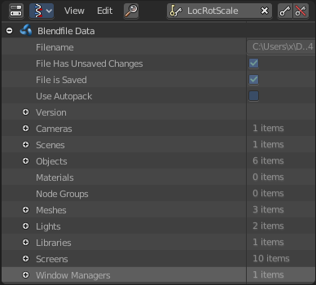

**************
28 Data System
**************

.. contents:: Contents

Data System
===========

Each .blend file contains a database. This database contains all scenes, objects, meshes, textures, etc. that are in the file.

A file can contain multiple scenes and each scene can contain multiple objects. Objects can contain multiple materials which can contain many textures. It is also possible to create links between different objects.

Data-Blocks
===========

The base unit for any Bforartists project is the data-block. Examples of data-blocks include: meshes, objects, materials, textures, node-trees, scenes, texts, brushes and even screens.

For clarity, bones, sequence strips and vertex groups are **not** data-blocks, they belong to armature, scene and mesh types respectively.

Some common characteristics:

- They’re the primary contents of the .blend file. 
- They can link to each other, for reuse and instancing. **(child/parent, object/object-data, with modifiers and constraints too).**
- Their names are unique. 
- They can be added/removed/edited/duplicated. 
- They can be linked between files **(only enabled for a limited set of data-blocks)**
- They can have their own animation data. 
- They can have custom properties. 

When doing more complex projects managing data-blocks becomes more important, especially when inter-linking .blend files.

Users (Garbage Collection)
--------------------------

Bforartists follows the general rule where unused data is eventually removed.

Since its common to add and remove a lot of data while working, this has the advantage of not having to manually manage every single data-block.

This works by skipping zero user data-blocks when writing .blend files.

In some cases you want to save a data-block even when its unused **(typically for re-usable asset libraries).** see Fake User.

Fake User
---------

Since zero user data-blocks aren’t saved. There are times when you want to force the data to be kept irrespective of its users.

If you’re building a .blend file to serve as a library of things that you intend to link-to from **other** files, you’ll need to make sure that they don’t accidentally get deleted from the library file.

Do this by giving the data-blocks a **Fake User**, by pressing the **F** button next to the name of the data-block. This prevents the user count from ever becoming zero: therefore, the data-block won’t be deleted. (since Bforartists doesn’t keep track of how many other files link to this one.)

Users (Sharing)
---------------

Many data-blocks can be shared among other data-blocks,

Examples where sharing data is common.

- Sharing textures among materials. 
- Sharing meshes between objects (instances). 
- Sharing animated actions between objects, for example to make all the lights dim together. 

You can also share data-blocks between files, see.

- **linked libraries**. 

Removing Data-Blocks
--------------------

As covered in Users (Garbage Collection), data-blocks are typically removed when they’re no longer used.

There are some exceptions to this however.

The following data-blocks can be removed directly: Scene, Text, Group and Screen.

Other data-blocks such as groups and actions can be **Unlinked** from the **Outliner** context menu.

.. Tip:: Some data (images especially) is hard to keep track of, especially since image views are counted as users.

Data-Block Types
----------------

For reference, here is a table of data-blocks types stored in .blend files.

.. list-table::

	* - Link:
	  - Library Linking, **supports bing linked into other blend files**.

	* - Pack:
	  - File Packing, **supports file contents being packed into the blend file**.

.. list-table::

	* - Action
	  - ✓
	  - ✗
	  - Stores animation FCurves.

	* - Armature
	  - ✓
	  - ✗
	  - Skeleton used to deform meshes.

	* - Brush
	  - ✓
	  - ✗
	  - Used by paint tools.

	* - Camera
	  - ✓
	  - ✗
	  - Used as object-data.

	* - Curve
	  - ✓
	  - ✗
	  - Used by camera, font & surface objects.

	* - Font
	  - ✓
	  - ✓
	  - References font files.

	* - GreasePencil
	  - ✓
	  - ✗
	  - 2D/3D sketch data.

	* - Group
	  - ✓
	  - ✗
	  - Reference object’s.

	* - Image
	  - ✓
	  - ✓
	  - Image files.

	* - Lamp
	  - ✓
	  - ✗
	  - Used as object-data.

	* - Lattice
	  - ✗
	  - ✗
	  - Grid based lattice deformation.

	* - Library
	  - ✗
	  - ✓
	  - References to external .blend files.

	* - LineStyle
	  - ✓
	  - ✗
	  - Used by the FreeStyle render-engine.

	* - Mask
	  - ✓
	  - ✗
	  - 2D animated mask curves.

	* - Material
	  - ✓
	  - ✗
	  - Set shading and texturing render properties.

	* - Mesh
	  - ✓
	  - ✗
	  - Geometry verts/edges/faces.

	* - MetaBall
	  - ✓
	  - ✗
	  - An isosurface in 3D space.

	* - MovieClip
	  - ✓
	  - ✗
	  - Reference to an image sequence or video file.

	* - NodeGroup
	  - ✓
	  - ✗
	  - Collections of re-usable nodes.

	* - Object
	  - ✓
	  - ✗
	  - An entity in the scene with location,

	* - Particle
	  - ✓
	  - ✗
	  - Particle settings.

	* - Palette
	  - ✓
	  - ✗
	  - Store color presets.

	* - Scene
	  - ✓
	  - ✗
	  - Primary store of all data displayed and animated.

	* - Screen
	  - ✗
	  - ✗
	  - Screen layout.

	* - ShapeKeys
	  - ✗
	  - ✗
	  - Geometry shape storage, which can be animated.

	* - Sounds
	  - ✓
	  - ✓
	  - References to sound files.

	* - Speaker
	  - ✓
	  - ✗
	  - Sound sources for a 3D scene.

	* - Text
	  - ✓
	  - ✗
	  - Text data.

	* - Texture
	  - ✓
	  - ✗
	  - 2D/3D textures.

	* - World
	  - ✓
	  - ✗
	  - Used by scenes for render environment settings.

