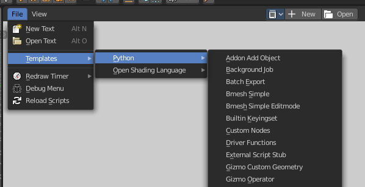
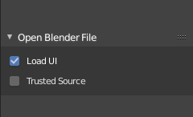
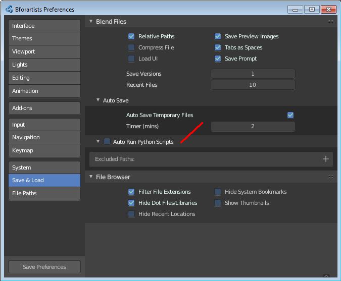

***********************************************
30 Advanced - Scripting & Extending Bforartists
***********************************************

.. contents:: Contents

Scripting & Extending Bforartists
=================================

Python
------

Python is an interpreted, interactive, object-oriented programming language. 

Python scripts are a way to extend Bforartists functionality. Most areas of Bforartists can be scripted, including Animation, Rendering, Import and Export, Object Creation and the scripting of repetitive tasks.

This can be done by the Blender Python API (Application Programming Interface). It comes also with an introduction to scripting and some examples. https://docs.blender.org/api/blender2.8/index.html

Extending Bforartists
---------------------

You can either write scripts, and perform them in the text editor. Scripts must be loaded and executed from scratch every time you need them. Or you can write complete addons. Addons can be activated, and loads with Bforartists.

You can find quite a few example scripts in the text editor in the file menu.

Scripting & Security
====================

The ability to include Python scripts within blend files is valuable for advanced tasks such as rigging, automation and using the game-engine, however it poses a security risk since Python doesn’t restrict what a script can do.

Therefore, you should only run scripts from sources you know and trust.

Automatic execution is disabled by default, however some blend files need this to function properly.

When a blend file tries to execute a script and is not allowed, a message will appear in the header with the option to **Reload Trusted** or **Ignore** the message.

Scripts in Blend Files
----------------------

Auto Execution
--------------

Here are the different ways blend files may automatically run scripts.

Registered Text-Blocks 

A text block can have its **Register** option enabled which means it will load on start. 

Animation Drivers

Python expressions can be used to **Drive** values and are often used in more advanced rigs and animations. 

Game Engine Auto-Start 

Scripts are often used for game logic, blend files can have **Auto Start** enabled with runs the game on load. 

Manual Execution
----------------

There are other ways scripts in a blend file may execute that require user interaction (therefor will run even when auto-execution is off), but you should be aware that this is the case since it’s not necessarily obvious.

- Running a script in the text editor **(ok, this is obvious!)**. 
- Rendering with FreeStyle - **FreeStyle uses scripts to control line styles**
- Running the Game-Engine. 

Controlling Script Execution
----------------------------

Blender files can also contain scripts. Which can be auto run when you load the blend file. Auto running scripts can be a security issue. There are two ways to control script execution in blend files. In the load dialog for a blend file. Or in the Preferences.

In the Blender file selector you will see down left the checkbox Trusted source. Enable it to allow auto execution of the scripts in the blend file.

**Auto-Run Python Scripts**** in the Preferences in the Save & Load Panel ****allows you to run scripts in blend files automatically.**

The Excluded Paths edit box below allows you to exclude certain directories. You can for example exclude the download directory. And allow auto run from all other directories at your computer.

BAM Asset Manager
=================

Refactoring linked .blend files is a common practice in a production environment. While some basic operations can be accomplished within Blender, sometimes it is more practical to perform them on the command line or via a script. During the production of Cosmos Laundromat (Gooseberry Open Movie Project) the **BAM Asset Manager** (BAM) was developed. The original scope of BAM included client-server asset management tools going beyond Blender, but it was later refocused on core utilities to perform two operations:

- blendfile packing 
- automatic dependencies remapping 

Installing BAM
--------------

BAM is a standalone Python package, that can be run on any system without any particular configuration. The only requirement is Python 3 (and pip, the Python package manager, to easily install BAM).

Windows, Linux and macOS provide different ways to install Python 3 and pip. Check out the online docs to learn more about a specific platform.

Once Python 3 and pip are available, BAM can be installed via command line by typing:

pip3 install blender-bam

After a successful installation, the bam command will be available. By typing it and pressing the Enter key, all the available subcommands will be displayed.

bam pack
--------

This command is used for packing a .blend file and **all** its dependencies into a .zip file for redistribution.

usage: bam pack [-h] [-o FILE] [-m MODE] [-e PATTERNS] [-a] [-q] [-c LEVEL]

paths [paths ...]

You can simply pack a blend file like this to create a zip-file of the same name.

bam pack /path/to/scene.blend

You may also want to give an explicit output directory. The example shows how to pack a blend with maximum compression for online downloads

bam pack /path/to/scene.blend --output my_scene.zip --compress=best

The command provides several options to adapt to different workflows (final distribution, partial extraction, rendering).

-o, --output<FILE>

Output file or a directory when multiple inputs are passed 

-m, --mode<MODE>

Output file or a directory when multiple inputs are passed. Possible choices: ZIP, FILE

-e, --exclude<PATTERN(S)>

	Optionally exclude files from the pack.

	--exclude="\*.png"

	Using Unix shell-style wildcards **(case insensitive)**. 

	--exclude="\*.txt;\*.avi;\*.wav"

	Multiple patterns can be passed using the ; separator. 

-a, --all-deps

Follow all dependencies (unused indirect dependencies too) 

-q, --quiet

Suppress status output 

-c, --compress<LEVEL>

Compression level for resulting archive Possible choices: default, fast, best, store

--repo<DIR PATH>

Specify a “root” path from where to pack the selected file. This allows for the creation of a sparse copy of the production tree, without any remapping. 

--warn-external

Report external libraries errors (missing paths) 

Examples
--------

Consider the following directory layout, and in particular the file **01_01_A.lighting.blend** with its linked libraries.

~/agent327/

└─ lib/

├─ chars/

\| ├─ agent.blend ------------->\|

\| ├─ boris.blend ------------->\|

\| └─ barber.blend \|

└─ scenes/ \|

├─ 01-opening \|

├─ 01_01_A.lighting.blend <--\| < BAM pack this file

└─ 01_01_A.anim.blend ------>\|

Once we run bam pack /scenes/01-opening/01_01_A.lighting.blend we obtain a **01_01_A.lighting.zip** inside of which we find the following structure.

~/01_01_A.lighting

├─ 01_01_A.lighting.blend

└─ __/

├─ 01_01_A.anim.blend

└─ __/

└─ lib/

└─ chars/

├─ agent.blend

└─ boris.blend

Note how all paths have been remapped relative to the placement of **01_01_A.lighting.blend** in the root of the output. If we run bam pack /scenes/01-opening/01_01_A.lighting.blend --repo ~/agent327, the output will be different.

~/01_01_A.lighting

├─ lib/

\| └─ chars/

\| ├─ agent.blend

\| └─ boris.blend

└─ scenes

└─ 01-opening/

├─ 01_01_A.lighting.blend < The BAM packed file

└─ 01_01_A.anim.blend

In this case no path is remapped, and we simply strip out any file that is not referenced as a direct or indirect dependency of **01_01_A.lighting.blend**. This is effectively a sparse copy of the original production tree.

bam remap
---------

Remap blend file paths

usage: bam remap [-h] {start,finish,reset} ...

This command is a 3 step process:

- first run bam remap start . which stores the current state of your project (recursively). 
- then re-arrange the files on the filesystem (rename, relocate). 
- finally run bam remap finish to apply the changes, updating the .blend files internal paths. 

cd /my/project

bam remap start .

mv photos textures

mv barbershop_v14_library.blend barberhop_libraray.blend

bam remap finish

.. Note:: Remapping creates a file called ``bam_remap.data`` in the current directory. You can relocate the entire project to a new location but on executing ``finish``, this file must be accessible from the current directory.

.. Note:: This command depends on files unique contents, take care not to modify the files once remap is started.

Subcommands
-----------

remap start
-----------

Start remapping the blend files

usage: bam remap start [-h] [-j] [paths [paths ...]]

-j, --json

Generate JSON output 

remap finish
------------

Finish remapping the blend files

usage: bam remap finish [-h] [-r] [-d] [-j] [paths [paths ...]]

-r, --force-relative

Make all remapped paths relative (even if they were originally absolute) 

-d, --dry-run

Just print output as if the paths are being run 

-j, --json

Generate JSON output 

remap reset
-----------

Cancel path remapping

usage: bam remap reset [-h] [-j]

