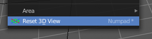

******************
32 Troubleshooting
******************

.. contents:: Contents

Troubleshooting
===============

There are some common problems in Bforartists. Before you proceed make sure your computer meets the minimum reqirements. And make sure your drivers are up to date and your graphics card is supported. 

Troubleshooting the 3D View
===========================

Objects Invisible in Camera View
--------------------------------

If you have a large scene, viewing it through Camera View may not display all of the Objects in the scene. One possibility may be that the clipping distance of the camera is too low. The camera will only show objects that fall within the clipping range.

Performance
-----------

Slow Selection
--------------

Bforartists uses OpenGL drawing for selection, some graphics card drivers are slow at performing this operation.

This becomes especially problematic on dense geometry.

Possible Solutions:

OpenGL Occlusion Queries (User Preference) 

	See User Preferences > System > Selection

	This option defaults **Automatic**, try setting this to **OpenGL Occlusion Queries**, since there is a significant performance difference under some configurations.

Upgrade OpenGL Driver 

In some cases slow selection is resolved by using updated drivers. **It’s generally good to use recent drivers when using 3D software.**

Select Centers (Workaround) 

In **Object Mode**, holding Ctrl while selecting uses the object center point. While this can be useful on its own, its has the side-effect of not relying on OpenGL selection. 

Change Draw Modes (Workaround) 

Using **Wireframe** or even **Bounding Box** draw modes can used to more quickly select different objects. 

.. Note:: Obviously the workarounds listed here aren’t long term solutions, but its handy to know if you’re stuck using a system with poor OpenGL support.

Navigation
----------

Lost in Space
-------------

When navigating your scene, you may accidentally navigate away from your scene and find yourself with a blank view-port. 

The solution is to use the Reset 3D View operator in the View menu. This resets the 3D view to the initial state.

Invisible Limit Zooming In
--------------------------

This problem lies in the nature of the default zooming method. It zooms towards a point in the scene. Andwhen it reaches this point, then it cannot zoom any further.

One solution is to zoom out and move towards the object instead of zooming.

You can also try some other zoom methods. Dolly or Border Zoom doesn't have this problems.

Tools
-----

Invalid Selection
-----------------

There are times when selection fails under some configurations, often this is noticeable in mesh **Edit Mode**, selecting vertices/edges/faces where random elements are selected.

Internally Bforartists uses OpenGL for selection, so the graphics card driver is relied on giving correct results.

Possible Solutions:

Disable Anti-Aliasing (FSAA, Multi-Sampling) 

This is by far the most common cause of selection issues.

There are known problems with some graphics cards when using FSAA/multi-sampling.

You can disable this option by:

- Turning FSAA/multi-sampling off in your graphics card driver options. 
- Turning **Multi-Sampling** off in the system preferences. 
- 
Change Anti-Aliasing Sample Settings 

Depending on your OpenGL configuration, some specific sample settings may work, while others fail.

Unfortunately finding working configuration involves trial & error testing.

Upgrade OpenGL Driver 

As with any OpenGL related issues, using recent drivers can resolve problems.

However it should be noted that this is a fairly common problem and remains unresolved with many drivers.

Troubleshooting Graphics Hardware
=================================

Bforartists makes use of OpenGL, which is typically hardware accelerated.

This means issues with the graphics card hardware and drivers can impact on Bforartists’s behavior. This page lists some known issues using Bforartists on different graphics hardware and how to trouble-shoot them.

Performance
-----------

When the entire interface very slow and unresponsive **(even with the default startup scene)**. This is likely a problem with the OpenGL configuration.

Unfortunately in this situation you may have to do some of your own tests to find the cause, here are some common causes and possible solutions.

Upgrade your OpenGL Driver 

If you’re experiencing any strange graphics problems with Bforartists, its always good to double check you’re using the latest drivers. 

Disable Anti-Aliasing (FSAA, Multi-Sampling) 

See Invalid Selection, Disable Anti-Aliasing. 

Change the **Window Draw Method**

This is set in the system preferences. Its selected automatically, however when experiencing problems its worth checking if changing this resolves interface drawing problems. 

Troubleshooting Crashes
=======================

Like every other software, Bforartists can crash. The most common causes of Bforartists crashes are.

- Running out of memory. 
- Issues with graphics hardware/drivers. 
- Bugs in Bforartists. 

Firstly, you may be able to recover your work with File > Recover Last Session.

To prevent the problem from happening again, you can check that the graphics drivers are up to date, upgrade your machine’s hardware (the RAM or graphics card), and disable some options that are more memory intensive:

- Disable **Region Overlap** and **Triple buffering** at User Preferences > System > Window Draw Method. 
- Using multisample, anti-aliasing also increase the memory usage and make display slower. 
- On Linux, the Window Manager (KDE, Gnome, Unity) may be using hardware accelerated effects (eg. window shadows and transparency) that are using up the memory that Bforartists needs. Try disabling the desktop effects or switch to a light-weight Window Manager. 

Recovering from mistakes or problems
====================================

Bforartists provides a number of ways for the user to recover from mistakes, and reduce the chance of losing their work in the event of operation errors, computer failures, or power outages. There are two ways for you to recover from mistakes or problems:

At the User Level (Relating to **Actions**)

- For your actions, there are options like **Undo**, **Redo** and an **Undo History**, used to roll back from mistakes under normal operation, or return back to a specific action. 
- Bforartists also has new features like **Repeat** and **Repeat History**, and the new **Redo Last** which you can use in conjunction with the options listed. 

At the System Level (Relating to **Files**)

- There are options to save your files like **Auto Save** that saves your file automatically over time, and **Save on Quit**, which saves your Bforartists file automatically when you exit Bforartists.

.. Note:: In addition to these functions being enabled by default, the ``Save on Quit`` functionality cannot be disabled.

As a general rule for every software useage: save often, save very often, and don't forget to save often!

Options for Files (System Level)
--------------------------------

Save and Auto Save
------------------

Computer crashes, power outages or simply forgetting to save can result in the loss or corruption of your work. To reduce the chance of losing files when those events occur, Bforartists can use an **Autosave** function. The **Save and Load** tab of the **User Preferences** window allows you to configure the two ways that Bforartists provides for you to regress to a previous version of your work.

Save on Quit 

The function **Save on Quit** is enabled by default in Bforartists. Bforartists will always save your files when you quit the application under normal operation. 

Save Versions 

This option tells Bforartists to keep the indicated number of saved versions of your file in your current working directory when you manually save a file. These files will have the extension: .blend1, .blend2, etc., with the number increasing to the number of versions you specify. Older files will be named with a higher number. e.g. With the default setting of **2**, you will have three versions of your file: \*.blend (your last save), \*.blend1 (your second last save) and \*.blend2 (your third last save). 

Auto Save Temporary Files 

Checking this box tells Bforartists to **automatically** save a backup copy of your work-in-progress to the Temp directory (refer to the **File** panel in the **User Preferences** window for its location). This will also enable the **Timer (mins)** control which specifies the number of minutes between each Auto Save. The default value of the Bforartists installation is **5** (5 minutes). The minimum is **1**, and the Maximum is **60** (Save at every one hour).The Auto Saved files are named using a random number and have a .blend extension. 

.. Tip:: Compress Files

Recovering Auto Saves
---------------------

Recover Last Session 
---------------------

File > Recover Last Session will open the quit.blend that is saved into the **Temp** directory when you exit Bforartists. Note that files in your **Temp** directory are deleted when you reboot. 

Recover Auto Save 
------------------

File > Recover Auto Save... allows you to open the Auto Saved file. After loading the Auto Saved version, you may save it over the current file in your working directory as a normal .blend file. 

Recover Autosave will open the file browser.

.. Important:: When recovering an Auto Saved file, you will lose any changes made since the last ``Auto Save`` was performed.Only ``one`` Auto Saved file exists for each project (i.e. Bforartists does not keep older versions - hence you won’t be able to go back more than a few minutes with this tool).

Compatibility (OSX)
===================

Mouse Motion Jitters (SmoothMouse)
----------------------------------

Problem 

When grabbing an object or orbiting the view, cursor motion is jittery.

Solutions 

- Uninstall **SmoothMouse**. 
- Disable Continuous Grab 

Compatibility (Windows)
=======================

Bforartists Hangs on Window Duplication (Nahimic for MSI)
---------------------------------------------------------

Problem 

Accessing Window > Duplicate Window, hangs Bforartists, using 100% of one core.

Solution 

Uninstall **Nahimic·for·MSI**

