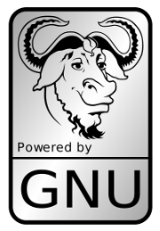

**********************
35 Bforartists History
**********************

.. contents:: Contents

Bforartists 2 History
=====================

Preface: 
---------

It was for a while not clear if and how we continue with the Bforartists 2 development. The Blender developers did quite a few things right with 2.80. Icon buttons in the tool shelf, streamlined UI and so on. In best case Blender 2.80 would have made a Bforartists 2 obsolete.

But they did also quite a few things wrong again. The hard to read monochrome icons and still a hard to read standard theme, the new tool shelf, wich is one gigantic hacky solution that doubles the tool set, under the hood still a big mess full of double menu entries, and so on. But alone the toolbar from Bforartist 1 justified the further development already. It is so useful. And so the decision was made to continue with development.

There was no exact date when the development started again. There was quite a few things still to do for Bforartists 1, which was at the same time preparation work for Bforartists 2 already. Manual for example. And the merge of Blender 2.80 code into the Bforartists master was also a longer process across several days. The official starting point was the release of the Bforartists 2 Manifest, which defines the will and the further development goals.

- Reiner

History:
--------

03.10.2019 - Bforartists 0.7.0 released.31.07.2019 - Bforartists 0.6.0 released.03.06.2019 - Bforartists 0.5.0 released.06.05.2019 - Bforartists 0.4.0 released.01.04.2019 - Bforartists 0.3.0 released.03.03.2019 - Bforartists 0.2.0 released.04.02.2019 - Bforartists 0.1.0 released.01.12.2018 - Merging Blender 2.80 into Bforartists Master.27.10.2018 - Bforartists 2 Manifest released.

Bforartists 1 History
=====================

Preface:
--------

Welcome to Bforartists, the free and open source 3D modeling, rendering and animation suite.

Bforartists is a fork of the popluar open source 3d software Blender. And, similar to Blender, of course also open source and under the GPL license. The primary goal of the Bforartists fork is to deliver a better graphical UI and a better usability. This means a complete switch in the useage philosophy. Away from the hotkey and speed centered useage. Away from crazy decisions like RMB select. Towards a user friendly and intuitive graphical UI that can be used with a mouse and one hand when neccessary. And that is much closer to the common UI standards of many other software.

The idea to solve the UI dilemma of Blender and to fork it was long around since years. It was no easy decision to really start it. Blender is a code monster. And so the answer to the question shall i really start a fork was always no. But at one point it was simply enough how the user interface gots treaten by the Blender developers. The answer if Blender should be forked turned from \*no\* to \*possible with some big caveats\*. And then the decision was made to fork Blender.

The Bforartists project itself started officially at July the 2nd 2015. That's when the first real steps were done. 

History:
--------

2.6.2015 - Decision day. The first pages for the UI proposal were written. The work at the homepage started. Which was the official start of the whole project.

2.7.2015 - The domain bforartists was registered.

13.8.2015 - The Bforartists page was finished and went live.

22.8.2015 - Github account was created and went live.

21.9.2015 - The first Bforartists version 0.1 was released. It was based at Blender 2.75. And containted not this much more than the changed branding.

14.10.2015 - Version 0.2brought the changes for Blender 2.76. And that was the moment when Bforartists started to walk alone.

19.12.2015 - Version 0.2.1 introduced a new keymap and a new navigation scheme. And already quite a few changes at the UI layout. Blender has a ton of missing UI entries and a ton of double and even triple menu entries. It also brought in the Blender 2.76 a and b patches to Bforartists

27.01.2016 - Bforartists 0.2.2was mainly around a plugin to display the most needed hotkeys up left.

18.03.2016 - Bforartists 0.3.0 introduced the first incarnation of icon buttons in the tool shelf.

26.03.2016 - Bforartists 0.3.1 came with some small fixes that were overlooked for version 0.3.0. The splash screen was changed because of ongoing trolling.

02.08.2016 - Bforartists 0.4.0 was a small refinement release that was the final stroke below the try to implement Qt and new editor types. Which did simply not work.

04.09.2016 - Bforartists 0.4.1brought mainly changes to the tooltips. Nearly every tooltip contains the tool name now too. 

16.09.2016 - 0.4.2 is another small release mainly around catching some more tooltips and small quirks. New is the Materials Library FX addon, which is also natively included into Blender 2.78 now.

24.09.2016 - 0.5.0 is a milestone release. It marks the end of the first big development cycle. The tracker is empty for the first time since development start.

02.11.2016 - 0.6.0 brings fixes to the addons, first subtabs in the panels, and the Mini lightlib addon.

01.12.2016 - 0.7.0 was mainly cleanup work in the Properties editor. 

08.01.2017 - Version 0.8.0 brings the new Toolbar editor. 

27.02.2017 - Version 0.9.0 is the merge of the actual Blender version 2.78 C into Bforartists.

13.03.2017 - Version 0.9.1 is a bug fix release that fixes some show stoppers from version 0.9.0. 

10.4.2017 - Version 0.9.2 is around cleaning up the menus and connecting some loose ends. And it introduces a Mac build.

13.9.2017 - Version 0.9.3 is the merge of Blender 2.79 into Bforartists. Plus a few smaller adjustments and fixes.

14.9.2017 - An emergency release because of a showstopper bug. The bake panels were missing.

02.03.2018 - Version 0.9.6 brings the changes from Blender 2.79a, and adds 260 changes from Bforartists side.

19.04.2018 - Version 0.9.7 brings the full keymap, the changes from Blender 2.79b, and lots of small improvements and fixes. More compact brush panels for example.

04.05.2018 - Version 1.0.0 RC1 marks the end of this development cycle. All initial development goals that could be fulfilled are fulfilled.

11.05.2018 - Version 1.0.0 is live.

Blender’s History
=================

In 1988 Ton Roosendaal co-founded the Dutch animation studio NeoGeo. NeoGeo quickly became the largest 3D animation studio in the Netherlands and one of the leading animation houses in Europe. NeoGeo created award-winning productions (European Corporate Video Awards 1993 and 1995) for large corporate clients such as multi-national electronics company Philips. Within NeoGeo Ton was responsible for both art direction and internal software development. After careful deliberation Ton decided that the current in-house 3D toolset for NeoGeo was too old and cumbersome to maintain, and needed to be rewritten from scratch. In 1995 this rewrite began and was destined to become the 3D software creation we all know as Blender. As NeoGeo continued to refine and improve Blender it became apparent to Ton that Blender could be used as a tool for other artists outside of NeoGeo.

In 1998, Ton decided to found a new company called Not a Number (NaN) as a spin-off of NeoGeo to further market and develop Blender. At the core of NaN was a desire to create and distribute a compact, cross platform 3D application for free. At the time this was a revolutionary concept as most commercial 3D applications cost thousands of dollars. NaN hoped to bring professional level 3D modeling and animation tools within the reach of the general computing public. NaN’s business model involved providing commercial products and services around Blender. In 1999 NaN attended its first SIGGRAPH conference in an effort to more widely promote Blender. Blender’s first SIGGRAPH convention was a huge success and gathered a tremendous amount of interest from both the press and attendees. Blender was a hit and its huge potential confirmed!

Following the success of the SIGGRAPH conference in early 2000, NaN secured financing of €4.5M from venture capitalists. This large inflow of cash enabled NaN to rapidly expand its operations. Soon NaN boasted as many as fifty employees working around the world trying to improve and promote Blender. In the summer of 2000, Blender 2.0 was released. This version of Blender added the integration of a game engine to the 3D application. By the end of 2000, the number of users registered on the NaN website surpassed 250,000.

Unfortunately, NaN’s ambitions and opportunities didn’t match the company’s capabilities and the market realities of the time. This over-extension resulted in restarting NaN with new investor funding and a smaller company in April 2001. Six months later NaN’s first commercial software product, Blender Publisher was launched. This product was targeted at the emerging market of interactive web-based 3D media. Due to disappointing sales and the ongoing difficult economic climate, the new investors decided to shut down all NaN operations. The shutdown also included discontinuing the development of Blender. Although there were clearly shortcomings in the then current version of Blender, such as a complex internal software architecture, unfinished features and a non-standard way of providing the GUI, the enthusiastic support from the user community and customers who had purchased Blender Publisher in the past meant that Ton couldn’t justify leaving Blender to fade into insignificance. Since restarting a company with a sufficiently large team of developers wasn’t feasible, Ton Roosendaal founded the non-profit organization Blender Foundation in March 2002.

The Blender Foundation’s primary goal was to find a way to continue developing and promoting Blender as a community-based open source project. In July 2002, Ton managed to get the NaN investors to agree to a unique Blender Foundation plan to attempt to release Blender as open source. The “Free Blender” campaign sought to raise €100,000 so that the Foundation could buy the rights to the Blender source code and intellectual property rights from the NaN investors and subsequently release Blender to the open source community. With an enthusiastic group of volunteers, among them several ex-NaN employees, a fund raising campaign was launched to “Free Blender”. To everyone’s surprise and delight the campaign reached the €100,000 goal in only seven short weeks. On Sunday October 13, 2002, Blender was released to the world under the terms of the GNU GPL. Blender development continues to this day driven by a team of dedicated volunteers from around the world led by Blender’s original creator, Ton Roosendaal.

Video: From Blender 1.60 to 2.50
--------------------------------

https://vimeo.com/8567074

Version/Revision Milestones
---------------------------

The start!
----------

- 1.00 - January 1994: Blender in development at animation studio NeoGeo. 
- 1.23 - January 1998: SGI version published on the web, IrisGL. 
- 1.30 - April 1998: Linux and FreeBSD version, port to OpenGL and X11. 
- 1.3x - June 1998: NaN founded. 
- 1.4x - September 1998: Sun and Linux Alpha version released. 
- 1.50 - November 1998: First Manual published. 
- 1.60 - April 1999: C-key (new features behind a lock, $95), MS-Windows version released. 
- 1.6x - June 1999: BeOS and PPC version released. 
- 1.80 - June 2000: End of C-key, Blender full freeware again. 
- 2.00 - August 2000: Interactive 3D and real-time engine. 
- 2.10 - December 2000: New engine, physics, and Python. 
- 2.20 - August 2001: Character animation system. 
- 2.21 - October 2001: Blender Publisher launch. 
- 2.2x - December 2001: Mac OSX version. 

Blender goes Open Source
------------------------

- **13 October 2002: Blender goes Open Source, 1st Blender Conference**. 
- 2.25 - October 2002: Blender Publisher becomes freely available. 
- Tuhopuu1 - Oct 2002: The experimental tree of Blender is created, a coder’s playground. 
- 2.26 - February 2003: The first true open source Blender release. 
- 2.27 - May 2003: The second open source Blender release. 
- 2.28x - July 2003: First of the 2.28x series. 
- 2.30 - October 2003: Preview release of the 2.3x UI makeover presented at the 2nd Blender Conference. 
- 2.31 - December 2003: Upgrade to stable 2.3x UI project. 
- 2.32 - January 2004: Major overhaul of internal rendering capabilities. 
- 2.33 - April 2004: Game Engine returns, ambient occlusion, new procedural textures. 
- 2.34 - August 2004: Particle interactions, LSCM UV mapping, functional YafRay integration, weighted creases in subdivision surfaces, ramp shaders, full OSA, and many many more. 
- 2.35 - November 2004: Another version full of improvements: object hooks, curve deforms and curve tapers, particle duplicators and much more. 
- 2.36 - December 2004: A stabilization version, much work behind the scene, normal and displacement mapping improvements. 
- 2.37 - June 2005: Transformation tools and widgets, softbodies, force fields, deflections, incremental subdivision surfaces, transparent shadows, and multi-threaded rendering. 
- 2.40 - December 2005: Full rework of armature system, shape keys, fur with particles, fluids and rigid bodies. 
- 2.41 - January 2006: Lots of fixes, and some game engine features. 
- 2.42 - July 2006: The nodes release, array modifier, vector blur, new physics engine, rendering, lip sync, and many other features. This was the release following Project Orange. 
- 2.43 - February 2007: Multi-resolution meshes, multi-layer UV textures, multi-layer images and multi-pass rendering and baking, sculpting, retopology, multiple additional matte, distort and filter nodes, modeling and animation improvements, better painting with multiple brushes, fluid particles, proxy objects, sequencer rewrite, and post-production UV texturing. 
- 2.44 - May 2007: The big news, in addition to two new modifiers and re-awakening the 64-bit OS support, was the addition of subsurface scattering, which simulates light scattering beneath the surface of organic and soft objects. 
- 2.45 - September 2007: Serious bug fixes, with some performance issues addressed. 
- 2.46 - May 2008: The Peach release was the result of a huge effort of over 70 developers providing enhancements to provide hair and fur, a new particle system, enhanced image browsing, cloth, a seamless and non-intrusive physics cache, rendering improvements in reflections, AO, and render baking, a mesh deform modifier for muscles and such, better animation support via armature tools and drawing, skinning, constraints and a colorful Action Editor, and much more. It was the release following Project Peach. 
- 2.47 - August 2008: Bugfix release. 
- 2.48 - October 2008: The Apricot release, cool GLSL shaders, lights and GE improvements, snap, sky simulator, shrinkwrap modifier, and Python editing improvements. This was the release following Project Apricot. 
- 2.49 - June 2009: Node-based textures, armature sketching (called Etch-a-Ton), boolean mesh operation improvements, JPEG2000 support, projection painting for direct transfer of images to models, and a significant Python script catalogue. GE enhancements included video textures, where you can play movies in-game, upgrades to the Bullet physics engine, dome (fish-eye) rendering, and more API GE calls made available. 

Blender 2.5x - The Recode!
--------------------------

- 2.5x - From 2009 to August 2011: This series released four pre-version (from Alpha 0 in November 2009 to Beta in July 2010) and three stable versions (from 2.57 - April 2011 - to 2.59 - August 2011). It is one of the most important development projects, with a total refactor of the software with new functions, redesign of the internal window manager and event/tool/data handling system, and new Python API. The final version of this project was Blender 2.59 in August 2011. 

Blender 2.6x to 2.7x - Improvements & Stabalizing
-------------------------------------------------

- 2.60 - October 2011: Internationalization of the UI, improvements in animation system and the GE, vertex weight groups modifiers, 3D audio and video, bug fixes, and the UI internationalization. 
- 2.61 - December 2011: The Cycles renderer was added in trunk, the camera tracker was added, dynamic paint for modifying textures with mesh contact/approximation, the Ocean Sim modifier to simulate ocean and foam, new add-ons, bug fixes, and more extensions added for the Python API. 
- 2.62 - February 2012: The Carve library was added to improve boolean operations, support for object tracking was added, the Remesh modifier was added, many improvements in the GE, matrices and vectors in the Python API were improved, new add-ons, and many bug fixes. 
- 2.63 - April 2012: Bmesh was merged to trunk with full support for n-sided polygons, sculpt hiding, a panoramic camera for Cycles, mirror ball environment textures and float precision textures, render layer mask layers, ambient occlusion and viewport display of background images and render layers, new import and export add-ons were added, and 150 bug fixes. 
- 2.64 - October 2012: Mask editor, improved motion tracker, OpenColorIO, Cycles improvements, sequencer improvements, better mesh tools (Inset and Bevel were improved), new keying nodes, sculpt masking, Collada improvements, new skin modifier, new compositing nodes backend, and many bugs were fixed. 
- 2.65 - December 2012: Fire and smoke improvements, anisotropic shader for Cycles, modifier improvements, bevel tool now includes rounding, new add-ons, and over 200 bug fixes. 
- 2.66 - February 2013: Dynamic topology, rigid body simulation, improvements in UI and usability (including retina display support), Cycles now supports hair, the bevel tool now supports individual vertex bevelling, new **Mesh Cache** modifier and the new **UV Warp** modifier, new SPH particle fluid solver. More than 250 bug fixes. 
- 2.67 - May 2013: Freestyle was added, paint system improvements, subsurface scattering for Cycles, Ceres library in the motion tracker, new custom python nodes, new mesh modeling tools, better support for UTF8 text and improvements in text editors, new add-ons for 3D printing, over 260 bug fixes. 
- 2.68 - July 2013: New and improved modeling tools, three new Cycles nodes, big improvements in the motion tracker, Python scripts and drivers are disabled by default when loading files for security reasons, and over 280 bug fixes. 
- 2.69 - October 2013: Even more modeling tools, Cycles improved in many areas, plane tracking is added to the motion tracker, better support for FBX import/export, and over 270 bugs fixed. 
- 2.70 - March 2014: Cycles gets basic volumetric support on the CPU, more improvements to the motion tracker, two new modeling modifiers, some UI consistency improvements, and more than 560 bug fixes. 
- 2.71 - June 2014: Deformation motion blur and fire/smoke support is added to Cycles, UI popups are now draggable, performance optimizations for sculpting mode, new interpolation types for animation, many improvements to the GE, and over 400 bug fixes. 
- 2.72 - October 2014: Cycles gets volume and SSS support on the GPU, pie menus are added and tooltips greatly improved, the intersection modeling tool is added, new sun beam node for the compositor, Freestyle now works with Cycles, texture painting workflow is improved, and more than 220 bug fixes. 
- 2.73 - January 2015: Cycles gets improved volumetric support, major upgrade to grease pencil, MS-Windows gets Input Method Editors (IMEs) and general improvements to painting, freestyle, sequencer and add-ons. 
- 2.74 - March 2015: Support for custom-normals, viewport compositing and improvements to hair dynamics. 
- 2.75 - July 2015: Integrated stereo/multi-view pipeline, corrective smooth modifier and new dependency graph **(enable as a command line option)**. 
- 2.76 - November 2015: Pixar OpenSubdiv support, Viewport and File Browser performance boost, node auto-offset, and a text effect strip for the Sequencer. 

About Free Software and the GPL
===============================

When one hears about “free software”, the first thing that comes to mind might be “no cost”. While this is typically true, the term “free software” as used by the Free Software Foundation (originators of the GNU Project and creators of the GNU General Public License) is intended to mean “free as in freedom” rather than the “no cost” sense (which is usually referred to as “free as in free beer” or **gratis**). Free software in this sense is software which you are free to use, copy, modify, redistribute, with no limit. Contrast this with the licensing of most commercial software packages, where you are allowed to load the software on a single computer, are allowed to make no copies, and never see the source code. Free software allows incredible freedom to the end user. Since the source code is universally available, there are also many more chances for bugs to be caught and fixed.

When a program is licensed under the GNU General Public License (the GPL):

- You have the right to use the program for any purpose. 
- You have the right to modify the program, and have access to the source codes. 
- You have the right to copy and distribute the program. 
- You have the right to improve the program, and release your own versions. 

In return for these rights, you have some responsibilities if you distribute a GPL’d program, responsibilities that are designed to protect your freedoms and the freedoms of others:

- You must provide a copy of the GPL with the program, so that recipients are aware of their rights under the license. 
- You must include the source code or make the source code freely available. 
- If you modify the code and distribute the modified version, you must license your modifications available under the GPL (or a compatible license). 
- You may not restrict the licensing of the program beyond the terms of the GPL. (you may not turn a GPL’d program into a proprietary product.) 

For more on the GPL, check the its page on the GNU Project web site.

Note

The GPL only applies to the Bforartists application and **not** the artwork you create with it; for more info see the Bforartists or Blender License.

