*************
3 - Interface
*************

.. contents:: Contents

Tooltips
========

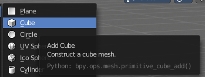

When you hover with the mouse over an UI element, like a button, then you can see a tooltip.

A tooltip can contain the tool name, a short description of the tool, the hotkey, and a Python tooltip. 

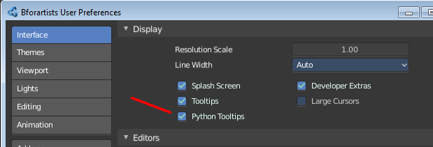

The Python tooltip shows you the name of the operator. It is of interest for programming needs. It can be turned off in the User Preferences.

The tooltips in the Tool Shelf acts a bit different than the tooltips in the rest of the UI. It will not show you the Python tooltips, since it is a gigantic hack on top of the existing UI.

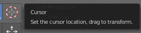

Interface
=========

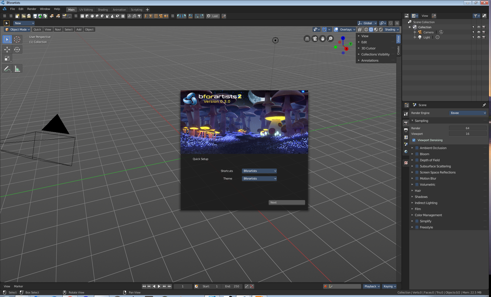

User Interface Principles
-------------------------

The UI is made of several different workspaces. Each workspace is made of several editors for the different purposes. And this editors are made of several sub elements. Like a Header or a tool shelf, or a sidebar. UI elements are organized in tabs, menus and panels.

The idea is to have a non overlapping and blocking UI with a non modal toolset.Which is just partially to achieve. See header below. And by the fact that you work in modes ...

As a consequence of the non overlapping UI concept, the interface avoids to work with popup panels where possible. You can adjust the tool after you use it, in the so called last operation panel. It can be found in the 3D view for example, down left.

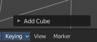

Splash Screen
=============

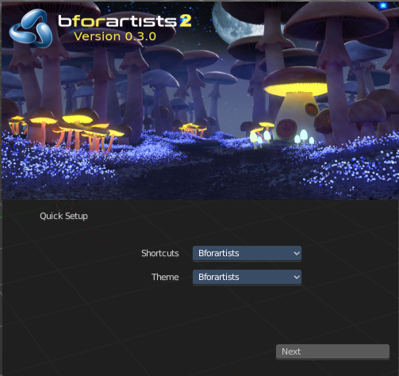

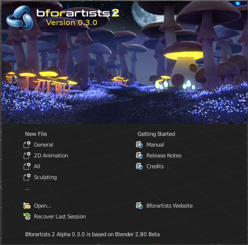

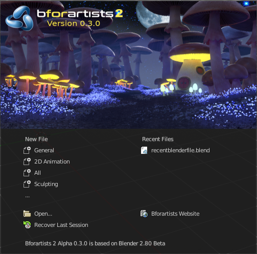

The splash screen shows at startup. You can turn it off in the User Preferences.

At the very first start you can do a quick setup, and choose with what keymap and what theme you want to work. Clicking at the Next button will then make this change permanent.

When you don't have any recent files, then the splash screen shows a Getting Started section with some links to useful resources. 

And when you have recent files, then the splash screen lists them instead of the Getting Started section.

Here you can also read at what Blender version the current Bforartists version is based at.

Header
======

Every editor has a header area. It usually contains the menu. And some tools or settings.

Scroll Header
-------------

A header can be scrolled! This is especially useful in the layouts where the header is this crowded with tools that it doesn't fit to display all content into the layout anymore. This is for example the case in the UV layout.

To scroll the header, click with the middle mouse button at it, and drag.

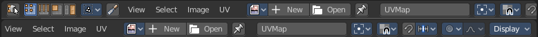

Show / Hide header
------------------

You can hide the header in the right click menu. The Toggle Header menu item. Then the menu vanishes. Obviously you can't reveal the header this way, since now the header is hidden, and the "toggle" is not to reach anymore. But there is another way.

Hidden headers shows a little triangle button at the right side. You can reveal the header by clicking at it.

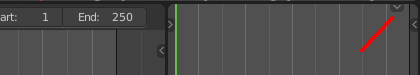

Flip Header to top or bottom
----------------------------

The header can either be displayed at the top or at the bottom.

Right click at an empty space somewhere at the menu bar of an editor. You will see a menu now. Here you can choose if you want to display the menu bar at the top of the editor, or at the bottom. The menu item is either called Flip to Top, or Flip to Bottom, dependant of the current status.

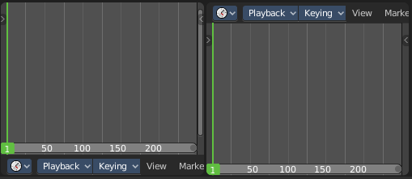

Panels
======

A Panel is a container that contains tools and settings. They are used in quite a few locations. In the Properties editor for example. Or in the sidebars.

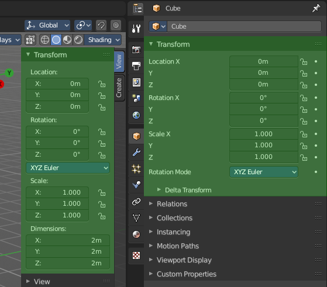

Panels can be rearranged in order. Simply drag them over each other to achieve the order that you need.

Panels can be expanded and collapsed by clicking at the title bar.When you hold down ctrl and click at the title bar then this panel will open, and all other panels will close. 

Pinning panels
--------------

Normally the tabs just displays the panels of the current tab. But you can pin panels so that they display always. This counts also for content from other tabs. Here i have pinned the panel from the Mini Lightlib in the Create tab. And it shows in the View tab now.Right click at the tab that you want to pin. A menu pops up. Check the Pin checkbox. The tab will now show a pin, and will display permanently. 

To unpin the panel simply click at the Pin icon.

Tabs
====

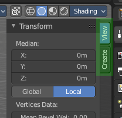

The Sidebars can have Tabs to switch between different content. Also the Properties editor has them.The tabshelps to organize the available tools into categories. In the 3D view it's also a common place where addons adds themselves.

Menus, Buttons and Controls
===========================

The UI contains various control elements. Buttons, Menus, toggles, etc.

Menu
----

In the header you may find text menus. A text menu contains usually buttons. But it can also contain toggles. Or other menus.

Button
------

A button is a UI element that allows you to perform a operation at click. There are various button types in the UI. Text Buttons in the text menus, text buttons in the panels, and icon buttons in the header and in the tool shelf.

Toggles
-------

Toggles can be radio buttons. But also icon or text buttons. Where they are the same is that they have states. On and off for example. They can also have more states than just two.

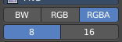

Edit Box
--------

Some UI elements are editable. Edit boxes are used for things like position, angle, name, etc. . Click into the edtiable area to enter the edit mode. Do the changes, like typing in a new value, then press Enter to confirm the change.

Value edit boxes have some extra functionality. They work as sliders too. Hover with the mouse over the edit box. The mouse cursor will turn into two arrows.

Dropdown box
------------

A dropdown box is another kind of a menu. Usually you choose something here. Like a special setting. Or when you add a modifier. A list dropdown box can show you the loaded textures for example. and allow you to choose another one.

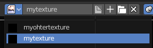

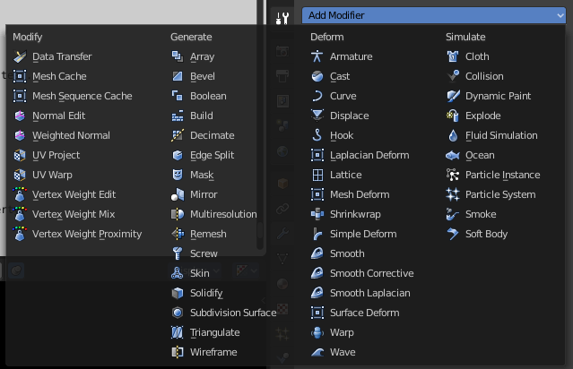

Color Picker
------------

You may stumble across color pickers in the UI. When you do a painting job for example. Here you can adjust color for the specific task. Like adjusting the brush color.

Widgets
-------

There are quite a few widget types in Bfoartists to find. Most of them in the 3D View. Widgets allows you to manipulate the transformation along one or more axis.

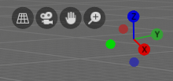

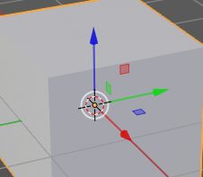

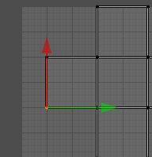

Cursors
-------

A cursor is a center point, and allows manipulation in different ways. Objects gets created at the 3D cursor in the 3D view. You can set the cursor at different locations. You can snap it to elements, and you can snap elements to it.

Value Editing
=============

You will find lots of value edit boxes in the Bforartists interface. To set the render size for example. Or to set the position of an object.

Multi Value Editing
-------------------

Sometimes you want to edit multiple values at once. The object scale for example. This can be done by clicking into the first edit box, and then drag with the mouse across the other edit boxes. They will become active now. And when you edit one value, then the other values will change too.

Expressions
-----------

You can also enter expressions in value edit boxes. And the result will be calculated. For example,3\*2 instead of 6. or 5/10+3. Even constants like pi (3.142) or functions like sqrt(2) (square root of 2) may be used.

Expressions as Drivers
----------------------

You may want your expression to be re-evaluated after its entered. Blender supports this using **Drivers** (a feature of the animation system).

Expression beginning with #, have a special use. Instead of evaluating the value and discarding the expression, a driver is added to the property with the expression entered.

The expression #frame is a quick way to access map a value to the current frame, but more complex expressions are also supported #fmod(frame, 24) / 24 for example.

This is simply a convenient shortcut to add drivers which can also be added via the RMB menu.

Units
-----

You can mix units with numbers. Means when yo work in meters, then you can type in cm for centimers. And the correct value will be used then.

You can even mix units in the same expression. For example 1m, 3mm. Or do complex mathematical calculations like2.2mm + 5' / 3" - 2yards . Commas are optional.

Units can be adjusted in the Properties Editor in the Scene tab in the Units panel.

Such units needs to be set in the scene settings. Metric or Imperial.

Unit Names
----------

Unit names have can be used with both long and short forms. Both is recognized.

Here is a list of recognized unit names you can use.Plurals of the names are recognized too, so meter and meters can both be used.

Imperial Units

.. list-table::

	* - thou
	  - mil
	  - 0.0000254

	* - inch
	  - ", in
	  - 0.0254

	* - foot, feet
	  - ', ft
	  - 0.3048

	* - yard
	  - yd
	  - 0.9144

	* - chain
	  - ch
	  - 20.1168

	* - furlong
	  - fur
	  - 201.168

	* - mile
	  - mi, m
	  - 1609.344

Metric Units

.. list-table::

	* - micrometer
	  - um
	  - 0.000001

	* - millimeter
	  - mm
	  - 0.001

	* - centimeter
	  - cm
	  - 0.01

	* - decimeter
	  - dm
	  - 0.1

	* - meter
	  - m
	  - 1.0

	* - dekameter
	  - dam
	  - 10.0

	* - hectometer
	  - hm
	  - 100.0

	* - kilometer
	  - km
	  - 1000.0

Menu shortcuts
==============

- Arrow keys can be used to navigate into a menu
- Each menu item has an underlined character which can be pressed to activate it. 
- Number keys or num-pad can be used to access menu items. (Where 1 is the first menu item, 2 the second... etc. For larger menus Alt-1 the 11th... up to Alt-0 the 20th) 
- Press Return to activate the selected menu item. 
- Press Esc to cancel the menu. 

Tool Shelf
==========

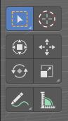

Some editors have a Tool Shelf at the left side. This toolshelf contains the tools. It can be resized by dragging. It can be closed and opened. 

Opening and closing by menu and hotkey
--------------------------------------

The view menu provides you with menus to close and to open the Tool shelf.

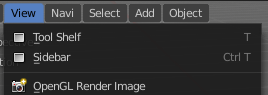

It also shows the hotkey.

Resize
------

You can grab the border and drag the Tool Shelf and the Properties Sidebar to the left or to the right to expand or to close it.

The tool shelf shows a special behaviour when you drag it bigger. Then the icon buttons becomes text buttons.

Open Tool Shelf by Plus Button
------------------------------

When a sidebar is closed then you will see a little plus button. When you click at this button then the sidebar will reappear.

Sidebar
=======

Some editors have a Sidebar at the right side. It can be resized by dragging. It can be closed and opened. 

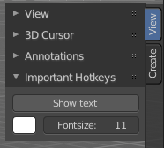

Opening and closing by menu and hotkey
--------------------------------------

The view menu provides you with menus to close and to open the Tool shelf.

It also shows the hotkey.

Resize
------

You can grab the border and drag the Sidebar to the left or to the right to expand or to close it.

Open Sidebar by Plus Button
---------------------------

When a sidebar is closed then you will see a little plus button. When you click at this button then the sidebar will reappear.

Input Devices
=============

Bforartists supports various types of input devices:

- Keyboard (recommended: keyboard with numeric keypad, english layout works best) 
- Mouse (recommended: 3 button mouse with scroll wheel) 
- NDOF Devices (also known as **3D Mouse**) 
- Graphic Tablets 

Non English Keyboard
--------------------

If you use a keyboard with a non-english keyboard layout, you may stumble across bugs and quirks and odd behaviours. Blender was developed for and with the UK or US layout. Some quirks for other keyboard layouts slipped through. And quite a few of those old bugs are still unfixed in Bforartists too.

